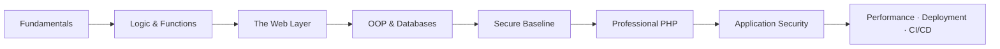

# Secure PHP Development

> A one-month, lab-driven course on **writing secure PHP and reviewing it like an attacker** — from language fundamentals and modern PHP 8.2/8.3, through OOP, databases, and REST APIs, to a full OWASP-mapped catalogue of PHP vulnerabilities with exploit-then-fix labs. Build it correctly, then learn exactly how it breaks.

**Curriculum home:** Armour Infosec Vault

---

## Course Information

| Property | Value |
|----------|-------|
| **Course Title** | Secure PHP Development |
| **Folder** | `Secure-PHP-Development/` |
| **Tag** | Secure PHP Development |
| **Slug** | `php-sec` |
| **Level** | Beginner to Intermediate |
| **Duration** | 1 Month (4 Weeks · 1 Hour/Day · ~30 Hours) |
| **Focus** | Secure Application Development |
| **Reference Runtime** | PHP 8.2 · PHP 8.3 |
| **Modules** | 31 |
| **Delivery** | Self-paced notes + hands-on labs |
| **Language** | English |

> [!NOTE]
> **What this course is**
> A study-and-practice track built as an Obsidian knowledge base. Each module is a folder with its own `Readme` hub and a set of deep-dive notes containing tagged, copy-ready PHP, SQL, and shell snippets. It is designed to be read in order but is fully cross-linked for reference use.

> [!WARNING]
> **Educational use only**
> Every vulnerable code sample is clearly labelled (`// VULNERABLE`) and paired with a secure counterpart, and every exploitation walkthrough is documented at a study / detection / remediation level for use **only on applications and environments you own or are explicitly authorized to test** (your own lab, a CTF, an authorized engagement). Run the labs in a disposable local environment (`php -S` or Docker), never against systems you do not control.

---

## Course Description

Master secure PHP development end to end: the language and modern PHP 8.2/8.3, the web request layer (superglobals, forms, validation, headers, file handling), object-orientation and MySQL access through PDO, professional tooling (Composer, PSR standards, architecture, testing, static analysis), and a full application-security track covering the OWASP Top 10 and PHP-specific vulnerabilities — authentication, cryptography, and REST APIs included.

The program is delivered through extensive, reproducible hands-on labs written from a defensive **and** offensive perspective, so every vulnerability class is paired with a working exploit *and* the secure, idiomatic PHP that fixes it.

---

## Overview

The **Secure PHP Development** program provides practical, job-ready skills across modern PHP, application architecture, database access, and web application security. It assumes only basic programming familiarity and progresses to exploiting and remediating real vulnerabilities.

By the end of the course, students will be able to:

- Write clean, modern PHP 8.2/8.3 with `declare(strict_types=1)` and PSR-12 style
- Handle web input safely — superglobals, forms, validation, and file uploads
- Model data and query MySQL **exclusively through PDO prepared statements**
- Structure applications with OOP, SOLID, and common design patterns
- Manage dependencies with Composer and enforce quality with tests and static analysis
- Identify and exploit the OWASP Top 10 and PHP-specific vulnerabilities in a lab
- Remediate each vulnerability class with a secure, idiomatic PHP fix
- Build secure authentication — password hashing, sessions, MFA, and RBAC
- Apply cryptography correctly with libsodium (hashing, encryption, key management)
- Design and secure REST APIs with JWT, versioning, and rate limiting
- Profile, tune, and deploy hardened PHP behind PHP-FPM and a reverse proxy
- Automate testing, security gates, and deployment with CI/CD

> [!TIP]
> **Build it correctly, then break it**
> Security is taught alongside development, not bolted on at the end. Each vulnerability is presented as an exploit-then-fix pair — you learn exactly how it breaks *and* the secure version that prevents it.

---

## Learning Path

The 31 modules are sequenced into eight progressive stages. Complete each stage before advancing; later security and operations modules assume the fundamentals from earlier stages.

```text
Stage 1  Fundamentals ......... Introduction · Dev Environment · First Steps · Data Types
Stage 2  Logic & Functions .... Control Structures · Functions & Scope
Stage 3  The Web Layer ........ Superglobals · Forms & Validation · Regex · Dynamic Pages
                                Headers · Encode/Decode · File Handling · Debugging
Stage 4  OOP & Databases ...... OOP · MySQL · PHP + MySQL (PDO)
Stage 5  Secure Baseline ...... Secure PHP Development Practices
Stage 6  Professional PHP ..... Modern PHP · Composer · PSR · Architecture · Testing · Static Analysis
Stage 7  Application Security . Security (OWASP) · Authentication · Cryptography · REST APIs
Stage 8  Operations ........... Performance · Deployment · CI/CD
```



> [!IMPORTANT]
> **Prerequisite chaining**
> The Application Security stage (Stage 7) depends on the Secure Baseline (Stage 5) and OOP & Databases (Stage 4). Attempting the SQL-injection, object-injection, or authentication labs without PDO, sessions, and OOP will leave gaps in both the exploit and the fix.

---

## Prerequisites

| Requirement | Level | Notes |
|-------------|-------|-------|
| Basic programming concepts | Recommended | Variables, loops, functions in any language |
| HTML & HTTP basics | Recommended | Requests, responses, forms — reinforced in-course |
| Command-line familiarity | Recommended | Running `php` and `composer` from a terminal |
| Prior PHP experience | Not required | The course starts from language fundamentals |
| A local machine (Linux/macOS/Windows) | Required | To install PHP 8.2/8.3 and MySQL/MariaDB |

> [!TIP]
> **No PHP background needed**
> The first two stages assume zero prior PHP. If you already write PHP, you can skim Stages 1–2 and start at The Web Layer or the Secure Baseline.

---

## Software Requirements

| Component | Recommended | Purpose |
|-----------|-------------|---------|
| **PHP runtime** | PHP 8.2 or 8.3 (CLI + FPM) | The language runtime for every example |
| **Database** | MySQL 8 *or* MariaDB 10.6+ | PDO examples, schema design, CRUD labs |
| **Dependency manager** | Composer 2.x | Autoloading (PSR-4), packages, tooling |
| **Web server** | PHP built-in server (`php -S`), or Nginx/Apache | Serving apps locally and in deployment labs |
| **Editor** | VS Code / PhpStorm + Xdebug | Editing and step-debugging |
| **Browser + HTTP client** | Any modern browser · curl / Postman | Testing dynamic pages and REST APIs |
| **Optional** | Docker / Docker Compose | Reproducible, disposable lab environments |

> [!WARNING]
> **Run the vulnerability labs in isolation**
> Every `// VULNERABLE` snippet is intentionally exploitable. Keep the labs on a disposable local environment — never expose them on a shared network or copy the vulnerable half into a real application.

---

## Development Environment

The "lab" for this course is a local PHP + MySQL install (or a container). Later modules add a reverse proxy, PHP-FPM, and CI tooling.

```bash
# Check for an existing PHP install
php -v

# Debian / Ubuntu / Kali — PHP 8.3 + MySQL client + common extensions
sudo apt update
sudo apt install -y php php-cli php-mysql php-mbstring php-xml php-curl mariadb-server

# Composer (dependency manager)
php -r "copy('https://getcomposer.org/installer', 'composer-setup.php');"
sudo php composer-setup.php --install-dir=/usr/local/bin --filename=composer
```

```bash
# Serve a project with PHP's built-in development server
php -S localhost:8000 -t public/

# Or run everything in disposable containers
docker compose up -d
```

> [!TIP]
> **Keep it disposable**
> Use a throwaway local environment (the built-in server or a container) for the labs. Reset it freely — nothing here should touch a machine or database you rely on.

---

## Course Modules

**31 teaching modules** grouped into eight progressive stages, each linking to the module's own `Readme` hub — plus the [Labs](Labs/Readme.md), [Mini-Projects](Mini-Projects/Readme.md), and [Flashcards](Flashcards/Readme.md) collections (below) for **34 folders total**.

### Stage 1 · Fundamentals

| # | Module | Focus |
|---|--------|-------|
| 1 | [Introduction to PHP](Introduction-to-PHP/Readme.md) | What PHP is, its history, the request lifecycle, where PHP runs in the stack |
| 2 | [Development Environment Setup](Development-Environment/Readme.md) | Installing PHP 8.2/8.3, a web server, and Composer; editor and debugging setup |
| 3 | [First Steps in PHP](First-Steps-in-PHP/Readme.md) | Syntax, `echo`/`print`, running scripts, embedding PHP in HTML |
| 4 | [Variables & Data Types](PHP-Data-Types/Readme.md) | Scalars, arrays, type juggling, `strict_types`, casting |

### Stage 2 · Logic & Functions

| # | Module | Focus |
|---|--------|-------|
| 5 | [Control Structures & Loops](Control-Structures/Readme.md) | Conditionals, loops, `match`, control-flow patterns |
| 6 | [User-Defined Functions & Scope](Functions-and-Scope/Readme.md) | Parameters, return types, variable scope, closures, arrow functions |

### Stage 3 · The Web Layer

| # | Module | Focus |
|---|--------|-------|
| 7 | [Superglobals, Sessions & Forms](Super-Global-Variable/Readme.md) | `$_GET`/`$_POST`/`$_SESSION`/`$_SERVER`, request data, session handling |
| 8 | [Working with Forms & Validation](Form-Validation/Readme.md) | Validating and sanitizing input with `filter_var`, error handling |
| 9 | [Regular Expressions](Regular-Expressions/Readme.md) | PCRE, `preg_*`, patterns for validation and extraction |
| 10 | [Building Dynamic Web Pages](Building-Dynamic-Web-Pages/Readme.md) | Templating, safely mixing PHP and HTML, escaping output |
| 11 | [HTTP Headers & Security Headers](Headers/Readme.md) | Headers, redirects, content types, CSP/HSTS and friends |
| 12 | [Encoding, Decoding & Hashing](Encode-and-Decode/Readme.md) | Base64/URL/JSON, `htmlspecialchars`, serialization, hashing basics |
| 13 | [File & Directory Handling](File-Handling/Readme.md) | Reading/writing files, uploads, streams, path-traversal safety |
| 14 | [Debugging & Error Handling](Debugging-and-Error-Handling/Readme.md) | Errors vs exceptions, `try`/`catch`, logging, error reporting |

### Stage 4 · OOP & Databases

| # | Module | Focus |
|---|--------|-------|
| 15 | [Object-Oriented Programming in PHP](Object-Oriented-Programming-in-PHP/Readme.md) | Classes, interfaces, traits, namespaces, visibility |
| 16 | [MySQL Fundamentals](Mysql/Readme.md) | Relational modeling, SQL, schema design, indexing |
| 17 | [PHP & MySQL Integration (CRUD)](Using-PHP-to-Access-MySQL/Readme.md) | PDO, prepared statements, transactions, migrations |

### Stage 5 · Secure Baseline

| # | Module | Focus |
|---|--------|-------|
| 18 | [Secure PHP Development Practices](Secure-PHP-Development-Practices/Readme.md) | The security baseline: input validation, output escaping, least privilege, secrets |

### Stage 6 · Professional PHP

| # | Module | Focus |
|---|--------|-------|
| 19 | [Modern PHP](Modern-PHP/Readme.md) | PHP 8.2/8.3: enums, `readonly`, fibers, attributes, named args, `match` |
| 20 | [Composer](Composer/Readme.md) | Dependency management, PSR-4 autoloading, semantic versioning |
| 21 | [PSR Standards](PSR-Standards/Readme.md) | PSR-1/4/7/12/15, coding standards, interoperability |
| 22 | [Architecture & Design Patterns](Architecture/Readme.md) | SOLID, MVC, layering, dependency injection, common patterns |
| 23 | [Testing](Testing/Readme.md) | PHPUnit, unit/integration tests, TDD, mocking, coverage |
| 24 | [Static Analysis](Static-Analysis/Readme.md) | PHPStan/Psalm, type coverage, CI integration |

### Stage 7 · Application Security

| # | Module | Focus |
|---|--------|-------|
| 25 | [Security — PHP Vulnerability Deep-Dives](Security/Readme.md) | OWASP Top 10 + PHP-specific: SQLi, XSS, CSRF, object injection, SSRF, XXE, SSTI, … |
| 26 | [Authentication & Authorization](Authentication/Readme.md) | Sessions, `password_hash`, login flows, MFA, RBAC |
| 27 | [Cryptography](Cryptography/Readme.md) | Hashing, symmetric/asymmetric encryption, libsodium, key management |
| 28 | [REST APIs](REST-API/Readme.md) | REST design, JSON, JWT, versioning, rate limiting, API security |

### Stage 8 · Operations

| # | Module | Focus |
|---|--------|-------|
| 29 | [Performance](Performance/Readme.md) | OPcache, profiling, caching strategies, query optimization |
| 30 | [Deployment](Deployment/Readme.md) | PHP-FPM, Nginx/Apache, environment config, production hardening |
| 31 | [CI/CD](CI-CD/Readme.md) | Pipelines, automated tests, security gates, deployment automation |

> [!WARNING]
> **Vulnerable code is always labelled**
> In the security modules and labs, every intentionally insecure snippet is marked `// VULNERABLE` and immediately followed by its secure replacement. Study the pair — never ship the first half.

---

## Hands-On Labs

**20 exploit-then-fix labs** — each self-contained (objective → prerequisites → walkthrough → exercises → challenge → solution → security discussion). Start at the [Labs](Labs/Readme.md) index.

| # | Lab | Primary module |
|---|-----|----------------|
| 01 | [SQL Injection](Labs/Lab-SQL-Injection.md) | Security |
| 02 | [Reflected & Stored XSS](Labs/Lab-Reflected-and-Stored-XSS.md) | Security |
| 03 | [CSRF Attack & Defense](Labs/Lab-CSRF-Attack-and-Defense.md) | Security |
| 04 | [Command Injection](Labs/Lab-Command-Injection.md) | Security |
| 05 | [LFI to RCE](Labs/Lab-LFI-to-RCE.md) | Security |
| 06 | [PHP Object Injection](Labs/Lab-PHP-Object-Injection.md) | Security |
| 07 | [Insecure Deserialization](Labs/Lab-Insecure-Deserialization.md) | Security |
| 08 | [File Upload Security](Labs/Lab-File-Upload-Security.md) | File & Directory Handling |
| 09 | [Secure Login System](Labs/Lab-Secure-Login-System.md) | Authentication |
| 10 | [Password Reset Flow](Labs/Lab-Password-Reset-Flow.md) | Authentication |
| 11 | [RBAC Authorization](Labs/Lab-RBAC-Authorization.md) | Authentication |
| 12 | [JWT Authentication](Labs/Lab-JWT-Authentication.md) | REST APIs |
| 13 | [Building a REST API](Labs/Lab-Building-a-REST-API.md) | REST APIs |
| 14 | [Rate Limiting](Labs/Lab-Rate-Limiting.md) | REST APIs |
| 15 | [PDO Transactions](Labs/Lab-PDO-Transactions.md) | PHP & MySQL Integration |
| 16 | [Encrypting Data with Libsodium](Labs/Lab-Encrypting-Data-with-Libsodium.md) | Cryptography |
| 17 | [Static Analysis with PHPStan](Labs/Lab-Static-Analysis-with-PHPStan.md) | Static Analysis |
| 18 | [CI Pipeline with Security Gates](Labs/Lab-CI-Pipeline-with-Security-Gates.md) | CI/CD |
| 19 | [Dockerizing a PHP App](Labs/Lab-Dockerizing-a-PHP-App.md) | Deployment |
| 20 | [Profiling & OPcache Tuning](Labs/Lab-Profiling-and-Opcache-Tuning.md) | Performance |

---

## Mini Projects

**16 secure mini-projects & capstones** — each a self-contained build that combines several modules into a working, hardened application. Start at the [Mini-Projects](Mini-Projects/Readme.md) index.

| # | Project | Integrates |
|---|---------|------------|
| 01 | [Contact Form](Mini-Projects/Contact-Form.md) | Form validation, CSRF, mail |
| 02 | [User Management CRUD](Mini-Projects/User-Management-CRUD.md) | PDO, OOP, validation |
| 03 | [Login System](Mini-Projects/Login-System.md) | Sessions, `password_hash`, CSRF |
| 04 | [Authentication System](Mini-Projects/Authentication-System.md) | Auth, MFA, RBAC, sessions |
| 05 | [Blog System](Mini-Projects/Blog-System.md) | CRUD, auth, templating, output escaping |
| 06 | [Admin Dashboard](Mini-Projects/Admin-Dashboard.md) | RBAC, CRUD, authentication |
| 07 | [Task Manager](Mini-Projects/Task-Manager.md) | CRUD, sessions, REST endpoints |
| 08 | [File Upload Handler](Mini-Projects/File-Upload-Handler.md) | File handling, upload security |
| 09 | [File Sharing Platform](Mini-Projects/File-Sharing-Platform.md) | Uploads, auth, access control |
| 10 | [Inventory System](Mini-Projects/Inventory-System.md) | PDO transactions, CRUD |
| 11 | [Expense Tracker](Mini-Projects/Expense-Tracker.md) | CRUD, authentication, reporting |
| 12 | [Student Management System](Mini-Projects/Student-Management-System.md) | PDO, CRUD, reporting |
| 13 | [Secure Chat Application](Mini-Projects/Secure-Chat-Application.md) | Auth, cryptography, sessions |
| 14 | [Password Manager](Mini-Projects/Password-Manager.md) | Cryptography, libsodium, auth |
| 15 | [URL Shortener](Mini-Projects/URL-Shortener.md) | REST, database, rate limiting |
| 16 | [REST API](Mini-Projects/REST-API.md) | REST design, JWT, versioning |

---

## Flashcards

**5 spaced-repetition decks** of `Q::A` cards for exam-style revision across the course's core domains. Start at the [Flashcards](Flashcards/Readme.md) index.

| Deck | Focus |
|------|-------|
| [Security](Flashcards/Security-Flashcards.md) | OWASP Top 10 and PHP-specific vulnerabilities |
| [Authentication & Cryptography](Flashcards/Authentication-and-Cryptography-Flashcards.md) | Sessions, hashing, encryption, key management |
| [Database & REST API](Flashcards/Database-and-REST-API-Flashcards.md) | PDO, SQL, REST design, JWT |
| [Modern PHP](Flashcards/Modern-PHP-Flashcards.md) | PHP 8.2/8.3 features, types, Composer, PSR |
| [Architecture & Standards](Flashcards/Architecture-and-Standards-Flashcards.md) | SOLID, design patterns, testing, static analysis |

---

## Learning Outcomes

On completion, a student can:

| Domain | Outcome |
|--------|---------|
| **Modern PHP** | Write typed, PSR-12 PHP 8.2/8.3 using OOP, SOLID, and design patterns |
| **Data access** | Query MySQL exclusively through PDO prepared statements and transactions |
| **Web security** | Recognize, exploit, and remediate the OWASP Top 10 and PHP-specific vulns |
| **Authentication** | Build secure login, password, MFA, and RBAC flows |
| **Cryptography** | Apply hashing and encryption correctly with libsodium |
| **APIs** | Design and secure REST APIs with JWT, versioning, and rate limiting |
| **Quality** | Enforce correctness with PHPUnit tests and PHPStan static analysis |
| **Delivery** | Deploy hardened PHP behind PHP-FPM/Nginx and automate it with CI/CD |

---

## Certification & Skills Alignment

This course's content is exam-relevant preparation and role-focused skill building — not a guarantee of passing any exam.

| Target | Alignment | Strongly covered | Partially covered |
|--------|-----------|------------------|-------------------|
| **OWASP Top 10 (2021) competency** | ⭐⭐⭐⭐ High | Injection, broken access control, cryptographic failures, SSRF, insecure design | Formal threat-modeling process depth |
| **Secure-coding / AppSec developer role** | ⭐⭐⭐⭐ High | Secure PHP patterns, vulnerability remediation, authentication, API security | Non-PHP language ecosystems |
| **Zend Certified PHP Engineer (ZCPE)** | ⭐⭐⭐ Moderate | OOP, arrays/strings, databases (PDO), security, web features | I/O streams and some SPL/data-format edge topics |

> [!TIP]
> **Best-fit target**
> The security depth here maps most directly to **secure-coding / AppSec developer** competency and the **OWASP Top 10**; the language and OOP breadth additionally supports the ZCPE.

---

## References

- The PHP Manual — <https://www.php.net/manual/>
- PHP: The Right Way — <https://phptherightway.com/>
- PHP-FIG (PSR Standards) — <https://www.php-fig.org/psr/>
- Composer Documentation — <https://getcomposer.org/doc/>
- OWASP Top 10 — <https://owasp.org/www-project-top-ten/>
- OWASP Cheat Sheet Series — <https://cheatsheetseries.owasp.org/>
- Paragon Initiative (PHP security) — <https://paragonie.com/blog>
- libsodium Documentation — <https://doc.libsodium.org/>
- PHPUnit Documentation — <https://docs.phpunit.de/>
- PHPStan Documentation — <https://phpstan.org/user-guide/getting-started>

---

## Related Courses

Sibling courses in this vault that pair well with Secure PHP Development:

- Linux Administration & Server Hardening — administer and harden the Linux / Nginx / PHP-FPM stack these apps run on.
- Secure WordPress Administration — apply secure PHP practices to the world's most-attacked PHP CMS.
- Python for Security Professionals — scripting and automation beyond PHP.

See also the course hub [Secure PHP Development](Readme.md).

---

## Contribution

Contributions that improve accuracy, add labs, or deepen module notes are welcome.

| Guideline | Detail |
|-----------|--------|
| **Conventions** | Follow vault house style: one H1 per note (= filename), an intro sentence, standard sections, language-tagged code fences |
| **Links** | Use **relative Markdown links** (`[text](../Folder/Note.md)`, `[text](Note.md#heading-slug)`) — they render on GitHub and still resolve in Obsidian. Avoid `[[wikilinks]]` (GitHub does not render them). Keep link integrity when renaming/moving notes |
| **Callouts** | Use **GitHub alert** syntax — `> [!NOTE]`, `> [!TIP]`, `> [!IMPORTANT]`, `> [!WARNING]`, `> [!CAUTION]` (marker alone on its line; a title goes on the next line as `> **Title**`) |
| **Code** | Target PHP 8.2/8.3, PSR-12, `declare(strict_types=1)`; **all SQL uses PDO prepared statements** — never string-concatenate SQL |
| **Vulnerable code** | Always label intentionally insecure snippets `// VULNERABLE` and immediately follow with the secure version |
| **Scope** | Keep each note single-topic; wire new notes into the relevant module `Readme` hub |

---

## License

Content is licensed under [Creative Commons Attribution 4.0 International (CC BY 4.0)](LICENSE) — you may share and adapt it with attribution. Code samples are teaching aids: every vulnerable example is labelled and paired with a secure version — review and harden before any production use. Third-party trademarks belong to their respective owners and are referenced for identification only. Run all labs in an isolated local environment.
