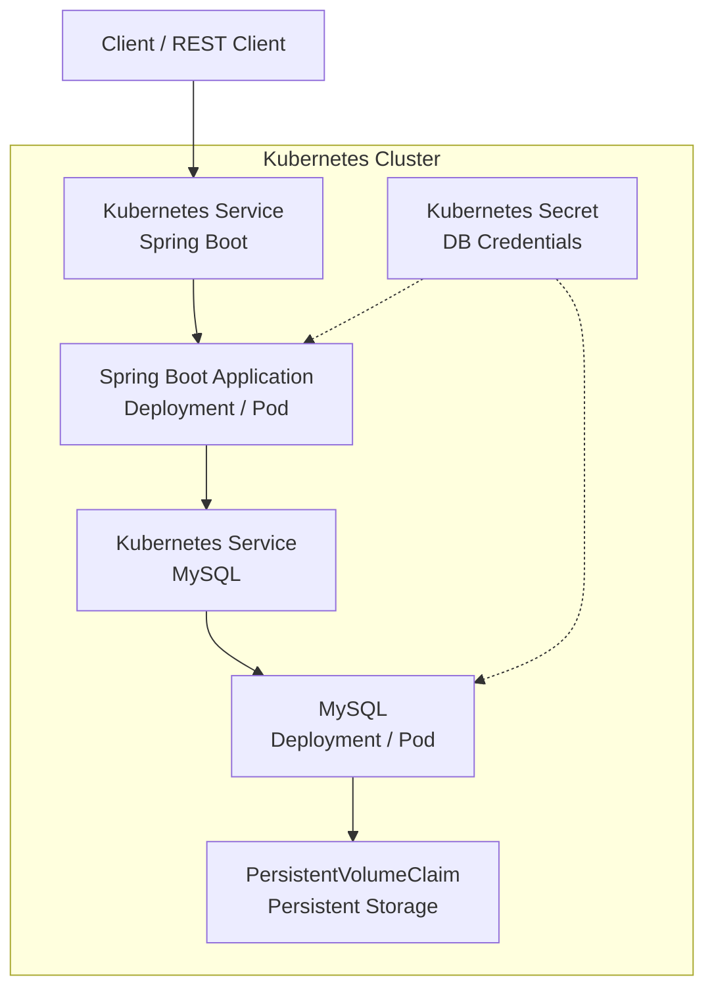

# Spring Boot + Kubernetes + MySQL

A production-style reference implementation demonstrating how to deploy a **Spring Boot application with MySQL on
Kubernetes**, including containerization, Kubernetes deployments, persistent storage, secrets management, and
service-to-database connectivity.

The project is designed to demonstrate the fundamentals of running a **stateful database and a stateless Spring Boot
application in Kubernetes**.

---

## 🎯 Problem Statement

Running a Spring Boot application locally with MySQL is straightforward, but deploying the same application to
Kubernetes introduces several architectural concerns:

- How should the Spring Boot application be packaged and deployed?
- How should the application communicate with MySQL inside the Kubernetes cluster?
- How can MySQL data survive pod/container restarts?
- How should database credentials be managed without hardcoding them in the application?
- How should Kubernetes manage application and database resources independently?
- How can a stateful component such as MySQL be deployed alongside a stateless application?

This project demonstrates a practical solution using:

- **Spring Boot** for the REST API
- **Docker** for application containerization
- **Kubernetes** for orchestration
- **MySQL** as the relational database
- **PersistentVolumeClaim (PVC)** for database persistence
- **Kubernetes Secrets** for database credentials

The goal is not only to run the application in Kubernetes, but to demonstrate the key architectural patterns required
when moving a traditional Spring Boot + database application into a containerized environment.

---

## 🏗️ High-Level Architecture

The following diagram represents the overall deployment architecture:



### Request Flow

```text
Client
  │
  ▼
Kubernetes Service
  │
  ▼
Spring Boot Pod
  │
  │ JDBC
  ▼
MySQL Kubernetes Service
  │
  ▼
MySQL Pod
  │
  ▼
PersistentVolumeClaim
```

### Key Design Principles

**Stateless application**

Spring Boot runs as a Kubernetes workload. Application instances do not own persistent state, allowing Kubernetes to
restart or recreate pods independently.

**Stateful database**

MySQL requires persistent storage. A Kubernetes `PersistentVolumeClaim` is used so database data is not tied to the
lifecycle of a MySQL pod.

**Service discovery**

The Spring Boot application connects to MySQL through a Kubernetes Service rather than using a pod IP. This allows
Kubernetes to provide stable service discovery even when pods are recreated.

**Secrets management**

Database credentials are stored in Kubernetes Secrets instead of being embedded directly into the application deployment
configuration.

---

## 🔄 Deployment Architecture

The deployment consists of the following Kubernetes resources:

| Component        | Kubernetes Resource   | Purpose                           |
|------------------|-----------------------|-----------------------------------|
| Spring Boot      | Deployment            | Runs the application              |
| Spring Boot      | Service               | Exposes the application           |
| MySQL            | Deployment            | Runs MySQL                        |
| MySQL            | Service               | Provides stable database endpoint |
| Database storage | PersistentVolumeClaim | Persists MySQL data               |
| Credentials      | Secret                | Stores database credentials       |

---

## 🧰 Technology Stack

| Technology        | Purpose                     |
|-------------------|-----------------------------|
| Java 21 LTS       | Application runtime         |
| Spring Boot       | REST API                    |
| Gradle            | Build automation            |
| Docker            | Containerization            |
| Kubernetes        | Container orchestration     |
| MySQL             | Relational database         |
| Kubernetes PVC    | Persistent database storage |
| Kubernetes Secret | Credential management       |

---

## 📋 Prerequisites

Install the following tools before starting:

- Docker Desktop with Kubernetes enabled
- Kubernetes CLI (`kubectl`)
- JDK 21 LTS
- Gradle 9.x

Verify the installation:

```bash
java -version
gradle -version
docker --version
kubectl version --client
```

Make sure Kubernetes is running:

```bash
kubectl cluster-info
```

You can use Docker Desktop's built-in Kubernetes environment for local development.

---

# 🚀 Getting Started

## 1. Clone the repository

```bash
git clone https://github.com/ashutoshsahoo/spring-boot-kubernetes-mysql.git

cd spring-boot-kubernetes-mysql
```

---

## 2. Create Kubernetes Secrets

Create the required database credentials:

```bash
kubectl apply -f deployment/secrets.yaml
```

Verify:

```bash
kubectl get secrets
```

---

## 3. Deploy MySQL

Deploy MySQL and its persistent storage:

```bash
kubectl apply -f deployment/mysql-deployment.yaml
```

Check the resources:

```bash
kubectl get pods
kubectl get svc
kubectl get pvc
```

Wait until the MySQL pod reaches `Running` state:

```bash
kubectl get pods -w
```

---

## 4. Build the Spring Boot Application

Build the application using Gradle:

```bash
gradle clean build -i --stacktrace
```

The generated JAR will be available under:

```text
build/libs/
```

---

## 5. Build the Docker Image

Build the application container:

```bash
docker build -t ashutoshsahoo/spring-boot-kubernetes-mysql:<app-version> .
```

For example:

```bash
docker build -t ashutoshsahoo/spring-boot-kubernetes-mysql:1.0.0 .
```

Verify the image:

```bash
docker images | grep spring-boot-kubernetes-mysql
```

> If you are using Docker Desktop's Kubernetes environment, the Kubernetes cluster can use images available in the
> Docker environment without requiring an external container registry.

---

## 6. Deploy Spring Boot to Kubernetes

Deploy the application:

```bash
kubectl apply -f deployment/app-k8s.yaml
```

Check the deployment:

```bash
kubectl get deployment
```

Check the application pod:

```bash
kubectl get pods
```

Check the service:

```bash
kubectl get svc
```

---

# 🔍 Verify the Deployment

A healthy deployment should show:

```bash
kubectl get pods
```

Example:

```text
NAME                         READY   STATUS    RESTARTS
mysql-xxxxx                  1/1     Running   0
spring-boot-xxxxx            1/1     Running   0
```

Check application logs:

```bash
kubectl logs <spring-boot-pod-name>
```

For example:

```bash
kubectl logs deployment/spring-boot-kubernetes-mysql
```

---

# 🧪 Test the Application

The application exposes the following REST endpoint:

```text
GET /api/v1/pets
```

Test using `curl`:

```bash
curl -X GET \
  http://localhost:31371/api/v1/pets \
  -H "Accept: application/json" \
  -H "Content-Type: application/json"
```

Expected response:

```json
[
  {
    "name": "Puffball",
    "owner": "Diane",
    "species": "hamster",
    "sex": "f",
    "birth": "1999-03-30",
    "death": null
  }
]
```

---

# 🔗 Kubernetes Resource Flow

The deployment can be visualized as:

```text
                    ┌───────────────────┐
                    │      Client       │
                    └─────────┬─────────┘
                              │
                              ▼
                    ┌───────────────────┐
                    │ Kubernetes        │
                    │ Service           │
                    └─────────┬─────────┘
                              │
                              ▼
                    ┌───────────────────┐
                    │ Spring Boot       │
                    │ Deployment        │
                    │                   │
                    │ REST API           │
                    └─────────┬─────────┘
                              │
                              │ JDBC
                              ▼
                    ┌───────────────────┐
                    │ MySQL Service     │
                    └─────────┬─────────┘
                              │
                              ▼
                    ┌───────────────────┐
                    │ MySQL Pod         │
                    └─────────┬─────────┘
                              │
                              ▼
                    ┌───────────────────┐
                    │ PersistentVolume  │
                    │ Claim             │
                    └───────────────────┘
```

---

# 🗂️ Project Structure

```text
spring-boot-kubernetes-mysql/
│
├── deployment/
│   ├── app-k8s.yaml
│   ├── mysql-deployment.yaml
│   └── secrets.yaml
│
├── src/
│   └── main/
│       ├── java/
│       └── resources/
│
├── Dockerfile
├── build.gradle
├── gradle.properties
├── settings.gradle
└── README.md
```

### `deployment/`

Contains the Kubernetes manifests required to deploy the application and database.

### `Dockerfile`

Defines the container image used to package the Spring Boot application.

### `build.gradle`

Defines application dependencies, build configuration and Gradle plugins.

---

# 💾 Persistent Storage

MySQL is a stateful workload and therefore requires persistent storage.

This project uses a Kubernetes `PersistentVolumeClaim` to decouple database storage from the lifecycle of the MySQL pod.

```text
MySQL Pod
    │
    ▼
PersistentVolumeClaim
    │
    ▼
Persistent Storage
```

This means that deleting/recreating the MySQL pod does not necessarily mean losing the database data, provided the
underlying persistent volume remains available.

---

# 🔐 Secrets Management

Database credentials are managed through Kubernetes Secrets.

```text
Kubernetes Secret
       │
       ├──► Spring Boot
       │
       └──► MySQL
```

This avoids putting database credentials directly into application source code.

For production environments, consider integrating a dedicated secrets-management solution such as HashiCorp Vault or a
cloud-native secret manager.

---

# 🧹 Cleanup

Delete the Spring Boot deployment:

```bash
kubectl delete -f deployment/app-k8s.yaml
```

Delete MySQL:

```bash
kubectl delete -f deployment/mysql-deployment.yaml
```

Delete the Kubernetes Secret:

```bash
kubectl delete -f deployment/secrets.yaml
```

Verify:

```bash
kubectl get pods
kubectl get svc
kubectl get pvc
kubectl get secrets
```

> Depending on the storage configuration and reclaim policy, deleting the deployment may not automatically remove the
> underlying persistent storage.

---

# 📊 Code Analysis

The project can also be analyzed using SonarQube.

Configure the SonarQube URL and authentication token in:

```text
gradle.properties
```

Then execute:

```bash
gradle clean build sonar --stacktrace
```

---

# 🎯 What This Project Demonstrates

This project provides hands-on experience with:

- Spring Boot application deployment on Kubernetes
- Docker containerization
- Kubernetes Deployments
- Kubernetes Services
- Kubernetes Secrets
- PersistentVolumeClaims
- Stateful workloads
- Stateless application deployment
- Kubernetes service discovery
- Spring Boot → MySQL connectivity
- Gradle-based builds
- Container image creation
- Kubernetes-based application lifecycle management
- SonarQube code analysis

---

# 🚀 Possible Production Enhancements

For a production-grade deployment, the architecture can be further enhanced with:

- Kubernetes `StatefulSet` for MySQL
- MySQL replication / high availability
- Helm charts
- Horizontal Pod Autoscaler (HPA)
- Readiness and liveness probes
- Resource requests and limits
- Ingress / Gateway API
- TLS termination
- External Secrets / Vault
- Prometheus and Grafana monitoring
- OpenTelemetry distributed tracing
- Centralized logging
- CI/CD using GitHub Actions
- Container image vulnerability scanning
- NetworkPolicies
- PodDisruptionBudgets

---

## 📚 References

- Spring Boot
- Kubernetes
- Docker
- MySQL
- Gradle
- SonarQube

---

## ⭐ About

This repository is a practical reference implementation for deploying a Spring Boot application with MySQL on Kubernetes
and understanding the architectural considerations involved in running both stateless and stateful workloads in a
Kubernetes environment.