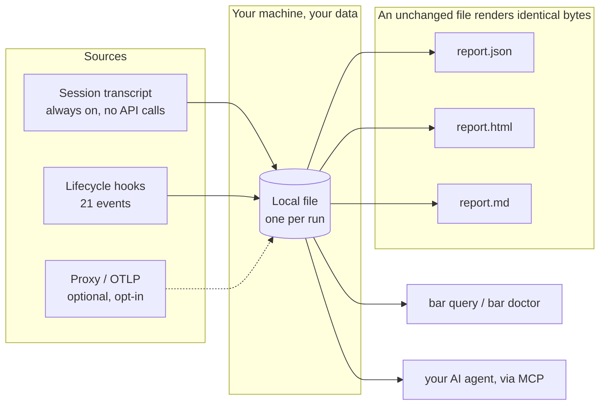

# BAR Observatory — A Flight Recorder for Claude Code

[](https://crates.io/crates/bar-observatory)
[](LICENSE)
[](#privacy-sovereignty-and-deterministic-evidence)


**BAR Observatory is a free, open-source flight recorder for Claude Code AI agent sessions.**

> **The agent gives you a summary. BAR gives you a receipt.**

Know what your AI coding agent actually did — not just what it says it did. Once installed, BAR
Observatory keeps recording automatically, every session, in the background — it's a flight
recorder, not a one-time report you run once and forget. Turn any of that recorded activity into
a report you can trust, share, or hand to another AI agent:

- **Verify completed work** — confirm tasks actually finished, not just that the agent said so.
- **Surface failures and rework** — every error and repeated edit, not just the ones mentioned.
- **Understand sub-agent activity** — see what was delegated, not just the final synthesis.
- **Create evidence you can share** — for a pull request, a reviewer, a client, or an audit trail.
- **Let future agents query past work** — check what already happened before repeating it.

**Local · deterministic · always-on capture · works retroactively · no account required**

Built for anyone running Claude Code sessions who wants to know what actually happened — from
individual developers to teams needing an audit trail, to AI agents checking their own history.

**New to command lines?** This page has technical detail further down for people evaluating the
tool. If you'd rather follow a slower, plain-language, click-along guide instead — start with
**[the plain-language guide](wiki/human-md/README.md)**, then come back here any time.

**On this page:** [Get started](#get-started) · [What you get](#what-you-get-reports-for-every-reader) ·
[Why developers use it](#why-developers-use-it) · [How it works](#how-bar-observatory-works) ·
[What's recorded](#what-bar-records-and-why-that-matters) ·
[Privacy](#privacy-sovereignty-and-deterministic-evidence) ·
[Technical details](#technical-details) · [FAQ](#faq)

---

## Get started

Inside a Claude Code session:

```
/plugin marketplace add bar181/bar-observatory
/plugin install bar-observatory@bar-observatory
/bar-init
```

That adds five commands: `/bar-init` (start here), `/bar-report` (generate the report),
`/bar-interpret` (the optional plain-English summary), `/bar-doctor` (health check), `/bar-query`
(ask the record a question directly).

The plugin needs two small helper programs on your `PATH` — one line, once:

```bash
cargo install bar-hook bar-mcp bar-observatory
```

No Rust yet? `curl https://sh.rustup.rs -sSf | sh` gets you `cargo` in about a minute. *(Disclosed
gap: the plugin doesn't bundle these automatically yet, so this one manual step remains — see
[installing without the plugin](#installing-without-the-plugin).)*

**Other ways to use BAR Observatory:** [without the plugin](#installing-without-the-plugin) — for
scripting or CI. Retroactively — point `bar ingest` at any transcript you already have, no live
recorder needed. Or let [your own AI agent read its history](#for-ai-agents-read-your-own-session-over-mcp)
over MCP.

**Need help?**
- [Plain-language setup guide](wiki/human-md/README.md)
- [What's in a report](wiki/human-html/report-guide.html)
- [Developer / architecture guide](wiki/human-md/architecture.md)
- [AI-agent guide](wiki/agent/AI-CONTEXT.md)

---

## What you get: reports for every reader

`bar report` produces one deterministic document — no AI, no cost, byte-identical every time —
and different people read it differently:

| Reader | Evidence | Optional interpretation |
| --- | --- | --- |
| **Your agents / automation** | Structured JSON | — |
| **Boss / client / quick review** | Boss Mode factual report | Executive interpretation |
| **Developer / engineering team** | Detailed Developer Guide | Engineering interpretation |

**Evidence tells you what happened. Commentary helps explain what it means. Commentary never
changes the evidence.** The optional interpretation (`bar interpret`) is written by your own
Claude Code session in one of two registers — one for engineers, one for executives — always
clearly labeled as commentary, and the evidence never depends on it existing.


*Four real artifacts, all rendered from the same captured session: [the full reports index](examples/README.md).*

## Why developers use it

**"Did the agent actually finish?"** Compare task claims against captured execution and
validation — not just the agent's own summary.

**"What failed while I wasn't watching?"** One real captured session surfaced **60 error results**
the agent's own summary never mentioned.

**"Why did this run take so long?"** Rework hotspots show repeated edits, retries, and tool
patterns worth fixing.

**"What did my sub-agents actually do?"** See delegation directly, not just the final synthesis.

**"Can my next agent learn from this run?"** Yes — the MCP layer exposes run history, reports,
findings, and cross-run context through 12 read-only tools. This is machine-readable execution
memory grounded in evidence, not just human observability of agents.

## How BAR Observatory works

**Record → Store → Report → Reuse.** This isn't a one-shot report generator — it's a flight
recorder that runs continuously. **Record is automatic**: once the plugin is installed, every
session's transcript and all 21 lifecycle hook events feed the same local file with no action
from you, session after session. **Report is on-demand**: you run `bar report` (or `/bar-report`)
whenever you want to check in, and it renders whatever's accumulated since the last time — that
file renders into JSON, HTML, and Markdown; and either a human or an AI agent, over MCP, can
query it afterward.



**At a glance:** local-only evidence · 3 report formats · 5 simple commands · retroactive
reporting · agent-readable. *(Engineering specifics — crate count, hooks, tests: see
[Technical details](#technical-details).)*

## Evidence: verified, not asserted

**99 of 101 fields matched exactly.** Every single measured figure — 60 errors, 373 test
results, 96 rework hotspots, all 17 tool counts, every classification — identical. The only two
differences (`source_db_hash`, `report.id`) are the ones this project's own docs already
disclose as expected to vary between ingests, not a correctness gap.

That's the result of a genuine outside reproduction: installing `bar-observatory` purely from
crates.io (no path dependencies, no access to any private source) and re-rendering the example
shipped in this repo, then diffing the result field by field against what's actually published
here. It's now a real, repeatable script anyone can run —
**[`tests/verify.sh`](tests/verify.sh)** — not a claim to take on faith. See
**[`wiki/human-md/verification.md`](wiki/human-md/verification.md)** for the full write-up,
including what the suite honestly can't check from the outside.

## What BAR records — and why that matters

**Capture sources** — how data gets in: the session transcript (always on, the primary path),
lifecycle hooks (21 events, on once set up), and optional proxy/OTLP capture (opt-in, for teams
that already run that infrastructure).

**What that gives you:**
- **Conversation and tool activity** → know what commands, reads, edits, tasks, and agents
  actually ran.
- **Lifecycle events** → understand session flow and agent activity over time.
- **Request/trace data, when enabled** → deeper diagnostics when transcript evidence alone isn't
  enough.
- **Coverage tracking** → BAR also tells you what it did *not* observe.

> **BAR won't pretend missing evidence means nothing happened.** An uncaptured channel is
> reported as `not_observed`, never a fabricated zero.

## Privacy, sovereignty, and deterministic evidence

**The evidence pipeline is local-only and zero-egress.** Capturing, storing, and rendering a
report all happen on your machine — no account, no API key, no telemetry. Optional AI
interpretation (`bar interpret`) is separate and opt-in: it uses your own Claude Code session to
write a plain-English summary, and the deterministic evidence never depends on it.

Worth stating plainly, because it *increases* trust rather than undermining it: a capture database
can contain full conversation content, the agent's thinking/reasoning blocks, file snapshots, and
tool inputs/outputs — treat it like any other source/session artifact, not a sanitized log. What's
stored, and what redaction options exist: **[enterprise and air-gapped use](wiki/human-md/enterprise.md)**.

None of this is a promise you have to take on faith — an unchanged database reproduces each
output byte-for-byte, today or a year from now.

---

## Technical details

[](https://www.rust-lang.org/)
[](#for-ai-agents-read-your-own-session-over-mcp)

The sections below are for engineers evaluating the tool, people integrating it into a pipeline,
AI agents reading this repository, and anyone who wants the specifics behind the claims above.
**Engineering specifics:** 16-crate engine · 16 of 17 crates published · 21 lifecycle hooks · 12 MCP
tools · 699 tests at the current published snapshot.

### Installing without the plugin

For scripting, CI, or if you'd rather not install a plugin at all:

```bash
# 1. Install
cargo install bar-observatory

# 2. Point it at a session transcript you already have
bar init --dir . && bar ingest .bar/ambient.sqlite ~/.claude/projects/<project>/<session>.jsonl

# 3. Render the deterministic report
bar report .bar/ambient.sqlite --out .
```

Full command reference, one-script version, and every flag: **[RUN.md](RUN.md)**.

> **Disclosed gap, not an oversight:** the plugin resolves `bar-hook` / `bar-mcp` via `PATH`
> rather than a bundled binary yet — harmless and never blocks a session either way.

### What's in a report

Rendered from a real, multi-thousand-turn Claude Code transcript — never a hand-authored mock.
Live samples ship in [`examples/deterministic/`](examples/) and are re-rendered as the project
evolves, so they can't drift from what the code actually does.

| Section | What it answers |
| --- | --- |
| **Task ledger** | What work was attempted, in what order, and how it resolved |
| **Tool usage / sub-agent dispatches** | Which tools got used, and what got delegated to whom |
| **Rework hotspots** | Where the agent burned effort re-doing the same work |
| **Failures + remediation** | Every error result, with its exact position and text |
| **Validation evidence** | Which checks actually ran |
| **Cost estimate** | Token-equivalent cost, or an honest *"cost not recorded"* if uncaptured |
| **Capture-channel honesty** | Which channels had data and which were blind spots |

One real example, from a captured window of 7 real sessions:

```
seq 133 — Permission to run `rm -rf …/target/debug` was denied by policy. (a guardrail refusal)
```

One of **60 error results** surfaced across that window, each still queryable months later. (Some,
like this one, are the safety system working as intended, not a defect — the deterministic layer
just records every one, without judging.) Full numbers behind that claim, nothing rounded up:
[`examples/deterministic/session.report.json`](examples/deterministic/session.report.json).

JSON, HTML, and Markdown render from the same database — not identical *to each other*, but each
byte-for-byte reproducible from an unchanged database. `report.json` is the typed contract for
pipelines and agents; its JSON Schema in [`schemas/`](schemas/) was regenerated 2026-08-21 from
three independently-rendered real reports and validates against all of them with zero errors —
previously-declared fields that no longer exist (`evidence`, `process`, `provider_usage`,
`reserved`, `story`) are gone, and the real fields that were undeclared (`cross_run_hotspots`,
`failures`, `flaky`) are now in it. Still hand-regenerated from real output rather than derived
from the Rust types at build time — a durable, build-time-generated version (from `bar-schema`'s
structs directly) is the honest next step, not yet done.

The `.html` view — this is what opens when you run `bar report`:


*Full file: [`examples/deterministic/session.report.html`](examples/deterministic/session.report.html) — open it yourself, no setup needed. Section-by-section annotated walkthrough: [wiki/human-html/report-guide.html](wiki/human-html/report-guide.html).*

### For AI agents: read your own session over MCP

```bash
claude mcp add bar-observatory -- bar-mcp --db-root .bar
```

Twelve read-only tools. **Call `get_hub` first** — it returns **[wiki/aisp/HUB.aisp](wiki/aisp/HUB.aisp)**
verbatim, which routes an agent to everything else in the record. Five tools are explicitly
cross-run (`list_runs`, `compare_conditions`, `search_observations`, `list_findings`,
`recall_context`) — they scan every database under `--db-root`, so an agent starting a new session
can ask "what did previous runs already try" before repeating it.

> **AI agents and agent swarms: read `wiki/aisp/HUB.aisp` for functionality, not this page.** It's
> a plain file in this repo — no MCP connection needed — with every CLI command and flag, all 12
> MCP tools, the full `report.json` schema, and copy-paste recipes, proof-carrying and
> self-certifying. This README is written for a human; `HUB.aisp` is written for you. Prose
> version: **[wiki/agent/AI-CONTEXT.md](wiki/agent/AI-CONTEXT.md)**.

### Architecture and crates

BAR Observatory is a thin `bar` CLI (crate `bar-observatory`) over a 16-crate `bar-*` engine —
a SQLite substrate, a transcript parser, a read-only query surface, the typed report contract,
and the MCP server, among others. Determinism comes from this architecture (a captured database,
a pure rendering path, no model in it), not from the crate boundaries themselves — those exist for
isolation and maintainability. Crate source lives and publishes from a private working repo —
**this repository is the front door, documentation, and plugin, no crate source here, by design.**

| Crate | What it does |
| --- | --- |
| [`bar-observatory`](https://crates.io/crates/bar-observatory) | The `bar` CLI — turns a Claude Code session into a deterministic, local audit report. No API key, no network calls. |
| [`bar-hook`](https://crates.io/crates/bar-hook) | Claude Code lifecycle-hook capture binary — records session events to a local SQLite audit trail, always exits 0. |
| [`bar-mcp`](https://crates.io/crates/bar-mcp) | Read-only MCP server exposing captured Claude Code session history to AI agents. |
| [`bar-ingest`](https://crates.io/crates/bar-ingest) | Parses Claude Code session transcripts (JSONL) into the local SQLite audit database. |
| [`bar-store`](https://crates.io/crates/bar-store) | SQLite storage foundation — the local, deterministic database every session capture writes through. |
| [`bar-read`](https://crates.io/crates/bar-read) | Read-only query layer over the local session database — typed queries plus a guarded raw SQL surface. |
| [`bar-schema`](https://crates.io/crates/bar-schema) | Typed Rust contract for report.json — the deterministic Claude Code session report format. |
| [`bar-metrics`](https://crates.io/crates/bar-metrics) | Computes the five-channel effort ledger — tokens, reasoning, latency, drop-rate, repair cost — for Claude Code sessions. |
| [`bar-review`](https://crates.io/crates/bar-review) | Detects rework, stalls, and failure patterns in a Claude Code session for the self-review reports. |
| [`bar-index`](https://crates.io/crates/bar-index) | Cross-run catalog and full-text search index over BAR Observatory's local Claude Code session database. |
| [`bar-obs-config`](https://crates.io/crates/bar-obs-config) | Layered TOML configuration resolver for the local-only Claude Code session auditor. |
| [`bar-root-resolve`](https://crates.io/crates/bar-root-resolve) | Shared, provenance-visible workspace- and database-root resolution used by every crate and binary. |
| [`bar-registry`](https://crates.io/crates/bar-registry) | Zero-dependency capability registry and deterministic canonical-JSON emitter for the crate suite. |
| [`bar-sanitize`](https://crates.io/crates/bar-sanitize) | Scrubs PII from a capture database to produce a publish-safe, shareable copy. |
| [`bar-proxy`](https://crates.io/crates/bar-proxy) | Transparent Anthropic API proxy that captures every Claude Code request and response for the local audit trail. *(opt-in)* |
| [`bar-otlp`](https://crates.io/crates/bar-otlp) | Native OpenTelemetry (OTLP) receiver — captures Claude Code session metrics and traces with no collector required. *(opt-in)* |
| `bar-testenv` | Pre-main test-environment isolation for the private test tree. Dev-only, not published. |

16 of these 17 crates are published; `bar-testenv` is dev-only tooling. Full list with live
crates.io status (publishing is dependency-tier-ordered, so "cleared for publish" and "live now"
can briefly differ): **[CRATES.md](CRATES.md)**.

### Testing

Two different test surfaces, on purpose — the 699-test private suite proves the engine works;
the public one below proves *this published repo* works, for anyone, with no access to that
private source:

```bash
git clone https://github.com/bar181/bar-observatory && cd bar-observatory
sh tests/verify.sh
```

Six black-box checks against the real, published crates.io artifacts: a fresh `cargo install`,
a determinism/reproducibility diff against the shipped example report, a checksum-manifest
integrity check, `bar doctor`, config validity, and a live MCP `initialize`/`tools/list`
round-trip. Expected result on a clean clone: **`6 passed, 0 failed`**, exit code `0`. Set
`SKIP_INSTALL=1` to reuse an already-installed `bar`/`bar-mcp` on `PATH` instead of reinstalling
(faster for repeat local runs; CI always does the real install). Per-check detail — what each
one verifies, why, and its exact expected output: **[tests/README.md](tests/README.md)**.

### How this compares

Most tools answer **"what is happening right now?"** BAR Observatory answers **"what happened, and
can I prove it later?"** Four differences that matter most: **retroactive** (works on a session
that already finished, unlike most tools), **a reproducible artifact** (byte-identical, not a live
view that changes underneath you), **local, no server** (one file on your machine), and
**agent-readable** (a first-class MCP surface, not an afterthought API). These compose rather than
compete — many teams run a dashboard *and* BAR Observatory. Full comparison against Langfuse,
SigNoz, and similar tools: **[wiki/human-md/comparison.md](wiki/human-md/comparison.md)**.

### What does BAR Observatory *not* see?

Stated plainly, because a measurement instrument that hides its blind spots isn't one.

> **`0 failures`** means BAR Observatory looked at the evidence and found none.
> **`not_observed`** means BAR Observatory didn't have enough evidence to make that claim at all.

- **Model-side delivery failures are invisible.** A real finding from building this documentation:
  some tool results failed to reach the model's context (an "internal error") yet were recorded
  correctly server-side. BAR reads the transcript — server-side truth — so a delivery failure *to
  the model* doesn't appear. Disclosed as a candidate future detector, not swallowed.
- **Optional modules are off by default.** Proxy and OTLP capture add channels but are opt-in.

### Guides & documentation

- **[wiki/README.html](wiki/README.html)** — the whole wiki as one page, Human / Advanced / AISP switch.
- **[Executive / client guide](wiki/human-html/guides/guide-executive.html)** — "can I trust this," in five minutes.
- **[Junior developer guide](wiki/human-html/guides/guide-junior-dev.html)** — checking AI-written code before you merge.
- **[Why the docs come in three registers](wiki/human-html/documentation-layers.html)** — human, AI, and AISP, explained.
- **[llms.txt](llms.txt)** — a machine-readable index of this repo's docs, for LLMs and crawlers.

### Glossary

- **Receipt** — a report where every claim resolves to a real, recorded fact.
- **Deterministic render** — output that's a pure function of the database; no model, network, or clock.
- **`not_observed`** — an explicit absence state; no data, and says so, instead of a fake zero.
- **Capture channel** — one source of session facts (transcript, hooks, proxy, OTLP).
- **Rework hotspot** — a file or task the agent returned to repeatedly.
- **AISP** — the author's own symbolic AI-to-AI instruction language; an optional annotation layer
  on agent-facing docs here, never a runtime dependency of `bar`.

---

## FAQ

### Is my data private? Do I need an Anthropic API key?
No key needed, and yes, it's private. The primary path — parsing a transcript already on your
disk — makes zero network calls; nothing in the capture, storage, or render path calls a model.
The source is MIT-licensed so you can verify that rather than trust it. For exactly what ends up
in the file — including that it stores real message text, not just counts — see
[what data actually gets stored](wiki/human-md/enterprise.md#what-data-actually-gets-stored).

### Do I need to know how to code?
No — the plugin's slash commands don't require it. You'll type a couple of terminal commands once
during setup (or have a technical teammate do that); the
[plain-language guide](wiki/human-md/README.md) walks through exactly what to type, including how
to open a terminal for the first time.

### Does it work on Windows, Mac, and Linux? With agents other than Claude Code?
All three OSes, yes — a standard Rust program, `cargo install` covers it. Other agent tools, not
today — the transcript parser is built specifically around Claude Code's session format; if that
changes, it'll be stated plainly here, not implied.

### Is BAR Observatory affiliated with Anthropic?
No. It's an independent open-source project, built for Claude Code but not endorsed by or
affiliated with Anthropic.

### How do I get help or report a problem?
Open an [issue](https://github.com/bar181/bar-observatory/issues). Security reports go through
[SECURITY.md](SECURITY.md). Contributions: [CONTRIBUTING.md](CONTRIBUTING.md).

## Where things stand

Version 0.3.0 is live on crates.io — the full pipeline is built, tested end to end (716 tests),
and verified the same way you'd use it: a genuine `cargo install --locked` from the published
registry, then a real `init`/`ingest`/`report`/`doctor` run against the installed binary, not
just a passing test suite. Existing data migrates automatically on your next command if you're
coming from an earlier install. The one thing still catching up: the plugin doesn't bundle its
helper programs yet (see the [disclosed gap](#installing-without-the-plugin) above) — that's
next.

Capture itself runs continuously once installed — every session, automatically, no action
needed. Reporting is on-demand today: nothing surfaces on its own yet when you start a new
session, so "check in with `bar report` when you want to know what happened" is the current
model, not "it tells you proactively." That's a real, disclosed gap, not a hidden limitation.

## About the author

BAR Observatory is built and maintained by **Bradley Ross**, an Agentic Engineer and architect
with 25 years in data science and software engineering, specializing in (near-)deterministic AI.
He also teaches agentics. The project exists because of a direct need from that work: auditing a
long, autonomous agent session by scrolling its transcript doesn't scale, and an agent's own
summary isn't evidence. That same insistence on checking the record — sharpened through capstone
and research work at Harvard — is why determinism and absence-honesty are requirements here, not
aspirations.

This repository is the public face of BAR Observatory: the same real crates published to
crates.io, wrapped in documentation meant to be usable immediately — install it, point it at a
session, and let the wiki explain what the numbers mean.

Connect: [linkedin.com/in/bradaross](https://www.linkedin.com/in/bradaross)

## Acknowledgements

Thanks to the people and projects that shaped this one, directly or as inspiration:

- **[ruvnet](https://github.com/ruvnet)** (Reuven Cohen) — founder of the
  [Agentics Foundation](https://agentics.org), and the inspiration behind this project's own
  custom AISP harness.
- **[QE Fleet](https://github.com/proffesor-for-testing/agentic-qe)** — the Agentic QE Framework,
  created by Dragan Spiridonov, used to help debug this project during development.
- **[ruvnet-brain](https://github.com/stuinfla/ruvnet-brain)** — a source-grounded research
  knowledge base for the RuvNet stack, built by Stuart Kerr, credited for the research behind it.
- **[AISP](https://github.com/bar181/aisp-open-core)** — the author's own symbolic specification
  protocol (AI Symbolic Programming), credited here for precision, spec-driven development with
  near-deterministic capabilities.
- **Harvard** — for the capstone and research that shaped this work.

## License

MIT — see [LICENSE](LICENSE). BAR Observatory is an independent project and is not affiliated
with or endorsed by Anthropic. "Claude" and "Claude Code" are trademarks of Anthropic. Everything
in this repository and everything published to crates.io is the complete, unrestricted tool —
there is no feature gate and no separate paid edition of what you see here. If you want a custom
deployment or a commercial application built on this, contact the author directly — see
[About the author](#about-the-author) above.
