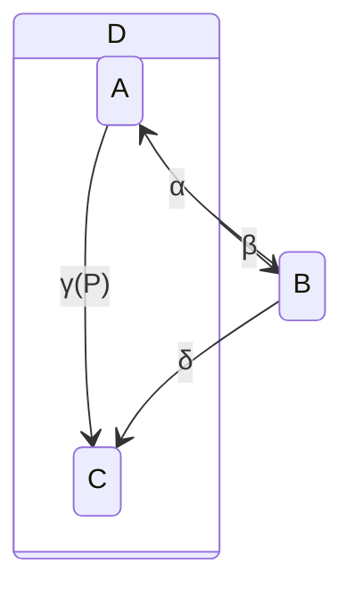

# ByzantineSystems.Automata

[](https://builtwithnix.org)
[](https://www.nuget.org/packages/ByzantineSystems.Automata.Core)


[](https://github.com/byzantine-systems/automata/actions/workflows/build.yml)


> **Statecharts** constitute a visual formalism for describing states and transitions in a modular fashion, enabling clustering, orthogonality (i.e., concurrency) and refinement, and encouraging 'zoom' capabilities for moving easily back and forth between levels of abstraction. [^1]
>
> [^1]: David Harel's 1987 paper *Statecharts: A Visual Formalism for Complex Systems*.



`ByzantineSystems.Automata` is a strongly typed [statechart](https://en.wikipedia.org/wiki/State_diagram#Harel_statechart) toolkit for F# and .NET 10. Our goal is to allow you keep domain behavior independent from runtime and infrastructure concerns, by offering:

- **Typed and validated charts**: hierarchical and terminal states, guarded transitions, entry and exit actions, event bubbling, and accumulated construction errors.
- **Deterministic core**: `Chart.resolve` is a pure function, so transition behavior can be tested without databases, clocks, or dependency injection.
- **Entity-level ordering, across processes**: at most one command per entity is claimable, so claiming it excludes that entity on every host, not only in one; unrelated entities still make progress concurrently. Idempotency keys and a gapless epoch protect committed transitions.
- **Composable durability**: storage contracts cover the command inbox, the current snapshot, the atomic end of processing a command, and action delivery. A commit appends the transition, advances the belief and queues its actions in one transaction.
- **Operational resilience**: a Polly pipeline handles short-lived driver failures inside the store, the inbox handles longer delays with a database-computed backoff, and supervision policies manage machine restarts and escalation. Work that keeps dying without an outcome is dead-lettered rather than retried forever.
- **Two time axes**: every belief records when it was true and when it was held, so you can ask what was true at 14:02 and what the system thought at 14:05, and correct the past without erasing it.
- **Maintenance included**: a blocking boot check, retention, lease reaping, drift reports and cross-process wake-ups, run by pg_cron when the database allows it and by the host when it does not.
- **Composable charts**: chart fragments are ordinary values; splice several with `yield!`, and reuse one twice with `Fragment.prefix`.

Use only the pure chart library, assemble a custom runtime from the smaller packages, or host a complete supervised machine with PostgreSQL persistence and .NET dependency injection.

## Install

Install only the layers your application needs. For pure chart construction and resolution:

```shell
dotnet add package ByzantineSystems.Automata.Core
```

To execute charts against the PostgreSQL authority:

```shell
dotnet add package ByzantineSystems.Automata.Runtime
dotnet add package ByzantineSystems.Automata.Storage.Postgres
```

To host them in a .NET Generic Host, with supervision and maintenance:

```shell
dotnet add package ByzantineSystems.Automata.DependencyInjection
```

## Example

### Define a chart

This is the basic two-state light switch from the [statecharts.dev on/off example](https://statecharts.dev/on-off-statechart.html): every `Flick` toggles the state, entering `On` emits `TurnLightOn`, and leaving it emits `TurnLightOff`.

```fsharp
open ByzantineSystems.Automata.Core

type SwitchState =
    | Off
    | On

type SwitchEvent = Flick

type SwitchAction =
    | TurnLightOn
    | TurnLightOff

let switchChart =
    statechart<SwitchState, SwitchEvent, SwitchAction, string> {
        root "switch"

        classify (function
            | Off -> stateId "off"
            | On -> stateId "on")

        state "off" {
            on (fun _ event -> event = Flick) (fun _ _ -> [], On)
        }

        state "on" {
            onEntry (fun _ _ -> [ TurnLightOn ])
            onExit (fun _ _ -> [ TurnLightOff ])
            on (fun _ event -> event = Flick) (fun _ _ -> [], Off)
        }
    }
    |> function
        | Ok chart -> chart
        | Error errors -> invalidOp $"Invalid switch chart: %A{errors}"
```

The computation expression returns `Result<Chart<_,_,_,_>, ChartError list>` and supports leaf and compound states, initial and terminal states, entry/exit actions, ordinary or fallible transitions, compound targets, and internal transitions. `Chart.create` provides the equivalent lower-level API.

Run the chart-only example directly from the repository with `dotnet fsi examples/readme.fsx`; the complete script is at [`examples/readme.fsx`](examples/readme.fsx).

A `state` or `compound` block is an ordinary value, so a piece of chart can be written once and yielded wherever it is needed, and `yield!` splices a list of them. When one chart needs the same fragment twice, `Fragment.prefix "card"` renames every node it declares, and every goto that names one, so two copies can both declare `state "failed"`. The [fragments guide](docs/fragments.md) covers the details, including the one rule it cannot enforce for you: the classifier must return the prefixed ids.

### Run the chart

Host it with a supervised worker, action delivery and database maintenance, then send it events from anywhere. The fuller version of this, with a chart built from fragments, is [`examples/ByzantineSystems.Automata.Examples.Hosted`](examples/ByzantineSystems.Automata.Examples.Hosted/Program.fs), and `make run-example-hosted` runs it.

```fsharp
open System
open System.Threading.Tasks
open ByzantineSystems.Automata.Core
open ByzantineSystems.Automata.DependencyInjection
open ByzantineSystems.Automata.Runtime
open ByzantineSystems.Automata.Storage
open ByzantineSystems.Automata.Storage.Postgres
open Microsoft.Extensions.DependencyInjection
open Microsoft.Extensions.Hosting

type LightSwitch = class end
type SwitchId = EntityId<LightSwitch>

let switches (context: PostgresContext) =
    machine<SwitchId, SwitchState, SwitchEvent, SwitchAction, string> (machineId "light-switches") {
        chart switchChart
        // Declared, never inferred: every command records the version it was resolved under.
        chartVersion 1
        initialState Off
        // JSON codecs, entity keys and a keep-everything retention policy, overridable with
        // { ... with }. The store owns the action queue, so this is the only place it is named.
        store (
            MachineStoreOptions.forEntityId<LightSwitch, SwitchState, SwitchEvent, SwitchAction, string>
                context
                "switch_actions"
            |> PostgresMachineStore
        )
    }

/// Where TurnLightOn and TurnLightOff actually go. Delivery is at least once.
type Lamp() =
    interface IActionHandler<SwitchId, SwitchAction, string> with
        member _.HandleAsync(action, _) =
            printfn "%A for %s" action.Work.Action (EntityId.value action.Work.EntityId)
            Task.FromResult(Ok())

let host (connectionString: string) =
    let context = PostgresContext.ofConnectionString connectionString
    let builder = Host.CreateApplicationBuilder()

    builder.Services
        .AddSingleton<ISupervisionEventStore>(PostgresSupervisionStore context)
        .AddScoped<IActionHandler<SwitchId, SwitchAction, string>, Lamp>()
        // A supervised worker that claims, decides and delivers.
        .AddAutomata(
            { MachineKey = "light-switches"
              Supervisor = AutomataSupervisorOptions.defaults "light-switches"
              Actions = ActionDelivery.registered<SwitchId, SwitchAction, string>
              MachineFactory = fun _ -> switches context
              ChartRegistry = fun _ -> PostgresChartRegistry { Context = context }
              TimeProvider = TimeProvider.System }
        )
        // Retention, lease reaping, drift reports and cross-process wake-ups.
        .AddAutomataMaintenance(MaintenanceOptions.defaults (fun _ -> PostgresMaintenance context))
    |> ignore

    builder.Build()

/// A caller needs the machine, not the worker: the two meet in the database, so this can run
/// in a different process from the host above.
let flick (context: PostgresContext) (hallway: SwitchId) ct =
    task {
        match switches context with
        | Error errors -> return Error $"%A{errors}"
        | Ok machine ->
            let! _ = Machine.startAsync machine (PostgresChartRegistry { Context = context }) ct

            // send is enqueue plus a wait for the durable outcome. A caller that cares more
            // about throughput uses Machine.enqueue and reads Machine.commandResult later.
            let! outcome = Machine.send machine hallway (EventEnvelope.create "hallway-flick-1" Flick) ct
            do! Machine.stopAsync machine ct
            return Ok outcome
    }
```

See the [documentation](docs/index.md), [public API guide](docs/public-api.md), [fragments guide](docs/fragments.md), and [schema evolution guide](docs/schema-evolution.md). Runnable demonstrations live under [`examples/`](examples/).

## Packages

The toolkit is published as focused building blocks. Start with `Core` for pure modeling, add the runtime and the storage implementation your application needs, and opt into Polly resilience, PostgreSQL durability, or hosted-service integration independently. The abstractions remain public at each boundary, so applications can replace infrastructure without rewriting their charts.

| Package | Implemented surface |
| --- | --- |
| `ByzantineSystems.Automata.Core` | Typed identifiers, transition rules, validated hierarchical charts, and pure event resolution |
| `ByzantineSystems.Automata.Resilience` | Polly retry, timeout, and circuit-breaker policy for a store's own I/O, plus Erlang-style supervision |
| `ByzantineSystems.Automata.Storage` | The command inbox, state reader, command processor store, and action queue contracts, plus the optional capabilities: temporal reads, corrections, boot checks, work notifications and database maintenance |
| `ByzantineSystems.Automata.Storage.Postgres` | The PostgreSQL authority: inbox, bitemporal beliefs and corrections, transition log, pgmq action delivery, maintenance routines, JSON codecs, and embedded DbUp migrations |
| `ByzantineSystems.Automata.Runtime` | The command processor, the `enqueue`/`send`/`commandResult` surface, action dispatch, observers, and machine lifecycle |
| `ByzantineSystems.Automata.DependencyInjection` | Hosted `BackgroundService` supervision with scoped action handlers and audit persistence, and `MaintenanceService` |

## Development

The project uses [devenv.sh](https://devenv.sh/), so you don't need a local .NET installation. To start a development shell:

```shell
nix develop --impure
# or
direnv allow .
```

To build the examples purely with Nix:

```shell
nix build
```

There is also a `Makefile` to control most of the development/testing workflows:

```console
make build
make test
make run-example
make run-example-supervision
make coverage
make docs
make package-smoke
```

If you have a local PostgreSQL server running:

- `make test-integration` runs PostgreSQL tests when `AUTOMATA_TEST_DB` is configured.
- `make coverage` runs every test project and generates merged Cobertura and HTML reports.
- `make migrate` applies migrations using `BS_AUTOMATA_CONN`.
- `make db-reset` resets the local disposable schema.
