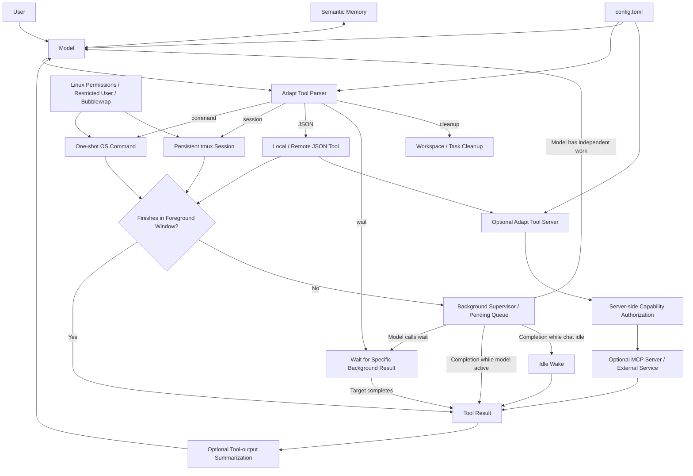

# Echo Adapt v5.1

## ADAPT — Adaptive Digital Agent Protocol & Tools

### Local-first Rust agent runtime with persistent terminal sessions, asynchronous tool supervision, configurable model-provider support, remote tools, memory, and optional Linux isolation.

> **Just want to try it?** See [QUICK_START.md](QUICK_START.md).

**Echo is the model. Adapt is the runtime.**

Adapt gives language models a controlled way to use real operating-system tools over multi-step workflows.

The basic idea is intentionally simple:

> **If a model understands that it should run a shell command, use a persistent terminal, or call a structured function, Adapt gives it a way to actually do it.**

Adapt is not tied to a large agent framework, a provider-specific tool API, or a hardcoded Jinja chat template.

I primarily use it with my own fine-tuned model, **Echo Instroder 14B**, but fine-tuning is not required. A sufficiently capable instruct or coding model can learn the included protocol from the example system prompt.

**Current status**

- Primary platform: Linux
- Windows: Windows 11 through WSL2
- Native Windows: not supported
- Development status: active / experimental
- Current runtime: Adapt v5.1
- v5.2 development includes continued MCP/tool-server work and runtime improvements

Related projects:

- [Echo Instroder 14B](https://huggingface.co/wilson-charles-e-85/Echo-Instroder-v2.2)
- [Echo Training Project](https://github.com/charlesericwilson-portfolio/Echo_training_project)
- [Echo Project Overview](https://github.com/charlesericwilson-portfolio/Echo_Project_Overview)

---

# What Adapt Is

Adapt is closer to an **execution environment for an AI model** than a conventional agent abstraction layer.

The model handles reasoning.

Adapt handles execution, state, tool boundaries, persistent sessions, background work, memory, logging, provider routing, and the operating-system interface.

The normal interaction is:

```text
user
  ↓
assistant reasoning
  ↓
tool request
  ↓
Adapt executes
  ↓
tool result
  ↓
assistant reasoning
```

For long-running work, execution and model reasoning can temporarily diverge. Adapt can move the operation into the background, allow the model to continue working, and later return the completed result as a normal tool observation.

That separation between **reasoning** and **execution state** is one of the main architectural goals of the project.

---

# Architecture



---

# Design Philosophy

## Let the operating system do operating-system things

Adapt does not try to recreate Linux permissions inside an AI framework.

It can run under the current user, a dedicated restricted Linux user, or an optional Bubblewrap-isolated environment.

Linux remains the final authority over what the Adapt process can read, write, execute, or elevate.

## Raw commands should remain raw commands

Normal CLI commands do not need a giant JSON schema.

Adapt therefore supports direct command execution and reserves structured JSON for tools where structured arguments make sense.

## Persistent tools need persistent sessions

Programs such as:

- Python REPLs
- debuggers
- database shells
- SSH sessions
- `msfconsole`
- long-running CLI applications

do not work well as isolated subprocess calls.

Adapt uses named **tmux** sessions when persistent state is required.

## Long-running work should not unnecessarily block reasoning

Commands receive a short foreground execution window.

If an operation continues running, Adapt can supervise it asynchronously while returning control to the model.

The model can then continue independent work, explicitly wait for a required result, or go idle and be resumed when completed background work becomes available.

## Tool results should be tool results

Adapt supports a configurable tool-message role.

The human did not produce command output, so Adapt does not need to pretend that tool output was another human message.

## Configuration should replace recompilation where practical

Provider selection, endpoints, prompts, message roles, tool tags, safety rules, enabled JSON tools, context thresholds, summarization, tool-server configuration, and paths are controlled through `config.toml`.

## Provider differences should stay out of the agent loop

The main agent loop should not need to know whether the model is local, remote, OpenAI-compatible, or accessed through another supported protocol.

Provider-specific request and response handling belongs in the provider layer.

---

# Core Capabilities

### Execution

- one-shot shell commands
- configurable command safety checks
- structured JSON tools
- configurable tool tags
- configurable tool-result role
- one model-generated tool action per model turn

### Persistent terminal sessions

- named tmux sessions
- session reuse
- command-specific start/end markers
- bounded output extraction
- same-session running-command protection
- inactive-session cleanup
- persistent state across tool calls

### Asynchronous execution

- short foreground execution window
- foreground-to-background handoff
- background command supervision
- queued completion events
- completed-result reinjection
- idle model wake when background work finishes
- explicit `<wait/>` for a specific dependency

### Runtime services

- semantic cross-thread memory
- Markdown-backed memory storage
- embedding-based retrieval
- optional tool-output summarization
- context compression
- SQLite tool logging
- JSONL conversation logging
- optional external context file

### Remote tools

- standalone Rust tool server
- startup tool discovery
- server-side capability enforcement
- global and instance-specific tool permissions
- external credentials kept server-side
- optional MCP interoperability

### Isolation

- normal current-user execution
- dedicated restricted Linux user
- optional Bubblewrap lockdown
- configurable deny rules
- obfuscation checks
- controlled sudo configuration

---

# Tool Protocol

The default tool syntax is deliberately small.

## One-shot command

```xml
<command>ls -lah</command>
```

Use this for ordinary shell commands that do not need persistent terminal state.

## Persistent session

```xml
<session name="python">python</session>
```

Subsequent commands can reuse the same session name.

## End session

```xml
<end_session name="python"/>
```

Terminates an Adapt-managed persistent session.

## JSON tool

```xml
<json>
{
  "name": "get_current_datetime",
  "arguments": {}
}
</json>
```

JSON tools are used for structured functions, local integrations, remote tools, memory operations, web operations, and similar capabilities.

Adapt accepts several common JSON function-call envelope styles.

## Wait

```xml
<wait/>
```

`<wait/>` is a runtime control action for background work.

It means:

> **The model already knows what it needs to do next, but it requires the result of the most recently relevant backgrounded operation before continuing.**

Adapt blocks on that specific background result rather than waiting for every running operation.

If independent work remains, the model can continue working instead.

If the model goes idle without calling `<wait/>`, completed background results can still reopen the agent loop automatically.

## Cleanup

```xml
<cleanup/>
```

Cleanup removes temporary workspace artifacts and acts as a task-cleanup boundary for Adapt-managed temporary state.

Echo is trained to use this behavior directly.

---

# Background Execution

Long-running execution is one of the main differences between Adapt and a simple request/response tool loop.

A tool starts normally.

If it finishes within the foreground window, its result is returned immediately.

If it remains active, Adapt returns a background-status tool message and continues supervising it separately.

Conceptually:

```text
assistant requests tool
        ↓
foreground execution window
        ↓
still running
        ↓
background-status tool result
        ↓
model continues reasoning
```

The model then has two primary choices:

```text
independent work remains
        ↓
continue working
```

or:

```text
this result is now required
        ↓
<wait/>
        ↓
block until that specific result completes
```

Background completion does not require the human to manually restart the agent.

If completed work arrives while the chat is idle, Adapt can convert that completion into a tool turn and reopen the model loop.

This preserves the normal semantic sequence:

```text
assistant
tool
assistant
tool
assistant
```

even when the tool operation itself completes asynchronously.

Completion order is determined by the work itself rather than the order in which background jobs were started.

---

# Persistent tmux Sessions

Adapt uses tmux when execution state must survive between commands.

For each requested session, Adapt:

1. creates or reuses an Adapt-managed tmux session,
2. generates unique command markers,
3. sends the command,
4. polls the terminal pane,
5. extracts only output produced between that command's markers,
6. returns immediately if execution finishes quickly,
7. otherwise continues monitoring it asynchronously.

A session with a command already running will not accept another command until that operation finishes.

For parallel work, the model can use separate named sessions.

Example:

```text
network_scan  → running
research      → independent session
python        → independent session
```

Adapt-managed session names are internally namespaced to avoid collisions between separate Adapt processes.

Sessions are intentionally capable of surviving an Adapt chat restart.

---

# Remote Tool Server and MCP

Adapt includes an optional standalone Rust tool server for capabilities that should not be implemented directly inside the primary runtime.

When enabled, Adapt performs startup discovery through:

```text
GET /tools
```

and executes permitted remote tools through:

```text
POST /execute
```

The model continues using the normal Adapt JSON tool format.

It does **not** need to learn a separate protocol for remote tools.

Example:

```json
{
  "name": "tool_name",
  "arguments": {
    "example": "value"
  }
}
```

## Capability authorization

The server maintains its own registry and permission configuration.

Capabilities can be:

```text
global
+
instance-specific
=
effective tools for that Adapt instance
```

Example:

```toml
[global]
allowed_tools = ["web_search"]

[instances.default]
allowed_tools = ["echo_message"]
```

`GET /tools` exposes only capabilities available to the requesting instance.

`POST /execute` performs authorization again before dispatching the tool.

Discovery is therefore **not** treated as the security boundary.

An unauthorized client cannot gain access simply by manually constructing the tool call.

## Instance configuration

```toml
[tool_server]
enabled = true
url = "http://127.0.0.1:9000"
auth_token = "YOUR_TOOL_SERVER_TOKEN"
instance_id = "default"
```

The Bearer token authenticates access to the server.

The instance ID selects the configured capability set.

The instance ID is an identifier, not an independent secret.

## External credentials

External API credentials can remain on the tool-server side.

For example:

```text
model
  ↓
Adapt
  ↓
tool server
  ↓
external API
```

The model can request:

```text
web_search(query)
```

without needing the underlying external-service key.

## MCP interoperability

The tool server can optionally act as an MCP client.

This allows existing MCP servers to expose capabilities through Adapt without requiring the main Adapt runtime or the model to switch to an MCP-specific tool grammar.

The tool server translates between Adapt's existing JSON interface and the MCP server.

The primary Adapt process therefore remains relatively small.

---

# Built-in JSON Tools

The current runtime includes structured tools for:

- `get_current_datetime`
- `web_search`
- `browse_page`
- `append_memory`
- `read_memory`

Enabled JSON tools are controlled through configuration.

Additional tools can be implemented locally or exposed through the standalone tool server.

The included web search implementation uses Tavily and requires your own API key if enabled.

---

# Model Provider Support

Adapt supports provider **protocols**, not a giant hardcoded list of model brands.

Current provider modes are:

| Provider | Intended use | Status |
|---|---|---|
| `local` | Local OpenAI-compatible Chat Completions server | Primary / actively tested |
| `openai_compatible` | Remote OpenAI-compatible Chat Completions API | Implemented |
| `grok` | xAI Responses-style path | Experimental |

## Local

The primary development path.

Compatible local serving software may include:

- llama.cpp
- vLLM
- SGLang
- LM Studio
- Ollama through its OpenAI-compatible interface
- TabbyAPI
- Aphrodite
- other compatible servers

The model itself can be from any family the selected server supports, provided its message/template behavior is compatible with the configured Adapt protocol.

## OpenAI-compatible

Remote APIs exposing a compatible Chat Completions interface can use the generic `openai_compatible` provider path.

Compatibility does **not** guarantee identical behavior.

Providers may differ in:

- accepted message roles
- reasoning fields
- tool-result requirements
- image handling
- context limits
- supported request fields
- response envelopes
- provider-specific features

If a provider requires a fundamentally different request or response format, that belongs in the provider layer rather than being spread throughout the agent runtime.

## Grok

The Grok provider path was derived from an earlier working proof-of-concept.

Current support should be considered experimental.

---

# Provider Configuration

Example:

```toml
[endpoint]
provider = "local"
url = "http://localhost:8080/v1/chat/completions"
model = "Echo"
api_key = ""
temperature = 0.7
max_tokens = 2048
```

If authentication is not required, `api_key` may remain empty.

Provider endpoints and model identifiers change over time. Check the selected provider's current documentation rather than assuming example URLs remain permanent.

---

# Tool-result Message Role

My own model stack uses the semantic distinction:

```text
system
user
assistant
tool
```

rather than presenting tool output as another human message.

Adapt therefore exposes the tool-result role through configuration:

```toml
[messages]
tool_role_name = "tool"
```

Some models and chat templates support additional roles cleanly.

Others are strict.

If a model only accepts `user` and `assistant`, the configured Adapt role or the model template may need to be adjusted.

Adapt cannot force an incompatible template to accept a role its parser rejects.

---

# Memory

Adapt includes persistent semantic memory.

Memory entries are stored in a human-readable Markdown file and retrieved through embeddings.

Available memory operations include:

```text
append_memory(category, content)
read_memory(query, limit)
```

Rather than injecting the entire memory file into every prompt, Adapt embeds the current query and retrieves relevant entries.

The embedding backend is configurable and can use a dedicated embedding endpoint or a compatible model path depending on the deployment.

---

# Context Management

Adapt can compress long conversation histories once a configured threshold is reached.

The summarization request is a separate inference request.

The resulting context keeps:

- the original system prompt,
- a compressed conversation summary,
- recent turns.

The threshold should leave enough room below the actual model context limit for the summarization request itself.

Adapt does not attempt to protect the user from every invalid context configuration.

---

# Tool-output Summarization

CLI applications can generate large amounts of noisy output.

Adapt can optionally send oversized tool results through a smaller summarizer model before returning them to the main model.

Typical uses include:

- scanners
- logs
- package-manager output
- debugging output
- verbose commands
- long terminal-session output

If output remains below the configured raw-output threshold, it is returned directly.

If summarization is disabled, oversized output is also returned directly.

If the summarizer is enabled but fails, Adapt warns the human and falls back to the original output rather than stopping the workflow.

The asynchronous supervisor stores raw results.

Summarization happens only after the result crosses back into the normal model-output processing path.

---

# Logging

Adapt maintains two primary forms of execution history.

## SQLite tool log

Tool activity and compact output summaries can be stored in SQLite for runtime inspection and recovery-related state.

## JSONL conversation log

Adapt also stores a sequential transcript preserving role distinctions such as:

```text
user
assistant
tool
assistant
tool
assistant
```

This is useful for:

- debugging
- evaluating agent behavior
- reviewing failure recovery
- examining tool-use trajectories
- building or reviewing training data

Logs may contain sensitive user or machine information.

---

# Security Model

Adapt's security approach is intentionally layered.

Current layers include:

- model instructions
- explicit tool syntax
- Rust-side command safety checks
- configurable deny rules
- obfuscation checks
- Linux filesystem and process permissions
- optional dedicated model user
- optional Bubblewrap isolation
- configurable sudo access
- capability enforcement on the remote tool server

No single layer should be treated as perfect protection.

The operating system remains the final authority over what the Adapt process can actually do.

---

# Execution Modes

## Normal mode

```bash
./run.sh
```

Adapt runs with the permissions of the currently signed-in user.

This provides the greatest host compatibility and the least isolation.

## Restricted mode

Configure the dedicated user:

```bash
sudo ./setup_restricted_model_user.sh
```

Run:

```bash
./run.sh --restricted
```

Adapt then executes under the dedicated `model-user` account.

The restricted environment includes its own runtime files, workspace, database, and persistent Python virtual environment.

The model user's password login is intentionally locked.

Do not manually use:

```bash
su - model-user
```

Use the provided launcher.

## Lockdown mode

Configure prerequisites:

```bash
sudo ./setup_lockdown.sh
```

Run:

```bash
./run.sh --lockdown
```

Lockdown combines the restricted Linux user with Bubblewrap namespace/filesystem isolation.

Required runtime files and writable locations are deliberately exposed to the sandbox.

Networking remains available because Adapt may require access to configured model endpoints, remote tools, package repositories, or other external services.

No execution mode makes model-controlled tools risk-free.

Choose a boundary appropriate for the data and authority exposed to the runtime.

---

# Sudo Behavior

Adapt does not collect or store the user's sudo password.

In normal mode, authentication is handled by the terminal and `sudo`.

Restricted deployments may configure specific administrator-approved sudo commands through Linux `sudoers`.

Be careful when expanding those permissions.

Allowing package installation as root, for example, can indirectly allow privileged installation scripts to execute.

---

# Cloud Model Warning

Adapt can expose command output, files, logs, memory, paths, network information, and other machine state to the selected model.

When a **cloud model provider** is used, information sent back to the model may leave the local machine.

If the workflow contains information that must remain local, confidential, proprietary, regulated, or otherwise private, use a local model and local supporting services.

Adapt defaults toward local operation.

Cloud-provider support should not be interpreted as a recommendation to give a remote model unrestricted access to a host.

---

# Workspace

A typical workspace can use:

```text
workspace/
├── temp/
├── human_review/
└── scripts/
```

Suggested use:

- `workspace/temp/` — scratch files and intermediate artifacts
- `workspace/human_review/` — finished user-facing output
- `workspace/scripts/` — reusable generated scripts

`<cleanup/>` removes temporary workspace contents when requested by the model.

---

# Configuration

`config.toml` controls most runtime behavior.

Configurable areas include:

- model provider
- endpoint
- model name
- API key
- prompts
- external context file
- tool-output summarizer
- tool tags
- enabled JSON tools
- message-role names
- memory paths
- tool server
- context thresholds
- safety rules
- command deny lists

One goal of Adapt v5 is to keep deploy-time differences in configuration instead of requiring Rust changes wherever possible.

---

# Quick Start

## 1. Clone

```bash
git clone https://github.com/charlesericwilson-portfolio/Echo_Adapt_v5
cd Echo_Adapt_v5
```

## 2. Make scripts executable

```bash
chmod +x build.sh
chmod +x run.sh
chmod +x install_deps.sh
chmod +x setup_restricted_model_user.sh
chmod +x setup_lockdown.sh
```

## 3. Install dependencies

```bash
./install_deps.sh
```

The installer includes support for several common Linux package-manager families including:

- `apt-get`
- `dnf`
- `pacman`
- `zypper`

Not every distribution has been personally tested.

## 4. Configure the runtime

Edit:

```text
config.toml
```

At minimum, configure your model endpoint.

Example:

```toml
[endpoint]
provider = "local"
url = "http://localhost:8080/v1/chat/completions"
model = "Echo"
api_key = ""
temperature = 0.7
max_tokens = 2048
```

The included prompt files are:

```text
main_system.txt
summarizer.txt
```

They are examples and starting points rather than mandatory prompts.

## 5. Start the model server

Run whatever compatible inference server you intend to use.

If tool-output summarization is enabled, also start the configured summarizer endpoint.

Ports are configurable.

## 6. Build

```bash
./build.sh
```

The build script performs a locked release build:

```bash
cargo build --release --locked
```

The resulting executable is:

```text
target/release/Adapt_v5
```

## 7. Run

Normal:

```bash
./run.sh
```

Restricted:

```bash
sudo ./setup_restricted_model_user.sh
./run.sh --restricted
```

Lockdown:

```bash
sudo ./setup_lockdown.sh
./run.sh --lockdown
```

---

# Terminal Controls

| Shortcut | Action |
|---|---|
| `Ctrl+C` | Exit current Adapt chat |
| `Ctrl+\` | Interrupt active model generation |
| `Ctrl+Alt+N` | Start another Adapt process/tab |
| `Enter` | Submit current input |
| `Backspace` | Delete input |

The launcher supports several common Linux terminal emulators, including Konsole, GNOME Terminal, Kitty, Alacritty, XFCE Terminal, and xterm.

---

# Multiple Adapt Processes

Separate Adapt processes maintain independent:

- model context
- process IDs
- active-session maps
- internally namespaced tmux sessions

This allows multiple independent conversations to use the same broader machine or workspace without sharing one global session namespace.

---

# Operating System Support

## Linux

Linux is the primary target.

Adapt relies heavily on Unix/Linux behavior including:

- `sh`
- tmux
- process execution
- users and groups
- filesystem permissions
- sudo
- common CLI utilities

## Windows 11

Adapt can run through:

```text
Windows 11
    ↓
WSL2
    ↓
Linux
    ↓
Adapt
```

I have used Adapt in this configuration.

## Native Windows

Not supported.

The runtime architecture relies heavily enough on Linux/Unix primitives that a native Windows port is not currently a design goal.

## macOS

The Linux-specific restricted-user and isolation setup should not be assumed to work on macOS.

Other parts of the runtime may work with modification, but macOS is not currently a tested platform.

---

# What Is Actually Tested

I primarily test Adapt with:

```text
Linux
+
local model server
+
my own local model stack
+
my own hardware
```

I have also used Adapt through WSL2 on Windows 11.

The local provider path is the primary regression-tested configuration.

That does **not** mean every combination of:

- Linux distribution
- model
- model server
- GPU stack
- cloud provider
- chat template
- tool-message role
- terminal emulator

has been validated.

It has not.

If something works differently on your environment, please open an issue.

Useful reports include:

```text
OS:
Distribution:
WSL2 or native Linux:
Terminal emulator:
Model:
Model server / provider:
Configured provider:
Configured tool role:
GPU / accelerator:
What you tried:
What worked:
What failed:
Error output:
```

Even a short report such as:

> "Works on Fedora."

or:

> "This template rejects role: tool."

is useful.

---

# Why Echo Is Fine-Tuned for Adapt

Fine-tuning is not required to use Adapt.

The included prompt can teach a capable model the protocol.

However, one goal of the Echo project is to train tool behavior deeply enough that the runtime protocol is already familiar to the model rather than requiring a large prompt explaining every tool decision.

Echo training examples include multi-step workflows involving:

- commands
- persistent sessions
- research
- structured tools
- web access
- memory
- debugging
- file creation
- error recovery
- document workflows
- autonomous multi-tool tasks

The current Echo Instroder model can follow the Adapt protocol with considerably less explicit protocol explanation than an untrained base model.

---

# Autonomous Workflow Example

A recent simple workflow asked Echo to research the top ten dog names, recover from an intentionally missing working-directory detail, and produce the final artifact as Markdown.

Screenshots:


[Example artifact](dog_names.md)

---

# Project History

Adapt v5 is the latest Rust runtime in a longer sequence of Echo experiments.

Earlier versions explored:

- Python-based runtimes
- separate tool processes
- tmux wrappers
- summarization services
- different model/tool protocols
- provider-specific experiments

Earlier Python designs required multiple independent processes for runtime services.

Adapt v5 moved the core runtime into Rust and consolidated much of that lifecycle and execution logic into a single application.

Older repositories remain public because they document how the architecture evolved.

See:

[Echo Project Overview](https://github.com/charlesericwilson-portfolio/Echo_Project_Overview)

---

# What Adapt Is Not

Adapt is not:

- a perfect security sandbox
- a replacement for Linux permissions
- a guarantee that a model behaves correctly
- tied to one model
- tied to llama.cpp
- dependent on LangChain
- a native Windows runtime
- a guarantee that every OpenAI-compatible provider behaves identically
- a guarantee that cloud-provider data remains local
- finished software

It is an actively developed runtime for experimenting with models that can operate real tools over longer workflows.

Do not give a model access to anything you are unwilling for that process to touch.

---

# Roadmap

Most major orchestration changes are intended for Adapt v6 rather than continuously expanding v5 into a different system.

Near-term v5.x work includes:

- multimodal image input
- continued provider compatibility testing
- MCP/tool-server interoperability
- background execution refinement
- Linux portability testing
- restricted/lockdown hardening
- UI/runtime polish

Larger v6 work is expected to explore:

- scheduled tasks
- durable background model workers
- task queues
- persistent task IDs
- saved/reloadable context
- context restoration
- integrated GUI
- terminal/session views
- thread switching
- human-review workflows
- stronger task persistence
- shared execution services

v5 background supervision should not be confused with that larger design.

v5 allows **individual tool operations** to continue asynchronously.

The planned v6 architecture extends that idea toward **entire persistent model tasks and workers**.

---

# Building on Adapt

Adapt is intended to be understandable and modifiable.

You can:

- change the tool grammar
- change the tool-result role
- replace prompts
- add JSON tools
- add remote tools
- connect MCP servers
- change model providers
- modify safety rules
- adjust Linux permissions
- change the workspace layout
- train a model specifically for your protocol

I would rather keep the runtime understandable than hide every mechanism behind another abstraction layer.

If you use it, tear it apart.

If something breaks, tell me.

If you build something interesting with it, I would like to hear about it.

---

# Created With Help From AI

AI has been used extensively throughout the Echo project as an **interactive engineering tool**.

I use AI for:

- architecture discussion
- implementation iteration
- debugging
- compiler-error analysis
- research
- model-training troubleshooting
- edge-case reasoning
- explaining unfamiliar language/runtime behavior

Different systems have helped with different parts of the project, including Grok, ChatGPT, and Gemini.

The workflow is interactive rather than one-shot generation:

```text
identify problem
→ reason about architecture
→ modify a small part
→ compile
→ inspect errors
→ test
→ observe behavior
→ revise
→ test again
```

I manually review, test, modify, and learn the code integrated into Adapt.

The public Echo repositories intentionally preserve that development history instead of presenting the current architecture as if it appeared fully formed.

---

# Contributing / Feedback

Feedback is welcome, especially from users running Adapt with different:

- Linux distributions
- model servers
- models
- cloud providers
- chat templates
- terminal emulators
- GPU stacks

Open an issue with whatever information you have.

I only know for certain what works in the environments I can personally test.

---

# Related Repositories

### Project history

[Echo Project Overview](https://github.com/charlesericwilson-portfolio/Echo_Project_Overview)

### Training

[Echo Training Project](https://github.com/charlesericwilson-portfolio/Echo_training_project)

### Model

[Echo Instroder v2.2](https://huggingface.co/wilson-charles-e-85/Echo-Instroder-v2.2)

---

# License / Use

Check the repository license before redistributing or incorporating Adapt into another project.

Adapt is experimental software.

Use permissions appropriate to the risk you are willing to accept.

When using a cloud model provider, also consider what local information may leave the machine as part of conversation context or tool feedback.
