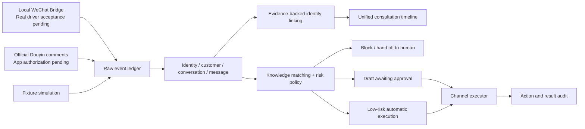

<div align="right">

**English** · [简体中文](README.zh-CN.md)

</div>

# AI Business Twin


<div align="center">

**Turn scattered social conversations into evidence-backed, stoppable, and traceable business workflows.**

A local-first, auditable social consultation workspace for small businesses, consultants, and sales teams.<br>
*面向小微商家、顾问和销售团队的本地优先、可审计社交咨询工作台。*

[](https://github.com/chenzhiyong1994/ai-business-twin/actions/workflows/verify.yml)
[](package.json)
[](package.json)
[](LICENSE)

[Quick start](#quick-start) · [Capabilities](#core-capabilities) · [Architecture](#how-it-works) · [Roadmap](docs/roadmap.md) · [Contributing](CONTRIBUTING.md)

</div>

> [!IMPORTANT]
> The current release is a **locally runnable v1.0 foundation**. The Fixture workflow and core safety invariants are covered by automated tests. A real WeChat driver/account and Douyin Open Platform review/OAuth authorization still require separate acceptance testing. This project never presents simulated data or implemented code as proof that a live channel is connected.

## Why this project exists

Many “AI customer service” demos begin with polished replies or unified customer profiles while skipping harder questions: Did the message really come from an authorized channel? Do two records actually belong to the same person? Who approved an outbound message? What did the platform return? Will a restart accidentally send it twice?

AI Business Twin puts those questions ahead of generation. It is not a bulk outreach tool or a dashboard-only CRM demo. It is a locally inspectable operating loop built around five principles:

- **Persist facts first:** raw channel events enter SQLite before identity, conversation, or policy processing;
- **Require identity evidence:** cross-channel links need a one-time challenge, a user declaration, or another auditable business basis—and remain revocable;
- **Make automation stoppable:** global and channel switches, capability contracts, and risk policies jointly decide whether outbound execution is allowed;
- **Keep decisions traceable:** drafts, edits, approvals, rejections, execution results, and backups are recorded separately;
- **Run locally:** built-in Node.js HTTP and SQLite support the complete Fixture workflow with zero third-party runtime dependencies.

## Product tour


<sub>The screenshot was generated from an isolated Fixture data directory. All names, messages, accounts, and metrics are synthetic.</sub>

### Core capabilities

| Capability | Status | Boundary |
| --- | :---: | --- |
| Raw event ledger, idempotency, and failure recovery | ✅ | Covered by Fixture automation tests |
| Customers, channel identities, and a unified consultation timeline | ✅ | Never merges identities from a nickname, avatar, or model probability alone |
| One-time challenge / human-evidence linking and revocation | ✅ | Both linking and revocation are audited |
| Knowledge allowlist and L1 / L2 / L3 policies | ✅ | v1.0 uses deterministic matching and does not pretend to be an LLM |
| High-risk blocking, review, pausing, and result auditing | ✅ | WeChat always requires human confirmation |
| Consistent SQLite backups and protected restore | ✅ | Creates a recovery copy before overwriting data |
| Local WeChat Bridge protocol and verification gate | 🟡 | Code ready; the real UI driver is not distributed and a dedicated account still needs acceptance testing |
| Official Douyin OAuth, owned-video comments, and replies | 🟡 | Code ready; requires a compliant app, approved permissions, and authorization from an owned account |
| Xiaohongshu, email, site-wide scraping, and bulk direct messages | — | Explicitly out of scope |

### Policy is not a black box


Low-risk knowledge can produce an explainable draft. Unknown questions fall back to human review. Refunds, complaints, privacy, payments, and price commitments block automatic execution. Every action can answer: **What was the input? Which rule matched? Who made the decision? What did the channel return?**

## Quick start

Requirements: Node.js **22.5 or later**. The project currently has no third-party npm dependencies, so `npm install` is not required.

```bash
git clone https://github.com/chenzhiyong1994/ai-business-twin.git
cd ai-business-twin
npm start
```

Open <http://127.0.0.1:4317>.

For a first walkthrough:

1. Add low-risk answers such as opening hours or booking instructions to the business knowledge allowlist;
2. Inject a simulated WeChat consultation or Douyin comment from the Safety Lab;
3. Inspect the customer, unified touchpoint, policy draft, and raw event ledger;
4. Try a message containing “refund” or “complaint” and observe the high-risk block;
5. Only when testing execution, manually enable both the global switch and the Fixture channel switch.

Every simulated event is explicitly marked `source_label=fixture`, so it cannot be mistaken for live channel data. Runtime data is written to the Git-ignored `data/` directory by default.

### Verify locally

```bash
npm test
npm run check
```

CI runs the same checks on Node.js 22 for both Ubuntu and Windows.

## How it works



### Automation levels

| Level | Behavior |
| --- | --- |
| **L1 Suggest** | Produces a draft and never executes it |
| **L2 Approve** | Produces a draft that an operator must approve before execution |
| **L3 Low-risk autonomy** | Executes only when low-risk knowledge matches, the connector permits it, and both global and channel switches are enabled |

The WeChat connector always uses `requiresHumanConfirm=true`, so a WeChat reply still needs human approval even when L3 is selected.

## Live-channel boundaries

### WeChat

The repository includes a loopback HTTP Bridge, token authentication, an outbox, execution-result handling, and a dedicated test-account verification gate. It does **not** include drivers that bypass platform rules, protocol cracking, anti-detection features, or bulk outreach. Outbound execution stays disabled until a real send-and-receive round trip is verified. See [docs/wechat-bridge.md](docs/wechat-bridge.md).

### Douyin

The connector uses only official OAuth and comment APIs and processes only registered videos owned by the authorized account. It does not scrape platform-wide comments, initiate direct messages, or treat API acceptance as proof that a recipient has read something. See [docs/douyin-setup.md](docs/douyin-setup.md) for setup and current verification requirements.

> WeChat, 微信, Douyin, and 抖音 are trademarks of their respective owners. This independent open-source project is not affiliated with or endorsed by those platforms.

## Security and privacy

- The server listens on `127.0.0.1` by default and should not be exposed directly to a LAN or the public internet;
- Global and channel automation reset to off at startup and follow Fail-Closed behavior;
- OAuth tokens are wrapped locally with AES-256-GCM, while keys and databases remain in Git-ignored local directories;
- Business message bodies still live in local SQLite; application-level wrapping is not a replacement for an operating-system key store;
- Actions left in `sending` after an abnormal restart become uncertain and are never retried blindly;
- Examples, tests, and public screenshots use only synthetic identities and Fixture data.

Please do not disclose exploit details in a public Issue. Follow [SECURITY.md](SECURITY.md) instead.

## Repository layout

```text
src/                  runtime, database, policies, and connectors
public/               zero-build operations console
test/                 native Node.js tests
scripts/              checks, soak testing, and restore tools
docs/                 product, channel, runtime, and ADR documentation
.github/              CI, Issue forms, and PR templates
```

## Documentation map

- [Product framework and truthfulness rules](docs/product-framework.md)
- [Channel strategy and capability boundaries](docs/channel-strategy.md)
- [Local runtime, APIs, and data model](docs/local-runtime.md)
- [Local WeChat Bridge protocol](docs/wechat-bridge.md)
- [Douyin Open Platform setup](docs/douyin-setup.md)
- [v0.2–v1.0 roadmap and release gates](docs/roadmap.md)
- [Architecture decision records](docs/decisions/)

## Who should get involved

Contributions are especially welcome from people interested in:

- local-first software, event sourcing, and recoverable operations;
- Agent safety policies, approval workflows, and explainable evaluation;
- compliant connectors and acceptance testing for Chinese social platforms;
- privacy-respecting cross-channel identity models;
- low-friction operating experiences for small businesses.

Start with [CONTRIBUTING.md](CONTRIBUTING.md). If you are solving a similar problem, open an Issue with the real scenario, constraints, and verification evidence you can share.

## License

[MIT](LICENSE) © chenzhiyong1994 and contributors.
