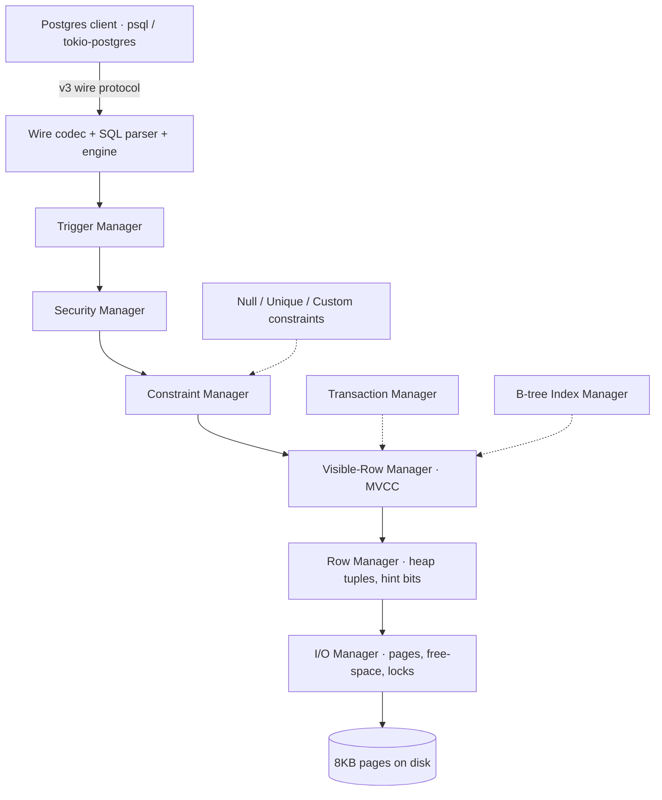

# FeOphant

A SQL database server I wrote from scratch in Rust — point `psql` at it and run a query, real rows come back. ~10,000 lines of database internals, built by hand in 2021, before GenAI existed. If you want a look at how I think through a hard system with no assistant in the loop, this is the cleanest one I've got.

## What's under it

Real subsystems, not a SQL-string-to-HashMap toy:

- **Postgres v3 wire protocol** — a hand-written decoder/encoder, startup and SSL negotiation. Real Postgres clients connect with no shim.
- **Heap storage** — 8KB pages laid out like Postgres's own (page header, item pointers, per-row `info_mask` hint bits and a null bitmap). Rows hit disk and come back.
- **B-tree index** — leaf and branch nodes, node splits and the search down to a leaf. It's what enforces the primary key.
- **MVCC** — a transaction manager off Postgres's clog model, visibility computed from the hint bits. It gets its OWN test suite, because visibility is the corner I trusted myself on least.
- **System catalogs** — `pg_class`, `pg_attribute`, `pg_index` and `pg_constraint`, so a real client can introspect the schema.

One query walks the whole stack:



## Where I diverged from Postgres (on purpose)

Copying Postgres exactly would've taught me nothing, so I changed the parts worth changing:

- **async/Tokio, not multi-process shared memory** — a different concurrency model on purpose (and no SYSV shared memory to babysit).
- **64/128-bit transaction IDs and UUIDs instead of OIDs** — to make the vacuum / transaction-ID-wraparound problem just go away. That quibble is what started the whole thing.
- **Schema-as-code** — the idea I was chasing: your schema IS your binary. Change it by shipping a new binary, and the compiler drops whatever your workload never touches. On-disk format migration is the hard part (it's where I stopped).

## What works

Connect any Postgres driver (unauthenticated), `CREATE TABLE`, `INSERT` and `SELECT` against a single table. Data survives a restart.

Proven in the tests, not just asserted:

- real clients drive it — the suite runs on [`tokio-postgres`](https://github.com/chotchki/feophant/blob/main/tests/sql_simple_select.rs)
- the primary key holds — [a duplicate insert FAILS](https://github.com/chotchki/feophant/blob/main/tests/sql_primary_key_insert.rs)
- MVCC visibility has [its own suite](https://github.com/chotchki/feophant/blob/main/tests/visibility_tests.rs)
- persistence is real — [a benchmark](https://github.com/chotchki/feophant/blob/main/benches/feophant_benchmark.rs) tears down the row manager, rebuilds it from disk and re-reads all 500 rows

## What's not done

Paused in 2021. No WAL, so it is NOT crash-safe — a `kill -9` mid-write can leave the on-disk format inconsistent, and that format isn't stable across versions. Single-table only, no joins. It's a database CORE, not a finished database.

The honest reason it stopped: I needed a parser combinator nom didn't have — `take_until_parser_matches`, to scan forward across multiple SQL statements — and got stuck trying to upstream it ([nom#1441](https://github.com/rust-bakery/nom/pull/1441)). The PR stalled, I was carrying [my own fork](https://github.com/chotchki/nom/tree/take_until_parser_matches), and the side project lost its thread there.

## Run it

```
cargo run                        # start the server
psql -h 127.0.0.1 -p 50000       # connect a real client and query it
```

## License

AGPL-3.0-or-later — 100% my code, so the license is a choice, not an inheritance.
