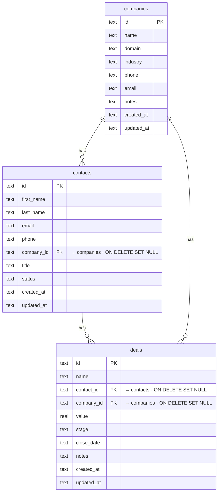

# OpenCRM: The Open-Source HubSpot Alternative for SaaS

[](https://app.clawnify.com/deploy?repo=clawnify/OpenCRM)

A lightweight CRM with contacts, companies, and deals — built for SaaS dashboards and AI agents. Part of the [OpenClaw](https://github.com/openclaw/openclaw) ecosystem. Zero cloud dependencies — runs locally with SQLite.

Built with **React + Tailwind + shadcn/ui** on **Hono + Cloudflare D1**. Path-based routing, UUID keys, a dark mode that follows the OS, and a dual-mode UI: one for humans and one for AI agents (larger targets, always-visible actions).

## What Is It?

OpenCRM is a production-ready contact relationship manager designed for the OpenClaw community. Think of it as an open-source HubSpot alternative — a CRM you can self-host, customize, and embed in any SaaS product.

Unlike HubSpot or Salesforce, this runs entirely on your own infrastructure with no API keys, no vendor lock-in, and no per-seat pricing. It provides a complete sales pipeline and lead management system. Manage contacts, companies, and deals with rich column types, inline editing, and full CRUD — all out of the box.

## Features

- **Three entities** — contacts, companies, and deals with foreign-key relationships (UUID keys, not enumerable ids)
- **Activity timeline** — every contact/company/deal has a feed; emails, meetings, notes, and deal-won events all log to it
- **Integrations (Clawnify connections)** — email a contact via Gmail, schedule a Google Calendar meeting, and post to Slack when a deal is won — all through the org's Clawnify connections, no keys in the app. A Google Workspace connection stands in for Gmail or Calendar when either isn't connected on its own
- **AI columns**: hover a column (Industry, Title, your own attributes) and click the spark to have AI fill its empty cells from the rest of each record, with your instructions. Quote the company's domain in them and it reads that website too. It fills 20 rows at a time, so a wrong prompt costs little, and it never overwrites what someone typed. Calls go through Clawnify and are charged to the workspace's credits
- **Gmail sync** (Settings → Email): see when you last emailed each contact and their emails on their page. You choose what it imports (all mail or some labels, and how far back), what the team sees (metadata, subjects, or everything), and whether people you email become contacts. Group and personal addresses and a blocklist are skipped. Bodies stay in Gmail: the CRM stores who wrote to whom and when, the subject only if you share it, and turning sync off deletes what it stored
- **CSV / XLSX import** — upload a spreadsheet, map columns to fields (exact-match auto-mapping), preview, import; company names resolve to existing companies or are created
- **Deal pipeline** — a board tracking deals through stages (prospect → qualified → proposal → negotiation → won/lost) with per-column totals
- **Path routing** — deep-linkable views and records: a row opens in a side panel beside the list (`/contacts?record=:id`), and expands to its full page (`/contacts/:id`)
- **Rich cells** — avatars, category badges, company favicons, tabular currency, email/phone links
- **Sorting, search, pagination** — server-side, debounced
- **Filters** — one chip per field (text contains/is, number ranges, multi-value status, dates: on, before, after, today, past/next N days/weeks/months), plus an advanced filter of rules joined by AND/OR with one level of rule groups; Open a list pre-filtered with `?filters=` (the same JSON the API takes)
- **Views** — named, shared views of each list ("All contacts" is the default): each keeps its own filters, sort and columns. Switch from the view bar, add one from the list as it is, edit a name in place, delete one; Update view saves your changes to it for everyone, Reset drops them. The default view is locked to the whole list: filter or sort it for the moment, and "Save as new view" keeps it. Export (in a view's menu, the default view included) downloads it as a CSV: its filters, sort and visible columns, every matching record
- **Relations** — link any two record types from Settings → Attributes ("each contact has one partner company", "each company has many subsidiaries", a record type to itself included). Both sides appear at once: the single link as a chip you pick from a search, the many side as a list on the record with "+" to link and × to unlink. The single side sorts by the linked record's name; both sides filter with is / is not / empty (a company's built-in Contacts and Deals, a contact's Company and Deals, a deal's Company and Contact too), and a many side also filters and sorts by its count ("Contacts count ≥ 3", most contacts first); deleting a record clears the links to it
- **Edit in the grid** — click a cell to change it in place: text in an input over the cell (Enter or a click away saves, Escape drops it); a status, an industry (the values already in use, or a new one) or tags from a list under it; linked records from a search that can also create one ("Add "Acme""), and on a many side link and unlink several. Email and phone cells copy on hover. An open record beside the list follows every change
- **Record grid** — the name column and header stay pinned while you scroll; columns are resizable (drag the divider) and hideable (the `+` at the end of the header), and the layout is saved on the list's view for the whole org; tick rows to export them as CSV or delete them in bulk (with the whole page ticked, Export asks: the selected rows, or every record the list selects); a footer calculates each column over the whole filtered list (count, empty %, unique, sum, average, min/max, earliest/latest), and "+ Add new" sits under the last row
- **Dual-mode UI** — human-optimized + AI-agent-optimized (`?agent=true`); dark mode follows the OS

## Quickstart

```bash
git clone https://github.com/clawnify/OpenCRM.git
cd open-crm
pnpm install
pnpm run dev
```

Open `http://localhost:5175` in your browser. Data persists in `data.db`.

### Agent Mode (for OpenClaw / Browser-Use)

Append `?agent=true` to the URL:

```
http://localhost:5175/?agent=true
```

This activates an agent-friendly UI with:
- Explicit "Edit" / "Delete" buttons on every row (no hover-to-reveal)
- Larger click targets for reliable browser automation
- Always-visible action buttons
- Semantic labels on all interactive elements

The human UI stays unchanged — hover-to-reveal actions, compact spacing, and a clean interface.

## Tech Stack

| Layer | Technology |
|-------|-----------|
| **Frontend** | React 19, Tailwind v4, shadcn/ui, TypeScript, Vite |
| **Backend** | Hono on Cloudflare Workers |
| **Database** | Cloudflare D1 (SQLite) via `@clawnify/db` |
| **Integrations** | `@clawnify/connections` (Gmail, Google Calendar, Slack) |
| **Icons** | Lucide |
| **Favicons** | Favicone |

### Prerequisites

- Node.js 20+
- pnpm (or npm/yarn)

## Architecture

```
src/
  server/
    schema.sql  — SQLite schema (companies, contacts, deals)
    db.ts       — SQLite wrapper + seed logic (5 companies, 10 contacts, 8 deals)
    index.ts    — Hono REST API (full CRUD for all three entities + stats)
  client/
    app.tsx             — Root component + agent mode detection
    context.tsx         — Preact context for CRM state
    hooks/use-crm.ts    — Multi-entity state management
    components/
      sidebar.tsx         — Entity navigation with count badges
      toolbar.tsx         — Entity title + search + add button
      data-table.tsx      — Table orchestrator
      contacts-table.tsx  — Contact rows (avatar, company, status pill)
      companies-table.tsx — Company rows (favicon, industry pill, contact count)
      deals-table.tsx     — Deal rows (contact, value, stage pill, footer totals)
      add-form.tsx        — Slide-down forms for adding records
      pill.tsx            — Colored status/stage pill
      avatar.tsx          — Initial-based colored avatar
      entity-icon.tsx     — Company favicon with letter fallback
      pagination.tsx      — Page controls
```

### Data Model

Three entities with foreign key relationships:



```sql
companies (id, name, domain, industry, phone, email, notes)
contacts  (id, first_name, last_name, email, phone, company_id → companies, title, status)
deals     (id, name, contact_id → contacts, company_id → companies, value, stage, close_date, notes)
```

Contacts belong to companies. A deal has its own company and its own contact, both optional: a deal can name a company before it has a person. Setting a contact on a deal with no company gives the deal that contact's company. Deleting a company sets `company_id` to NULL on its contacts and deals. Deleting a contact sets `contact_id` to NULL on its deals.

Custom attributes are real columns, registered in `custom_field_defs`. A relation is two defs, one per side, pointing at each other (`inverse_def_id`). The single side (`many_to_one`) is an indexed column holding the linked record's id, its key ending in `_id`; the many side (`one_to_many`) has no column and is read back from it. Relation columns carry no foreign key, since SQLite can't drop a column that has one; the API clears links when a record is deleted.

### API Endpoints

Reads carry each relation under `relations[key]`: the linked record `{ id, label, domain }` (or null), or for a many side `{ items, total }`. Write the single side by id (`PUT /api/contacts/:id { "partner_company_id": "<company id>" }`, null to clear); the many side is written from the records it lists.

List endpoints take `filters`: a JSON list, ANDed, of rules `{field, op, value}` and groups `{logic: "and"|"or", rules: [...]}` (groups nest one level). A relation's many side (a custom one_to_many key, or `contacts` on companies, `deals` on contacts) takes `is` / `is_not` (linked record ids), `is_empty`, `is_not_empty`; `count:<key>` (e.g. `count:contacts`) compares how many it links with `is` / `is_not` / `gt` / `gte` / `lt` / `lte` (a number) or `is_empty` (none), and is also a `sort`. Operators: `contains`, `does_not_contain`, `is` / `is_not` (a value or a list, case-insensitive), `is_empty`, `is_not_empty`, `gt` / `gte` / `lt` / `lte`, and for dates `on`, `before`, `after` (on or after), `today`, `in_past`, `in_future`, `relative` (`PAST_7_DAY`, `NEXT_2_WEEK`, `THIS_1_MONTH`). Pass `tz` (minutes east of UTC) to put date rules on the viewer's local day.

| Method | Endpoint | Description |
|--------|----------|-------------|
| GET | `/api/stats` | Aggregate counts and total deal value |
| GET | `/api/contacts` | List contacts (paginated, sortable, searchable) |
| POST | `/api/contacts` | Create a contact |
| PUT | `/api/contacts/:id` | Update a contact |
| DELETE | `/api/contacts/:id` | Delete a contact |
| POST | `/api/contacts/bulk-delete` | Delete several contacts (`{ ids }`) |
| GET | `/api/companies` | List companies (paginated, sortable, searchable) |
| POST | `/api/companies` | Create a company |
| PUT | `/api/companies/:id` | Update a company |
| DELETE | `/api/companies/:id` | Delete a company |
| POST | `/api/companies/bulk-delete` | Delete several companies (`{ ids }`) |
| GET | `/api/deals` | List deals (paginated, sortable, searchable) |
| GET | `/api/deals/:id` | Get a single deal |
| POST | `/api/deals` | Create a deal |
| PUT | `/api/deals/:id` | Update a deal |
| DELETE | `/api/deals/:id` | Delete a deal |
| GET | `/api/views?entity=` | A list's named views (its default "All …" view is created on first use) |
| POST | `/api/views` | Create a view (`{ entity, name, from?, filters?, sort?, order? }`; `from` copies that view's columns) |
| PATCH | `/api/views/:id` | Rename a view or update its filters and sort |
| DELETE | `/api/views/:id` | Delete a view (not the default) |
| GET | `/api/views/:id/fields` | A view's column layout (visibility, widths, footer calculations) |
| PUT | `/api/views/:id/fields/:key` | Show/hide, resize or set the footer calculation of one column (`{ visible?, size?, aggregate? }`) |
| POST | `/api/custom-fields` | Add an attribute. A relation: `{ entity_type, key, label, field_type: "relation", relation_type: "many_to_one" \| "one_to_many", target_entity, inverse_key, inverse_label }` makes both sides |
| DELETE | `/api/custom-fields/:id` | Delete an attribute (a relation goes from both sides, with its links) |
| GET | `/api/records?entity=&search=` | Records by name for a relation picker (or `ids=a,b` to name given ids) |
| GET | `/api/values?entity=&field=` | The values a column already holds (case-insensitive, up to 200), for a picker that offers them |
| GET | `/api/contacts/aggregates`, `/api/companies/aggregates` | Column totals over the filtered list (`ops=[{key, op}]` plus the list's `search`/`filters`) |
| GET | `/api/contacts/:id/emails` | A contact's synced emails, newest first; the subject only if the mailbox shares subjects |
| GET | `/api/emails/:mailbox/:id` | One email's text, read live from Gmail; only when the mailbox shares everything |
| GET | `/api/email-sync` | Gmail sync settings and progress (`?check=1` also asks which account the connection signs in as) |
| PUT | `/api/email-sync` | Change sync settings, or turn sync on or off (signed-in people only; turning off deletes what was synced) |
| GET | `/api/email-sync/labels` | The mailbox's own Gmail labels, for importing only some |
| GET | `/api/ai-columns?entity_type=` | The fields AI can fill, the AI columns and their instructions, and cells being filled |
| PUT / DELETE | `/api/ai-columns/:entity/:field` | Turn AI on for a column (with instructions) or off; its values stay |
| POST | `/api/ai-columns/:entity/:field/fill` | Fill the empty cells among the given rows, 20 at most |
| POST | `/api/ai-columns/:entity/:field/cells/:id` | Write one cell again with AI |
| POST | `/api/ai-columns/run` | Fill queued cells. Also the platform queue's target |
| POST | `/api/email-sync/sync-now` | Run a sync now (signed-in people, API callers and agents) |
| POST | `/api/email-sync/run` | The platform queue's target, which chains runs until the first import is done. A public route, so a browser's request reaches it without identity: people use `sync-now` |

## Community & Contributions

This project is part of the [OpenClaw](https://github.com/openclaw/openclaw) ecosystem. Contributions are welcome — open an issue or submit a PR.

## License

MIT
