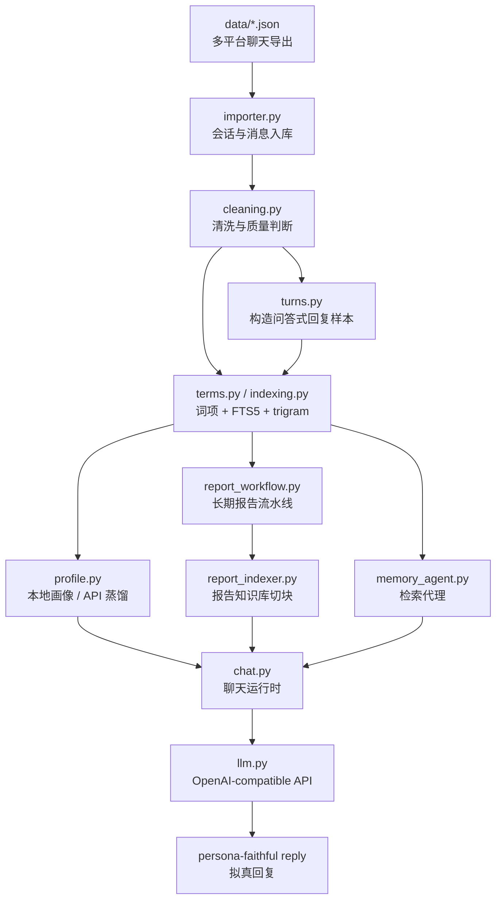
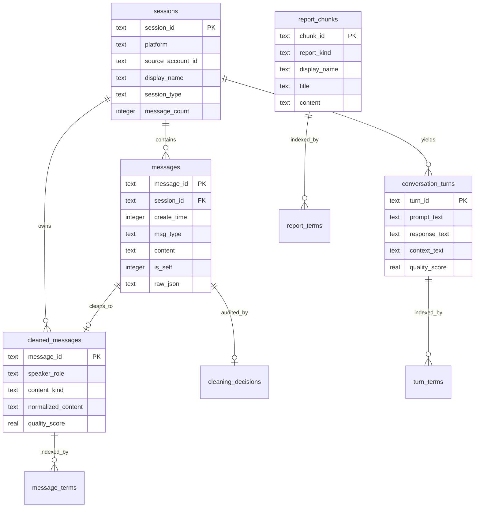

<div align="center">
<br />

# 🌌 WeLoom

**将聊天记录转化构建为可审计、检索、沉淀、对话的“蒸馏”工作流，全自动一条龙打造你的数字分身！**

> 你有遗憾吗？你有后悔吗？TA还在吗？架起属于你的织机，在虚拟网络复活你想见的人，或是为自己留下属于你的记忆宝藏....


[](https://github.com/clearyss/WeLoom/blob/main/LICENSE)
[](https://github.com/clearyss/WeLoom/stargazers)
[](https://github.com/clearyss/WeLoom/network)
[](https://github.com/clearyss/WeLoom/issues)
[](https://github.com/clearyss/WeLoom/pulls)

</div>

---


## 项目简介

WeLoom 是一个面向个人聊天历史的 **本地记忆系统**。它从多平台即时通讯导出的 JSON 会话出发，经过导入、清洗、对话切分、词项索引、SQLite FTS、长期报告生成与人格画像蒸馏，最终为模型提供一个可控的记忆上下文，让对话高度拟真，更贴近真实表达，输出TA会说的话。

> [!IMPORTANT]
> WeLoom 默认将数据库、画像、报告和缓存保存在本地 `storage/`。只有在你显式运行需要模型的命令时，相关上下文才会发送到配置的 OpenAI-compatible API 服务。请妥善保管 `.env`、`data/` 与 `storage/`，强烈建议只使用官方api或自行搭建的2api，项目支持deepseek，mimo官方api调用，其他服务商自行测试（强烈不建议使用任何第三方中转站）。

<table>
  <thead>
    <tr>
      <th align="center">Memory</th>
      <th align="center">Retrieval</th>
      <th align="center">Conversation</th>
    </tr>
  </thead>
  <tr>
    <td width="33%">
      <strong>🧠 记忆沉淀</strong><br />
      <sub>把零散消息清洗成可检索片段、回复样本、联系人线索、关系报告和人格画像。</sub>
    </td>
    <td width="33%">
      <strong>🔎 可解释检索</strong><br />
      <sub>词项、FTS5、trigram、LIKE fallback、上下文窗口与多路融合共同召回证据。</sub>
    </td>
    <td width="33%">
      <strong>🫧 拟真对话</strong><br />
      <sub>用本人表达样本校准语气，用长期报告补事实，用检索轨迹约束幻觉。</sub>
    </td>
  </tr>
</table>


## 适合谁

<table>
  <tr>
    <th width="42%">你想要</th>
    <th>WeLoom 提供</th>
  </tr>
  <tr>
    <td>🧭 从大量即时通讯聊天里找回“我和某人发生过什么”</td>
    <td>联系人搜索、消息检索、上下文窗口、人物报告</td>
  </tr>
  <tr>
    <td>🎭 让 AI 学会自己的表达方式</td>
    <td>回复样本检索、风格画像、输出风格计划</td>
  </tr>
  <tr>
    <td>📚 把聊天记录压缩成长期记忆</td>
    <td>分块报告、人物报告、主报告、人物档案</td>
  </tr>
  <tr>
    <td>🧩 不想依赖复杂框架</td>
    <td>核心仅 Python 标准库 + SQLite</td>
  </tr>
</table>

## 设计原则

<table>
  <tr>
    <td><strong>Local-first</strong></td>
    <td>数据库、画像、报告、缓存默认落在本地 <code>storage/</code>，除非你显式调用 API。</td>
  </tr>
  <tr>
    <td><strong>Evidence-first</strong></td>
    <td>聊天回答先检索证据，再组织上下文；可用 <code>--show-trace</code> 查看公开检索轨迹。</td>
  </tr>
  <tr>
    <td><strong>Graceful fallback</strong></td>
    <td>FTS5 不可用时回退词项与 LIKE；模型工具调用失败时回退本地多轮检索；报告 API 失败时可生成保守 fallback。</td>
  </tr>
  <tr>
</table>

## 核心能力


<table>
  <tr>
    <td align="center"><kbd>import</kbd></td>
    <td align="center">→</td>
    <td align="center"><kbd>index</kbd></td>
    <td align="center">→</td>
    <td align="center"><kbd>distill</kbd></td>
    <td align="center">→</td>
    <td align="center"><kbd>analyze</kbd></td>
    <td align="center">→</td>
    <td align="center"><kbd>chat</kbd></td>
  </tr>
  <tr>
    <td align="center"><sub>入库</sub></td>
    <td></td>
    <td align="center"><sub>召回</sub></td>
    <td></td>
    <td align="center"><sub>画像</sub></td>
    <td></td>
    <td align="center"><sub>报告</sub></td>
    <td></td>
    <td align="center"><sub>对话</sub></td>
  </tr>
</table>

## 架构



### 数据库模型



## 快速开始

<table>
  <tr>
    <td align="center"><strong>① Clone</strong><br /><sub>拉取源码</sub></td>
    <td align="center">→</td>
    <td align="center"><strong>② Configure</strong><br /><sub>复制 .env</sub></td>
    <td align="center">→</td>
    <td align="center"><strong>③ Build</strong><br /><sub>导入与索引</sub></td>
    <td align="center">→</td>
    <td align="center"><strong>④ Analyze</strong><br /><sub>长期报告</sub></td>
    <td align="center">→</td>
    <td align="center"><strong>⑤ Chat</strong><br /><sub>人格对话</sub></td>
  </tr>
</table>

### 环境要求

<table>
  <tr>
    <td><strong>Python</strong></td>
    <td><code>3.10+</code></td>
    <td><sub>使用现代类型语法，例如 <code>Path | None</code>。</sub></td>
  </tr>
  <tr>
    <td><strong>SQLite</strong></td>
    <td>stdlib bundled</td>
    <td><sub>由 Python 标准库 <code>sqlite3</code> 提供。</sub></td>
  </tr>
  <tr>
    <td><strong>Model API</strong></td>
    <td>optional</td>
    <td><sub>长期报告与聊天需要 OpenAI-compatible Chat Completions API Key。</sub></td>
  </tr>
</table>


### 1. 克隆

```powershell
git clone https://github.com/clearyss/weloom.git
cd weloom
```

### 2. 创建虚拟环境（可忽略）

```powershell
python -m venv .venv
.\.venv\Scripts\Activate.ps1
python --version
```

### 3. 准备配置

```powershell
Copy-Item .env.example .env
```

最小配置：

```dotenv
WELOOM_DB_PATH=storage/weloom.sqlite
WELOOM_OWNER_NAME=星渊清梦（填写你在聊天记录中的本人昵称）
WELOOM_DATA_DIR=data
WELOOM_PROFILE_PATH=storage/profile.json
WELOOM_REPORTS_DIR=storage/reports

AI_API_URL=https://api.deepseek.com/chat/completions
AI_MODEL=deepseek-v4-pro
AI_API_KEY=replace-with-your-api-key
```

### 4. 放入聊天数据（提取环节）

当前支持两类 JSON：

推荐使用以下方式导出聊天记录数据：

- **QQ 聊天记录**：推荐使用 [QQChatExporter](https://github.com/shuakami/qq-chat-exporter) 导出，并使用其 **V5 JSON** 格式。（实验性）
- **微信 / WeChat 聊天记录**：推荐使用 [WeFlow](https://github.com/hicccc77/WeFlow) 导出，并使用其会话 JSON 格式。

- **WeFlow 会话 JSON**：包含 `session` 与 `messages` 顶层字段。
- **QQChatExporter V5 JSON**：包含 `metadata`、`chatInfo`、`statistics` 与 `messages` 顶层字段。

将导出后的聊天记录 JSON 文件统一放入项目根目录的 `data/` 文件夹下：

```text
data/
  alice.json
  bob.json
  group-family.json
```

WeFlow 会话 JSON 结构示例：

```json
{
  "session": {
    "wxid": "wxid_xxx",
    "nickname": "昵称",
    "remark": "备注",
    "displayName": "展示名",
    "type": "friend",
    "lastTimestamp": 1704067200,
    "messageCount": 100
  },
  "messages": [
    {
      "localId": "1",
      "createTime": 1704067200,
      "type": "文本消息",
      "localType": "文本",
      "content": "今晚一起看星星吗？",
      "isSend": false,
      "senderUsername": "wxid_xxx",
      "senderDisplayName": "联系人名"
    }
  ]
}
```

QQChatExporter V5 JSON 结构示例：

```json
{
  "metadata": {
    "name": "QQChatExporter V5",
    "version": "5.x"
  },
  "chatInfo": {
    "name": "联系人名",
    "type": "private",
    "selfUid": "u_xxx",
    "selfUin": "10001",
    "selfName": "星渊清梦"
  },
  "statistics": {
    "totalMessages": 100
  },
  "messages": [
    {
      "id": "7604545001406391438",
      "seq": "1",
      "timestamp": 1770571107000,
      "time": "2026-02-09 01:18:27",
      "sender": {
        "uid": "u_xxx",
        "uin": "10001",
        "name": "星渊清梦",
        "nickname": "星渊清梦"
      },
      "type": "type_1",
      "content": {
        "text": "今晚一起看星星吗？",
        "elements": [
          {
            "type": "text",
            "data": {
              "text": "今晚一起看星星吗？"
            }
          }
        ],
        "resources": [],
        "mentions": []
      },
      "recalled": false,
      "system": false
    }
  ]
}
```

WeFlow 消息最低必需字段：

```text
localId, createTime, type, localType, content, isSend, senderUsername, senderDisplayName
```

### 5. 本地构建

```powershell
python -m weloom build
```

等价于：

```text
import → clean → index → local profile
```

### 6. 本地检索调试

```powershell
python -m weloom query "小林 记忆工具" --limit 5
```

### 7. 生成长期报告

先 dry-run：

```powershell
python -m weloom analyze --dry-run
```

确认任务量后正式生成：

```powershell
python -m weloom analyze
```

检查报告链路：

```powershell
python -m weloom report-doctor
```

### 8. 开始聊天

```powershell
python -m weloom chat
```

启用最终回复流式输出：

```powershell
python -m weloom chat --stream
```

流式输出会默认隐藏模型 `reasoning_content` / 思考增量，仅显示 `【思考中...】` 提示，避免把思考过程混入最终正文。

单次请求：

```powershell
python -m weloom chat --once "小林是谁？我和他是什么关系？" --show-trace
```

## 命令手册

| 命令 | API | 说明 |
| --- | ---: | --- |
| `import` | 否 | 导入 `data/*.json`，写入会话与消息，并执行基础清洗。 |
| `build` | 默认否 | 一键导入、清洗、索引、生成本地画像。 |
| `build --use-api` | 是 | 在本地画像基础上调用模型蒸馏。 |
| `index` | 否 | 重建清洗表、对话样本、词项索引、FTS、报告知识库。 |
| `distill` | 否 | 只生成本地人格画像。 |
| `distill --use-api` | 是 | 使用 API 增强画像蒸馏。 |
| `analyze --dry-run` | 否 | 估算长期报告任务数量，不调用 API。 |
| `analyze` | 是 | 生成联系人报告、主报告、人物档案和报告索引。 |
| `chat` | 是 | 进入人格聊天，支持 `--stream` 与交互内 `/stream` 切换最终回复流式输出。 |
| `query` | 否 | 调试本地消息、回复样本、联系人、报告检索。 |
| `export` | 否 | 导出回复蒸馏 JSONL。 |
| `inspect` | 否 | 输出数据库统计，不输出聊天原文。 |
| `doctor` | 否 | 检查数据库、索引和 API 配置摘要。 |
| `doctor --api` | 是 | 发送一次最小 API 探测。 |
| `report-doctor` | 否 | 检查长期报告目录与知识库完整性。 |

常见组合：

```powershell
python -m weloom --db storage/dev.sqlite --owner-name 星渊清梦 inspect
python -m weloom import --data-dir data
python -m weloom index --skip-reports
python -m weloom distill --out storage/profile.json
python -m weloom analyze --concurrency 4 --rpm-limit 80 --request-jitter 0.3
python -m weloom chat --disable-tool-calls --max-tool-rounds 0
python -m weloom chat --stream
python -m weloom chat --once "今天聊点什么？" --stream
```

## 输出资产

```text
storage/
  ├─ weloom.sqlite
  ├─ profile.json
  ├─ reply_dataset.jsonl
  └─ reports/
     ├─ main_report.md
     ├─ persona_profile.md
     ├─ report_index.json
     ├─ person_reports/
     ├─ merge_rounds/
     ├─ work/
     └─ .api_cache/
```

| 路径 | 内容 |
| --- | --- |
| `storage/weloom.sqlite` | 主数据库，包含原始消息、清洗结果、索引、报告知识库。 |
| `storage/profile.json` | 本地/模型增强人格画像。 |
| `storage/reply_dataset.jsonl` | 可选导出的回复样本。 |
| `storage/reports/person_reports/` | 每个联系人一份长期人物报告。 |
| `storage/reports/main_report.md` | 多联系人长期主报告。 |
| `storage/reports/persona_profile.md` | 面向聊天控制的人物档案。 |
| `storage/reports/report_index.json` | 报告清单、hash、生成信息。 |
| `storage/reports/.api_cache/` | 报告生成 API 缓存。 |

## 代码地图

<details open>
<summary><strong>核心模块</strong></summary>

| 文件 | 角色 |
| --- | --- |
| `weloom/cli.py` | 命令行入口和子命令编排。 |
| `weloom/config.py` | `.env` 加载、环境变量解析、应用配置与 API 配置。 |
| `weloom/database.py` | SQLite schema、索引、连接初始化、事务工具。 |
| `weloom/import_formats.py` | 多平台聊天记录 JSON 识别与规范化。 |
| `weloom/importer.py` | 聊天记录 JSON 导入、消息标准化、稳定 ID 构建。 |
| `weloom/cleaning.py` | 文本清洗、消息分类、质量分、敏感片段过滤。 |
| `weloom/indexing.py` | 清洗、turn、词项、FTS、报告知识库的统一重建入口。 |
| `weloom/chat.py` | 聊天运行时、上下文构造、最终模型调用。 |
| `weloom/llm.py` | OpenAI-compatible Chat Completions HTTP 客户端。 |

</details>

<details>
<summary><strong>检索与记忆代理</strong></summary>

| 文件 | 角色 |
| --- | --- |
| `weloom/ranking.py` | 查询意图识别、关键词分析、相关性打分。 |
| `weloom/query_expansion.py` | 查询扩展。 |
| `weloom/retrieval_common.py` | FTS/LIKE/trigram 查询构造、候选融合、过滤器。 |
| `weloom/retrieval.py` | 原始消息记忆检索。 |
| `weloom/retrieval_turns.py` | 相似回复样本检索。 |
| `weloom/retrieval_context.py` | 命中消息前后文补全。 |
| `weloom/style_retrieval.py` | 风格样本兜底检索。 |
| `weloom/contacts.py` | 联系人搜索、关系提示、最近消息、脱敏输出。 |
| `weloom/memory_agent.py` | 工具调用检索代理与本地多轮检索 fallback。 |
| `weloom/memory_tools.py` | 暴露给模型的本地工具 schema。 |
| `weloom/memory_utils.py` | 检索结果合并、预算裁剪、payload 生成。 |

</details>

<details>
<summary><strong>画像、报告与提示词</strong></summary>

| 文件 | 角色 |
| --- | --- |
| `weloom/profile.py` | 本地画像、候选事实、风格指纹、API 蒸馏入口。 |
| `weloom/profile_distillation.py` | 蒸馏 JSON 规范、样本选择、修复与 fallback。 |
| `weloom/report_workflow.py` | 并行报告流水线。 |
| `weloom/report_builder.py` | 报告参数、缓存 key、会话统计、兼容入口。 |
| `weloom/report_transcript.py` | 聊天记录转录格式化。 |
| `weloom/report_prompts.py` | 报告提示词构造。 |
| `weloom/report_budget.py` | 上下文预算、动态 token 预算、分组裁剪。 |
| `weloom/parallel_llm.py` | 并发 API 调用、限流、抖动、缓存、错误归档。 |
| `weloom/report_indexer.py` | 报告知识库切块与索引。 |
| `weloom/report_store.py` | 聊天时选择报告上下文。 |
| `weloom/report_retrieval.py` | 报告切块检索。 |
| `weloom/report_clipper.py` | 报告章节与表格相关性裁剪。 |
| `weloom/report_doctor.py` | 报告完整性诊断。 |
| `weloom/prompt_manager.py` | 内置/自定义提示词模板加载与渲染。 |

</details>

## API 兼容性

WeLoom 调用的是 OpenAI-compatible Chat Completions 接口，默认示例为 DeepSeek，支持MiMo调用，其他服务商自行尝试：

```dotenv
AI_API_URL=https://api.deepseek.com/chat/completions
AI_MODEL=deepseek-v4-pro
AI_THINKING=enabled
AI_REASONING_EFFORT=high
```

请求特性：

- Bearer Token 认证
- `messages`
- `temperature`
- `top_p`
- `max_tokens`
- 可选 `max_completion_tokens`
- 可选 `reasoning_effort`
- 可选 `thinking`
- 可选 `tools` / `tool_choice`
- 可选 `response_format`

如果模型不支持工具调用：

```powershell
python -m weloom chat --disable-tool-calls --max-tool-rounds 0
```

## 配置

`.env.example` 已覆盖当前源码中的全部配置入口：

```text
source env vars:       318
.env.example entries:  318
missing entries:       0
extra entries:         0
```

配置分组：

| 分组 | 前缀 | 用途 |
| --- | --- | --- |
| 基础路径 | `WELOOM_DB_PATH`, `WELOOM_DATA_DIR` | 数据库、输入、输出路径。 |
| API | `AI_*` | 模型接口、key、采样、工具调用、重试。 |
| 聊天 | `WELOOM_CHAT_*` | 对话历史、报告注入、最终回复预算。 |
| 检索代理 | `WELOOM_MEMORY_AGENT_*` | 本地工具调用、扩展检索、合并限制。 |
| 报告 | `WELOOM_REPORT_*` | 分块、并发、限流、缓存、fallback。 |
| 检索 | `WELOOM_RETRIEVAL_*`, `WELOOM_RANKING_*` | 召回数量、权重、过滤和排序。 |
| 清洗 | `WELOOM_CLEAN_*` | 消息保留、质量分和敏感信息过滤。 |
| 画像 | `WELOOM_PROFILE_*` | 画像数量、蒸馏预算、JSON 修复。 |


## 故障排查

| 现象 | 可能原因 | 处理 |
| --- | --- | --- |
| `数据目录不存在` | 没有创建 `data/` 或路径错误 | 创建目录，或使用 `--data-dir`。 |
| `清洗保留 0` | JSON 中 `type` 不是 `文本消息`/`引用消息` 等识别值 | 检查导出格式或转换消息类型。 |
| `未找到 AI_API_KEY` | `.env` 未配置或仍是 placeholder | 写入真实 key，仅保存在本地。 |
| FTS 行为不可用 | 当前 SQLite 未启用 FTS5 | 仍可使用词项和 LIKE fallback；如需 FTS5，换支持 FTS5 的 Python/SQLite。 |
| `report-doctor` 缺少 `report_index.json` | 尚未正式运行 `analyze` | 先运行 `analyze`。 |
| 聊天结果太像资料摘要 | 检索上下文过多或提示词约束不够 | 调低报告注入预算，或自定义 `chat.system`。 |
| 想切换聊天流式输出 | 当前命令或环境未启用流式 | 使用 `python -m weloom chat --stream`，交互中输入 `/stream on`；关闭用 `--no-stream` 或 `/stream off`。 |
| 报告生成太慢 | 会话多、分块大、API 慢 | 调整 `--concurrency`、`--rpm-limit`、`WELOOM_REPORT_TARGET_CHARS`。 |


<a id="contributing"></a>

## 🤝 参与贡献

欢迎参与项目贡献！你可以：

- 提交 [Bug 报告](https://github.com/clearyss/WeLoom/issues/new?template=bug_report.md)
- 提出 [新功能建议](https://github.com/clearyss/WeLoom/issues/new?template=feature_request.md)
- 改进 [文档](https://github.com/clearyss/WeLoom/wiki)
- 提交 [Pull Request](https://github.com/clearyss/WeLoom/pulls)

<a id="community"></a>

## 💬 交流反馈

- QQ 交流群：`111399948`，可从此途径联系作者（群主）
- Telegram 交流群：[DRSTTH](https://t.me/drstth_CN)
- Telegram 频道：[DRPD](https://t.me/drstth_channel)
- 问题反馈：[GitHub Issues](https://github.com/clearyss/WeLoom/issues)

<a id="license"></a>

## 📄 许可证

本项目采用 [GPL-3.0](LICENSE) 许可证。

---

<div align="center">
  <h3>Star History</h3>

  <a href="https://star-history.com/#clearyss/WeLoom&Date">
    
  </a>

  <p>Made with ❤️ by <a href="https://github.com/clearyss">clearyss</a></p>
</div>
