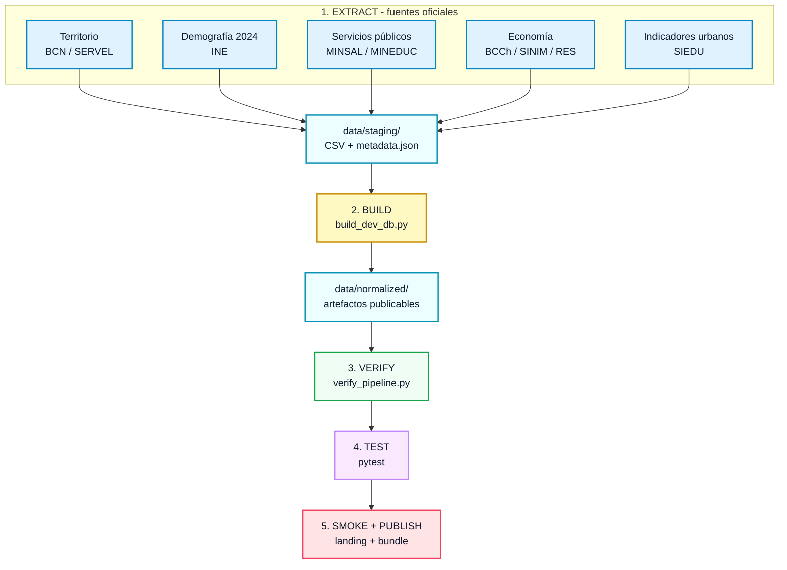
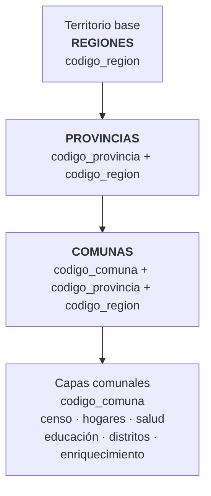
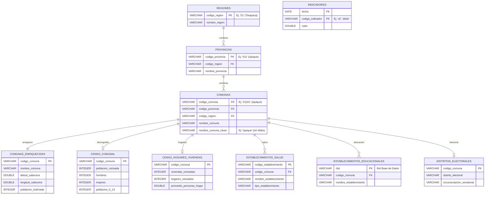

<div align="center">

<h1>
  
  chile-hub
</h1>

<p><strong>Datos públicos de Chile, curados y listos para análisis en una línea de código.</strong></p>
<p><em>La última milla de los datos oficiales de Chile — parte del ecosistema Tooltician.</em></p>

[](https://github.com/cortega26/chile-hub/actions)
[](https://pypi.org/project/chile-hub/)
[](https://pypi.org/project/chile-hub/)
[](https://tooltician.com/chile-hub/data/normalized/hub_status.json)
[](https://tooltician.com/chile-hub/data/normalized/hub_health.json)
[](LICENSE)
[](https://doi.org/10.5281/zenodo.22968698)
<!-- START_PYTHON_BADGE -->
[]()
<!-- END_PYTHON_BADGE -->
<!-- Convención de conteos (Plan 097): badge = 22 CONSTRUIBLES (claves del catálogo con `outputs`, lo que `make build` genera localmente, incl. consumo_electrico en carril candidate) · 21 PUBLICABLES (registry `publication_track: stable_publishable` + elegibles al ZIP) · 20 en el manifest (alias comunas_enriquecidas sin artefacto físico) · 25 REGISTRADAS (claves del catálogo) · 28 DOCS (con archivados). Fórmula del badge: sync_readme_dataset_badge() en src/builders/doc_sync.py. -->
<!-- START_DATASET_BADGE -->
[]()
<!-- END_DATASET_BADGE -->

<p>
  <a href="#instalar-y-usar-en-30-segundos">Instalación</a> ·
  <a href="#por-qué-confiar">Confianza</a> ·
  <a href="#qué-incluye">Capas</a> ·
  <a href="#recetas-de-uso">Recetas</a> ·
  <a href="#api-y-cli">API y CLI</a> ·
  <a href="#fuentes-licencias-y-reúso">Licencias</a>
</p>

<a href="https://tooltician.com/chile-hub/">
  
</a>

</div>

---

## Instalar y usar en 30 segundos

```bash
pip install chile-hub
```

```python
from chile_hub import ChileHub

hub = ChileHub()
comunas = hub.load_polars("comunas")  # 346 comunas, códigos CUT como texto
censo = hub.load_polars("censo_comunal")  # población censada por comuna

# Cruce territorial garantizado: la clave es el CUT, nunca un int
df = (
    comunas.join(censo, on="codigo_comuna")
    .select("codigo_comuna", "nombre_comuna", "nombre_region", "poblacion_censada")
    .sort("poblacion_censada", descending=True)
    .head(5)
)
print(df)
```

Resultado real (Censo 2024):

```text
shape: (5, 4)
┌───────────────┬───────────────┬─────────────────────────────────┬───────────────────┐
│ codigo_comuna ┆ nombre_comuna ┆ nombre_region                   ┆ poblacion_censada │
│ ---           ┆ ---           ┆ ---                             ┆ ---               │
│ str           ┆ str           ┆ str                             ┆ i64               │
╞═══════════════╪═══════════════╪═════════════════════════════════╪═══════════════════╡
│ 13201         ┆ Puente Alto   ┆ Región Metropolitana de Santia… ┆ 568086            │
│ 13119         ┆ Maipú         ┆ Región Metropolitana de Santia… ┆ 503635            │
│ 13101         ┆ Santiago      ┆ Región Metropolitana de Santia… ┆ 438856            │
│ 02101         ┆ Antofagasta   ┆ Región de Antofagasta           ┆ 401096            │
│ 13110         ┆ La Florida    ┆ Región Metropolitana de Santia… ┆ 374836            │
└───────────────┴───────────────┴─────────────────────────────────┴───────────────────┘
```

En el sitio puedes consultar los mismos Parquet con SQL en el navegador (motor
DuckDB-WASM, sin instalar nada):


La primera ejecución descarga el bundle validado desde GitHub Releases, verifica su
integridad SHA256 y lo deja en cache local; a partir de ahí todo corre contra el cache.
La comprobación semanal de novedades no envía datos de uso y se desactiva con
`CHILE_HUB_NO_UPDATE_CHECK=1` (`CHILE_HUB_LANG=es|en` elige el idioma del aviso).

```bash
chile-hub cache update     # Forzar descarga del bundle más reciente
chile-hub cache status     # Ubicación y estado del cache local
chile-hub cache clear      # Liberar espacio
```

> **Variante pipeline:** `pip install chile-hub[pipeline]` agrega DuckDB, Pandas,
> XlsxWriter y curl_cffi para ejecutar el pipeline completo de extracción y build.
> La instalación mínima solo incluye Polars, PyArrow, requests y platformdirs —
> suficiente para consumir datos.

> [!NOTE]
> **chile-hub** no busca "tener todos los datos de Chile". Busca **reducir drásticamente
> el costo técnico** de encontrar, limpiar, validar, cruzar y consumir datasets
> geográficos, demográficos, electorales y económicos críticos de Chile.
>
> Tampoco es un portal ni una fuente oficial: trabaja aguas abajo de
> [datos.gob.cl](https://datos.gob.cl/) y de las instituciones que publican cada dato,
> y siempre enlaza a la fuente oficial. Es un proyecto independiente, sin afiliación con
> esas instituciones. Misión y principios: [`docs/product-spec.md`](docs/product-spec.md).
>
> En la práctica, responde preguntas como:
>
> - ¿Cómo cruzo mi base de clientes, escuelas o centros de salud con comunas oficiales sin perder ceros en los códigos?
> - ¿Qué comunas concentran población censada, establecimientos públicos o indicadores urbanos?
> - ¿Cómo llevo datos oficiales a Polars, DuckDB, SQLite, Excel o CI sin depender de enlaces cambiantes?

<!-- START_VERSION_PIN_EXAMPLE -->
> **Versionado:** Para entornos productivos, fija la versión exacta en `requirements.txt`
> (revisa el badge de PyPI al inicio de este README para la versión más reciente):
> ```
> chile-hub==1.47.0
> ```
> El bundle de datos se publica con cada release. La API del módulo `ChileHub` sigue
> versionado semántico: cambios de interfaz pública solo en _major releases_.
<!-- END_VERSION_PIN_EXAMPLE -->

---

## Por qué confiar

Cada decisión de ingeniería de este proyecto está diseñada para que **no tengas que
confiar ciegamente**: los datos vienen con la evidencia que los respalda.

Trabajar con datos públicos chilenos suele implicar los mismos obstáculos:

| Sin chile-hub | Con chile-hub |
|:---|:---|
| Enlaces rotos y APIs inconsistentes | Pipeline automatizado con fallbacks y verificación de integridad |
| Planillas Excel deformes con celdas combinadas | Parquet, DuckDB y JSON listos para producción |
| Códigos CUT que pierden ceros al leerse como `int` | CUT garantizados como `VARCHAR` de largo fijo (`"01101"`) |
| Nombres de comunas imposibles de cruzar (_Ñuñoa_ vs _Nunoa_) | Columna `nombre_comuna_clean` normalizada para cruces exactos |
| Cero trazabilidad sobre origen y vigencia del dato | Metadatos con fuente, fecha de extracción, licencia y modo |

### Seis pilares, auditables y verificables en cada build

| Pilar | Descripción | Artefacto auditable |
|:---|:---|:---|
| **Procedencia documentada** | Cada dataset declara su fuente oficial exacta con URL directa al organismo público emisor (BCN, INE, MINEDUC, BCCh, MINSAL, datos.gob.cl). | [`provenance_report.md`](data/normalized/provenance_report.md) — fuente, modo y timestamp por capa |
| **Auditoría legal explícita** | <!-- START_REDISTRIBUTION_SUMMARY -->Licencia, atribución requerida y permiso de redistribución verificados dataset por dataset — reporte regenerado en cada build en [`redistribution_report.md`](data/normalized/redistribution_report.md).<!-- END_REDISTRIBUTION_SUMMARY --> | [`redistribution_report.md`](data/normalized/redistribution_report.md) + [`AGENTS.md §6`](AGENTS.md) |
| **Pipeline fail-loud** | Si una validación falla, el pipeline **aborta** — no publica datos corruptos, no emite advertencias silenciosas. | [`ADR-001`](docs/adr/ADR-001-pipeline-lineal-determinista.md) — fail-loud como decisión de arquitectura |
| **Contratos de esquema** | <!-- START_CONTRACT_COUNT -->25 contratos JSON Schema ([`contracts/datasets/`](contracts/datasets/)) definen columnas esperadas, tipos, claves primarias y cobertura. Se validan **en cada build** automáticamente.<!-- END_CONTRACT_COUNT --> | [`ADR-005`](docs/adr/ADR-005-contratos-esquema-json-schema.md) + `contracts/datasets/*.json` |
| **Salud transparente** | <!-- START_HEALTH_SUMMARY -->Dashboard público con severidad, frescura, cobertura, drift y degradación por dataset — regenerado en cada build en [`hub_health.md`](data/normalized/hub_health.md).<!-- END_HEALTH_SUMMARY --> | [`hub_health.md`](data/normalized/hub_health.md) — estado completo actualizado en cada build |
| **Calidad medida** | <!-- START_QUALITY_SUMMARY -->Puntuación compuesta A-F por dataset (validación, contrato, madurez de fuente, frescura, cobertura y política de reúso); scorecard completo en [`dataset_quality.md`](data/normalized/dataset_quality.md).<!-- END_QUALITY_SUMMARY --> | [`dataset_quality.md`](data/normalized/dataset_quality.md) — scorecard completo |

Cada pilar se audita automáticamente en cada ejecución del pipeline. Los reportes se
regeneran en cada build — no son documentos estáticos mantenidos a mano. Para auditar
el estado exacto de cualquier capa:

```bash
chile-hub provenance   # fuente, modo y timestamp por dataset
chile-hub health       # severidad, frescura, drift y cobertura
```

El mismo estado se publica en el sitio, con historial de builds y detalle por capa:


### Respaldo adicional

<!-- START_TEST_COUNT -->
- **1263 tests** (`pytest --collect-only`) que validan extracción, contratos e integridad de datos.
<!-- END_TEST_COUNT -->
<!-- START_ADR_COUNT -->
- **23 ADRs** ([`docs/adr/`](docs/adr/)) que documentan cada decisión de arquitectura con su contexto, consecuencias y tradeoffs — no solo el "qué", sino el "por qué".
<!-- END_ADR_COUNT -->
- **Drift monitoreado:** todos los datasets bajo vigilancia de deriva de esquema; cualquier
  cambio en la fuente se detecta y registra ([`drift_report.md`](data/normalized/drift_report.md)).
- **Trazabilidad completa:** cada build registra timestamp, versión de extractor y
  snapshot de entrada en [`provenance_report.md`](data/normalized/provenance_report.md).

> Para una explicación más detallada de la arquitectura y las decisiones de diseño,
> lee el [caso de estudio: cómo está construido chile-hub](docs/case-study-construccion-chile-hub.md).

---

## Qué incluye

> **Cómo leer los conteos:** 22 capas construibles (`make build` local, incl. 1 en carril
> `candidate`) · 21 publicables (bundle ZIP) · 25 registradas en el catálogo (3 filas sin
> datos aún: geometría, delincuencia, autoridades locales). La convención completa vive
> junto al badge superior y en [`data/source_registry.json`](data/source_registry.json).


Mapa territorial interactivo: las 346 comunas con 7 métricas seleccionables
(población, pobreza, permisos, equipamiento, MP2.5) y ficha por comuna.


<!-- START_DATASET_TABLE -->

| # | Capa | Fuente | Licencia | Actualización |
|:--:|:---|:---|:---|:--:|
| 1 | **Regiones** | BCN ArcGIS | CC BY | — |
| 2 | **Provincias** | BCN ArcGIS | CC BY | — |
| 3 | **Comunas** | BCN ArcGIS | CC BY | — |
| 4 | **Comunas Enriquecidas** | BCN + INE | CC BY | — |
| 5 | **Indicadores Económicos** | BCCh / mindicador.cl | Libre c/cita | Diaria |
| 6 | **Censo Comunal 2024** | INE | CC BY 4.0 | Decenal |
| 7 | **Censo Hogares y Viviendas** | INE | CC BY 4.0 | Decenal |
| 8 | **Establecimientos de Salud** | MINSAL / datos.gob.cl | CC0 | Mensual |
| 9 | **Distritos Electorales** | BCN / Ley 20.840 | CC0 | — |
| 10 | **Establecimientos Educacionales** | MINEDUC | CC BY 3.0 CL | Anual |
| 11 | **Finanzas Municipales** | SINIM / SUBDERE | Revisión términos | Anual |
| 12 | **Resultados Educacionales** | MINEDUC | CC BY 3.0 CL | Anual |
| 13 | **Indicadores Urbanos SIEDU** | INE / SIEDU | Datos abiertos INE | Anual |
| 14 | **Perfil Territorial Comunal** | chile-hub derivado | Fuentes abiertas | Derivada |
| 15 | **Empresas (RES)** | Min. Economía / datos.gob.cl | CC-BY 3.0 CL | Mensual |
| 16 | **Pobreza Comunal (SAE)** | MDS / Observatorio Social | Datos abiertos MDS | Bienal/trienal |
| 17 | **Consumo Eléctrico Comunal** | CNE / Energía Abierta | CC BY | Anual |
| 18 | **Partidos Políticos** | Cámara de Diputados | CC BY | Bajo_demanda |
| 19 | **Autoridades Electas** | Cámara de Diputados + Senado | CC BY | Bajo_demanda |
| 20 | **Estadísticas Vitales** | INE | CC BY 4.0 | Anual |
| 21 | **Permisos de Edificación** | MINVU / CEDOC | Uso c/cita | Mensual |
| 22 | **Calidad del Aire** | MMA / SINCA | Revisión términos | Diaria |
| 23 | **geometria_comunal** | — | — | — |
| 24 | **Delincuencia Comunal** | CEAD / SPD | Revisión términos | — |
| 25 | **Autoridades Locales** | BCN SIIT + Wikipedia | CC BY / CC BY-SA | — |

> **Métricas por build:** el modo de la última extracción, el conteo de
> registros, la cobertura y la frescura viven en
> [`hub_health.md`](data/normalized/hub_health.md),
> [`dataset_status.json`](data/normalized/dataset_status.json) y
> [`dataset_quality.md`](data/normalized/dataset_quality.md), regenerados en cada
> build; los badges resumen frescura y estado:
> [](https://tooltician.com/chile-hub/data/normalized/hub_health.json)
> [](https://tooltician.com/chile-hub/data/normalized/hub_status.json)
> Para auditar el estado exacto de cada capa: `chile-hub provenance` y `chile-hub health`.

<!-- END_DATASET_TABLE -->

El schema de columnas, tipos y PK de cada capa vive en
[`contracts/datasets/`](contracts/datasets/) y en [`docs/datasets/`](docs/datasets/);
el volcado completo está en el [apéndice](#apéndice-esquemas-y-modelo-de-datos).

### Formatos de salida

Cada ejecución del pipeline genera en `data/normalized/`:

| Tipo | Archivo | Uso |
|:---|:---|:---|
| **Base de datos** | `chile_data.duckdb` | Analítica local de alto rendimiento |
| **Base de datos** | `chile_data.db` | SQLite para aplicaciones embebidas |
| **Intercambio** | `*.parquet` por capa | Polars / Pandas / DuckDB |
| **Intercambio** | `*.json` por capa | Pipelines y automatización |
| **Intercambio** | `chile_data_latest.xlsx` | Excel multipestaña (códigos CUT como texto) |
| **Metadatos** | `artifact_manifest.json`, `hub_health.*`, `dataset_status.json`, `dataset_changelog.json`, `dataset_catalog.*`, `provenance_report.*`, `redistribution_report.*` | Catálogo físico, salud, changelog y auditoría |
| **Bundle** | `chile-hub-publishable-bundle.zip` | Paquete público con verificación SHA256 |

---

## Recetas de uso

¿Prefieres notebooks? Las cuatro recetas están en
[`examples/notebooks/`](examples/notebooks/) con botón de Colab, o ejecutables
en el explorador SQL del sitio.

**1. Últimos indicadores económicos disponibles**

```python
from chile_hub import ChileHub

df = ChileHub().load_polars("indicadores")
ultimos = (
    df.sort("fecha", descending=True)
    .group_by("codigo_indicador")
    .first()
    .select("codigo_indicador", "fecha", "valor")
    .sort("codigo_indicador")
)
print(ultimos)
```

**2. Salud y educación por comuna**

```python
from chile_hub import ChileHub

hub = ChileHub()
salud = hub.load_polars("establecimientos_salud")
educacion = hub.load_polars("establecimientos_educacionales")

salud_por_comuna = salud.group_by("codigo_comuna").len("establecimientos_salud")
educacion_por_comuna = educacion.group_by("codigo_comuna").len("establecimientos_educacionales")

resumen = (
    hub.load_polars("comunas")
    .join(salud_por_comuna, on="codigo_comuna", how="left")
    .join(educacion_por_comuna, on="codigo_comuna", how="left")
    .fill_null(0)
    .select(
        "codigo_comuna", "nombre_comuna", "establecimientos_salud", "establecimientos_educacionales"
    )
)
print(resumen.head())
```

**3. SQL directo con DuckDB**

```sql
-- Top 10 comunas por población censada
SELECT nombre_comuna, poblacion_censada, hombres, mujeres
FROM 'data/normalized/censo_comunal.parquet'
ORDER BY poblacion_censada DESC
LIMIT 10;

-- Cruce territorial: comunas × distritos electorales
SELECT c.nombre_comuna, c.nombre_region,
       e.distrito_electoral, e.circunscripcion_senatorial
FROM 'data/normalized/comunas.parquet' c
JOIN 'data/normalized/distritos_electorales.parquet' e
  ON c.codigo_comuna = e.codigo_comuna
WHERE c.nombre_region = 'Valparaíso';
```

---

## API y CLI

### API Python compacta

| API | Uso |
|:---|:---|
| `ChileHub()` | Inicializa el helper; descarga y verifica el bundle si no hay cache local. |
| `ChileHub(data_dir="data/normalized")` | Usa artefactos locales generados por el pipeline. |
| `hub.list_datasets()` | Lista los nombres canónicos disponibles para `load_polars()`. |
| `hub.load_polars("comunas")` | Carga una capa como `polars.DataFrame` desde Parquet. |
| `hub.summary()` / `hub.summary_table()` | Resume modo de fuente, filas, validación, frescura y warnings. |
| `hub.health()` / `hub.status()` | Reporta salud operativa para personas y CI/CD. |
| `hub.redistribution()` | Expone estado legal de reúso y atribución por dataset. |
| `hub.provenance()` | Muestra fuente, URL, modo de extracción y timestamps. |
| `chile-hub cache update/status/clear` | Administra el cache local del bundle publicado. |

> **¿Construyes agentes?** El proyecto incluye un servidor MCP con catálogo,
> consultas y resolución de comunas para que tu agente consuma los datos sin
> integraciones propias: [`docs/mcp.md`](docs/mcp.md).

<!-- mcp-name: io.github.cortega26/chile-hub -->

### CLI: los comandos más usados

| Comando | Para qué |
|:---|:---|
| `chile-hub list` | Lista todos los datasets registrados. |
| `chile-hub show <capa>` | Schema y metadatos detallados de una capa. |
| `chile-hub example <capa> --kind duckdb` | Receta de consumo lista para copiar y pegar. |
| `chile-hub cross <a> <b>` | Cruza dos datasets por clave territorial común. |
| `chile-hub export <capa> --output archivo` | Exporta un dataset a CSV, JSON o Parquet. |
| `chile-hub health` | Reporte consolidado de salud del hub. |
| `chile-hub status` | JSON ultraliviano para CI/CD. |
| `chile-hub provenance` | URLs de origen y métodos de extracción. |
| `chile-hub redistribution` | Reporte legal de reúso por capa. |
| `chile-hub dataset-quality` | Puntuación de calidad A-F por dataset. |
| `chile-hub --help` | Listado completo y siempre actualizado. |

<details>
<summary><b>Referencia completa de CLI</b></summary>

<br>

### Inspección y consulta

| Comando | Descripción |
|:---|:---|
| `chile-hub list` | Lista todos los datasets registrados |
| `chile-hub version` | Muestra la versión instalada del paquete |
| `chile-hub cache status` | Muestra ubicación y estado del cache local |
| `chile-hub cache update` | Descarga y verifica el bundle publicado |
| `chile-hub cache clear` | Elimina el cache local |
| `chile-hub show <capa>` | Schema y metadatos detallados de una capa |
| `chile-hub path <capa> --output parquet` | Ruta física al archivo de una capa |
| `chile-hub example <capa> --kind duckdb` | Receta de consumo lista para copiar y pegar |
| `chile-hub overview` | Resumen general del build y estado actual |
| `chile-hub inventory` | Archivos en `data/normalized/` con tamaños y hashes |
| `chile-hub snapshot` | Snapshot humano y compacto del hub |
| `chile-hub summary` | Resumen breve de datasets |
| `chile-hub search <keyword>` | Busca datasets por keyword, fuente o madurez |
| `chile-hub cross <a> <b>` | Cruza dos datasets por clave territorial común |
| `chile-hub export <capa> --output archivo` | Exporta un dataset a CSV, JSON o Parquet |

### Calidad, salud y auditoría

| Comando | Descripción |
|:---|:---|
| `chile-hub health` | Reporte consolidado de salud del hub |
| `chile-hub freshness-audit` | Auditoría de frescura contra el reloj actual |
| `chile-hub runtime-status` | Salud registrada + vigencia en vivo |
| `chile-hub top-issue` | Capa con mayor degradación operativa |
| `chile-hub drift` | Desvíos, fallbacks activos y regresiones |
| `chile-hub status` | JSON ultraliviano para CI/CD |
| `chile-hub dataset-status` | Estado detallado machine-readable por dataset |
| `chile-hub dataset-changelog` | Cambios entre el build actual y el metadata anterior |
| `chile-hub source-readiness` | Madurez de fuente por dataset |
| `chile-hub dataset-quality` | Puntuación de calidad A-F por dataset |
| `chile-hub check-sources` | Verifica conectividad en vivo con las fuentes oficiales |
| `chile-hub validate <capa>` | Valida un dataset (o un CSV/Parquet propio) contra su schema |

### Distribución e integridad

| Comando | Descripción |
|:---|:---|
| `chile-hub bundle` | Metadata consolidada en un solo JSON |
| `chile-hub redistribution` | Reporte legal de reúso por capa |
| `chile-hub provenance` | URLs de origen y métodos de extracción |
| `chile-hub verify-package` | Instrucción de verificación de integridad del ZIP |
| `chile-hub artifacts` | Artefactos publicables del hub |
| `chile-hub shared-artifacts` | Artefactos compartidos del hub (reportes, manifest) |
| `chile-hub reports` | Lista los reportes compartidos disponibles |
| `chile-hub report <nombre>` | Resuelve la metadata de un reporte compartido |
| `chile-hub packages` | Paquetes publicables del hub |
| `chile-hub package` | Metadata del package principal del hub |

> En entorno de desarrollo, usa `python -m chile_hub` o `python -m src.chile_hub`
> como alternativa al comando `chile-hub` si el paquete no está instalado en modo editable.

</details>

---

## Cómo funciona

El pipeline es **lineal, determinista y estricto**: si una validación falla, el build se cancela antes de publicar datos corruptos.



> [!IMPORTANT]
> **Invariante crítica:** El pipeline aborta si la cardinalidad de comunas ≠ 346, si los códigos CUT pierden el formato `VARCHAR`, o si alguna regla de negocio se rompe. **Nunca** se publican datos corruptos.

<details>
<summary><b>Extractores incluidos en el paso 1</b></summary>

<!-- START_EXTRACTOR_TABLE -->

| Dominio | Extractores |
|:---|:---|
| Territorio | `subdere_extractor.py`, `electoral_extractor.py`, `geometria_comunal_extractor.py` |
| Demografía | `censo_extractor.py`, `censo_hogares_viviendas_extractor.py`, `pobreza_extractor.py`, `estadisticas_vitales_extractor.py` |
| Servicios públicos | `salud_extractor.py`, `mineduc_establecimientos_extractor.py`, `mineduc_resultados_extractor.py` |
| Economía | `bcentral_extractor.py`, `sinim_finanzas_extractor.py`, `sinim_finanzas_live_extractor.py`, `res_extractor.py`, `consumo_electrico_extractor.py`, `permisos_edificacion_extractor.py` |
| Indicadores urbanos | `siedu_extractor.py` |
| Medio ambiente | `calidad_aire_extractor.py` |
| Política | `partidos_politicos_extractor.py`, `autoridades_electas_extractor.py`, `autoridades_locales_extractor.py` |
| Seguridad (carril `candidate`) | `cead_delincuencia_live_extractor.py` |
| Derivado en `build_dev_db.py` (sin extractor) | `perfil_territorial_comunal` |

<!-- END_EXTRACTOR_TABLE -->

> El mapeo autoritativo entre dataset y extractor vive en
> [`data/dataset_catalog_config.json`](data/dataset_catalog_config.json); esta tabla
> es solo orientativa. Detalle completo en [`AGENTS.md §2`](AGENTS.md).

</details>

### Modelo de datos: códigos CUT

El valor central de chile-hub es que **todas las capas se vinculan jerárquicamente** mediante los Códigos Únicos Territoriales (CUT) de SUBDERE/INE:



| Grupo | Clave principal | Capas |
|:---|:---|:---|
| Territorio base | `codigo_region`, `codigo_provincia`, `codigo_comuna` | `regiones`, `provincias`, `comunas` |
| Capas comunales | `codigo_comuna` | censo, hogares y viviendas, salud, educación, distritos electorales, pobreza, permisos de edificación, calidad del aire, estadísticas vitales, perfil territorial y más |
| Series temporales | `fecha` o `anio` + clave propia | `indicadores`, `calidad_aire`, `permisos_edificacion` |
| Registros | clave propia | `empresas` (RUT), `partidos_politicos`, `autoridades_electas` |

El diagrama entidad-relación completo está en el [apéndice](#apéndice-esquemas-y-modelo-de-datos).

---

## Próximos pasos

El roadmap actual prioriza crecer en usabilidad y confianza antes que agregar más capas.

| Horizonte | Foco | Entregable | Estado |
|:---|:---|:---|:---:|
| **Now** | Ejemplos, notebooks, errores claros, referencia API | Usuarios cargan y cruzan datos sin leer el pipeline completo | En progreso |
| **Next** | Contratos de schema, source readiness, criterios públicos | Contribuidores proponen datasets con reglas claras y verificables | Planeado |
| **Later** | Nuevas capas solo si pasan criterios de inclusión | El catálogo crece sin perder mantenibilidad ni claridad legal | Futuro |

> **Especificación completa:** [`docs/product-spec.md`](./docs/product-spec.md)
> **Criterios de inclusión:** [`docs/dataset-inclusion-criteria.md`](./docs/dataset-inclusion-criteria.md)
> **Estado del último build:** `data/normalized/pipeline_status.md`

---

## Desarrollo y contribución

### ¿Quieres aportar o pedir un dataset?

No necesitas saber programar ni traer los datos limpios: basta con la fuente y
para qué sirve (o la necesidad, si solo quieres pedirlo). La guía de 2 minutos y
los dos formularios están en
**[Aportar o solicitar un dataset](https://tooltician.com/chile-hub/reference/contribuir-datasets/)**
([criterios completos](docs/dataset-inclusion-criteria.md)).

### Desarrollar el pipeline

Esta sección es para contribuidores que ejecutan el pipeline de extracción, build y
verificación en su máquina. Si solo necesitas consumir los datos, usa
`pip install chile-hub` (ver [Instalación](#instalar-y-usar-en-30-segundos)).

Requiere [uv](https://docs.astral.sh/uv/getting-started/installation/) y Git.
Python lo gestiona uv (`make bootstrap`).

```bash
# Entorno
git clone https://github.com/cortega26/chile-hub.git
cd chile-hub
make bootstrap          # Crea .venv, instala dependencias + Playwright
make doctor             # Verifica versión de Python y dependencias críticas

# Pipeline completo
make refresh            # extract → build → verify → test → landing

# Pasos individuales
make extract            # Ejecuta los extractores → data/staging/
make build              # Compila artefactos → data/normalized/
make verify             # Verifica integridad (SHA256, conteos, schema)
make test               # pytest (lee data/normalized/, no corre el pipeline)
make coverage           # pytest + cobertura de src/ (term-missing + coverage.xml)
make verify-landing     # Pruebas de humo de landing page con Playwright
```

> `autoridades_electas` requiere scrapling para no degradar a 155 registros
> (0 senadores); el comando local está en
> [Carriles de extracción](docs/extraction-lanes.md).

> El ZIP publicable no se versiona: `make build` lo genera localmente y el
> sitio lo descarga desde el asset del último GitHub Release. Para clones más
> livianos: `git clone --filter=blob:none https://github.com/cortega26/chile-hub`.

Para entender la arquitectura, las reglas no negociables y el flujo de trabajo, revisa
[`AGENTS.md`](./AGENTS.md); el punto de partida rápido es
[`SOURCE_OF_TRUTH.md`](./SOURCE_OF_TRUTH.md).

**¿Encontraste un error o tienes un caso de uso?** Abre un
[issue](https://github.com/cortega26/chile-hub/issues) — ayuda a priorizar el roadmap.

---

## Fuentes, licencias y reúso

### Semáforo de redistribución

| Semáforo | Estado | Licencia típica | Acción |
|:---:|:---|:---|:---|
| Verde | `open-attribution` | CC BY, CC0 o equivalente | Se incluye en el bundle público |
| Amarillo | `public-api-review-terms` | API pública sin licencia explícita | Se distribuye tras verificar el origen primario |
| Rojo | `restricted` | Derechos de autor, Ley 19.628 | **Nunca** se integra al bundle público |

### Licencia del proyecto

El código Python se distribuye bajo **[MIT](LICENSE)**. Los datasets conservan
las licencias, permisos y requisitos de atribución de sus fuentes oficiales.
Consulta [DATA_LICENSES.md](DATA_LICENSES.md), `chile-hub redistribution` y
`chile-hub provenance` antes de redistribuir artefactos derivados.

### Cómo citar

Si usas chile-hub en un paper, tesis, curso o informe, cita el software y
atribuye la fuente de cada capa. GitHub muestra el botón **"Cite this
repository"** a partir de [`CITATION.cff`](CITATION.cff); las recetas BibTeX/APA
y la ruta para un DOI Zenodo están en [`docs/citation.md`](docs/citation.md).

---

## Apéndice: esquemas y modelo de datos

<details>
<summary><b>Schema completo de cada capa</b></summary>

<br>

<!-- START_SCHEMA_DETAILS -->

**1. regiones** — Capa derivada de regiones para filtros, joins y referencias administrativas de alto nivel. (PK: codigo_region)
| Columna | Tipo | Ejemplo |
|:---|:---|:---|
| `codigo_region` | `VARCHAR(2)` | `"01"` |
| `nombre_region` | `VARCHAR` | `"Tarapacá"` |

**2. provincias** — Capa derivada de provincias para cruces intermedios entre region y comuna. (PK: codigo_provincia)
| Columna | Tipo | Ejemplo |
|:---|:---|:---|
| `codigo_region` | `VARCHAR(2)` | `"01"` |
| `nombre_region` | `VARCHAR` | `"Tarapacá"` |
| `codigo_provincia` | `VARCHAR(3)` | `"011"` |
| `nombre_provincia` | `VARCHAR` | `"Iquique"` |

**3. comunas** — Base territorial normalizada para cruces por region, provincia y comuna. (PK: codigo_comuna)
| Columna | Tipo | Ejemplo |
|:---|:---|:---|
| `codigo_comuna` | `VARCHAR(5)` | `"01101"` |
| `nombre_comuna` | `VARCHAR` | `"Iquique"` |
| `nombre_comuna_clean` | `VARCHAR` | `"iquique"` |
| `codigo_provincia` | `VARCHAR(3)` | `"011"` |
| `codigo_region` | `VARCHAR(2)` | `"01"` |
| `nombre_region` | `VARCHAR` | `"Tarapacá"` |
| `latitud_cabecera` | `DOUBLE` | `-20.2138` |
| `longitud_cabecera` | `DOUBLE` | `-70.1508` |
| `poblacion_estimada` | `INTEGER` | `223400` |

**4. comunas_enriquecidas** — Comunas con coordenadas de cabecera y poblacion estimada INE, listas para analisis territorial sin joins adicionales. (PK: codigo_comuna)
| Columna | Tipo | Ejemplo |
|:---|:---|:---|
| `codigo_comuna` | `VARCHAR(5)` | `"01101"` |
| `nombre_comuna` | `VARCHAR` | `"Iquique"` |
| `nombre_comuna_clean` | `VARCHAR` | `"iquique"` |
| `codigo_provincia` | `VARCHAR(3)` | `"011"` |
| `codigo_region` | `VARCHAR(2)` | `"01"` |
| `latitud_cabecera` | `DOUBLE` | `-20.2138` |
| `longitud_cabecera` | `DOUBLE` | `-70.1508` |
| `poblacion_estimada` | `INTEGER` | `223400` |

**5. indicadores** — Serie de indicadores economicos diarios de referencia para analisis y software. (PK: fecha, codigo_indicador)
| Columna | Tipo | Ejemplo |
|:---|:---|:---|
| `fecha` | `DATE` | `"2026-05-30"` |
| `codigo_indicador` | `VARCHAR` | `"uf"` |
| `valor` | `DOUBLE` | `39420.5` |

**6. censo_comunal** — Perfil demografico comunal del Censo 2024 con sexo y grandes grupos de edad. (PK: codigo_comuna)
| Columna | Tipo | Ejemplo |
|:---|:---|:---|
| `codigo_region` | `VARCHAR(2)` | `"01"` |
| `codigo_provincia` | `VARCHAR(3)` | `"011"` |
| `codigo_comuna` | `VARCHAR(5)` | `"01101"` |
| `nombre_comuna` | `VARCHAR` | `"Iquique"` |
| `poblacion_censada` | `INTEGER` | `223400` |
| `hombres` / `mujeres` | `INTEGER` | `"111200` / `112200"` |
| `razon_hombre_mujer` | `DOUBLE` | `99.11` |
| `poblacion_0_14` … `poblacion_65_mas` | `INTEGER` | `"5 tramos etarios"` |

**7. censo_hogares_viviendas** — Viviendas y hogares censados por comuna, ocupacion y tamano medio del hogar. (PK: codigo_comuna)
| Columna | Tipo | Ejemplo |
|:---|:---|:---|
| `codigo_comuna` | `VARCHAR(5)` | `"01101"` |
| `viviendas_censadas` | `INTEGER` | `85000` |
| `viviendas_particulares_ocupadas` | `INTEGER` | `75000` |
| `viviendas_colectivas` | `INTEGER` | `200` |
| `hogares_censados` | `INTEGER` | `73000` |
| `promedio_personas_hogar` | `DOUBLE` | `3.06` |

**8. establecimientos_salud** — Directorio vigente de establecimientos de salud con tipo, dependencia, urgencia y ubicacion. (PK: codigo_establecimiento)
| Columna | Tipo | Ejemplo |
|:---|:---|:---|
| `codigo_establecimiento` | `VARCHAR` | `"101101"` |
| `nombre_establecimiento` | `VARCHAR` | `"Hospital Dr. Ernesto Torres Galdames"` |
| `tipo_establecimiento` | `VARCHAR` | `"Hospital"` |
| `nivel_atencion` | `VARCHAR` | `"Alta Complejidad"` |
| `codigo_comuna` | `VARCHAR(5)` | `"01101"` |
| `tiene_servicio_urgencia` | `VARCHAR` | `"SI"` / `"NO"` |
| `latitud` / `longitud` | `DOUBLE` | `"Coordenadas geográficas"` |
| `estado_funcionamiento` | `VARCHAR` | `"Vigente"` |

**9. distritos_electorales** — Asociación de comunas a distritos electorales (diputados) y circunscripciones senatoriales. (PK: codigo_comuna)
| Columna | Tipo | Ejemplo |
|:---|:---|:---|
| `codigo_comuna` | `VARCHAR(5)` | `"01101"` |
| `nombre_comuna` | `VARCHAR` | `"Las Condes"` |
| `distrito_electoral` | `VARCHAR` | `"10"` |
| `circunscripcion_senatorial` | `VARCHAR` | `"3"` |

**10. establecimientos_educacionales** — Directorio oficial del Ministerio de Educación (MINEDUC) con Rol Base de Datos (RBD), ubicación y dependencia administrativa. (PK: rbd)
| Columna | Tipo | Ejemplo |
|:---|:---|:---|
| `rbd` | `VARCHAR` | `"1234-5"` |
| `dv_rbd` | `VARCHAR` | `"4"` |
| `nombre_establecimiento` | `VARCHAR` | `"Liceo Abate Molina"` |
| `codigo_comuna` | `VARCHAR(5)` | `"01101"` |
| `dependencia_administrativa` | `VARCHAR` | `"Municipal"` |
| `latitud` / `longitud` | `DOUBLE` | `"Coordenadas geográficas"` |
| `estado_funcionamiento` | `VARCHAR` | `"Vigente"` |

**11. finanzas_municipales** — Indicadores financieros municipales anuales desde SINIM/SUBDERE. CAPA PARCIAL/CANDIDATO: 3 de 346 comunas (0.9%). Usar con precaución; no representa cobertura nacional. (PK: anio, codigo_comuna)
| Columna | Tipo | Ejemplo |
|:---|:---|:---|
| `anio` | `INTEGER` | `2024` |
| `codigo_comuna` | `VARCHAR(5)` | `"01101"` |
| `ingresos_totales` / `gastos_totales` | `DOUBLE` | `245000000000.0` |
| `ingresos_propios_permanentes` | `DOUBLE` | `162000000000.0` |
| `fondo_comun_municipal` | `DOUBLE` | `39000000000.0` |

**12. resultados_educacionales** — Resultados educacionales agregados por comuna y año, sin registros personales. (PK: anio, codigo_comuna)
| Columna | Tipo | Ejemplo |
|:---|:---|:---|
| `anio` | `INTEGER` | `2024` |
| `codigo_comuna` | `VARCHAR(5)` | `"01101"` |
| `matricula_total` | `INTEGER` | `122000` |
| `asistencia_promedio` | `DOUBLE` | `86.2` |
| `tasa_aprobacion` / `tasa_retiro` | `DOUBLE` | `"91.4` / `4.5"` |

**13. indicadores_urbanos_siedu** — Indicadores urbanos SIEDU en formato largo con cobertura comunal parcial esperada. (PK: anio, codigo_comuna, codigo_indicador)
| Columna | Tipo | Ejemplo |
|:---|:---|:---|
| `anio` | `INTEGER` | `2024` |
| `codigo_comuna` | `VARCHAR(5)` | `"01101"` |
| `codigo_indicador` | `VARCHAR` | `"siedu_acceso_areas_verdes"` |
| `categoria` | `VARCHAR` | `"Espacio publico"` |
| `valor` / `unidad` | `DOUBLE` | `"71.4` / `"porcentaje"` |

**14. perfil_territorial_comunal** — Perfil comunal curado que consolida DPA, censo, salud, educación, finanzas, SIEDU y distritos. (PK: codigo_comuna)
| Columna | Tipo | Ejemplo |
|:---|:---|:---|
| `codigo_comuna` | `VARCHAR(5)` | `"01101"` |
| `poblacion_censada` | `INTEGER` | `223400` |
| `establecimientos_salud_total` | `INTEGER` | `140` |
| `establecimientos_educacionales_total` | `INTEGER` | `410` |
| `distrito_electoral` | `VARCHAR` | `"10"` |
| `crecimiento_natural_ultimo_anio` | `INTEGER` | `12` |
| `anio_estadisticas_vitales` | `INTEGER` | `2023` |
| `viviendas_autorizadas_ultimo_anio` | `INTEGER` | `2451` |
| `superficie_autorizada_m2_ultimo_anio` | `INTEGER` | `187320` |
| `anio_permisos_edificacion` | `INTEGER` | `2023` |
| `mp25_promedio_ultimo_anio` | `DOUBLE` | `18.4` |
| `anio_calidad_aire` | `INTEGER` | `2026` |

**15. empresas** — Registro de Empresas y Sociedades (RES) con RUT, razon social, tipo societario, capital, fecha de constitucion y comuna de domicilio. (PK: rut)
| Columna | Tipo | Ejemplo |
|:---|:---|:---|
| `rut` | `VARCHAR` | `"76286049-K"` |
| `razon_social` | `VARCHAR` | `"COMERCIALIZADORA EJEMPLO SPA"` |
| `codigo_sociedad` | `VARCHAR` | `"SPA"` |
| `capital` | `INTEGER` | `5000000` |
| `fecha_actuacion` | `DATE` | `"2020-06-15"` |
| `anio` | `INTEGER` | `2020` |
| `comuna_tributaria` | `VARCHAR` | `"SANTIAGO"` |
| `region_tributaria` | `VARCHAR` | `"13"` |

**16. pobreza_comunal** — Estimaciones de pobreza comunal por ingresos y multidimensional derivadas de la encuesta CASEN mediante metodología SAE (Estimación de Áreas Pequeñas). Incluye tasa, límite inferior y superior del intervalo de confianza por comuna, año y dimensión. (PK: codigo_comuna, anio, dimension)
| Columna | Tipo | Ejemplo |
|:---|:---|:---|
| `codigo_region` | `VARCHAR(2)` | `"01"` |
| `codigo_comuna` | `VARCHAR(5)` | `"01101"` |
| `nombre_comuna` | `VARCHAR` | `"Santiago"` |
| `anio` | `INTEGER` | `2022` |
| `dimension` | `VARCHAR` | `"ingresos"` / `"multidimensional"` |
| `tasa` | `DOUBLE` | `15.3` |
| `limite_inferior` | `DOUBLE` | `12.1` |
| `limite_superior` | `DOUBLE` | `18.9` |
| `metodologia` | `VARCHAR` | `"SAE"` |
| `fuente` | `VARCHAR` | `"Observatorio Social — MDS"` |

**17. consumo_electrico_comunal** — Consumo eléctrico anual por comuna y tipo de cliente (Residencial, Comercial, Industrial, Agrícola, Alumbrado Público, Otros), publicado por la Comisión Nacional de Energía (CNE) en el portal Energía Abierta. DEPRECATED: la fuente Junar de energiaabierta.cl fue decomisionada (investigado 2026-07-07); el dataset solo publica datos de muestra (FALLBACK_ROWS), no está en el bundle público. Ver data/source_registry.json. (PK: codigo_comuna, anio, tipo_cliente)
| Columna | Tipo | Ejemplo |
|:---|:---|:---|
| `codigo_region` | `VARCHAR(2)` | `"01"` |
| `codigo_comuna` | `VARCHAR(5)` | `"01101"` |
| `nombre_comuna` | `VARCHAR` | `"Santiago"` |
| `anio` | `INTEGER` | `2023` |
| `tipo_cliente` | `VARCHAR` | `"Residencial"` |
| `consumo_kwh` | `DOUBLE` | `1523400.5` |
| `numero_clientes` | `INTEGER` | `45800` |
| `fuente` | `VARCHAR` | `"CNE — Energía Abierta"` |

**18. partidos_politicos** — Roster de partidos políticos de Chile (Cámara de Diputadas y Diputados), con estado_legal y fecha_constitucion completados por join de nombre contra el registro público de SERVEL. (PK: id_partido)
| Columna | Tipo | Ejemplo |
|:---|:---|:---|
| `id_partido` | `VARCHAR` | `"DC"` |
| `nombre` | `VARCHAR` | `"Partido Demócrata Cristiano"` |
| `sigla` | `VARCHAR` | `"DC"` |
| `estado_legal` | `VARCHAR` | `"constituido"` (nulo si no matchea con SERVEL)"` |
| `fecha_constitucion` | `DATE` | `"1988-05-02"` |
| `ambito` | `VARCHAR` | `"null` (sin fuente que lo provea)"` |
| `fuente` | `VARCHAR` | `"Cámara de Diputadas y Diputados"` |

**19. autoridades_electas** — Autoridades electas en ejercicio de Chile (diputados y senadores): partido, distrito electoral/circunscripción senatorial, región y período de mandato. (PK: id_autoridad)
| Columna | Tipo | Ejemplo |
|:---|:---|:---|
| `id_autoridad` | `VARCHAR` | `"diputado_1009"` |
| `nombre` | `VARCHAR` | `"Jorge Alessandri Vergara"` |
| `cargo` | `VARCHAR` | `"diputado"` / `"senador"` |
| `institucion` | `VARCHAR` | `"Cámara de Diputadas y Diputados"` / `"Senado"` |
| `partido` | `VARCHAR` | `"Unión Demócrata Independiente"` |
| `distrito_electoral` | `VARCHAR` | `"10"` (solo diputados)"` |
| `circunscripcion_senatorial` | `VARCHAR` | `"3"` (solo senadores)"` |
| `codigo_region` | `VARCHAR(2)` | `"02"` (solo senadores)"` |
| `periodo_inicio` / `periodo_fin` | `DATE` | `"2026-03-11` / `2030-03-10"` |
| `estado_mandato` | `VARCHAR` | `"vigente"` |

**20. estadisticas_vitales** — Nacimientos y defunciones por comuna de residencia y sexo, desde los Anuarios de Estadísticas Vitales del INE (definitivos, 2010 en adelante). (PK: anio, codigo_comuna, evento, sexo)
| Columna | Tipo | Ejemplo |
|:---|:---|:---|
| `anio` | `INTEGER` | `2023` |
| `codigo_region` | `VARCHAR(2)` | `"13"` |
| `codigo_comuna` | `VARCHAR(5)` | `"13101"` |
| `nombre_comuna` | `VARCHAR` | `"Santiago"` |
| `evento` | `VARCHAR` | `"nacimiento"` |
| `sexo` | `VARCHAR` | `"hombre"` |
| `cantidad` | `INTEGER` | `4521` |
| `estado_dato` | `VARCHAR` | `"definitivo"` |
| `fuente` | `VARCHAR` | `"Instituto Nacional de Estadísticas (INE) — Estadísticas Vitales"` |
| `url_fuente` | `VARCHAR` | `"https://www.ine.gob.cl/docs/default-source/.../2023/....xlsx"` |
| `fecha_fuente` | `VARCHAR` | `"2026-09-14"` |

**21. permisos_edificacion** — Viviendas en unidades y superficie (m2) por comuna y año —casas y departamentos— desde las estadísticas de permisos de edificación del CEDOC (MINVU), serie desde 2002. (PK: anio, codigo_comuna)
| Columna | Tipo | Ejemplo |
|:---|:---|:---|
| `anio` | `INTEGER` | `2023` |
| `codigo_region` | `VARCHAR(2)` | `"13"` |
| `codigo_comuna` | `VARCHAR(5)` | `"13101"` |
| `nombre_comuna` | `VARCHAR` | `"Santiago"` |
| `unidades_total` | `INTEGER` | `2451` |
| `superficie_m2_total` | `INTEGER` | `187320` |
| `unidades_casas` | `INTEGER` | `312` |
| `superficie_m2_casas` | `INTEGER` | `24810` |
| `unidades_departamentos` | `INTEGER` | `2139` |
| `superficie_m2_departamentos` | `INTEGER` | `162510` |
| `estado_dato` | `VARCHAR` | `"definitivo"` |
| `fuente` | `VARCHAR` | `"MINVU — Centro de Estudios de Ciudad y Territorio (CEDOC)"` |
| `url_fuente` | `VARCHAR` | `"https://catalogo.minvu.cl/cgi-bin/koha/opac-retrieve-file.pl?id=..."` |
| `fecha_fuente` | `VARCHAR` | `"2026-09-15"` |

**22. calidad_aire** — Promedios diarios de contaminantes atmosféricos (MP2.5, MP10, SO2, NO2, CO, O3) por estación de monitoreo, desde el SINCA (MMA). Cobertura parcial: ~65 comunas con estación. (PK: fecha, id_estacion, codigo_contaminante)
| Columna | Tipo | Ejemplo |
|:---|:---|:---|
| `fecha` | `VARCHAR` | `"2026-09-14"` |
| `id_estacion` | `VARCHAR` | `"271"` |
| `nombre_estacion` | `VARCHAR` | `"Quilicura"` |
| `codigo_region` | `VARCHAR(2)` | `"13"` |
| `codigo_comuna` | `VARCHAR(5)` | `"13144"` |
| `nombre_comuna` | `VARCHAR` | `"Quilicura"` |
| `latitud` | `DOUBLE` | `-33.36` |
| `longitud` | `DOUBLE` | `-70.73` |
| `codigo_contaminante` | `VARCHAR` | `"mp25"` |
| `nombre_contaminante` | `VARCHAR` | `"MP 2,5"` |
| `unidad` | `VARCHAR` | `"ug/m3"` |
| `valor_promedio_diario` | `DOUBLE` | `18.4` |
| `valor_max_horario` | `DOUBLE` | `42.0` |
| `horas_validas` | `INTEGER` | `24` |
| `estado_dato` | `VARCHAR` | `"definitivo"` |
| `fuente` | `VARCHAR` | `"SINCA — Ministerio del Medio Ambiente"` |
| `url_fuente` | `VARCHAR` | `"https://sinca.mma.gob.cl/index.php/json/listadomapa2k19/"` |
| `fecha_fuente` | `VARCHAR` | `"2026-09-15"` |

**23. geometria_comunal** — Límites poligonales de las 346 comunas de Chile (GeoParquet, geometría 'generalizada' — simplificada para cartografía a escala nacional, no apta para trabajo de precisión geodésica ni catastral). Fuente: BCN ArcGIS (tematico/Comunas_Generalizadas). Artefacto separado de `comunas`, unido por `codigo_comuna`. (en carril candidate — datos no incluidos en el bundle público) (PK: codigo_comuna)
| Columna | Tipo | Ejemplo |
|:---|:---|:---|
| `codigo_region` | `VARCHAR(2)` | `"01"` |
| `codigo_comuna` | `VARCHAR(5)` | `"01101"` |
| `nombre_comuna` | `VARCHAR` | `"Iquique"` |
| `nombre_comuna_clean` | `VARCHAR` | `"iquique"` |
| `nombre_region` | `VARCHAR` | `"Región de Tarapacá"` |
| `geometry` | `BINARY` | `"WKB — Polygon o MultiPolygon en EPSG:4326 (WGS84), geoparquet 1.0"` |

**24. delincuencia_comunal** — DEPRECATED 2026-09-15: Casos policiales de Delitos de Mayor Connotación Social (DMCS) y otras categorías por comuna y mes. Sin fuente estructurada oficial (solo scraping frágil) y no redistribuible; extractor neutralizado y fuera del scrape mensual. Ver docs/datasets/delincuencia_comunal.md. (en carril candidate — datos no incluidos en el bundle público) (PK: anio, mes, codigo_comuna, familia_delito)
| Columna | Tipo | Ejemplo |
|:---|:---|:---|
| `codigo_comuna` | `VARCHAR(5)` | `"01101"` |
| `nombre_comuna` | `VARCHAR` | `"Santiago"` |
| `anio` | `INTEGER` | `2024` |
| `mes` | `INTEGER` | `1` |
| `familia_delito` | `VARCHAR` | `"robos_violentos"` |
| `casos` | `INTEGER` | `245` |

**25. autoridades_locales** — Autoridades locales/subnacionales de Chile: gobernadores regionales (Wikipedia, CC-BY-SA) y alcaldes (BCN SIIT, dato público gubernamental). Wikipedia se mantiene como fuente de gobernadores y enriquecimiento opcional de periodo_inicio para alcaldes. Dataset segregado de autoridades_electas por licencia mixta. (en carril candidate — datos no incluidos en el bundle público) (PK: id_autoridad)
| Columna | Tipo | Ejemplo |
|:---|:---|:---|
| `id_autoridad` | `VARCHAR` | `"gobernador_01"` |
| `nombre` | `VARCHAR` | `"null` si no hay evidencia clara del titular"` |
| `cargo` | `VARCHAR` | `"gobernador_regional"` / `"alcalde"` |
| `codigo_region` | `VARCHAR(2)` | `"01"` |
| `codigo_comuna` | `VARCHAR(5)` | `"01101"` (solo alcaldes)"` |
| `partido` | `VARCHAR` | `"nulo si no identificado"` |
| `estado_mandato` | `VARCHAR` | `"vigente"` / `"sin_identificar"` |

<!-- END_SCHEMA_DETAILS -->

</details>

<details>
<summary><b>Diagrama entidad-relación (capas principales)</b></summary>



</details>

---

<div align="center">

**  Hecho con datos públicos chilenos, para quienes construyen sobre Chile.**

<sub>Parte del [ecosistema Tooltician](https://tooltician.com) — datos públicos, interoperables y listos para IA.</sub>

</div>
