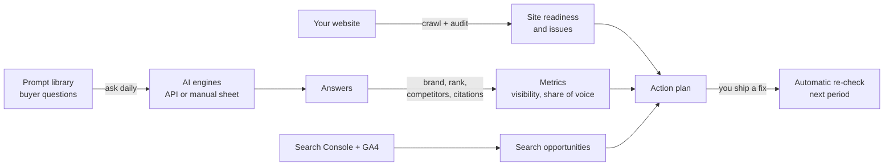

<div align="center">


# craftsail-growth

**See how ChatGPT, Claude, Gemini, Perplexity and DeepSeek talk about your brand, and what to change so they recommend you.**

Open-source, self-hosted GEO (generative engine optimization) and SEO dashboard.
One Go binary, SQLite by default, your data stays on your server.

[](https://github.com/craftsail/craftsail-growth/actions/workflows/ci.yml)
[](LICENSE)
[](go.mod)
[](CONTRIBUTING.md)

[English](README.md) · [简体中文](README.zh-CN.md)

[Try the demo](#try-the-demo-in-one-minute) · [Quick start](#quick-start) · [Features](#features) · [How it works](#how-it-works)


</div>

## Why

More buyers now ask an AI assistant instead of typing a search. If the answer
lists three competitors and not you, you lose the deal before it starts, and
classic SEO tools will not tell you.

craftsail-growth asks the engines the questions your buyers ask, every day,
and measures:

- **Are you mentioned?** Visibility per engine and per question, with confidence intervals, not a single vanity number.
- **Who wins instead?** Share of voice against the competitors you track.
- **Which sources feed the answer?** Every cited URL, grouped into owned, competitor, review, social and reference sites.
- **What should you do next?** A ranked action plan from citations, the site audit and Search Console, re-checked automatically after you ship.

## Features

<table>
<tr>
<td width="50%"><b>Visibility by question</b><br>Mention rate over time for your brand and each competitor, per engine and per prompt.<br></td>
<td width="50%"><b>Share of voice</b><br>Your share of all brand mentions, the leaderboard and its trend.<br></td>
</tr>
<tr>
<td><b>Citations</b><br>Which domains and page types engines cite, and how often your own pages make it in.<br></td>
<td><b>Action plan</b><br>Prioritized, evidence-rated suggestions with acceptance checks that verify themselves on the next run.<br></td>
</tr>
<tr>
<td><b>Site audit for AI crawlers</b><br>Four layers in fix order: access, discover, understand, cite. Covers robots rules for AI bots, llms.txt, structured data and answerable content.<br></td>
<td><b>And also</b>
<ul>
<li>Query fan-out: the web searches engines actually ran</li>
<li>Every raw answer, with manual review and overrides</li>
<li>Manual sampling sheets for engines without an API</li>
<li>Google Search Console and GA4 import</li>
<li>Generated llms.txt, JSON-LD and FAQ snippets from your brand facts</li>
<li>Scheduled runs, reports, multiple projects and users</li>
<li>Dashboard in English, Chinese and Portuguese</li>
<li>Full CLI for scripts and cron</li>
</ul></td>
</tr>
</table>

**Engines:** OpenAI (ChatGPT), Anthropic Claude, Google Gemini, xAI Grok,
Perplexity, DeepSeek, Moonshot Kimi, ByteDance Doubao, Zhipu GLM and MiniMax.
Any OpenAI-compatible endpoint works through `*_BASE`.

## Try the demo in one minute

No API keys needed. This builds the dashboard with a fictional brand,
Quillpad, and 30 days of generated answers, then opens it:

```sh
git clone https://github.com/craftsail/craftsail-growth.git
cd craftsail-growth
make demo                 # needs Go 1.23+ and Node.js 20+
```

Sign in as `demo` / `quillpad-demo-2026`. `make demo DEMO_LANG=zh` gives
Chinese prompts and Chinese engines. Only the engines' answers are
simulated; crawling, the audit, citation analysis, metrics and the action
plan run the real code.

## Quick start

### Docker

One container, SQLite, images for `linux/amd64` and `linux/arm64`:

```sh
docker run -d --name craftsail-growth -p 8765:8765 \
  -e CRAFTSAIL_GROWTH_TOKEN=$(openssl rand -hex 24) \
  -e CRAFTSAIL_GROWTH_PASSWORD='replace-with-your-own-secret' \
  -v craftsail-growth-data:/app/data \
  -v craftsail-growth-config:/app/config \
  ghcr.io/craftsail/craftsail-growth:latest
```

The token is the admin API token and is required to listen on all
interfaces. With Docker Compose, use
[deploy/compose.sqlite.yml](deploy/compose.sqlite.yml) the same way.

Open <http://localhost:8765> and sign in as `admin`. Then add at least one
engine key under **Workspace → Model providers** and create a project from
your website URL; the first run drafts your brand facts, competitors and
prompts for you to review.

> [!IMPORTANT]
> Without `CRAFTSAIL_GROWTH_PASSWORD`, the first start creates `admin` /
> `craftsailgrowth`, and the dashboard asks for a new password at the first
> sign-in; the API refuses everything else until then. Whoever signs in
> first can set that password, so on a reachable server always set
> `CRAFTSAIL_GROWTH_PASSWORD`. Put the dashboard behind HTTPS before exposing
> it (see [deploy/nginx.conf](deploy/nginx.conf)).

For MySQL 8 instead of SQLite, use `deploy/compose.yml` (see the comments at
the top of that file).

### From source

```sh
make build              # builds the dashboard, then the craftsail-growth binary
./craftsail-growth ui   # creates config/default.toml on first run and opens the dashboard
```

The result is a single binary with the dashboard embedded. Copy it to any
machine of the same OS and architecture; nothing else is needed at runtime.

## How it works



1. **Set up a project** from your URL. The site is crawled, and brand facts, competitors and buyer prompts are drafted for you to review.
2. **Sample** the prompts on each engine on a schedule, several rounds a day, so the numbers carry confidence intervals.
3. **Analyze** every answer: is the brand mentioned, at what rank, which competitors appear, which URLs are cited.
4. **Act** on the ranked plan. Accepted actions carry an acceptance check, and the next period tells you whether they worked.

## Configuration

The first run copies [config/default.example.toml](config/default.example.toml)
to `config/default.toml` (not tracked by git).

| Section | Purpose |
|---|---|
| `[server.http]` | Host and port. Defaults to `127.0.0.1:8765`. |
| `[db]` | `dialect = "sqlite"` (default, file `data/craftsail-growth.db`) or `"mysql"`. |
| `[auth]` | First admin and an optional API token. |
| `[keys]` | Engine API keys and Google credentials. You can also set them in the dashboard under Workspace → Model providers. |

Environment variables override the file:

| Variable | Purpose |
|---|---|
| `CRAFTSAIL_GROWTH_HOST` | Listen address. Any address other than loopback requires a token. |
| `CRAFTSAIL_GROWTH_TOKEN` | Admin API token, sent as the `X-Craftsail-Growth-Token` header. |
| `CRAFTSAIL_GROWTH_USER`, `CRAFTSAIL_GROWTH_PASSWORD` | First admin, used only while the users table is empty. |
| `OPENAI_API_KEY`, `ANTHROPIC_API_KEY`, `GEMINI_API_KEY`, `PERPLEXITY_API_KEY`, `DEEPSEEK_API_KEY`, … | Engine keys. `*_BASE` and `*_MODEL` override the endpoint and model. |

**Google Search Console and GA4:** either a service account (`GOOGLE_SA_JSON`)
or OAuth (`GOOGLE_OAUTH_CLIENT_ID` / `_SECRET`). You connect it in the dashboard
under Workspace → Google Search & GA4.

## Command line

The binary is also a CLI and works against the same database:

```sh
craftsail-growth new --url https://example.com   # create a project and run its first period
craftsail-growth serve --slug example            # one full period: crawl, audit, sample, search, verify, report
craftsail-growth sample --slug example           # AI answer sampling only
craftsail-growth opportunities --slug example    # ranked action plan
craftsail-growth user passwd admin               # reset a password (reads stdin)
craftsail-growth --help                          # everything else
```

## FAQ

**Does it scrape the ChatGPT or Perplexity web apps?**
No. It calls the official APIs. For engines or product surfaces without an
API, export a sampling sheet, fill it in by hand and import it.

**How is this different from an SEO tool?**
SEO tools track rankings and clicks. This tracks whether AI answers mention
and cite you, next to the classic search data from Search Console.

**Where does my data go?**
Only to your server, the engine APIs you configure and Google, if you
connect Search Console. There is no telemetry.

**How much does sampling cost?**
With 10 prompts, 5 engines and 3 rounds a day, about 150 short API calls a
day. Every run records its planned calls and a token estimate on the
Schedule & runs page.

## Architecture

```
cmd/craftsail-growth   entry point
internal/cli           cobra commands; wires config, database and services
internal/api           HTTP handlers (gin) and auth
internal/router        serves the embedded dashboard
internal/service/*     business logic, one package per domain
                       (sample, audit, crawl, webstats, opportunity, report, ...);
                       jobs and pipeline orchestrate the others
internal/repo          database access (gorm)
internal/model         tables and migrations
internal/pkg/*         small helpers with no business logic
web/                   React + Vite + Tailwind dashboard, embedded into the binary at build time
deploy/                Docker Compose, nginx and MySQL examples
scripts/demo           demo data generator and screenshot script
```

Dependencies point one way: `cli → api → service → repo → model`.

## Contributing

Issues and pull requests are welcome. Read [CONTRIBUTING.md](CONTRIBUTING.md)
first. UI conventions (i18n, navigation, colors) are in [AGENTS.md](AGENTS.md).
To report a vulnerability, see [SECURITY.md](SECURITY.md).

If craftsail-growth is useful to you, a ⭐ helps others find it.

## License

[GNU Affero General Public License v3.0 or later](LICENSE). If you run a
modified version as a network service, you must offer its source code to the
users of that service.

Provider logos come from [LobeHub Icons](https://github.com/lobehub/lobe-icons)
(MIT, see [web/src/assets/providers/LICENSE.md](web/src/assets/providers/LICENSE.md)).
Product names and logos are trademarks of their owners and are used only to
identify each engine. The demo brand Quillpad and its competitors are
fictional.
