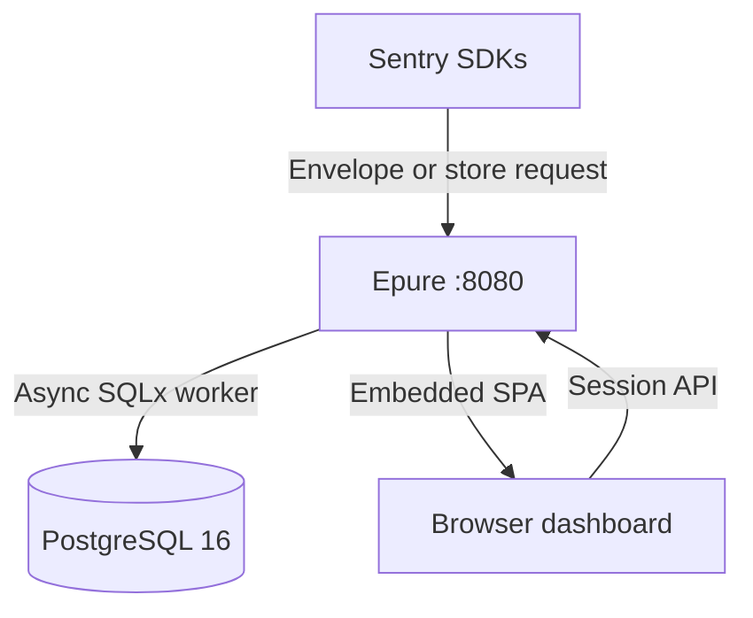

<p align="center">
  
</p>

<p align="center">
  <a href="https://github.com/epure-sh/epure/actions/workflows/ci.yml">
    
  </a>
  <a href="https://github.com/epure-sh/epure/actions/workflows/image.yml">
    
  </a>
  <a href="https://github.com/epure-sh/epure/releases/latest">
    
  </a>
  <a href="LICENSE">
    
  </a>
  <a href="https://www.rust-lang.org/">
    
  </a>
  <a href="https://www.postgresql.org/">
    
  </a>
  <a href="https://github.com/epure-sh/epure/pkgs/container/epure">
    
  </a>
</p>

# Epure

**Exception-only error tracking** you self-host. One Rust binary and PostgreSQL 16: two Compose containers, no Redis, Kafka, or ClickHouse. Keep the **official Sentry SDK**; point the **DSN** at Epure. [Apache 2.0](LICENSE). No `ee/` directory.

**Host up → DSN → one exception → Issues.** Walkthrough: [Quickstart](https://epure.sh/docs/get-started/quickstart) · [Docs hub](https://epure.sh/docs)

When production throws, you get a grouped issue, a readable stack, breadcrumbs, and release context, not tracing, session replay, profiling, or generic logs. Idle footprint on a small VPS is about **53 MiB combined** ([how we measured](#resource-usage)).


## Start here

| | |
| --- | --- |
| **[New to Epure](https://epure.sh/docs/get-started/welcome)**: welcome, quickstart, first issue | **[From Sentry](https://epure.sh/docs/guides/migrate-from-sentry)**: DSN swap, sample rates, maps |
| **[Self-host ops](https://epure.sh/docs/guides/production-checklist)**: HTTPS, backups, upgrades | **[API & agents](https://epure.sh/docs/guides/mcp-and-cli)**: ingest, MCP, `epure-cli`, PATs |

## Run it

Docker Engine and Compose v2:

```bash
git clone https://github.com/epure-sh/epure.git
cd epure
docker compose up -d
```

Open [http://localhost:8080](http://localhost:8080), register, create a project, copy the DSN. Confirm health:

```bash
curl -sS http://localhost:8080/health
# {"status":"ok"}
```

Pin a release ([GitHub Releases](https://github.com/epure-sh/epure/releases)) instead of `:latest`:

```bash
EPURE_IMAGE=ghcr.io/epure-sh/epure:v0.1.2 docker compose up -d
```

Ports, `.env`, source builds, and production hardening: [Installation](https://epure.sh/docs/self-hosting/installation) · [`deploy/`](deploy/README.md)

## First exception

Epure does not ship a client SDK. Use your runtime’s official Sentry package; set tracing, replay, and profiling sample rates to **0**:

```javascript
import * as Sentry from "@sentry/node";

Sentry.init({
  dsn: process.env.SENTRY_DSN, // Epure DSN from the UI
  tracesSampleRate: 0,
  replaysSessionSampleRate: 0,
  replaysOnErrorSampleRate: 0,
  profilesSampleRate: 0,
});

Sentry.captureException(new Error("Epure test event"));
```

Already running? Copy the DSN from **Settings → SDK connection** or use the in-app **Setup** wizard. Other languages, tabs, and verify steps: [Quickstart](https://epure.sh/docs/get-started/quickstart). Platform matrix: [Pick your SDK](https://epure.sh/docs/platforms).

## Deploy

[](https://render.com/deploy?repo=https://github.com/epure-sh/epure)

Railway, Coolify, Dokploy, and VPS production paths: [Installation → PaaS and panels](https://epure.sh/docs/self-hosting/installation#paas-and-panels) (templates live in this repo under `deploy/`).

## What you get

Grouped issues, JS/TS sourcemaps, releases and regressions, alerts and webhooks, multi-project orgs, DSN rotation, RBAC, PostgreSQL RLS, keyboard triage, spike protection, and **Copy for AI** Markdown export. Deeper product map: [Documentation](https://epure.sh/docs).

## Coding agents

1. Point your SDK at Epure and open an issue.
2. **Copy for AI** (button, command palette, **⌘⇧C** / **Ctrl+Shift+C**).
3. Paste into Cursor or Claude Code → minimal fix → **Resolve** in the UI.

Optional automation: scoped PATs, [Agent API](https://epure.sh/docs/api/agent), `epure-cli`, stdio MCP ([`tools/epure-mcp`](tools/epure-mcp/README.md)). See [MCP and epure-cli guide](https://epure.sh/docs/guides/mcp-and-cli). Agent Skills: `npx skills add epure-sh/epure --skill epure-setup` · `epure-triage`.

## How it works



Ingest acknowledges fast; a background worker demangles, scrubs, groups, and writes to Postgres. [Concepts](https://epure.sh/docs/get-started/concepts) · ingest [OpenAPI](docs/ingest.openapi.yaml)

## Project status

Early release: good for homelabs, side projects, and small teams who have tested backup and upgrade paths. Pin `ghcr.io/epure-sh/epure:v0.1.2` (or accept `:latest` rollouts). Expect SDK and protocol gaps; report compat issues with language, SDK version, Epure tag, and a sanitized payload. [Changelog](CHANGELOG.md)

## Contributing & support

[CONTRIBUTING.md](CONTRIBUTING.md) · [.github/SUPPORT.md](.github/SUPPORT.md) · [Discussions](https://github.com/epure-sh/epure/discussions) · [Issues](https://github.com/epure-sh/epure/issues) · [Security](.github/SECURITY.md)

## License

[Apache License 2.0](LICENSE). No separate closed-source core.

---

<details>
<summary><strong>Compare with other self-hosted trackers</strong></summary>

Epure is exception tracking only, not a full observability platform.

| | Epure | Bugsink | Sentry self-hosted | GlitchTip |
| --- | --- | --- | --- | --- |
| Primary focus | Exception tracking | Self-hosted error tracking | Broad observability | Error tracking and performance monitoring |
| Deployment | Two-container Compose: app + PostgreSQL | Single-container `docker run` quickstart; other layouts in their install docs | Large multi-service deployment | Multiple deployment options |
| License | Apache 2.0. No `ee/` directory | PolyForm Shield 1.0.0 | Check the current Sentry license | MIT |
| SDK path | Change the DSN on an official Sentry SDK | See their docs | Change the DSN | Change the DSN |
| Database | PostgreSQL 16 | See their docs | Several services depending on configuration | PostgreSQL |
| Best fit | Indie SaaS, small teams, homelabs | See their docs | Teams needing a broad platform | Teams wanting a Sentry-compatible alternative |

Bugsink cells sourced from their [README](https://github.com/bugsink/bugsink/blob/main/README.md), [LICENSE](https://github.com/bugsink/bugsink/blob/main/LICENSE), and [installation overview](https://www.bugsink.com/docs/installation/) (reviewed 2026-09-28). Memory use not compared. If GlitchTip already fits, keep it.

</details>

<details>
<summary><strong>Out of scope</strong></summary>

Epure does not provide distributed tracing, session replay, continuous profiling, generic log ingestion, infrastructure metrics, iOS/Android symbolication, Redis/Kafka/ClickHouse, full 1:1 Sentry protocol parity, or high-volume analytics stacks. Scope may grow incrementally; it will not become every observability product at once.

</details>

<details>
<summary><strong>Resource usage</strong></summary>

Measured with `docker stats` on a 2 vCPU / 769 MiB Linux VPS (Alibaba Cloud) on 2026-09-23, classic Compose (`epure` + `postgres`):

- **Idle:** Epure ~5 MiB RSS, PostgreSQL ~48 MiB RSS (~53 MiB combined).
- **Short ingest burst** (~280-330 req/s on that host): Epure under ~12 MiB RSS; PostgreSQL ~70 MiB.
- **First test issue** after stack up: ~10 s (Docker Desktop, 2026-09-20).

An earlier Docker Desktop idle run showed ~50 MiB RSS for the Epure container alone (2026-09-20). Re-verify on your hardware; OS, runtime, and DB state move these numbers.

Spike defaults and limits: [Configuration](https://epure.sh/docs/self-hosting/configuration).

</details>
