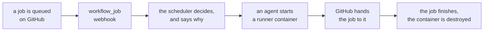

<div align="center">

<picture>
  <source media="(prefers-color-scheme: dark)" srcset="docs/brand/logo-master-dark.png">
  
</picture>

# Give your GitHub Actions runners the Zoomies.

**Free and open source.** Install in minutes, manage every runner from a live
web UI, and move off static runners without rebuilding your CI.

Zoomies gives each job a fresh runner, scales across the hosts and runner
operating systems you already use, and makes the fleet easy to see and
operate — without Kubernetes and without a database server.

Single Go binary. SQLite. AGPL-3.0.

*The [support matrix](https://zoomies.sh/#what-is-qualified) separates what a
test has actually run on from what merely builds. Read it before you put
anything precious on this.*

[](LICENSE)
[](https://github.com/eyupio/zoomies/releases)
[](https://github.com/eyupio/zoomies/actions/workflows/ci.yml)
[](https://codecov.io/gh/eyupio/zoomies)
[](https://scorecard.dev/viewer/?uri=github.com/eyupio/zoomies)
[](https://www.bestpractices.dev/projects/14604)
[](https://zoomies.sh)
[](https://zoomies.sh)
[](https://github.com/eyupio/zoomies/actions/workflows/zoomies-ai-context.yml)


```sh
curl -fsSL https://zoomies.sh/install.sh | sh
```

Just looking? Add `-s -- --demo` after `sh` and nothing is installed: a
controller with a fleet already in it runs on your machine only, and goes when
you press Ctrl-C.

**[zoomies.sh](https://zoomies.sh)** ·
[Quick start](https://zoomies.sh/quickstart/) ·
[See the web UI](https://zoomies.sh/ui/) ·
[Architecture](https://zoomies.sh/architecture/) ·
[Configuration](https://zoomies.sh/configuration/) ·
[Migrating](https://zoomies.sh/migration/) ·
[Security](https://zoomies.sh/security/) ·
[API](https://zoomies.sh/api-surface/) ·
[FAQ](https://zoomies.sh/faq/)

<br>

<picture>
  <source media="(prefers-color-scheme: dark)" srcset="docs/screenshots/overview-dark.webp">
  
</picture>

</div>

---

## Your home lab. Your runner fleet.

**Bring private machines into the pack with built-in Tailcat connections.**
Use the hardware you already own for GitHub Actions: no public host IP,
no port forwarding, no Tailscale account and no separate tunnel installation.
Choose **Private connection · Tailcat** in Add a host, run one command, and
manage private and cloud hosts together in the live web UI.

Free and open source. Your hardware, your network, one pack.
[Connect a private host](docs/private-hosts.md).

## What it does

You point Zoomies at a GitHub organisation, or at a repository on a personal
account. It watches for queued jobs, starts a fresh runner for each one, and
destroys the runner when the job finishes.



* **A live web UI.** Thirteen pages, one job each, all updating in place from the
  controller's event stream — you never have to press refresh, though there is a
  button where you want to be sure. Light and dark, a command palette, and a log
  viewer built for a hundred thousand lines.
  [See every page](https://zoomies.sh/ui/).
* **Elastic CPU zoomies.** Every runner keeps its guaranteed share of its
  host, and a busy one is lent the CPU nobody else is using — the next queued
  job's room held back, the host's reserve untouched. New pools measure it by
  default and move nothing until you say so.
  [How it works](https://zoomies.sh/elastic-cpu/).
* **Elastic memory.** A job about to be killed for its memory limit is given
  more, out of memory no other runner on its host was promised — raised, never
  lowered, with swap as the last resort. [How it works](https://zoomies.sh/elastic-memory/).
* **Ephemeral by default.** One job per runner. Nothing leaks from one workflow
  run to the next.
* **No pasted tokens.** Zoomies authenticates as a GitHub App and mints
  single-use JIT registrations itself.
* **Event-driven.** `workflow_job` webhooks, with polling only as a fallback so
  a misconfigured webhook does not silently stop your fleet.
* **Multi-host, multi-OS.** One controller, any number of agents. Agents connect
  outbound only, so a host behind NAT needs no inbound rule. Runner images for
  Ubuntu 24.04, Ubuntu 26.04, Ubuntu 22.04, Debian 12, Debian 13, Fedora 42 and
  Rocky Linux 9, each for amd64 and arm64 — and a pool is only ever
  placed on a host that matches the one it asked for.
* **Actually observable.** SQLite for state, Prometheus metrics, structured
  logs, live log streaming, job history with queue waits, and an audit row for
  every mutating action.
* **Backed up by itself, and off the machine.** A consistent copy of the
  database nightly, kept to a ceiling, and every copy sent on to as many
  S3-compatible destinations as you name — added and tested from the Backups tab
  without editing a file or restarting anything, sealed with that destination's
  passphrase before it leaves the host, and caught up automatically after a
  bucket that was unreachable comes back. The same tab takes one now, verifies it, downloads it
  plain or sealed, brings one back out of a bucket, uploads one from elsewhere,
  and stages a restore the next restart applies. The configuration alone exports
  as a `zoomies.yaml` and imports with a preview.
  [Backup and restore](https://zoomies.sh/backup-and-restore/).
* **Safe defaults.** Loopback bind, auth on, no Docker socket in your jobs, no
  root, and every deviation named at startup and in the UI. A self-hosted runner
  still runs your repositories' code —
  [what that does and does not protect](https://zoomies.sh/security/).

## Quick start

Five minutes on a fresh Ubuntu, Debian, Fedora or Alpine host.

```sh
curl -fsSL https://zoomies.sh/install.sh | sh
```

The script checks what it needs before it downloads anything — the platform it
is fetching for, whether the install prefix can be written and with what,
whether there is a terminal to run setup on — shows you what it is about to do,
and asks once. Then it hands off to `zoomies init`.

**How setup finishes depends on how you choose to run Zoomies**, and that is the
one fork worth knowing about before you start. Compose is the default whenever
you have a `compose` command:

#### Native — finishes in the terminal

1. **Install mode** — single VM with an embedded agent, controller only, or
   agent only.
2. **Service user and directories** — a dedicated unprivileged `zoomies` user.
3. **Backend** — rootless Docker if it finds one, otherwise Docker, Podman or
   bare process, with the trade-off on every option.
4. **Bind address and TLS** — loopback, a certificate you provide, a
   self-signed one, or reverse-proxy mode.
5. **Review** — the whole plan and the exact files it will write, before
   anything is written. Install, change an answer, or stop.
6. **GitHub App** — opens your browser at a pre-filled App manifest with
   exactly the permissions Zoomies needs and the webhook URL already set. It
   asks first whether you also want migration pull requests, which is the one
   thing that needs write access to code, and the answer is no unless you
   say otherwise. Create it, and the credentials come back to the installer
   automatically.
7. **First admin account**, and a **first pool** sized for the host.
8. **Service** — a hardened systemd unit (or launchd), started and
   health-checked.

It finishes with the URL, your login, and the `runs-on:` line to put in a
workflow.

#### Compose or Docker — finishes in the browser

The same questions up to the review, then it writes the deployment
(`docker-compose.yml` and a fully populated `.env`, or one container and an
env file) and brings it up. The database lives in a volume this installer
cannot open, so the last three steps happen in the browser instead: create
the first administrator, connect GitHub, create a pool. The closing summary
prints all three with their exact addresses, and the Overview repeats them
as a checklist that ticks itself off.

Prefer to read it first? That is the intended way, and
[the quick start](docs/quickstart.md#1-install) has the three lines that
download it, page through it and then run it. Automating it instead? Every
prompt has a flag and the rest has an answer file:
[unattended installs](docs/quickstart.md#unattended-installs).

### Docker Compose instead

```sh
git clone https://github.com/eyupio/zoomies && cd zoomies
cp .env.example .env
$EDITOR .env          # ZOOMIES_EXTERNAL_URL, ZOOMIES_ENCRYPTION_KEY, DOCKER_GID
mkdir -p data && sudo chown 65532:65532 data   # the container runs as 65532
docker compose up -d
docker compose logs zoomies | grep 'setup token'
```

Then open the controller, paste that token, and create the first administrator.
The token is what proves the instance is yours: the origin is reachable the
moment the container starts, and an empty database is a thing a stranger can
find too. It changes on every restart and stops being printed once an account
exists. (The installer above creates the administrator on the console, so it
never needs one.)

Three values are required, and compose will not start without them:

* `ZOOMIES_EXTERNAL_URL` — the https address you and GitHub reach the
  controller at. Webhooks are delivered there, and creating the GitHub App
  sends your browser back there.
* `ZOOMIES_ENCRYPTION_KEY` — `openssl rand -base64 32`. Back it up; without it
  the stored App key cannot be read.
* `DOCKER_GID` — the gid that owns `/var/run/docker.sock`, which
  `stat -c '%g' /var/run/docker.sock` prints. It is not always the group called
  `docker`. The container is put in that group so it can create runner
  containers; with the wrong number it comes up healthy and can start nothing.
  If that happens, the Hosts page says which group the container holds and
  which line to change, and `docker compose up -d` recreates it. If `stat`
  prints `0`, the socket belongs to root's group: give it a group of its own
  (`sudo groupadd docker`, then restart the daemon) or use a rootless daemon
  rather than putting the container in group 0.

The database lives in `./data` beside the compose file, so a backup is a copy
of a directory. It has to be owned by uid 65532: a bind mount keeps the host
directory's ownership, and the container is not root, so the `chown` needs
`sudo`.

Open the https address, not `http://<ip>`: the session cookie is marked Secure
because the external URL is https, and a browser on a plain-http page throws
it away. Zoomies refuses to sign you in from such a page and says why.

This path has no `zoomies init`, so nothing creates a pool for you. Once
GitHub is connected, make the first one on the **Pools** page; nothing runs
until a pool exists.

The compose file is set up for running behind Cloudflare: the origin serves
plain HTTP on port 80 and Cloudflare terminates TLS, with `ZOOMIES_EXTERNAL_URL`
set to the https address so cookies, webhook URLs and links are all correct, and
Cloudflare's ranges in `ZOOMIES_TRUSTED_PROXIES` so the audit log records real
client addresses rather than Cloudflare's. Firewall the origin to Cloudflare, or
use a Tunnel and publish no port at all. See
[docs/configuration.md](docs/configuration.md#behind-cloudflare-or-any-reverse-proxy).

### On a PaaS, with Nixpacks

There is a `nixpacks.toml` in the repository root, so a platform that builds
with [Nixpacks](https://nixpacks.com) — Coolify, Dokploy, Railway, Zeabur,
Easypanel — can deploy Zoomies from the source: point it at this repository,
set `ZOOMIES_EXTERNAL_URL`, `ZOOMIES_ENCRYPTION_KEY` and
`ZOOMIES_TRUSTED_PROXIES`, and mount a volume at `/data`.

What you get is a **controller**, not a fleet. A PaaS gives a container no
Docker socket, so the embedded agent is off and nothing on that host can start
a runner: join agents from machines that do have a container runtime, exactly
as below. See [docs/paas.md](docs/paas.md).

### From a provider's marketplace

`deploy/marketplace/` renders a cloud-config that boots an instance into a
running controller: pinned images, HTTPS however you want it in front — a
Cloudflare Tunnel with no inbound rule at all, Cloudflare in front of a
published origin, a certificate from Let's Encrypt, one of your own, or your
load balancer — and no credential in the instance metadata. The first
administrator is created in the browser with the setup token the controller
prints, and GitHub is connected there too.

It deploys a **controller**. Zoomies stays self-hosted and
bring-your-own-infrastructure: you own the runner capacity, whether that is the
same instance, your own machines, or a hypervisor. See
[docs/marketplace.md](docs/marketplace.md) — including what it has not yet been
tested on.

### Add another host

**Hosts → Add a host** comes filled in from what the controller already knows
and hands you one line to paste on the new machine; leave the page open and it
says the moment the host has joined. The token is single-use, and the agent
dials out rather than being dialled, so nothing has to be opened on either
firewall. The [quick start](docs/quickstart.md#adding-another-host) has the line
itself.

A host that would rather not have a binary on it can run
`ghcr.io/eyupio/zoomies-agent` instead, ideally on the same tag as the
controller. `latest` is the newest release and `dev` is the tip of `main`, for
the controller and the agent alike; the runner images are the exception and
still track `main`.
[Which image tag to run](docs/upgrading.md#which-image-tag-to-run) is the table,
and [an agent in a container](docs/hosts-and-pools.md#an-agent-in-a-container)
is what it needs.

## Your first pool

A pool says what labels your runners answer to and how many may exist. On a
single-host install, setup creates one for you once GitHub is connected, derived
from what the host actually is: named after the platform, capped at the
machine's capacity, nothing kept idle when nothing is queued, ephemeral, and
Docker with no socket reachable from the job. The
[quick start](docs/quickstart.md#4-your-first-pool) has the settings it lands
on. A workflow that builds images needs one more thing from its pool, *Docker
in jobs* set to `dind`, and that is the whole change: the pool is switched to
a runner image with a Docker client as it is saved.

Then in a workflow:

```yaml
jobs:
  build:
    runs-on: zoomies-linux-x64
    steps:
      - uses: actions/checkout@v4
      - run: make test
```

Push it. Zoomies sees the `workflow_job` webhook, starts a runner, and you watch
the whole thing happen on the Overview page without refreshing.

One label is enough, and it is branded on purpose: a reviewer can tell at a
glance that the job has left GitHub's runners. [The labels to give a
pool](docs/configuration.md#the-labels-to-give-a-pool) has the rest, including
the `zoomies` label every pool answers to.

## Moving your repositories over

You do not have to edit every workflow by hand. **Migrate** in the UI reads the
workflows in the repositories your App can see, rewrites their `runs-on` lines,
shows you the exact diff, and opens one pull request per repository.

It changes `runs-on` and nothing else — comments, indentation and quoting all
survive byte for byte — and it refuses to guess: a job on `${{ matrix.os }}`, a
job already on a self-hosted runner, or a label you chose not to map is listed as
left alone, with the reason, both in the review screen and in the pull request
body.

It needs three App permissions the rest of Zoomies deliberately does not ask for
(Contents, Pull requests, Workflows) — connecting GitHub asks whether you want
them, and the default is no — and it tells you which are missing before it tries
anything.

**Already running your own static runners?** Then the wizard is not the tool —
it deliberately leaves those jobs where they are, because somebody made that
decision on purpose. Give a Zoomies pool the label your existing runners already
advertise and not a line of any workflow changes: the same `runs-on` reaches the
new fleet, and you retire the old machines as the work moves across.

See [docs/migration.md](docs/migration.md).

## The UI

Thirteen pages, one job each: **Overview** (fleet health, queue depth, scaling
decisions in plain words, and a problems panel that is quiet when nothing is
wrong), **Pools**, **Runners**, **Queue**, **Workflows** (one row per
workflow run, opening to the jobs inside it), **Usage**, **Hosts**,
**Providers**, **Installations**, **Migrate**, **Kennel Club** (the repositories this fleet
serves, checked against what affects CI, with **AI Context** inside it), **Audit**, **Settings**. It is
the primary way to configure and run a fleet, and the docs describe each task
from there first; the CLI, Compose and the API are
[the other ways in](https://zoomies.sh/#run-it-from-the-browser-reach-it-from-anywhere).

<table>
  <tr>
    <td width="50%" valign="top">
<picture>
  <source media="(prefers-color-scheme: dark)" srcset="docs/screenshots/problems-dark.webp">
  
</picture>
      <p align="center"><sub>The problems drawer: what is true, why it matters, what to change.</sub></p>
    </td>
    <td width="50%" valign="top">
<picture>
  <source media="(prefers-color-scheme: dark)" srcset="docs/screenshots/job-dark.webp">
  
</picture>
      <p align="center"><sub>A job that went wrong, and where.</sub></p>
    </td>
  </tr>
  <tr>
    <td width="50%" valign="top">
<picture>
  <source media="(prefers-color-scheme: dark)" srcset="docs/screenshots/hosts-dark.webp">
  
</picture>
      <p align="center"><sub>Hosts, their room left, and the backends their agents found.</sub></p>
    </td>
    <td width="50%" valign="top">
<picture>
  <source media="(prefers-color-scheme: dark)" srcset="docs/screenshots/migrate-dark.webp">
  
</picture>
      <p align="center"><sub>Migrate: the exact diff before a pull request is opened.</sub></p>
    </td>
  </tr>
</table>

Light and dark, keyboard-driven, a `⌘K` command palette, live everywhere, and a
log viewer that handles a hundred thousand lines. Every page is shown at
[zoomies.sh/ui](https://zoomies.sh/ui/). The screenshots are taken from the
real binary against its demo fleet by `make screenshots`, so they cannot show
a page the product does not have. Design system in
[docs/ui-guidelines.md](docs/ui-guidelines.md), identity in
[docs/brand.md](docs/brand.md).

## The CLI

Fleet commands and the UI share the same REST API. Local host OS checks and
tuning use the installed native binary: health is visible in the UI, while
changes require explicit consent in the CLI.

```sh
zoomies status                       # the Overview, in a terminal
zoomies pools list
zoomies pools create --name zoomies-linux-x64 --labels zoomies-linux-x64 --installation ins_k3f9qz2m --max 8
zoomies pools edit pool_k3f9qz2m --cpu-burst automatic   # lend busy runners the host's spare CPU
zoomies runners list --state busy
zoomies runners drain run_k3f9qz2m
zoomies runners logs run_k3f9qz2m --follow
zoomies jobs list --repo acme/widgets --since 24h
zoomies hosts join-token create --ttl 15m
zoomies doctor                       # readable OS health summary
sudo zoomies doctor --interactive    # review and approve individual fixes
sudo zoomies tune --dry-run           # exact proposed changes
sudo zoomies tune --revert            # restore recorded host settings
zoomies audit tail
```

```sh
export ZOOMIES_URL=https://zoomies.example.com
export ZOOMIES_TOKEN=zoo_...
```

Host health is collected by the native agent, or by a read-only native health
service for container deployments, and updates the host badges automatically.
Upgrades never apply tuning. See [Host health and tuning](docs/host-health.md).

A coding agent gets the same fleet over the Model Context Protocol, either
straight from the controller at `/mcp` with a token or through `zoomies mcp`
on its own machine. It reads failed jobs, their timelines and runner logs, and
can act only as far as its token's role allows — see
[the CLI reference](docs/cli.md#zoomies-mcp).

```sh
claude mcp add --transport http zoomies https://zoomies.example.com/mcp \
  --header "Authorization: Bearer zoo_..."
```

## Configuration

One `zoomies.yaml`, every key overridable with a `ZOOMIES_*` environment
variable. It is validated on startup, and the errors tell you what to change:

```text
configuration is not valid:
  - server.tls.mode: "selfsigned" is not a TLS mode
      fix: use "off", "self-signed" or "files".
```

Warnings are separate from errors and never stop startup, but each one names a
setting that weakens the default posture:

```text
[warning] listening on 0.0.0.0:8080 without TLS -- session cookies, API tokens
and the GitHub App private key you paste during setup all cross the network in
cleartext. Fix: put a TLS-terminating reverse proxy in front, or set
server.tls.mode to self-signed or files.
```

The same list appears in the UI's problems panel. See
[docs/configuration.md](docs/configuration.md) for every key and
[docs/security.md](docs/security.md) for what each dangerous one costs.

## Requirements

* Linux (amd64 or arm64) for the controller and agents. macOS is supported for
  running the controller in development.
* Docker or Podman for the container backends — **rootless preferred**, and the
  installer looks for a rootless socket first. `install.sh` offers to install
  one for you on a Linux host that has neither.
* A GitHub App on github.com. The installer creates it for you. Enterprise
  Server is what `github.api_base_url` exists for and the configuration is
  validated for it, but no test has run against one yet.
* No database server, no Kubernetes, no message queue.

## Building from source

```sh
git clone https://github.com/eyupio/zoomies && cd zoomies
make build        # builds the UI and embeds it
./zoomies version
```

Go 1.25 or later, and Node 22 or later. `go.mod` sets the language version at
1.25 and that is the floor a contributor needs; CI builds and releases with
1.26. Node is a build-time dependency only — the binary is
self-contained.

```sh
make test         # Go tests
make lint         # vet, gofmt, staticcheck, UI lint
make test-ui      # Playwright
make dev          # controller with auth off, for UI work
make ui-dev       # Vite dev server against it
```

## How it compares

Zoomies is what you want when [ARC](https://github.com/actions/actions-runner-controller)
is too much machinery — you have a VM or three, not a cluster — but a handful of
hand-registered long-lived runners is too little.

| | ARC | A few static runners | Zoomies |
| --- | :---: | :---: | :---: |
| Runs without Kubernetes | — | ✓ | ✓ |
| Ephemeral runners | ✓ | rarely | **default** |
| Autoscaling | ✓ | — | ✓ |
| Multi-host | ✓ | — | ✓ |
| Auth model | GitHub App | a PAT per runner | **GitHub App** |
| Web UI | — | sometimes | ✓ |
| Audit log | — | — | ✓ |
| To install | Helm, CRDs, a cluster | manual | **one command** |

Featured in DevToolLab's
[guide to CI acceleration services](https://devtoollab.com/blog/ci-acceleration-services).

## Project layout

```text
cmd/zoomies         the binary: controller, agent, init, CLI
internal/store      domain model, SQLite schema, every query
internal/config     zoomies.yaml + env, and the validator that warns
internal/scheduler  pure scaling decisions, label matching and platform fit
internal/naming     the zoomies-* naming grammar and the runner image catalogue
internal/machine    what host this process is running on: distro, release, size
internal/github     App auth, JIT configs, webhooks, the fallback poller
internal/backend    Docker, Podman and bare-process runner backends
internal/auth       identity, RBAC, tokens, audit, OIDC
internal/api        REST, SSE, metrics, and the embedded UI
internal/controller the reconcile loop and the agent task queue
internal/agent      the runner-executing half
internal/installer  zoomies init / uninstall / agent join, and the unit,
                    compose and env templates they write
internal/backup     one copy of the database: taking, listing, verifying, archiving,
                    encrypting and restoring it, shared by the CLI, the scheduler and the API
internal/cryptox    AES-256-GCM at rest, argon2id, token hashing
internal/events     in-process pub/sub that the SSE endpoint fans out
internal/migrate    rewriting workflows' runs-on lines
web/                the Svelte 5 UI
test/e2e            the Docker end-to-end test, behind the `e2e` build tag
api/openapi.yaml    the contract both clients are generated from
deploy/             the controller and runner images, and the runner entrypoint
docker-compose.yml  the compose deployment
docs/               the zoomies.sh site: architecture, naming, security,
                    UI guidelines, configuration, brand
overrides/          the site's theme overrides: sharing tags, structured data,
                    the header's repository facts
hooks/              the site's build-time metadata: git dates, llms.txt, and the
                    latest release and star count the header shows
ROADMAP.md          the sole active roadmap: scope, order and owner decisions
roadmap/            supporting status/evidence, decision records, model guidance
                    and historical source material; it does not compete with ROADMAP.md
install.sh          the one-line installer, served from the site root
mkdocs.yml          how docs/ becomes zoomies.sh
nixpacks.toml       how a Nixpacks-based PaaS builds and runs the controller
```

## The website

[zoomies.sh](https://zoomies.sh) is built from `docs/` by MkDocs, so the site
cannot drift from the repository, and `install.sh` is copied to the site root
from the one in this repository's root -- the script you `curl` and the script a
contributor edits are the same file, and CI asserts they are byte-identical.

```sh
pip install -r docs/requirements.txt
mkdocs serve          # http://127.0.0.1:8000
mkdocs build --strict # a link that points nowhere fails the build
```

## Contributing

Read [docs/architecture.md](docs/architecture.md) first, then
[docs/dependencies.md](docs/dependencies.md) — every dependency needs a
one-line justification, and that is enforced by review. UI changes should keep
[docs/ui-guidelines.md](docs/ui-guidelines.md) true.

## Licence

GNU Affero General Public License, version 3 (`AGPL-3.0-only`). See
[LICENSE](LICENSE). Copyright (C) 2026 Zoomies contributors.

The AGPL is the GPL with one addition, and the addition is the point: anyone
who modifies Zoomies and lets other people use the modified version over a
network -- a hosted runner service built on it, say -- has to offer those
people the source of what they are running. Running it for your own
organisation, changed or not, asks nothing of you.

---

<div align="center">


**Zoomies** · Self-hosted Git runners<br>
Developed by [EyUp.io](https://eyup.io)

</div>
