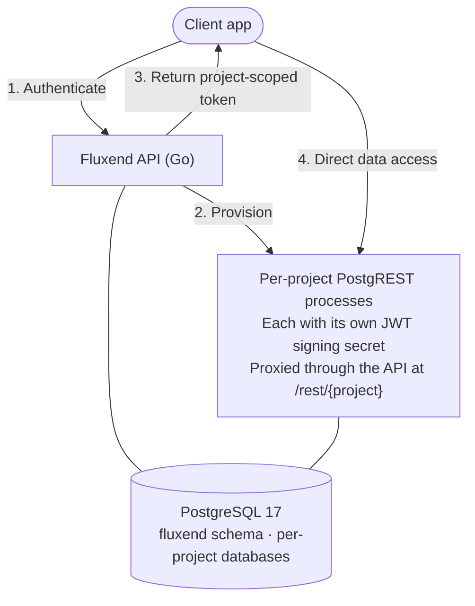

<h1 align="center">⚡️ Fluxend</h1>

<p align="center">
  <strong>Open source, self-hosted Backend-as-a-Service built with Go.</strong><br>
  Instant REST APIs, auth, file storage, forms, and audit logs. All on your own PostgreSQL database.
</p>

<p align="center">
  <a href="https://github.com/fluxend/fluxend/actions"></a>
  <a href="https://github.com/fluxend/fluxend/blob/main/LICENSE"></a>
  
  
  <a href="https://hub.docker.com/u/fluxend"></a>
  <a href="https://github.com/fluxend/fluxend/stargazers"></a>
</p>

<p align="center">
  <a href="https://console.fluxend.app/">🚀 Live Demo</a> •
  <a href="https://docs.fluxend.app/">📚 Docs</a> •
  <a href="https://docs.fluxend.app/quickstart">⚡ Quick Start</a> •
  <a href="https://docs.fluxend.app/faq">❓ FAQ</a> •
  <a href="https://docs.fluxend.app/development">🛠️ Development</a> •
  <a href="https://github.com/fluxend/fluxend/issues">🐛 Issues</a>
</p>

<p align="center">
  
</p>

---

## What is Fluxend?

Fluxend is a self-hosted, open source Backend-as-a-Service (BaaS). It gives you the developer experience of Firebase or Supabase: instant APIs, authentication, and file storage. Your data stays on infrastructure you control.

You define your database tables through the UI or API. Fluxend generates fully functional REST endpoints automatically, backed by PostgreSQL and served through PostgREST. No code generation. No lock-in. No monthly seat fees.

Go 1.23 · Echo · PostgreSQL 17 · PostgREST · Docker · React 19 · TypeScript

---

## Why Fluxend?

| | Firebase | Supabase | Appwrite | PocketBase | **Fluxend** |
|---|:---:|:---:|:---:|:---:|:---:|
| Self-hosted | ✗ | ✓ | ✓ | ✓ | ✓ |
| Open source | ✗ | ✓ | ✓ | ✓ | ✓ |
| Built with Go | ✗ | ✗ | ✗ | ✓ | ✓ |
| PostgreSQL native | ✗ | ✓ | ✗ | ✗ | ✓ |
| Dynamic REST APIs | ✗ | ✓ | ✓ | ✓ | ✓ |
| CSV/XLSX import to API | ✗ | ✗ | ✗ | ✗ | ✓ |
| Multi-tenant orgs + RBAC | limited | ✓ | ✓ | ✗ | ✓ |
| Per-project JWT isolation | ✗ | ✓ | ✗ | ✗ | ✓ |
| S3-compatible storage | ✗ | ✓ | ✓ | ✗ | ✓ |
| Audit logs | ✗ | ✗ | ✓ | ✗ | ✓ |
| Smart forms | ✗ | ✗ | ✓ | ✗ | ✓ |
| License | proprietary | Apache 2 | BSD | MIT | GPL-3.0 |

---

## Features

### Authentication and Access Control
- JWT authentication with login, registration, token invalidation, and session limits
- Organizations with four roles: Owner, Admin, Developer, and Explorer
- Per-project JWT secrets. Each project gets its own signing secret; a token from one project is rejected by another
- Row-level security enforced at the database level through PostgreSQL roles

### Database and REST APIs
- Instant REST APIs. Create a table, get full CRUD endpoints immediately through PostgREST
- Schema management: create, rename, and delete tables and columns through the API or UI
- Index management without writing SQL
- Stored functions: define and call PostgreSQL functions through a REST interface
- CSV and XLSX import. Upload a spreadsheet; Fluxend creates the table and API for you
- Table duplication in one call
- Auto-generated OpenAPI documentation for every project

### Storage
- File storage with four drivers: S3, Backblaze B2, Dropbox, or local filesystem
- File containers to organize uploads into named buckets
- Download endpoints with access control
- PostgreSQL backups per project, on-demand or scheduled

### Forms
- Forms with typed fields and validation rules
- Submissions collected and queryable through the API
- Field types: text, number, boolean, and more

### Observability
- Audit logs on every PostgREST request: user, method, status, and timestamp
- Database statistics: table sizes, row counts, and index usage per project
- Health endpoint to check container and database status across all projects

### Developer Experience
- Single `docker compose up` deploys Caddy, PostgreSQL, the API, and the frontend together
- CLI commands to restart PostgREST instances, run migrations, and seed settings
- Sentry integration, opt-in via environment variable
- Per-deployment CORS origin allowlist

---

## Quick Start

Requires Docker and Docker Compose.

```bash
git clone https://github.com/fluxend/fluxend.git
cd fluxend
cp .env.example .env   # fill in your values
docker compose up -d
```

Open `http://console.yourdomain.com` and register the first user.

Full setup guide: [docs.fluxend.app/quickstart](https://docs.fluxend.app/quickstart)

---

## How It Works



1. Users authenticate against the Fluxend API and receive a JWT.
2. Each project provisions a dedicated PostgreSQL database and a PostgREST process with its own signing secret, managed by the API.
3. Clients call `GET /projects/:id/token` to get a project-scoped token.
4. They use that token against the project's API at `/rest/{project}` for data access.
5. Caddy handles TLS termination for the API and console.

---

Full API reference: [docs.fluxend.app](https://docs.fluxend.app)

---


## Use Cases

**SaaS products**

The multi-tenant org structure and per-project RBAC are ready from day one. No extra configuration needed.

**Internal tools**

Point Fluxend at an existing PostgreSQL schema and get a working data API in minutes. No backend code needed.

**Rapid prototyping**

Go from idea to working API in under five minutes. Replace Fluxend with a custom service later if you outgrow it; your data stays in Postgres.

**Data collection**

Use the forms API to collect submissions from external sources without managing a backend.

**Firebase or Supabase migration**

Move off a vendor-hosted BaaS without rewriting your frontend. Fluxend speaks the same REST patterns.

---


## Contributing

The codebase is organized as a standard Go project. Backend lives in `internal/`, frontend in `web/`.

```bash
# Run the test suite
go test ./...

# Run integration tests (requires local PostgreSQL)
go test ./tests/integration/...

# Build
go build ./cmd/...
```

See [AGENTS.md](./AGENTS.md) for architecture notes and coding standards, and [docs.fluxend.app/development](https://docs.fluxend.app/development) for the full development guide.

- Check [open issues](https://github.com/fluxend/fluxend/issues) for things to work on
- Open a PR. Reviews are fast.

---

## License

GPL-3.0. See [LICENSE](./LICENSE).
