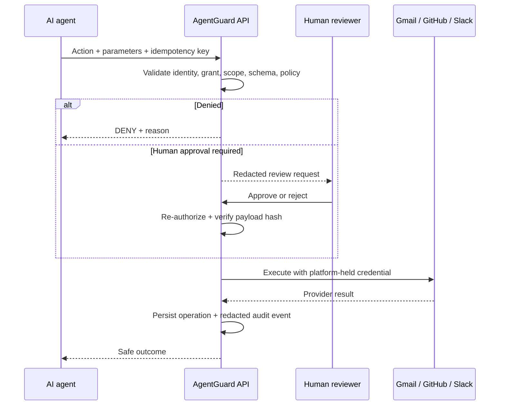
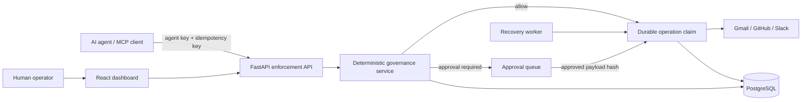

<p align="center">
  
</p>

<h1 align="center">AgentGuard AI Pro</h1>

<p align="center">
  <strong>Policy. Approval. Audit. Before agent action.</strong><br />
  A self-hosted control plane for governing what AI agents may do with business systems.
</p>

<p align="center">
  <a href="https://github.com/furkanulusoy/agentguardai-pro/actions/workflows/tests.yml"></a>
  <a href="LICENSE"></a>
  
  
</p>

<p align="center">
  <a href="README_TR.md">Türkçe</a> ·
  <a href="#five-minute-local-start">Quick start</a> ·
  <a href="#architecture">Architecture</a> ·
  <a href="docs/SECURITY_REVIEW.md">Security review</a> ·
  <a href="docs/ROADMAP_TO_PRODUCTION.md">Production roadmap</a>
</p>


AI agents can read data, send messages, and change external systems. AgentGuard places a deterministic security boundary between an agent and those tools. It decides whether an action is allowed, denied, or held for human approval; executes approved connector calls; and records a redacted audit trail.

> **Current maturity:** validated for controlled, small-tenant self-hosted pilots. This release is not presented as an internet-facing, highly available enterprise SaaS or as compliance-certified software. The remaining production controls are documented explicitly.

## Why AgentGuard?

Giving a model an OAuth token makes the model capable, but it does not create governance. AgentGuard keeps provider credentials away from the model and applies the same checks to every action before execution.

| Without a governance boundary | With AgentGuard |
|---|---|
| The agent receives broad provider credentials | Credentials stay encrypted in the platform |
| Tool code decides permissions independently | One deterministic enforcement point decides |
| Sensitive actions can execute immediately | Policy can require explicit human approval |
| Retries may duplicate external side effects | Durable operation claims and idempotency reduce duplicates |
| Logs may capture prompts, tokens, or payloads | Audit metadata is redacted; sensitive payloads are encrypted |
| One agent may discover another agent's data | Tenant and agent-scoped access is enforced and tested |

## Verified capabilities

- **Deterministic decisions:** `ALLOW`, `DENY`, and `REQUIRE_APPROVAL` results with policy reasons.
- **Least-privilege access:** tenant, user, agent, connector grant, action, and resource-scope checks.
- **Human approval integrity:** the reviewed payload is bound to execution by a hash and re-authorized before use.
- **Durable execution:** actor-scoped idempotency keys, committed execution claims, recovery of safe `READY` work, and explicit `UNKNOWN` outcomes.
- **Strict connector contracts:** unknown actions and unknown parameters fail closed before any provider call.
- **Credential and session controls:** encrypted connector secrets, HttpOnly refresh cookies, access-token rotation, and OAuth state replay protection.
- **Auditable administration:** approval, policy, permission, grant, and operation activity is recorded without raw secrets or connector payload values.
- **Multiple integration surfaces:** React dashboard, Python SDK, TypeScript SDK, and MCP server all use the same platform API.

### Connector surface

| Connector | Supported actions | Resource boundary |
|---|---|---|
| Gmail | `list_messages`, `read_message` | Connected mailbox; message IDs and selected headers only |
| GitHub | `list_repos`, `close_issue` | Explicit `owner/repository` grants |
| Slack | `list_channels`, `send_message`, `create_channel`, `delete_message`, `invite_user` | Explicit channel IDs or channel names |

GitHub OAuth may grant broader provider-side access than an AgentGuard grant. AgentGuard narrows that access at its application boundary. See the [security review](docs/SECURITY_REVIEW.md) for this and other documented limits.

## How an action moves through AgentGuard



## Five-minute local start

Requirements: Docker Desktop using Linux containers, PowerShell 7, Git, and an available port `5000`.

```powershell
git clone https://github.com/furkanulusoy/agentguardai-pro.git
cd agentguardai-pro
pwsh -File scripts/start-local.ps1
```

Open **http://localhost:5000** and create the first workspace account. There is no default username or password. The start script does not read or modify `.env`; it generates local-only infrastructure secrets under the git-ignored `.local/` directory.

For connector setup and the first guarded-agent flow, follow the [local product guide](docs/LOCAL_PRODUCT.md).

## Test with a local AI agent

The included runner can use a local Qwen3 model through Ollama. The model proposes tool calls; AgentGuard remains responsible for authorization, approval, execution, and audit.

```powershell
ollama pull qwen3:8b
$env:AGENTGUARD_AGENT_KEY = "PASTE_YOUR_AGENTGUARD_AGENT_KEY_HERE"
python sdk/python/examples/nemotron_agent.py --provider ollama "List my GitHub repositories. Do not change anything."
```

Use a dedicated test repository for mutation tests. Full hosted NVIDIA and local Ollama instructions are in the [guarded model demo](docs/NEMOTRON_DEMO.md).

## Architecture



`apps/api/services/governance.py` is the single platform enforcement point. SDKs, the dashboard, connectors, and the MCP server do not reimplement the authorization policy.

| Path | Responsibility |
|---|---|
| `apps/api` | HTTP API, authentication, tenant management, and enforcement |
| `apps/worker` | Recovery of safely retryable `READY` operations |
| `apps/web` | React administration dashboard |
| `connectors` | Gmail, GitHub, and Slack adapters with strict action schemas |
| `infrastructure` | PostgreSQL models, JWT handling, and encrypted secret storage |
| `agentguard` | Framework-independent Python guardrail engine |
| `sdk/python`, `sdk/typescript` | Thin clients for the platform API |
| `apps/mcp_server` | MCP-to-platform adapter |
| `tests` | Core, API, UI, SDK, and PostgreSQL security regressions |

## Verification

The current pilot release passed **322 Python tests against PostgreSQL with zero skips**, **11 frontend tests**, and **10 TypeScript SDK tests**. CI also runs Ruff, mypy, production builds, dependency audits, secret scanning, an MCP startup check, and a Docker self-host smoke test.

```powershell
pwsh -File scripts/test-local.ps1
npm --prefix apps/web ci
npm --prefix apps/web run lint
npm --prefix apps/web test
npm --prefix apps/web run build
npm --prefix sdk/typescript ci
npm --prefix sdk/typescript test
npm --prefix sdk/typescript run build
```

See the dated [release verification notes](docs/RELEASE_NOTES.md) for the exact environment and limitations. Do not report vulnerabilities through a public issue; use the process in [SECURITY.md](SECURITY.md).

## Security boundary and roadmap

AgentGuard can govern only actions routed through its API. Do not give provider credentials directly to an agent, because that would bypass the platform. A committed execution claim reduces duplicate side effects, but no provider-independent system can promise universal exactly-once execution; ambiguous results stop as `UNKNOWN` for operator reconciliation.

OIDC/SAML SSO, SCIM, KMS/Vault-backed key management, WORM audit export, retention automation, broker-backed outbox processing, distributed rate limiting, centralized observability, provider reconciliation, and highly available deployment remain roadmap work. Their priorities and acceptance criteria are tracked in the [security review](docs/SECURITY_REVIEW.md) and [production roadmap](docs/ROADMAP_TO_PRODUCTION.md).

## Contributing and license

Read [CONTRIBUTING.md](CONTRIBUTING.md) before changing a security boundary. Release history is in [CHANGELOG.md](CHANGELOG.md).

Copyright © 2026 Furkan ULUSOY. AgentGuard AI Pro is licensed under GNU Affero General Public License v3.0 or later. Read the [AGPL-3.0 license](LICENSE).
