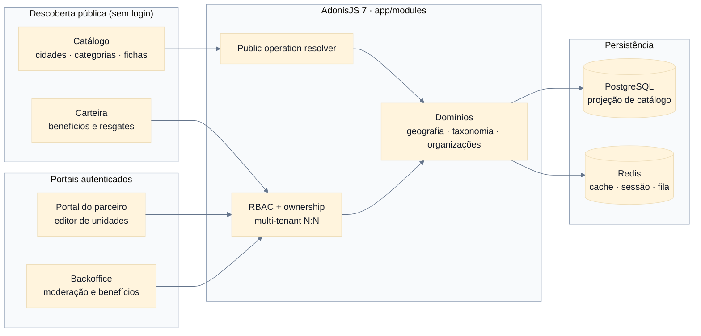
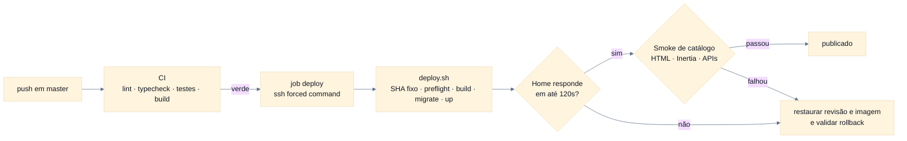

<div align="center">


**Mais perto do que você imagina. Mais interessante do que você esperava.**

<p>
  <a href="https://adonisjs.com/"></a>
  <a href="https://react.dev/"></a>
  <a href="https://www.postgresql.org/"></a>
  <a href="https://redis.io/"></a>
  <a href="https://tailwindcss.com/"></a>
  <a href="#o-que-faz"></a>
  <a href="./LICENSE"></a>
</p>

<p>
  <a href="README.md">Português</a>
  ·
  <a href="README.en.md">English</a>
</p>

---

_"Cidade e categoria são dimensões de descoberta. Tenant é uma operação isolada da plataforma."_

</div>

---

> [!IMPORTANT]
> **Descoberta primeiro, sem exigir cadastro.** O Experimente+ é um guia regional multicidade e
> multicategoria: encontra restaurantes, cafés, cultura, bem-estar e serviços locais com fichas
> revisadas antes da publicação. O catálogo público é resolvido por operação, não por membership —
> ninguém precisa de conta para explorar.

> [!NOTE]
> **Feito para uma região real.** O lançamento inicial é o norte do Paraná, na região de Cornélio
> Procópio, Londrina e municípios próximos. Restaurantes, bares e cafés são o núcleo, mas o produto
> permanece extensível a cinemas, estúdios de tatuagem, lazer, cultura e outros serviços locais.
> Tour Londrina é referência de experiência, não contrato funcional a ser copiado.

---

## Início rápido

```bash
# Dependências
mise use node@24
pnpm install --frozen-lockfile

# Ambiente local
cp .env.example .env
pnpm ace generate:key

# Infraestrutura
docker compose up -d postgres redis mailpit

# Banco e dados de desenvolvimento
pnpm ace migration:run
pnpm ace db:seed

# Servidor Adonis + Inertia com HMR
pnpm dev
```

A aplicação sobe em `http://localhost:3333`. Pré-requisitos: Node.js 24 (conforme `.nvmrc`),
pnpm 11 e Docker Compose.

---

## O que faz

| Camada           | Propósito                                                                    | Onde vive                                |
| :--------------- | :--------------------------------------------------------------------------- | :--------------------------------------- |
| **Geografia**    | Regiões, cidades e catálogo geográfico público.                              | `app/modules/geography/`                 |
| **Taxonomia**    | Categorias hierárquicas com atributos tipados e herança efetiva.             | `app/modules/taxonomy/`                  |
| **Organizações** | Memberships, convites e claims transacionais sobre estabelecimentos.         | `app/modules/organizations/`             |
| **Unidades**     | Identidade estável com conteúdo público revisionado e completude versionada. | `app/modules/establishments/`            |
| **Moderação**    | Submissão, gates de publicação e histórico de revisões.                      | `app/modules/establishments/` · `media/` |
| **Catálogo**     | Descoberta pública por cidade e categoria, servida de uma projeção.          | `app/modules/catalog/`                   |
| **Benefícios**   | Edições, ofertas, acessos e resgates da carteira do consumidor.              | `app/modules/benefits/`                  |
| **Analytics**    | Impressões, cliques de contato e buscas sem resultado, com retenção.         | `app/modules/analytics/`                 |

---

## Arquitetura



O catálogo público resolve a operação pelo hostname ou por `PUBLIC_TENANT_SLUG`, sem exigir
membership. As áreas autenticadas passam por RBAC, permissões contextuais e ownership.

---

## Estrutura

```text
app/modules/<domain>/   domínio completo no backend
app/shared/             infraestrutura transversal
database/               migrations, factories e seeders
inertia/                páginas, layouts, componentes e hooks
resources/              traduções, templates Edge e e-mails
tests/                  testes unitários, funcionais e browser
docs/                   OpenAPI, Redoc e requisições HTTP de exemplo
```

Cada domínio mantém controllers, services, repositories, models, validators e rotas próximos. Os
generators do Adonis criam arquivos no layout padrão; mova o resultado para `app/modules/<domain>/`
e ajuste os aliases para `#modules/*` e `#shared/*`.

---

## Ambiente local

| Serviço      | Endereço                     |
| ------------ | ---------------------------- |
| Aplicação    | `http://localhost:3333`      |
| PostgreSQL   | `localhost:5435`             |
| Redis        | `localhost:6381`             |
| Mailpit SMTP | `localhost:1026`             |
| Mailpit UI   | `http://localhost:8026`      |
| Redoc        | `http://localhost:3333/docs` |

As portas podem ser alteradas no `.env`.

### Provisionamento de homologação

A instalação de homologação usa o comando explícito `homologation:provision`, com três
contas fornecidas por arquivo privado, sem senhas determinísticas ou impressão de
credenciais. Ele cria conteúdo demonstrativo publicado e os três cenários de benefício;
a reexecução preserva contas, moderação e histórico financeiro. Exige
`DEPLOYMENT_ENV=homologation` e `PAYMENT_ENVIRONMENT=test`; qualquer outro ambiente é recusado.

```sh
# Na raiz do artefato compilado (no checkout TypeScript: pnpm ace homologation:provision …)
node ace.js homologation:provision --config=/run/private/provision.json
```

O JSON fica fora do checkout, é um arquivo regular `0600` do usuário que executa o comando e
traz `tenantSlug`, `tenantName` e `accounts.administrator|partner|customer` com `fullName`,
`email` e `password` (20–128 caracteres, com minúscula, maiúscula e dígito; nunca `.local`).
As senhas vêm do cofre e nunca passam por argumentos, histórico do shell ou logs; o comando não
as gera nem imprime e devolve apenas um recibo de IDs. No container, monte o arquivo somente
leitura e execute com `docker compose -f docker-compose.vps.yml run --rm --no-deps --pull never`.

### Contas de desenvolvimento

O seeder cria três contas determinísticas para percorrer o piloto completo:

```text
Admin:    admin@experimente.local
Parceiro: partner@experimente.local
Cliente:  cliente@experimente.local
Senha:    experimente123
```

> [!WARNING]
> O seed continua exclusivo de desenvolvimento, configurável por `DEV_ADMIN_*`, `DEV_PARTNER_*` e `DEV_CUSTOMER_*`.
> Produção de negócio nunca admite este provisionamento de teste. Na homologação, a exceção
> deliberada usa somente `homologation:provision-test-accounts --allow-test-accounts`, com
> senhas fornecidas em arquivo privado e recibo sem credenciais, depois do provisionamento acima.
> O provisionamento nominal mantém a recusa de `.local`; não mudar DEPLOYMENT_ENV para contornar guardas.
> Os dados regionais, estabelecimentos, ofertas e acessos criados pelo seeder são fictícios.

O seed mantém edições gratuitas/cortesias e acrescenta pacote Londrina de 4990 centavos e voucher avulso de 1490 centavos. Capas são ilustrações originais determinísticas de 1200×800, armazenadas no Drive configurado, com checksum/versionamento; não fotos de terceiros. Para exercitar uma compra sem rede, use
`PAYMENT_PROVIDER=fake` no seed, no servidor e nos comandos: crie a compra pelo app ou pela API,
rode `pnpm ace purchases:process` e confirme com `pnpm ace purchases:simulate <id-da-compra>` ou,
na área da equipe, em **Pedidos > Confirmar pagamento simulado** (só administradores, só com o
provedor `fake` fora de produção). Os dois usam o mesmo serviço e a mesma conciliação de um
pagamento real. A reexecução do seed preserva preço, termos e
janelas já vendidos; uma nova campanha exige nova edição, não a edição da vendida.

O seeder é `static environment = ['development']`: com `NODE_ENV=production` ele é ignorado. Além desse filtro Lucid, a execução exige `DEPLOYMENT_ENV=development` antes de acessar o banco, inclusive em chamadas diretas.

---

## Comandos

```bash
pnpm dev                 # servidor e Vite com HMR
pnpm build               # build client, SSR e backend
pnpm lint                # ESLint
pnpm typecheck           # TypeScript backend + frontend
pnpm test:e2e            # Japa: unit, functional e browser
pnpm test:ui             # Vitest
pnpm ace migration:run   # aplica migrations
pnpm ace migration:fresh # recria o schema
pnpm ace db:seed         # dados determinísticos de desenvolvimento
```

> [!NOTE]
> Este projeto roda AdonisJS 7 com TypeScript direto via `@poppinss/ts-exec`. Não existe mais
> `node ace`: use `pnpm ace <comando>`.

---

## Configuração

| Variável                                             | Finalidade                                   |
| ---------------------------------------------------- | -------------------------------------------- |
| `APP_NAME`, `VITE_APP_NAME`, `APP_URL`               | identidade e URLs da aplicação               |
| `APP_LOCALE`                                         | locale padrão (`pt` ou `en`)                 |
| `PUBLIC_TENANT_SLUG`                                 | operação pública quando o host não a resolve |
| `BENEFIT_PRESENTATION_BASE_URL`                      | origem canônica dos links de validação QR    |
| `ACCESS_TOKEN_SECRET`, `REFRESH_TOKEN_SECRET`        | segredos independentes da API                |
| `EMAIL_VERIFICATION_SECRET`, `PASSWORD_RESET_SECRET` | HMAC de links de uso único                   |
| `JWT_ISSUER`, `JWT_AUDIENCE`, `JWT_COOKIE_NAME`      | identidade dos tokens e cookie web           |
| `REGISTRATION_WORKSPACE_MODE`                        | onboarding `none`, `personal` ou `operation` |
| `DEMO_PAGES_ENABLED`                                 | páginas internas de referência visual        |
| `DRIVE_DISK`                                         | `fs`, `s3`, `spaces`, `r2` ou `gcs`          |

Os segredos opcionais usam `APP_KEY` como fallback apenas durante o desenvolvimento. Produção deve
utilizar valores longos, independentes e armazenados fora do repositório.

O ambiente de negócio é `DEPLOYMENT_ENV=development|homologation|production`; ausência
assume production e valor inválido impede inicialização. `NODE_ENV` permanece o modo de runtime:
a VPS usa `NODE_ENV=production` e **`DEPLOYMENT_ENV=homologation`** enquanto for homologação.
Homologação aceita Stripe test, mas exige as proteções de host público. Produção de negócio proíbe
fake e pagamentos test. Configure `DEPLOYMENT_ENV=development` no ambiente local e de testes;
os arquivos de exemplo/teste já o declaram.

`PAYMENT_PROVIDER` aceita `disabled` (padrão), `fake` (recusado em production), `stripe` e
`mercado_pago`, sem fallback entre eles; `PAYMENT_METHODS` declara `pix`, `card` ou ambos. Em
homologação use `PAYMENT_ENVIRONMENT=test` e `STRIPE_ENVIRONMENT=test`, com chave e
`STRIPE_WEBHOOK_SECRET` do mesmo modo, no servidor HTTP e no worker. O acesso nasce apenas da
conciliação autenticada com o PSP, nunca do corpo do webhook. O webhook responde 400 a
assinatura ausente ou inválida, 500 a configuração do servidor inválida, 503 a falha transitória
ao consultar o PSP e 202 ao sinal verificado; não responda 2xx a um evento não verificado para
silenciar reentregas.

### Comandos agendados

O repositório não agenda comandos; cada ambiente instala o próprio agendador (na homologação,
timers do systemd que executam `node ace.js <comando>` no container `app`).

| Comando                  | Frequência      | Para quê                                                       |
| ------------------------ | --------------- | -------------------------------------------------------------- |
| `purchases:process`      | a cada minuto   | concilia notificações do PSP e executa confirmações e estornos |
| `reports:notify-overdue` | de hora em hora | avisa a equipe, uma única vez, de denúncias vencidas           |
| `analytics:prune`        | diário (03:30)  | apaga eventos de analytics com retenção vencida                |

Sem o primeiro, um pagamento ou cancelamento fica pendente para sempre. O aviso de denúncias
exige SMTP configurado, `APP_URL` público e membership da equipe na operação. Os dois primeiros
saem com código 1 quando adiam trabalho; a execução seguinte tenta de novo. Rode cada comando uma
vez à mão antes de agendar e pare os timers durante janelas de manutenção.

A origem incorporada ao QR segue a precedência: `BENEFIT_PRESENTATION_BASE_URL`; depois,
em homologation/production, `APP_URL`; e protocolo/host confiáveis da requisição apenas em
development. Os dois ambientes públicos exigem origem canônica HTTPS, sem credenciais, caminho,
query ou fragmento, desde a inicialização. Cookies são Secure em ambos; debug não expõe detalhes
nesses ambientes. O filtro de runtime do Compose permanece independente dessa política.

> [!IMPORTANT]
> O resolver público lê o **primeiro rótulo do hostname**. Em `experimente-plus.exemplo.com` ele
> procura uma operação de slug `experimente-plus` e ignora `PUBLIC_TENANT_SLUG`. O slug do tenant
> precisa acompanhar o subdomínio em que a operação é servida.

---

## Deploy

A pipeline em [`.github/workflows/ci-cd.yml`](.github/workflows/ci-cd.yml) roda em todo push:
instalação frozen, lint, typecheck, suítes Japa, Vitest e build de produção. Em `master`, um job
`deploy` envia por SSH o mesmo `github.sha` usado no checkout validado e dispara
[`deploy.sh`](deploy.sh) no host.



`deploy.sh` exige um SHA completo, faz fetch desse commit e verifica sua identidade. Pelo _forced
SSH_, aceita o SHA somente quando ele pertence ao histórico da `master` remota obtido no mesmo
fetch. Recusa arquivos não rastreados fora da allowlist operacional, inclusive arquivos ignorados
pelo Git. O preflight rastreado compara o grafo do index com `HEAD` e calcula manualmente os hashes
dos arquivos regulares da working tree com `git hash-object --no-filters`, sem acionar filtros de diff.

O build usa um snapshot verificado extraído desse commit, fora da working tree; assim um arquivo
tardio também não contamina `COPY . .`. Para materializar a release, o script avança somente
o index com `git read-tree` sem `--reset`/`-u` e `HEAD` com `git update-ref` protegido pelo valor
anterior; então copia desse snapshot com `rsync --archive --checksum`. Não executa checkout,
nenhuma forma de `git reset` nem `git clean`.

O script reconstrói a imagem, para o serviço e aplica as migrations uma única vez em um container
one-shot destacado, com nome e labels vinculados à revisão. Espera pelo ID concreto por até 600s e,
em qualquer resultado, remove os containers de migration desse namespace e confirma que nenhum
restou antes de qualquer `compose up`, inclusive no rollback. Só então sobe o servidor HTTP. Depois
espera a home responder por até 120s e executa
[`scripts/smoke_catalog.sh`](scripts/smoke_catalog.sh) sob um limite externo de 45s: home, cidades,
catálogo da cidade em HTML e Inertia, API de establishments e API de filters precisam retornar
`200` com o tipo de conteúdo esperado. Os `curl` de readiness e smoke ignoram configuração local e
proxies. Falhas de materialização, build, migration, subida ou validação acionam um trap que restaura
a última revisão e imagem validadas, sem rebuild, e repete readiness e smoke no rollback, usando o
contrato de smoke armazenado para essa revisão boa. As APIs são verificadas uma vez após readiness
para não esgotar o rate limit anônimo.

Um `flock` no host serializa deploys manuais e da CI até o fim da recuperação. O registro
`last-known-good` guarda revisão, imagem e SHA256 do smoke no diretório Git comum e só avança após
validação; o script de smoke fica preservado por hash nesse diretório. `HEAD` não é usado como
fallback implícito. A primeira execução exige `DEPLOY_INITIAL_GOOD_REVISION` da versão realmente
servida e, se ela não contiver smoke, `DEPLOY_INITIAL_GOOD_SMOKE_REVISION` de um contrato compatível
revisado. `/usr/bin/rsync`,
`/usr/bin/sync` e `/usr/bin/jq` são pré-requisitos: os dois primeiros materializam snapshots e
tornam durável a LKG; o terceiro valida o modelo efetivo do build. O job da CI tem limite de 75
minutos e o passo SSH, 70 minutos, além de keepalive;
operações no host também têm timeout.
O fetch HTTPS roda em um repositório bare isolado, o SHA deve suceder a versão boa, e Compose usa
snapshots imutáveis tanto do código quanto do `.env` durante NEW e rollback.

O smoke usa o `Host` confiável da operação e uma cidade real (`londrina` por padrão). Pode ser
configurado por `CATALOG_SMOKE_BASE_URL`, `CATALOG_SMOKE_HOST` e `CATALOG_SMOKE_CITY_SLUG` no ambiente
do processo de deploy. Ele não segue redirects nem imprime corpos de resposta. Seus testes usam
um servidor HTTP simulado e rodam sem banco com `node --test tests/deploy/*.test.mjs`.

> [!WARNING]
> O rollback é **apenas de código**. Migrations já aplicadas não são revertidas.

[`docker-compose.vps.yml`](docker-compose.vps.yml) descreve o host: apenas o serviço da aplicação,
publicando somente no loopback, atrás de um nginx que termina TLS. PostgreSQL e Redis são
containers compartilhados alcançados por rede Docker externa.

Antes do deploy na VPS, configure `BENEFIT_PRESENTATION_BASE_URL` com uma origem `https://` pública
ou garanta que o fallback `APP_URL` seja uma origem HTTPS válida; caso contrário, o bootstrap de
produção falhará intencionalmente.

A chave usada pela CI carrega um _forced command_ no `authorized_keys`. O entrypoint revisado deve
ser instalado fora da working tree para sobreviver ao rollback. Ele aceita somente
`SSH_ORIGINAL_COMMAND` no formato `deploy <sha completo minúsculo>`, sem avaliar shell. Deploy manual
também exige esse SHA como argumento único. As exclusões de credenciais, `.env.*.local`, logs,
`storage/uploads/**` e `storage/seed-media/**` estão em `.dockerignore`; a allowlist de arquivos
operacionais não rastreados fica em `deploy.sh`.

### Site instalável (PWA)

O site pode ser instalado (Chrome e Edge oferecem "Instalar"; no iPhone, Safari › Compartilhar ›
"Adicionar à Tela de Início"). Manifesto, ícones, capturas e a página offline ficam em `public/`. O
service worker `public/sw.js` é gerado pelo build do Vite a partir de
[`inertia/pwa/service_worker.ts`](inertia/pwa/service_worker.ts) (plugin em `vite.config.ts`), é
ignorado pelo Git e chega à imagem porque `ace build` copia `public/**` para `build/public`.

- **O que fica no aparelho:** só os arquivos de `/assets/` com hash de conteúdo e `/offline.html`
  ([`cache_policy.ts`](inertia/pwa/cache_policy.ts)). Páginas vêm sempre da rede e nunca são
  guardadas; sem rede, a navegação mostra a página offline. Visitas Inertia, `/api`, login,
  carteira, portal, back office e configurações passam direto. Não há push nem sincronização.
- **Cabeçalhos:** `config/static.ts` serve `/sw.js`, `/manifest.webmanifest` e `/offline.html` com
  `Cache-Control: no-cache` e os arquivos com hash com `immutable`. O nginx só repassa; um proxy ou
  CDN à frente precisa preservar esses cabeçalhos e nunca guardar `/sw.js`.
- **Atualização:** cada build muda os bytes de `/sw.js`; o navegador o confere a cada navegação (o
  app instalado, também ao voltar ao primeiro plano, no máximo de hora em hora) e a nova versão
  assume na hora, sem recarregar a página: como as páginas vêm da rede, não há versão antiga presa.
- **Desligar:** `SERVICE_WORKER_ENABLED = false` em [`inertia/pwa/config.ts`](inertia/pwa/config.ts)
  e deploy. O `/sw.js` passa a apagar os próprios caches e se desregistrar, e as páginas também o
  removem; mantenha assim por algumas semanas antes de retirar o arquivo. Numa máquina só: DevTools
  › Application › Service workers › Unregister, ou limpar os dados do site; no iPhone, apagar o
  ícone da Tela de Início ou remover o site em Ajustes › Safari › Avançado › Dados dos Sites.
- Em desenvolvimento o worker não é registrado, e um que tenha ficado de uma execução local de
  produção no mesmo endereço é removido.

---

## Migrations antes da versão 1.0

**Exceção expressa de 08/09/2026:** o dono autorizou consolidar o histórico da homologação para a extensão de voucher avulso. A baseline daquela data reduziu **59 migrations a 51**; os cinco reparos fundidos estão arquivados em `tests/fixtures/legacy_migrations/`, fora do caminho do migrator. Um banco anterior a ela não recebe upgrade: a recriação usa um banco novo e vazio, `migration:run --force` uma única vez no release preparado e `homologation:provision` em seguida, nunca `migration:fresh`, rollback ou seed de desenvolvimento sobre o banco antigo. Voltar atrás exige restaurar código, banco e configuração juntos. A regra geral abaixo continua válida fora desta exceção.

A consolidação na migration `create_*` original só se aplica a migrations que nunca chegaram a
um ambiente persistente. Desde o primeiro deploy em piloto ou produção, o histórico aplicado é
append-only, mesmo antes da versão 1.0. Alterações de tabelas, constraints, índices, funções e
triggers já implantados exigem uma nova migration forward; editar o arquivo aplicado não atualiza
o banco.

No histórico anterior à baseline, o contrato de `benefit_redemptions.receipt_code` era reconciliado pela migration forward
`1788556800100_reconcile_benefit_receipt_codes.ts` (agora em `tests/fixtures/legacy_migrations/`): validava os valores existentes antes de aplicar
`varchar(20) NOT NULL` e o check `^EXP-[0-9A-F]{16}$`. Dados inválidos abortam sem truncamento ou
normalização. Esse reparo isolado dispensava recriação; a nova baseline consolidada exige banco vazio.

Correções forward devem funcionar sobre o schema antigo, sobre uma instalação limpa e sobre
hotfixes operacionais documentados, preservando dados. O reparo de `catalog_establishments.attribute_slugs`
já faz parte da migration que cria a projeção do catálogo; a projeção é reconstruível a partir das
revisões publicadas, que continuam sendo a fonte autoritativa.

O reverse proxy preserva políticas privadas emitidas pela aplicação e evita headers de segurança
duplicados: a configuração versionada em `infra/nginx/` oculta a cópia do upstream e reemite cada
header uma única vez. O instalador `install_experimente_plus_config.sh` roda como root a partir de
uma cópia temporária `root:root 0500`, valida toda a configuração antes do reload e restaura os
arquivos anteriores se algo falhar. Não há `Content-Security-Policy` estática no proxy: uma CSP
útil deve nascer na aplicação, com nonces.

Rollback de código não reverte migrations; cada reparo deve documentar essa compatibilidade.

---

## Manual de uso

O manual para visitantes, consumidores, parceiros e operação fica em `/manual`, com link no
rodapé público e no botão **?** (Ajuda) do cabeçalho do Portal e da Operação.

| Caminho                                           | Conteúdo                                                                 |
| ------------------------------------------------- | ------------------------------------------------------------------------ |
| `inertia/content/manual.ts`                       | Capítulos, seções e blocos (texto com `**negrito**` e `[link](#âncora)`) |
| `inertia/pages/manual/index.tsx`                  | Página, sumário, regras de impressão                                     |
| `inertia/config/help.ts`                          | Componente Inertia → seção do manual ("Ajuda desta página")              |
| `public/manual-media/*.webp`                      | Capturas da demonstração; tamanhos em `inertia/content/manual_media.ts`  |
| `public/manual-media/manual-experimente-plus.pdf` | PDF do manual, gerado a partir da página                                 |

As capturas usam só dados de demonstração, em tema claro, com o elemento de cada passo contornado
em laranja (e numerado quando há mais de um): 1280×800 no computador (recortes no tamanho da área) e
390×844 (2x, reduzidas a 600 px de largura) no celular. As do app (`app-*`) vêm de um Android real,
sem a barra de status e a de navegação do sistema, reduzidas a 540 px. Todas em WebP com qualidade 78
(`vips webpsave captura.png destino.webp --Q 78 --strip`), somando menos de 6 MB. QR de
apresentação, códigos de comprovante, credenciais e e-mails reais ou de contas de teste
(`@experimente.local`) nunca aparecem legíveis; cubra ou borre antes de salvar. Ao trocar uma imagem, atualize o tamanho em `manual_media.ts` e o texto alternativo; os
testes do Vitest conferem arquivos, tamanhos, âncoras, links, a busca e o mapeamento de ajuda de cada
página do Portal e da Operação.

As âncoras `app-*` (`app-instalar` … `app-problemas`) são abertas pelos botões de ajuda do app
(`src/help/manual.ts` no repositório do app): não as renomeie sem atualizar o app.

Para regenerar o PDF depois de mudar o manual, com o servidor rodando:

```bash
pnpm dev                                   # em outro terminal
node scripts/build-manual-pdf.mjs          # usa http://localhost:3333/manual
MANUAL_URL=http://localhost:3360/manual node scripts/build-manual-pdf.mjs  # outra porta
```

O script abre a página em tema claro, carrega todas as imagens, as converte em JPEG para o arquivo
ficar leve (menos de 10 MB) e imprime em A4, um capítulo por página, com marcadores (bookmarks) para
cada capítulo e tarefa. Com o `pdftotext` do poppler instalado (`pacman -S poppler` ou
`apt install poppler-utils`), o sumário e as referências cruzadas ("veja …") ganham o número da
página: o script imprime uma vez, lê as páginas no texto do PDF e imprime de novo. Sem ele, o PDF
sai sem esses números e o script avisa. Faça commit do PDF gerado.

---

## Planejamento de produto

Os documentos de produto, os ADRs, os runbooks e a especificação de design saíram do repositório
em 26/09/2026. Em `docs/` ficam apenas o contrato HTTP (`openapi.yaml`, `redoc.html` e
`api.http`). As regras de domínio que o código precisa respeitar estão resumidas em
[AGENTS.md](AGENTS.md); os textos originais continuam consultáveis no histórico Git, mas não são
mais a fonte vigente.

Nenhuma migration de negócio deve ser criada antes de a decisão correspondente ter o aceite
explícito do dono, com domínio, cenários de teste e impacto no schema definidos.

---

## Licença

MIT. Consulte [LICENSE](LICENSE).
