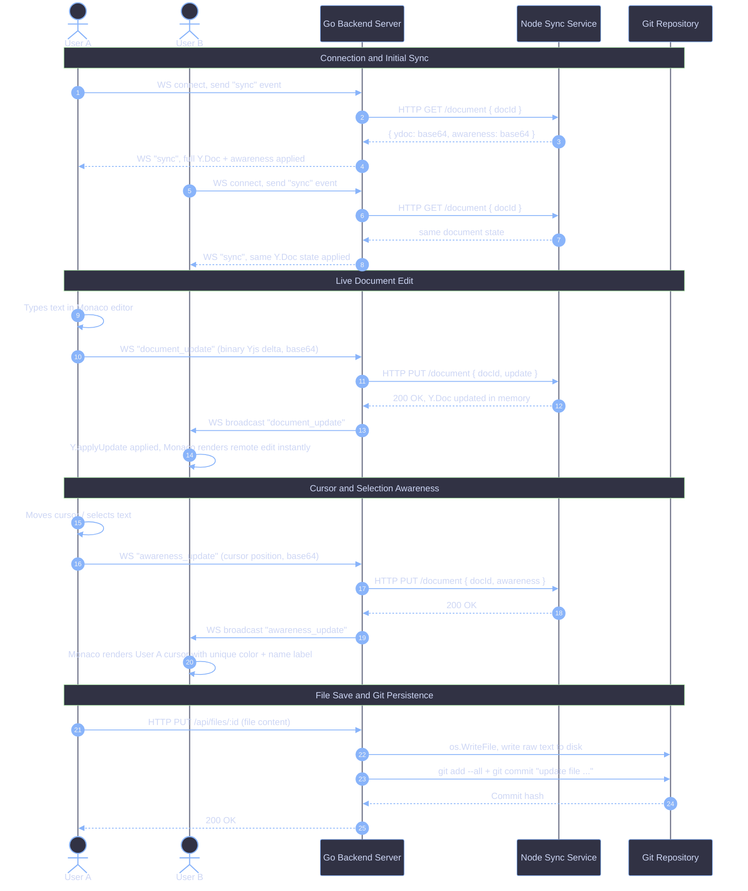
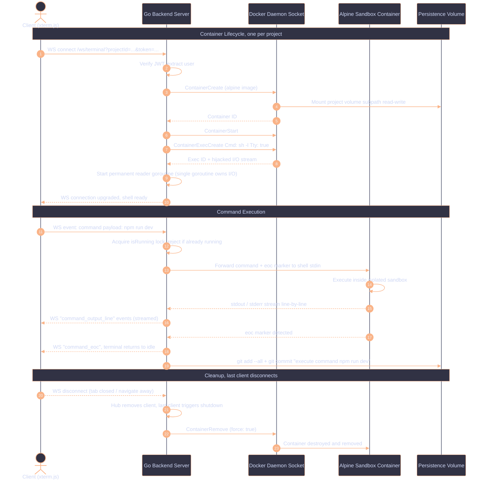

# Collab-IDE

A browser-based collaborative IDE. Multiple users can open the same project, edit the same file simultaneously, and run commands in an isolated terminal, all without installing anything locally.


https://github.com/user-attachments/assets/198e0505-e7cf-41fa-b9ef-d731da498eeb


---

## Architecture

The system has three long-running services and one ephemeral layer:

- **Go API** (`cmd/api`, port 8080): WebSocket hub manager, REST handlers, auth, file I/O, git commits, Docker orchestration.
- **Node Sync Service** (`internal/sync`, port 3000): holds the authoritative in-memory Yjs CRDT state for all open documents. The Go API talks to it over HTTP.
- **PostgreSQL**: stores users, projects, and project metadata.
- **Alpine sandbox containers**: short-lived, one per open project, spawned on-demand by the Go API through the Docker socket.


---

## Collaboration

Editor collaboration uses [Yjs](https://yjs.dev/) CRDTs. The Go API does not hold document state; it proxies updates to and from the Node sync service via HTTP. Awareness (cursor positions, selections, user labels) follows the same path.

When a user saves a file, the Go API writes the plain-text content to disk and creates a git commit in the project repository.



---

## Terminal

Each project gets one Alpine container, spawned when the first user opens the terminal tab and destroyed when the last user disconnects. The Go API owns a single permanent goroutine reading from the Docker PTY stream; all WebSocket clients share that stream.

Commands are synchronised with a marker-based protocol: the API appends `echo <uuid-marker>` after each command, detects the marker in stdout, then emits a `command_eoc` event to the client. Every command execution also creates a git commit.



---

## Sandbox Security Model

Each terminal session runs inside a container created with the following constraints (see [`internal/executor/docker.go`](internal/executor/docker.go)):

| Constraint | Value |
|---|---|
| `ReadonlyRootfs` | `true` |
| `CapDrop` | `ALL` |
| `SecurityOpt` | `no-new-privileges:true` |
| Network access | none |
| Writable paths | `/home/developer/workspace` (project volume subpath, rw), `/tmp` (tmpfs, 64 MiB), and `/root` (tmpfs, 256 MiB) |

The project files live in a named Docker volume (`collab-ide_persistence`). Each project is mounted via Docker's volume subpath feature, so a container can only see its own project directory.

---

## Stack

| Layer | Technology |
|---|---|
| Frontend | React 19, TypeScript, Vite, Monaco Editor, xterm.js, Yjs |
| Backend | Go 1.25, httprouter, gorilla/websocket, Docker SDK |
| Sync service | Node.js, Yjs (y-protocols) |
| Database | PostgreSQL 18 |
| Persistence | Docker named volume, one subpath per project |
| Git | go-git; every file save and terminal command creates a commit |
| Auth | JWT (golang-jwt), bcrypt (golang.org/x/crypto) |

---

## Setup

### Prerequisites

- Docker and Docker Compose
- The Docker socket accessible at `/var/run/docker.sock`
- The Alpine image available locally: `docker pull alpine`

### Run

```sh
cp .env.example .env
# Edit .env. At minimum, set JWT_SECRET to something non-default.

docker compose up --build
```

The frontend dev server is not part of the compose file. Run it separately:

```sh
cd frontend
npm install
npm run dev
```

The frontend runs at `http://localhost:5173` and proxies API calls to `http://localhost:8080`.

### Environment variables

| Variable | Description |
|---|---|
| `POSTGRES_DSN` | Full PostgreSQL connection string |
| `JWT_SECRET` | Secret used to sign and verify JWTs |
| `PERSISTENCE_DIR` | Path inside the API container where project files are stored (mapped to `/data/persistence` by the compose file) |
| `PORT` | API listen port (default: `8080`) |
| `LIMITER_RPS` / `LIMITER_BURST` | Rate limiter settings |

---

## License

[Apache 2.0](LICENSE)
