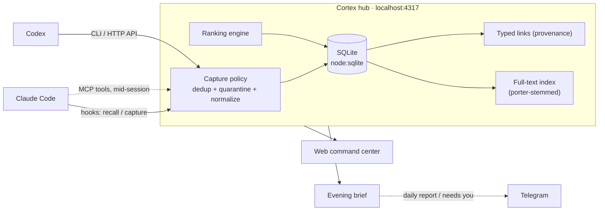
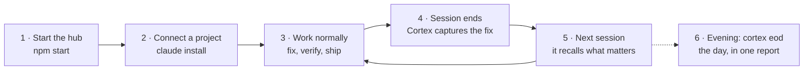

# Cortex

**A local memory and project-ops layer for coding agents.**


Coding agents forget everything the moment a session ends. Cortex gives them a
memory that persists — and gives you one place to see, steer, and audit the work
across every project they touch.

It runs entirely on your machine: one Node process, one SQLite file, no external
services, no data leaving your laptop. It works with **Claude Code** and **Codex**
out of the box.


> Your agent → the Cortex hub on `localhost:4317` → a memory that gets smarter
> every session, a command center, and an evening brief of what actually happened.

**Contents:** [What it does](#what-it-does) · [How it compares](#how-it-compares) ·
[How it works](#how-it-works) ·
[The memory lifecycle](#the-memory-lifecycle) · [Quickstart](#quickstart) ·
[Connect your agent](#connect-your-agent) · [Using the system](#using-the-system) ·
[The dashboard](#the-dashboard) · [Autonomy tiers](#autonomy-tiers) · [CLI reference](#cli-reference) ·
[Deploy](#deploy-with-docker) · [Security](#security-model)

---

## What it does

**🧠 Memory that survives sessions.** As your agent finishes work, Cortex quietly
captures the things worth keeping — a fix and how it was verified, a research
finding, a blocker, a task that changed state. Generic "done!" chatter is thrown
away. What's left is deduplicated, linked to related records with typed
provenance, and ranked so the next session recalls the *relevant* past, not all
of it — packed to fit a token budget you control.

**🎛️ A command center.** A dark web dashboard that puts blocked work, unresolved
questions, and recent activity first. Search across projects with explained
scores, inspect the token pack, browse tasks and the activity log, run a database
audit, and explore an interactive graph of how your records connect.

**🌆 An evening brief.** One command (`cortex eod`) turns the day's raw records
into a report: what got done (with evidence), what needs your eyes, what's queued
for tonight — as text, JSON, or a rendered HTML page, optionally pushed to
Telegram. An optional agent layer rewrites each item into plain English and adds
a short "story of the day"; if that fails for any reason, the deterministic SQL
report stands untouched.

**🩺 A portfolio doctor.** Cortex watches every project the hub knows about and
tells you which are active, stalled, or quietly abandoned — with a per-project
lifecycle you can set (`active`, `waiting`, `maintenance`, `archived`) so the
noise stays down.

**🎚️ Autonomy tiers.** Each project carries a dial — `watch`, `plan`, `assist`,
`auto` — that says how much autonomy an orchestrator may take with it, and a
pin (`CORTEX_NEVER_AUTOPILOT`) that locks protected repos at `watch` forever.
Cortex itself never launches agents; it is the policy and memory surface an
external runner reads.

---

## How it compares

There are several polished commercial memory layers for AI agents. They're good
products — the honest difference is *where your data lives* and *what the tool
is for*:

| | **Cortex** | Mem0 | Zep | Supermemory | Letta |
|---|---|---|---|---|---|
| **Price** | Free, MIT | Free tier, then $19+/mo cloud (OSS core) | Paid cloud (~$125/mo Flex) | Free tier, then $19+/mo cloud (MIT OSS core) | Free tier, then $20+/mo cloud (Apache-2.0 core) |
| **Your data lives** | Your machine, one SQLite file | Their cloud, or self-host (needs vector + graph DB) | Their cloud; DIY via the OSS Graphiti engine + a graph DB | Their cloud, or a self-hosted local binary | Their cloud, or self-hosted server |
| **Needs LLM/embedding calls** | No — deterministic local ranking (embeddings optional, via local Ollama) | Yes (LLM + embeddings) | Yes | Yes (self-host can use Ollama) | Yes (BYOK) |
| **Built for** | Coding agents specifically — hooks into Claude Code / Codex sessions | General AI-app memory | Agent memory / knowledge graph | General memory API + consumer app | Stateful agent framework |
| **Beyond memory** | Tasks, roadmaps, evening brief, portfolio doctor, autonomy policy | — | — | — | Agent runtime |
| **Setup** | `npm install`, `npm start` — no accounts, no other services | SDK + account (or multi-service self-host) | SDK + account | SDK + account (or local binary) | SDK + account (or self-host server) |

*(Competitor details checked August 2026 — pricing and self-host options move
fast; check their sites for current terms.)*

**Pick a paid platform when** you're building a *product* that needs memory for
thousands of end users, managed scaling, and SLAs.

**Pick Cortex when** the memory is for *you and your coding agents*: your
codebase context never leaves your laptop, there's no per-request bill, it works
offline, and you get the project-ops layer (tasks, briefs, autonomy tiers) that
generic memory APIs don't try to be.

---

## How it works

Cortex is a single local process. Your agents talk to it three ways — session
hooks, an MCP server for mid-session calls, and a plain HTTP/CLI interface — and
everything lands in one SQLite database that the dashboard, the evening brief,
and the portfolio doctor all read.



**No external dependencies for storage or search.** The database is Node's
built-in `node:sqlite` (that's why it needs Node ≥ 25) and search is a
deterministic local ranker — no vector database, no embedding API, no keys.
If you *want* a semantic arm in the ranking, set `CORTEX_EMBEDDINGS=1` and
Cortex blends embedding cosine similarity (via a local Ollama model,
`nomic-embed-text` by default) with the keyword score — still fully local.

---

## The memory lifecycle

Every session is a loop: recall relevant context at the start, capture durable
takeaways at the end. The signal survives; the chatter doesn't.

```mermaid
sequenceDiagram
    participant A as Agent
    participant H as Cortex hook
    participant P as Capture policy
    participant DB as SQLite

    rect rgb(30,40,55)
    Note over A,DB: Session start
    A->>H: SessionStart
    H->>DB: recall ranked context (token-budgeted)
    DB-->>A: compact project brief
    end

    Note over A,DB: ...work happens...

    rect rgb(45,35,50)
    Note over A,DB: Session stop
    A->>H: Stop (full transcript)
    H->>P: any durable takeaways?
    P->>P: discard chatter · dedup · normalize
    P->>DB: store fix / research / blocker / task change
    DB->>DB: link to related records + index
    end
```



### What gets captured

| Record type | Example | Kept because |
|---|---|---|
| **Fix** | "Login redirect looped; fixed by clearing stale cookie. Verified: `npm test`." | Durable, verifiable |
| **Research** | "Vendor API rate-limits at 30 req/s; backoff needed." | Reusable finding |
| **Blocker** | "Deploy blocked: missing prod DB migration." | Unblocks future work |
| **Decision** | "Chose SQLite over Postgres — single-user, local-first." | Explains the "why" |
| **Task change** | task moved `ready → blocked → done` | Progress you can query |
| **Lesson** | a pattern promoted after recurring across sessions | Hard-won knowledge |

Generic completion chatter ("Done!", "Let me know if you need anything else") is
discarded before it ever reaches the database.

### How recall ranks results

Search needs no API key. Its deterministic score blends four signals, so a
*verified* older fix can still outrank recent noise:

```text
score  =  lexical relevance          (does the text match?)
        + typed graph proximity       (is it linked to what you're touching?)
        + record quality              (verified > unverified, fix > chatter)
        + recency decay               (newer counts more, but doesn't win alone)
        ─────────────────────────────
        then packed to fit your token budget
```

Two more guards keep the brief honest: an off-topic filter drops records that
name *another* project and never this one, and a `Supersedes: [m:id]` marker in
any new decision cleanly retires the one it reverses instead of letting both
rank forever.

---

## Quickstart

Five minutes, four steps. The only requirement is **Node.js ≥ 25** (Cortex uses
the built-in `node:sqlite` module — no database to install, nothing to compile).

**1. Get the code and install:**

```bash
git clone https://github.com/gsl0001/Cortex.git cortex
cd cortex
npm install
```

**2. Set a write token.** This is just a password you make up — anything long
and random. Cortex refuses to save anything until it exists:

```bash
export CORTEX_TOKEN="$(openssl rand -hex 24)"
```

On Windows: `setx CORTEX_TOKEN "any-long-random-string"`, then open a new
terminal.

**3. Build the dashboard and start the hub:**

```bash
npm run web:build
npm start
```

**4. Open <http://127.0.0.1:4317>** — that's your dashboard. It will be empty;
that's normal. It fills up as your agents work.

The server only listens on your own machine. Nothing is sent anywhere.

Next: [connect your agent](#connect-your-agent) so sessions start feeding it.

---

## Connect your agent

### Claude Code

Install the hooks into any project you want remembered:

```bash
node src/cli.js claude install --project /path/to/your/project
```

From then on, Claude recalls compact project context at the start of a session
and Cortex captures durable takeaways when it stops — automatically.

### Mid-session recall (MCP)

Hooks cover session boundaries. To let an agent search or save memory *during* a
session, start the server (`npm start`) and register the MCP server in the
project's `.mcp.json`:

```json
{
  "mcpServers": {
    "cortex": {
      "command": "node",
      "args": ["/absolute/path/to/cortex/src/mcp.js"],
      "env": {
        "CORTEX_URL": "http://127.0.0.1:4317",
        "CORTEX_TOKEN": "${CORTEX_TOKEN}",
        "CORTEX_AGENT": "claude-code"
      }
    }
  }
}
```

Use the **absolute path** to `src/mcp.js` in your Cortex checkout — your agent
launches this from your project's directory, not Cortex's.

Six tools are exposed: `memory_search`, `memory_get`, `memory_remember`,
`memory_recall_task`, `memory_update_task`, `memory_lesson`. The session brief
cites records by id (`[m:42]`); `memory_get` pulls the full record on demand, so
the brief itself can stay a compact stub index.

Codex uses the same CLI and HTTP API.

---

## Using the system

A typical end-to-end flow, from zero to a self-improving memory:



1. **Start the hub** once — it stays running and serves the dashboard at
   `localhost:4317`.
2. **Connect a project:** `node src/cli.js claude install --project ~/code/myapp`.
   Now every Claude Code session in that repo recalls context on start and
   captures durable takeaways on stop.
3. **Work normally.** Fix a bug and verify it. You don't do anything special —
   Cortex watches the session boundaries.
4. **The session ends** and Cortex stores the fix plus how it was verified,
   throwing away the surrounding chatter.
5. **Next session, it remembers.** Your agent opens with a brief: recent fixes,
   open blockers, and relevant research — ranked and trimmed to a token budget.
6. **Search or track work anytime** — from the dashboard or the CLI:

```bash
# "How did we solve this before?"
node src/cli.js search --project ~/code/myapp --query "auth redirect loop"

# See the current project brief the agent would receive
node src/cli.js brief --project ~/code/myapp

# Capture a task, then let a human or agent pick it up
node src/cli.js task add --project ~/code/myapp --title "Rate-limit the export endpoint" --type chore --priority high
node src/cli.js next-task --project ~/code/myapp --claim --agent claude-code
```

7. **End the day with one report.** `node src/cli.js eod --html reports/eod/today.html --notify`
   builds the evening brief — done work with evidence, a verify queue, what's
   blocked, tonight's open items — and can ping it to Telegram. Schedule it
   (see [`scripts/eod-brief.ps1`](scripts/eod-brief.ps1) for a Windows Task
   Scheduler example) and you get a daily digest for free.

---

## The dashboard

The web command center (dark, keyboard-friendly) is organized around *what needs
attention first*:

| Area | What it shows |
|---|---|
| **Command Center** | Blocked work, unresolved inbox questions, recent activity, and recall-economics cards — is the memory actually earning its tokens? |
| **Control Center** | The per-project autonomy dial (`watch` → `auto`), with pinned repos clearly marked |
| **Search** | Project-scoped search with **explained scores** and the exact token pack an agent would receive |
| **Tasks** | Every task with type, priority, status, and its full history |
| **Goals / Roadmap** | Milestones, weekly plans, and roadmap proposals |
| **Knowledge graph** | An interactive graph of records and their typed links — manual links are saved with full confidence, inferred ones keep their own provenance |
| **Activity log** | A chronological feed of everything captured |
| **Portfolio** | The portfolio doctor: which projects are active, stalled, or abandoned, with lifecycle controls |
| **Health & audit** | A read-only database health check you can run any time |

---

## Autonomy tiers

Cortex does not launch agents. What it holds is the *policy*: a per-project dial
that says how much autonomy an external orchestrator (your own runner, a cron
job, a night-shift script) may take, readable over the same HTTP API as
everything else.

| Tier | Meaning |
|---|---|
| `watch` | Remembered and reported; no agent process is ever launched |
| `plan` | Agents may propose tasks and flag stalls; never execute |
| `assist` | Runs only when a human releases a specific task |
| `auto` | May work the ready queue autonomously; results always park for review |

Every project starts at `watch` — a newly-seen repo is never autonomous by
default. Set a tier from the dashboard's Control Center or
`POST /api/v1/projects/tier`.

**The pin.** Set `CORTEX_NEVER_AUTOPILOT` to a comma-separated list of absolute
paths (production repos, anything that moves money) and those projects are
pinned at `watch` — a floor no setting write can raise. Entries are normalized
like project paths themselves, so a subdirectory or mixed-separator spelling of
a protected repo still collapses onto the pin. See
[SETUP.md](SETUP.md#7-autonomy-tiers) for details.

---

## CLI reference

Run `node src/cli.js` with no arguments for the full, always-current list.

| Group | Commands |
|---|---|
| **Search & recall** | `search`, `brief`, `stats`, `index rebuild` |
| **Tasks** | `task add`, `task claim`, `task block`, `task done`, `next-task` |
| **Capture** | `fix add`, `research add`, `session start`, `session finish` |
| **Inbox** | `inbox add`, `inbox list`, `inbox resolve` |
| **Planning** | `roadmap proposal-add`, `roadmap show`, `goals`, `week show`, `week auto-plan` |
| **Portfolio** | `doctor --portfolio`, `project lifecycle`, `profile upsert` |
| **Reports** | `eod` (evening brief: `--html`, `--notify`, `--digest`) |
| **Agent hooks** | `claude install`, `claude recall`, `claude flush` |
| **Maintenance** | `audit --all [--fix]`, `maintenance sweep`, `maintenance dedupe-decisions` |

```bash
node src/cli.js search --project . --query "close fill" --max-tokens 1500
node src/cli.js task add --project . --title "Fix login redirect" --type bug --priority high
node src/cli.js audit --all --json
```

---

## Deploy with Docker

```bash
docker build -t cortex .
docker run -d \
  -e CORTEX_TOKEN="your-long-random-token" \
  -p 4317:4317 \
  -v cortex-data:/data \
  cortex
```

The image builds the web UI, binds `0.0.0.0` (so port-mapping works), and stores
the database on the `/data` volume. Because it binds beyond loopback, the server
**requires** `CORTEX_TOKEN` and refuses to start without it. Put it behind a
reverse proxy with TLS if you expose it beyond localhost.

---

## Configuration

Only `CORTEX_TOKEN` is required. Everything else has a sensible default — see
[`.env.example`](.env.example) for the common knobs (`CORTEX_DB`, `CORTEX_HOST`,
`CORTEX_PORT`, `CORTEX_NEVER_AUTOPILOT`) and [`SETUP.md`](SETUP.md) for the full
setup, agent adapters, notifications, and the autonomy-tier details.

## Security model

- **Loopback by default.** The server only binds a public interface when you opt
  in (`CORTEX_ALLOW_REMOTE=1`), and even then refuses to start without a token.
- **Writes are default-deny.** Every `POST`/`PATCH`/`DELETE` is rejected until
  `CORTEX_TOKEN` is set — even on localhost.
- **Reads are gated off-loopback.** When bound beyond loopback, read endpoints
  require the token too — not just writes.
- **Captured text is quarantined.** Session captures that look like prompt
  injection ("ignore previous instructions…", and a broad family of phrasings)
  are flagged on the way in, so a poisoned transcript can't smuggle instructions
  into a future session's brief.
- **Autonomy is pinned, not promised.** Repos listed in `CORTEX_NEVER_AUTOPILOT`
  are locked at the `watch` tier — no API write can raise them.
- **Treat `CORTEX_TOKEN` like an SSH key.** The hub schedules local CLI jobs
  (transcript distillation, the evening digest), so treat a leaked token as more
  than read access. Keep the hub on loopback unless you front it with an
  authenticating reverse proxy over TLS.

## Development

```bash
npm test            # backend suite (node:test) — 348 tests
npm run web:test    # web UI tests (vitest) — 51 tests
npm run web:build   # production build
```

## Back up

Stop the server, copy the SQLite file, restart, and rebuild the index:

```bash
cp ~/.cortex/cortex.sqlite ~/.cortex/cortex.backup.sqlite
node src/cli.js index rebuild
```

## License

MIT — see [LICENSE](LICENSE).
