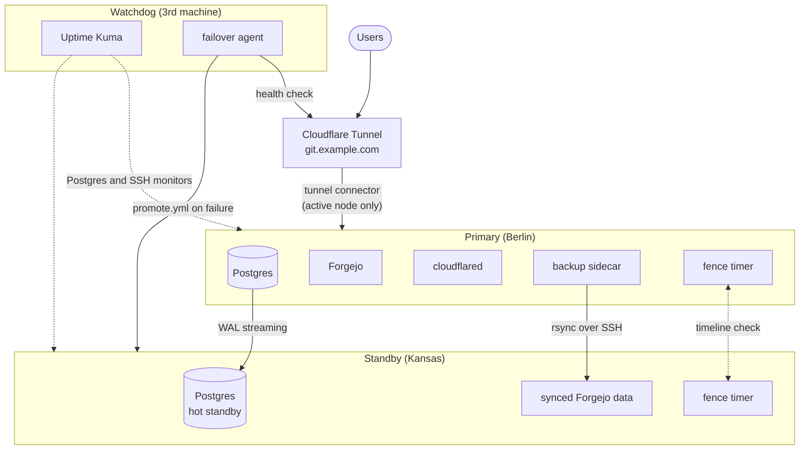
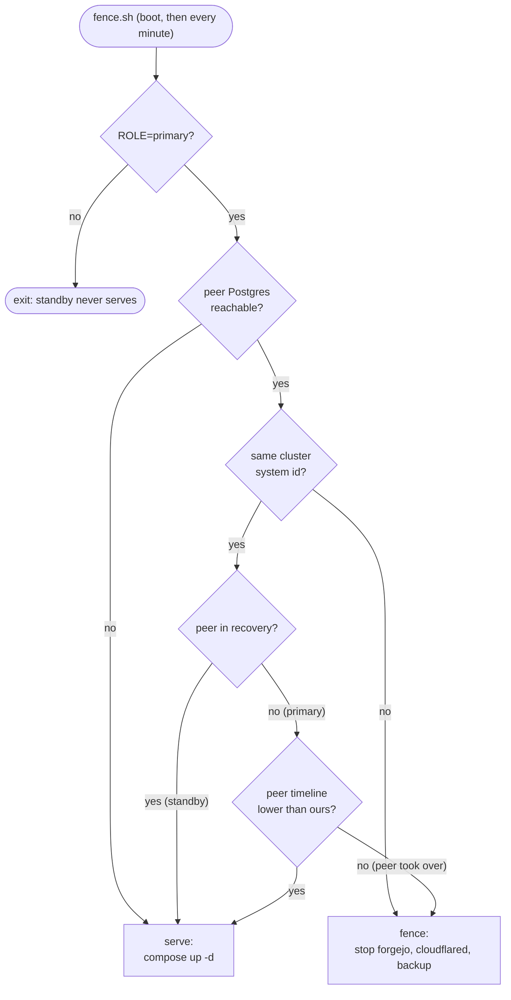
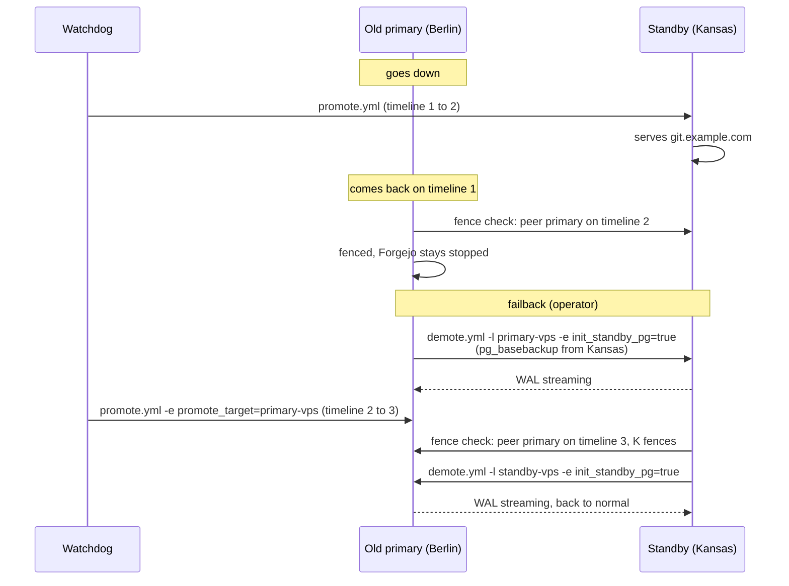
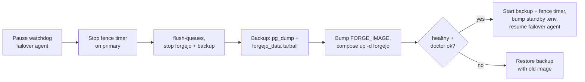
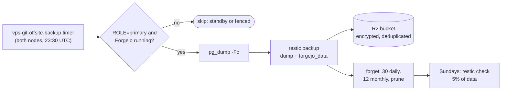
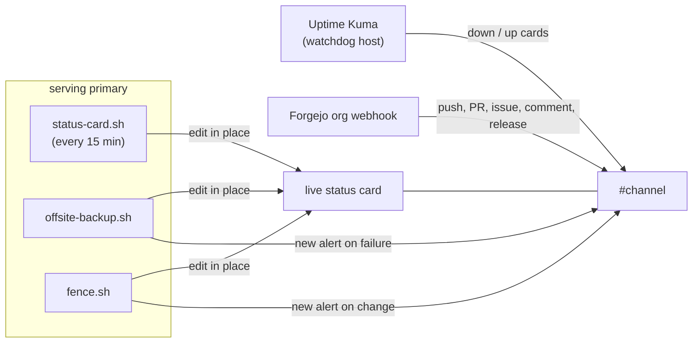

# vps-git

Self-hosted [Forgejo](https://forgejo.org/) instance with high availability, streaming replication, automatic failover, a split-brain fence, encrypted offsite backups and Discord alerts, deployed and managed entirely through Ansible.

> **Where development happens:** the primary copy of this repo lives on the author's own Forgejo instance (running this very stack), and this GitHub repo is a push mirror that updates on every commit. Cloning, stars, issues and pull requests here on GitHub are all fine; accepted changes are applied upstream and mirrored back.


Current release: **v2.0.0**. See [CHANGELOG.md](CHANGELOG.md) for what changed, including breaking changes and migration notes from v1.

## Architecture



**Primary** runs the full stack (Postgres, Forgejo, cloudflared, backup sidecar). **Standby** runs Postgres as a hot standby streaming replica and receives periodic Forgejo data rsyncs. If the primary goes down, the **watchdog** automatically promotes the standby via Ansible, and Cloudflare routes traffic to the new primary within seconds. A fence on each node makes sure only the newest primary ever serves.

## Components

| Directory | Contents |
|---|---|
| `stack/` | Docker Compose stack with profile-based deployment (`primary` / `standby`) |
| `ansible/` | Playbooks: `deploy.yml`, `promote.yml` (failover), `demote.yml` (failback), `watchdog.yml` |
| `watchdog/` | Uptime Kuma monitoring + auto-failover agent + cloudflared tunnel + auto-setup |
| `cloudflared/` | Tunnel configuration templates |

## Prerequisites

- Two VPS nodes (Debian 12 / Ubuntu 24.04) with Docker installed
- Private network connectivity between nodes ([Tailscale](https://tailscale.com/) recommended; WireGuard or similar also works)
- Cloudflare account with a domain
- Ansible on your control machine (`pip install ansible` or `brew install ansible`)
- A machine to run the watchdog (your laptop, a 3rd VPS, etc.)

## Setup

### 1. Clone and configure

```sh
git clone https://github.com/youruser/vps-git.git
cd vps-git
cp ansible/inventory.example.yml ansible/inventory.yml
```

Edit `ansible/inventory.yml` with your:
- VPS IPs and SSH key paths
- Postgres and replication passwords (generate strong random ones)
- Forgejo admin credentials (`forgejo_admin_user`, `forgejo_admin_password`, `forgejo_admin_email`)
- Tailscale peer IPs
- Cloudflare tunnel credentials path

### 2. Create a Cloudflare Tunnel

```sh
cloudflared tunnel create vps-git
cloudflared tunnel route dns vps-git git.yourdomain.com
```

Copy the tunnel credentials JSON to `ansible/inventory.yml` under `tunnel_credentials_file`.

### 3. Deploy

```sh
cd ansible

# Deploy primary (creates admin user automatically on first run)
ansible-playbook deploy.yml -l primary

# Deploy standby (initializes Postgres streaming replica)
ansible-playbook deploy.yml -l standby -e init_standby_pg=true
```

Forgejo will be live at your configured URL with the admin user pre-created. No manual web setup required. The role also installs `vps-git-fence.timer` on both nodes: from then on the fence, not Docker, starts Forgejo, cloudflared and the backup sidecar (see [Split-brain fence](#split-brain-fence)). Set `offsite_backup_enabled` and `status_card_enabled` to also install the backup and status card timers.

### 4. Deploy the watchdog

The watchdog runs on your local machine or a 3rd VPS. It monitors the primary and auto-promotes the standby on sustained failure.

**Option A: Via Ansible (recommended)**

Add the `watchdog` group to your `ansible/inventory.yml` (see the example inventory for all variables), then:

```sh
cd ansible
ansible-playbook watchdog.yml
```

This deploys the full watchdog stack, creates an Uptime Kuma admin account, and auto-configures all monitors (Forgejo health, web, Postgres and SSH on both nodes). The dashboard is login-protected to avoid leaking infrastructure details.

**Option B: Manual**

```sh
cd watchdog
cp env.example .env
# Edit .env with your health URL, SSH keys, Kuma credentials, Tailscale IPs
docker compose --env-file .env up -d

# First time only: create Kuma admin + monitors
docker compose --env-file .env run --rm setup-kuma \
  --url http://localhost:3001 \
  --username admin \
  --password 'YourPassword' \
  --health-url https://git.yourdomain.com/api/healthz \
  --primary-host 100.x.x.x \
  --standby-host 100.y.y.y
  # optional: --discord-webhook 'https://discord.com/api/webhooks/...' (see Notifications)
```

The stack includes:
- **Uptime Kuma:** monitoring dashboard (login-protected, no public status page)
- **Failover agent:** health-checks the primary, auto-runs `promote.yml` after consecutive failures
- **cloudflared:** tunnels the dashboard to your status domain
- **setup-kuma:** one-shot container that creates the admin account and all monitors, and (with `--discord-webhook`) the Discord alert notification

### 5. Verify

```sh
# Health check
curl https://git.yourdomain.com/api/healthz

# API
curl -u admin:password https://git.yourdomain.com/api/v1/user

# Replication status (from primary)
ssh root@primary "docker exec vps-git-postgres psql -U forgejo -d forgejo \
  -c 'SELECT client_addr, state FROM pg_stat_replication;'"
```

## Failover

### Automatic

The watchdog checks the primary's health endpoint every 30 seconds. After 3 consecutive failures (configurable), it runs `promote.yml` which:

1. Stops Forgejo, cloudflared and the backup sidecar on the old primary, if it can still reach it
2. Stops standby containers
3. Promotes Postgres out of recovery (removes `standby.signal`), which starts a new timeline
4. Restores latest Forgejo data from backup sync
5. Starts the full primary stack (Postgres, Forgejo, cloudflared, backup)
6. Cloudflare tunnel routes traffic to the new primary automatically

If the old primary comes back later, its fence sees a primary on a newer timeline and keeps Forgejo stopped. See [Failback](#failback) to make it the primary again.

Two guards keep the agent from making things worse:

- **It only counts a failure when it is online itself.** Before counting a failed health check it tries two outside endpoints (`INTERNET_CHECK_URLS`, default Cloudflare and Google); if neither answers, the watchdog's own link is down and the round is skipped. A watchdog that loses its uplink never fails over a healthy primary.
- **A 1-hour cooldown (`COOLDOWN_SEC`) starts with every promote attempt**, successful or not. A failed `promote.yml` is not retried in a loop (each run fences the primary again); it raises an alert instead.

Set `DISCORD_WEBHOOK_URL` in the watchdog's `.env` to get an alert when a promote starts, fails or completes.

### Manual

```sh
cd ansible
ansible-playbook promote.yml
```

### Split-brain fence

Both nodes hold credentials for the same tunnel, so if both ran Forgejo, Cloudflare would send writes to either one. Each node runs `stack/fence.sh` from `vps-git-fence.timer` at boot and every minute. Forgejo, cloudflared and the backup sidecar are `restart: "no"`, so nothing serves until the fence has decided (the timer also restarts them if they crash). Every promotion moves Postgres to a new timeline, so the node that took over last always has the higher timeline:



`promote.yml` also stops the serving containers on the other node first when it can reach it, and `deploy.yml` refuses to start a primary while the standby runs Forgejo, or to re-initialise a standby that is serving as primary. Check a node's decision without acting: `DRY_RUN=1 /opt/vps-git/stack/fence.sh`.

### Failback

After a failover the promoted standby is the only up-to-date copy. When the old primary comes back it fences itself (its timeline is lower), so nothing is served twice, but its database is stale. **Do not re-initialise the promoted node from it.**



```sh
cd ansible
# pause the watchdog's failover agent first so it doesn't react mid-failback
ansible-playbook demote.yml -l primary-vps -e init_standby_pg=true   # old primary becomes a replica of the promoted node
# wait until it streams and has caught up (pg_stat_wal_receiver on primary-vps)
ansible-playbook promote.yml -e promote_target=primary-vps           # stops the other node's services, promotes primary-vps
ansible-playbook demote.yml -l standby-vps -e init_standby_pg=true   # the former promoted node becomes the standby again
```

Or skip the failback and keep the promoted node as primary: swap the `primary` and `standby` groups in your inventory, then run the first `demote.yml` line against the old primary.

### Upgrading Forgejo

Forgejo migrations are one-way, so the only rollback is restoring a backup taken with Forgejo stopped. Tested going straight from 11.0 to 16.0 (supported per the [upgrade guide](https://forgejo.org/docs/latest/admin/upgrade/)); read the release notes for breaking changes first.



```sh
# watchdog host
docker stop vps-git-failover
# primary
cd /opt/vps-git/stack && . ./.env
systemctl stop vps-git-fence.timer
docker exec -u git vps-git-forgejo forgejo manager flush-queues
docker stop vps-git-forgejo vps-git-backup
docker exec vps-git-postgres pg_dump -U "$POSTGRES_USER" -d "$POSTGRES_DB" -Fc > /opt/vps-git/pre-upgrade.dump
tar -C /var/lib/docker/volumes/stack_forgejo_data/_data -czf /opt/vps-git/pre-upgrade-data.tgz .
sed -i 's|^FORGE_IMAGE=.*|FORGE_IMAGE=codeberg.org/forgejo/forgejo:16|' .env
docker compose --env-file .env up -d forgejo      # migrations run on first start
docker exec -u git vps-git-forgejo forgejo doctor check --all
docker compose --env-file .env up -d backup && systemctl start vps-git-fence.timer
# standby: set the same FORGE_IMAGE in its .env (and forge_image in the inventory) so a promotion runs the new version
# watchdog host
docker start vps-git-failover
```

The standby's Postgres is a physical replica, so it follows the schema migrations on its own.

### Pinned versions

| Component | Version | Notes |
|---|---|---|
| Forgejo | `codeberg.org/forgejo/forgejo:16` | Set with `forge_image` / `FORGE_IMAGE`. See [Upgrading Forgejo](#upgrading-forgejo). |
| Postgres | `postgres:16-alpine` | Supported upstream until November 2028. A major upgrade (17 or 18) needs a new cluster: dump and restore on the primary during a maintenance window, then re-initialise the standby with `demote.yml -e init_standby_pg=true`. Never mix majors between primary and standby. |
| cloudflared | `cloudflare/cloudflared:2026.9.3` | Pinned instead of `latest` so a restart never pulls an unreviewed version. |
| Uptime Kuma | `louislam/uptime-kuma:2` | Kuma 1 is superseded. An existing Kuma 1 data directory is migrated automatically on first start of Kuma 2; back up `kuma-data/` first. `setup-kuma` targets Kuma 2 (monitors need its `conditions` field). |
| Base images | `python:3.14-alpine`, `alpine:3.24` | Failover agent, setup-kuma and the backup sidecar. |
| restic | 0.19.1 | Installed on the hosts from the official release, see [Offsite backups](#offsite-backups). |

### Offsite backups

Replication and the backup sidecar protect against losing a node, not against mistakes: a deleted repo or a bad migration reaches the standby within seconds. `stack/offsite-backup.sh` adds encrypted, versioned backups to an S3-compatible bucket with [restic](https://restic.net/). Cloudflare R2 is what this is tested with (free egress, and a few hundred MB fits the free tier).

- Runs nightly from `vps-git-offsite-backup.timer` (23:30 UTC) on both nodes, but only the **serving primary** backs up: `ROLE=primary` and Forgejo running. A standby or a fenced node logs "not serving, skipping".
- Each run: `pg_dump -Fc` plus the `forgejo_data` volume, then `restic forget --keep-daily 30 --keep-monthly 12 --prune`, and on Sundays `restic check --read-data-subset 5%`.
- Snapshots use a fixed `--host bts-forgejo`, so after a failover the promoted node continues the same history.
- Exits non-zero on failure, so the unit shows as failed (`systemctl status vps-git-offsite-backup`).



**Setup** (once):

1. Create a bucket and an API token scoped to it (R2: Object Read & Write on that bucket only).
2. Install restic on both nodes (the official release binary; distro packages are often old).
3. On both nodes, as root: `/etc/vps-git-backup/r2.env` from [`stack/r2.env.example`](stack/r2.env.example), and `/etc/vps-git-backup/restic-password` with one random password (the same on both nodes). Both mode 600. **Keep an offline copy of the password**: without it the backups cannot be read.
4. `set -a; . /etc/vps-git-backup/r2.env; set +a; RESTIC_PASSWORD_FILE=/etc/vps-git-backup/restic-password restic init`
5. Set `offsite_backup_enabled: true` in the inventory and run `deploy.yml`, or install the two units from `ansible/roles/vps-git/templates/` by hand.
6. Check a node's decision without backing up: `DRY_RUN=1 /opt/vps-git/stack/offsite-backup.sh`.

**Restore:**

```sh
set -a; . /etc/vps-git-backup/r2.env; set +a
export RESTIC_PASSWORD_FILE=/etc/vps-git-backup/restic-password
restic snapshots --host bts-forgejo
restic restore latest --host bts-forgejo --target /var/tmp/restore
# database: into a stopped or fresh stack
docker exec -i vps-git-postgres pg_restore -U forgejo -d forgejo --clean --if-exists < /var/tmp/restore/var/tmp/vps-git-backup/forgejo-pg.dump
# Forgejo data: rsync the restored volume path back into stack_forgejo_data with Forgejo stopped
```

### Notifications

Everything posts to one Discord channel through a single channel webhook, as [Components V2](https://discord.com/developers/docs/components/reference) cards (accent colour by status, link buttons, no pings):



- **Live status card:** one message that the serving primary edits in place, showing the serving node, Forgejo version and health, replication state and lag, fence decision, last and next backup, and disk use. Optional lines: **Watchdog** (set `watchdog_url` to the watchdog's status page) and **Runners** (put a `read:admin` Forgejo token in `notify.env` as `FORGEJO_STATUS_TOKEN`). The accent turns amber or red when something is off. Edits don't notify anyone, so failures also post a separate alert.
- **Watching the watchdog:** Uptime Kuma can't report its own outage, so the status card job on the serving primary checks `watchdog_url` and posts one alert card when it becomes unreachable (Kuma alerts are silent) and one when it recovers.
  - **Create it once:** `stack/status-card.sh --create` prints the message id. Put it in `/etc/vps-git-backup/notify.env` as `STATUS_MESSAGE_ID` on both nodes, and pin the message.
  - **Refresh:** `vps-git-status.timer` (every 15 min, enabled with `status_card_enabled`), plus every backup run and fence change.
- **Alerts** (new messages, so they notify): a backup failure (step, exit code, last error), a fence decision change (for example a node fencing itself after a failover), and the watchdog becoming unreachable or recovering.
- **Uptime Kuma:** set `watchdog_discord_webhook` and `watchdog.yml` configures a default Webhook notification with a card template (`watchdog/setup-kuma/discord-card.liquid`), attached to every monitor: red when down, green when up, with the target, error or response time, and a status page button.
- **Forgejo events:** add an org (or repo) webhook of type Discord. In Forgejo 16, a Discord hook created through the API can come up with empty Discord settings and fail with "cannot create http request"; create it in the web UI, or re-save it there.
- **Secrets:** `stack/notify.sh` reads `DISCORD_WEBHOOK_URL`, `STATUS_MESSAGE_ID` and the optional `FORGEJO_STATUS_TOKEN` from `/etc/vps-git-backup/notify.env` (see `stack/notify.env.example`). Never commit the real URL. Without the file, nothing is posted.

## Replication

| Layer | Method | RPO |
|---|---|---|
| Database | Postgres streaming replication (async) | Near-zero (WAL stream) |
| Forgejo data | rsync via backup sidecar | Up to `backup_interval` (configurable, default 60s) |
| Postgres dumps | `pg_dump` via backup sidecar | Up to `backup_interval` |

The backup sidecar runs on the primary and transfers data to the standby over the private network (Tailscale) via SSH.

## Networking

The nodes talk to each other only over a private network. [Tailscale](https://tailscale.com/) is what this stack is tested with.

- **Bind Postgres to each node's own Tailscale IP** (`pg_bind`), not `0.0.0.0`. Docker port publishing bypasses host firewalls like ufw, so a `0.0.0.0` bind is reachable from anywhere your provider firewall allows. The `common` role sets `net.ipv4.ip_nonlocal_bind=1`, so the bind still works when Docker starts before `tailscaled` has its address.
- **Don't rely on `pg_hba` source addresses.** Connections arrive through Docker's port proxy, so Postgres sees the Docker bridge address rather than the peer's Tailscale IP. The bind plus your tailnet policy are the access controls.
- **Restrict the tailnet.** Tag the nodes and only allow what the stack needs:

```jsonc
"tagOwners": {"tag:server": ["autogroup:admin"], "tag:watchdog": ["autogroup:admin"]},
"grants": [
  // Replication (5432) and backup rsync (22) between the two nodes.
  {"src": ["tag:server"],   "dst": ["tag:server"], "ip": ["tcp:22", "tcp:5432", "icmp:*"]},
  // Watchdog: Postgres/SSH monitors and Ansible promote/demote.
  {"src": ["tag:watchdog"], "dst": ["tag:server"], "ip": ["tcp:22", "tcp:5432", "icmp:*"]},
],
```

- **Open UDP 41641 inbound** in your provider firewall so the nodes connect directly instead of through Tailscale's relays. Nothing else needs to be public: Forgejo and the status page are served through Cloudflare Tunnel.

### Avoiding split brain

See [Split-brain fence](#split-brain-fence). The fence needs the nodes to reach each other's Postgres over the tailnet (`tag:server` to `tag:server` on 5432 in the policy above).

## For developers: migrating from GitHub

If you have an existing clone of a repo that's been mirrored to this Forgejo instance:

```sh
# Add Forgejo as a new remote
git remote add forgejo https://git.example.com/youruser/REPO_NAME.git

# Or replace origin entirely
git remote set-url origin https://git.example.com/youruser/REPO_NAME.git

# Push/pull as usual
git push origin main
git pull origin main
```

To clone fresh:

```sh
git clone https://git.example.com/youruser/REPO_NAME.git
```

HTTPS authentication uses your Forgejo username and password (or a personal access token created at `https://git.example.com/user/settings/applications`).

## Configuration reference

All configuration lives in `ansible/inventory.yml` (gitignored). Key variables:

| Variable | Description |
|---|---|
| `postgres_password` | Postgres password for the Forgejo database |
| `repl_password` | Postgres streaming replication password |
| `forgejo_admin_user` | Admin username (created on first deploy) |
| `forgejo_admin_password` | Admin password |
| `forgejo_admin_email` | Admin email |
| `app_url` | Public URL (e.g. `https://git.yourdomain.com`) |
| `tunnel_credentials_file` | Path to Cloudflare tunnel credentials JSON |
| `peer_host` | Private network IP of the peer node |
| `pg_bind` | Postgres bind address: the node's own Tailscale IP (see [Networking](#networking)) |
| `backup_interval` | Seconds between backup/sync runs (default: 60) |
| `backup_ssh_key` | SSH private key for rsync between nodes |
| `watchdog_tunnel_uuid` | Cloudflare tunnel UUID for status page |
| `watchdog_status_hostname` | Hostname for Uptime Kuma (e.g. `status-git.yourdomain.com`) |
| `kuma_username` / `kuma_password` | Uptime Kuma admin credentials |
| `primary_tailnet_ip` / `standby_tailnet_ip` | Private network IPs for port monitors |
| `watchdog_check_interval` | Seconds between health checks (default: 30) |
| `watchdog_fail_threshold` | Consecutive failures before failover (default: 3) |
| `watchdog_discord_webhook` | Discord webhook for Uptime Kuma alert cards (empty: skip) |
| `watchdog_extra_hosts` | Extra machines for Kuma to watch, each `{name, host}`: adds a ping and an SSH monitor (`setup-kuma --extra-host`) |
| `forge_image` | Forgejo image (default `codeberg.org/forgejo/forgejo:16`); see [Upgrading Forgejo](#upgrading-forgejo) |
| `mail_from` / `cf_api_token` | Sender address and Cloudflare Email Sending token for Forgejo mail (SMTP) |
| `github_oauth_client_id` / `github_oauth_client_secret` | GitHub OAuth app for "Sign in with GitHub" |
| `offsite_backup_enabled` | Install the nightly restic backup timer (default: false); see [Offsite backups](#offsite-backups) |
| `status_card_enabled` | Install the 15-minute live status card timer (default: false); see [Notifications](#notifications) |
| `watchdog_url` | Watchdog status page the status card checks; one alert when unreachable, one on recovery (empty: skip) |

Run-time options: `-e init_standby_pg=true` (deploy or demote: rebuild the replica from the peer), `-e promote_target=<host>` (promote a node other than the `standby` group, for failback), and `-e allow_dual_primary=true` (override the deploy guard; don't).

## Repository layout

```
vps-git/
  CHANGELOG.md                Release notes
  stack/
    compose.yml               Docker Compose (profiles: primary, standby)
    fence.sh                  Split-brain fence, run by vps-git-fence.timer
    notify.sh                 Discord cards: alerts and the live status card
    status-card.sh            Refresh (or --create) the live status card
    offsite-backup.sh         Nightly restic backup to R2, run by vps-git-offsite-backup.timer
    r2.env.example            Offsite backup target and credentials template
    notify.env.example        Discord webhook and status card message id template
    env.example                Environment variable template
    postgres/
      init-replication.sh      Creates replication user on Postgres init
    backup/
      Dockerfile               Backup sidecar (pg_dump + rsync)
      entrypoint.sh
  ansible/
    ansible.cfg
    inventory.example.yml      Inventory template
    deploy.yml                 Deploy stack to nodes
    promote.yml                Failover: promote standby
    demote.yml                 Failback: demote to standby
    watchdog.yml               Deploy watchdog stack
    roles/
      common/                  Base packages + Docker
      vps-git/                 Stack deployment, config templating, fence/backup/status timers
      watchdog/                Watchdog deployment + Kuma auto-setup
  watchdog/
    compose.yml                Uptime Kuma + failover + cloudflared + setup-kuma
    env.example
    failover/
      Dockerfile
      failover.py              Health check loop + Ansible trigger
      entrypoint.sh            SSH config setup
    setup-kuma/
      Dockerfile
      setup-kuma.py            Socket.IO script: creates admin, monitors, Discord notification
      discord-card.liquid      Uptime Kuma alert card template (Components V2)
  cloudflared/
    config.yml.example         Tunnel ingress template
```

## License

[MIT](LICENSE)
