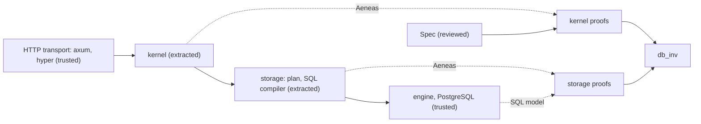

# i5h

`i5h` (*icefish*) is a Rust web framework that lets developers prove properties of their application logic in Lean 4.

[](https://crates.io/crates/i5h)

## High level features

- Write the logic as pure Rust functions and prove it in Lean 4 via [Aeneas](https://github.com/AeneasVerif/aeneas).
- Serve it with [axum](https://github.com/tokio-rs/axum); handlers never touch the database.
- Run each request in a SERIALIZABLE PostgreSQL transaction, with retries and idempotency keys.
- Declare tables once with `schema!` and get Rust mappings and Lean proofs.
- Prove that invariants hold for the rows loaded back from the database.



## Usage example

The kernel is one function that decides what a command does. This one, from
the calculator tutorial, keeps one number per user:

```rust
pub fn transition(actor: &Principal, snap: &Snapshot, cmd: &Command) -> Result<(Option<Memory>, Reply), Error> {
    match cmd {
        Command::Set { value } => Ok((Some(Memory { user: actor.user, value: *value }), Reply::Value(*value))),
        Command::Apply { op, arg } => {
            let m = memory_of(&snap.memories, actor.user);
            match compute(*op, m, *arg) {
                Ok(v) => Ok((Some(Memory { user: actor.user, value: v }), Reply::Value(v))),
                Err(e) => Err(e),
            }
        }
        Command::Get => Ok((None, Reply::Value(memory_of(&snap.memories, actor.user)))),
    }
}
```

The server around it is an ordinary axum application:

```rust
let engine = Arc::new(Engine::<Calc, CalcStore>::new(pool(&url, 8)?, EngineConfig::default()));
engine.install_schema().await?;
let app = I5h::new(engine, HmacAuth::<Calc>::new(secret, principal));
let router = Router::new().route("/healthz", get(|| async { "ok" })).merge(rpc_router(app));
axum::serve(TcpListener::bind("127.0.0.1:8080").await?, router).await?;
```

After the kernel is translated to Lean, you can prove properties of it, for
example that after any successful command a `get` by the same user returns its
result:

```lean
theorem get_after (a : Principal) (s s' : Snapshot) (c : Command) (w : Option Memory) (v : U64)
    (hroom : s.memories.length < Usize.max)
    (ht : transition a s c = ok (.Ok (w, .Value v))) (hs : apply s w = ok s') :
    transition a s' .Get = ok (.Ok (none, .Value v))
```

## License

This project is licensed under the [Apache-2.0 license](LICENSE).
