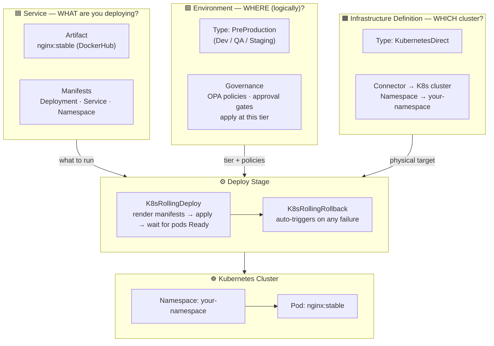

# CD Tidbit — Basic Deployment (Rolling to Dev)

Deploy a public nginx container to a Kubernetes Dev environment using Harness CD with the **Rolling** strategy. This is the starting point for Harness CD: wire up a service, an environment, and an infrastructure definition, then run a Deploy stage that rolls out pods with zero downtime and rolls back automatically on failure.

---

## Why these building blocks exist

Before wiring anything up, it helps to understand *why* Harness requires a Service, an Environment, and an Infrastructure Definition instead of letting you point a pipeline directly at a cluster.



### Why do you need a Service?

A **Service** is Harness's answer to the question *"what are you deploying?"* It bundles two things that always travel together — the **artifact** (the Docker image to pull) and the **manifests** (the Kubernetes YAML that describes how to run it). Keeping them together as a named, versioned entity means:

- The same service can be deployed to multiple environments (Dev → QA → Prod) without redefining the artifact or manifests each time.
- Every pipeline run records *which version of the service* was deployed, giving you a clean audit trail.
- Service variables and config files can be defined once and overridden per environment, rather than duplicated across pipelines.

> From the Harness docs: *"A Service represents your microservices and other workloads… each can be deployed, monitored, or changed independently."* Best practice is one Harness Service per microservice.

In this tidbit the service packages `library/nginx:stable` (DockerHub artifact) together with the K8s `Deployment`, `Service`, and `Namespace` manifests — everything Harness needs to know about *what* to put on the cluster.

---

### Why do you need an Environment **and** an Infrastructure Definition?

Harness intentionally splits the *where* into two layers:

| Layer | Question it answers | This example |
|---|---|---|
| **Environment** | *Which logical tier?* (Dev / QA / Prod) | `PreProduction` — signals governance rules, approval gates, and policies that apply at this tier |
| **Infrastructure Definition** | *Which physical cluster and namespace?* | `KubernetesDirect` → your cluster connector + `<YOUR_NAMESPACE>` |

**Why keep them separate?**

1. **One environment, many targets.** A single "Dev" environment can have multiple Infrastructure Definitions — one per cluster region, one per team namespace — so you can route the same service to different physical destinations without duplicating the environment-level config or overrides.
2. **Governance lives at the environment level.** Access controls, approval gates, and OPA policies attach to the environment type (`PreProduction` vs `Production`). Harness enforces these rules regardless of which infrastructure inside that environment you deploy to.
3. **Reuse without coupling.** Infrastructure Definitions reference a connector (your delegate-backed K8s credential) but know nothing about the artifact or manifests. You can swap out the infra (point at a different cluster) without touching the service, and vice versa.

> From the Harness docs: *"While Environments are logical, Infrastructure Definitions represent an Environment's infrastructure physically — the actual clusters, hosts, and namespaces."*

In this tidbit the environment is typed `PreProduction` (so Production-only policies won't block it) and the infrastructure definition points at your delegate-backed `KubernetesDirect` connector with a specific target namespace — the two pieces of information Harness needs to issue `kubectl apply` against the right place.

---

## How it works

Harness CD has three building blocks before you can deploy anything:

| Building block | What it answers | This example |
|---|---|---|
| **Service** | *What* are you deploying? | nginx image + K8s manifests |
| **Environment** | *Where* are you deploying? | Dev (PreProduction) |
| **Infrastructure** | *Which cluster/namespace?* | KubernetesDirect → `<YOUR_NAMESPACE>` |

The pipeline wires these together in a single **Deploy** stage:

```
Pipeline: tidbit_cd_basic_deployment
└── Stage: Deploy to Dev
    ├── Service:        <YOUR_SERVICE_IDENTIFIER>  → nginx:stable + k8s manifests
    ├── Environment:    <YOUR_ENV_IDENTIFIER>       → PreProduction (Dev)
    ├── Infrastructure: <YOUR_INFRA_IDENTIFIER>     → namespace <YOUR_NAMESPACE>
    └── Execution:
        ├── K8sRollingDeploy    ← applies manifests, waits for pods Ready
        └── K8sRollingRollback  ← runs automatically on any failure
```

**Rolling strategy** means Harness replaces pods incrementally — old pods stay up until new ones are healthy, so there's no downtime. If anything goes wrong, the failure strategy triggers `K8sRollingRollback` (`kubectl rollout undo`) automatically.

---

## Repo layout

```
.harness/
  pipeline.yaml        # 1 Deploy stage, Rolling strategy
  service.yaml         # nginx artifact + K8s manifest source
  environment.yaml     # PreProduction (Dev) environment
  infrastructure.yaml  # KubernetesDirect: connector + namespace
k8s/
  namespace.yaml       # creates the target namespace (must be applied first)
  deployment.yaml      # nginx Deployment (Go-templated)
  service.yaml         # ClusterIP Service (Go-templated)
  values.yaml          # image, namespace, replicas — rendered at deploy time
```

---

## Prerequisites

1. **Harness account** with Continuous Delivery enabled.
2. **Kubernetes Cluster connector** pointing at a real cluster (delegate-backed). The delegate needs RBAC to create a namespace and a Deployment/Service. Confirm it tests **green** before running.
3. **DockerHub connector** — anonymous auth is fine because nginx is a public image.
4. **Manifests uploaded** to Harness. Two options:
   - **File Store** (easiest): Project Setup → File Store → upload the four files from `k8s/` into a folder named `<YOUR_FILE_STORE_FOLDER>`.
   - **Git**: fork this repo and point the service's manifest store at your fork's `k8s/` folder.

---

## Setup — fill in the placeholders

Before importing, replace every `<YOUR_XYZ>` value across the `.harness/*.yaml` files:

| Placeholder | Where to find it |
|---|---|
| `<YOUR_ORG_IDENTIFIER>` | Account Settings → Organizations |
| `<YOUR_PROJECT_IDENTIFIER>` | Project Settings → Overview |
| `<YOUR_ENV_IDENTIFIER>` | The name/identifier you give the environment on import |
| `<YOUR_INFRA_IDENTIFIER>` | The name/identifier you give the infrastructure on import |
| `<YOUR_SERVICE_IDENTIFIER>` | The name/identifier you give the service on import |
| `<YOUR_MANIFEST_IDENTIFIER>` | Any unique label for this manifest entry |
| `<YOUR_FILE_STORE_FOLDER>` | File Store folder path where you uploaded the `k8s/` files |
| `<YOUR_NAMESPACE>` | Target Kubernetes namespace for the deployment |
| `<YOUR_K8S_CONNECTOR>` | Connectors → your Kubernetes Cluster connector identifier |
| `<YOUR_DOCKER_CONNECTOR>` | Connectors → your DockerHub connector identifier |
| `<YOUR_GITHUB_CONNECTOR>` | Connectors → your GitHub connector (only if using Git store) |
| `<YOUR_REPO_NAME>` | Your forked repo name (only if using Git store) |

---

## Run it

1. **Fork or clone** this repo.
2. **Upload manifests** to the Harness File Store (or use Git as described above).
3. **Fill in all `<YOUR_XYZ>` placeholders** in the `.harness/*.yaml` files.
4. **Import entities** in this order — Deployments > New > YAML, paste each file:
   - `service.yaml` → `environment.yaml` → `infrastructure.yaml` → `pipeline.yaml`
5. **Run the pipeline** `tidbit_cd_basic_deployment`. No runtime inputs needed — the tag is pinned to `stable`.
6. **Watch the Rollout Deployment step**: Harness renders the manifests, runs a dry run, applies them, and waits for steady state.

---

## Verify the rollout

```bash
kubectl get ns <YOUR_NAMESPACE>
kubectl -n <YOUR_NAMESPACE> get deploy,po,svc
kubectl -n <YOUR_NAMESPACE> rollout status deploy/basic-deployment-deployment
# Expected: deployment "basic-deployment-deployment" successfully rolled out
```

In the Harness UI, the **Rollout Deployment** step turns green and its Output tab shows the deployed image digest.

---

## Troubleshooting

| Symptom | Likely cause | Fix |
|---|---|---|
| `namespaces "<YOUR_NAMESPACE>" not found` | Harness doesn't auto-create namespaces | Make sure `namespace.yaml` is listed **first** in the service manifest files and `createNamespace: true` in `values.yaml` |
| `There are no eligible delegates available` | Connector can't reach a delegate | Install or health-check a delegate; test the connector — it must be green |
| `ImagePullBackOff` | Cluster can't pull the image | Official images need the `library/` prefix (`library/nginx`); check cluster egress to DockerHub |
| Rollout hangs then rolls back | Pods can't schedule or fail readiness | Lower `replicas` / `resources.requests` in `values.yaml`; inspect with `kubectl -n <YOUR_NAMESPACE> describe po` |
| Governance / OPA blocks the run | A policy set is denying the pipeline | Review Project Settings > Governance; a Deployment-type stage is unaffected by CI-only policies |

---

## Clean up

```bash
kubectl delete ns <YOUR_NAMESPACE>
```
