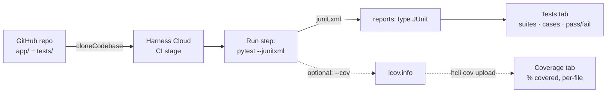

# CI | Tidbits | Test & Report

> **Bite-sized how-to** | ~10 min setup

---

## At a glance



One Run step does two jobs: it **executes** the tests and **writes** a report file. The `reports:` block on that step is what turns the file into the clickable **Tests** tab shown below — nothing else in the pipeline knows or cares that tests ran. Code coverage (dashed path) is the same idea with a different file format and upload command — see [Step 5](#step-5--optional-add-code-coverage).

---

## What is “test & report” in Harness CI?

Running tests in a pipeline is only half the story. The other half is **publishing** structured results so anyone can open the build’s **Tests** tab and see suites, cases, durations, and failures without scrolling raw logs.

Harness parses reports in **JUnit XML** (and .NET **TRX**, which it converts). Almost every major framework can emit that format:

| Framework | How you get JUnit XML | Used in this demo? |
|---|---|---|
| **Pytest** | `pytest --junitxml=path` | **Yes** — primary path |
| **Jest** | `jest-junit` reporter + `JEST_JUNIT_OUTPUT_DIR` | Documented below |
| **JUnit / Surefire** | Maven/Gradle surefire reports under `target/surefire-reports/*.xml` | Documented below |

**The result:** one Run step that both executes tests and declares `reports:` paths — so a green (or red) build always leaves a browsable report behind.

Docs: [Format test reports](https://developer.harness.io/continuous-integration/use-harness-ci/use-harness-ci/run-tests/test-report-ref), [Run tests in CI](https://developer.harness.io/docs/continuous-integration/use-ci/run-tests/run-tests-in-ci/).

---

## Why this approach (and the tradeoffs)

### Why publish reports at all?

| | |
|---|---|
| **Pros** | Failures are searchable and attributed to a case name; trends are visible across runs; reviewers do not depend on log archaeology. |
| **Cons** | You must keep the XML path and the `reports:` glob in sync; oversized fields (>8k chars) can truncate in the UI. |

Without `reports:` on the step, Pytest still runs and the step still fails on assertion errors — but the **Tests** tab stays empty. The `reports` block is what turns a log into a product surface.

### Why JUnit XML as the interchange format?

| | |
|---|---|
| **Pros** | One Harness setting works across Python, JS, and Java; ecosystem tooling is mature. |
| **Cons** | Native framework output (Pytest JSON, Jest default) is not enough — you must emit or convert to JUnit/TRX. |

### Fail-on-test-failure vs soft reporting

This pipeline lets **Pytest’s exit code** fail the step when any test fails (the usual quality gate).

| Mode | How | Pros | Cons |
|---|---|---|---|
| **Fail the step** (this demo) | Default Pytest / Jest CI exit codes | Fast feedback; broken tests cannot merge unnoticed | A mid-suite crash may skip later cases if you do not configure the runner to continue |
| **Soft report, gate later** | Ignore the runner exit code, always write XML, then use a follow-up parse/gate step | Full suite always produces a report; useful for “shadow” rollout | Easy to forget the gate and ship red tests as green builds |

Prefer **fail the step** for this walkthrough and for most merge gates. Prefer **soft report** when you are introducing reporting to a flaky legacy suite and need visibility before enforcement.

### Why demo Pytest (not Jest or Java)?

This repo ships a tiny Python `app/` and `tests/` layout. Pytest’s `--junitxml` flag needs no extra reporter package, so the teaching surface stays small. Jest and Java paths are documented in [Multi-framework reporting](#multi-framework-reporting) so the concept transfers.

---

## Prerequisites

Before you start, make sure you have:

- A Harness account with a **Project** (note its org + project identifiers).
- Harness Cloud build credits (default on Harness-hosted runners). No delegate is required.
- A GitHub [fine-grained personal access token](https://docs.github.com/en/authentication/keeping-your-account-and-data-secure/managing-your-personal-access-tokens#creating-a-fine-grained-personal-access-token) with repository permission **Contents: Read-only** on the repository you will clone.

---

## Step 1 — Review this repo

The application under `app/` is a tiny greeting helper. `tests/` holds Pytest cases. The pipeline installs Pytest, writes JUnit XML under `/harness/test-results/`, and publishes that path to the Tests tab.

```
.
├── .harness/
│   └── pipeline.yaml          ← CI stage: Pytest + reports:
├── connectors/
│   └── github-connector.yaml  ← GitHub connector (secret id only)
├── app/
│   ├── __init__.py
│   └── main.py                ← sample code under test
├── tests/
│   └── test_main.py           ← Pytest cases
├── requirements.txt           ← pytest
├── pytest.ini                 ← junit_family for stable XML
└── README.md
```

Point **Repository Name** at `harness-community/ci-tidbits-test-report`, or at a fork the token can read.

This walkthrough creates the Harness secret, the GitHub connector, and the pipeline through the Harness UI. The [`connectors/github-connector.yaml`](./connectors/github-connector.yaml) and [`.harness/pipeline.yaml`](./.harness/pipeline.yaml) files in this folder are references for what the UI produces — you will not paste or apply them directly. The token is not in Git.

---

## Step 2 — Secret and connector

**Why first?** `cloneCodebase: true` needs a connector before any step runs. Publishing reports never replaces cloning.

New to Harness connectors? Walk through [Introduction to CD Connector Usage](https://university-registration.harness.io/self-paced-training-tidbit-introduction-to-cd-connector-usage) first, then come back here — it covers the secret → connector flow in more depth than this tidbit does.

1. **Token, then secret.** Create a fine-grained PAT with **Contents: Read-only**. In Harness: Project Settings → Secrets → Text. Id `github-pat`. Paste the token. Do not commit it.

2. **GitHub connector.** Project Settings → Connectors → New Connector → GitHub.

   - URL `https://github.com`, connection type **Account**.
   - Authentication: **Username** and **Token** → secret `github-pat`.
   - **Connect through Harness Platform** (`executeOnDelegate: false`) for Harness Cloud.
   - Test the connection against a repository the token can read.

---

## Step 3 — Import the pipeline

1. Go to **Pipelines → Create a Pipeline** and open the YAML editor.
2. Paste [`.harness/pipeline.yaml`](./.harness/pipeline.yaml).
3. Set `projectIdentifier` and `orgIdentifier` to yours.
4. Save.

`connectorRef` is `githubconnector` — the identifier from the connector YAML, not a URL and not a token.

---

## Step 4 — Run the pipeline (expect a GREEN build + Tests tab)

1. Click **Run**.
2. For **Repository Name**, enter `harness-community/ci-tidbits-test-report`, or a fork the token can read.
3. Keep branch `main`. Click **Run Pipeline**.

Harness clones the codebase, then:

- **Run unit tests** installs `pytest` from `requirements.txt`, executes `tests/`, writes `/harness/test-results/junit.xml`, and declares that path under `reports:`.
- Open the build → **Tests** tab. You should see the suites/cases from `tests/test_main.py`.

**Green is the correct outcome** for the stock tests. The teaching payoff is the Tests tab, not only a green stage icon.

### Reading the Tests tab

| Widget | What it tells you |
|---|---|
| **Total Tests** | Case count parsed out of the JUnit XML — `3` for the stock suite. |
| **Total Run Time** | Sum of per-case durations from the XML, not the whole stage wall-clock time. |
| **Flaky Tests** | Cases that have flipped pass/fail across recent runs on this pipeline — `0` until you have history. |
| **Failure Rate** | Failed ÷ total, as a trend indicator across builds, not just this run. |
| **Passed / Failed / Skipped bar** | Same counts as a quick visual — green/red/blue segments. |
| **Test list (Description, Origin, Duration)** | One row per case. **Origin** is the `module.ClassName`-style path parsed from the XML (`tests.test_main` here); click a row to see the failure trace if red. |

The `Status`, `stage`, and `Step` filters above the list matter once a pipeline has multiple test steps or stages — they scope the list to just `run_unit_tests` in this demo.

### Optional: prove the fail path

Flip one assertion in `tests/test_main.py`, re-run, and confirm:

1. The step goes **red** (Pytest non-zero exit).
2. The **Tests** tab still shows the failed case (because the XML was written before exit — Pytest writes the report even when assertions fail).

Revert the assertion when you are done so the default branch stays green.

---

## Step 5 — (Optional) Add code coverage

The Tests tab tells you which tests ran. The **Coverage** tab (next to it) tells you which *lines* those tests actually exercised. Same pattern as reports: generate a file in a format Harness understands, then upload it.

**Prerequisite:** Code Coverage is behind the `CI_CODE_COVERAGE` account feature flag — ask Harness Support to enable it — and the pipeline needs `CI_ENABLE_HCLI_FOR_TESTS=true` set as an environment variable. Without the flag, the Coverage tab stays empty even if you upload a file.

Extend the Run step (or add a second one) with `pytest-cov` and the `hcli cov` commands:

```yaml
- step:
    type: Run
    name: Run unit tests
    identifier: run_unit_tests
    spec:
      image: python:3.12-slim
      shell: Sh
      envVariables:
        CI_ENABLE_HCLI_FOR_TESTS: "true"
      command: |-
        pip install -r requirements.txt pytest-cov

        pytest tests/ \
          --junitxml=/harness/test-results/junit.xml \
          --cov=app \
          --cov-report=lcov:/harness/test-results/lcov.info \
          -v

        hcli cov upload --file=/harness/test-results/lcov.info
      reports:
        type: JUnit
        spec:
          paths:
            - /harness/test-results/junit.xml
```

Open the build → **Coverage** tab:

| Metric | What it shows |
|---|---|
| **Total Coverage** | % of all lines in `--cov=app` exercised by the suite. |
| **Patch Coverage** | % of *changed* lines covered — only populated on PR builds. |
| **Per-File Breakdown** | Coverage % per source file, so you can spot an untested module at a glance. |

On a PR, the diff view adds line-level color: green (covered), red (not covered), yellow (partially covered — some branches missed).

**Optional quality gate:** `hcli cov wait-until --gt=70 --patch-gt=80 --timeout=1m` blocks the stage until thresholds are met — fails the build if coverage regresses below your bar. Add it as its own step after the upload.

Docs: [Code coverage](https://developer.harness.io/continuous-integration/use-harness-ci/use-harness-ci/run-tests/test-management/ci-code-coverage).

---

## Pipeline YAML reference

The full pipeline lives at [`.harness/pipeline.yaml`](./.harness/pipeline.yaml). Key shape:

```yaml
- step:
    type: Run
    name: Run unit tests
    identifier: run_unit_tests
    spec:
      image: python:3.12-slim
      shell: Sh
      command: |-
        pip install -r requirements.txt
        mkdir -p /harness/test-results
        pytest tests/ --junitxml=/harness/test-results/junit.xml -v
      reports:
        type: JUnit
        spec:
          paths:
            - /harness/test-results/junit.xml
```

| Piece | Why it exists |
|---|---|
| `pip install -r requirements.txt` | Pulls Pytest into the ephemeral Cloud image |
| `--junitxml=…` | Emits the interchange format Harness can parse |
| `reports.type: JUnit` | Tells Harness which files feed the Tests tab |
| Absolute `/harness/…` path | Matches the workspace root Harness Cloud mounts |

---

## Multi-framework reporting

The demo code is Pytest-only. Use the same `reports:` block with other runners:

### Jest

```yaml
- step:
    type: Run
    name: Run Jest Tests
    identifier: run_jest_tests
    spec:
      shell: Sh
      command: |
        yarn add --dev jest-junit
        jest --ci --runInBand --reporters=default --reporters=jest-junit
      envVariables:
        JEST_JUNIT_OUTPUT_DIR: "/harness/reports"
      reports:
        type: JUnit
        spec:
          paths:
            - "/harness/reports/*.xml"
```

**Tradeoff:** Jest needs an extra reporter package; Pytest does not. Prefer `jest-junit` when the product under test is already JavaScript.

### Java (Maven Surefire)

```yaml
reports:
  type: JUnit
  spec:
    paths:
      - "target/surefire-reports/*.xml"
```

Often paired with `-Dmaven.test.failure.ignore=true` when you want XML from the full suite before a later gate — that is the soft-reporting pattern from the table above.

---

## Common Issues & Tips

**Tests tab is empty but the step is green.**  
The command ran without writing XML, or `reports.paths` does not match the file. List `/harness/test-results` in the log and align the glob.

**Step fails before XML exists.**  
A dependency install error never reaches Pytest. Fix install first; there will be nothing to publish until `--junitxml` runs.

**XML path relative vs absolute.**  
Prefer `/harness/test-results/junit.xml` on Harness Cloud so the path is unambiguous relative to the workspace.

**I want reports without failing the build.**  
Soft-report mode: append `|| true` to the Pytest invocation (or use Maven `failure.ignore`), keep `reports:`, and add an explicit gate later. Do not leave soft mode on forever in merge pipelines.

**`ModuleNotFoundError: No module named 'app'` during collection.**  
`tests/` has no `__init__.py`, so Pytest's default "prepend" import mode only puts the `tests/` directory on `sys.path` — not the repo root where `app/` lives. `pytest.ini` sets `pythonpath = .` to fix this (Pytest ≥ 7). If you strip that line, add it back or give `tests/` its own `__init__.py` instead.

---

## What's next?

- **Test Intelligence.** Graduate the Run step to a Test step when you want selective test execution on large suites.
- **Coverage.** See [Step 5](#step-5--optional-add-code-coverage) above — JUnit XML does not replace a coverage report, they're uploaded separately.
- **Parallel frameworks.** Run Pytest and Jest as parallel steps, each with its own `reports:` paths, when a monorepo emits both.

---

## Resources

- [Format test reports](https://developer.harness.io/continuous-integration/use-harness-ci/use-harness-ci/run-tests/test-report-ref)
- [Run tests in CI](https://developer.harness.io/docs/continuous-integration/use-ci/run-tests/run-tests-in-ci/)
- [Run step settings](https://developer.harness.io/docs/continuous-integration/use-ci/run-step-settings/)
- [Configure a codebase](https://developer.harness.io/continuous-integration/use-harness-ci/use-harness-ci/codebase-configuration/create-and-configure-a-codebase)
- [Add and use text secrets](https://developer.harness.io/docs/platform/secrets/add-use-text-secrets)
- [Code coverage](https://developer.harness.io/continuous-integration/use-harness-ci/use-harness-ci/run-tests/test-management/ci-code-coverage)
- Sample repo: https://github.com/harness-community/ci-tidbits-test-report
