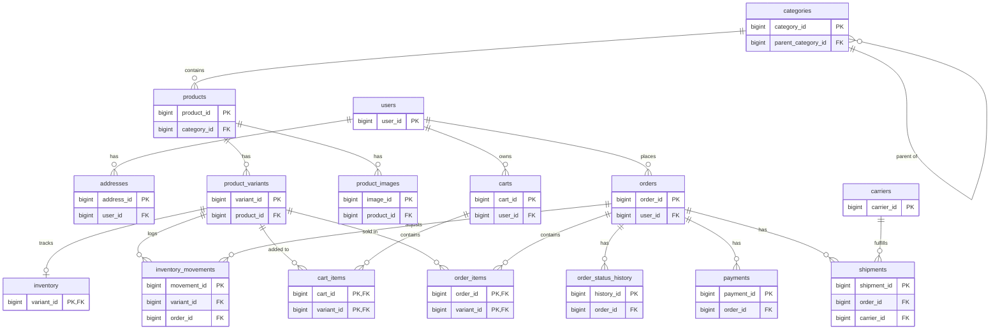

Northwind sample database for MySQL, PostgreSQL, and more
====

This project is inspired by [Microsoft Sample Databases](https://github.com/Microsoft/sql-server-samples), but it mainly focuses on other open-source databases, such as MySQL and PostgreSQL.

This repository contains scripts to create and load the sample databases.


If you are looking for the **original** MS SQL Server scripts, please check out Microsoft's repository on GitHub.

This project lets you create a sample CRM-like demo database, populated with test data, in a few seconds.

## Which sample should I use?

| | **ecommerce** (recommended for new development) | **northwind** (classic) |
|---|---|---|
| Dialects | PostgreSQL, MySQL, MongoDB (document model) | MySQL, PostgreSQL, MS SQL Server, SQLite, MongoDB |
| Schema style | Modern: foreign keys, identity/auto-increment columns, CHECK constraints, JSON columns, generated columns, full-text search; embedded documents on MongoDB | 1990s Northwind port, kept close to the original |
| Domain | Core e-commerce: users, addresses, catalog with variants/SKUs, carts, orders with status lifecycle, payments, shipments, inventory ledger | Classic CRM/ERP: customers, employees, orders, suppliers, territories |
| Use it when | You are building or learning against a contemporary database design | You follow a tutorial/book that expects Northwind, or need the well-known dataset |

**New to this repo? Start with `ecommerce` on PostgreSQL:**

```bash
# 1. Start (or reset) the PostgreSQL container
./renew-pgsql-infra.sh          # Windows: ./renew-pgsql-infra.ps1

# 2. Create and seed the ecommerce database
./pgsql/renew-ecommerce.sh      # Windows: ./pgsql/renew-ecommerce.ps1

# 3. (Optional) Run the sanity checks / demo queries
docker exec -i pgsql-infra psql -U postgres -d ecommerce < pgsql/verify-ecommerce.sql
```

**Prefer MySQL?**

```bash
./renew-mysql-infra.sh          # Windows: ./renew-mysql-infra.ps1
./mysql/renew-ecommerce.sh      # Windows: ./mysql/renew-ecommerce.ps1
docker exec -i mysql-infra mysql -u root -p'YourStrong!Passw0rd' -D ecommerce < mysql/verify-ecommerce.sql
```

**Prefer MongoDB?** The same data ships as an embedded-document model
(addresses inside users; variants, images and stock inside products; items,
status history, payment and shipment inside orders):

```bash
./renew-mongo-infra.sh          # Windows: ./renew-mongo-infra.ps1
cd mongo/ecommerce && ./mongo_import.sh
```

Demo queries (top products by revenue, full-text search) are baked into
`pgsql/verify-ecommerce.sql` and `mysql/verify-ecommerce.sql` — run whichever
matches the dialect you loaded. For MongoDB, the equivalent revenue query is
an aggregation over the embedded `items` array:

```js
db.orders.aggregate([
  { $unwind: "$items" },
  { $group: { _id: "$items.productName", revenue: { $sum: "$items.lineTotal" } } },
  { $sort: { revenue: -1 } }, { $limit: 10 }
])
```

The Northwind instructions below remain fully supported.

## Quick Start with Docker (Recommended)

The easiest way to get started is using Docker Compose, which provides pre-configured containers for MySQL, PostgreSQL, MS SQL Server, and MongoDB.

### Prerequisites

- [Docker](https://www.docker.com/get-started) installed and running
- [Docker Compose](https://docs.docker.com/compose/install/) (included with Docker Desktop)

### Starting Database Servers

**Start all database servers:**
```bash
docker-compose up -d
```

**Start specific database server:**
```bash
# MySQL only
docker-compose up -d mysql

# PostgreSQL only
docker-compose up -d postgres

# MS SQL Server only
docker-compose up -d mssql

# MongoDB only
docker-compose up -d mongo
```

### Creating and Refreshing Databases (Recommended)

Use the provided renewal scripts to quickly create or refresh databases with sample data:

**MySQL:**
```bash
./renew-mysql-infra.sh
```
- Recreates the MySQL container with fresh data
- Database: `northwind` (lowercase, case-insensitive)
- Port: 3306
- Username: `root`
- Password: `YourStrong!Passw0rd`

**PostgreSQL:**
```bash
./renew-pgsql-infra.sh
```
- Recreates the PostgreSQL container with fresh data
- Database: `northwind`
- Port: 5432
- Username: `postgres`
- Password: `YourStrong!Passw0rd`

**MS SQL Server:**
```bash
./renew-mssql-infra.sh
```
- Recreates the MS SQL Server container with fresh data
- Database: `northwind`
- Port: 1433
- Username: `sa`
- Password: `YourStrong!Passw0rd`

**MongoDB:**
```bash
./renew-mongo-infra.sh
```
- Recreates the MongoDB container with an empty data volume
- Port: 27017, no authentication (local sample use only)
- Load data with `mongo/data/mongo_import.sh` (Northwind) or `mongo/ecommerce/mongo_import.sh` (ecommerce) — each prefers a local `mongoimport` and falls back to running it inside the container

### Connection Examples

**MySQL:**
```bash
# Using Docker
docker exec -it mysql-infra mysql -u root -pYourStrong!Passw0rd -D northwind

# Using local MySQL client
mysql -h localhost -P 3306 -u root -pYourStrong!Passw0rd -D northwind
```

**PostgreSQL:**
```bash
# Using Docker
docker exec -it pgsql-infra psql -U postgres -d northwind

# Using local psql client
psql -h localhost -p 5432 -U postgres -d northwind
```

**MS SQL Server:**
```bash
# Using Docker
docker exec -it mssql-infra /opt/mssql-tools18/bin/sqlcmd -S localhost -U sa -P YourStrong!Passw0rd -d northwind -C

# Using local sqlcmd (if installed)
sqlcmd -S localhost -U sa -P YourStrong!Passw0rd -d northwind
```

**MongoDB:**
```bash
# Using Docker
docker exec -it mongo-infra mongosh northwind

# Using local mongosh client
mongosh mongodb://localhost:27017/northwind
```

### Database Features

**MySQL Configuration:**
- **Case-insensitive table names**: Query using `customer`, `Customer`, or `CUSTOMER`
- **Collation**: `utf8mb4_0900_ai_ci` (accent and case insensitive)
- All 13 tables with sample data

**PostgreSQL Configuration:**
- Full Northwind schema with constraints
- Sample data included

**MS SQL Server Configuration:**
- Northwind database with singular table names
- Compatible with SQL Server 2022

**MongoDB Configuration:**
- No authentication (local sample use only)
- `mongo/data` holds flat Northwind collections; `mongo/ecommerce` holds the embedded-document ecommerce model

### Stopping and Removing Containers

```bash
# Stop all containers
docker-compose down

# Stop and remove all data volumes (WARNING: deletes all data)
docker-compose down -v
```

## Manual Database Installation (Without Docker)

If you prefer to install databases manually without Docker, you can use the SQL scripts directly with your local database installations.

### Caveat

The sample databases in this project are customized. Some table and column names have been changed on purpose.

### Differences from the MS SQL Server sample

* Some tables have additional columns, e.g. `email` and `mobile`.
* All photo sample data has been removed; a `photoPath` column has been added instead, for more flexible implementations.
* NorthwindCore is designed for Entity Framework.

### ER Diagrams

* The ER diagrams only contain primary and foreign keys.
* The Northwind diagrams were created with MySQL Workbench; you can open the `.mwb` files with the same tool. The Ecommerce diagram below is written in [Mermaid](https://mermaid.js.org/) and renders directly on GitHub, so it stays in sync with `pgsql/ecommerce.sql` / `mysql/ecommerce.sql` as plain text instead of a binary to regenerate.

#### Ecommerce



MongoDB uses a different shape: `addresses` are embedded inside `users`; `product_variants`, `product_images`, and stock are embedded inside `products`; and `order_items`, `order_status_history`, `payments`, and `shipments` are embedded inside `orders`. See `mongo/ecommerce/*.json` for the document layout.

#### Northwind 


####  NorthwindCore


* Every table in NorthwindCore contains an `EntityId` column.


### Restore a database from a SQL script

> **Note:** For easier setup, consider using the [Docker method](#quick-start-with-docker-recommended) with the `./renew-mysql-infra.sh` or other renewal scripts.

#### MySQL

**Using the renewal script (recommended):**
```bash
cd mysql
./renew-northwind.sh
```

**Manual import:**
```bash
mysql -u user_id -p northwind < mysql/northwind.sql
```


#### PostgreSQL

**Using the renewal script (recommended):**
```bash
cd pgsql
./renew-northwind.sh
```

**Manual import:**
```bash
sudo su - postgres
psql -d postgres -U postgres -f pgsql/northwind.sql
```

#### MongoDB

* First, install the MongoDB Community Server, shell, and tools
* Launch the MongoDB server

```
# Launch MongoDB on Linux
systemctl start mongod

```

* Create the `northwind` database and import the data (the same pattern applies to
  `mongo/ecommerce/mongo_import.sh` for the ecommerce sample)

```bash
cd mongo/data
./mongo_import.sh

mongosh mongodb://localhost:27017/northwind --eval "db.getCollectionNames()"

# Expected output:
# [
# 	'category',
# 	'customer',
# 	'employee',
# 	'employeeTerritory',
# 	'orderDetail',
# 	'product',
# 	'region',
# 	'salesOrder',
# 	'shipper',
# 	'supplier',
# 	'territory'
# ]
```

#### SQLite

* Install [sqlite3](https://www.sqlite.org/)
* Create the northwind database

```
cd db-samples/sqlite
sqlite3 northwind.db < northwind_core.sql
sqlite3 northwind.db
>.tables
```

#### JSON flat files

* JSON flat files are great for integration tests or demonstrations
* The `json` folder contains a few JSON flat files
* `json_data.min.json` is the original data set
* `json_tiny.json` is a version with only a small data set

## MS SQL Server

This folder `mssql` contains the Northwind database SQL script and utilities for MS SQL Server.

> **Note:** This version uses **singular** table names (e.g., `Customer`, `SalesOrder`, `Product`) instead of plural names. This differs from the official Microsoft Northwind database which uses plural table names (e.g., `Customers`, `Orders`, `Products`).

**Using the renewal script (recommended):**
```bash
cd mssql
./renew-northwind.sh
```

**Manual import:**
```bash
sqlcmd -S localhost -U sa -P YourStrong!Passw0rd -i mssql/northwind.sql
```

## Docker Compose Configuration

The `docker-compose.yml` file includes optimized configurations for all four database servers:

- **MySQL**: Case-insensitive table names (`lower_case_table_names=1`), utf8mb4 collation
- **PostgreSQL**: Alpine-based lightweight image, health checks enabled
- **MS SQL Server**: Express edition, automatic initialization support
- **MongoDB**: No authentication (local sample use only), health checks enabled

To view container logs:
```bash
docker-compose logs mysql
docker-compose logs postgres
docker-compose logs mssql
docker-compose logs mongo
```

## Troubleshooting

**Container won't start:**
```bash
# Check container status
docker-compose ps

# View logs
docker-compose logs <service-name>

# Restart a specific service
docker-compose restart <service-name>
```

**Database connection refused:**
- Wait 10-30 seconds after starting containers for databases to initialize
- Check if the container is healthy: `docker-compose ps`
- Verify port is not already in use: `lsof -i :3306` (MySQL), `lsof -i :5432` (PostgreSQL), `lsof -i :1433` (MSSQL), `lsof -i :27017` (MongoDB)

**Reset everything:**
```bash
# Stop containers and remove volumes (deletes all data)
docker-compose down -v

# Restart fresh
./renew-mysql-infra.sh    # or renew-pgsql-infra.sh, renew-mssql-infra.sh, or renew-mongo-infra.sh
```


### TODO

* ~~Add script for MongoDB~~
* ~~Add script for Sqlite~~
* ~~Add Mongo container~~


