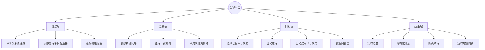
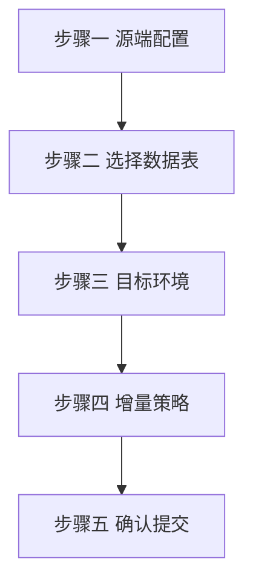
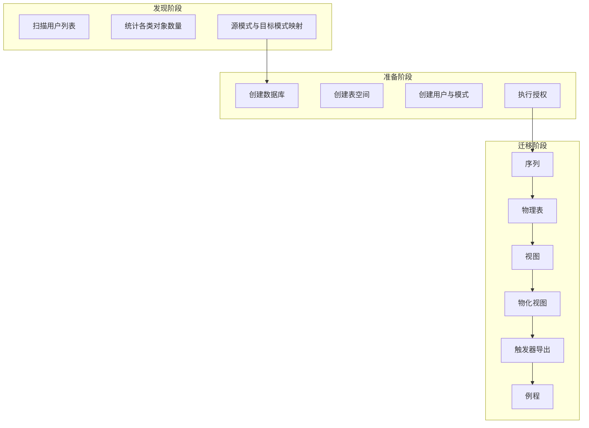
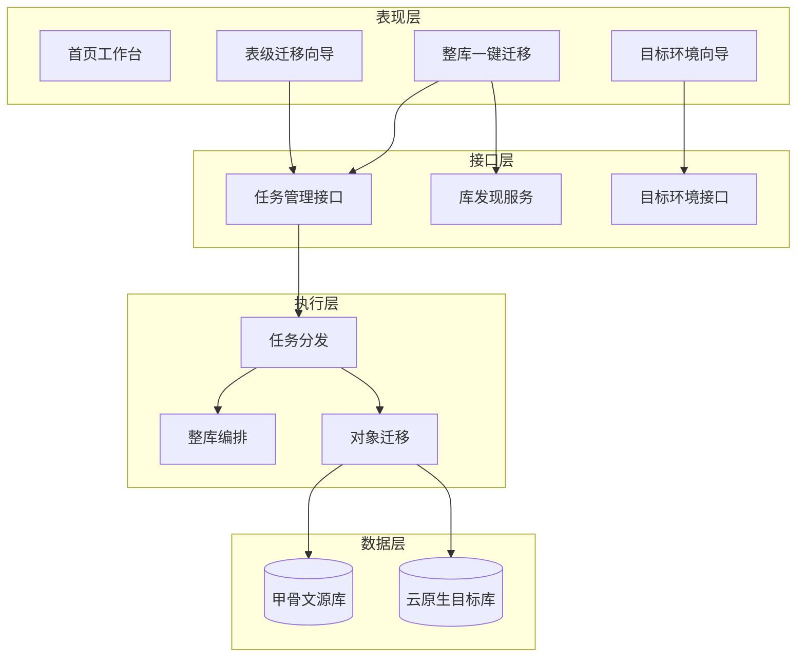
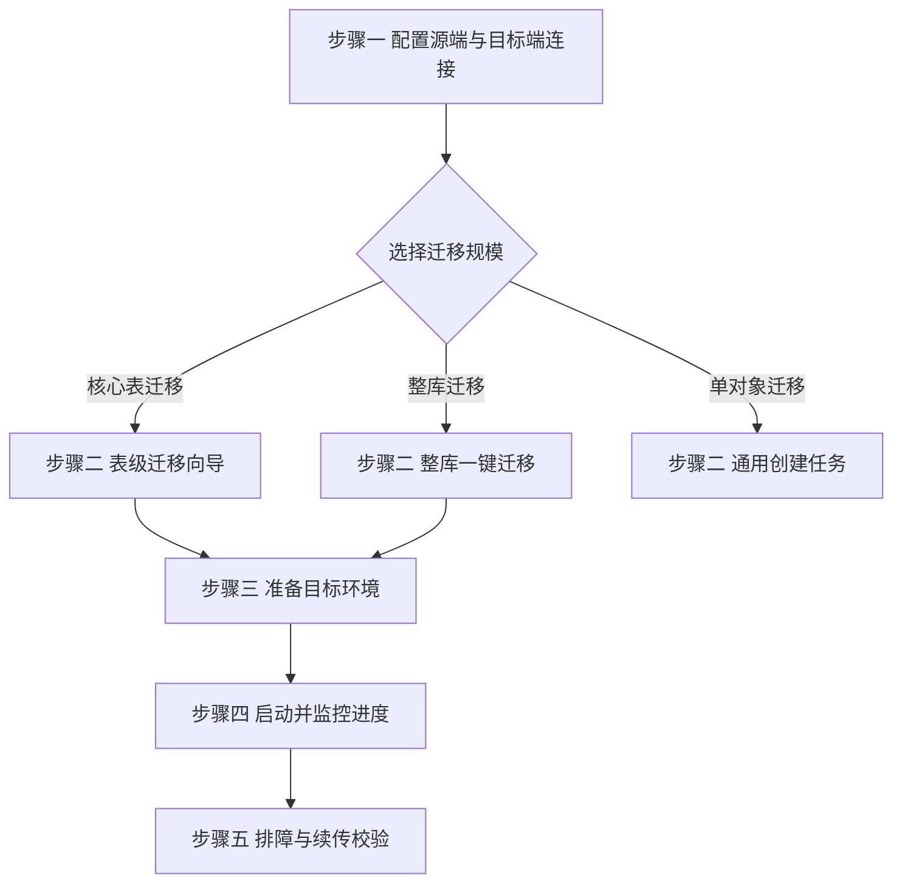

<!-- 文档版本：v2.2 · 企业级迁移平台 -->
<h1 align="center">Oracle 至 PolarDB PostgreSQL</h1>
<h3 align="center">企业级数据库迁移与同步平台</h3>

<p align="center">
  
  
  
</p>

<p align="center">
  <strong>一站式上云 · 表级精迁 · 整库编排 · 目标环境自动就绪</strong>
</p>

<p align="center">
  <sub>将 Oracle 11g+ 的结构与数据，安全、可控地迁移至 PolarDB PostgreSQL · 支持增量同步与断点续传</sub>
</p>

<br/>

<p align="center">
  <a href="#-快速开始"></a>
  &nbsp;
  <a href="#-亮点功能--v2"></a>
  &nbsp;
  <a href="#-系统架构"></a>
  &nbsp;
  <a href="docs/文档索引.md"></a>
</p>

<br/>

<p align="center">
  
  
  
  
</p>

<p align="center">
  
  
  
  
  
</p>

<br/>

<!-- 核心能力速览卡片 -->
<table align="center">
  <tr>
    <td align="center" width="25%">
      <h4>📋 表级迁移向导</h4>
      <sub>按表勾选 · 增量同步 · 目标环境配置</sub>
    </td>
    <td align="center" width="25%">
      <h4>☁️ 整库一键迁移</h4>
      <sub>多 Schema · 全对象编排 · 阶段进度</sub>
    </td>
    <td align="center" width="25%">
      <h4>🛠 目标环境 DDL</h4>
      <sub>建库 · 表空间 · 用户 · Schema</sub>
    </td>
    <td align="center" width="25%">
      <h4>📡 实时监控</h4>
      <sub>进度轮询 · 日志审计 · 主键对比</sub>
    </td>
  </tr>
</table>

<br/>

<!-- 平台核心指标 -->
<table align="center">
  <tr>
    <td align="center"><strong>11+</strong><br/><sub>迁移对象类型</sub></td>
    <td align="center"><strong>5</strong><br/><sub>表级向导步骤</sub></td>
    <td align="center"><strong>6</strong><br/><sub>整库编排阶段</sub></td>
    <td align="center"><strong>3</strong><br/><sub>增量同步模式</sub></td>
    <td align="center"><strong>∞</strong><br/><sub>断点续传支持</sub></td>
  </tr>
</table>

<br/>

---

## 📋 目录

> [!TIP]
> 建议首次阅读顺序：**产品概述** → **亮点功能 v2** → **快速开始** → **使用手册**

<details open>
<summary><b>📂 展开完整导航</b></summary>

<br/>

| 章节 | 说明 |
|:-----|:-----|
| [🎯 产品概述](#-产品概述) | 平台定位与核心能力矩阵 |
| [✨ 亮点功能 · v2](#-亮点功能--v2) | 表级向导 · 整库编排 · 目标环境 DDL |
| [🆕 v2.1 优化与修复](#-v21-优化与修复) | 日志体系 · 事务保护 · bigint 截断 · 超时控制 |
| [🆕 v2.2 企业级加固](#-v22-企业级加固) | 安全加固 · 运维命令 · 类型补全 · 索引告警 · 注释迁移 · 多层校验 |
| [📌 适用场景与版本](#-适用场景与版本) | 源端/目标端版本与典型场景 |
| [✨ 核心功能矩阵](#-核心功能矩阵) | 连接、对象、策略、可观测性 |
| [🏗 系统架构](#-系统架构) | 前后端分层与数据流 |
| [🗺 导航与路由地图](#-导航与路由地图) | 菜单与路由对照表 |
| [🚀 快速开始](#-快速开始) | 环境要求与一键启动 |
| [📖 使用手册](#-使用手册) | 三条上手路径与策略速查 |
| [🔌 API 速查](#-api-速查--新增) | v2 新增 REST 端点 |
| [🔧 开发指南](#-开发指南) | 技术栈与关键模块 |
| [🐳 Docker 部署](#-docker-部署) | 容器化一键部署 |
| [❓ 常见问题 FAQ](#-常见问题-faq) | 排障与错误诊断 |
| [📚 文档与支持](#-文档与支持) | 子文档索引 |
| [📄 许可证](#-许可证) | 版权信息 |

</details>

---

## 🎯 产品概述

**Oracle 到 PolarDB PostgreSQL 迁移平台** 是一套面向企业级场景的数据库迁移与数据同步解决方案。帮助客户将 Oracle 11g 及更高版本的结构与数据，安全、可控地迁移至阿里云 PolarDB PostgreSQL 兼容引擎，并支持**任务编排、目标环境预置、增量同步、断点续传**与全链路可观测。



<br/>

<table>
  <thead>
    <tr>
      <th align="center" width="18%">能力维度</th>
      <th>说明</th>
      <th align="center" width="12%">成熟度</th>
    </tr>
  </thead>
  <tbody>
    <tr>
      <td align="center"><strong>一站式</strong></td>
      <td>连接配置 → 对象选择 → 目标就绪 → 执行监控，全流程 Web 化</td>
      <td align="center">✅ 生产</td>
    </tr>
    <tr>
      <td align="center"><strong>可编排</strong></td>
      <td>单表、多表、整 Schema、<strong>整实例多 Schema</strong> 多粒度迁移</td>
      <td align="center">✅ 生产</td>
    </tr>
    <tr>
      <td align="center"><strong>可增量</strong></td>
      <td>水位列追加、主键对齐定时增删，配合 Celery Beat</td>
      <td align="center">✅ 生产</td>
    </tr>
    <tr>
      <td align="center"><strong>可观测</strong></td>
      <td>任务/对象/阶段三级进度，日志审计与失败诊断</td>
      <td align="center">✅ 生产</td>
    </tr>
    <tr>
      <td align="center"><strong>可续传</strong></td>
      <td>大表、多表、整库编排均支持断点恢复</td>
      <td align="center">✅ 生产</td>
    </tr>
  </tbody>
</table>

---

## ✨ 亮点功能 · v2

> [!IMPORTANT]
> 本版本重点交付：**表级迁移向导** · **整库一键迁移** · **PolarDB 目标环境 DDL 自动就绪**

<br/>

<table>
  <tr>
    <td width="33%" valign="top">
      <h4>📋 表级迁移向导</h4>
      <code>/task/table-migrate</code><br/><br/>
      五步向导收敛选表、配目标、定增量，适合核心业务表分批上云。
    </td>
    <td width="33%" valign="top">
      <h4>☁️ 整库一键迁移</h4>
      <code>/migration/full-database</code><br/><br/>
      自动发现多 Schema，按依赖顺序编排序列→表→视图→例程。
    </td>
    <td width="33%" valign="top">
      <h4>🛠 目标环境 DDL</h4>
      <code>TargetEnvWizard</code><br/><br/>
      Web 端一键建库/表空间/用户/Schema，无需反复登录控制台。
    </td>
  </tr>
</table>

<br/>

### 📋 表级迁移向导

**入口**：侧边栏 `迁移管理 → 表级迁移` · 路由 `/task/table-migrate`

五步向导，将「选表 + 配目标 + 定增量」收敛为一条清晰路径：



| 步骤 | 能力 | 说明 |
|:----:|:-----|:-----|
| ① | 源端 | 选择 Oracle 连接与 Schema，自动加载表列表 |
| ② | 选表 | 仅 `TABLE` 类型，支持搜索、全选、批量勾选 |
| ③ | 目标 | 复用 `TargetEnvWizard`：选已有或**新建**库/表空间/用户/Schema |
| ④ | 增量 | `none` 全量 · `timestamp` 水位列 · `pk_mirror` 主键对齐 + 定时 |
| ⑤ | 提交 | 可选 `prepare_target` 先执行 DDL，再创建 `table` 类型任务 |

> [!NOTE]
> **典型场景**：核心业务表分批上云、按表增量同步、目标库尚未在 PolarDB 控制台手工创建。

---

### ☁️ 整库一键迁移

**入口**：侧边栏 `迁移管理 → 整库一键迁移` · 路由 `/migration/full-database`

单 Oracle 连接下，自动发现全部非系统 Schema，按依赖顺序编排迁移：



| 编排阶段 | 行为 | 续传 |
|:--------:|:-----|:----:|
| 准备环境 | 按向导配置自动建库/用户/Schema | — |
| 序列 | 全 Schema 序列先行创建 | ✅ |
| 物理表 | 逐 Schema、逐表结构+数据迁移 | ✅ |
| 视图 | 定义或物化（复用现有 `migrate_view`） | ✅ |
| 物化视图 | MV 定义与数据 | ✅ |
| 触发器 | **导出源码模板**，不自动下发 DDL | ✅ |
| 例程 | 存储过程/函数基础语法转换 | ✅ |

任务详情页展示**多阶段进度条**、当前 Schema、已完成/失败对象列表，支持「继续迁移」断点续传。

---

### 🛠 目标环境自动就绪

通过 `TargetEnvWizard` 组件与后端 `target_provisioning` 模块，在 Web 端完成 PolarDB 侧环境准备，无需反复登录控制台：

```
┌─────────────────────────────────────────────────────────────┐
│  TargetEnvWizard · 目标环境配置面板                          │
├─────────────────────────────────────────────────────────────┤
│  📦 数据库    [ 选择已有 ▼ ] [ 新建 ▼ ]  名称 · 编码 UTF8    │
│  💾 表空间    [ 默认 ▼ ] [ 已有 ▼ ] [ 新建 + LOCATION 路径 ]  │
│  👤 用户      [ 跳过 ▼ ] [ 已有 ▼ ] [ 新建 + 密码 + CREATEDB ]│
│  📂 Schema    [ 已有 public ▼ ] [ 新建 + 所有者 ]            │
├─────────────────────────────────────────────────────────────┤
│  [ 🔧 测试并准备环境 ]  →  POST /api/target-env/prepare/    │
└─────────────────────────────────────────────────────────────┘
```

| 资源 | 模式 | 权限要求 |
|:-----|:-----|:---------|
| 数据库 | `existing` / `create` / `skip` | `CREATEDB` 或超级用户 |
| 表空间 | `skip` / `existing` / `create` | 超级用户 + 服务器目录路径 |
| 用户 | `skip` / `existing` / `create` | `CREATEROLE` 或超级用户 |
| Schema | `existing` / `create` | 目标库 `CREATE` 权限 |

> [!WARNING]
> 表空间创建需 PolarDB 实例文件系统路径；无超级用户权限时，可回退「使用默认表空间」仅完成库/用户/Schema 准备。

---

## 🆕 v2.1 优化与修复

> [!IMPORTANT]
> 本版本重点：**统一结构化日志协议** · **事务中断保护** · **bigint 范围截断** · **连接超时控制** · **对象选择 UI 重构**

### 📊 统一结构化日志协议

后端定义 8 级日志协议 `[LEVEL] message`，所有迁移模块统一调用：

| 级别 | 含义 | 颜色 | 典型场景 |
|:----:|:-----|:-----|:-----|
| `STEP` | 阶段步骤 | 天蓝 | 进入某个迁移阶段 |
| `INFO` | 一般信息 | 浅蓝 | 过程说明、参数提示 |
| `OK` | 成功 | 绿 | 单个对象完成、阶段摘要 |
| `WARN` | 警告 | 黄 | 跳过对象、兼容性提示 |
| `ERROR` | 错误 | 红 | 异常、失败、traceback |
| `DATA` | 数据导入 | 紫 | 批量 INSERT 行数 |
| `SQL` | DDL 语句 | 粉 | CREATE VIEW / 触发器源码 |
| `META` | 元数据 | 灰 | 列数、对象统计 |

前端日志面板（任务详情、实时监控）按级别着色显示，支持级别过滤、关键词搜索、自动滚动、复制下载。

### 🛡 事务中断保护

**问题：** PostgreSQL 中一条 SQL 失败后事务进入 `aborted` 状态，后续所有查询都报「当前事务被终止」，导致整批对象连锁失败。

**修复：** 序列、表等批量迁移中，每个对象的 `except` 分支先 `pg_conn.rollback()` 再抛出，保证失败不影响下一个。日志按错误类型分组聚合，同类错误只显示一条根因 + 计数，避免 2567 条重复日志刷屏。

### 🔢 bigint 范围截断

**问题：** Oracle 序列 `MAX_VALUE` 可达 28 位（如 `999999999999999999999999999`），远超 PostgreSQL bigint 上限 `9223372036854775807`（19 位），导致 `CREATE SEQUENCE` 失败。

**修复：** `_migrate_one_sequence` 自动将超范围的 `MIN_VALUE` / `MAX_VALUE` / `LAST_NUMBER` 截断到 bigint 上下限，日志中标注「原值超出 bigint 范围，已截断」。

### ⏱ 连接超时控制

**问题：** Oracle 主机不可达时 `cx_Oracle.connect()` 阻塞数十秒，HTTP 请求永不返回。

**修复：**
- `get_oracle_connection` 新增 `call_timeout_ms`（默认 30 秒），通过 `cx_Oracle.callTimeout` 限制单条 SQL 执行超时
- `discover_oracle_instance` 用 `ThreadPoolExecutor` 包裹，整体 90 秒超时
- Discovery 查询从逐 Schema 循环（10N 次往返）改为 `GROUP BY` 批量聚合（仅 7 次）
- API 异常分类处理：超时返回 504，ORA 错误码翻译为中文提示

### 🎨 对象选择 UI 重构

| 页面 | 优化内容 |
|:-----|:-----|
| 整库一键迁移 | 对象类型改为卡片网格：彩色图标 + 名称 + 描述 + checkbox，全选/反选 |
| 创建任务 | 源对象列表增强：反选、搜索图标、对象类型图标、选中高亮、空状态提示 |
| 任务详情/监控 | 日志面板深色终端化：级别过滤、关键词搜索、自动滚动、复制下载 |

### 📋 视图/例程 source_object 持久化

**问题：** 整库迁移的视图/物化视图/例程阶段，修改 `task.source_object` 后未 `save` 就调用迁移函数，后者重新从数据库读取 task 时 `source_object` 为空，报「未指定要迁移的视图」。

**修复：** 三个阶段的循环中都加了 `task.save(update_fields=[...])` 再调用迁移函数。

---

## 🆕 v2.2 企业级加固

> [!IMPORTANT]
> 本版本重点：**安全加固** · **运维命令** · **数据类型补全** · **索引告警** · **注释迁移** · **多层数据校验**

### 🛡 P0 安全加固

| 加固项 | 说明 |
|:-------|:-----|
| 环境隔离 | `DJANGO_ENV=dev/prod` 区分，生产强制 `SECRET_KEY`/`ALLOWED_HOSTS`/`CORS` 白名单 |
| 安全头 | `SECURE_SSL_REDIRECT`/`HSTS`/`Cookie Secure`/`X_FRAME_OPTIONS=DENY` |
| API 限流 | DRF `AnonRateThrottle`(60/min) + `UserRateThrottle`(300/min) + 登录 `ScopedRateThrottle`(5/min) |
| 文件浏览沙箱 | `BrowseDirectoriesAPIView` 白名单校验，防目录穿越 |
| 错误处理 | `_safe_error` 统一错误响应，生产不泄露 `str(e)` |
| 健康检查 | `/healthz`（存活）+ `/readyz`（就绪，DB 连通性） |
| JWT 密钥独立 | `JWT_SIGNING_KEY` 可独立于 `SECRET_KEY` |
| 数据库 | `DATABASE_URL` 支持 PostgreSQL 元数据库 |
| 缓存 | Redis 缓存配置（与 Celery Broker 复用） |
| 日志 | `LOGGING` dictConfig + 慢查询告警 + 模块分级 |

### 🔧 P1 运维 Management Commands

```bash
python manage.py init_admin --username admin --password xxx    # 初始化/重置超管
python manage.py cleanup_logs --days 30                         # 清理 30 天前日志
python manage.py reconcile_running                               # 重置孤儿 running 任务
python manage.py healthcheck                                    # 命令行健康检查
```

### 📊 P1 数据类型补全

| Oracle 类型 | PostgreSQL 映射 |
|:-----------|:----------------|
| XMLTYPE | XML |
| ROWID | CHAR(18) |
| UROWID | CHAR(40) |
| BFILE | TEXT |
| INTERVAL YEAR TO MONTH | INTERVAL YEAR TO MONTH |
| INTERVAL DAY TO SECOND(n) | INTERVAL DAY TO SECOND(n) |
| BOOLEAN | BOOLEAN |

累计支持 Oracle 类型从 17 种扩展到 24 种。

### 🔍 P1 索引补全告警

新增 `fetch_unsupported_indexes` 统计函数索引/位图索引/反向键索引，迁移时输出告警 + PG 对应建议：
- FUNCTION-BASED → PG 表达式索引
- BITMAP → PG GIN 或普通 B-tree
- REVERSE → PG 普通 B-tree

### 💬 P1 表/列注释迁移

新增 `apply_table_comments`，读取 `ALL_TAB_COMMENTS` / `ALL_COL_COMMENTS`，执行 `COMMENT ON TABLE` / `COMMENT ON COLUMN`。

### ✅ P2 多层数据校验

从仅行数校验升级为 4 层校验体系：

| 层级 | 函数 | 说明 |
|:-----|:-----|:-----|
| 行数 | `validate_row_counts` | 最低保障，行数相等≠数据一致 |
| 聚合 | `validate_aggregates` | 对比 SUM/COUNT/MIN/MAX，捕获批量错误 |
| 哈希 | `validate_row_hashes` | 按主键分批 MD5 对比，精确定位差异行 |
| 抽样 | `validate_sample_rows` | DBMS_RANDOM 随机抽样逐行对比 |
| 综合 | `validate_full` | 行数→聚合→哈希（小表）/抽样（大表） |

---

## 📌 适用场景与版本

<table>
  <thead>
    <tr>
      <th width="18%">维度</th>
      <th>说明</th>
      <th width="14%">推荐度</th>
    </tr>
  </thead>
  <tbody>
    <tr>
      <td><strong>源端</strong></td>
      <td>Oracle Database <strong>11g+</strong>（如 11.2.0.4 Enterprise Edition），Schema = <code>ALL_USERS.USERNAME</code></td>
      <td>⭐⭐⭐⭐⭐</td>
    </tr>
    <tr>
      <td><strong>目标端</strong></td>
      <td>阿里云 <strong>PolarDB PostgreSQL</strong> 或兼容 PostgreSQL 15 的实例</td>
      <td>⭐⭐⭐⭐⭐</td>
    </tr>
    <tr>
      <td><strong>精迁场景</strong></td>
      <td>按表选择、增量同步、目标库/用户/Schema 尚未就绪</td>
      <td>⭐⭐⭐⭐</td>
    </tr>
    <tr>
      <td><strong>整库场景</strong></td>
      <td>单实例多 Schema、多对象类型一次性编排上云</td>
      <td>⭐⭐⭐⭐</td>
    </tr>
    <tr>
      <td><strong>归档场景</strong></td>
      <td>视图数据导出 SQLite，便于离线分析</td>
      <td>⭐⭐⭐</td>
    </tr>
  </tbody>
</table>

---

## ✨ 核心功能矩阵

### 🔗 连接与配置

| 模块 | 能力 | 标签 |
|:-----|:-----|:-----|
| Oracle 连接 | 多源库 CRUD、连接测试、Schema/用户/对象枚举 | `源端` |
| PolarDB 连接 | 多实例、SSL、多库列表、Schema/用户/表空间查询 | `目标端` |
| 任务级目标 | 连接 → 数据库 → Schema 三步选择；支持运行时切换目标库 | `编排` |
| 全局策略 | 默认大小写、冲突策略、批量大小（系统配置页） | `策略` |

### 📦 对象迁移能力

| 类型 | 标识 | 说明 | 版本 |
|:-----|:-----|:-----|:----:|
| 表 | `table` | 结构+数据+约束+索引；支持多表单任务、增量、行数校验 | — |
| 视图 | `view` | 物化到表 或 创建视图定义（NVL/SYSDATE 等基础转换） | — |
| 物化视图 | `materialized_view` | MV 定义与刷新逻辑 | — |
| 序列 | `sequence` | 先于表创建，保障主键自增 | — |
| 触发器 | `trigger` | 导出 Oracle 源码 + PL/pgSQL 模板（人工改写） | — |
| 例程 | `routine` | 存储过程/函数基础语法转换 | — |
| 所有表 | `all_tables` | 单 Schema 全表批量，FK 拓扑排序 | — |
| 全 Schema | `full_schema` | 序列 + 全表编排 | — |
| **整库** | `full_database` | 多 Schema · 全对象类型编排 | 🆕 |
| **表级批量** | `table_batch` | 向导创建的批量表任务（复用多表逻辑） | 🆕 |
| SQLite 导出 | `view_to_sqlite` | 视图数据落地本地 SQLite | — |

### ⚙️ 策略与增量

<table>
  <thead>
    <tr>
      <th width="22%">策略类别</th>
      <th>可选项</th>
    </tr>
  </thead>
  <tbody>
    <tr>
      <td><strong>冲突处理</strong></td>
      <td><code>error</code> · <code>replace</code> · <code>skip</code> · <code>append</code> · <code>truncate</code></td>
    </tr>
    <tr>
      <td><strong>标识符大小写</strong></td>
      <td><code>lower</code> · <code>upper</code> · <code>preserve</code></td>
    </tr>
    <tr>
      <td><strong>增量模式</strong></td>
      <td><code>none</code> 全量 · <code>timestamp</code> 水位列 · <code>pk_mirror</code> 主键对齐</td>
    </tr>
    <tr>
      <td><strong>定时同步</strong></td>
      <td>Celery Beat，最小间隔可配（分钟级）</td>
    </tr>
  </tbody>
</table>

### 📊 可观测性

```
任务总进度 ───────────────────────────────────────────── 100%
  ├─ 对象/表级进度 ────────────────────────────────────  85%
  │    └─ 行级进度（大表 COUNT + 分批写入）────────────  72%
  └─ 整库阶段条：准备 → 序列 → 表 → 视图 → 触发器 → 例程
```

- **三级进度**：任务总进度 → 对象/表级进度 → 行级进度（大表 COUNT + 分批写入）
- **整库阶段条**：准备 → 序列 → 表 → 视图 → 触发器 → 例程
- **断点续传**：`all_tables` · `table` · `full_schema` · `full_database` · `table_batch`
- **主键对比**：监控页展示源/目标行数差异快照

---

## 🏗 系统架构



<br/>

<table>
  <tr>
    <th width="20%">分层</th>
    <th>职责</th>
    <th width="28%">关键技术</th>
  </tr>
  <tr>
    <td><strong>表现层</strong></td>
    <td>Vue 3 SPA · 侧边栏导航 · 主题切换 · 步骤条向导 · 阶段进度条</td>
    <td>Vue Router · Pinia · Bootstrap 5</td>
  </tr>
  <tr>
    <td><strong>接口层</strong></td>
    <td><code>/api/tasks</code> · <code>/api/create-table-migration</code> · <code>/api/target-env/...</code></td>
    <td>DRF · JWT · CORS</td>
  </tr>
  <tr>
    <td><strong>领域层</strong></td>
    <td>任务模型 · 目标配置 JSON · 编排状态 <code>view_progress</code></td>
    <td>Django ORM · JSONField</td>
  </tr>
  <tr>
    <td><strong>执行层</strong></td>
    <td>Celery Worker / 线程池 · 分批读写 · 类型映射 · 约束回放</td>
    <td>Celery · cx_Oracle · psycopg2</td>
  </tr>
  <tr>
    <td><strong>数据层</strong></td>
    <td>Oracle (cx_Oracle) ──► PolarDB (psycopg2) / SQLite</td>
    <td>连接池 · 凭据加密</td>
  </tr>
</table>

---

## 🗺 导航与路由地图

<table>
  <thead>
    <tr>
      <th>分组</th>
      <th>菜单</th>
      <th>路由</th>
      <th>说明</th>
      <th>标签</th>
    </tr>
  </thead>
  <tbody>
    <tr><td rowspan="1">工作台</td><td>首页</td><td><code>/</code></td><td>统计卡片 · 快捷入口 · 最近任务</td><td>—</td></tr>
    <tr><td rowspan="5">迁移管理</td><td>迁移任务</td><td><code>/tasks</code></td><td>分页列表 · 批量启停</td><td>—</td></tr>
    <tr><td>实时监控</td><td><code>/monitor</code></td><td>运行中任务 · 日志 · 主键对比</td><td>—</td></tr>
    <tr><td>创建任务</td><td><code>/task/create</code></td><td>通用多类型任务创建</td><td>—</td></tr>
    <tr><td><strong>表级迁移</strong></td><td><code>/task/table-migrate</code></td><td>五步向导 · 目标环境 · 增量</td><td>🆕 v2</td></tr>
    <tr><td><strong>整库一键迁移</strong></td><td><code>/migration/full-database</code></td><td>Discovery · 映射 · 一键编排</td><td>🆕 v2</td></tr>
    <tr><td rowspan="2">数据连接</td><td>Oracle 数据库</td><td><code>/oracle</code></td><td>源端连接 CRUD · Schema 浏览</td><td>—</td></tr>
    <tr><td>PolarDB-PG</td><td><code>/postgres</code></td><td>目标连接 CRUD · 库/Schema 浏览</td><td>—</td></tr>
    <tr><td>系统</td><td>系统配置</td><td><code>/config</code></td><td>迁移策略 · 系统参数</td><td>—</td></tr>
    <tr><td>—</td><td>任务详情</td><td><code>/task/:id</code></td><td>进度 · 日志 · 续传 · 阶段条</td><td>—</td></tr>
  </tbody>
</table>

---

## 🚀 快速开始

### 环境要求

<table>
  <thead>
    <tr>
      <th width="18%">类别</th>
      <th>要求</th>
      <th width="14%">必需</th>
    </tr>
  </thead>
  <tbody>
    <tr>
      <td><strong>运行环境</strong></td>
      <td>Python 3.12+ · Node.js 18+</td>
      <td>✅</td>
    </tr>
    <tr>
      <td><strong>数据库驱动</strong></td>
      <td>cx_Oracle（Oracle）· psycopg2（PostgreSQL/PolarDB）</td>
      <td>✅</td>
    </tr>
    <tr>
      <td><strong>Oracle 客户端</strong></td>
      <td>Oracle Instant Client 19c+（cx_Oracle 依赖）</td>
      <td>✅</td>
    </tr>
    <tr>
      <td><strong>异步任务</strong></td>
      <td>Redis + Celery（生产环境异步任务与定时增量）</td>
      <td>可选</td>
    </tr>
    <tr>
      <td><strong>包管理</strong></td>
      <td>后端 <code>uv</code> · 前端 <code>pnpm</code></td>
      <td>✅</td>
    </tr>
  </tbody>
</table>

### 环境变量配置

复制 `.env.example` 为 `.env` 并按需修改：

```bash
cp .env.example .env
```

| 变量 | 说明 | 示例 |
|:-----|:-----|:-----|
| `DJANGO_SECRET_KEY` | Django 密钥（生产必改） | 随机长字符串 |
| `DJANGO_DEBUG` | 调试模式（生产设为 `false`） | `false` |
| `MIGRATION_FERNET_KEY` | 连接密码加密密钥 | `Fernet.generate_key()` 生成 |
| `ORACLE_CLIENT_LIB` | Oracle Instant Client 路径 | `/opt/instantclient_23_3` |
| `CELERY_BROKER_URL` | Celery 消息队列 | `redis://127.0.0.1:6379/0` |
| `CELERY_RESULT_BACKEND` | Celery 结果后端 | `redis://127.0.0.1:6379/0` |
| `MIGRATION_BEAT_SCAN_SECONDS` | 定时增量扫描间隔 | `300` |

> [!WARNING]
> `MIGRATION_FERNET_KEY` 用于加密数据库连接密码，**首次部署前必须生成并配置**，否则已保存的连接将无法解密。生成命令：
> ```bash
> python -c "from cryptography.fernet import Fernet; print(Fernet.generate_key().decode())"
> ```

### 方式一：一键启动脚本（推荐）

项目提供了一键启动脚本，同时启动前后端开发服务器：

```bash
# macOS / Linux
./start_dev.sh --migrate --install

# Windows
.\start_dev.ps1 -Migrate -Install

# 启动 Celery Worker + Beat（需先配置 CELERY_BROKER_URL）
CELERY_BROKER_URL=redis://127.0.0.1:6379/0 ./start_dev.sh --celery --beat
```

| 参数 | 说明 |
|:-----|:-----|
| `--migrate` | 启动前执行 `uv run manage.py migrate` |
| `--install` | 安装后端与前端依赖 |
| `--celery` | 启动 Celery Worker（需配置 `CELERY_BROKER_URL`） |
| `--beat` | 启动 Celery Beat（定时增量必需，需配合 `--celery`） |

启动后访问：
- 前端：http://localhost:5173
- 后端 API：http://localhost:8000

### 方式二：手动启动

```bash
# ══════════════════════════════════════════════
#  后端 · Django REST API
# ══════════════════════════════════════════════
uv pip install -r requirements.txt
uv run manage.py migrate          # 含 target_provisioning 等新字段
uv run manage.py createsuperuser  # 首次部署
uv run manage.py runserver 0.0.0.0:8000

# ══════════════════════════════════════════════
#  前端 · Vue 3 SPA
# ══════════════════════════════════════════════
cd frontend && pnpm install && pnpm dev
# → http://localhost:5173
```

> [!TIP]
> 生产环境建议同时启动 Celery Worker 与 Beat，以支持后台任务与定时增量同步。

### 推荐上手路径



---

## 📖 使用手册

<table>
  <tr>
    <th width="28%">路径</th>
    <th>适用场景</th>
    <th>入口</th>
  </tr>
  <tr>
    <td><strong>路径 A · 表级迁移向导</strong></td>
    <td>按表精迁、增量同步、目标环境未就绪</td>
    <td><code>/task/table-migrate</code></td>
  </tr>
  <tr>
    <td><strong>路径 B · 整库一键迁移</strong></td>
    <td>单实例多 Schema、全对象类型编排</td>
    <td><code>/migration/full-database</code></td>
  </tr>
  <tr>
    <td><strong>路径 C · 通用创建任务</strong></td>
    <td>视图、例程、单序列、SQLite 导出</td>
    <td><code>/task/create</code></td>
  </tr>
</table>

<br/>

<details>
<summary><b>📋 路径 A · 表级迁移向导（展开步骤）</b></summary>

<br/>

1. 进入 **表级迁移**，选择 Oracle 连接与源 Schema。
2. 勾选需迁移的表（支持搜索与全选）。
3. 在 **目标环境** 面板选择 PolarDB 连接，按需**新建数据库/用户/Schema**，点击「测试并准备环境」。
4. 配置增量模式（可选水位列或主键对齐 + 定时）。
5. 确认后创建任务，在详情页启动并观察多表进度。

</details>

<details>
<summary><b>☁️ 路径 B · 整库一键迁移（展开步骤）</b></summary>

<br/>

1. 进入 **整库一键迁移**，选择 Oracle 连接，点击 **刷新发现**。
2. 查看各 Schema 对象统计，编辑 **Oracle Schema → 目标 Schema** 映射。
3. 配置 PolarDB 目标环境，勾选需迁移的对象类型（默认全选）。
4. 点击 **创建并立即启动**，在详情页查看阶段进度条。
5. 触发器阶段完成后，从日志复制 PL/pgSQL 模板，人工改写后于目标库执行。

</details>

<br/>

### 冲突策略速查

| 策略 | 行为 | 适用 | 风险 |
|:-----|:-----|:-----|:----:|
| `error` | 已存在则失败 | 首次迁移、严格校验 | 低 |
| `replace` | 删除后重建 | 结构变更需覆盖 | 中 |
| `skip` | 跳过已存在对象 | 增量补迁 | 低 |
| `append` | 仅追加数据 | 增量同步（主键对齐必选） | 中 |
| `truncate` | 清空后重导 | 周期性全量刷新 | 高 |

---

## 🔌 API 速查 · 新增

> [!IMPORTANT]
> 所有 API 均需 JWT 认证。凭据经 Fernet 加密存储，请勿在日志中输出明文密码。

<details>
<summary><b>展开完整新增端点列表</b></summary>

<br/>

| 方法 | 端点 | 说明 | 场景 |
|:-----|:-----|:-----|:-----|
| `GET` | `/api/oracle/discovery/?connection_id=` | 整库 Schema 与对象统计 | 整库发现 |
| `POST` | `/api/create-table-migration/` | 表级向导创建任务 | 表级精迁 |
| `POST` | `/api/create-full-database-migration/` | 整库编排创建任务 | 整库编排 |
| `POST` | `/api/target-env/prepare/` | 一键准备目标环境 | DDL 预置 |
| `GET` | `/api/polardb/tablespaces/?connection_id=` | 列出表空间 | 目标配置 |
| `POST` | `/api/polardb/databases/create/` | 创建数据库 | DDL |
| `POST` | `/api/polardb/tablespaces/create/` | 创建表空间 | DDL |
| `POST` | `/api/polardb/users/create/` | 创建用户/角色 | DDL |
| `POST` | `/api/polardb/schemas/create/` | 创建 Schema | DDL |

<br/>

**`target_provisioning` 配置示例**（存于 `MigrationTask.target_provisioning`）：

```json
{
  "database": { "mode": "create", "name": "appdb", "encoding": "UTF8" },
  "tablespace": { "mode": "skip" },
  "user": { "mode": "create", "username": "app", "password": "***" },
  "schema": { "mode": "create", "name": "app_schema", "owner": "app" },
  "schema_mappings": [
    { "source_schema": "HR", "target_schema": "hr" }
  ],
  "object_types": {
    "sequences": true, "tables": true, "views": true,
    "materialized_views": true, "triggers": true, "routines": true
  }
}
```

</details>

---

## 🔧 开发指南

### 技术栈

<table>
  <thead>
    <tr>
      <th width="50%">后端</th>
      <th>前端</th>
    </tr>
  </thead>
  <tbody>
    <tr>
      <td valign="top">
        <ul>
          <li>Python 3.12 · Django 5.2 · DRF</li>
          <li>cx_Oracle · psycopg2 · Celery</li>
          <li>JWT · Fernet 凭据加密</li>
        </ul>
      </td>
      <td valign="top">
        <ul>
          <li>Vue 3 · TypeScript · Vite</li>
          <li>Bootstrap 5 · Vue Router</li>
          <li>Pinia · 主题 CSS 变量</li>
        </ul>
      </td>
    </tr>
  </tbody>
</table>

### 关键模块（v2 新功能）

| 文件 | 职责 | 层级 |
|:-----|:-----|:-----|
| `migration_app/target_provisioning.py` | PolarDB DDL：库/表空间/用户/Schema/授权 | 后端 |
| `migration_app/full_database.py` | 整库多阶段编排与 Discovery | 后端 |
| `migration_app/create_task.py` | `create_table_migration_plan` / `create_full_database_migration_plan` | 后端 |
| `frontend/src/components/TargetEnvWizard.vue` | 目标环境配置 UI | 前端 |
| `frontend/src/composables/useMigrationSource.ts` | 源端连接/Schema/对象复用逻辑 | 前端 |
| `frontend/src/views/TableMigrationView.vue` | 表级五步向导 | 前端 |
| `frontend/src/views/FullDatabaseMigrationView.vue` | 整库一键迁移页 | 前端 |

### 前端命令

```bash
cd frontend
pnpm install    # 安装依赖
pnpm dev        # 开发模式 → http://localhost:5173
pnpm build      # 生产构建
```

---

## 🐳 Docker 部署

项目提供 `Dockerfile` 与 `docker-compose.yml`，支持容器化一键部署：

```bash
# 一键启动（Redis + Django + Celery Worker + Celery Beat）
docker compose up -d

# 查看日志
docker compose logs -f web

# 停止
docker compose down
```

| 服务 | 说明 | 端口 |
|:-----|:-----|:-----|
| `redis` | 消息队列与结果后端 | 6379 |
| `web` | Django 应用（含 migrate） | 8000 |
| `celery-worker` | 异步任务 Worker | — |
| `celery-beat` | 定时任务调度器 | — |

**生产部署注意事项：**
1. 修改 `.env` 中的 `DJANGO_SECRET_KEY` 和 `MIGRATION_FERNET_KEY`
2. 设置 `DJANGO_DEBUG=false`
3. 容器内需挂载 Oracle Instant Client（或使用包含客户端的基础镜像）
4. 使用 Nginx 反向代理，将前端静态文件与 API 统一入口

---

## ❓ 常见问题 FAQ

### Q1：Discovery 接口「没有返回响应」/ 一直转圈

**原因：** Oracle 主机不可达或网络不通，`cx_Oracle.connect()` 阻塞。

**解决：**
- 检查 Oracle 连接配置（host/port/service_name）
- 用 `tnsping` 或 `sqlplus` 验证网络连通性
- v2.1 已加 90 秒超时保护，超时后会返回 504 + 友好提示
- 后端控制台会打印完整 traceback，查看 ORA 错误码

### Q2：序列迁移报「值超出 bigint 的范围」

**原因：** Oracle 序列 `MAX_VALUE` 可达 28 位，超过 PostgreSQL bigint 上限（19 位）。

**解决：** v2.1 已自动截断到 bigint 范围，日志中标注「原值超出 bigint 范围，已截断」。

### Q3：序列迁移报「当前事务被终止, 事务块结束之前的查询被忽略」

**原因：** PostgreSQL 中一条 SQL 失败后事务进入 aborted 状态，后续所有查询都会报此错。

**解决：** v2.1 已在每个对象的 `except` 分支中先 `rollback` 再抛出，保证失败不影响下一个。

### Q4：视图/物化视图/例程报「未指定要迁移的视图」

**原因：** 整库迁移修改 `task.source_object` 后未 `save`，迁移函数重新读取时为空。

**解决：** v2.1 已在三个阶段的循环中加了 `task.save(update_fields=[...])`。

### Q5：日志显示 `Broken pipe from ('127.0.0.1', xxxxx)`

**原因：** 浏览器在服务端写响应前关闭了 socket（页面跳转、组件卸载、请求被取消）。这是症状不是故障，无需处理。

### Q6：Oracle 连接报 `DPI-1040: cannot locate Oracle software`

**原因：** Oracle Instant Client 未安装或路径未配置。

**解决：**
```bash
# macOS/Linux
export LD_LIBRARY_PATH=/opt/instantclient_23_3:$LD_LIBRARY_PATH  # Linux
export DYLD_LIBRARY_PATH=/opt/instantclient_23_3:$DYLD_LIBRARY_PATH  # macOS

# 或在 .env 中配置
ORACLE_CLIENT_LIB=/opt/instantclient_23_3
```

### Q7：日志刷屏，几千条重复错误

**原因：** 批量迁移中同类错误（如 bigint 溢出）每个对象都打印一条。

**解决：** v2.1 已按错误类型分组聚合，同类错误只显示一条根因 + 计数。如仍出现刷屏，请检查是否有新的错误类型未覆盖。

### Q8：目标 schema 不存在导致序列/表创建失败

**原因：** prepare 阶段未覆盖到该 schema。

**解决：** v2.1 已在 `_migrate_one_sequence` 中自动 `CREATE SCHEMA IF NOT EXISTS`。表迁移也会自动创建。

---

## 📚 文档与支持

<table>
  <thead>
    <tr>
      <th>文档</th>
      <th>说明</th>
      <th>受众</th>
    </tr>
  </thead>
  <tbody>
    <tr>
      <td><a href="docs/文档索引.md">文档索引</a></td>
      <td>全部说明文档导航</td>
      <td>全员</td>
    </tr>
    <tr>
      <td><a href="docs/迁移进度与监控.md">迁移进度与监控</a></td>
      <td>进度计算、大表优化、轮询接口</td>
      <td>运维</td>
    </tr>
    <tr>
      <td><a href="docs/路由与前后端配置.md">路由与前后端配置</a></td>
      <td>API 端点、部署与代理</td>
      <td>开发</td>
    </tr>
    <tr>
      <td><a href="docs/颜色系统使用说明.md">颜色系统使用说明</a></td>
      <td>主题变量与 UI 规范</td>
      <td>前端</td>
    </tr>
    <tr>
      <td><a href="docs/需求与版本说明.md">需求与版本说明</a></td>
      <td>版本背景与技术选型</td>
      <td>产品</td>
    </tr>
    <tr>
      <td><a href="docs/日志体系与对象选择UI优化说明.md">日志体系与对象选择UI优化说明</a></td>
      <td>统一 `[LEVEL]` 日志协议、前后端日志着色面板、对象选择卡片网格</td>
      <td>开发</td>
    </tr>
    <tr>
      <td><a href="docs/数据模型-is_migrate表结构说明.md">数据模型与表结构说明</a></td>
      <td>is_migrate 表结构与字段说明</td>
      <td>开发</td>
    </tr>
    <tr>
      <td><strong>本 README</strong></td>
      <td>产品概述、v2 新功能、架构与上手路径、FAQ</td>
      <td>全员</td>
    </tr>
  </tbody>
</table>

---

## 📄 许可证

© 2025–2026 Oracle 到 PolarDB 迁移工具 · 版权所有

---

<br/>

<p align="center">
  <strong>Oracle 至 PolarDB PostgreSQL</strong><br/>
  <sub>企业级迁移平台 · 表级精迁 · 整库编排 · 目标环境自动就绪</sub>
</p>

<br/>

<p align="center">
  <code>表级迁移</code> &nbsp;·&nbsp; <code>整库一键</code> &nbsp;·&nbsp; <code>增量同步</code> &nbsp;·&nbsp; <code>断点续传</code>
</p>

<p align="center">
  <sub>基于 Django、Vue 3 与 PolarDB PostgreSQL 构建</sub>
</p>
