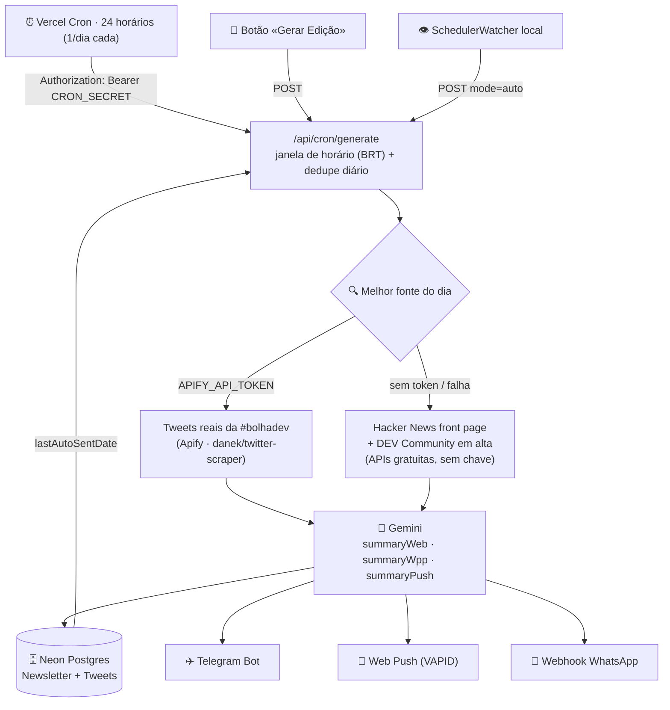

<div align="center">


**Newsletter inteligente de tecnologia: curadoria automática, resumo por IA e disparo multicanal — todo dia, sem você tocar em nada.**

[**🌐 Acessar o site**](https://bolhadev-digest-machado15.vercel.app) · [**✈️ Entrar no canal do Telegram**](https://t.me/bolhadev_digest)

[](https://bolhadev-digest-machado15.vercel.app)
[](https://bolhadev-digest-machado15.vercel.app)
[](https://t.me/bolhadev_digest)
[](https://nextjs.org)
[](https://www.typescriptlang.org)
[](https://www.prisma.io)
[](https://neon.tech)
[](https://vercel.com/docs/cron-jobs)
[](https://ai.google.dev)
[](https://core.telegram.org/bots/api)
[](https://tailwindcss.com)
[](#-leitor-web-pwa)

Uma edição diária · três resumos gerados por IA · **Telegram, WhatsApp e Push** · leitor PWA

</div>

---

## ✨ Por que este projeto?

- 🤖 **100% automático** — um cron server-side na Vercel gera e envia a edição todo dia no horário que você escolher, mesmo com o navegador fechado e o computador desligado.
- 🧠 **Resumo com IA** — o Gemini transforma os destaques do dia em **três formatos**: Markdown para o leitor web, texto compacto para WhatsApp e uma frase de impacto para notificação push.
- 📡 **Disparo multicanal com resultado real** — Telegram, Web Push e webhook de WhatsApp respondem **cada um com seu status**: nada de "sucesso" falso.
- 🔐 **Cron protegido** — o endpoint de geração exige `Authorization: Bearer $CRON_SECRET` (a Vercel injeta o header automaticamente) e tem **dedupe diário**: no máximo uma edição por dia.
- 🗄️ **Postgres serverless** — Neon (free tier) com pool de conexões, pronto para produção.
- 📱 **Leitor PWA** — instala no celular/desktop, tema escuro, histórico das edições.
- 🔌 **Fontes em camadas, sem conteúdo inventado** — tweets reais da **#bolhadev** via Apify quando você configura o token; senão, destaques **reais e gratuitos** de Hacker News + DEV Community; se tudo falhar, a edição sai sem os cards — nunca com dados falsos. **Tudo passa por um filtro de autopromoção/anúncio** (autores bloqueados, termos de spam e limite de itens por autor) — inclusive no fallback sem IA.

## 🏗️ Arquitetura



## 📦 Stack

| Camada | Tecnologia |
|---|---|
| Frontend & PWA | Next.js 16 (App Router, Turbopack), React 19, Tailwind CSS 4, Lucide Icons |
| Linguagem | TypeScript 5 (strict) |
| Banco & ORM | **Neon Postgres** + Prisma 6 |
| IA | Google Gemini (`gemini-3.6-flash`) com fallback offline baseado nos itens reais |
| Agendamento | Vercel Cron (24 jobs horários) + janela de horário e dedupe na rota |
| Canais | Telegram Bot API · Web Push (VAPID) · webhook de WhatsApp |
| Deploy | Vercel (build `prisma generate && next build`), GitHub auto-deploy |

## 🚀 Início rápido

```bash
# 1. Dependências
npm install

# 2. Banco (Postgres/Neon — crie uma database grátis em https://neon.tech)
npx prisma db push

# 3. Variáveis de ambiente (crie o .env a partir do exemplo)
cp .env.example .env

# 4. Desenvolvimento
npm run dev
```

Abra [http://localhost:3000](http://localhost:3000), entre pela **engrenagem** em Configurações (login do admin) e clique em **«Gerar Edição Agora»** na seção *Geração Manual* para ver a edição nascer. A home não expõe mais esse botão.

> ☁️ **Em produção:** [bolhadev-digest-machado15.vercel.app](https://bolhadev-digest-machado15.vercel.app) · ✈️ **Edições diárias:** canal [**@bolhadev_digest**](https://t.me/bolhadev_digest)

### 🧰 Scripts

| Comando | Descrição |
|---|---|
| `npm run dev` | Servidor de desenvolvimento |
| `npm run build` | `prisma generate` + build de produção |
| `npm run lint` | ESLint |
| `npx prisma studio` | GUI do banco |
| `node scripts/e2e-cron.mjs` | Teste E2E do cron (auth, envio real, dedupe) com limpeza automática |
| `node scripts/cleanup-test-data.mjs` | Remove edições de teste |
| `node scripts/migrate-sqlite-to-neon.mjs` | Migração ponta a ponta SQLite → Neon |

## ⚙️ Variáveis de ambiente

| Variável | Obrigatória | Descrição |
|---|---|---|
| `DATABASE_URL` | ✅ | String de conexão Postgres do **Neon** (use a *pooled*) |
| `GEMINI_API_KEY` | ✅ | Chave do [Google AI Studio](https://aistudio.google.com/) (free tier: 20 req/dia) |
| `CRON_SECRET` | ✅ (produção) | Segredo do cron — gere com `openssl rand -hex 32` |
| `TELEGRAM_BOT_TOKEN` | ✅ | Token do bot ([@BotFather](https://t.me/BotFather)) |
| `TELEGRAM_CHAT_ID` | ✅ | ID(s) de destino — aceita **vários separados por vírgula** (pessoal, grupo ou canal) |
| `ADMIN_USERNAME` / `ADMIN_PASSWORD` | ✅ | **Login do painel** (tela em `/settings` + cookie de sessão de 7 dias) — sem elas as rotas admin respondem `503` |
| `SCHEDULE_TIME` | ⭕ | Horário padrão do envio (ex.: `09:17`, fuso de Brasília) |
| `AUTO_SCHEDULE` | ⭕ | `true` ativa o agendamento automático |
| `APIFY_API_TOKEN` | ⭕ | **Tweets reais da #bolhadev** via [Apify](https://apify.com) (`danek/twitter-scraper` — free: 20/run, ~US$0,11/mês) |
| `CURATION_BLOCKLIST` / `CURATION_FILTER_TERMS` / `CURATION_MAX_PER_AUTHOR` | ⭕ | **Filtro de autopromoção/anúncios** da curadoria: autores bloqueados, termos de anúncio (default: `rmt`, `topidle`, `heroesfarm`, `mmorpg`, `sorteio`...) e máx. itens por autor por edição (default `2`) |
| `NEXT_PUBLIC_VAPID_PUBLIC_KEY` / `VAPID_PRIVATE_KEY` | ⭕ | Web Push — gere com `npx web-push generate-vapid-keys` |
| `WHATSAPP_WEBHOOK_URL` | ⭕ | Webhook que recebe o resumo de WhatsApp |

> As configurações salvas na UI (painel **Configurações**) prevalecem sobre as variáveis de ambiente.

## 🕐 Como o agendamento funciona

1. O `vercel.json` declara **24 jobs horários** (`0 H * * *`) — no plano Hobby cada job roda **uma vez por dia**, então um job por hora garante cobertura total.
2. A rota `GET /api/cron/generate` valida a **hora de Brasília** contra o `scheduleTime` e o **dedupe diário** (`lastAutoSentDate`) → **exatamente uma edição por dia**, na janela certa.
3. Autenticação: header `Authorization: Bearer $CRON_SECRET` (a Vercel envia sozinha quando a env var existe; chamadas sem token recebem `401`).
4. `POST /api/cron/generate` dispara manualmente pelo botão **Geração Manual** em `/settings` — **protegido pelo login do admin** (`src/proxy.ts`); a home não mostra mais esse chamado.

## 🔐 Segurança

- **Painel protegido** — a home expõe só a **engrenagem** (sem rótulo); ao clicar, `/settings` mostra a **tela de login** (usuário/senha) e, autenticado, o painel com botão **Sair**. O login (`POST /api/auth/login`) emite um **cookie httpOnly assinado com HMAC-SHA256 por 7 dias** (`src/lib/auth.ts`) e `src/proxy.ts` (proxy do Next 16) exige esse cookie em `POST/GET /api/settings*` e `POST /api/cron/generate`: sem sessão ninguém lê o bot token nem dispara edições. Fail-closed (`503`) se as envs `ADMIN_*` não existirem. Não há Basic Auth (popup do navegador).
- **Cron** — só o Vercel Cron autenticado com `CRON_SECRET` gera a edição automática.
- **Site público** — a home e as edições ficam abertos; segredos nunca aparecem lá.
- **Segredos no git** — `.env` ignorado desde o início, `.env.example` só com placeholders e token antigo de bot já revogado.

## 📡 Canais

- **✈️ Telegram** — bot próprio; envio para **um ou mais destinos separados por vírgula** (chat pessoal + grupo/canal — o bot precisa ser admin no canal) com *fallback* para texto puro se o Markdown falhar. **Canal oficial: [@bolhadev_digest](https://t.me/bolhadev_digest)** — é para lá que vai a edição diária.
- **🔔 Web Push** — botão **“Receber aviso”** no topo do site: qualquer visitante ativa a notificação diária no navegador (permissão + VAPID).
- **💬 WhatsApp** — POST para o seu webhook (Evolution API / Baileys) com o resumo formatado.
- **🧪 Teste sem disparar tudo** — o painel de Configurações tem botão de teste por canal (`POST /api/settings/test`).

## 🗂️ Estrutura

```
src/
├── proxy.ts                 # Exige cookie de sessão nas rotas admin (Next 16)
├── app/
│   ├── page.tsx              # leitor da edição + cards de destaque
│   ├── settings/             # login do admin OU painel: horário, canais, teste, geração manual
│   └── api/
│       ├── auth/             # login · session · logout (cookie de 7 dias)
│       ├── cron/generate/    # GET (cron, protegido) · POST (manual, login admin)
│       ├── settings/         # configurações + teste por canal (login admin)
│       └── push/             # inscrição de Web Push (pública)
├── components/               # GenerateButton · LoginForm · SettingsPanel · LogoutButton · PushSubscribeButton · SchedulerWatcher
└── lib/
    ├── twitter.ts            # fontes em camadas: Apify → HN + DEV → vazio
    ├── ai.ts                 # Gemini + fallback real sem IA
    ├── notifier.ts           # Telegram (multi-destino) · Push · WhatsApp
    ├── settings.ts           # config: banco primeiro, env como fallback
    ├── auth.ts               # sessão HMAC do painel (login/senha do admin)
    └── prisma.ts
prisma/schema.prisma          # Newsletter · Tweet · Settings · PushSubscription
public/sw.js                  # Service Worker vanilla (push + cache PWA)
vercel.json                   # 24 crons horários
scripts/                      # e2e-cron · cleanup · migração SQLite→Neon
```

## 🚢 Deploy

O repositório está conectado à Vercel: **`git push` no `main` deploya sozinho**.

1. Crie o projeto na Vercel e configure as variáveis acima (Environment Variables → **Production**).
2. Garanta que **Settings → Deployment Protection** está desligado para *Production* (senão o site e o cron caem na página de login da Vercel).
3. Confirme os crons em **Settings → Cron Jobs** (o botão *Run* permite um teste manual) — os logs de cada execução ficam em **Observability**.

## 📄 Licença

[MIT](./LICENSE) © heliomachado-dev — use, estude e distribua livremente.

---

<div align="center">
<sub>BolhaDev Digest · feito com Next.js, Prisma, Neon, Gemini e muito ☕</sub>
</div>
