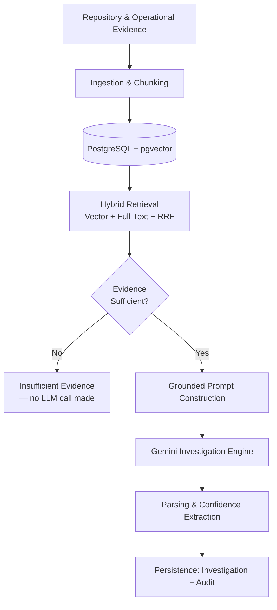

<div align="center">

# IncidentWeave

**Repository-aware AI incident investigation platform for backend systems.**

**Phases: 9/9 complete · Tests: 41 passing · Endpoints: 4 routes (3 API + health) · Real bugs found & fixed across development: 6+**

[](https://github.com/iamswayam/incidentweave/actions/workflows/ci.yml)


IncidentWeave investigates production incidents by combining repository context, operational evidence, hybrid retrieval, and evidence-grounded AI investigation — built incrementally, with database verification throughout and live Gemini verification beginning when embeddings and investigation generation are introduced.

[Architecture](#architecture) • [Tech Stack](#technology-stack) • [Getting Started](#local-development) • [Engineering Log](#engineering-documentation) • [Roadmap](#roadmap)


</div>

---

## Table of Contents

- [Project Status](#project-status)
- [Why This Project](#why-this-project)
- [Architecture](#architecture)
- [Technology Stack](#technology-stack)
- [Database](#database)
- [Project Structure](#project-structure)
- [Local Development](#local-development)
- [Testing](#testing)
- [Continuous Integration](#continuous-integration)
- [Engineering Principles](#engineering-principles)
- [V1 Scope Discipline](#v1-scope-discipline)
- [Engineering Documentation](#engineering-documentation)
- [Roadmap](#roadmap)
- [Current Verification](#current-verification)

---

## Project Status

| Phase | Description | Status |
|---|---|---|
| 1 | Project Setup | ✅ Complete |
| 2 | Database & Persistence | ✅ Complete |
| 3 | Repository Ingestion & Chunking | ✅ Complete |
| 4 | Embeddings & Retrieval | ✅ Complete |
| 5 | Investigation Engine | ✅ Complete |
| 6 | Grounding & Confidence | ✅ Complete |
| 7 | Controlled Tools & Audit | ✅ Complete |
| 8 | Evaluation | ✅ Complete |
| 9 | Production CLI / API | ✅ Complete |

**Current milestone: Phase 9 complete.** This is the last phase on the current roadmap.

<details>
<summary><strong>Phases 1-3 — Foundation (Setup, Database, Ingestion)</strong></summary>
<br>

### Phase 1 — Project Setup

- FastAPI application with a health endpoint
- Docker Compose environment (PostgreSQL + pgvector)
- Environment configuration via Pydantic Settings
- pytest and Ruff tooling
- GitHub Actions CI

### Phase 2 — Database & Persistence

- SQLAlchemy 2.x async integration
- Alembic migrations, version-controlled from the first commit
- Centralized ORM models: `Repository`, `Chunk`, `Investigation`, `Audit`
- `VECTOR(768)` embedding storage via pgvector
- Real PostgreSQL integration tests — no mocked database layer

### Phase 3 — Repository Ingestion & Chunking

- Local repository ingestion script with fixed-size, overlapping line-window chunking
- Idempotent re-ingestion (safe to re-run against the same repository)
- Tool/cache/VCS directory exclusion, tuned after catching real corpus pollution during development

</details>

<details>
<summary><strong>Phase 4 — Embeddings & Retrieval</strong></summary>
<br>

- Gemini embeddings (`gemini-embedding-001`), explicit 768-dimensional output
- Vector similarity search via pgvector cosine distance
- PostgreSQL full-text search over chunk content
- Hybrid retrieval via Reciprocal Rank Fusion (RRF), verified against hand-computed arithmetic on real queries

</details>

<details>
<summary><strong>Phase 5 — Investigation Engine</strong></summary>
<br>

- Evidence-grounded prompt construction from hybrid retrieval results
- Gemini text generation (`gemini-3.5-flash-lite`) with timeout, bounded retry/backoff, and fail-loud error handling
- Response parsing: categorical confidence extraction, citation matching against retrieved evidence
- **Evidence-sufficiency guard**: a query is only sent to Gemini if retrieval clears both an RRF threshold *and* a raw vector-distance threshold — a single-signal check was found to produce false positives on unrelated queries during testing, and was hardened accordingly
- Full persistence: one `Investigation` row plus one `Audit` row per query, carrying retrieval scores and evidence IDs
- End-to-end CLI (`scripts/investigate.py`), verified against a real repository with a diagnosis independently cross-checked line-by-line against the actual retrieved source code

</details>

<details>
<summary><strong>Phase 6 — Grounding & Confidence</strong></summary>
<br>

- LangGraph orchestration with one bounded retry: insufficient initial evidence widens the search limit once (default 5 to 10), then returns insufficient evidence if the guard still fails
- Confidence calibration cross-checks the model's self-report against RRF and cosine-distance margins, downgrading borderline `high` confidence to `medium`
- Calibrated confidence is persisted consistently with the investigation and its single audit row
- Retry and calibration behavior covered by mocked graph tests; live retrieval and confidence outcomes recorded in the phase log

</details>

<details>
<summary><strong>Phase 7 — Controlled Tools & Audit</strong></summary>
<br>

- Added a local stdio MCP server exposing both `hybrid_search` and literal `grep_search` over raw Python source using the ingestion file exclusions; the graph calls `hybrid_search` in-process and calls only `grep_search` through MCP
- Added deterministic escalation: initial hybrid retrieval, one widened-limit retry, then MCP grep fallback; grep receives the full query as a case-insensitive literal string, and the model does not choose tools
- Persisted ordered tool parameters and outcomes in `Audit.tool_calls`, retaining one Audit row per investigation
- Verified the full fallback path against a real fixture and database audit record; no human approval gate was added

</details>

<details>
<summary><strong>Phase 8 — Evaluation</strong></summary>
<br>

- Measured vector-only, full-text-only, hybrid retrieval, guard decisions, and two end-to-end runs against a pinned 70-chunk source snapshot.
- The 24-question set has 8 direct, 8 paraphrased, 4 unanswerable-far, and 4 unanswerable-near questions. Source labels are checked against snapshot files and reachable indexed chunks; the set remains pending maintainer review.
- Reproduce with the command shown by `--help`: `\.venv\Scripts\python.exe scripts\run_eval.py`.
- Retrieval (16 answerable questions): vector and hybrid each hit `8/16` at 1, `11/16` at 3, and `11/16` at 5; full-text was empty for `14/16`.
- Guard (24 questions): `16` true accepts, `0` false refusals, `4` true refusals, and `4` false accepts. No tested vector cutoff separated the answerable and unanswerable groups.
- End to end (24 questions per run): run 1 had `15` correct, `1` wrong-or-incomplete, `4` refused, and `4` falsely answered; run 2 had `14`, `2`, `4`, and `4`. One outcome changed between runs; there were `40` generation HTTP calls, `0` HTTP 429 responses, and `0` errors.
- Tests: `32 passed`.

**Limits:** This 24-question evaluation covers one pinned source snapshot and is diagnostic for that corpus, not a benchmark for other repositories. The labels remain pending maintainer review and were drafted from the indexed source. Keyword checks can accept an incorrect answer or reject a correct paraphrase, and no LLM judge was used.

</details>

<details>
<summary><strong>Phase 9 — Production CLI / API</strong></summary>
<br>

- Added `POST /investigations` for synchronous persisted investigations, `GET /investigations/{id}` for stored investigation/audit data, and `GET /repositories` for total and embedded chunk counts. `/health` remains open.
- Investigation responses include evidence scores and a fixed note describing Phase 8's measured uncertainty instead of hiding it. Historical GET responses report `raw_confidence: null` because the existing database schema does not store the raw label.
- On Windows, use the permanent `scripts/serve.py` launcher. It supplies a `SelectorEventLoop` before Uvicorn starts; Uvicorn's default Windows `ProactorEventLoop` is selected before importing the app and is unsupported by psycopg's async driver.
- API protection limitation: “This is NOT production-grade authentication (no user accounts, no key rotation, no per-user quotas); real auth remains deferred.”
- Rate-limit limitation: “The limiter is in memory: its counters reset on restart and are not shared across multiple workers or instances.”
- Updated the Docker image to include `scripts/`, `alembic.ini`, and `migrations/`, resolving the missing-runtime-files gap recorded in Phase 1.
- Automated test suite: `41 passed` in the fresh full run against the healthy PostgreSQL service.

</details>

---

## Why This Project

Most RAG demos stop at "retrieval works." IncidentWeave is built around a stricter standard: **evidence before generation, always**.

- The system will not call the LLM at all if retrieval evidence is weak — this guard was tightened after a real false positive was caught during manual testing, not assumed to be correct from design alone.
- Every investigation is fully auditable: retrieval scores, cited evidence, and the raw model response are persisted together.
- Phases 4-9 were verified with live PostgreSQL retrieval/investigation data and live Gemini calls where those phases require them; Phases 1-3 used the verification appropriate to setup, schema, ingestion, and CI. The full debugging history, including real bugs found and fixed, is kept in [`docs/`](#engineering-documentation) rather than smoothed over.

---

## Architecture



Each subsystem is introduced only when the roadmap requires it — see [V1 Scope Discipline](#v1-scope-discipline).

---

## Technology Stack

| Category | Technologies |
|---|---|
| **Backend** | Python 3.12+, FastAPI, Pydantic Settings, Uvicorn |
| **Persistence** | PostgreSQL, pgvector, SQLAlchemy 2.x (async), Psycopg 3, Alembic |
| **AI & Retrieval** | Gemini Embeddings, Gemini Generation, LangGraph, MCP, pgvector cosine search, PostgreSQL Full-Text Search, Reciprocal Rank Fusion |
| **Development & Quality** | Docker, Docker Compose, pytest, Ruff, GitHub Actions |
| **API** | FastAPI endpoints, shared-secret header, in-memory per-IP rate limit |

---

## Database

Four core models back the persistence layer:

| Model | Purpose |
|---|---|
| `Repository` | One row per ingested codebase |
| `Chunk` | Code/log/runbook evidence, `VECTOR(768)` embedding column |
| `Investigation` | One row per query: response, model, latency, token usage, confidence |
| `Audit` | One row per investigation: retrieval scores, cited evidence, full tool-call trace |

The `vector` extension and full schema are managed through version-controlled Alembic migrations — no manual database changes.

---

## Project Structure

```text
incidentweave/
├── app/
│   ├── db/
│   │   ├── models/
│   │   │   ├── audit.py
│   │   │   ├── chunk.py
│   │   │   ├── investigation.py
│   │   │   └── repository.py
│   │   ├── base.py
│   │   └── session.py
│   ├── retrieval/
│   │   ├── vector_search.py
│   │   ├── fulltext_search.py
│   │   └── hybrid_search.py
│   ├── investigation/
│   │   ├── prompt.py
│   │   ├── generation.py
│   │   ├── parsing.py
│   │   ├── guard.py
│   │   ├── confidence.py
│   │   ├── graph.py
│   │   ├── mcp_server.py
│   │   └── persistence.py
│   ├── api.py
│   ├── api_security.py
│   └── main.py
│
├── scripts/
│   ├── ingest_repo.py
│   ├── embed_chunks.py
│   ├── search_repo.py
│   ├── investigate.py
│   ├── serve.py
│   └── run_eval.py

├── evaluation/
│   ├── golden_set.json
│   ├── golden.py
│   ├── corpus.py
│   ├── metrics.py
│   └── runner.py
│
├── migrations/
│   └── versions/
│
├── tests/
│   ├── integration/
│   ├── fixtures/
│   └── unit/
│
├── docs/
│   ├── README.md
│   ├── phase1-project-setup.md ... phase9-production-api.md
│   ├── later-optimizations.md
│   └── learning/
│       ├── README.md
│       ├── 00-template.md
│       └── 01-project-setup.md ... 09-production-api.md
│
├── .github/workflows/
├── alembic.ini
├── docker-compose.yml
├── pyproject.toml
└── README.md
```

Repository ingestion is implemented as standalone scripts in `scripts/`, not as an `app/ingestion/` module — a deliberate deviation from the original planned structure.

---

## Local Development

```bash
# 1. Create and activate a virtual environment
python -m venv .venv
.venv\Scripts\Activate.ps1   # Windows

# 2. Install the project
pip install -e ".[dev]"

# 3. Configure environment variables
Copy-Item .env.example .env   # then set GEMINI_API_KEY; never commit .env

# GEMINI_API_KEY is required by embedding and investigation generation.
# scripts/embed_chunks.py and app/investigation/generation.py read it from
# the process environment with os.getenv; those paths do not load .env
# themselves, so set the variable before running the commands below.

# 4. Start Postgres + pgvector
docker compose up -d db

# 5. Apply migrations
alembic upgrade head

# 6. Run the API on Linux/macOS
uvicorn app.main:app --reload
```

On Windows, run `python scripts\serve.py` instead. Uvicorn chooses its
Windows `ProactorEventLoop` before importing the app, and psycopg's async
driver does not support that loop; this launcher selects a `SelectorEventLoop`.

Health check: `GET /health`

## API Usage

Set `API_PROTECTION_SECRET` in the server environment and send it in the
`X-API-Secret` header. The examples below use the actual Checkpoint 9
`incidentweave-local` request and saved investigation ID 23; the POST body
and response are from the real live request. The POST was issued by Python
`urllib` during the live check, so its equivalent `curl.exe` command is shown
without claiming that command itself produced the response. GET bodies are
from actual `curl.exe` requests. No secret value is included here.

```powershell
$env:API_PROTECTION_SECRET = "<your shared secret>"
curl.exe --include -X POST "http://127.0.0.1:8000/investigations" `
    -H "Content-Type: application/json" `
    -H "X-API-Secret: $env:API_PROTECTION_SECRET" `
    --data-raw '{"repository_name":"incidentweave-local","query":"What chunk size does repository ingestion use?","limit":5}'
```

Actual POST response body:

```json
{
    "investigation_id": 23,
    "repository_name": "incidentweave-local",
    "query": "What chunk size does repository ingestion use?",
    "diagnosis": "Repository ingestion uses a chunk size of 60 lines (`CHUNK_SIZE = 60`) with an overlap size of 10 lines (`OVERLAP_SIZE = 10`), as defined in `scripts/ingest_repo.py`.",
    "confidence": "medium",
    "raw_confidence": "high",
    "cited_chunk_ids": ["1334", "1333", "1335"],
    "evidence_check": {
        "is_sufficient": true,
        "reason": "Evidence strength meets the RRF and vector-distance requirements.",
        "best_rrf_score": 0.01639344262295082,
        "best_vector_score": 0.319359047097336
    },
    "retry_used": false,
    "tool_calls": [
        {
            "tool": "hybrid_search",
            "stage": "initial",
            "parameters": {
                "repository_name": "incidentweave-local",
                "query": "What chunk size does repository ingestion use?",
                "limit": 5
            },
            "outcome": {
                "result_count": 5,
                "sufficient": true,
                "reason": "Evidence strength meets the RRF and vector-distance requirements.",
                "best_rrf_score": 0.01639344262295082,
                "best_vector_score": 0.319359047097336
            }
        }
    ],
    "model": "gemini-3.5-flash-lite",
    "latency_ms": 1341,
    "evaluation_note": "Phase 8 evaluated 24 questions on one source snapshot: hybrid tied vector-only (hit@1 8/16, hit@3 and hit@5 11/16, MRR 0.573), the guard had 4 false accepts, and no tested vector-distance cutoff separated the groups. These results are diagnostic, not a benchmark; see docs/phase8-evaluation.md for limits."
}
```

```powershell
curl.exe --include -H "X-API-Secret: $env:API_PROTECTION_SECRET" `
    http://127.0.0.1:8000/investigations/23
```

Actual GET response body:

```json
{"investigation_id":23,"repository_name":"incidentweave-local","query":"What chunk size does repository ingestion use?","diagnosis":"Repository ingestion uses a chunk size of 60 lines (`CHUNK_SIZE = 60`) with an overlap size of 10 lines (`OVERLAP_SIZE = 10`), as defined in `scripts/ingest_repo.py`.","confidence":"medium","raw_confidence":null,"cited_chunk_ids":["1334","1333","1335"],"evidence_check":{"is_sufficient":true,"reason":"Evidence strength meets the RRF and vector-distance requirements.","best_rrf_score":0.01639344262295082,"best_vector_score":0.319359047097336},"retry_used":false,"tool_calls":[{"tool":"hybrid_search","stage":"initial","outcome":{"reason":"Evidence strength meets the RRF and vector-distance requirements.","sufficient":true,"result_count":5,"best_rrf_score":0.01639344262295082,"best_vector_score":0.319359047097336},"parameters":{"limit":5,"query":"What chunk size does repository ingestion use?","repository_name":"incidentweave-local"}}],"model":"gemini-3.5-flash-lite","latency_ms":1341,"evaluation_note":"Phase 8 evaluated 24 questions on one source snapshot: hybrid tied vector-only (hit@1 8/16, hit@3 and hit@5 11/16, MRR 0.573), the guard had 4 false accepts, and no tested vector-distance cutoff separated the groups. These results are diagnostic, not a benchmark; see docs/phase8-evaluation.md for limits."}
```

```powershell
curl.exe --include -H "X-API-Secret: $env:API_PROTECTION_SECRET" `
    http://127.0.0.1:8000/repositories
```

Actual repository response body:

```json
[{"name":"dexterai","chunk_count":774,"embedded_chunk_count":0},{"name":"incidentweave","chunk_count":48,"embedded_chunk_count":0},{"name":"incidentweave-eval","chunk_count":70,"embedded_chunk_count":70},{"name":"incidentweave-local","chunk_count":72,"embedded_chunk_count":70}]
```

## Usage

```powershell
python scripts\ingest_repo.py <repo_path> <repo_name>
python scripts\embed_chunks.py <repo_name>
python scripts\investigate.py <repo_name> "<query>" --limit 5 --repo-path <repo_path>
```

The ingestion command stores Python source chunks. The embedding command
requires `GEMINI_API_KEY` in the process environment. The investigation
command uses the same key for Gemini generation and accepts `--limit` and
`--repo-path` for retrieval breadth and the literal grep fallback.

---

## Testing

```bash
pytest                    # full suite
pytest tests/unit         # unit tests only
pytest tests/integration  # requires a running PostgreSQL + pgvector instance
ruff check .              # static analysis
```

Integration tests validate real PostgreSQL connectivity, the `vector` extension, `VECTOR(768)` support, and ORM relationships — nothing is mocked at the database layer.

---

## Continuous Integration

GitHub Actions runs on every push and pull request:

1. Python 3.12 setup
2. Dependency install (`pip install -e ".[dev]"`)
3. Ruff checks
4. PostgreSQL + pgvector service startup and health verification
5. `alembic upgrade head`
6. Full test suite
7. Docker image build

The integration checks run against a real Postgres+pgvector service container;
unit tests use fakes or mocks where appropriate.

---

## Engineering Principles

- Incremental, phase-based implementation
- Evidence-first investigation — retrieval before generation, always
- Explicit grounding and confidence, never a silent guess
- Automated verification before any phase is marked complete
- Thin API/CLI boundaries; business logic stays out of transport layers
- No premature infrastructure or abstraction

---

## V1 Scope Discipline

V1 deliberately excludes: Redis/Celery, S3, Vision AI, Kubernetes, Elasticsearch, Pinecone, Weaviate, and authentication — introduced only when a later phase actually requires them, not in anticipation of needing them. LangGraph was deliberately adopted in Phase 6 for bounded retry branching. MCP was deliberately adopted in Phase 7 to exercise a real stdio client/server boundary and tool schema; a direct function call would be simpler for this single process, so MCP is used here specifically for protocol integration experience, not because it is required by the application architecture.

---

## Engineering Documentation

Every phase has two levels of documentation, kept deliberately separate:

- **[`docs/phaseN-*.md`](docs/)** — the full build log: task specs, real bugs found, real fixes, real command output. This is the working history, warts included.
- **[`docs/learning/`](docs/learning/)** — condensed, interview-ready writeups: what was built, why, and the key concept explained plainly.

Phase 4-9 logs were written during development; Phase 1-3 logs and the
learning writeups were reconstructed afterward and are marked as such.

---

## Roadmap


**Completed:** Phases 1 through 9
**Next:** None. Phase 9 is the last phase on the current roadmap.

---

## Current Verification

```text
Ruff                      PASS
PostgreSQL                PASS
pgvector                  PASS
Alembic migration         PASS
VECTOR(768)               PASS
SQLAlchemy persistence    PASS
Test suite                41 passed (fresh full run against healthy PostgreSQL)
Real ingestion run        PASS (Phase 4 baseline: 23 files, 31 chunks; tool/cache dirs excluded)
Real Gemini embedding     PASS (Phase 4 baseline: 31 chunks embedded; 768-dim vectors confirmed)
Real hybrid search        PASS (RRF arithmetic independently verified)
Real investigation run    PASS (diagnosis cross-checked line-by-line against
                           retrieved source; evidence guard verified against
                           both a real answerable and a real nonsense query)
GitHub Actions            PASS
```

One non-blocking FastAPI/Starlette `httpx` deprecation warning is present in the test output.

---

<div align="center">

*A personal backend/AI engineering portfolio project.*
**[@iamswayam](https://github.com/iamswayam)**

</div>
