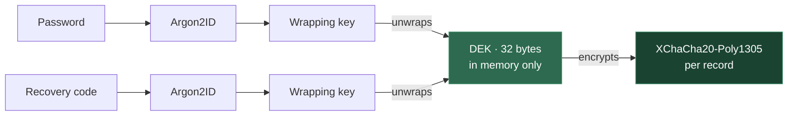

[](LICENSE)
[](https://www.python.org/)

> A local-first journaling environment that makes continuity visible.
> Write in daily pages. A model running on your machine produces day openings, recaps, and reflective responses.
> It's not a chat wrapper, but a navigable archive built around time and return.

**See it in action at [welcome.llamora.app](https://welcome.llamora.app).**


---

## Table of Contents

- [Design Philosophy](#design-philosophy)
- [Features](#features)
- [Screenshots](#screenshots)
- [Quick Start](#quick-start)
- [Try the Demo](#try-the-demo)
- [Stack](#stack)
- [Configuration](#configuration)
- [Development](#development)
- [Production](#production)
- [Limitations](#limitations)

---

## Design Philosophy

Llamora is organised around time, not conversation sessions. The primary navigation is a calendar. Entries are anchored to dates, not threads.

Many AI interfaces are built around an ongoing back-and-forth. Here, the model is part of a daily flow: it opens each day, can respond to entries, and suggests traces. Those suggestions are optional. When kept, they become part of the archive — not temporary output. Over time, both your writing and the model's contributions accumulate in the same log.

**Privacy is structural.** A diary is a personal artifact with strong security expectations. You don't expect it to send data elsewhere, depend on a remote service, or expose its contents by default. In Llamora, the model runs on your machine and the archive stays there, locked behind a key. The application makes no outbound requests — no telemetry, no analytics, no phoning home.

**No evaluation.** The model can respond and suggest traces, but it does not score entries, infer traits, or generate behavioural profiles. Nothing is surfaced as an assessment. The record is yours to interpret.

**Traces** are lightweight labels proposed by the model to make later return easier. They let you see where something recurs, what it tends to appear alongside, and which entries it touches.

---

## Features

- **Daily pages** — a new page opens each day. You write; the model responds only when asked. The exchange becomes part of a persistent, date-anchored record.

- **Day openings** — the model generates a short opening each morning, drawing on recent entries and a digest of the previous day.

- **Traces** — after each exchange, the model suggests lightweight tags. Kept traces accumulate in a dedicated view: frequency over time, co-occurrence, chronological history, model-generated summaries, and a year-long activity heatmap. Attach traces as context for future responses.

- **Search** — find past entries by meaning, not just exact words. Search tries to be semantic, not only how you phrased it, and returns ranked results across your entire journal.

- **Calendar navigation** — all dates with entries appear in a navigable calendar. Jump to any date to load its page.

- **Encryption at rest** — all stored content is encrypted before it reaches the database. Your password unwraps a per-user key that exists only in memory for the duration of the session — plaintext is never written to disk, session storage, or local storage. Entries, responses, embeddings, tags, and search queries are all covered.

---

## Screenshots

<details>
<summary><strong>Diary view</strong> — daily page with entries and model responses</summary>


</details>

<details>
<summary><strong>Respond</strong> — model response detail</summary>


</details>

<details>
<summary><strong>Edit entries</strong></summary>


</details>

<details>
<summary><strong>Traces</strong> — tag overview with frequency and co-occurrence</summary>


</details>

<details>
<summary><strong>Search</strong> — semantic + phrase search across all entries</summary>


</details>

<details>
<summary><strong>Trace detail</strong> — history and summary for a single trace</summary>


</details>

<details>
<summary><strong>Trace popover</strong></summary>


</details>

<details>
<summary><strong>Calendar</strong></summary>


</details>

More screenshots in [`doc/screenshots/`](doc/screenshots/).

---

## Quick Start

**Requirements:** [uv](https://docs.astral.sh/uv/) and a running [llama.cpp](https://github.com/ggerganov/llama.cpp) server.

### 1. Start a local model

```bash
llama-server \
  -hf unsloth/Qwen3-4B-Instruct-2507-GGUF \
  --port 8081 -c 40000 --jinja
```

Qwen3 4B Instruct is the current baseline; `-c 40000` gives it room for a day's entries and their context. Weights are downloaded on first run. The `--jinja` flag is required for chat-template rendering. Any instruction-tuned model works — see the [bartowski recommended small models](https://huggingface.co/collections/bartowski/recommended-small-models) for alternatives.

### 2. Install and run

```bash
uv sync
LLAMORA_LLM__UPSTREAM__HOST=http://127.0.0.1:8081 uv run llamora-server dev
```

Open [http://localhost:5000](http://localhost:5000) and register an account. The database is created automatically.

---

## Try the Demo

A pre-generated database ships with the repo (`data/demo_data.sqlite3.lzma`) — simulated entries, responses, and traces from January 2025 to February 2026. This is the fastest way to explore the interface.

```bash
# Extract the demo database
uv run python scripts/extract_demo_db.py

# Start with demo data
LLAMORA_DATABASE__PATH=data/demo_data.sqlite3 \
LLAMORA_LLM__UPSTREAM__HOST=http://127.0.0.1:8081 \
uv run llamora-server dev
```

Log in with `demo_user` / `demo_user_test_password12345!`

---

## Stack

| Layer | Technology |
| --- | --- |
| **Backend** | Async Python ([Quart](https://quart.palletsprojects.com/)), SSE streaming, [Dynaconf](https://www.dynaconf.com/) config, [uv](https://docs.astral.sh/uv/), [Ruff](https://docs.astral.sh/ruff/) for lint/format |
| **Frontend** | [HTMX](https://htmx.org/) + server-rendered HTML fragments + [Web Components](https://developer.mozilla.org/en-US/docs/Web/API/Web_Components). No JS framework. [esbuild](https://esbuild.github.io/) for bundling. [Biome](https://biomejs.dev/) for lint/format |
| **Storage** | SQLite, no ORM, incremental migrations |
| **Encryption** | [libsodium](https://doc.libsodium.org/) via PyNaCl — per-user symmetric DEK, password-derived wrapping + recovery code |
| **Inference** | Any [OpenAI-compatible](https://platform.openai.com/docs/api-reference/chat) `/v1/chat/completions` endpoint (default: [llama.cpp](https://github.com/ggerganov/llama.cpp)) |
| **Embeddings** | [bge-small-en-v1.5](https://huggingface.co/BAAI/bge-small-en-v1.5) via FastEmbed + [HNSWlib](https://github.com/nmslib/hnswlib) ANN |

<details>
<summary><strong>Encryption design</strong></summary>

All content is encrypted at the application layer before it reaches the database. The server decrypts in memory to serve pages and run inference, but nothing is ever stored or logged in plaintext.

**Key hierarchy:**



- A random 32-byte **data-encryption key (DEK)** is generated at registration.
- The DEK is wrapped twice — once with the password, once with a recovery code — and only the wrapped forms are stored.
- At login the password unwraps the DEK into memory. Depending on the storage mode, it is either kept server-side in encrypted SQLite or sent to the browser in an encrypted cookie.
- Key material is zeroised on logout and session expiry.

**What is encrypted:**

| Data | Encrypted | Visible to server |
| --- | --- | --- |
| Entries & responses | XChaCha20-Poly1305 + AAD | Ciphertext, timestamps, role |
| Embeddings | XChaCha20-Poly1305 + AAD | Ciphertext only |
| Tag names | XChaCha20-Poly1305 + AAD | Deterministic hash (for grouping) |
| Search queries | XChaCha20-Poly1305 + AAD | Deterministic hash (for dedup) |
| Images | Own key per image (wrapped by the DEK), libsodium secretstream on disk | File sizes, which entry, timestamps |
| Image filenames & dimensions | XChaCha20-Poly1305 + AAD | Ciphertext only |
| Passwords | Argon2ID hash | Non-reversible hash |

Each record carries its own random nonce and authenticated additional data (AAD) binding it to the user and entry, preventing ciphertext reuse across contexts.

**Images** (JPEG, PNG, WebP, GIF and HEIC from iPhones) are decoded and re-encoded before they are stored, so EXIF (including GPS location), colour profiles and anything appended to the file are dropped; the original upload is never kept. Each image is stored in three sizes (thumbnail, display, full) as WebP files under `IMAGES.path`, each encrypted in 64 KiB chunks with a random per-image key. Only that key, wrapped by the DEK, lives in the database, so a DEK rotation re-wraps keys without rewriting files. A file moved to another image, truncated or altered fails to decrypt.

**Digests** — each entry stores an HMAC-SHA256 digest derived from the DEK, entry ID, role, and plaintext. The server can compare digests for caching and deduplication without decrypting content.

**DEK rotation** — when triggered, a new DEK is generated. The old DEK is chain-encrypted under the new one, and all stored data — including digests — is incrementally re-encrypted. The process is resumable if interrupted.

</details>

---

## Configuration

Values are read in order: built-in defaults → `config/settings.local.toml` → `.env` → environment variables.

Environment variables use double-underscore separators for nesting (e.g. `LLAMORA_LLM__UPSTREAM__HOST`).

`config/settings.local.toml` is preferred for persistent overrides:

```toml
[default.LLM.upstream]
host = "http://127.0.0.1:8081"

[default.LLM.chat]
model = "local"

[default.LLM.generation]
temperature = 0.7
top_p = 0.8
```

<details>
<summary><strong>Using an external API</strong> (Nous, OpenAI, OpenRouter, …)</summary>

Point `upstream.host` at the provider and give it a `model` and an `api_key`. The key is sent as `Authorization: Bearer <key>`; the model as the `model` field of every request. For example, with Nous Research's inference API:

```bash
LLAMORA_LLM__UPSTREAM__HOST=https://inference-api.nousresearch.com \
LLAMORA_LLM__CHAT__API_KEY=sk-nous-... \
LLAMORA_LLM__CHAT__MODEL=qwen/qwen3.8-omni-flash \
LLAMORA_LLM__UPSTREAM__SKIP_HEALTH_CHECK=true \
uv run llamora-server dev
```

`SKIP_HEALTH_CHECK` is optional: `/health` and `/props` are llama.cpp extensions, and when a provider lacks them Llamora notices once and stops probing; `true` just skips the probe from the start.

The same in `config/settings.local.toml`, with the key kept in `config/.secrets.toml` (not committed):

```toml
# config/settings.local.toml
[default.LLM.upstream]
host = "https://inference-api.nousresearch.com"
skip_health_check = true  # optional

[default.LLM.chat]
model = "qwen/qwen3.8-omni-flash"
```

```toml
# config/.secrets.toml
[default.LLM.chat]
api_key = "sk-nous-..."
```

**Host or base URL, with or without `/v1`.** `upstream.host` is the server *root*; a trailing `/v1` is tolerated (`https://inference-api.nousresearch.com` and `https://inference-api.nousresearch.com/v1` are the same), and chat requests go to `<root>/v1/chat/completions`. If a provider documents an API base that doesn't follow that pattern, set `chat.base_url` to it exactly as documented instead — it is used as-is:

```bash
LLAMORA_LLM__CHAT__BASE_URL=https://generativelanguage.googleapis.com/v1beta/openai \
LLAMORA_LLM__CHAT__API_KEY=... \
LLAMORA_LLM__CHAT__MODEL=gemini-2.5-flash \
uv run llamora-server dev
```

The full rules live in [`src/llamora/llm/endpoints.py`](src/llamora/llm/endpoints.py).

**Images.** Replies to entries with photos can show the photos to the model, but a hosted API never receives them unless you ask: add `LLAMORA_LLM__VISION__ENABLED=true` when the provider's model can see images. Your photos are then sent to that provider with each reply.

</details>

<details>
<summary><strong>Protecting llama.cpp with an API key</strong></summary>

Start the server with a key and give Llamora the same one. It is sent as `Authorization: Bearer <key>` on every upstream call — chat requests and the `/health` and `/props` probes alike — and `model` is sent as the `model` field of each request:

```bash
llama-server --api-key sk-local-secret ...
```

```toml
# config/.secrets.toml
[default.LLM.chat]
api_key = "sk-local-secret"
```

```bash
# or via environment variables
LLAMORA_LLM__CHAT__API_KEY=sk-local-secret \
LLAMORA_LLM__CHAT__MODEL=my-model \
uv run llamora-server dev
```

</details>

All available sections and their defaults are documented inline in [`config/settings.toml`](config/settings.toml). llama.cpp-specific parameters (`top_k`, `mirostat`, etc.) can be passed via `LLM.chat.parameters`, but only keys in `LLM.chat.parameter_allowlist` are forwarded upstream.

<details>
<summary><strong>Images</strong></summary>

Images attached to entries are stored encrypted in a directory of their own, next to (not inside) the database:

```toml
[default.IMAGES]
path = "images"              # relative to the working directory, like DATABASE.path
max_upload_bytes = "20MiB"
max_per_entry = 8
pending_ttl = 86400          # seconds an upload may wait to be sent with an entry

[default.IMAGES.sizes]       # longest edge in pixels; never upscaled
thumb = 480
display = 2048
full = 4096
```

**Replies and images.** When replying, the model is shown the entry's images (and the day's most recent earlier ones, up to `max_images`, which defaults to the per-entry limit `IMAGES.max_per_entry`), shrunk to `max_edge` pixels, if it can see them. With the default `enabled = "auto"`, that means a llama.cpp server running a vision model (started with `--mmproj`); a hosted API gets images only with `enabled = true`. Images count towards the model's context (`tokens_per_image` each): when a reply doesn't fit, earlier images give way first, then earlier entries, and the entry's own images only if it can't fit with them. Images the model doesn't see are mentioned to it in text.

```toml
[default.LLM.vision]
enabled = "auto"   # "auto" | true | false
# max_images = 8     # unset: IMAGES.max_per_entry
tokens_per_image = 300  # prompt cost of one image (Gemma ~270; Qwen-VL grows with size)
max_edge = 1024
```

**Back up the images directory together with the database.** The files are useless without the database (their keys live there), and the database's images are gone without the files. Uploads that are never sent, and images of deleted entries, are removed by a periodic sweep (`sweep_interval`). The remaining options are in [`config/settings.toml`](config/settings.toml).

</details>

**Prompt templates** are Jinja2 files in `src/llamora/llm/templates` (`system.txt.j2`, `opening_system.txt.j2`, `opening_recap.txt.j2`). Edit them directly — no Python changes needed. Changes take effect on restart. Override the directory with `LLAMORA_PROMPTS__TEMPLATE_DIR`.

---

## Development

```bash
uv sync                                   # Install
uv run llamora-server dev                 # Run with live reload

uv run pyright                            # Type check
uv run ruff check && uv run ruff format   # Backend lint + format
biome check && biome format --write       # Frontend lint + format
```

Set `QUART_DEBUG=1` for Quart debug output. Add `--no-reload` to disable the file watcher.

**Frontend assets** — bundle the assets and watch for changes:

```bash
uv run python scripts/build_assets.py watch --mode dev
```

The server uses bundled outputs when `frontend/dist/manifest.json` exists. Remove `frontend/dist/` to revert.

**Vendored JS** — committed under `frontend/static/js/vendor/`, regenerated with:

```bash
pnpm install && pnpm vendor
```

**Tests** — end-to-end tests drive the app in a real browser (Playwright + pytest), simulating how a person uses it: registering, writing entries, streaming replies, navigating with back/forward, searching, tagging, the calendar, and the date logic (day openings, midnight rollover, time zones and server/client clock disagreement, using pinned browser and server clocks). Each run starts an isolated server with a temporary database and a fake OpenAI-compatible model, so no GPU, llama.cpp or local config is needed.

```bash
uv run playwright install chromium        # once: download the browser
uv run pytest tests/e2e -n 6              # full suite, 6 parallel workers (~1 min)
uv run pytest tests/e2e/test_diary.py     # one file
uv run pytest tests/e2e -k search         # tests matching a name
uv run pytest tests/e2e --headed --slowmo 300   # watch the browser
uv run pytest tests/e2e --e2e-no-build    # skip the prod asset build
```

Failing tests keep a Playwright trace and screenshot under `test-results/` (`uv run playwright show-trace test-results/<test>/trace.zip`), and the server log is attached to the failure report. Test servers derive keys with libsodium's minimum Argon2id cost (set `LLAMORA_TEST_REAL_KDF=1` to keep the real one); the key hierarchy and encryption are exercised the same way, but registering and logging in take milliseconds instead of seconds. Beyond `-n 6` there's little gain (each worker runs its own server and browser).

**Git hooks** — enable with `git config core.hooksPath .githooks` (pre-commit runs Ruff on staged Python files and Biome on staged JS/CSS files).

**Migrations** — applied automatically at startup. Manual inspection:

```bash
uv run python scripts/migrate.py status
uv run python scripts/migrate.py up
```

---

## Production

> **Caveat:** There is no two-factor authentication or admin interface. Keep this in mind before exposing Llamora beyond your local network.

### 1. Generate secrets

The shipped `SECRET_KEY` and `COOKIES.secret` are public defaults. Replace both before running outside development:

```bash
export LLAMORA_SECRET_KEY=$(openssl rand -base64 32)
export LLAMORA_COOKIES__SECRET=$(openssl rand -base64 32)
```

Or persist them in `config/.secrets.toml` (not committed):

```toml
[default]
SECRET_KEY = "..."

[default.COOKIES]
secret = "..."
```

### 2. DEK storage

After login the per-user data-encryption key (DEK) needs to be available on every request. There are two modes:

- **`session`** (default) — only an opaque session ID is sent to the browser; the DEK itself is encrypted and stored server-side in `ttl_store` (`dek_sessions`). Sessions expire after inactivity (sliding timeout, default 8 hours). Because `dek_sessions` are stored in SQLite, session mode works across workers. DEKs are cleared on application startup and shutdown, so logins do not survive restarts.
- **`cookie`** — the DEK is encrypted with `COOKIES.secret` and stored in an httpOnly cookie. The browser sends it back on each request. No database lookup is needed for DEK retrieval.

Llamora refreshes authenticated sessions on activity and logs users out after the configured inactivity window.

Switch to `cookie` if you prefer stateless DEK storage:

```toml
[default.CRYPTO]
dek_storage = "cookie"
```

Session inactivity and refresh behavior are configured separately:

```toml
[default.SESSION]
idle_ttl = 28800              # 8h inactivity logout
cookie_touch_interval = 300   # refresh cookie at most every 5m
csrf_ttl = 28800              # CSRF token lifetime
```

### 3. Build frontend assets

```bash
uv run python scripts/build_assets.py build --mode prod
```

### 4. Run

```bash
uv run llamora-server prod
```

---

## Limitations

- No two-factor authentication or captcha protection.
- No admin interface for managing users.
- Requires a running model server. A dedicated GPU makes a significant difference for inference speed.
- Model weights are several GB, downloaded by llama.cpp on first use. The embedding model (~130 MB) is downloaded separately.
- Output quality depends entirely on the model. Unreliable instruction-following produces poor results.
- Loss of both password and recovery code makes stored data **unrecoverable**.
- No content moderation or prompt filtering — personal use is assumed.

---

## License

[GPL-3.0](LICENSE)
