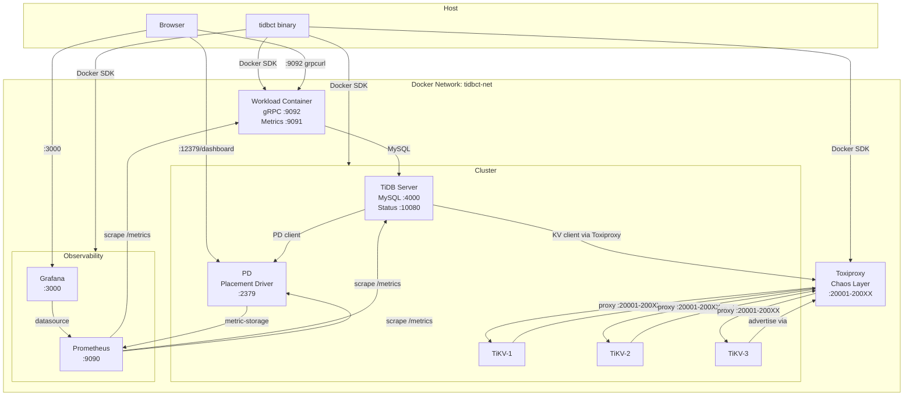
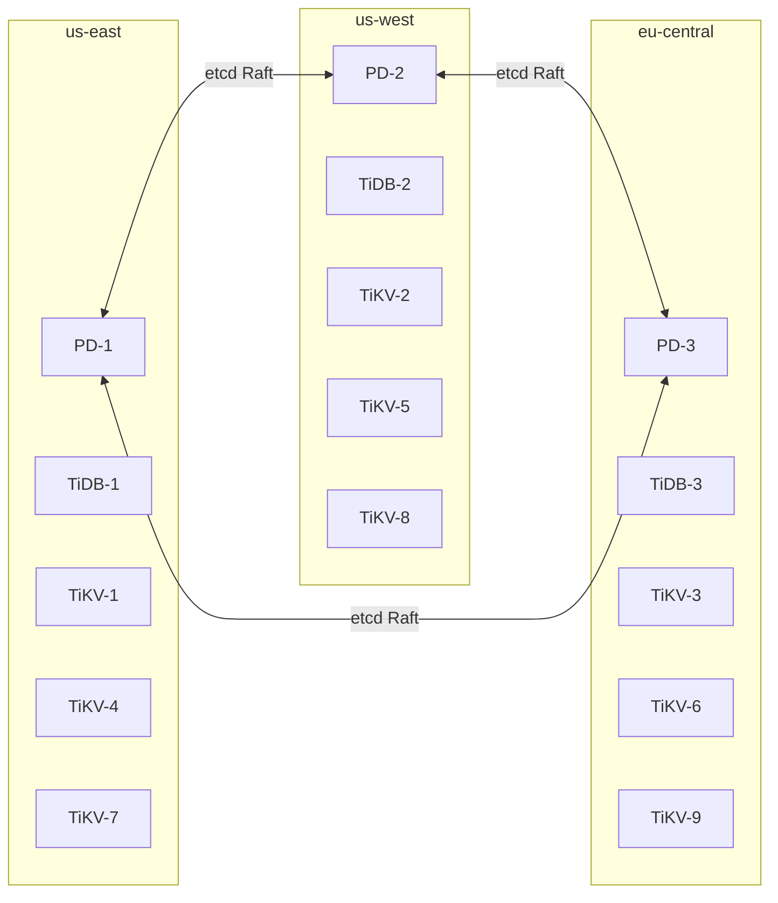
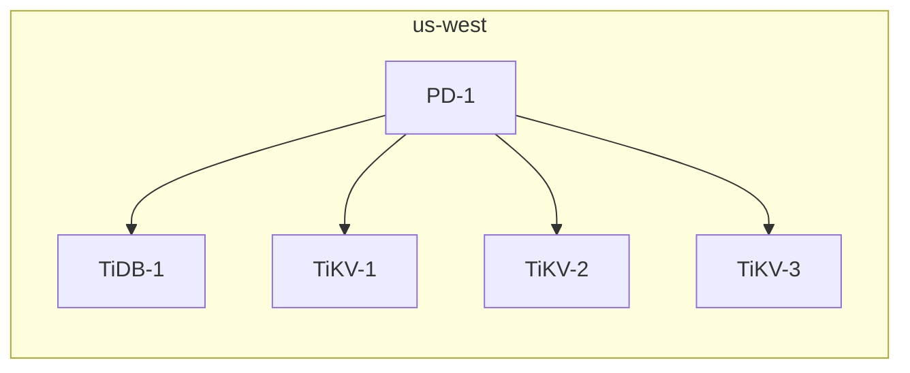
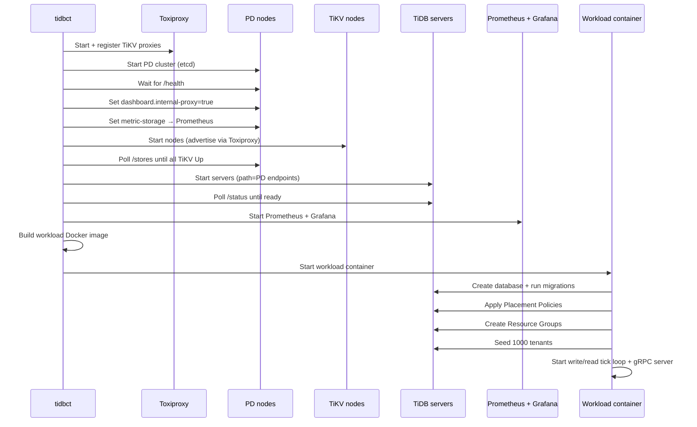
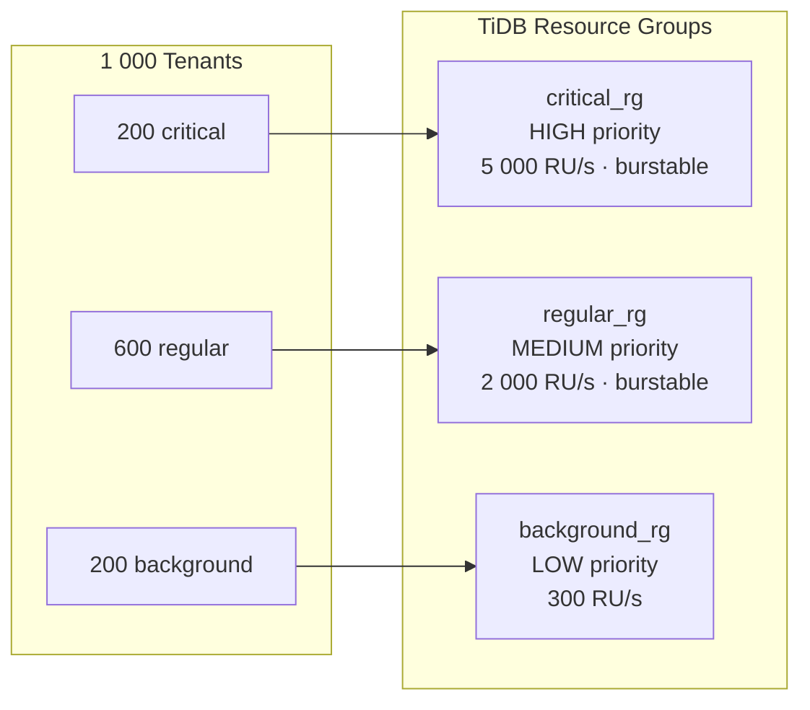
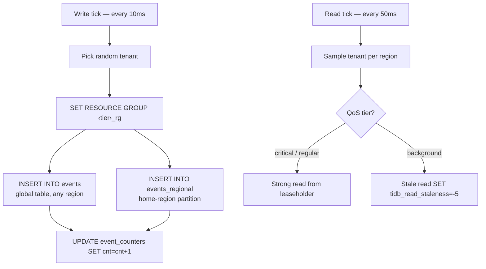

# tidbct — TiDB Cluster Testing Tool

A self-contained Go tool for spinning up TiDB clusters in Docker, driving a multi-tenant event audit workload, and injecting network chaos — all via a single binary with no shell scripts or docker-compose.

Demonstrates TiDB-specific features: **Placement Policies** for geo-partitioned data, **Resource Groups** for QoS isolation, **TiDB Stale Read** for background-tier queries, and **TiDB Dashboard** with live observability.

---

## Architecture



**Key design:** all TiKV traffic (Raft replication + client queries from TiDB) routes through Toxiproxy, so a single chaos injection affects both storage replication and query latency simultaneously. The SQL layer (TiDB) is bypassed for chaos — TiDB servers are stateless and fault-tolerant by adding more.

---

## Cluster Topologies

### Multi-Region (default: 9 TiKV nodes)



| Component | Count | Notes |
|-----------|-------|-------|
| PD nodes | 3 | 1 per region, etcd quorum |
| TiDB servers | 3 | 1 per region, stateless SQL layer |
| TiKV nodes | 9 | 3 per region, labeled `region=us-east` etc. |
| Toxiproxy ports | 20001–20009 | One proxy per TiKV node |

### Single-Region



| Component | Count |
|-----------|-------|
| PD nodes | 1 |
| TiDB servers | 1 |
| TiKV nodes | 3 (RF-3) |

---

## Quick Start

```bash
make build

# Full 3-region cluster with geo-partitioning and regional latency baselines
./tidbct quickstart multi-region

# Simpler single-region cluster
./tidbct quickstart single-region

# Tear down everything
./tidbct destroy
```

### What quickstart does



---

## Exposed Ports

| Service | Host Port | Notes |
|---------|-----------|-------|
| TiDB MySQL | 4000, 4001, 4002 | Direct MySQL access (`mysql -h 127.0.0.1 -P 4000 -u root`) |
| TiDB Status | 10080, 10081, 10082 | JSON health + Prometheus metrics |
| PD client | 12379, 12380, 12381 | HTTP API + TiDB Dashboard |
| Toxiproxy API | 8474 | Chaos management REST API |
| Prometheus | 9090 | PromQL + scrape targets |
| Grafana | 3000 | Pre-loaded dashboards |
| Workload metrics | 9091 | Prometheus `/metrics` |
| Workload gRPC | 9092 | Reflection enabled |

---

## TiDB Dashboard

TiDB ships a full operations dashboard served by PD:

```
http://localhost:12379/dashboard
```

Login: `root` / *(no password)*

Notable tabs for this demo:
- **Overview** — QPS, latency, top SQL by CPU
- **Key Visualizer** — read/write heatmap across TiKV regions
- **SQL Statements** — per-digest p99 latency and execution count
- **Resource Manager** — live RU consumption per resource group

---

## TiDB Features Demonstrated

### Placement Policies — Geo-Partitioned Data

The `events_regional` table is partitioned by `region` with a Placement Policy applied to each partition:

```sql
CREATE PLACEMENT POLICY east_placement
    PRIMARY_REGION = "us-east"
    REGIONS        = "us-east,us-west,eu-central"
    FOLLOWERS      = 2;

ALTER TABLE events_regional PARTITION p_east PLACEMENT POLICY = east_placement;
```

This pins the Raft leader for each partition to the matching region, so writes and leaseholder reads travel one intra-region hop instead of a cross-region WAN hop.

TiKV nodes are labeled at startup (`--labels region=us-east,zone=us-east-1`) so PD's placement scheduler can resolve the policy to physical nodes.

### Resource Groups — QoS Isolation

Three resource groups map to tenant QoS tiers:



Every write and read transaction sets `SET RESOURCE GROUP <name>` so TiDB's resource manager can apply scheduling priority and rate limits. Under saturation, `background_rg` is throttled first; `critical_rg` always runs at full speed.

### Stale Read — Background Tier Reads

Background-tier reads use TiDB's **stale read** to serve from the nearest replica rather than the Raft leader:

```sql
SET @@tidb_read_staleness = '-5';   -- tolerate up to 5s staleness
SELECT COUNT(*) FROM events WHERE tenant_id = ? AND created_at >= ?;
```

This demonstrates differentiated read latency between tiers — background reads are faster (no leader election, served locally) at the cost of a few seconds of staleness, which is acceptable for background analytics.

---

## Chaos Injection

Toxiproxy proxies every TiKV node's port (`20001`–`200XX`). All traffic — Raft replication between TiKV nodes, and KV reads/writes from TiDB servers — routes through these proxies.

```
tidbct chaos inject latency 2 --latency=200 --jitter=50   # 200ms ±50ms on TiKV-2
tidbct chaos inject partition 3                            # sever TiKV-3 completely
tidbct chaos inject bandwidth 1 --rate=50                  # throttle TiKV-1 to 50 KB/s
tidbct chaos inject timeout 4 --timeout=3000               # hang then drop after 3s
tidbct chaos inject reset 5                                # TCP RST on every connection
tidbct chaos status                                        # show active toxics
tidbct chaos clear                                         # remove all faults
tidbct chaos regional                                      # re-apply inter-region baselines
```

### Regional latency baselines (multi-region only)

Applied automatically by `quickstart multi-region`, bidirectional so effective Raft RTT ≈ 2× value:

| Region | TiKV nodes | One-way | RTT |
|--------|------------|---------|-----|
| us-east | 1, 4, 7 | 42ms ±5ms | ~84ms |
| us-west | 2, 5, 8 | 55ms ±8ms | ~110ms |
| eu-central | 3, 6, 9 | 61ms ±10ms | ~122ms |

### Partition resilience scenarios

| Scenario | Expected behaviour |
|----------|--------------------|
| Partition 1 TiKV node | Leader election; brief unavailability; recovers automatically |
| Partition 2 TiKV nodes (same region) | That region's replicas lose quorum; other regions unaffected |
| Partition all 3 TiKV in one region | That geo-partition becomes unavailable; global `events` table still works (6/9 TiKV healthy) |

---

## Workload

The workload container runs two concurrent loops:



**Two write targets per tick** demonstrates both the global resilient table and the geo-partitioned table in parallel, so Grafana shows separate error/latency lines per target when a region is disrupted.

### Prometheus metrics

| Metric | Labels |
|--------|--------|
| `tidbct_writes_total` | `target` (global\|east\|west\|eu), `qos` (critical\|regular\|background) |
| `tidbct_write_errors_total` | same |
| `tidbct_write_retries_total` | same — spikes signal contention during chaos |
| `tidbct_write_duration_seconds` | histogram |
| `tidbct_reads_total` | same |
| `tidbct_read_errors_total` | same |
| `tidbct_read_duration_seconds` | histogram |
| `tidbct_tenant_pool_size` | `qos` |

---

## gRPC API

The workload exposes a gRPC server on port 9092 with server reflection enabled — no local `.proto` needed.

```bash
# Discover services
grpcurl -plaintext localhost:9092 list

# Tenant pool + event counts
grpcurl -plaintext localhost:9092 tidbct.v1.TenantService/ListTenants

# Verify Resource Group configuration and tier mapping
grpcurl -plaintext localhost:9092 tidbct.v1.TenantService/VerifyResourceGroups

# Per-region tenant counts and QoS distribution
grpcurl -plaintext localhost:9092 tidbct.v1.TenantService/GetRegionStatus

# Events and resource group for one tenant
grpcurl -plaintext -d '{"tenant_id":"<uuid>"}' localhost:9092 tidbct.v1.TenantService/GetTenantEvents

# All tenants in a region
grpcurl -plaintext -d '{"region":"us-east"}' localhost:9092 tidbct.v1.TenantService/ListTenantsByRegion
```

---

## Command Reference

```
tidbct
├── quickstart
│   ├── multi-region   [--tikv-nodes=9] [--no-faults] [--interval=10ms] [--batch=10] [--tenants=1000]
│   └── single-region  [same workload flags]
│
├── cluster
│   ├── create  [--tikv-nodes=9] [--mode=multi-region|single-region]
│   ├── ls
│   ├── status
│   └── rm      [--purge]
│
├── workload
│   ├── start   [--interval=100ms] [--batch=1] [--tenants=10]
│   ├── stop
│   └── ls
│
├── chaos
│   ├── inject
│   │   ├── latency   <node> [--latency=100] [--jitter=0]
│   │   ├── bandwidth <node> [--rate=100]
│   │   ├── timeout   <node> [--timeout=5000]
│   │   ├── partition <node>
│   │   └── reset     <node>
│   ├── clear   [node]
│   ├── regional
│   └── status
│
├── obs
│   ├── setup
│   └── teardown
│
└── destroy  [--retain-data-volumes]
```

---

## Development

```bash
make build      # compile ./tidbct
make proto      # regenerate gRPC stubs from proto/tidbct/v1/tenant.proto
make generate   # regenerate sqlc query code (MySQL engine)
make tidy       # go mod tidy + verify
make lint       # go vet ./...
make fmt        # gofmt -w -s .
make clean      # remove binary
make docker-clean  # prune all Docker resources
```

### Project layout

```
tidbct/
├── cmd/                    Cobra CLI commands
├── internal/
│   ├── chaos/              Toxiproxy HTTP client
│   ├── db/                 MySQL query layer (sqlc-generated style)
│   ├── docker/             Docker SDK orchestration
│   │   └── grafana/        Embedded Grafana dashboard JSON
│   ├── gen/tidbct/v1/      Generated gRPC stubs (buf generate)
│   ├── migrations/         Goose SQL migrations (MySQL/TiDB dialect)
│   ├── queries/            sqlc source: schema.sql + query files
│   ├── tidb/               TiDB client: connection pool, Placement Policies
│   └── workload/           Load runner, tenant pool, gRPC server, metrics
└── proto/tidbct/v1/        Protobuf service definition
```

### Compared to CockroachDB

| Concern | CockroachDB | TiDB |
|---------|-------------|------|
| Wire protocol | PostgreSQL (pgx/v5) | MySQL (database/sql + go-sql-driver/mysql) |
| Geo-distribution | `CONFIGURE ZONE` | Placement Policies |
| Tenant isolation | Row-Level Security | Resource Groups + WHERE clauses |
| QoS | `SET default_transaction_quality_of_service` | `SET RESOURCE GROUP` |
| Stale reads | `AS OF SYSTEM TIME follower_read_timestamp()` | `SET @@tidb_read_staleness` |
| Transaction retry | `SAVEPOINT cockroach_restart` | Deadlock/conflict retry loop (1205, 1213, 9007) |
| Cluster nodes | Single binary, all symmetric | PD + TiKV + TiDB (3 separate components) |
| Chaos target | RPC port (Raft) | TiKV port (storage + Raft) |
| Admin UI | Built-in Admin UI | TiDB Dashboard (served by PD) |
