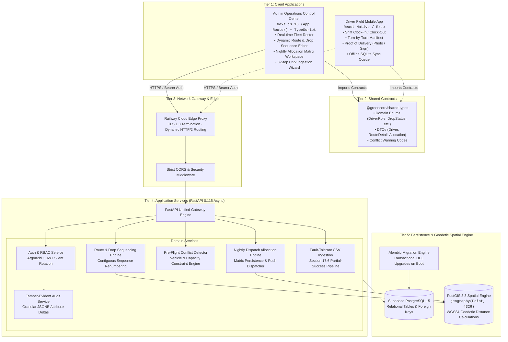
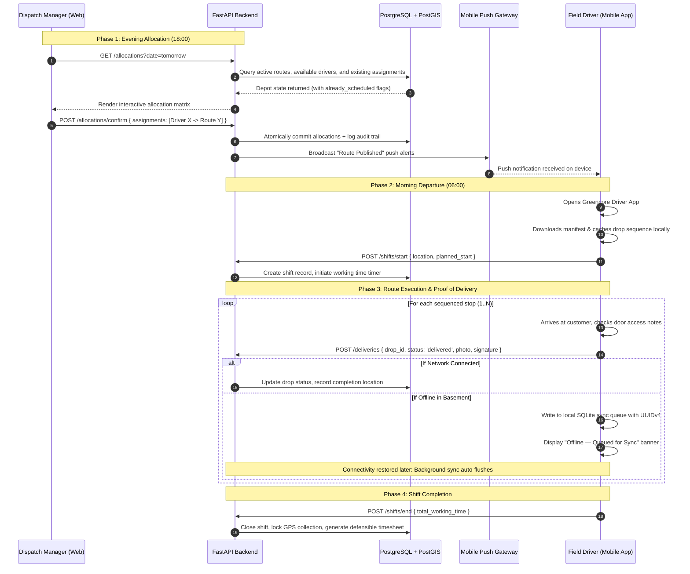
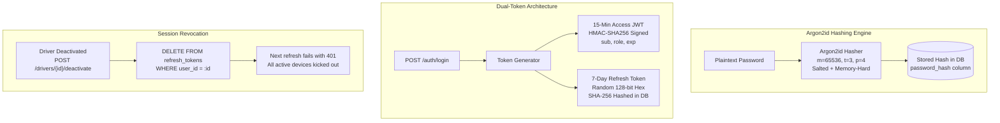
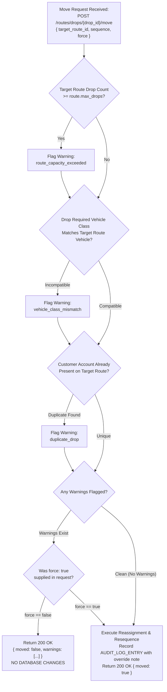
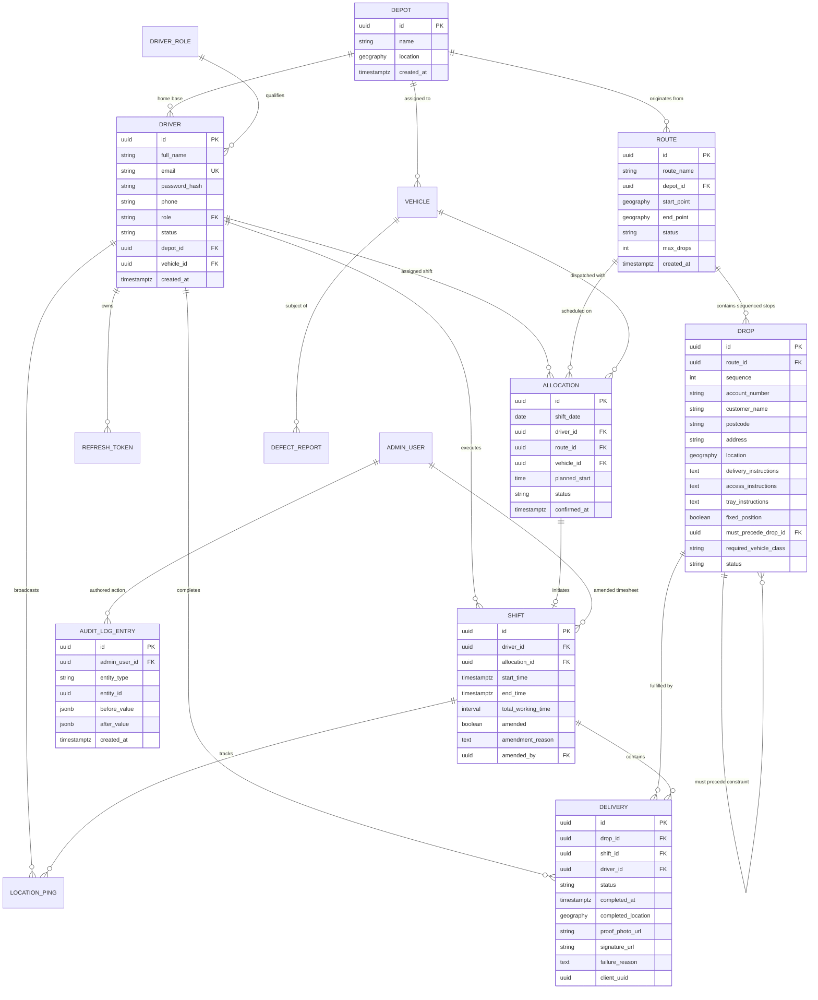
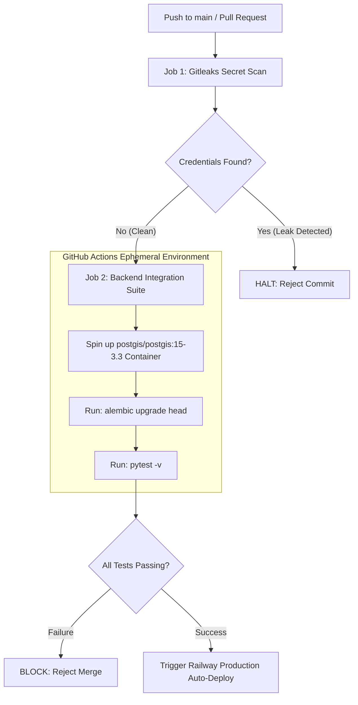
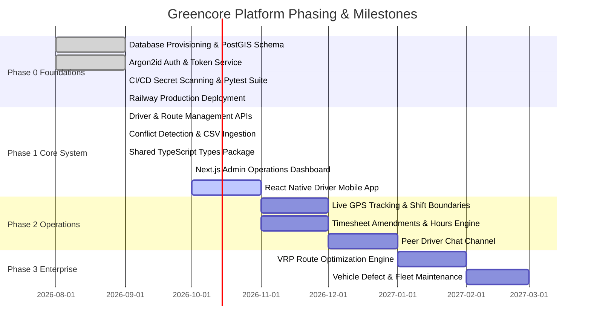

<p align="center">
  
</p>

<p align="center">
  <strong>Enterprise Transport Driver Allocation, Live Route Management &amp; Proof-of-Delivery Platform</strong>
</p>

<p align="center">
  <a href="https://greencore-production.up.railway.app"></a>&nbsp;
  <a href="https://greencore-production.up.railway.app/docs"></a>&nbsp;
  <a href="https://greencore-production.up.railway.app/health"></a>&nbsp;
  <a href="./documentations/README.md"></a>&nbsp;
  <a href="./docs/GREENCORE_DOCUMENTATION.md"></a>
</p>

<p align="center">
  
  
  
  
  
  
  
  
  
  
  
  
</p>

---

> **Greencore** is an industrial-grade transport logistics and driver fleet orchestration platform. Built to modernize complex commercial supply chains, it replaces legacy paper route cards, morning dispatch room bottlenecks, and end-of-day delivery disputes with a synchronized digital operating system. Greencore pairs an operations control center web dashboard with a cab-optimized mobile driver app, driven by an asynchronous FastAPI gateway, an enterprise PostGIS spatial engine, and zero-drift TypeScript contracts.

---

## 📖 Table of Contents

- [🏛️ Grand System Architecture](#️-grand-system-architecture)
- [🔄 End-to-End Operational Lifecycle](#-end-to-end-operational-lifecycle)
- [✨ Key Platform Capabilities](#-key-platform-capabilities)
- [🎬 Cinematic UI/UX Engine & Design System](#-cinematic-uiux-engine--design-system)
  - [1. Operations Command Center Aesthetics](#1-operations-command-center-aesthetics)
  - [2. Design Tokens Hierarchy (Section 18)](#2-design-tokens-hierarchy-section-18)
  - [3. Application Shell & Layout Engine](#3-application-shell--layout-engine)
  - [4. Ambient Micro-Interactions & Live Indicators](#4-ambient-micro-interactions--live-indicators)
- [⚙️ Backend Engineering — Python & FastAPI](#️-backend-engineering--python--fastapi)
  - [1. Authentication & Dual-Token Cryptography](#1-authentication--dual-token-cryptography)
  - [2. Pre-Flight Route Conflict Engine](#2-pre-flight-route-conflict-engine)
  - [3. Dynamic Contiguous Sequence Resequencer](#3-dynamic-contiguous-sequence-resequencer)
  - [4. Nightly Allocation & Dispatch Engine](#4-nightly-allocation--dispatch-engine)
  - [5. Resilient CSV Ingestion (Section 17.6)](#5-resilient-csv-ingestion-section-176)
  - [6. Tamper-Evident Audit Logging](#6-tamper-evident-audit-logging)
  - [7. REST API Gateway & Routing Map](#7-rest-api-gateway--routing-map)
- [🖥️ Frontend Engineering — Next.js 16 Dashboard](#️-frontend-engineering--nextjs-16-dashboard)
  - [1. Architecture & Layout Hierarchy](#1-architecture--layout-hierarchy)
  - [2. Type-Safe Client Layer (@greencore/shared-types)](#2-type-safe-client-layer-greencore-shared-types)
  - [3. Authentication Context & Route Guarding](#3-authentication-context--route-guarding)
  - [4. Core Operations Modules & Page Inventory](#4-core-operations-modules--page-inventory)
- [🗄️ Database Schema & PostGIS Spatial Modeling](#️-database-schema--postgis-spatial-modeling)
  - [1. Complete Entity-Relationship Diagram (ERD)](#1-complete-entity-relationship-diagram-erd)
  - [2. PostGIS Geodetics vs. Planar Geometry](#2-postgis-geodetics-vs-planar-geometry)
  - [3. Geodetic Distance Queries](#3-geodetic-distance-queries)
  - [4. Alembic Transactional Schema Migrations](#4-alembic-transactional-schema-migrations)
- [📂 Monorepo Structure & Module Mapping](#-monorepo-structure--module-mapping)
- [🔧 Complete Technology Stack](#-complete-technology-stack)
- [🌐 Production Deployment & Infrastructure](#-production-deployment--infrastructure)
  - [1. Cloud Hosting Topology (Railway)](#1-cloud-hosting-topology-railway)
  - [2. Production Multi-Stage Dockerfile](#2-production-multi-stage-dockerfile)
  - [3. Zero-Downtime Deployment & Health Monitoring](#3-zero-downtime-deployment--health-monitoring)
- [🛡️ CI/CD Pipeline & Automated Security](#️-cicd-pipeline--automated-security)
  - [1. Gitleaks Secret Scanning](#1-gitleaks-secret-scanning)
  - [2. Isolated Ephemeral PostGIS Test Container](#2-isolated-ephemeral-postgis-test-container)
- [⚙️ Environment Configuration Reference](#️-environment-configuration-reference)
- [🚀 Setup & Running Locally](#-setup--running-locally)
- [📚 Engineering Documentation Library](#-engineering-documentation-library)
- [🗺️ Project Phasing & Roadmap](#️-project-phasing--roadmap)
- [🤝 Contributing & License](#-contributing--license)
- [👥 Engineering Leadership & Author](#-engineering-leadership--author)

---

## 🏛️ Grand System Architecture

Greencore is engineered as a decoupled, multi-tier system with contract-first shared types. Administrative operations, mobile execution, and domain engines operate in strict isolation:



---

## 🔄 End-to-End Operational Lifecycle

The operational flow spans 24 hours of supply chain activity, connecting evening depot allocation to morning driver departure and automated shift closure:



---

## ✨ Key Platform Capabilities

| Capability | Engineering Architecture | Business Impact |
|---|---|---|
| 🔐 **Invite-Only Closed Security** | Zero public sign-ups. Authentication requires cryptographically random invite tokens (128-bit) and memory-hard Argon2id hashing. | Eliminates rogue account creation; enforces strict enterprise fleet boundary. |
| 🔄 **Dual-Token Silent Rotation** | 15-minute short-lived JWT access tokens paired with 7-day server-revocable refresh tokens. | Protects active routes while allowing instant global session termination if a driver is deactivated. |
| 🗺️ **True Geodetic Spatial Modeling** | Coordinates stored as PostGIS `geography(Point, 4326)`, computing great-circle distances along the WGS84 ellipsoid. | Prevents planar distortion errors (up to 40% in the UK); guarantees accurate delivery geofencing. |
| 🛡️ **Pre-Flight Conflict Detection** | Evaluates vehicle class compatibility (`vehicle_class_mismatch`) and truck capacities (`capacity_exceeded`) prior to drop moves. | Eliminates dispatch errors (e.g. sending a small van to pick up 26 heavy pallets). |
| 📥 **Partial-Success Fault Tolerance** | Section 17.6 certified ingestion pipeline: processes valid stops immediately while isolating corrupt rows with line numbers. | Never halts depot departure because 2 out of 500 spreadsheet rows contain invalid postal codes. |
| 📅 **Nightly Allocation Matrix** | Calendar date-based dispatch grid linking drivers, routes, and vehicles with push notification broadcast. | Replaces 05:00 AM paper manifest chaos with pre-scheduled evening mobile delivery briefings. |
| 📜 **Tamper-Evident Audit Trail** | App-level service capturing field-level before/after deltas in immutable JSONB log entries. | Defensible compliance record for drivers' hours, wage disputes, and administrative overrides. |
| 🚚 **Cab-Optimized Driver Experience** | Minimum 48dp touch targets, one-thumb usability, zero typing requirements, and offline-first queueing. | Fast, safe interactions for commercial drivers wearing gloves in low-connectivity rural drop zones. |

---

## 🎬 Cinematic UI/UX Engine & Design System

The visual identity of Greencore reflects an **enterprise operations control center**. Dispatchers often monitor live fleet screens for 8–12 hours continuously during early-morning and late-night distribution cycles; high contrast, low eye fatigue, and immediate glanceability are primary ergonomics.

### 1. Operations Command Center Aesthetics
- **Color Temperature:** Rich, slate-black base tones (`#090E0C`, `#131E19`) paired with subtle emerald backdrops (`rgba(27, 94, 58, 0.15)`).
- **Glassmorphic Depth:** Subtle backdrops filters (`backdrop-filter: blur(12px)`) separate floating interactive modals from dense background data tables.
- **High Typography Contrast:** Uses **Plus Jakarta Sans** for crisp body metrics and **JetBrains Mono** for account numbers, postcodes, and timestamps.

### 2. Design Tokens Hierarchy (Section 18)
Every style rule is anchored to standard design tokens defined in [`apps/admin/src/app/globals.css`](./apps/admin/src/app/globals.css):

```
// Brand Colors
--color-primary: #1B5E3A;            /* Greencore Forest Brand Green */
--color-primary-dark: #123D26;       /* Deep Evergreen */
--color-primary-light: #2A8B56;      /* Active Element Accent */
--color-primary-bright: #34D399;     /* High-Visibility Emerald Glow */

// Dark Dispatch Theme Bases
--color-bg-base: #090E0C;            /* Primary Page Canvas */
--color-surface: #131E19;            /* Navigation & Sidebar Canvas */
--color-surface-card: #15221C;       /* Card Containers */
--color-surface-elevated: #1B2C24;   /* Elevated Controls & Hover States */
--color-border: #22372E;             /* Container Perimeter Border */
--color-border-focus: #34D399;       /* Active Input Focus Ring */

// Status Signals (Section 5.4)
--color-status-success: #10B981;     /* Delivered / Active / Online */
--color-status-warning: #F59E0B;     /* Partial / Conflict / Pending */
--color-status-danger: #EF4444;      /* Failed / Revoked / Blocked */
--color-status-info: #38BDF8;        /* En Route / Scheduled */
```

### 3. Application Shell & Layout Engine
The dashboard utilizes a persistent desktop application shell:
- **`Sidebar.tsx`:** Left navigation rail displaying the official Greencore emblem, primary router links, live Railway connection pulse, and external Swagger documentation link.
- **`Header.tsx`:** Sticky top bar housing the backend latency/health indicator pill, API base URL confirmation, authenticated user avatar with role badge, and one-click session sign-out.
- **`AppShell.tsx`:** Manages responsive layout offsets, public route gates, and initial session hydration states.

### 4. Ambient Micro-Interactions & Live Indicators
- **Live Health Pulse:** Real-time green pulsating radar dot (`.gc-pulse-dot`) reflecting active backend health check connectivity.
- **Interactive Modals (`Modal.tsx`):** Spring-loaded slide-in animations with background scrim click dismissal and global keyboard `Escape` bindings.
- **Status Badges:** Semantically tinted pill tags (`.gc-badge-success`, `.gc-badge-warning`, `.gc-badge-danger`) rendering driver shift states and delivery outcomes.

---

## ⚙️ Backend Engineering — Python & FastAPI

The backend architecture in `services/api/` is implemented in **Python 3.11** using **FastAPI 0.115** and **SQLAlchemy 2.0**. It exposes high-throughput asynchronous endpoints with strict Pydantic v2 data validation.

### 1. Authentication & Dual-Token Cryptography



### 2. Pre-Flight Route Conflict Engine

Before any drop transfer (`POST /routes/drops/{drop_id}/move`) is saved to the database, it passes through the **Pre-Flight Conflict Detection Pipeline**:



### 3. Dynamic Contiguous Sequence Resequencer
To eliminate manual sequence calculation, the resequencing engine enforces gapless integers (1..N) across all drops in a route:

```python
# services/api/app/services/route.py
def resequence_route(db: Session, route_id: uuid.UUID) -> None:
    """Ensures drop sequence numbers are strictly 1..N with zero gaps."""
    drops = (
        db.query(Drop)
        .filter(Drop.route_id == route_id)
        .order_by(Drop.sequence.asc(), Drop.id.asc())
        .all()
    )
    for idx, drop in enumerate(drops, start=1):
        if drop.sequence != idx:
            drop.sequence = idx
    db.flush()
```

### 4. Nightly Allocation & Dispatch Engine
The dispatch engine in `services/api/app/services/allocation.py` manages daily route rosters:
- **Overview Query (`GET /allocations?date=YYYY-MM-DD`):** Assembles available qualified drivers, active routes, and flags existing assignments (`already_scheduled`).
- **Confirmation Batch (`POST /allocations/confirm`):** Validates that no driver is scheduled on multiple routes, commits the assignment batch, logs an audit entry, and triggers mobile push notifications.

### 5. Resilient CSV Ingestion (Section 17.6)
Route card spreadsheets frequently contain clerical anomalies. Greencore's pipeline isolates bad rows without discarding valid stops:

```python
# services/api/app/services/route.py
imported_count = 0
failed_count = 0
errors = []

for row_idx, row in enumerate(raw_rows, start=1):
    try:
        customer_name = row.get(mapping.get("customer_name", ""))
        postcode = row.get(mapping.get("postcode", ""))
        
        if not customer_name or not customer_name.strip():
            raise ValueError("Customer name is required but empty")
        
        if not postcode or len(postcode.strip()) < 3:
            raise ValueError(f"Invalid postcode value '{postcode}'")

        create_drop_record(db, route_id=target_route.id, data=row)
        imported_count += 1
    except Exception as e:
        failed_count += 1
        errors.append({"row": row_idx, "reason": str(e)})

db.commit()
return {"imported": imported_count, "failed": failed_count, "errors": errors}
```

### 6. Tamper-Evident Audit Logging
Every administrative mutation produces an immutable record in `audit_log_entries`. Rather than snapshotting entire tables, the audit service isolates changed attributes in JSONB format:

```python
# services/api/app/services/driver.py
changes = {}
before_vals = {}
after_vals = {}

for field, new_val in update_data.items():
    old_val = getattr(driver, field)
    if old_val != new_val:
        changes[field] = (old_val, new_val)
        before_vals[field] = str(old_val) if old_val is not None else None
        after_vals[field] = str(new_val) if new_val is not None else None

if admin_user and changes:
    record_audit_event(
        db,
        admin_user_id=admin_user.id,
        entity_type="driver",
        entity_id=driver.id,
        before=before_vals,
        after=after_vals,
    )
```

### 7. REST API Gateway & Routing Map

| Domain | Method & Endpoint | Auth Scope | Description |
|---|---|---|---|
| **Meta** | `GET /health` | Public | Standardized container health probe returning status & environment |
| **Meta** | `GET /` | Public | Rich JSON API index listing available routes, docs, and versions |
| **Auth** | `POST /auth/login` | Public | Authenticates credentials; returns 15m JWT + 7d refresh token |
| **Auth** | `POST /auth/refresh` | Public | Validates refresh token and issues fresh 15m JWT |
| **Auth** | `POST /auth/invite` | `super_admin`, `ops_manager` | Generates 72-hour cryptographic driver onboarding invite token |
| **Drivers** | `GET /drivers` | Authenticated | Paginated driver fleet roster with role & status filters |
| **Drivers** | `POST /drivers` | `super_admin`, `ops_manager` | Registers driver account with vehicle class qualification |
| **Drivers** | `GET /drivers/{id}` | Authenticated | Retrieves single driver profile with vehicle assignment |
| **Drivers** | `PATCH /drivers/{id}` | `super_admin`, `ops_manager` | Modifies driver record; generates JSONB audit deltas |
| **Drivers** | `POST /drivers/{id}/deactivate` | `super_admin`, `ops_manager` | Sets status inactive & atomically revokes all active JWT sessions |
| **Routes** | `GET /routes` | Authenticated | Lists all routes with drop counts and active status |
| **Routes** | `POST /routes` | `super_admin`, `ops_manager`, `route_manager` | Creates new delivery route with max capacity settings |
| **Routes** | `GET /routes/{id}` | Authenticated | Returns route detail with fully sequenced drops |
| **Routes** | `POST /routes/{id}/drops` | `super_admin`, `ops_manager`, `route_manager` | Appends drop to route with automatic sequence allocation |
| **Routes** | `POST /routes/drops/{id}/move` | `super_admin`, `ops_manager`, `route_manager` | Transfers drop with pre-flight vehicle & capacity conflict checks |
| **Routes** | `POST /routes/import/preview` | `super_admin`, `ops_manager`, `route_manager` | Inspects CSV upload and returns detected headers + sample rows |
| **Routes** | `POST /routes/import/commit` | `super_admin`, `ops_manager`, `route_manager` | Commits CSV drops with Section 17.6 partial fault tolerance |
| **Allocations** | `GET /allocations` | Authenticated | Queries date-based allocation matrix (drivers × routes) |
| **Allocations** | `POST /allocations/confirm` | `super_admin`, `ops_manager` | Publishes daily assignments & triggers mobile push notifications |

---

## 🖥️ Frontend Engineering — Next.js 16 Dashboard

The Admin Web Dashboard (`apps/admin`) is built with **Next.js 16 (App Router)**, **React 19**, and **TypeScript 5**.

### 1. Architecture & Layout Hierarchy
```
apps/admin/src/
├── app/
│   ├── layout.tsx             # Root layout with AuthProvider & metadata
│   ├── page.tsx               # Real-time Operations Dispatch Dashboard (KPIs, fleet health)
│   ├── login/page.tsx         # Enterprise login (development auto-fill helper safely gated)
│   ├── drivers/page.tsx       # Fleet roster, search, vehicle class filters, modal CRUD
│   ├── routes/page.tsx        # Route list, sequenced stops table, conflict move modal
│   ├── allocations/page.tsx   # Nightly dispatch matrix, date selector, push notification modal
│   ├── import/page.tsx        # 3-step CSV upload wizard with itemized error reporting
│   └── globals.css            # Section 18 tokens, custom scrollbars, dark command center theme
├── components/
│   ├── layout/
│   │   ├── AppShell.tsx       # Desktop grid layout shell
│   │   ├── Sidebar.tsx        # Navigation menu, Greencore emblem, live Railway indicator
│   │   └── Header.tsx         # Health status pill, active user avatar, logout action
│   └── ui/
│       ├── Modal.tsx          # Accessible modal dialog with backdrop blur & Escape listeners
│       └── Badge.tsx          # Status badges (success, warning, danger, info, neutral)
├── context/
│   └── AuthContext.tsx        # Global JWT state hydration, route protection & health polling
└── lib/
    └── api.ts                 # Fully typed API client referencing @greencore/shared-types
```

### 2. Type-Safe Client Layer (`@greencore/shared-types`)
The dashboard links directly to the monorepo shared contract package via path aliases in `tsconfig.json`:

```typescript
// apps/admin/src/lib/api.ts
import type {
  Driver,
  DriverCreateRequest,
  RouteSummary,
  RouteDetail,
  DropMoveResponse,
  AllocationOverviewResponse,
  AllocationConfirmResponse,
} from "@greencore/shared-types";
```
Every API call returns strongly typed DTOs. If an enum or field name changes on the backend, the Next.js TypeScript compiler flags the divergence before build completion.

### 3. Authentication Context & Route Guarding
[`AuthContext.tsx`](./apps/admin/src/context/AuthContext.tsx) manages token hydration and automatic route protection:
- Hydrates stored JWT tokens from `localStorage` on initial mount.
- Unauthenticated requests outside `/login` are automatically redirected.
- Actively pings `/health` to maintain the live Railway connectivity indicator.
- Exposes `login()`, `logout()`, and `user` profile session state globally.

### 4. Core Operations Modules & Page Inventory
- **Dispatch Dashboard (`/`):** Real-time operational snapshot displaying registered drivers, active delivery routes, total network drops, and allocation readiness. Includes Railway cluster health diagnostics.
- **Driver Fleet Management (`/drivers`):** Interactive roster with live text search across names, emails, and licence numbers. Includes vehicle qualification dropdowns (`van`, `7_5t`, `class1`, `class2`), registration dialog, edit dialog with audit diffs, and deactivation modal with instant token revocation.
- **Routes & Drop Sequencer (`/routes`):** Dual-column workspace. Left column displays route cards with drop totals; right column renders sequenced stops with customer details, delivery instructions, and required vehicle tags. Includes drop transfer dialog with pre-flight conflict warnings.
- **Nightly Route Allocations (`/allocations`):** Date-based dispatch matrix. Operations managers map drivers to routes for tomorrow's shift, detect duplicate driver assignments in real time, and trigger push notification broadcasts upon confirmation.
- **Route Card CSV Import (`/import`):** 3-step wizard (Upload -> Column Auto-Mapping -> Commit). Features Section 17.6 fault-tolerant ingestion, committing valid stops while itemizing row numbers and reasons for malformed rows.
- **Authentication Gateway (`/login`):** Glassmorphic sign-in card. Local development builds feature a gated auto-fill button for testing; production builds automatically omit the helper.

---

## 🗄️ Database Schema & PostGIS Spatial Modeling

### 1. Complete Entity-Relationship Diagram (ERD)



### 2. PostGIS Geodetics vs. Planar Geometry
Flat-earth planar projections introduce significant mathematical distortion across higher latitudes. Greencore stores coordinates in PostGIS as `geography(Point, 4326)`:
- Computes great-circle distances along the true WGS84 earth ellipsoid.
- `ST_DWithin` filters radii in true SI meters rather than non-linear angular degrees.
- Guarantees accurate geofence triggers when vehicles arrive at customer locations.

### 3. Geodetic Distance Queries
```sql
-- Finds all drops within 5 km of an arriving vehicle in true SI ground metres
SELECT id, customer_name, postcode,
       ST_Distance(location, ST_MakePoint(-0.1278, 51.5074)::geography) AS distance_meters
FROM drops
WHERE ST_DWithin(location, ST_MakePoint(-0.1278, 51.5074)::geography, 5000)
ORDER BY distance_meters ASC;
```

### 4. Alembic Transactional Schema Migrations
All database evolutions are version-controlled via Alembic migrations under `services/api/migrations/versions/`. Migrations execute inside transactional blocks, guaranteeing that partial schema updates rollback safely if an error occurs.

---

## 📂 Monorepo Structure & Module Mapping

```text
Greencore/
│
├── .github/                                # Continuous Integration & Security
│   └── workflows/
│       └── ci.yml                          # Gitleaks secret scan + Ephemeral PostGIS Pytest suite
│
├── apps/                                   # Client Applications
│   ├── admin/                              # Next.js 16 Operations Control Center Web App
│   │   ├── src/
│   │   │   ├── app/                        # Next.js App Router (pages & global layout)
│   │   │   │   ├── layout.tsx              # Root HTML shell with AuthProvider
│   │   │   │   ├── globals.css             # Section 18 design tokens & dark command styling
│   │   │   │   ├── page.tsx                # Dispatch Dashboard (KPIs, fleet health)
│   │   │   │   ├── login/page.tsx          # Enterprise authentication screen
│   │   │   │   ├── drivers/page.tsx        # Driver fleet roster & CRUD management
│   │   │   │   ├── routes/page.tsx         # Route & drop sequencer with conflict checks
│   │   │   │   ├── allocations/page.tsx    # Nightly allocation matrix workspace
│   │   │   │   └── import/page.tsx         # Route card CSV upload & column mapping wizard
│   │   │   ├── components/
│   │   │   │   ├── layout/
│   │   │   │   │   ├── AppShell.tsx        # Desktop layout wrapper
│   │   │   │   │   ├── Sidebar.tsx         # Left navigation bar with Greencore logo
│   │   │   │   │   └── Header.tsx          # Header with live health pill & user badge
│   │   │   │   └── ui/
│   │   │   │       └── Modal.tsx           # Reusable accessible dialog component
│   │   │   ├── context/
│   │   │   │   └── AuthContext.tsx         # Global JWT state hydration & route guard
│   │   │   └── lib/
│   │   │       └── api.ts                  # Typed API client referencing shared-types
│   │   ├── .env.example                    # Frontend environment template
│   │   ├── next.config.ts                  # Transpile packages configuration
│   │   ├── tsconfig.json                   # Path mappings to @greencore/shared-types
│   │   └── package.json                    # Admin dependencies (React 19, Next.js 16)
│   │
│   ├── driver/                             # React Native / Expo Mobile App (Drivers)
│   │   └── README.md                       # Mobile app setup reference
│   │
│   └── public/                             # Shared Enterprise Brand Assets
│       └── Greencore_logo.png              # Official Greencore high-resolution brand logo
│
├── packages/                               # Monorepo Shared Libraries
│   └── shared-types/                       # TypeScript Domain Contracts (@greencore/shared-types)
│       ├── src/
│       │   ├── enums.ts                    # Full domain enums (DriverRole, DropStatus, etc.)
│       │   ├── auth.ts                     # Auth DTOs (LoginRequest, UserSession)
│       │   ├── driver.ts                   # Driver API contracts & update requests
│       │   ├── route.ts                    # Route, Drop, and Conflict warning schemas
│       │   ├── allocation.ts               # Nightly allocation overview & confirmation DTOs
│       │   └── index.ts                    # Barrel export entrypoint
│       ├── tsconfig.json                   # TypeScript build settings
│       └── package.json                    # Shared types package definition
│
├── services/                               # Backend Microservices
│   └── api/                                # FastAPI 0.115 Asynchronous Service
│       ├── app/
│       │   ├── core/                       # Security, config, database engine
│       │   │   ├── config.py               # Pydantic BaseSettings loading from .env
│       │   │   └── database.py             # SQLAlchemy engine & sessionmaker
│       │   ├── models/                     # SQLAlchemy ORM Data Models
│       │   │   ├── auth.py                 # RefreshToken & InviteToken models
│       │   │   ├── driver.py               # Driver, DriverRole, Vehicle models
│       │   │   ├── route.py                # Route & Drop models with PostGIS geography
│       │   │   ├── allocation.py           # Allocation & Shift models
│       │   │   └── audit.py                # Immutable AuditLogEntry model
│       │   ├── routers/                    # FastAPI Route Controllers
│       │   │   ├── auth.py                 # /auth/login, /auth/refresh, /auth/invite
│       │   │   ├── drivers.py              # /drivers CRUD & deactivation
│       │   │   ├── routes.py               # /routes, drops, move drop, CSV import
│       │   │   └── allocations.py          # /allocations overview & confirmation
│       │   ├── schemas/                    # Pydantic v2 Request/Response Schemas
│       │   │   ├── auth.py                 # Login and token payloads
│       │   │   ├── driver.py               # Driver create, patch, and list responses
│       │   │   ├── route.py                # Route, drop, and conflict response schemas
│       │   │   └── allocation.py           # Allocation overview and confirm schemas
│       │   ├── services/                   # Business Domain Logic
│       │   │   ├── auth.py                 # Argon2id hashing & JWT token rotation
│       │   │   ├── driver.py               # Driver lifecycle & audit diff tracking
│       │   │   ├── route.py                # Dynamic resequencing & conflict pre-flight
│       │   │   ├── allocation.py           # Nightly allocation matrix engine
│       │   │   └── audit.py                # Immutable JSONB audit logging
│       │   └── main.py                     # FastAPI app bootstrap, CORS, and root endpoints
│       ├── fixtures/                       # Database Test Fixtures
│       │   └── seed.json                   # Seed dataset (admin, drivers, routes, drops)
│       ├── migrations/                     # Alembic Migration Versions
│       │   ├── env.py                      # Alembic migration environment
│       │   └── versions/
│       │       └── 0001_initial.py         # Baseline schema migration
│       ├── scripts/                        # Database Utilities
│       │   └── seed.py                     # Seed data ingestion runner
│       ├── tests/                          # Automated Integration Test Suites
│       │   ├── conftest.py                 # Pytest fixtures and test database setup
│       │   ├── test_auth.py                # Authentication & token tests
│       │   ├── test_drivers.py             # Driver CRUD & deactivation tests
│       │   ├── test_routes.py              # Route resequencing & conflict tests
│       │   └── test_allocations.py         # Allocation overview & confirmation tests
│       ├── Dockerfile                      # Production multi-stage container
│       ├── .dockerignore                   # Docker build context exclusions
│       └── requirements.txt                # Python backend dependencies
│
├── docs/                                   # Specifications & State Tracking
│   ├── GREENCORE_DOCUMENTATION.md          # Complete Product & Technical Specification v1.0
│   ├── GREENCORE_PROPOSAL.md               # Client-facing project proposal & phasing
│   └── state/
│       ├── AGENT_RULES.md                  # Development rules and living documentation protocol
│       ├── STATE.md                        # Current phase progress and verification checklist
│       ├── CHANGELOG.md                    # Chronological build history
│       └── DECISIONS.md                    # Architectural decisions log
│
├── documentations/                         # 10-Part Engineering Documentation Suite
│   ├── README.md                           # Master architectural index and overview
│   ├── 01_SYSTEM_ARCHITECTURE.md           # System architecture, topology & request lifecycle
│   ├── 02_SECURITY_AND_AUTHENTICATION.md   # Cryptography, Argon2id, JWT rotation & RBAC
│   ├── 03_DATABASE_AND_POSTGIS_DATA_MODEL.md # Relational ERD, PostGIS spatial modeling
│   ├── 04_DRIVER_FLEET_MANAGEMENT.md       # Driver lifecycle, vehicle roles & session lockout
│   ├── 05_ROUTES_AND_DROP_SEQUENCING.md    # Resequencing algorithms & conflict engine
│   ├── 06_NIGHTLY_ALLOCATIONS_AND_DISPATCH.md # Allocation matrix & push notifications
│   ├── 07_CSV_INGESTION_AND_PARTIAL_FAULT_TOLERANCE.md # Resilient CSV ingestion (Section 17.6)
│   ├── 08_ADMIN_DASHBOARD_FRONTEND_ENGINEERING.md # Next.js App Router & design tokens
│   └── 09_DEVOPS_CONTAINERIZATION_AND_CI_CD.md # Docker, Railway & GitHub Actions CI
│
├── .gitleaks.toml                          # Secret scanning configuration rules
├── .pre-commit-config.yaml                 # Pre-commit hook definitions
├── railway.json                            # Railway cloud deployment orchestration
└── README.md                               # ← You are here (Master Repository Guide)
```

---

## 🔧 Complete Technology Stack

### Backend & Services
| Component | Technology | Version | Purpose |
|---|---|---|---|
| Runtime | Python | `3.11-slim` | Core execution environment |
| Web Framework | FastAPI | `0.115` | High-performance asynchronous REST gateway |
| ASGI Web Server | Uvicorn | `0.30+` | Lightning-fast asynchronous HTTP server |
| ORM Layer | SQLAlchemy | `2.0+` | Relational query builder & object mapper |
| Spatial ORM | GeoAlchemy2 | `0.15+` | PostGIS spatial geometry/geography bindings |
| Schema Migrations | Alembic | `1.13+` | Version-controlled transactional DDL migrations |
| Password Security | Argon2id (`passlib[argon2]`) | `1.7+` | Memory-hard cryptographic password hashing |
| Token Engine | PyJWT | `2.8+` | Short-lived HMAC-SHA256 signed access tokens |
| Validation | Pydantic v2 | `2.7+` | Request parsing & schema serialization |
| Integration Testing | Pytest | `8.0+` | Automated endpoint integration testing suite |

### Frontend (Admin Dashboard)
| Component | Technology | Version | Purpose |
|---|---|---|---|
| Web Framework | Next.js (App Router) | `16.3.8` | High-density operations dashboard application |
| UI Runtime | React | `19.2.8` | Reactive component rendering |
| Language | TypeScript | `5.5+` | End-to-end compile-time type safety |
| Styling | Vanilla CSS Tokens | Section 18 | High-contrast dark operations center design system |
| Typography | Google Fonts | Web | Plus Jakarta Sans (body) & JetBrains Mono (data) |
| Contract Sharing | Monorepo Paths | Native | Compile-time integration with `@greencore/shared-types` |

### Database & Cloud Infrastructure
| Component | Technology | Version | Purpose |
|---|---|---|---|
| Primary Database | PostgreSQL | `15.0` | ACID-compliant relational data store (Supabase) |
| Spatial Extension | PostGIS | `3.3` | Geodetic earth coordinate calculations (`geography`) |
| Container Engine | Docker | Multi-Stage | Lean production image build with dynamic port binding |
| Cloud Hosting | Railway | PaaS | Managed container runtime with automated health probes |
| Secret Auditing | Gitleaks | `v2` | CI/CD automated credential leak prevention |
| CI Automation | GitHub Actions | Workflows | Automated secret scanning and PostGIS container tests |

---

## 🌐 Production Deployment & Infrastructure

### 1. Cloud Hosting Topology (Railway)

```mermaid
flowchart LR
    subgraph Internet ["Public Internet"]
        AdminBrowser["Admin Dispatcher Browser"]
        DriverPhone["Driver Mobile App"]
    end

    subgraph RailwayCloud ["Railway Production Cloud"]
        EdgeProxy["Cloud Edge Proxy<br/>TLS 1.3 Termination"]
        
        subgraph AppContainer ["Docker Container Service"]
            Entrypoint["alembic upgrade head &&<br/>uvicorn app.main:app --port ${PORT}"]
            FastAPIProc["FastAPI Async Server Process"]
            HealthEndpoint["GET /health Monitor"]
            
            Entrypoint --> FastAPIProc
            FastAPIProc --> HealthEndpoint
        end
    end

    subgraph SupabaseCloud ["Supabase Managed Cloud"]
        DBInstance[("PostgreSQL 15 + PostGIS 3.3<br/>Encrypted at Rest")]
    end

    AdminBrowser -->|HTTPS| EdgeProxy
    DriverPhone -->|HTTPS| EdgeProxy
    EdgeProxy -->|Forward to ${PORT}| FastAPIProc
    FastAPIProc -->|Secure Connection Pool| DBInstance
```

### 2. Production Multi-Stage Dockerfile
The production container is defined in `services/api/Dockerfile`:

```dockerfile
FROM python:3.11-slim

WORKDIR /app

# Install native database development dependencies
RUN apt-get update && apt-get install -y --no-install-recommends \
    gcc \
    libpq-dev \
    curl \
    && rm -rf /var/lib/apt/lists/*

# Install Python dependencies
COPY requirements.txt .
RUN pip install --no-cache-dir -r requirements.txt

# Copy application source code
COPY . .

# Dynamic port binding adapting to cloud orchestrators
CMD sh -c "alembic upgrade head && uvicorn app.main:app --host 0.0.0.0 --port ${PORT:-8080}"
```

### 3. Zero-Downtime Deployment & Health Monitoring
Railway monitors the `/health` endpoint before redirecting traffic to new container instances:
- **`railway.json` Configuration:**
  ```json
  {
    "$schema": "https://railway.app/railway.schema.json",
    "build": {
      "builder": "DOCKERFILE",
      "dockerfilePath": "services/api/Dockerfile"
    },
    "deploy": {
      "healthcheckPath": "/health",
      "healthcheckTimeout": 30,
      "restartPolicyType": "ON_FAILURE",
      "restartPolicyMaxRetries": 5
    }
  }
  ```

---

## 🛡️ CI/CD Pipeline & Automated Security

The Continuous Integration pipeline is configured in `.github/workflows/ci.yml` and triggers on every pull request and push to `main`:



### 1. Gitleaks Secret Scanning
Prevents database credentials, private keys, and JWT secrets from entering git history. If an engineer accidentally commits a secret, Gitleaks halts the pipeline immediately.

### 2. Isolated Ephemeral PostGIS Test Container
The integration job provisions an isolated `postgis/postgis:15-3.3` Docker service container directly inside the GitHub Actions runner. Alembic runs fresh migrations, and the Pytest test suite exercises real spatial queries (`ST_Distance`, `ST_DWithin`) against true PostgreSQL/PostGIS.

---

## ⚙️ Environment Configuration Reference

### Backend (`services/api/.env`)
```bash
# Database Connection (Supabase PostgreSQL + PostGIS)
DATABASE_URL=postgresql://postgres:[PASSWORD]@[HOST]:5432/postgres

# Cryptographic Token Keys (Generate via openssl rand -hex 32)
JWT_SECRET_KEY=your-32-byte-hex-secret-key-here
JWT_ALGORITHM=HS256
ACCESS_TOKEN_EXPIRE_MINUTES=15
REFRESH_TOKEN_EXPIRE_DAYS=7

# Application Settings
ENVIRONMENT=production
CORS_ORIGINS=http://localhost:3000,https://admin.greencore.app
PORT=8080
```

### Admin Web App (`apps/admin/.env.local`)
```bash
# Production Backend API Endpoint
NEXT_PUBLIC_API_URL=https://greencore-production.up.railway.app
```

---

## 🚀 Setup & Running Locally

### Prerequisites
- **Node.js 20+** with `npm`
- **Python 3.11+** with `pip`
- **PostgreSQL 15+** with PostGIS extension enabled (or Supabase project)

### 1. Clone & Configure
```bash
git clone https://github.com/joshuatochinwachi/Greencore.git
cd Greencore
```

### 2. Run Backend API
```bash
cd services/api

# Create and activate virtual environment
python -m venv .venv
source .venv/bin/activate       # Windows: .venv\Scripts\activate

# Install dependencies
pip install -r requirements.txt

# Configure environment variables
cp .env.example .env

# Run database schema migrations & seed fixtures
alembic upgrade head
python scripts/seed.py

# Launch development API server
uvicorn app.main:app --reload --port 8000
```
Interactive Swagger docs available at [http://localhost:8000/docs](http://localhost:8000/docs).

### 3. Run Admin Web Dashboard
```bash
cd apps/admin

# Install dependencies
npm install

# Start development server
npm run dev
```
Operations dashboard available at [http://localhost:3000](http://localhost:3000).

### 4. Seed Credentials (Local Development)
- **Role:** Super Admin
- **Email:** `admin@test.greencore.app`
- **Password:** `Password123!`

---

## 📚 Engineering Documentation Library

Deep-dive technical documentation for every sector is available in the [`documentations/`](./documentations) directory:

| Document | Topic | Description |
|---|---|---|
| [**`01_SYSTEM_ARCHITECTURE.md`**](./documentations/01_SYSTEM_ARCHITECTURE.md) | **System Architecture & Topology** | Monorepo layout, multi-tier boundaries, edge proxy, and request lifecycles. |
| [**`02_SECURITY_AND_AUTHENTICATION.md`**](./documentations/02_SECURITY_AND_AUTHENTICATION.md) | **Security & Cryptography** | Argon2id hashing, dual-token rotation, invite-only onboarding, and RBAC matrix. |
| [**`03_DATABASE_AND_POSTGIS_DATA_MODEL.md`**](./documentations/03_DATABASE_AND_POSTGIS_DATA_MODEL.md) | **Database & PostGIS Engine** | Complete schema ERD, PostGIS `geography` geodetics, and Alembic migrations. |
| [**`04_DRIVER_FLEET_MANAGEMENT.md`**](./documentations/04_DRIVER_FLEET_MANAGEMENT.md) | **Driver Fleet Lifecycle** | Vehicle classifications, JSONB audit diffs, and session revocation. |
| [**`05_ROUTES_AND_DROP_SEQUENCING.md`**](./documentations/05_ROUTES_AND_DROP_SEQUENCING.md) | **Route Sequencing & Conflicts** | Contiguous sequence renumbering and pre-flight conflict detection rules. |
| [**`06_NIGHTLY_ALLOCATIONS_AND_DISPATCH.md`**](./documentations/06_NIGHTLY_ALLOCATIONS_AND_DISPATCH.md) | **Nightly Dispatch Workflow** | Allocation matrix, double-booking prevention, and push broadcast. |
| [**`07_CSV_INGESTION_AND_PARTIAL_FAULT_TOLERANCE.md`**](./documentations/07_CSV_INGESTION_AND_PARTIAL_FAULT_TOLERANCE.md) | **CSV Ingestion Pipeline** | 3-step wizard, column auto-matching, and Section 17.6 fault tolerance. |
| [**`08_ADMIN_DASHBOARD_FRONTEND_ENGINEERING.md`**](./documentations/08_ADMIN_DASHBOARD_FRONTEND_ENGINEERING.md) | **Admin Frontend Engineering** | Next.js 16 App Router architecture, Section 18 design tokens, and typed API client. |
| [**`09_DEVOPS_CONTAINERIZATION_AND_CI_CD.md`**](./documentations/09_DEVOPS_CONTAINERIZATION_AND_CI_CD.md) | **DevOps & CI/CD Pipeline** | Multi-stage Docker, Railway cloud deployment, and GitHub Actions CI. |

---

## 🗺️ Project Phasing & Roadmap



---

## 🤝 Contributing & License

This project is licensed under the **MIT License**. See [`LICENSE`](./LICENSE) for details.

---

## 👥 Engineering Leadership & Author

### 💻 Software Engineer & Architect
**[Joshua Nwachukwu (Jo$h)](https://x.com/defi__josh)**

| Channel | Link |
|---|---|
| 𝕏 Twitter | [@defi__josh](https://x.com/defi__josh) |
| GitHub | [@joshuatochinwachi](https://github.com/joshuatochinwachi) |
| Telegram | [@joshuatochinwachi](https://t.me/joshuatochinwachi) |
| Email | [joshuatochinwachi@gmail.com](mailto:joshuatochinwachi@gmail.com) |

---

<p align="center">
  Built with 🌿 by <strong><a href="https://x.com/defi__josh">Joshua Nwachukwu</a></strong> for <strong>Greencore Transport Logistics</strong>
  <br/>
  <a href="https://greencore-production.up.railway.app">Production API</a> &nbsp;·&nbsp;
  <a href="https://greencore-production.up.railway.app/docs">Interactive Swagger Docs</a> &nbsp;·&nbsp;
  <a href="./documentations/README.md">Engineering Library</a>
</p>
