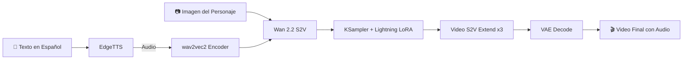

# 🎭 Tikva - Character Animation with AI Voice

<div align="center">


[](https://www.tiktok.com/@tikva_es)

**Generación de video animado con voz sintetizada a partir de una imagen estática**

[Descripción](#-descripción) •
[Demo](#-demo) •
[TikTok](#-síguenos-en-tiktok) •
[Tecnologías](#-tecnologías-utilizadas) •
[Flujo de Trabajo](#-flujo-de-trabajo) •
[Instalación](#-instalación)

</div>

---

## 📖 Descripción

Este proyecto demuestra un pipeline completo de **animación de personajes con IA** ejecutado 100% en local. A partir de una imagen estática de un personaje, el sistema:

1. 🎤 **Genera voz sintética** usando EdgeTTS con voces en español
2. 🎬 **Anima el personaje** sincronizando movimientos labiales y gestos con el audio
3. 🎥 **Produce un video final** con el personaje hablando de forma natural

### ✨ Características principales

- **Sin APIs externas**: Todo el procesamiento se realiza localmente
- **Síntesis de voz en español**: Utiliza EdgeTTS para generar audio natural
- **Animación realista**: Gestos, parpadeo, movimientos de cabeza y sincronización labial
- **Videos extendidos**: Capacidad de generar videos de múltiples segmentos (77+ frames por chunk)
- **Optimizado con Lightning LoRA**: Generación acelerada (4 pasos vs 20 pasos tradicionales)

---

## 🎬 Demo

<div align="center">


*Video generado completamente con IA a partir de una imagen estática*

▶️ [Ver video completo con audio](assets/output.mp4)

</div>

---

## 📱 Síguenos en TikTok

<div align="center">

[](https://www.tiktok.com/@tikva_es)

### 🎵 [@tikva_es](https://www.tiktok.com/@tikva_es)

En TikTok compartimos los videos generados con este workflow, contenido motivacional con personajes animados por IA. ¡Síguenos para ver más ejemplos!

</div>

---

## 🖼️ El Workflow

<div align="center">


*Captura del flujo completo en ComfyUI*

</div>

> 💡 **Texto de ejemplo**: *"Todos los recursos y tesoros del mundo ya están aquí, esperando expresarse mediante el pensamiento y la acción humanos..."*

---

## 🛠 Tecnologías Utilizadas

### Modelos de IA

| Modelo | Propósito | Parámetros |
|--------|-----------|------------|
| **[Wan 2.2 S2V](https://huggingface.co/Comfy-Org/Wan_2.2_ComfyUI_Repackaged)** | Sound-to-Video generation | 14B |
| **[wav2vec2](https://huggingface.co/facebook/wav2vec2-large)** | Audio encoding | Large |
| **[UMT5-XXL](https://huggingface.co/google/umt5-xxl)** | Text encoding (CLIP) | FP8 |
| **[Lightning LoRA](https://huggingface.co/Comfy-Org/Wan_2.2_ComfyUI_Repackaged)** | Aceleración 4-step | - |

### Stack Tecnológico

```
┌─────────────────────────────────────────────────────────────┐
│                        ComfyUI                               │
├─────────────────────────────────────────────────────────────┤
│  EdgeTTS          │  Wan 2.2 S2V     │  Video Processing   │
│  (Text-to-Speech) │  (Image-to-Video)│  (Encoding/Export)  │
├─────────────────────────────────────────────────────────────┤
│                     PyTorch + CUDA                           │
└─────────────────────────────────────────────────────────────┘
```

---

## 🔄 Flujo de Trabajo



### Pasos del Pipeline

1. **Entrada de imagen**: Se carga una imagen del personaje (PNG/JPG)
2. **Generación de voz**: EdgeTTS convierte texto a voz en español (Victor - Puerto Rico)
3. **Encoding de audio**: wav2vec2 procesa el audio para sincronización
4. **Encoding de texto**: UMT5-XXL procesa los prompts positivos/negativos
5. **Generación de video**: Wan 2.2 S2V genera frames animados
6. **Extensión de video**: Se concatenan múltiples chunks de 77 frames
7. **Decodificación**: VAE convierte latents a frames visibles
8. **Exportación**: Se combina video + audio en formato final

---

## 📦 Instalación

### Requisitos previos

- **GPU**: NVIDIA con mínimo 12GB VRAM (recomendado 24GB+ para bf16)
- **ComfyUI**: Instalado y funcionando
- **Python**: 3.10+

### Modelos necesarios

Descarga y coloca los modelos en las carpetas correspondientes:

```
ComfyUI/
├── models/
│   ├── diffusion_models/
│   │   └── wan2.2_s2v_14B_fp8_scaled.safetensors
│   ├── text_encoders/
│   │   └── umt5_xxl_fp8_e4m3fn_scaled.safetensors
│   ├── audio_encoders/
│   │   └── wav2vec2_large_english_fp16.safetensors
│   ├── vae/
│   │   └── wan_2.1_vae.safetensors
│   └── loras/
│       └── wan2.2_t2v_lightx2v_4steps_lora_v1.1_high_noise.safetensors
```

#### Links de descarga directa

| Modelo | Tamaño | Link |
|--------|--------|------|
| Diffusion Model (FP8) | ~14GB | [Descargar](https://huggingface.co/Comfy-Org/Wan_2.2_ComfyUI_Repackaged/resolve/main/split_files/diffusion_models/wan2.2_s2v_14B_fp8_scaled.safetensors) |
| Text Encoder | ~4GB | [Descargar](https://huggingface.co/Comfy-Org/Wan_2.1_ComfyUI_repackaged/resolve/main/split_files/text_encoders/umt5_xxl_fp8_e4m3fn_scaled.safetensors) |
| Audio Encoder | ~600MB | [Descargar](https://huggingface.co/Comfy-Org/Wan_2.2_ComfyUI_Repackaged/resolve/main/split_files/audio_encoders/wav2vec2_large_english_fp16.safetensors) |
| VAE | ~300MB | [Descargar](https://huggingface.co/Comfy-Org/Wan_2.2_ComfyUI_Repackaged/resolve/main/split_files/vae/wan_2.1_vae.safetensors) |
| Lightning LoRA | ~200MB | [Descargar](https://huggingface.co/Comfy-Org/Wan_2.2_ComfyUI_Repackaged/resolve/main/split_files/loras/wan2.2_t2v_lightx2v_4steps_lora_v1.1_high_noise.safetensors) |

### Nodos personalizados requeridos

Instala el siguiente nodo en ComfyUI:

```bash
# En la carpeta custom_nodes de ComfyUI
git clone https://github.com/AlexXXX-dev/ComfyUI-EdgeTTS
```

---

## 🚀 Uso

1. **Abre ComfyUI** y carga el workflow `Tikva.json`

2. **Configura tu imagen**: Sube la imagen del personaje en el nodo `LoadImage`

3. **Escribe tu texto**: Modifica el texto en el nodo `EdgeTTS`
   ```
   Voz disponible: [Spanish] es-PR Victor
   ```

4. **Ajusta los prompts** (opcional):
   - **Positivo**: `gestures, nodding, blinking, breathing, head tilt, posture shifts, expressive hands`
   - **Negativo**: `stiff motion, robotic movement, jitter, twitching`

5. **Configura parámetros de generación**:
   | Parámetro | Con Lightning LoRA | Sin LoRA |
   |-----------|-------------------|----------|
   | Steps | 4 | 20 |
   | CFG | 1.0 | 6.0 |

6. **Ejecuta el workflow** (Queue Prompt)

---

## ⚙️ Configuración Avanzada

### Extender duración del video

El workflow incluye subgraphs "Video S2V Extend" para generar videos más largos:

- Cada subgraph añade **77 frames** adicionales
- El workflow actual tiene **4 extensiones** = ~308 frames totales
- Para más duración: copia un subgraph con `Ctrl+C` → `Ctrl+Shift+V`

### Resolución

Configuración actual: **512x800** (portrait)

Modifica en el nodo `WanSoundImageToVideo`:
- `width`: Ancho del video
- `height`: Alto del video

> ⚠️ Resoluciones mayores requieren más VRAM

---

## 📊 Rendimiento

| Configuración | VRAM | Tiempo (77 frames) |
|---------------|------|-------------------|
| FP8 + Lightning LoRA (4 steps) | ~14GB | ~2-3 min |
| FP8 (20 steps) | ~14GB | ~8-10 min |
| BF16 + Lightning LoRA | ~28GB | ~2-3 min |

---

## 🎯 Casos de Uso

- 📱 **Content Creation**: Videos para redes sociales
- 📚 **Educación**: Personajes animados para cursos
- 🎮 **Game Dev**: Cutscenes y NPCs animados
- 📢 **Marketing**: Avatares corporativos animados
- 🎭 **Arte Digital**: Dar vida a ilustraciones

---

## 📁 Estructura del Proyecto

```
comfyui_tikva/
├── Tikva.json          # Workflow principal de ComfyUI
├── README.md           # Este archivo
└── assets/             # Recursos del proyecto
    ├── workflow.png    # Captura del workflow
    ├── tiktok-preview.png  # Preview de la cuenta TikTok
    └── output.mp4      # Video de ejemplo generado
```

---

## 🔗 Links

- 🎵 **TikTok**: [@tikva_es](https://www.tiktok.com/@tikva_es)
- 📦 **ComfyUI**: [github.com/comfyanonymous/ComfyUI](https://github.com/comfyanonymous/ComfyUI)
- 🤗 **Modelos Wan 2.2**: [Hugging Face](https://huggingface.co/Comfy-Org/Wan_2.2_ComfyUI_Repackaged)

---

## 🙏 Créditos

- **[ComfyUI](https://github.com/comfyanonymous/ComfyUI)** - Framework de workflows
- **[Wan 2.2](https://github.com/Wan-Video/Wan2.1)** - Modelo Sound-to-Video de Alibaba
- **[EdgeTTS](https://github.com/rany2/edge-tts)** - Text-to-Speech de Microsoft Edge
- **[Comfy-Org](https://huggingface.co/Comfy-Org)** - Modelos repackaged para ComfyUI

---

## 📄 Licencia

Este proyecto es para uso educativo y de demostración. Los modelos utilizados tienen sus propias licencias que deben ser respetadas.

---

<div align="center">

**⭐ Si te gustó este proyecto, ¡dale una estrella!**

[](https://www.tiktok.com/@tikva_es)

Made with 💜 using ComfyUI

</div>
