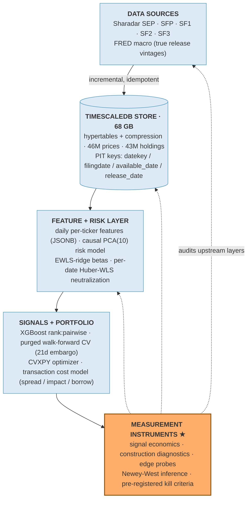
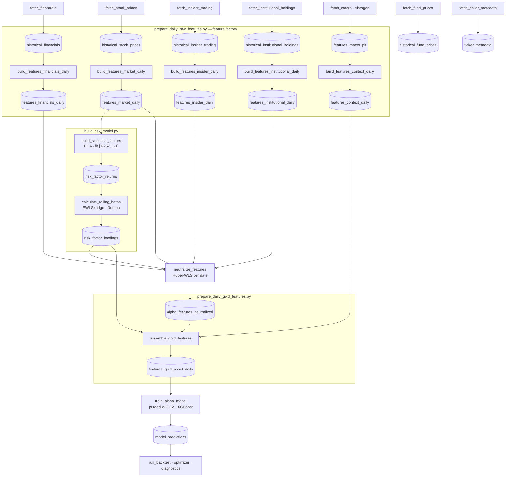

# Quant Market-Data Research Platform — Point-in-Time First

A self-built quantitative research data platform: **91 Python modules,
~32,000 lines, 14 TODOs**, multi-vendor ingestion with point-in-time
(bitemporal) correctness, a 68 GB TimescaleDB time-series store, a pure-SQL
feature factory, a statistical risk model with the math on display — PCA
with Higham PSD repair, EWLS-ridge Numba kernels, Huber-WLS neutralization —
ML signal research with purged walk-forward validation, and convex portfolio
construction. And the part I'm most proud of: **measurement instrumentation
that detected three subtle data-quality biases in my own pipeline and killed
the strategy I'd spent months building.**

> The lesson this repo embodies: in data platforms, the most valuable
> component is not the fastest pipeline — it's the instrumentation that tells
> you when your downstream numbers are lying to you.

## By the numbers

**91 modules · ~32,000 LOC · 6 data feeds across 2 vendors (5 Sharadar datasets + FRED) · 20 repositories
· 8 multi-stage pipelines · ~40 engineered model features + 4 quarantined ·
46M daily prices · 43M 13F holdings · 11M insider events · 3M fundamental
filings · 68 GB TimescaleDB · 14 TODOs**

---

## Architecture



## Pipeline flow — the live DAG

From ingestion to model output, as the system actually runs (the retired
Polygon/dollar-bar preprocessing branch is intentionally absent):



## The three biases the instrumentation caught

| # | Bias | Apparent effect | True effect | Detection |
|---|------|-----------------|-------------|-----------|
| 1 | **Target transformation inflation** — IC measured against a volatility-scaled Gauss-rank target instead of raw forward returns | IC = 0.068, t = 18.8 | IC = 0.043, t = 5.1 (Newey-West, overlapping 21-day labels) | Per-date cross-sectional IC against raw returns |
| 2 | **Accidental factor hedging** — factor covariance fed to the optimizer in raw units while betas were estimated on standardized factors (risk term inflated ×9–556) | +2.1%/yr gross "alpha" | −2.3%/yr once the unit bug was fixed; the edge was an unhedged factor bet + accidental diversification | Controlled A/B/C backtest attribution + OLS decomposition of period returns vs. realized factor returns |
| 3 | **Log-return convexity** — L/S spreads measured with log returns overstate what a real portfolio earns by ½σ² per period, asymmetrically against the short leg | +3.9%/yr gross | −0.5%/yr; +4.5pp/yr was phantom | Replication gate: engine built with simple returns failed to reproduce the diagnostic; period-by-period reconciliation isolated the gap |


After fixing all three, **32 portfolio construction variants** were re-tested
against a pre-registered kill criterion (≥ +200 bps/yr net of honest costs,
2017–2025). None passed. The ML signal was retired with evidence — and the
platform, now proven honest, moved on.

---

## Engineering highlights, with receipts

Every claim below is verifiable in the tree — that's the point.

| Mechanism | Where |
|---|---|
| **~35 market features in one window-function SQL statement** (population skew/kurtosis from raw moments, Garman–Klass, jump-diffusion vol, VPIN, Amihud) — zero pandas | `app/persistence/features_market_daily_repo.py` |
| **COPY → staging → merge upserts** into hypertables, 50k-row chunks to dodge TimescaleDB's decompression limit — millions of rows in seconds | `app/persistence/risk_factor_repo.py` |
| **PIT guard that raises**: revision-aware macro history without an as-of date is a runtime error, not a code-review comment; plus a one-query `DISTINCT ON` vintage history (~100× the naive day-loop) | `app/persistence/features_macro_repo.py` |
| **Anti-lookahead as API**: the predictions repository rejects any schema that could smuggle actuals ("LOOKAHEAD RISK … NO") and refuses future dates | `app/persistence/model_predictions_repo.py` |
| **Query builder that introspects `information_schema` at runtime** — each feature resolves to a physical column or JSONB key, so the schema evolves without query rewrites | `app/persistence/alpha_feature_matrix_repo.py` |
| **Fork-safe connection pools**: per-PID psycopg pools that survive `ProcessPoolExecutor` without closing the parent's sockets | `app/database/connection.py` |
| **PCA risk engine**: pairwise-complete correlation, MAD-3.5 winsorization, Higham (2002) PSD repair, universe-robust eigenvector sign alignment, strict fit-[T−252,T−1]/transform-T | `app/tasks/risk_model/build_statistical_factors.py` |
| **One Numba kernel for the whole universe's rolling EWLS+Ridge betas** — decay 0.97, unpenalized intercept, per-window standardization, Kish effective-sample DoF correction | `app/tasks/risk_model/calculate_rolling_betas.py` |
| **Neutralization that distrusts itself**: winsorize → Gauss-rank → weighted Huber; residual-vs-factor corr > 0.15 triggers a Gram-Schmidt hard clean | `app/tasks/risk_model/neutralize_features.py` |
| **PurgedKFold + Numba weighted-Spearman IC as XGBoost early-stopping metric** with deterministic tie-breaks; IC-weighted bagging; friction-column quarantine; `--feature-lag-test` leakage A/B | `app/tasks/alpha_modeling/training/train_model_pairwise.py` |
| **Vol-scaled IR targets with three forensic bug hunts documented** (16× dimensional fix, the rank "tie-break curse", calendar-reindex vs `.shift()` leakage) | `app/tasks/alpha_modeling/targets/build_targets.py` |
| **Adaptive-threshold dollar bars** (López de Prado) — vectorized cumsum+floor-division engine with an iterative reference implementation for parity testing (standalone module: the Polygon minute-data ingestion it served was retired) | `app/domain/data_processing/dollar_bars.py` |
| **6-stage feature pipeline with 17× lookback-overlap elimination** (21-day chunks share one 121-day fetch) and shared UNLOGGED cache lifecycle across workers | `app/pipelines/prepare_daily_raw_features.py` |
| **Warm-up-aware date validation**: the orchestrator auto-adjusts user date ranges for the 252d PCA + 90d beta warm-up chain — and prints why | `app/pipelines/build_risk_model.py` |
| **CI-grade validators with exit codes** (0/1/2): NaN/zero-variance gates, macro unit-scale audits that print ready-to-paste config blocks, OOS orthogonality, PC1 flip-rate, herding detector | `app/tasks/*/validations/` |
| **Convex optimizer with a strict solver-status gate** (rejecting quiet `optimal_inaccurate` was audit finding #2), horizon-consistent objective, configurable borrow models | `app/tasks/portfolio_manager/optimizer.py` |

---

## What's inside

### Ingestion — six feeds, five "when was this knowable?" semantics

Each vendor publishes differently; each gets matched to how it actually
publishes, not to a convenient convention. And every task speaks the same
**incremental CLI contract** — `--incremental-mode range|since-last` +
`--force` — with a six-source provenance taxonomy for every execution window.

- **FRED with true release vintages** (`realtime_start` as release date),
  sliding-window 60 RPM budget, Akamai-WAF 403 detection that hard-aborts
  instead of hammering, and pre-fetch of vintage dates to chunk under FRED's
  2,000-vintage API limit. Three separate defensive PIT filters drop future
  observations, future releases, and `observation > release` rows.
- **SF1 fundamentals** keyed by filing date (`datekey`), never period end.
- **SF2 insider filings** with CEO/CFO detection at ingest (token-boundary
  regex + four SEC phrases → persisted `is_ceo_cfo`), availability always
  dominated by `filingdate`.
- **SF3 13F holdings** — the vendor exposes period-end but no publication
  date, so availability is *modeled*: `calendardate + 45 days`, rolled to the
  next business day. Documented, conservative, consistent.
- **SEP/SFP bulk prices** via signed export links → streaming ZIP → chunked
  500k-row COPY upserts, incrementing on `lastupdated`.

### Storage & persistence — Postgres does the heavy lifting

- **COPY → staging → merge upserts** into hypertables, chunked at 50k rows to
  dodge TimescaleDB's 100k-decompressed-tuples-per-transaction limit.
- **Fork-safe connection pooling** and a repository base with
  `ClientCursor`, bulk insert, and streaming COPY.
- **Ephemeral UNLOGGED cache tables** with purpose-built indexes turn a
  5-scan feature build into a 1-scan materialize-then-join.
- **Runtime schema introspection** so the hybrid physical-column/JSONB
  layout evolves without breaking the feature matrix queries.

### Feature factory — ~44 engineered features, five families

| Family | Count | Representative features |
|---|---|---|
| **Market microstructure** (pure SQL) | ~35 computed → 8 alpha | `path_efficiency_21d`, `lottery_ticket_21d`, `flow_toxicity_21d` (VPIN), `return_skewness_21d`, `return_kurtosis_21d`, `price_vol_corr_10d`, `smart_accumulation_score`, `force_of_reversal` |
| **Insider flows** (SF2) | 3 alpha + context | `insider_flow_pct_mktcap_63d`, `insider_ceo_cfo_flow_pct_mktcap_63d`, `insider_consensus_count_63d` — conviction-decomposed, in bps of mcap and % of ADV |
| **Institutional** (SF3 13F) | 2 alpha + context | ownership saturation, HHI concentration from raw moments (`Σu²/(Σu)²`), per-filing split adjustment |
| **Fundamentals** (SF1 TTM) | context only | Novy-Marx / Sloan / Richardson ratios with edge-case armor; "too slow to be pure alpha — by design" |
| **Macro** (FRED, config-driven) | 8 series × transforms × windows | synthetic `US_NET_LIQUIDITY` index, ±4σ clipping, release-date as-of joins |
| **Quarantined (TOXIC)** | 4 | `days_to_liquidate_inst`, `turnover_daily`, `amihud_liquidity_21d`, `investor_breadth_growth` — never shown to the model; reserved for the optimizer's cost model |

- **Adaptive-threshold dollar bars** (López de Prado): a vectorized
  cumsum+floor-division engine with an iterative reference implementation for
  parity testing. Built for Polygon minute data; that ingestion branch was
  later retired, so the builder stands alone in `app/domain/` — kept for its
  parity-engineering pattern, with the downstream microstructure aggregation
  (serial correlation, Kyle's lambda, flow imbalance) documented as design in
  `database.md`.

### Risk model — causal by construction

- **Daily-refit correlation PCA** (10 factors, 252d window, 85% coverage
  gate, MAD-3.5 winsorization) with **Higham (2002) PSD repair** and
  eigenvector sign alignment robust to a changing universe.
- **Rolling EWLS+Ridge betas in one Numba kernel**, parallelized by asset,
  with a **Kish effective-sample-size DoF correction** for unbiased specific
  risk.
- **Cross-sectional neutralization** that assumes its own regression can
  fail — and carries a Gram-Schmidt hammer as backup.
- **No vendor index is trusted**: the platform builds its own equal-weight
  mid/small-cap benchmark (MCEWI) in one `INSERT..SELECT`, with membership
  defined at T−1 for T's return and a 50-constituent daily quality gate.
- Every hyperparameter in `app/config/settings.py` carries its statistical
  derivation in a comment (MAD 3.5 ≈ 99.95% clip; decay 0.97 → 23-day
  half-life; Huber ε = 1.35 → 95% OLS efficiency).

### ML training — leak-proof by design

- **Purged walk-forward CV** with mathematically exact purge
  (`gap = horizon + execution_lag − 1` trading days, derived in a comment),
  validation windows capped at 84 days so no fold spans two regimes, and
  critical-mass rules measured in *dates*, not rows.
- **Numba weighted-Spearman IC as the XGBoost early-stopping metric**, with
  deterministic tie-breaks so backtests are bit-reproducible.
- IC-weighted bagging with degenerate-fold rejection; sample weights from
  tradability × temporal decay × regime, capped at the 99.5th percentile.
- **Friction quarantine**: liquidity/risk columns used for weighting are
  never shown to the model — the "liquidity hack" is impossible by
  construction.
- **`--feature-lag-test`**: shifts every feature one day as an intentional
  leakage A/B — if performance survives, something's wrong.
- **Hyperparameter search that optimizes ICIR, not IC** — consistency over
  peak (Optuna TPE, per-fold pruning, shared cached splits).
- Two sibling trainers (`rank:pairwise` vs. `reg:squarederror`) kept as a
  documented objective A/B, with the gradient-saturation diagnosis that
  motivated each.

### Portfolio & diagnostics — decision-grade honesty

- CVXPY optimizer with a strict solver-status gate, horizon-consistent
  objective, configurable borrow models, and two flag-gated construction
  modes.
- A diagnostics suite designed to **kill ideas cheaply and assign blame
  precisely**: signal-economics validation (raw-return IC + Newey-West),
  32-variant construction diagnostics, illiquidity edge probes with
  pre-registered go/kill gates, a paper-portfolio bisection that collapses
  3M rows to ~108 in SQL to separate "the signal is dead" from "the
  optimizer killed it", and a market-cap data-quality audit that infers unit
  scales by minimizing median APE.

## What I'd want you to take from this repo

1. **Point-in-time correctness is a data modeling problem, not a checkbox.**
   Six feeds across two vendors, five availability semantics, one discipline
   — enforced at the repository layer, where violating it is a runtime error.
2. **Push computation to the data.** Features, aggregates, and even
   statistical diagnostics live in SQL; Python orchestrates and models.
3. **Measurement before construction.** Instruments are first-class pipeline
   citizens with pre-registered gates and inference that matches the data's
   dependence structure.
4. **Falsification as a feature.** The kill criteria were written before the
   final runs. The repo documents why the strategy died, not just how it
   worked.

## Repository layout

```
app/
  config/            pydantic-settings (5 prefix-isolated classes),
                     feature registry, macro registry, derived hyperparameters
  database/          fork-safe per-process connection pools, repository base
                     with COPY-based bulk upserts
  persistence/       20 repositories — one per table; the SQL feature
                     library, PIT guards, and staging-merge engines live here
  domain/            dollar-bar construction (standalone; Polygon branch retired),
                     factor math, SIC→GICS mapping (REITs escape Financials)
  tasks/
    data_ingestion/  per-vendor incremental fetchers with PIT semantics
    data_engineering/ feature generation (+ CI-grade validators)
    risk_model/      statistical factors, Numba rolling betas,
                     neutralization, institutional validators
    alpha_modeling/  targets (forensic bug hunts documented),
                     training (purged WF CV, Numba IC, bagging), tuning
    portfolio_manager/ optimizer, transaction cost model, backtest engine,
                     construction diagnostics
  pipelines/         8 multi-stage orchestrators with skip flags, shared
                     cache lifecycle, and warm-up-aware date validation
scripts/             decision-grade diagnostics (edge probes, data-quality
                     audits, signal-vs-optimizer bisections)
database.md          full DDL + design rationale (hypertables, compression,
                     PIT keys) — the schema is the documentation
```

## Stack

Python 3.14 · uv · psycopg 3 · TimescaleDB / PostgreSQL 17 · pandas · NumPy ·
Numba · SciPy · XGBoost · CVXPY (Clarabel/SCS) · Optuna · pydantic-settings ·
structlog · matplotlib (validator artifacts) · Docker Compose

## Provenance

Curated public snapshot of a private research system (single squashed commit
on purpose). Aggregated validation metrics live in `artifacts/validations/`;
figures are reproducible from `figures/generate_figures.py`.

---

## Author

**Juan Miguel Contreras** — data engineer focused on point-in-time-correct
market-data platforms and the measurement discipline that keeps them honest.

Feedback and questions welcome via issues.
