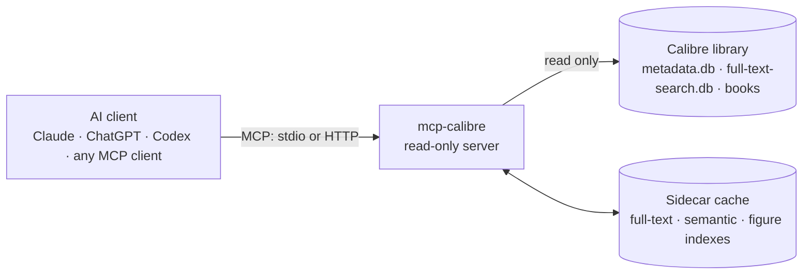

<p align="center"></p>

# mcp-calibre

🇬🇧 English · [🇮🇹 Italiano](README.it.md)

[](https://m8ven.ai/mcp/jumpifequal/mcp-calibre?s=readme)

**Your Calibre library, readable by your AI assistant: private, read-only, fast.**

mcp-calibre is an [MCP](https://modelcontextprotocol.io) server that lets Claude, ChatGPT, Codex and any other MCP
client search, read and understand the books in your local [Calibre](https://calibre-ebook.com) library. It reads
Calibre's own databases directly (no Calibre process needed, no write access, ever) and adds what an assistant
needs to really work with a library: full-text search, search by meaning, reading by chapter, images, OCR for
scanned PDFs, library cleanup, and a check that notes written from books do not copy them.

[Install it](docs/en/installation.md) · [Tweak it and see how it works](docs/en/tweaking.md) · [Skills](docs/en/skills.md) · [FAQ](docs/en/faq.md) · [Performance](docs/en/performance.md)

## Why you will like it

- **Private and read-only.** Everything runs on your machine. Calibre's databases are opened read-only, there are
  no write tools and no shell: the server cannot change your library. Only what a tool returns reaches your AI client.
- **Three ways to search.** By metadata, with Calibre's own search syntax; by exact words, ranked full-text
  search; and by meaning, with multilingual semantic search (ask in Italian, find English passages).
- **Reads books properly.** A chapter map for every format, LIT and MOBI included: read one chapter, a page
  range, or the passage around a search hit.
- **Shows images in the chat.** Covers and figures appear inline, with Copy and Save PNG buttons, without spending
  model tokens.
- **Understands scanned PDFs.** OCR with Tesseract turns them into searchable, readable text, in a batch command
  that never slows a conversation.
- **Cleans up the library.** A metadata quality report, duplicates compared field by field, ISBNs found in the text.
- **Turns books into skills and agents.** Four companion skills in `skills/` go well beyond search.
  `calibre-distill` distills one book into a reusable skill of your own (frameworks, decision guide, glossary,
  checklists). `calibre-distill-topic` synthesises a topic across three or more books and shows where the sources
  agree and disagree. `calibre-book-agent` turns a book into an agent that applies its approach and checks the
  book before claiming what it says. `calibre-book-redteam` stress-tests a book's claims against the rest of your
  library. All four end with a legal gate that checks the notes do not copy the books. The [skills manual](docs/en/skills.md)
  explains each one.
- **Fast.** Searches answer in milliseconds on a library of 1,500 books (numbers [below](#performance-at-a-glance)).

## What you can ask

| Goal | Example request | Tools involved |
|---|---|---|
| Find books | "my unread security books published after 2020" | `calibre_search_books` (`query: 'tag:security and not #letto:true and pubdate:>2020'`) |
| Find where something is discussed | "which books explain prompt injection?" | `calibre_search_fulltext`, `calibre_search_semantic` |
| Read | "read chapter 3 of 1168", "show the table of contents" | `calibre_get_chapters`, `calibre_read_text(chapter=…)`, `calibre_read_section` |
| See images | "show me the covers of 1168 and 1164", "find a diagram of the agent loop" | `calibre_show_images`, `calibre_search_figures`, `calibre_list_figures` |
| Clean up the library | "what's wrong with my metadata?", "are 523 and 906 the same book?" | `calibre_quality_report`, `calibre_find_duplicates`, `calibre_compare_books`, `calibre_find_isbn` |
| Learn from books | "distill 1168 into a skill", "synthesize agent reliability from 1164, 1168 and 1162" | skills `calibre-distill` / `calibre-distill-topic`, `calibre_check_overlap` |
| Apply a book's method | "turn the method of 1168, a management book, into a skill I can use with my team" | skill `calibre-distill`, `calibre_check_overlap` |
| Put two books to work | "make an agent out of each of 1168 and 1164 and let them debate (or collaborate on) how to rescue a late project" | two `calibre-book-agent` agents ([how](docs/en/skills.md#book-against-book-a-step-by-step-recipe)) |
| Stress-test a book | "does 1168 hold up? check its claims against the rest of my library" | skill `calibre-book-redteam`, `calibre_search_semantic` |

In total: **30 tools**, 4 resources and 5 prompts, all read-only. The full list is in the
[tools reference](docs/en/tweaking.md#tools).

## Books that work for you

Searching is only the start. Four ready-made skills in `skills/` put your books to work:

- **Turn a book into a method.** Hand over a management, negotiation or engineering book and get back a skill that
  your assistant applies to your own situation, written in its own words and checked so that it does not copy the book.
- **Give a book a voice.** Make an agent that thinks the way one book does, checks the book before it says what the
  book claims, cites the chapter, and admits "the book is silent" when it is.
- **Let two books argue.** Put two of those agents on the same problem and let them debate it, or build a plan
  together: each defends its book, concedes where the other is stronger, and says what would change its mind. You
  set up the exchange; the manual has the recipe.
- **Find out whether a book holds up.** Its central claims are checked against the rest of your library, the book's
  best defence first, and you get a verdict per claim: supported, qualified, contested or contradicted, and by which
  of your books.
- **Map a whole shelf.** Ask what five books say about one subject and get a guide organized by concept that shows
  where they agree, where they complement each other and where they disagree.

Every result ends with a legal gate that checks it is a transformation and not a copy of the books.

**[How the skills work, with examples and a step-by-step recipe for book against book](docs/en/skills.md)**

## How it works



1. **The client talks MCP to the server.** Over stdio (Claude Desktop, ChatGPT desktop app, Codex) or over
   Streamable HTTP (Claude Code, other clients, a shared server).
2. **The server reads Calibre's databases directly,** in read-only mode: no `calibredb` process to start, queries
   in milliseconds, and it works while Calibre is open.
3. **A small sidecar cache makes content searchable.** Calibre stores the extracted text of your books but with a
   tokenizer other programs cannot query, so the server keeps its own full-text index, updated incrementally. The
   optional semantic and figure indexes live next to it. The cache is the only thing the server writes, and it is
   always safe to delete.
4. **Books are read on demand.** Calibre's text first, then a built-in EPUB parser, PyMuPDF for PDFs, and
   Calibre's `ebook-convert` for LIT, MOBI and the rest. Scanned PDFs are OCRed in a batch step.


*Visual overview of the core server (read-only access, sidecar full-text index, extraction chain, transports). The
precise, current reference is [Under the hood](docs/en/tweaking.md#architecture), including the semantic and figure indexes added in 5.0.*

## Performance at a glance

Measured on a **synthetic** library of 1,500 books (524 MB of text) on a single CPU core (2.1 GHz Intel Xeon), with the
benchmark that ships in the repository (`tests/bench_synthetic.py`):

| Operation | Typical time |
|---|---|
| Initial index build, once | 21 s (148 MB index) |
| Incremental sync after a change | 0.15 s |
| Metadata search | 3.2–7.8 ms |
| Full-text search, 10 books × 3 snippets | 25–63 ms |
| Full-text search, 50 books, no snippets | 2.5–3.0 ms |
| Read a 6,000-character window / find in a book | 1.9 ms / 8.3 ms |
| Chapter map of a book | 1.9 ms |
| Semantic hybrid search over 60,376 passages* | 75 ms |

\* measured with the offline `hash` embedding backend: it exercises the index and the ranking, not the speed of the real model.

These figures show how the server scales, not what your own books will do: real libraries have PDFs, LIT and
MOBI files, and slower disks. Method, full results, sizing of the semantic index and tuning are in the
[performance manual](docs/en/performance.md).

## Quick start

You need Windows 10/11, [Python](https://www.python.org) 3.10 or newer (64-bit) and Calibre with full-text
indexing enabled. Then, either with the graphical wizard:

```powershell
git clone https://github.com/jumpifequal/mcp-calibre C:\Tools\mcp-calibre
C:\Tools\mcp-calibre\setup-wizard.bat
```

or with a single command:

```powershell
cd C:\Tools\mcp-calibre
powershell -ExecutionPolicy Bypass -File .\install.ps1 -Library "D:\Books\Calibre Library" -Pdf pymupdf -Register
```

Fully restart Claude Desktop (quit it from the tray icon): it starts the server by itself, there is nothing else
to launch. Then ask: *"which books in my library explain prompt
injection?"* The [installation manual](docs/en/installation.md) covers the three routes (wizard, script, manual),
other clients, and how to check that everything works.

## The setup wizard and the console

Two optional Windows tools take the command line out of the way. `setup-wizard.bat` checks your PC, picks your
library and installs for you; `console.bat` starts and watches the server and runs the maintenance jobs, with live
progress and with errors and warnings kept apart from the rest.

<p align="center">


</p>
<p align="center"><em>Setup wizard: pre-flight checks, then the choice of components (an illustration drawn from the wizard's layout; the real window uses Windows' native controls).</em></p>

<p align="center">


</p>
<p align="center"><em>Console: the server running with its library status and a warning kept in the Problems panel (left); a semantic-index build of 300 synthetic books in progress, with its live log and progress bar (right).</em></p>

How to use them: [setup wizard](docs/en/installation.md#option-a-setup-wizard) · [console](docs/en/tweaking.md#console-graphical-manager).

## Works with

| Client | Connection | Setup |
|---|---|---|
| Claude Desktop | stdio | [Installation](docs/en/installation.md#connect-your-ai-client) |
| Claude Code | Streamable HTTP | [HTTP transport](docs/en/installation.md#http-transport) |
| ChatGPT desktop app, Codex CLI, Codex IDE extension | stdio (or HTTP) | [OpenAI clients](docs/en/installation.md#openai-clients-chatgpt-desktop-app-codex-cli-codex-ide-extension) |
| Any other MCP client | stdio or HTTP | [Installation](docs/en/installation.md#connect-your-ai-client) |

ChatGPT on the web and claude.ai custom connectors cannot use it: they only reach public HTTPS endpoints with OAuth,
which is not a supported way to expose a personal library.

## Documentation

| Manual | Read it to |
|---|---|
| [Installation](docs/en/installation.md) | install with the setup wizard, the install script or by hand; connect Claude, Codex and ChatGPT; check, update, uninstall |
| [Tweaking and under the hood](docs/en/tweaking.md) | understand the architecture and data stores, the tools and features in depth, every setting and command-line flag, the console, security |
| [Skills](docs/en/skills.md) | use the four companion skills: distill a book, synthesize a topic, turn a book into an agent, stress-test a book; the legal gate; how to run two books against each other |
| [FAQ and troubleshooting](docs/en/faq.md) | solve setup and usage problems, and know the limits |
| [Performance](docs/en/performance.md) | see how speed was measured, the results, sizing and tuning |

## Safety in brief

- Read-only by design: SQLite connections in `mode=ro`, no write tools, no shell; the only writes are to the
  server's own cache.
- HTTP needs a bearer token (loopback bind by default); `--no-auth` is refused anywhere but loopback.
- Book text, annotations and image text are third-party content: the server tells the model never to follow
  instructions found in them, but avoid combining it with high-impact tools (email sending, shell, browser) in the
  same session.
- The full list is in [Security notes](docs/en/tweaking.md#security-notes).
- An independent trust index, M8ven, scans the code: its badge at the top shows the current score. New projects are capped at grade C until they earn adoption.

## Background

The idea of exposing a Calibre library through MCP was first explored by the bash-based
[trieloff/calibre-mcp](https://github.com/trieloff/calibre-mcp). This project is an independent implementation
and shares no code with it.

## Licence

Apache-2.0.
