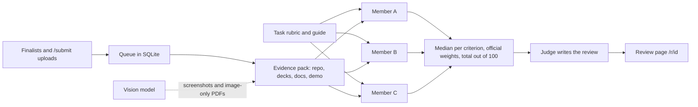

<a href="https://hackyeah-review.justadomainname.dev"></a>

# hackyeah-review

This site lists every HackYeah 2026 finalist with the public repo found for its team. Every project with public code is scored out of 100 by an AI council, against its task's official criteria and weights. Any team can send its own project through the same form and get the same review for free.

**Live site:** [hackyeah-review.justadomainname.dev](https://hackyeah-review.justadomainname.dev) · **Send your project:** [/submit](https://hackyeah-review.justadomainname.dev/submit)

If a review helped you, starring the repo helps other teams find it.

## How it works

Every project, finalist or upload, goes through the same pipeline: a script builds the evidence pack, three fixed models score it on the task's criteria, and a judge writes the review.



Each review is a job in one Bun process (`app/server/`), and the jobs run one at a time in upload order.

1. **Evidence** (`app/server/evidence.ts`, `app/server/extract.ts`). A script builds the evidence pack; no model is involved in this step.
   - **Measured facts:** GitHub metadata and commit history, plus source lines and tests counted in the repo tarball.
   - **Documents:** the uploaded deck and any PDF, PowerPoint and Word decks committed to the repo, plus the README and docs in full. A vision model describes image-only PDFs.
   - **Demo:** the static text of the demo pages, and descriptions of up to five screenshots, also written by the vision model.
   - **Code:** samples of the manifests and the most central source files.

   The pack is at most about 75k tokens. Text written by the team is marked untrusted and jailbreak phrases in it are masked. An attempt to steer the score becomes a red flag.
2. **Council** (`app/server/council.ts`, `review/council.toml`). Three fixed models score the pack on each criterion from 0 to 10. They work from the task's rubric (`review/rubrics/<task>.toml`), its reviewing guide (`review/guides/<task>.md`) and one shared scale: 5 is a solid hackathon prototype, 7 is clearly strong, and 9 or more is exceptional.
   - The score for each criterion is the median of the three; the spread between them shows disagreement.
   - The official weights turn the criteria scores into a total out of 100.
   - A judge model writes the review text and rates how much each member agrees with the rest. It never sets the numbers.
   - Finalists are scored without their result. For an upload, the council sees the result the team declared.
3. **Queue** (`app/server/queue.ts`). Every project faces the same panel, so the panel never shrinks:
   - A rate-limited model is waited for, with a backoff of 60 s that doubles up to 30 min.
   - A garbled reply or a provider error retries the job, and members that already finished keep their scores.
   - Only a permanent failure, such as a bad key or a private repo, ends a review.
   - Every finished step is stored in SQLite, so a restart or a deploy resumes where it stopped.

Changing a model or a prompt means bumping `version` in `review/council.toml`, so scores stay comparable within one version.

### The panel (council v9)

| Role | Model | Runs on |
|---|---|---|
| Member | `glm-5.3-flash` | Claude Code CLI, headless, on z.ai's GLM Coding Plan |
| Member | `dots-3-note-preview` | OpenRouter, free |
| Member | `ling-3.0-flash-sante` | OpenRouter, free |
| Judge | `glm-5.3` | Claude Code CLI, z.ai Coding Plan |
| Vision | `glm-4.6v-flash` | z.ai API, free |

The prefix of each model id in `review/council.toml` picks where it runs (`app/server/models.ts`):

- **`claude:<model>`** runs `claude -p --safe-mode --restricted` in an empty directory, against z.ai's Anthropic-compatible endpoint. When the plan's usage window is used up, the review waits and retries every 30 minutes.
- **`zai:<model>`** calls z.ai's general API.
- **Anything else** is an OpenRouter id, capped at `DAILY_LIMIT` requests a day. OpenRouter allows 50 a day on a free account, or 1000 once it has credits.

## Pages

- **`/`** lists every finalist and every upload, by task. Each card shows the council score, or the project's place in the queue with a live indicator. It opens to the repo links and the full review. The old `/scorecard` page redirects here.
- **`/submit`** is the "Review my project" form, with the same fields as the HackTribe entry. Each repo gets one review per task, plus one correction when the form or the deck changed, and enters at most 3 tasks. Sending the same details again links to the existing review. Submissions are limited per network (`SUBMISSIONS_PER_HOUR`) and in total per day (`SUBMISSIONS_PER_DAY`).
- **`/r/<id>`** shows a review in progress and then the council's result: the score per criterion with each member's score, the measured facts, and strengths, weaknesses and red flags.

## Run

```bash
cp .env.example .env    # OPENROUTER_API_KEY and ZAI_API_KEY; GITHUB_TOKEN and ADMIN_TOKEN are optional
bun install
bun run dev             # builds the site, then serves it with the API on :3000
bun test
bun run typecheck
```

`claude:` members need the Claude Code CLI on the path (`bun add -g @anthropic-ai/claude-code`).

To run without keys, start the mock with `bun app/test/mock-openrouter.ts`. Then start the server with these variables:

```bash
OPENROUTER_BASE_URL=http://localhost:4790 ZAI_BASE_URL=http://localhost:4790 OPENROUTER_API_KEY=mock ZAI_API_KEY=mock bun run dev
```

`claude:` members still need the real CLI and key.

## Operating the queue

The admin endpoints take `Authorization: Bearer $ADMIN_TOKEN`:

| Endpoint | What it does |
|---|---|
| `POST /api/admin/reviews/<id>/hide` | Takes a review off the site |
| `POST /api/admin/reviews/<id>/rerun` | Drops a review and queues it again from fresh evidence. It keeps its upload time |
| `POST /api/admin/queue/resume` | Wakes reviews waiting for the daily quota, after `DAILY_LIMIT` was raised |
| `POST /api/admin/curated` | Imports finished finalist reviews and queues the finalists (`{"enqueue": "all"}`) |
| `POST /api/admin/submissions` | Adds a community submission for a team that asked for a review elsewhere, such as on Discord: `{"task", "team", "title", "repo", "result"?, "fields"?}` |

```bash
curl -X POST https://hackyeah-review.justadomainname.dev/api/admin/reviews/<id>/hide -H "authorization: Bearer $ADMIN_TOKEN"
```

`GET /api/health` shows the requests used today against the daily limit.

## Deploy

Every push to `main` deploys to Dokploy through a GitHub webhook.

- The `Dockerfile` builds the site and runs `bun app/server/index.ts` on port 3000.
- SQLite and uploaded decks live in a volume at `/data`.
- The variables come from `.env.example` and are set in Dokploy.

## Structure

- **Server**
  - `app/server/`: the Bun server, queue, evidence builder, council and model providers.
  - `app/test/`: unit tests and the mock model server.
- **Web**
  - `app/web/pages/`: the results, form and review pages as React components, pre-rendered to HTML by `scripts/build.ts` and hydrated by `app/web/main.tsx`.
  - `app/web/components/ui/`: [Fluid Functionalism](https://www.fluidfunctionalism.com) components (Base UI flavor), added with the shadcn CLI and kept in the repo.
  - `app/web/data/results.ts`: finalists, results and repo matches. `app/web/lib/projects.ts` joins them with the reviews.
- **Review**
  - `review/council.toml`: the fixed panel and its version.
  - `review/rubrics/<task>.toml`: each task's brief, official criteria and weights, and task-specific checks.
  - `review/guides/<task>.md`: a reviewing guide per task, written from the official rules and details documents.
  - `review/prompts/`: the council member and judge prompts.
- **Scripts**
  - `scripts/council-check.ts`, `scripts/council-report.ts`, `scripts/council-sync.ts`: run the council locally, compare it with the earlier blind reviews, and send finished finalist reviews to the site.
  - `scripts/review.ts`: the earlier blind Claude Opus reviews in `app/web/data/scores/`, kept for research. The site no longer shows them.

To add another Fluid component, run the command below. Use `/r/<name>.json` for components without a Base UI flavor. Then move any file it writes to `src/components/` into `app/web/components/`.

```bash
bunx shadcn@latest add https://www.fluidfunctionalism.com/r/base/<name>.json
```

## Releases

Versions and GitHub releases come from [just-github-actions-n-workflows](https://github.com/justAnArthur/just-github-actions-n-workflows): `bump-version.yml` and `release-on-tag.yml`.

- A conventional commit whose scope is one of `site`, `web`, `server`, `council`, `queue` or `evidence` bumps the version in `package.json`. The scopes are set in `properties.gitCommitScopeRelatedNames`.
- The bump tags the release `hackyeah-review@x.y.z` and publishes a release with notes.
- Commits without a scope release nothing.
- The workflows are owned by the toolkit. Update them with its CLI and don't edit them by hand:

```bash
npx -p @justanarthur/just-github-actions-n-workflows-cli just-github-actions-n-workflows update
```

## License

[MIT](LICENSE)
