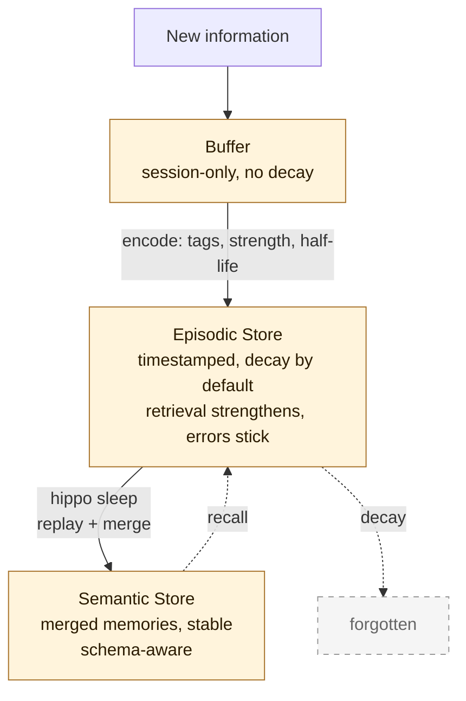
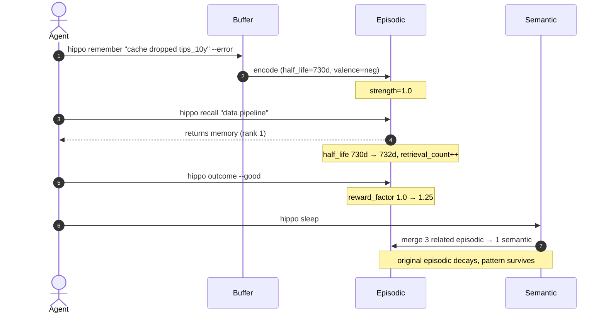

# 🦛 Hippo: memory for AI agents that learns what is wrong

**Hippo learns what is wrong and ranks it down.** Good memory is knowing what to forget: what turned out wrong, what got replaced, what nobody used.

[](https://npmjs.com/package/hippo-memory)
[](https://npmjs.com/package/hippo-memory)
[](https://github.com/kitfunso/hippo-memory/actions/workflows/ci.yml)
[](https://github.com/kitfunso/hippo-memory/blob/master/LICENSE)
[](https://hippo-memory.com)

<p align="center">
  
</p>

Hippo keeps your coding agents' memories in a SQLite store on your machine, with markdown mirrors you can read and commit. Search is BM25 out of the box, with no model and no network call; embeddings are an optional install. `hippo init` installs hooks for Claude Code and OpenCode, adds 2 hooks to Codex's `hooks.json` when Codex is installed (Codex runs them once you trust them in `/hooks`), and adds instructions to an existing `AGENTS.md` for Codex, Cursor, OpenClaw and Pi. Any MCP client can connect. Mark a memory wrong and it ranks lower; run `hippo supersede` and the old fact leaves recall. Zero runtime deps.

Install it, then run `hippo init` inside one project. Init creates the project's `.hippo/` store and adds a block to the `CLAUDE.md` or `AGENTS.md` already there. On your machine it adds hooks for the agents it finds, such as Claude Code's in `~/.claude/settings.json`, and a daily 6:15am run. [What hippo init changes](#what-hippo-init-changes) lists all of it and the flags that skip each part.

```bash
npm install -g hippo-memory && hippo init
```

Setting up every git repo under a folder in one go is a second step. The [Quick start](#quick-start) says what it changes, then gives the command.

Package installation alone does not enable automatic preservation on every agent. Complete the documented setup and required host trust; capture and compaction coverage depend on the integration.

Having an AI agent install it? Point it at [llms-install.md](llms-install.md): it installs, wires hippo into the agents it finds, and verifies with `hippo doctor`.

```
Works with:    Claude Code, Codex, Cursor, OpenClaw, OpenCode, Pi, any MCP client
Imports from:  ChatGPT, Claude (CLAUDE.md), Cursor (.cursorrules), Slack, markdown
Storage:       SQLite backbone with markdown mirrors. Git-trackable, human-readable.
Dependencies:  Zero runtime deps. Node.js 22.16+. Optional embeddings: bring-your-own local Transformers.js (`npm i @huggingface/transformers`, or legacy `@xenova/transformers`) or an opt-in API embedder (OpenAI/Voyage/Cohere). Nothing is auto-installed.
```

**Contents:** [Why](#why-this-exists) · [Receipts](#receipts) · [Quick start](#quick-start) · [Agent setup](#framework-integrations) · [MCP server](#mcp-server) · [How it works](#how-it-works) · [Features](#key-features) · [CLI](#cli-reference) · [Comparison](#comparison) · [Benchmarks](#benchmarks) · [FAQ](#faq) · [Contributing](#contributing)

---

## Why this exists

Most "AI memory" systems save everything and search later. That's storage with search on top. A note that turned out wrong ranks the same as one that held up, and an old fact sits beside the one that replaced it.

Hippo learns from outcomes. When a recalled memory turns out wrong, mark it bad and it drops out of the top results. Memories you keep using get stronger. Those two are the parts we measured helping retrieval, on a synthetic test ([mechanism audit, round 2](https://github.com/kitfunso/hippo-memory/pull/232)). When a fact changes, run `hippo supersede` and the old version leaves recall; we have not measured whether that helps. The design borrows from the hippocampus (decay, three layers, sleep consolidation), but that is inspiration. In our tests, decay tied with decay switched off and sleep lowered recall ([Benchmarks](#benchmarks)).

It also fixes the portability problem. Your ChatGPT memories don't travel to Claude. Your `.cursorrules` don't travel to Codex. Hippo is one store behind every agent. CLAUDE.md, Cursor rules, ChatGPT exports, Slack history, all in one SQLite store, all queryable from any tool that speaks MCP or HTTP.

---

## Receipts

Numbers, not adjectives. Every claim links to the benchmark or the test that proves it.
Every measurement we have ever published is indexed in [`docs/evals/`](docs/evals/README.md),
pre-registrations kept next to their results, including the runs that failed and the one
claim we retracted.

- **Sequential Learning Benchmark.** [benchmarks/sequential-learning/](benchmarks/sequential-learning/). 50 tasks, 10 buried traps. Measures whether agents learn from past mistakes, not just retrieve text. v0.11.0 informal magnitude RETRACTED v1.7.9; mechanism remains shipped. See [CHANGELOG.md](./CHANGELOG.md) v1.7.9 entry.
- **LongMemEval oracle split, all 500 questions in one pooled store, BM25 only, no embeddings, v0.11: R@5 = 74.0%** ([benchmarks/README.md](benchmarks/README.md), scripts in [benchmarks/longmemeval/](benchmarks/longmemeval/)). A different setup from the per-haystack results under [Benchmarks](#benchmarks), so the two are not a before and after.
- **On a private 300-query developer store, R@1 0.41 to 0.62 with `hippo recall "<query>" --reranker jev`**, the free local cross-encoder against Jev ([full eval](docs/evals/2026-09-19-jev-reranker.md)). The opt-in [TypeSafe Jev](https://typesafe.ai) reranker, off by default, about 0.0004 USD a recall. 2000-draw paired bootstrap; the margin held in 20 of 20 seeds and a permutation null reached it in 0 of 200 runs. Ranking only: three graded tests on one 150-question LongMemEval set did **not** show a better answer rate than the free local cross-encoder, and that negative result is in the same doc. What it buys today is a shorter context: on that set, 2 memories ranked by Jev answered as well as 5 ranked by the cross-encoder.
- **Staged Slack corpus, 10 incident scenarios: recall beat transcript replay in 10 of 10** ([benchmarks/e1.3/](benchmarks/e1.3/)). The answers sit mid-channel by design. In every scenario hippo's top 10 results held all the answer messages, and the channel's last 10 messages held none.
- **Slack connector, 1000-event ingestion smoke: 0 outbound HTTP** ([benchmarks/e1.3/](benchmarks/e1.3/)). Proven by a `globalThis.fetch` spy that throws on call, not a hardcoded zero. Recall makes no network call by default. One default does: `hippo sleep` sends memory text to Anthropic for fact extraction when `ANTHROPIC_API_KEY` is set. Sleep runs at the end of every Claude Code and OpenCode session and in the daily job, so with the key set the call happens without you asking. `{"extraction":{"enabled":false}}` in `.hippo/config.json` turns that off. Opt-in features such as the Jev reranker above, the LLM reranker and the API embedders also call out.
- **3,500+ tests on a real database.** No module mocks and no mocked store; only paid network calls are stubbed. Project rule. The one mocks-vs-prod divergence that bit us early is now the constraint that kept the next ten releases honest.
- **3-cluster fixture where BM25 alone cannot discriminate: dlPFC goal-conditioned cluster discrimination passes 3 of 3 queries.** Full goal stack with policy weighting and lifespan-windowed outcome propagation, one query per goal; deterministic test in [`benchmarks/micro/results/b3-depth.json`](benchmarks/micro/results/b3-depth.json).

---

## What it does for your agent

- **Keeps errors longer.** Tag a failure with `--tag error` and it gets twice the half-life of an ordinary memory, so the lesson is still in the store the next time a recall matches it. In Claude Code, a hook stores failed tool calls as error memories for you.
- **Survives tool switches.** Use Claude Code on Monday, Cursor on Tuesday, Codex on Wednesday. They all read the same `.hippo/` store, so the memories come with you.
- **Ingests systems of record.** Slack and GitHub today (`POST /v1/connectors/slack/events`, `POST /v1/connectors/github/events`). Jira and Notion next. Webhooks land as `kind='raw'` memories with full provenance and GDPR-correct deletion.
- **Knows where every memory came from.** Every row carries `kind`, `scope`, `owner`, and `artifact_ref`. Right-to-be-forgotten is a single API call, not an audit nightmare.
- **Plays nice with multi-tenant.** API keys, scrypt-hashed. Audit log on every mutation. Tenant A literally cannot see tenant B's memories. Proven by negative test.

---

## Quick start

Start in one project. [What hippo init changes](#what-hippo-init-changes) lists everything the second command writes.

```bash
npm install -g hippo-memory

# In a project: create its store and wire in the agents it uses
hippo init
```

**Optional: many repos at once.** Read what it changes first. `hippo init --scan <folder>` looks for git repos in the folder and up to three levels below it, skipping dot-folders and `node_modules`. Each repo gets a `.hippo/` store, seeded with lessons from the last 365 days of its commits and with its [agent memories](#agent-memories), and is added to the daily run's list. For the agents it finds, it installs the same user-level hooks as `hippo init`: 7 Claude Code hook entries in `~/.claude/settings.json` and the OpenCode plugin. It also sets up the daily 6:15am run, a crontab line on Linux and macOS or a scheduled task on Windows. It adds no block to any repo's `CLAUDE.md` or `AGENTS.md`. `--no-hooks`, `--no-schedule` and `--no-learn` leave out the hooks, the daily run and the history import.

```bash
hippo init --scan ~
```

After setup, `hippo sleep` runs when a Claude Code or OpenCode session ends, and in the daily 6:15am job for every project. Codex runs it at session end only if you installed its wrapper. It does five things:

1. **Learns** from today's git commits
2. **Imports** what your coding agents remember, about this project and about you ([Agent memories](#agent-memories))
3. **Consolidates** memories (decay, merge, prune)
4. **Deduplicates** identical memories, keeping the stronger copy
5. **Shares** high-value lessons to a global store so they surface in every project

```bash
# Manual usage
hippo remember "FRED cache silently dropped the tips_10y series" --tag error
hippo recall "data pipeline issues" --budget 2000
```

---

Full release history: **[CHANGELOG.md](./CHANGELOG.md)** · [GitHub Releases](https://github.com/kitfunso/hippo-memory/releases)


### What hippo init changes

Run `hippo init` inside one project. This is everything it writes, in the project and on your machine:

- **The project's store.** A `.hippo/` folder: SQLite plus markdown mirrors. On the first run in a git repo it learns lessons from the last 30 days of commits.
- **Instruction files.** A block between `<!-- hippo:start -->` and `<!-- hippo:end -->` in the project's `CLAUDE.md` or `AGENTS.md`, only if that file already exists. Codex, Cursor, OpenClaw, OpenCode and Pi read `AGENTS.md`.
- **Claude Code,** when the project has `CLAUDE.md` or `.claude/settings.json`: 7 hook entries in `~/.claude/settings.json`, one each on SessionEnd, UserPromptSubmit, PreCompact, PostCompact and PostToolUseFailure and two on SessionStart. [Framework Integrations](#framework-integrations) says what each one runs.
- **OpenCode,** when the project has `.opencode/` or `opencode.json`: a plugin at `~/.config/opencode/plugins/hippo.ts`.
- **Codex,** when the project has `AGENTS.md` or `.codex` and Codex is installed (`$CODEX_HOME`, else `~/.codex`, exists): 2 hook entries in Codex's `hooks.json`, one on UserPromptSubmit that sends your pinned memories plus up to 5 that match the prompt with every prompt and one on SessionStart after a compaction. **Codex runs them only after you trust them once in `/hooks`.** Init also prints `hippo hook install codex`, the opt-in that wraps the Codex launcher to capture sessions; `hippo hook uninstall codex` removes hippo's hooks and the wrapper.
- **A daily run at 6:15am,** one per machine: a crontab line on Linux and macOS, a scheduled task named `hippo-daily-runner` on Windows. It runs `hippo learn --git --days 1` and then `hippo sleep` in every project listed in `~/.hippo/workspaces.json`, and init adds this project to that list.
- **Agent memories.** On every run, the notes your coding agents keep about this project go into its store, and the ones about you go into the global store. [Agent memories](#agent-memories) lists what is read.

```bash
cd my-project
hippo init

# Initialized Hippo at /my-project/.hippo
#    Directories: buffer/ episodic/ semantic/ conflicts/
#    Files: hippo.db stats.json
#    Auto-installed claude-code hook in CLAUDE.md
#    Auto-installed hippo session-end SessionEnd hook in claude-code settings
#    (one line per hook entry)
#    Scheduled machine-level daily runner (6:15am) via crontab
```

To leave parts out: `--no-hooks` skips the instruction files and hooks, `--no-schedule` the daily run, and `--no-learn` the git history and agent memory import. `HIPPO_SKIP_AUTO_INTEGRATIONS=1` skips the same files and hooks that `--no-hooks` does.

### Agent memories

Most coding agents now keep their own notes between sessions. Hippo reads them, whatever the tool, so what one agent learned reaches the others. It reads files only and never writes to another tool's folders.

When: `hippo init` (every run), `init --scan`, `init --global`, `hippo setup`, every `hippo sleep` and the daily run. At session end a folder with its own store gets it through sleep; a folder without one sends its project's notes to the global store, marked with the project's name. After a Claude Code compaction, the session's own notes folder is read as well.

What is read, per tool (each tool's own environment variables and settings decide where its home is):

- **Claude Code:** the project's auto memory notes under `~/.claude/projects/<project>/memory/` (front matter required, `MEMORY.md` skipped), and the `autoMemoryDirectory` folder from your user settings.
- **Codex:** the User Profile, preferences and tips in `~/.codex/memories/memory_summary.md`.
- **Gemini CLI:** the "Gemini Added Memories" section of `~/.gemini/GEMINI.md`, and the project's auto memory folder when that feature is on.
- **GitHub Copilot Chat in VS Code:** the memory tool's user memories and the repository memories of this project's workspace.
- **OpenClaw:** the workspace's `MEMORY.md`.
- **Qwen Code:** the project's auto memory folder and your user memories.

Each imported memory follows its note. It stays while the note exists, is replaced when the note changes, and is set aside as dormant when the note is deleted (`hippo dormant` lists it and can restore it). A note shorter than 10 characters, one that looks like it holds a secret (an API key, a password, an auth header or a token), and one whose text you rejected with `hippo reject` are skipped. Email addresses are stored masked, and notes are cut at 1,500 characters.

Not read: Windsurf (the file format is not documented, and Cascade reached end of life on 1 July 2026); Cursor, Copilot CLI and GitHub's Copilot Memory (the memories live on the vendor's servers); Kiro (the local store is not documented); Cline and Roo memory banks (files in the repository, which `hippo import --markdown` covers); Amp, Aider, Continue, OpenCode and pi (no memory feature found).

`hippo import --agents` runs the import by hand; in a folder without a store it does what session end does there. With `--dry-run` it shows each tool's home, the folders found and what would change, and writes nothing. To choose tools, set `"agentMemories": { "tools": ["claude-code", "codex"] }` in `.hippo/config.json` (`[]` turns the import off), or `HIPPO_AGENT_MEMORY_TOOLS=claude-code,codex` in the environment (`none` turns it off), which wins over config.

---

## Cross-Tool Import

Your memories shouldn't be locked inside one tool. Hippo pulls them in from anywhere.

```bash
# ChatGPT memory export
hippo import --chatgpt memories.json

# Claude's CLAUDE.md (skips existing hippo hook blocks)
hippo import --claude CLAUDE.md

# Cursor rules
hippo import --cursor .cursorrules

# Any markdown file (headings become tags)
hippo import --markdown MEMORY.md

# Any text file
hippo import --file notes.txt
```

All import commands support `--dry-run` (preview without writing), `--global` (write to `~/.hippo/`), and `--tag` (add extra tags). Duplicates are detected and skipped automatically.

### Conversation Capture

Extract memories from raw conversation text. No LLM needed: pattern-based heuristics find decisions, rules, errors, and preferences.

```bash
# Pipe a conversation in
cat session.log | hippo capture --stdin

# Or point at a file
hippo capture --file conversation.md

# Preview first
hippo capture --file conversation.md --dry-run
```

### Slack ingestion (E1.3)

Hippo accepts Slack Events API webhooks at `POST /v1/connectors/slack/events`. Configure `SLACK_SIGNING_SECRET` (validated on every request) and point Slack at `https://<your-host>/v1/connectors/slack/events`. Messages land as `kind='raw'` memories with `slack://team/channel/ts` provenance and a `slack:public:Cxxx` or `slack:private:Cxxx` scope. Source deletions are honored (GDPR).

Backfill an existing channel: `SLACK_BOT_TOKEN=xoxb-... hippo slack backfill --channel C0000`. Inspect malformed events: `hippo slack dlq list`.

Multi-workspace deployments populate `slack_workspaces (team_id, tenant_id)` to route events per tenant; single-workspace falls back to `HIPPO_TENANT`.

### Active task snapshots

Long-running work needs short-term continuity, not just long-term memory. Hippo can persist the current in-flight task so a later `continue` has something concrete to recover.

```bash
hippo snapshot save \
  --task "Ship SQLite backbone" \
  --summary "Tests/build/smoke are green, next slice is active-session recovery" \
  --next-step "Implement active snapshot retrieval in context output"

hippo snapshot show
hippo context --auto --budget 1500
hippo snapshot clear
```

`hippo context --auto` includes the active task snapshot before long-term memories, so agents get both the immediate thread and the deeper lessons.

### Session event trails

Manual snapshots are useful, but real work also needs a breadcrumb trail. Hippo can now store short session events and link them to the active snapshot so context output shows the latest steps, not just the last summary.

```bash
hippo session log \
  --id sess_20260326 \
  --task "Ship continuity" \
  --type progress \
  --content "Schema migration is done, next step is CLI wiring"

hippo snapshot save \
  --task "Ship continuity" \
  --summary "Structured session events are flowing" \
  --next-step "Surface them in framework hooks" \
  --session sess_20260326

hippo session show --id sess_20260326
hippo context --auto --budget 1500
```

Hippo mirrors the latest trail to `.hippo/buffer/recent-session.md` so you can inspect the short-term thread without opening SQLite.

### Session handoffs

When you're done for the day (or switching to another agent), create a handoff so the next session knows exactly where to pick up:

```bash
hippo handoff create \
  --summary "Finished schema migration, tests green" \
  --next "Wire handoff injection into context output" \
  --session sess_20260403 \
  --artifact src/db.ts

hippo handoff latest              # show the most recent handoff
hippo handoff show 3              # show a specific handoff by ID
hippo session resume              # re-inject latest handoff as context
```

### Working memory

Working memory is a bounded scratchpad for current-state notes. It's separate from long-term memory. Entries stay until you run `hippo wm flush`.

```bash
hippo wm push --scope repo \
  --content "Investigating flaky test in store.test.ts, line 42" \
  --importance 0.9

hippo wm read --scope repo        # show current working notes
hippo wm clear --scope repo       # wipe the scratchpad
hippo wm flush --scope repo       # flush on session end
```

The buffer holds a maximum of 20 entries per scope. When full, the lowest-importance entry is evicted.

### Explainable recall

See why a memory was returned:

```bash
hippo recall "data pipeline" --why --limit 5

# --- mem_a1b2c3 [episodic] [observed] [local] score=0.847
#     BM25: matched [data, pipeline]; cosine: 0.82
#     ...memory content...
```

---

## How It Works

Input enters the buffer. Important things get encoded into episodic memory. During "sleep," related episodes are merged into one semantic memory, by word overlap. Weak memories decay and disappear.

The store is SQLite (`.hippo/hippo.db`). The markdown files are mirrors written after each change. `index.json` is no longer refreshed by writes, deletes or recalls: it is written only when you call `rebuildIndex()` from the package, so a copy an older version left on disk goes stale. Read the store through the CLI, the MCP server or the HTTP API.



---

## Key Features

A memory's life across a typical session, before walking each feature in turn:



### Decay by default

Every memory has a half-life: 365 days by default. Until 1.46.0 the default was 7 days. A pre-registered evaluation found 7 days lost the current version of a fact far more often: it was in the top five 29% of the time at 7 days and 75% at 365 ([result](docs/evals/2026-09-24-decay-default-result.md)). 730 days and decay off both tied with 365. So 365 was not tuned: it is the tested value that tied with the others, and on that test decay made no measurable difference to recall. `hippo sleep` moves memories still on the old 7-day base to the new one, once, and records each move in the audit log. Set `defaultHalfLifeDays` in `.hippo/config.json` to choose your own.

```bash
hippo remember "always check cache contents after refresh"
# stored with half_life: 365d, strength: 1.0

# two years later with no retrieval:
hippo inspect mem_a1b2c3
# strength: 0.25  (decayed by 2 half-lives)
```

---

### Retrieval strengthens

Use it or lose it. Each recall boosts the half-life by 2 days.

```bash
hippo recall "cache issues"
# finds mem_a1b2c3, retrieval_count: 1 -> 2
# half_life extended: 365d -> 367d
# strength recalculated from retrieval timestamp

hippo recall "cache issues"   # again next week
# retrieval_count: 2 -> 3
# half_life: 367d -> 369d
# this memory is learning to survive
```

---

### Active invalidation

When you migrate from one tool to another, old memories about the replaced tool should die immediately. Hippo detects migration and breaking-change commits during `hippo learn --git` and actively weakens matching memories.

```bash
hippo learn --git
# feat: migrate from webpack to vite
#    Invalidated 3 memories referencing "webpack"
#    Learned: migrate from webpack to vite
```

You can also invalidate manually:

```bash
hippo invalidate "REST API" --reason "migrated to GraphQL"
# Invalidated 5 memories referencing "REST API".
```

---

### Architectural decisions

One-off decisions don't repeat, so they can't earn their keep through retrieval alone. `hippo decide` stores them with verified confidence and the store's default half-life, the same as any other memory, and sleep never retires the memory behind a decision. On a store made before 1.52.7, decisions get 90 days until the store's first `hippo sleep` on 1.52.7 or later moves them to the default.

```bash
hippo decide "Use PostgreSQL for all new services" --context "JSONB support"
# Decision recorded: #1
#   memory: mem_a1b2c3

# Later, when the decision changes:
hippo decide "Use CockroachDB for global services" \
  --context "Need multi-region" \
  --supersedes mem_a1b2c3
# Decision recorded: #2
#   memory: mem_d4e5f6
#   supersedes memory: mem_a1b2c3 (decision #1 superseded)
```

---

### Error memories stick

Tag a memory as an error and it gets 2x the half-life automatically.

```bash
hippo remember "deployment failed: forgot to run migrations" --error
# half_life: 730d instead of 365d
# emotional_valence: negative
# strength formula applies 2.0x multiplier (HIPPO_LOSS_AVERSION_RATIO=0.75 to keep v1.13.4 1.5x)

# production incidents don't fade quietly
```

---

### Confidence tiers

Every memory carries a confidence level: `verified`, `observed`, `inferred`, or `stale`. This tells agents how much to trust what they're reading.

```bash
hippo remember "API rate limit is 100/min" --verified
hippo remember "deploy usually takes ~3 min" --observed
hippo remember "the flaky test might be a race condition" --inferred
```

When context is generated, confidence is shown inline:

```
[verified] API rate limit is 100/min per the docs
[observed] Deploy usually takes ~3 min
[inferred] The flaky test might be a race condition
```

Agents can see at a glance what's established fact vs. a pattern worth questioning.

A memory not recalled for 30 days is shown as aged when it is read, and recalling it clears that. Pinned and `verified` memories are exempt. Nothing in the store changes.

### Conflict tracking

Hippo detects obvious contradictions between overlapping memories and keeps them visible instead of silently letting both masquerade as truth. Shared tags alone do not count; the statements themselves need to overlap in content.

```bash
hippo sleep       # refreshes open conflicts
hippo conflicts   # inspect them
```

Open conflicts are stored in SQLite, mirrored under `.hippo/conflicts/`, and linked back into each memory's `conflicts_with` field.

---

### Observation framing

Memories aren't presented as bare assertions. By default, Hippo frames them as observations with dates, so agents treat them as context rather than commands.

```bash
hippo context --framing observe   # default
# Output: "Previously observed (2026-03-10): deploy takes ~3 min"

hippo context --framing suggest
# Output: "Consider: deploy takes ~3 min"

hippo context --framing assert
# Output: "Deploy takes ~3 min"
```

Three modes: `observe` (default), `suggest`, `assert`. Choose based on how directive you want the memory to be.

---

### Sleep consolidation

Run `hippo sleep` and related episodes merge into one memory.

```bash
hippo sleep

# Running consolidation...
#
# Results:
#    Active memories:    23
#    Removed (decayed):   4
#    Merged episodic:     6
#    New semantic:        2
```

Two or more related episodes get merged into a single semantic memory. The originals decay. The pattern survives.

Sleep keeps the store tidy. It has not been shown to improve recall. In round 2 of the mechanism audit, a slept LongMemEval store scored 3.6 points lower at hit@5 than the same store never slept, and no scorer showed sleep helping ([PR #232](https://github.com/kitfunso/hippo-memory/pull/232)).

**Experimental: learned memory-value rescue (opt-in, default off).** With
`{"memoryValue":{"enabled":true}}` in `.hippo/config.json`, sleep consults a learned
linear memory-value scorer before deleting a decayed memory: a memory that scores in the
top 30% of its tenant by learned value is kept ("rescued") even though its strength fell
below the decay threshold. The scorer can only rescue, never delete: with the flag on,
sleep deletes a strict subset of what it would delete with the flag off. Every rescue is
recorded in the audit log (`hippo audit list --op mv_rescue`). The weights were learned
on the LongMemEval retention benchmark (held-out retention 0.4897 vs 0.4203 for the best
hand-set baseline); caveat: their usage-feature signs reflect that benchmark's simulated
usage, NOT real usage value, so treat the flag as an experiment, not a recommendation.
Tenants with fewer than 10 non-pinned memories never rescue (rank statistics are noise at
tiny scale).

**Faded memories go dormant, not gone (on by default).** Sleep moves a memory that faded
below the decay threshold into a dormant store instead of deleting it. A dormant memory
leaves recall and context exactly like a deleted one and sits out every later sleep, so
your agent's context stays as lean as before, but nothing is lost:

```bash
hippo dormant                     # list, newest first (--json, --limit <n>)
hippo dormant "staging hostname"  # search: every term must match
hippo dormant restore mem_a1b2c3  # back to active memory, as if just recalled
hippo dormant forget mem_a1b2c3   # delete for good
```

A restored memory comes back with a fresh recall clock, so it gets a full half-life before
it can fade again, and every restore is logged (`hippo audit list --op dormant_restore`) as
a "forgot it, then needed it" signal. Two guardrails: a faded memory that the secret
detector flags is deleted, never kept dormant, and a dormant memory nobody restores within
`dormant.retentionDays` (default 180, `0` keeps them forever) is deleted for good. Rejecting
a value (`hippo reject`) removes its dormant copies too. To delete faded memories straight
away as before, set `{"dormant":{"enabled":false}}` in `.hippo/config.json`. Sleep never
removes pinned memories, raw receipts (Slack, GitHub, vault imports) or the memories a
Claude Code compaction saved either way, and duplicate removal and junk cleanup still
delete other memories. `hippo forget` still deletes a compaction memory.

**Clean up project names left by older versions.** Older versions tagged memories saved in
a git worktree with the worktree's folder name, and older sleep saved merged memories as
user-global, so every project could see them. Upgrading stops new damage; these commands
repair old rows. Each is a dry run until you add `--apply`. With `--apply`, it backs up the
database to `.hippo/backups/` first and logs every id it touched in the audit log:

```bash
hippo projects --global                        # names, counts, live worktrees of this repo
hippo projects merge hippo-wt-fix hippo --global   # fold an old worktree name into its repo
hippo projects repair --global                 # set aside note copies, fold old worktree names, re-tag merges
```

A project's name is the `id` in a committed `.hippo-project.json`, else its `origin` remote
(`github.com/acme/api`), else its folder name. So two repos both called `api` no longer share
memories in the global store. Rows saved under the old folder name stay visible to the
project, and `hippo projects repair` folds that name into the id unless two projects claim it.
`hippo sleep` runs that repair once per store after an upgrade, with a backup; in the global store
it leaves the name folds to you, since only `hippo projects repair --global` lists them for review.
Set `{"projectIdentity":{"remote":false}}` in the global `config.json` to keep folder names.
A long-running MCP or HTTP server reads a new project file or remote after a restart.

**See what memory costs in tokens.** Every block of memory text hippo hands an agent (the
per-prompt hook, the block `hippo compact-resume` restores after compaction, `hippo context`,
`hippo recall`, the MCP tools, the HTTP API) is recorded in a token ledger: counts, surface
and session, never the text. A block stays in the conversation, so each later model call
reads it again until the host compacts. When a Claude Code session ends, hippo counts those
calls in the session's transcript and records the re-read tokens for the per-prompt hook's
blocks and the compact-resume block, dated by the day of the calls. The other surfaces show sent tokens only: their rows
cannot tell a sub-agent's call from its parent's. `hippo tokens` shows sent and re-read
totals for the last 30 days (`--days`, `--json`). A session that is still open, or that
crashed, shows what was sent only. Re-reads usually bill at the provider's cached-input rate,
a fraction of the full input price. Counts are estimates (characters / 4), the same estimate
every budget uses. Rows older than 90 days are pruned.

**See why a memory did or did not reach the agent.** Turn on the delivery ledger with
`{"deliveryLedger":{"enabled":true}}` in `.hippo/config.json` (off by default). The flag is
read from the store the token ledger writes to: the project's local store when it has one,
else the global store. Each per-prompt hook call then records one event (session, turn
number, whether the block was sent, reused, empty or disabled, counts and token totals) and
one row per candidate memory: emitted, reused or rejected, with the stage and the
reason it was dropped. With prompt recall on, recent memories dropped by the quality filter
are not recorded yet. It holds ids, hashes, counts and reasons only, never prompt or memory
text; the prompt hash is unsalted, so a very short prompt can be guessed. A ledger failure prints one stderr line and never changes what the hook prints. Rows
older than 90 days are pruned; at a heavy 300 prompts a day that is about 190 MB per store.

**Run a pilot with a holdout group.** Set `{"pilot":{"holdoutRateBp":2000}}` in `.hippo/config.json`
to hold back memories from about 20% of sessions. The rate is in basis points, 0 to 10000, and 0
is off (the default). The setting is read from the store the token ledger writes to. A session
lands in its arm by a hash of its id, and the first hook call writes one row to the token ledger.
A holdout session gets no memories from the per-prompt hook, the SessionStart hook or compact-resume.
The agent's own `hippo context` pull is gated in Claude Code only, so a Codex holdout session still
gets memories from it. Capture still runs. `hippo recall`, the HTTP API and the MCP tools are not gated
and write no arm row. Agents are told to call the MCP context tool at session start, and those calls
are not recorded. Set the rate to 0 only after the pilot window closes, because 0 ends every holdout at once.
`hippo doctor` shows the pilot when it is on.

---

### Outcome feedback

Did the recalled memories actually help? Tell Hippo. It tightens the feedback loop.

```bash
hippo recall "why is the gold model broken"
# ... you read the memories and fix the bug ...

hippo outcome --good
# Applied positive outcome to 3 memories
# reward factor increases, decay slows

hippo outcome --bad
# Applied negative outcome to 3 memories
# reward factor decreases, decay accelerates
```

Outcomes are cumulative. A memory with 5 positive outcomes and 0 negative has a reward factor of ~1.42, making its effective half-life 42% longer. A memory with 0 positive and 3 negative has a factor of 0.625, so it decays 1.6 times as fast; each bad mark past the good ones also halves its strength, up to three times, and recall stops strengthening it. Mixed outcomes converge toward neutral (1.0).

This is the mechanism with the clearest measured win. On the synthetic E1 test, plain BM25 plus the outcome nudge cut how often a marked-bad memory stayed in the top five from 71.9% to 0.0% ([mechanism audit, round 2](https://github.com/kitfunso/hippo-memory/pull/232)). Every mark in E1 is correct; real marks are noisier, since `--bad` marks the whole recall batch.

---

### Token budgets

Recall only what fits. No context stuffing.

```bash
# fits within Claude's 2K token window for task context
hippo recall "deployment checklist" --budget 2000

# need more for a big task
hippo recall "full project history" --budget 8000

# machine-readable for programmatic use
hippo recall "api errors" --budget 1000 --json
```

Results are ranked by `relevance * strength * recency`. The highest-signal memories fill the budget first.

The budget counts the whole block as printed: the heading, each memory's label, date and tags,
and any snapshot or hint lines, so the token figure in the heading is the size of what the
model reads. Recall always keeps its first `--min-results` memories (default 1), even one
larger than the budget; `hippo context` skips a memory that does not fit and keeps filling.
`--json` returns the memories the text form would print.

---

### Auto-learn from git

Hippo can scan your commit history and extract lessons from fix/revert/bug commits automatically.

```bash
# Learn from the last 7 days of commits
hippo learn --git

# Learn from the last 30 days
hippo learn --git --days 30

# Scan multiple repos in one pass
hippo learn --git --repos "~/project-a,~/project-b,~/project-c"
```

The `--repos` flag accepts comma-separated paths. Hippo scans each repo's git log, extracts fix/revert/bug lessons, deduplicates against existing memories, and stores new ones. Pair with `hippo sleep` afterwards to consolidate.

Ideal for a weekly cron:

```bash
hippo learn --git --repos "~/repo1,~/repo2" --days 7
hippo sleep
```

---

### Watch mode

Wrap any command with `hippo watch` to auto-learn from failures:

```bash
hippo watch "npm run build"
# if it fails, Hippo captures the error automatically
# next time an agent asks about build issues, the memory is there
```

---

## CLI Reference

| Command | What it does |
|---------|-------------|
| `hippo init` | Create `.hippo/`, install agent hooks and the daily run ([what it changes](#what-hippo-init-changes)) |
| `hippo init --global` | Create global store at `~/.hippo/` |
| `hippo init --no-hooks` | Create `.hippo/` without auto-installing hooks |
| `hippo remember "<text>"` | Store a memory |
| `hippo remember "<text>" --tag <t>` | Store with tag (repeatable) |
| `hippo remember "<text>" --error` | Store as error (2x half-life) |
| `hippo remember "<text>" --pin` | Store with no decay |
| `hippo remember "<text>" --verified` | Set confidence: verified (default) |
| `hippo remember "<text>" --observed` | Set confidence: observed |
| `hippo remember "<text>" --inferred` | Set confidence: inferred |
| `hippo remember "<text>" --global` | Store in global `~/.hippo/` store |
| `hippo recall "<query>"` | Retrieve relevant memories (local + global) |
| `hippo recall "<query>" --budget <n>` | Recall within token limit (default: 4000) |
| `hippo recall "<query>" --limit <n>` | Cap result count |
| `hippo recall "<query>" --why` | Show match reasons and source buckets |
| `hippo recall "<query>" --hops <n>` | Also surface memories N hops away in the entity/relation graph (0..3, default off) |
| `hippo recall "<query>" --json` | Output as JSON |
| `hippo context --auto` | Smart context injection (auto-detects task from git) |
| `hippo context "<query>" --budget <n>` | Context injection with explicit query (default: 1500) |
| `hippo context --limit <n>` | Cap memory count in context |
| `hippo context --budget 0` | Skip entirely (zero token cost) |
| `hippo context --framing <mode>` | Framing: observe (default), suggest, assert |
| `hippo context --format <fmt>` | Output format: markdown (default) or json |
| `hippo import --chatgpt <path>` | Import from ChatGPT memory export (JSON or txt) |
| `hippo import --claude <path>` | Import from CLAUDE.md or Claude memory.json |
| `hippo import --cursor <path>` | Import from .cursorrules or .cursor/rules |
| `hippo import --markdown <path>` | Import from structured markdown (headings -> tags) |
| `hippo import --file <path>` | Import from any text file |
| `hippo import --dry-run` | Preview import without writing |
| `hippo import --global` | Write imported memories to `~/.hippo/` |
| `hippo capture --stdin` | Extract memories from piped conversation text |
| `hippo capture --file <path>` | Extract memories from a file |
| `hippo capture --dry-run` | Preview extraction without writing |
| `hippo sleep` | Run consolidation (decay + merge) |
| `hippo sleep --dry-run` | Preview consolidation without writing |
| `hippo status` | Memory health: counts, strengths, last sleep |
| `hippo outcome --good` | Strengthen last recalled memories |
| `hippo outcome --bad` | Weaken last recalled memories |
| `hippo outcome --id <id> --good` | Target a specific memory |
| `hippo inspect <id>` | Full detail on one memory |
| `hippo forget <id>` | Force remove a memory |
| `hippo dormant [<query>]` | List faded memories sleep kept instead of deleting |
| `hippo dormant restore <id>` | Bring a dormant memory back to active memory |
| `hippo dormant forget <id>` | Delete a dormant memory permanently |
| `hippo doctor [--json]` | Check the install: Node, store, schema, sleep, agent hooks; each problem names its fix. It never changes `hippo.db`, though SQLite may leave empty `hippo.db-wal` and `hippo.db-shm` files beside it |
| `hippo support-bundle [--out <file>] [--include-logs]` | Write a redacted JSON file for a support ticket: versions, doctor checks, config, store counts and log names, never memory text; `--include-logs` adds each log's last 200 lines, which can quote it |
| `hippo tokens [--days n]` | Estimated tokens of memory text handed to agents, per surface, what later model calls re-read of the hook and compact-resume blocks, and what skipping unchanged hook blocks saved |
| `hippo failures [--days n]` | Failed tool calls the capture-error hook saw, by outcome, and how many errors first happened in another session |
| `hippo embed` | Embed all memories for semantic search |
| `hippo embed --status` | Show embedding coverage |
| `hippo watch "<command>"` | Run command, auto-learn from failures |
| `hippo learn --git` | Scan recent git commits for lessons |
| `hippo learn --git --days <n>` | Scan N days back (default: 7) |
| `hippo learn --git --repos <paths>` | Scan multiple repos (comma-separated) |
| `hippo daily-runner` | Sweep registered workspaces and run daily learn+sleep |
| `hippo conflicts` | List detected open memory conflicts |
| `hippo conflicts --json` | Output conflicts as JSON |
| `hippo resolve <id>` | Show both conflicting memories for comparison |
| `hippo resolve <id> --keep <mem_id>` | Resolve: keep winner, weaken loser |
| `hippo resolve <id> --keep <mem_id> --forget` | Resolve: keep winner, delete loser |
| `hippo promote <id>` | Copy a local memory to the global store |
| `hippo share <id>` | Share with attribution + transfer scoring |
| `hippo share <id> --force` | Share even if transfer score is low |
| `hippo share --auto` | Auto-share all high-scoring memories |
| `hippo share --auto --dry-run` | Preview what would be shared |
| `hippo peers` | List projects contributing to global store |
| `hippo sync` | Pull global memories into local project |
| `hippo invalidate "<pattern>"` | Actively weaken memories matching an old pattern |
| `hippo invalidate "<pattern>" --reason "<why>"` | Include what replaced it |
| `hippo decide "<decision>"` | Record architectural decision |
| `hippo decide "<decision>" --context "<why>"` | Include reasoning |
| `hippo decide "<decision>" --supersedes <id>` | Supersede a previous decision |
| `hippo hook list` | Show available framework hooks |
| `hippo hook install <target>` | Install hook (claude-code also adds its 7 settings.json hook entries: session start and end, each prompt, compaction, failed tool calls) |
| `hippo hook uninstall <target>` | Remove hook |
| `hippo handoff create --summary "..."` | Create a session handoff |
| `hippo handoff latest` | Show the most recent handoff |
| `hippo handoff show <id>` | Show a specific handoff by ID |
| `hippo session latest` | Show latest task snapshot + events |
| `hippo session resume` | Re-inject latest handoff as context |
| `hippo current show` | Compact current state (task + session events) |
| `hippo card create --title "..."` | Create a work-queue card (`--repo`, `--contract`, `--budget`, repeatable `--depends-on <id>`) |
| `hippo card show <id>` | Show a card, its deps, runs, comments and latest handoff |
| `hippo card list [--status <status>]` | List cards, newest-updated first |
| `hippo card claim <id> --runtime <name>` | Claim a ready or blocked card; prints its run id and the time its 4-hour lease expires |
| `hippo card heartbeat <id> --run <n>` | Extend a claimed card's lease |
| `hippo card block <id> --reason "<why>" [--run <n>]` | Block a running card; the reason is recorded as a comment |
| `hippo card review <id> [--run <n>]` | Move a running card to review |
| `hippo card complete <id> --outcome <success\|failure\|partial> [--run <n>]` | Complete a card in review: `success` marks it done and promotes children whose parents are all done; `failure` or `partial` shelves it |
| `hippo card reclaim` | Sweep every card whose lease has passed and return it to ready |
| `hippo card comment <id> --body "..."` | Add a comment to a card |
| `hippo wm push --scope <s> --content "..."` | Push to working memory |
| `hippo wm read --scope <s>` | Read working memory entries |
| `hippo wm clear --scope <s>` | Clear working memory |
| `hippo wm flush --scope <s>` | Flush working memory (session end) |
| `hippo dashboard` | Open web dashboard at localhost:3333 (memory health by project, and the card board); open the printed URL, which carries a per-start access token |
| `hippo dashboard --port <n>` | Use custom port |
| `hippo mcp` | Start MCP server (stdio transport) |

On `heartbeat`, `block`, `review` and `complete`, a given `--run` is checked against the card's live run and the command is refused, unchanged, if the two do not match.

---

## Framework Integrations

### Auto-install (recommended)

`hippo init` detects your agent framework and patches the right config file automatically:

| Framework | Detected by | Patches |
|-----------|------------|---------|
| Claude Code | `CLAUDE.md` or `.claude/settings.json` | `CLAUDE.md` + 7 hook entries in `~/.claude/settings.json` (listed below) |
| Codex | `AGENTS.md` or `.codex` | `AGENTS.md` + `UserPromptSubmit`/`SessionStart(compact)` hooks in Codex's `hooks.json` when Codex is installed (trust them once in `/hooks`); session capture is opt-in with `hippo hook install codex`, which wraps the Codex launcher |
| Cursor | `AGENTS.md` | `AGENTS.md`, which Cursor reads from the project root |
| OpenClaw | `.openclaw` or `AGENTS.md` | `AGENTS.md`; the native plugin is a separate install: `openclaw plugins install hippo-memory` |
| OpenCode | `.opencode/` or `opencode.json` | `AGENTS.md` + TS plugin at `~/.config/opencode/plugins/hippo.ts` (subscribes to `session.idle` + `session.created`) |
| Pi | `.pi` or `.pi/agent` | `AGENTS.md`; copy the [Pi extension](https://github.com/kitfunso/hippo-memory/tree/master/extensions/pi-extension) for session hooks |

Init patches an instruction file only if it already exists. It also sets up a daily run and imports your coding agents' own memories; [What hippo init changes](#what-hippo-init-changes) lists everything.

### Manual install

If you prefer explicit control:

```bash
hippo hook install claude-code   # patches CLAUDE.md + adds the 7 settings.json hook entries listed below
hippo hook install codex         # patches AGENTS.md + adds hooks to Codex's hooks.json + wraps the detected Codex launcher
hippo hook install cursor        # patches AGENTS.md
hippo hook install openclaw      # patches AGENTS.md
hippo hook install opencode      # patches AGENTS.md + installs the opencode TS plugin
```

This adds a `<!-- hippo:start -->` ... `<!-- hippo:end -->` block that tells the agent to:
1. Run `hippo context --auto --budget 1500` at session start
2. Run `hippo remember "<what went wrong and why>" --error` the moment it finds out why something failed, never as a closing step
3. Everywhere but Claude Code, whose own auto memory does this job: run a plain `hippo remember` the moment it learns something that should outlive the session, leaving out secrets and personal details
4. Capture a short summary with `hippo capture --stdin` when the session ends, but only where no hook captures the session: Cursor, OpenClaw, OpenCode, Pi, and Codex without its wrapper

The block asks for nothing a hook already does, because each extra tool call re-reads the whole context. Re-running `hippo init` swaps a block an older hippo wrote for the current one, as long as nobody edited it. It leaves an edited block alone and says so, and never touches text outside the markers.

For Claude Code, it also adds 7 hook entries to `~/.claude/settings.json`:
- a `SessionEnd` hook that runs `hippo sleep` and then `hippo capture` when the session exits. Capture matches the last 20 user and 10 assistant messages of the transcript against word patterns for decisions, rules, errors and preferences. It uses no model and does not read earlier turns, so record lessons with `hippo remember` as you go.
- a `SessionStart` hook that prints the previous session's consolidation output
- a `UserPromptSubmit` hook that runs `hippo context --pinned-only --include-recent 5 --format additional-context` every turn. It re-injects pinned memories (`hippo remember <text> --pin`) plus up to 5 memories that share words with your prompt. When nothing matches, it adds only the pinned ones. Since 1.55.0 this replaces the 5 newest memories, which cut the median block from 847 to 533 tokens in our eval. `{"pinnedInject":{"promptRecall":false}}` brings back the 5 newest, so fresh same-session lessons appear on the next prompt whatever you ask. The block is rendered without live strength percentages, so it stays byte-identical while its memories do not change, and it is sent only when it changed since the session's last prompt: an unchanged block is skipped, resent every 10 skips (`pinnedInject.refreshTurns`, `0` never resends) and resent after compaction. The prompt-matched memories go in a separate block that is never skipped, so they are sent on every prompt they match. `{"pinnedInject":{"skipUnchanged":false}}` sends the pinned block every turn as before. Opt out entirely with `{"pinnedInject":{"enabled":false}}` in `.hippo/config.json`.
- a `PreCompact` hook that runs `hippo pre-compact` before the transcript gets summarized. It records the compaction in the store, saves a working-state snapshot (task/summary/next step) so mid-session compaction can't drop it, and asks the summariser to end its summary with a "Memories for hippo" list: the lessons, decisions and corrections from the session that should outlive it. The `SessionEnd` hook still owns extracting durable memories from the transcript.
- a second `SessionStart` hook (matcher `compact`) that runs `hippo compact-resume`, printing that snapshot back into context right after compaction, if it is under 15 minutes old.
- a `PostCompact` hook that runs `hippo post-compact`. It keeps the summary in the store with secrets scrubbed, and saves each item of that list as a memory that sleep never deletes: at most 10 per compaction, skipping an item an earlier compaction already saved and any item that looks like a secret. An item over 500 characters stays in the compaction's record only. It then prints one line, such as "Hippo saved 3 memories from this compaction and restored your task snapshot." If the store is busy, the summary waits in the store's `compactions-spool/` folder and `hippo sleep` finishes the save; `hippo doctor` names any compaction left unfinished for over 10 minutes. The session that compacted does not have those memories injected back into its own prompts, since it just read them in the summary; `hippo recall` still finds them. The hook prints nothing when there is no store to save to.
- a `PostToolUseFailure` hook that runs `hippo capture-error`, which stores a failed tool call as an error memory. It skips interrupts, declined permissions and searches that found nothing, and stores a repeated failure once. It also logs every failure, stored or not, for `hippo failures`: the session, the tool and hashes of the error, never its text. A hash is not anonymous, since anyone who guesses an error's text can check it against the hash. The log keeps 90 days.

Only Claude Code saves memories at a compaction: hippo installs no `PreCompact` or `PostCompact` hook for Codex, Cursor, OpenCode, OpenClaw or Pi.

To remove: `hippo hook uninstall claude-code`

For Codex, it adds two hooks to `$CODEX_HOME/hooks.json` (else `~/.codex/hooks.json`) and keeps every hook already there:
- a `UserPromptSubmit` hook that runs the same `hippo context --pinned-only` command as Claude Code's, so your pinned memories plus up to 5 that match the prompt reach every prompt as developer context
- a `SessionStart` hook (matcher `compact`) that runs `hippo compact-resume` after a compaction, so the next prompt sends that block again. Codex gets no `PreCompact` hook from hippo, so it restores a task snapshot only if one was saved with `hippo snapshot save` in the last 15 minutes

**Codex runs a new or changed hook only after you trust it, so open `/hooks` in Codex once and trust both;** `hippo doctor` reminds you. The per-prompt hook was checked against a real Codex request; the compaction hook follows Codex's documented `compact` start source and has not been watched end to end in Codex. Each hook also carries a `commandWindows` form (`hippo.cmd ...`), because Codex runs hooks through PowerShell on Windows, where the execution policy can block npm's `hippo.ps1`. hippo only ever appends these two entries and never rewrites one, since Codex treats a changed command as a new hook to trust. To remove: `hippo hook uninstall codex`, which takes out only hippo's exact commands and leaves every other hook, including one of yours that runs hippo.

### What the hook adds (Claude Code example)

````markdown
## Project Memory (Hippo)

Pinned rules and recent writes auto-inject at every prompt via the installed
UserPromptSubmit hook; never re-run that part manually. At the START of a
task (not per prompt), additionally load task-specific context: git-aware
recall over the full store that per-prompt injection does not cover. Also
run it if the hook is not installed:
```bash
hippo context --auto --budget 1500
```

When you find out why something failed, record it right then, while you
work, never as a closing step:
```bash
hippo remember "<what went wrong and why>" --error
```

The installed hooks store failed tool calls and capture the session when it
ends, so there is nothing to run before you finish.
````

### MCP Server

For any MCP-compatible client (Cursor, Windsurf (now Devin Desktop), Cline, Claude Desktop):

```bash
hippo mcp   # starts MCP server over stdio
```

Add to your MCP config (e.g. `.cursor/mcp.json` or `claude_desktop_config.json`):

```json
{
  "mcpServers": {
    "hippo-memory": {
      "command": "hippo",
      "args": ["mcp"]
    }
  }
}
```

No global install needed: `"command": "npx", "args": ["-y", "hippo-memory", "mcp"]` works too. With no store anywhere, the first tool call creates the global store (`~/.hippo`); `hippo init` in a project adds a project store. Check any install with `hippo doctor`.

Exposes 13 tools: `hippo_recall`, `hippo_assemble`, `hippo_drill`, `hippo_remember`, `hippo_outcome`, `hippo_context`, `hippo_status`, `hippo_learn`, `hippo_conflicts`, `hippo_resolve`, `hippo_share`, `hippo_peers`, `hippo_predict_baserate`.

### OpenClaw Plugin

Native plugin with auto-context injection, workspace-aware memory lookup, and
tool hooks for auto-learn / auto-sleep. When `autoSleep` is enabled, the
OpenClaw plugin now launches `hippo sleep` in a detached background worker at
session end so the live session can exit immediately.

Query-time retrieval still uses the active workspace store plus the shared
global store. Daily consolidation comes from the machine-level runner that
`hippo init` / `hippo setup` installs.

```bash
openclaw plugins install hippo-memory
openclaw plugins enable hippo-memory
```

Plugin docs: [extensions/openclaw-plugin/](extensions/openclaw-plugin/). Integration guide: [integrations/openclaw.md](integrations/openclaw.md).

### Claude Code Plugin

Plugin with session, prompt and compaction hooks plus error auto-capture. See [extensions/claude-code-plugin/](extensions/claude-code-plugin/).

Full integration details: [integrations/](integrations/)

---

## The Neuroscience

Hippo's design borrows seven properties of the human hippocampus. This section is design inspiration, not measured benefit. For what we measured, see the Receipts and [PR #232](https://github.com/kitfunso/hippo-memory/pull/232).

**Why two stores?** The brain uses a fast hippocampal buffer + a slow neocortical store (Complementary Learning Systems theory, McClelland et al. 1995). If the neocortex learned fast, new information would overwrite old knowledge. The buffer absorbs new episodes; the neocortex extracts patterns over time.

**Why decay at all?** In the brain, new neurons born in the dentate gyrus disrupt old memory traces (Frankland et al. 2013), which may reduce interference from outdated information. That is why hippo has decay. In hippo's own tests, age-based decay made no measurable difference to recall: at the 365-day default it tied with decay switched off. A bad outcome mark is the forgetting that measured helpful. Supersession, a newer fact replacing an old one, has not been measured.

**Why do errors stick?** The amygdala modulates hippocampal consolidation based on emotional significance. Fear and error signals boost encoding. Your first production incident is burned into memory. Your 200th uneventful deploy isn't.

**Why does retrieval strengthen?** Recalled memories undergo "reconsolidation" (Nader et al. 2000). The act of retrieval destabilizes the trace, then re-encodes it stronger. This is the testing effect. Hippo borrows the idea: each recall adds 2 days to a memory's half-life.

**Why does sleep consolidate?** During sleep, the hippocampus replays compressed versions of recent episodes and "teaches" the neocortex by repeatedly activating the same patterns. Hippo's `sleep` command borrows the idea for a consolidation pass. In hippo's own audit it lowered recall ([Sleep consolidation](#sleep-consolidation) has the numbers).

The 7 mechanisms in full: [PLAN.md#core-principles](PLAN.md#core-principles)

For how these mechanisms connect to LLM training, continual learning, and open research problems: **[RESEARCH.md](RESEARCH.md)**

**Why does reward modulate decay?** In spiking neural networks, reward-modulated STDP strengthens synapses that contribute to positive outcomes and weakens those that don't. Hippo's reward-proportional decay (v0.11.0) borrows this idea: memories with consistent positive outcomes decay slower, negatives decay faster, with no fixed deltas. Inspired by [MH-FLOCKE](https://github.com/MarcHesse/mhflocke)'s R-STDP architecture for quadruped locomotion, where the same mechanism produces stable learning with 11.6x lower variance than PPO.

**Prior art in agent memory simulation.** The idea that human-like memory produces human-like behavior as an emergent property was explored in IEEE research from 2010-2011 ([5952114](https://ieeexplore.ieee.org/document/5952114), [5548405](https://ieeexplore.ieee.org/document/5548405), [5953964](https://ieeexplore.ieee.org/document/5953964)). Walking between rooms and forgetting why you went there doesn't need direct simulation; it emerges naturally from a memory system with capacity limits and decay. Hippo takes the mechanisms as design ideas. Whether better agent behavior follows from them has not been shown.

**Related work:** [HippoRAG](https://arxiv.org/abs/2405.14831) (Gutierrez et al., 2024) applies hippocampal indexing to RAG via knowledge graphs. [MemPalace](https://github.com/milla-jovovich/mempalace) (Sigman & Jovovich, 2026) organizes memory spatially (wings/halls/rooms) with AAAK compression, achieving 100% on [LongMemEval](https://arxiv.org/abs/2410.10813). [MH-FLOCKE](https://github.com/MarcHesse/mhflocke) (Hesse, 2026) uses spiking neurons with R-STDP for embodied cognition. Each system tackles a different facet: HippoRAG optimizes retrieval quality, MemPalace optimizes retrieval organization, MH-FLOCKE optimizes embodied learning, and Hippo works on the memory lifecycle.

---

## Comparison

The AI-memory category matured fast in 2026. Hippo's specific take (bio-decay, strengthen-on-use, outcome-weighted half-lives) is one stance among several. The table below is a feature snapshot, not a verdict: graph-first systems ([gbrain](https://hermesatlas.com/projects/garrytan/gbrain), [Zep](https://www.getzep.com/), [Cognee](https://www.cognee.ai/)), agent-managed systems ([Letta](https://github.com/letta-ai/letta-code)), and version-control / skill-distillation takes ([Memoria](https://github.com/matrixorigin/Memoria), [EverMind](https://evermind.ai/)) all solve adjacent problems with different mechanics.

| Feature | Hippo | [MemPalace](https://github.com/milla-jovovich/mempalace) | [Mem0](https://github.com/mem0ai/mem0) | [Basic Memory](https://github.com/basicmachines-co/basic-memory) | [gbrain](https://hermesatlas.com/projects/garrytan/gbrain) | [Zep](https://www.getzep.com/) | [Letta](https://github.com/letta-ai/letta-code) | [Cognee](https://www.cognee.ai/) | [Memoria](https://github.com/matrixorigin/Memoria) | [EverMind](https://evermind.ai/) |
|---------|-------|-----------|------|-------------|--------|-----|-------|--------|---------|----------|
| Decay by default | Yes | No | No | No | No | No | No | No | No | No |
| Retrieval strengthening | Yes | No | No | No | No | No | No | Partial (recall tuning) | No | Partial (Skill Memory distills patterns) |
| Reward-proportional decay | Yes | No | No | No | No | No | No | No | No | No |
| Hybrid search (BM25 + embeddings) | Yes | Embeddings + spatial | Yes (semantic + BM25 + entity) | No | Yes (vec + rerank + graph) | Yes (graph + vec) | ? | Yes (GraphRAG) | Yes (vector + full-text) | Yes (mRAG, multi-modal) |
| Schema acceleration / knowledge graph | Yes (schema) | No | Partial (entity linking; graph memory on Pro) | No | Yes (typed KG, self-wiring) | Yes (temporal KG) | No | Yes (auto-ontologies) | No (typed claims) | Yes (hierarchical: user/group/agent) |
| Conflict detection + resolution | Yes | No | Partial (hosted platform marks superseded facts) | No | Yes (eval-surfaced) | Yes (auto-invalidate stale facts) | No | No | Yes (auto-detect + quarantine) | Partial (temporal tracking) |
| Multi-agent shared memory | Yes | No | No | No | Yes (brain repo, team mounts) | Yes | Yes (shared memory blocks) | Yes | Yes (branch/merge across sessions) | Yes (multi-agent coordination) |
| Transfer scoring | Yes | No | No | No | No | No | No | No | No | No |
| Outcome tracking | Yes | No | No | No | No | No | No | No | No | Partial (Cases: agent trajectories) |
| Confidence tiers | Yes | No | No | No | No (typed facts) | No | No | No | No | No |
| Spatial organization | No | Yes (wings/halls/rooms) | No | No | No | No | No | No | No | No |
| Lossless compression | No | Yes (AAAK, 30x) | No | No | No | No | No | No | No | No |
| Cross-tool import (ChatGPT/Claude/Cursor) | Yes | No | No | No | Partial (data sources) | ? | No | Partial (28 data sources) | No (Git ops) | Partial (mRAG: PDFs/images/URLs) |
| Auto-hook install | Yes | No | No | No | No | No | No | No | No | No |
| MCP server | Yes | Yes | Yes (hosted, needs an account) | Yes | Yes (stdio + HTTP/OAuth) | Yes (hosted, needs an account) | Yes (hosted, needs an API key) | Yes (first-party Claude/LangGraph) | Yes | ? |
| Zero runtime deps | Yes | No (ChromaDB) | No | No | No (PGLite or PG+pgvector) | No (managed service) | No (npm deps) | No (Python deps) | Yes (single Rust binary) | No (managed + OSS) |
| LongMemEval (best published) | 98.0% local / 99.8% voyage any-evidence R@5; 88.5% local all-evidence R@5 (s_cleaned, per-haystack)\* | 96.6% raw / 100% reranked R@5 | 94.4 (hosted platform)\*\* | N/A | 95.53% all-evidence R@5 reranked, 93.19% without (s_cleaned\*) | 90.2% accuracy\*\* (LoCoMo 94.7%) | N/A | N/A | 88.78% overall accuracy w/ reader\*\* | 83.00% overall\*\* (LoCoMo 93.05%, HaluMem 93.04%) |
| Git-friendly | Yes | No | No | Yes | Yes | No | Yes (memory tracked in git) | No | Yes (Git is the model) | ? |
| Framework agnostic | Yes | Yes | Partial | Yes | Yes | Yes | Yes | Yes | Yes | Yes |
| License | MIT | (open) | Apache-2.0 | (open) | MIT | Proprietary cloud (Graphiti: Apache-2.0) | Apache-2.0 | MIT (core) | Apache-2.0 | Apache-2.0 (OSS) + cloud |

\* Hippo's figures are on `longmemeval_s_cleaned` with a per-question haystack, each the best of five retrieval settings in the benchmark scripts, not `hippo recall`. Any-evidence R@5 counts a hit when any answer session is in the top 5, over all 500 questions: 98.0% with the free local MiniLM embedder (an optional install) and 99.8% with voyage-3-large (measured 2026-06-09, not re-run). All-evidence R@5 counts a hit only when every answer session is in the top 5, over the 470 questions that have an answer: 86.8 to 88.5% with MiniLM. gbrain first published 97.6%, an any-evidence score over all 500; its [report](https://github.com/garrytan/gbrain-evals/blob/main/docs/benchmarks/2026-05-07-longmemeval-s.md) now leads with all-evidence, 95.53% (449 of 470) with the paid Voyage rerank-2.5 reranker and 93.19% without it. On all-evidence recall gbrain is ahead. The June 2026 build scored 98.6 any-evidence; [`docs/evals/2026-09-23-longmemeval-reproduction.md`](docs/evals/2026-09-23-longmemeval-reproduction.md) has both runs. An older hippo number, 86.8% R@5 on `longmemeval_oracle` under pooled (non-per-haystack) retrieval, is not comparable to per-haystack figures.

\*\* Different metric: these are end-to-end answer scores, not retrieval R@5. Mem0's 94.4 comes from its hosted platform, which its README says includes optimizations the open-source SDK lacks. Zep's 90.2% and 94.7% are accuracy figures from its homepage. Memoria's 88.78% and EverMind's 83% are overall accuracy with a reader LLM. Higher denominator + LLM helps. Not directly comparable to retrieval-only R@5 numbers above. The Mem0, Zep and Letta columns were last checked against each vendor's own pages on 2026-09-28.

Different tools answer different questions. Mem0 and Basic Memory implement "save everything, search later." MemPalace implements "store everything, organize spatially for retrieval." gbrain, Zep, and Cognee implement "extract typed entities and relationships into a knowledge graph." Letta implements "the agent edits its own memory blocks." Memoria implements "Git-style version control over the memory state itself." EverMind implements "self-evolving Skill Memory + multi-modal retrieval over hierarchical scopes." Hippo implements "learn what is wrong and stop repeating it." These are complementary takes, not a single-axis ranking: bio-lifecycle (Hippo) + GraphRAG (gbrain/Cognee/Zep) + agent-self-edit (Letta) + memory-VCS (Memoria) + skill-distillation (EverMind) cover different parts of the same problem.

---

## Benchmarks

Three benchmarks testing three different things. Full details in [`benchmarks/`](benchmarks/).

### LongMemEval (retrieval accuracy)

[LongMemEval](https://arxiv.org/abs/2410.10813) (ICLR 2025) is the industry-standard benchmark: 500 questions across 5 memory abilities, embedded in 115k+ token chat histories.

**`hippo recall` (measured 2026-09-28 on hippo-memory 1.52.5).** On a default install, `hippo recall` puts an answer session in its top 5 for 85.6% of the 500 `_s` questions (95% CI 82.4 to 88.6), and 87.6% with the optional MiniLM embedder (84.6 to 90.4). Most of the gap to the scripts below is the default 4,000-token budget. Each memory in this test is a whole session, about 2,600 tokens at the median, so recall returns a median of 2 sessions. With the budget lifted, the same rankings score 96.8% (95.2 to 98.2) and 97.4% (96.0 to 98.6). A lifted call returns every candidate, a median of 47 sessions and 123,491 tokens per question, so those two figures measure the ranking, not an amount of text an agent could take in. Result: [`docs/evals/2026-09-28-recall-cli-longmemeval-result.md`](docs/evals/2026-09-28-recall-cli-longmemeval-result.md).

**The benchmark scripts (`_s` split; MiniLM re-measured 2026-09-23, voyage measured 2026-06-09).** Each question is scored against its own ~48-session haystack, the same way gbrain and other published systems report. The v1.23.0 pluggable embedding provider lets you choose the embedder:

| Embedder | Dense-only R@5 | Best of five settings, R@5 | R@1 |
|----------|----------------|-----------------|-----|
| MiniLM-L6 (local, optional install) | 96.8 | 98.0 | 88.4 |
| voyage-3-large (opt-in, paid) | 99.8 | 99.8 | 94.6 |

These are any-evidence scores: a hit when any answer session is in the top 5, over all 500 questions. Counting a hit only when every answer session is in the top 5, over the 470 questions that have an answer, the MiniLM runs score 86.8 to 88.5. gbrain first published 97.6 any-evidence and now reports 95.53 all-evidence with a paid reranker, 93.19 without, so on all-evidence recall gbrain is ahead. These numbers come from the scripts in `benchmarks/longmemeval/`, which index every turn and fuse BM25 with dense ranks; they are not `hippo recall`, and a default install has no embedder. Re-measure: [`docs/evals/2026-09-23-longmemeval-reproduction.md`](docs/evals/2026-09-23-longmemeval-reproduction.md). Any-evidence recall is near its ceiling on this task; all-evidence recall is not. Method and the global-pool comparison: [`docs/evals/2026-06-09-longmemeval-per-haystack-dual.md`](docs/evals/2026-06-09-longmemeval-per-haystack-dual.md).

The differentiator is what happens as one store grows. Point retrieval at a single unified memory of tens of thousands of sessions, with no pre-scoped haystack, and recall stops being free (MiniLM 47, voyage 56 on the 19,195-session `_s` store, June 2026). That is where we expect the memory lifecycle to matter, and it is what hippo measures next (see ROADMAP Part III). It is not shown yet. Decay and sleep are design choices, and the tests so far do not favour them:

- **Decay tied with decay switched off.** On hippo's synthetic lifecycle test, full@365 minus decay-off is -0.7 points [-1.4, 0.1] on currentR5, no measurable effect. That test runs 20 sessions, so a 365-day half-life barely decays inside it ([mechanism audit, round 2](docs/evals/2026-09-23-mechanism-audit-round2-result.md); [decay default](docs/evals/2026-09-24-decay-default-result.md)).
- **Sleep lowered LongMemEval recall.** The slept store loses 3.6 points of hit@5 [-5.8, -1.4] to the never-slept one under the audit's declared scorer, and no scorer there shows sleep helping recall ([mechanism audit, round 2](docs/evals/2026-09-23-mechanism-audit-round2-result.md)).
- **Outcome marks helped on the synthetic test.** Plain BM25 plus the fast outcome nudge drops trap persistence from 71.9% to 0.0% (round 2). Round 1 found outcome feedback and retrieval strengthening each help there, in the test's best case: every outcome mark is right, and every scheduled recall repeats the probe's query ([round 1](docs/evals/2026-09-23-mechanism-audit-result.md)). Supersession is not measured yet.

None of this shows hippo making agents better at their work; nothing published has shown that.

**Hippo v0.28.0 oracle-split results (hybrid BM25 + cosine, full 500 questions, pooled retrieval):**

| Metric | v0.28 | v0.11 (BM25 only) |
|--------|-------|-------------------|
| Recall@1 | 46.6% | 50.4% |
| Recall@3 | **67.0%** | 66.6% |
| Recall@5 | 73.8% | 74.0% |
| Recall@10 | 81.0% | 82.6% |
| Answer in content@5 | **49.6%** | 46.6% |

| Question Type | Count | R@5 | R@10 |
|---------------|-------|-----|------|
| single-session-assistant | 56 | 100.0% | 100.0% |
| knowledge-update | 78 | 89.7% | 96.2% |
| multi-session | 133 | 72.2% | 82.0% |
| temporal-reasoning | 133 | 72.9% | 78.9% |
| single-session-user | 70 | 62.9% | 71.4% |
| single-session-preference | 30 | 20.0% | 33.3% |

For context: MemPalace scores 96.6% (raw) using ChromaDB embeddings + spatial indexing. Hippo v0.28 achieves 73.8% R@5 with hybrid BM25 + cosine. Hybrid scoring trades a little R@1 accuracy for better top-5 content relevance (answer_in_content@5 +3pp vs v0.11).

Hippo's strongest categories (single-session-assistant 100% R@5, knowledge-update 89.7%) are where keyword overlap between question and stored content is highest. The weakest (preference 20%) involves indirect references that need deeper semantic understanding.

> Note: v0.28 R@10 is 1.6pp below v0.11's BM25-only result. The earlier v0.27 benchmark showed an apparent 35pp regression; that was a methodology bug (budget-limited retrieval vs unlimited), fixed in v0.28 with the `minResults` option. See [`evals/README.md`](evals/README.md) for the full investigation and per-type breakdown.

```bash
cd benchmarks/longmemeval
python ingest_direct.py --data data/longmemeval_oracle.json --store-dir ./store
python retrieve_fast.py --data data/longmemeval_oracle.json --store-dir ./store --output results/retrieval.jsonl
python evaluate_retrieval.py --retrieval results/retrieval.jsonl --data data/longmemeval_oracle.json
```

### LoCoMo (conversational evidence recall)

[LoCoMo](https://arxiv.org/abs/2402.17753) is 10 long multi-session conversations (5,882 turns, 1,986 questions). Hippo scores it with a deterministic metric: did the gold evidence turn land in the top 5 recalled memories? No LLM judge is in the scoring path, so the numbers are not comparable to the LLM-as-judge accuracy Mem0 and Letta publish for LoCoMo.

**v1.25.0 baseline (measured 2026-07-05, single run).** Zero-dependency default embedder (`Xenova/all-MiniLM-L6-v2`), fresh store per conversation, `hippo recall --budget 4000`, top-k 5, 1,982 scored questions:

| Category | n | Evidence recall@5 |
|----------|--:|------------------:|
| single-hop | 282 | 0.239 |
| multi-hop | 321 | 0.491 |
| temporal-reasoning | 92 | 0.169 |
| open-domain | 841 | 0.450 |
| adversarial | 446 | 0.226 |
| **overall** | 1,982 | **0.363** |

Read these as a point estimate, not an exact value: n=1, and the run predates the v1.26.0 determinism fix and the harness fix in [#126](https://github.com/kitfunso/hippo-memory/pull/126) (0.9% of stored rows lost their tags at run time). The table has not been re-run on a newer build. Overall recall is 2.10x the April v0.32.0 baseline under the identical protocol. Informational only, gates no feature. Full protocol, caveats and regeneration commands: [`benchmarks/LOCOMO_INVESTIGATION.md`](benchmarks/LOCOMO_INVESTIGATION.md); harness in [`benchmarks/locomo/`](benchmarks/locomo/).

### Sequential Learning Benchmark (agent improvement over time)

No other public benchmark tests whether memory systems produce learning curves. LongMemEval tests retrieval on a fixed corpus. This benchmark tests whether an agent with memory *performs better on task 40 than task 5*.

50 tasks, 10 trap categories, each appearing 2-3 times across the sequence.

> **v0.11.0 informal results: RETRACTED v1.7.9.** The 78% → 14% magnitude does NOT reproduce on the formal sequential-learning benchmark. Three pre-registered workload variants (v1.7.5 full-late, v1.7.6 budget sweep, v1.7.7 `--restrict-late-to 4`) all returned C2 hippo-base late mean = 0.0% across every seed (the workload's late phase saturates structurally). The mechanism (dlPFC goal-stack: `pushGoal`/`completeGoal` hooks, `--use-goal-stack`) is shipped and exercisable. **The magnitude is RETRACTED. The mechanism is shipped; no magnitude is currently claimed.** v1.8.0 (queued) explores adversarial trap categories as mechanism characterisation under the magnitude-smuggling guard in `docs/RETRACTION.md`. Pre-registration trail: `docs/evals/2026-05-07-v1.7.5-goal-stack-eval-prereg.md`, `docs/evals/2026-05-09-v1.7.6-calibration-result.md`, `docs/evals/2026-05-09-v1.7.7-goal-stack-eval-result.md`. CHANGELOG: see v1.7.9 entry.

<details>
<summary>Original v0.11.0 informal numbers (RETRACTED, preserved as audit trail in git, not reproduced here)</summary>

v0.11.0 reported a single-run informal headline citing late-phase trap-rate decline on the sequential-learning benchmark. The specific numbers are archived at git tag `v0.11.0` and the corresponding `CHANGELOG.md` historical entry. Retained in version control, not reproduced here, since reproduction risks accidental re-citation. See `git show v0.11.0 -- README.md` for the original wording.

</details>

The benchmark, harness, and adapter contract remain shipped. Any memory system can run this benchmark by implementing the [adapter interface](benchmarks/sequential-learning/adapters/interface.mjs).

```bash
cd benchmarks/sequential-learning
node run.mjs --adapter all
```

---

## FAQ

### How do I give Claude Code memory between sessions?

Run `npm install -g hippo-memory`, then `hippo init` in the project. If the project has a `CLAUDE.md`, init adds a short block telling Claude to run `hippo context --auto` when a session starts. It also adds hooks to Claude Code's settings that keep your pinned memories in context, save a task snapshot before compaction, and run `hippo sleep` when the session ends. `hippo init --scan ~` gives every git repo under your home folder a store and installs the same hooks, but adds no block to any `CLAUDE.md`. The [Claude Code plugin](https://github.com/kitfunso/hippo-memory/tree/master/extensions/claude-code-plugin) is the alternative to these hooks; use one, not both.

### How do I give Cursor memory between sessions?

`hippo init` adds its instructions to `AGENTS.md` if the project has one, and Cursor reads that file from the project root. The [MCP server](#mcp-server) gives Cursor's agent tools to recall and store memories once you add `hippo mcp` to `.cursor/mcp.json`. Older hippo versions wrote the block to `.cursorrules`; `hippo hook uninstall cursor` removes it from there, and from `AGENTS.md` only when the block there is Cursor's own and unedited (`hippo hook install cursor` puts it back). A block written for Codex or another agent stays, since Cursor reads it too, and so does an edited block, since hippo cannot tell whose it is. `hippo import --cursor .cursor/rules` turns your existing rules into memories; it reads an older single `.cursorrules` file too.

### How do I give Codex memory across sessions?

`hippo init` adds its instructions to your `AGENTS.md`, which Codex reads before it starts work. Capturing Codex sessions is opt-in: `hippo hook install codex` wraps the Codex launcher, and `hippo hook uninstall codex` removes the wrapper.

### Which agents does hippo work with?

`hippo init` detects Claude Code, Codex, Cursor, OpenClaw, OpenCode and Pi, and wires itself into each one's instruction file, hooks or plugin. It only patches instruction files that already exist. Any MCP client can use the [MCP server](#mcp-server), and other tools can call the CLI or the HTTP API that `hippo serve` starts.

### Can I use hippo as an MCP memory server?

Yes. `hippo mcp` runs the server over stdio, and `npx -y hippo-memory mcp` runs it without a global install. Add it to the MCP config of Claude Desktop, Cursor, Windsurf (now Devin Desktop), Cline or any other client (example [above](#mcp-server)); in Claude Code, run `claude mcp add hippo-memory -- hippo mcp`. The agent gets tools such as `hippo_recall`, `hippo_remember` and `hippo_outcome`.

### How is hippo different from mem0?

mem0 uses a language model to extract memories, OpenAI by default in its open-source library, and memories stored through its hosted MCP server live in your Mem0 account ([mem0 docs](https://docs.mem0.ai/platform/mem0-mcp), checked 2026-09-28). Hippo stores memories in SQLite on your machine, needs no account and no model, and `hippo init` wires it into the coding agents it finds. mem0's platform and hippo both mark an older fact superseded when a newer one replaces it. Hippo also lets you mark a recalled memory wrong with `hippo outcome --bad`, and it drops out of the top results.

### Is this just RAG?

No. RAG searches a fixed corpus. Hippo's store changes as your agent works: a memory marked wrong drops out of the top results, a newer fact supersedes the old one, and memories that keep getting recalled last longer while unused ones fade on a half-life. Recall itself is search: BM25, plus embeddings if you install them.

### Does it need embeddings?

No. Recall runs on BM25 out of the box, with no model and no network call, and a default install has no embedder. Embeddings are an optional install for hybrid search. On LongMemEval-S, where each question gets its own haystack, the benchmark scripts (not `hippo recall`) fuse BM25 with the free local MiniLM embedder and reach 98.0% recall@5, counting a hit when any answer session is in the top five. On LongMemEval's oracle split with one pooled store, BM25 alone scored 74.0% recall@5 in v0.11. The two runs use different setups, so they are not a before and after.

### Do I still need CLAUDE.md?

Yes, for short standing rules such as build commands, code style and things never to do. Claude Code loads `CLAUDE.md` and its auto memory into every session, and its [memory docs](https://code.claude.com/docs/en/memory) say that when two rules contradict each other, Claude may pick one arbitrarily. Hippo holds the lessons that pile up, recalls the ones that match the task, and retires the ones marked wrong or replaced. `hippo init` adds its block to `CLAUDE.md`, and `hippo import --claude CLAUDE.md` turns existing notes into memories.

### What happens when a memory turns out to be wrong?

Mark it, and it drops out of the top results. `hippo outcome --bad` weakens the memories from the last recall, `hippo supersede <id> "<new fact>"` replaces one with a newer version, and `hippo reject <id> --reason "<why>"` stops that value from returning at all. On the synthetic E1 test, where every mark is correct, plain BM25 plus the outcome mark cut how often a marked-bad memory stayed in the top five from 71.9% to 0.0%. Real marks are noisier, because `--bad` marks the whole recall batch.

### Where does hippo keep my data?

On your machine, in SQLite: `.hippo/hippo.db` in each project, plus a global store in `~/.hippo/` for lessons shared across projects, with markdown mirrors you can read and commit. Recall makes no network call by default. Text goes to an outside provider only through features that use one: an API embedder, the Jev or LLM reranker, `hippo refine`, and the fact extraction `hippo sleep` runs through Anthropic's API whenever `ANTHROPIC_API_KEY` is set in its environment. To turn that last one off, set `{"extraction":{"enabled":false}}` in `.hippo/config.json`.

### What does hippo cost?

Nothing. Hippo is MIT-licensed and needs no account or API key. Optional features that call an outside provider bill through it: the Jev reranker costs about 0.0004 USD a recall, and API embedders and sleep's fact extraction bill your own keys. Memory text handed to your agent uses context tokens, and `hippo tokens` shows how many.

### Is it production-ready?

Judge it by what is tested. 3,500+ tests run against a real database, with no module mocks and no mocked store, and a negative test checks that one tenant cannot read another's memories. It is MIT-licensed and has zero runtime dependencies. What has not been shown yet is whether agents do better work with it: the published numbers measure retrieval.

### Has hippo been shown to make agents better at their work?

Not yet. The published numbers measure retrieval: whether the right memory comes back, and whether a memory marked wrong stays out of the results. A paired test that runs real agent sessions with and without hippo is under way. Every measurement, including failed runs and one retracted claim, is indexed in [docs/evals](https://github.com/kitfunso/hippo-memory/blob/master/docs/evals/README.md).

---

## Contributing

Issues and PRs welcome. Before contributing, run `hippo status` in the repo root to see the project's own memory.

The interesting problems:
- **LongMemEval retrieval.** `hippo recall` on a default install scores 85.6% R@5 inside its 4,000-token budget and 96.8% with the budget lifted ([result](docs/evals/2026-09-28-recall-cli-longmemeval-result.md)); a budget that fits five median sessions is the next run. The benchmark scripts' best of five settings reach 98.0% with the free local embedder (re-measured 2026-09-23; the June build gave 98.6) and 99.8% with voyage-3-large (measured 2026-06-09), counting a hit when any answer session is in the top 5. That measure is near its ceiling. The all-evidence one, every answer session in the top 5 over the 470 questions with an answer, is not; there the MiniLM runs score 86.8 to 88.5% against gbrain's 95.53%. The lifecycle stress eval (ROADMAP Part III) is the next measurement.
- Better consolidation heuristics (LLM-powered merge vs current text overlap)
- Web UI / dashboard for visualizing decay curves and memory health
- Optimal decay parameter tuning from real usage data
- Cross-agent transfer learning evaluation
- **MemPalace-style spatial organization.** Could spatial structure (wings/halls/rooms) improve hippo's semantic layer?
- **AAAK-style compression for semantic memories.** Lossless token compression for context injection.

## Open source and commercial

Hippo is open core. This repository provides the MIT core for individual developers and self-hosted teams: the CLI, the MCP server, supported hooks and adapters, connectors, the dashboard, tenants, API keys, admin/member roles, per-key scope grants and the audit log. Automatic capture and delivery depend on the configured integration; the all-agent low-touch acceptance work remains planned. Code published here stays MIT and stays here.

The commercial edition is planned; its private repository is a scaffold, not a released enterprise product. It is intended for larger companies as a separate package under a commercial licence from KITFUNSO LTD. Planned capabilities include SSO (OIDC and SAML sign-in), SCIM, organisation/team/project policy, an org admin view, the pilot report and telemetry join, SIEM export of the audit log, offline licence keys, hosted SaaS, and support with an SLA. Pull requests implementing those commercial features belong there; see [CONTRIBUTING.md](CONTRIBUTING.md). Release availability and independently verified benefit are separate milestones in the [roadmap](https://github.com/kitfunso/hippo-memory/blob/master/ROADMAP.md#current-execution-index).

## License

MIT
