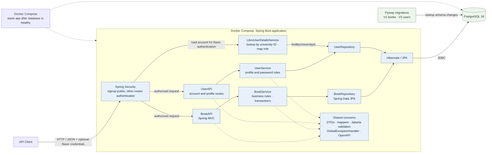
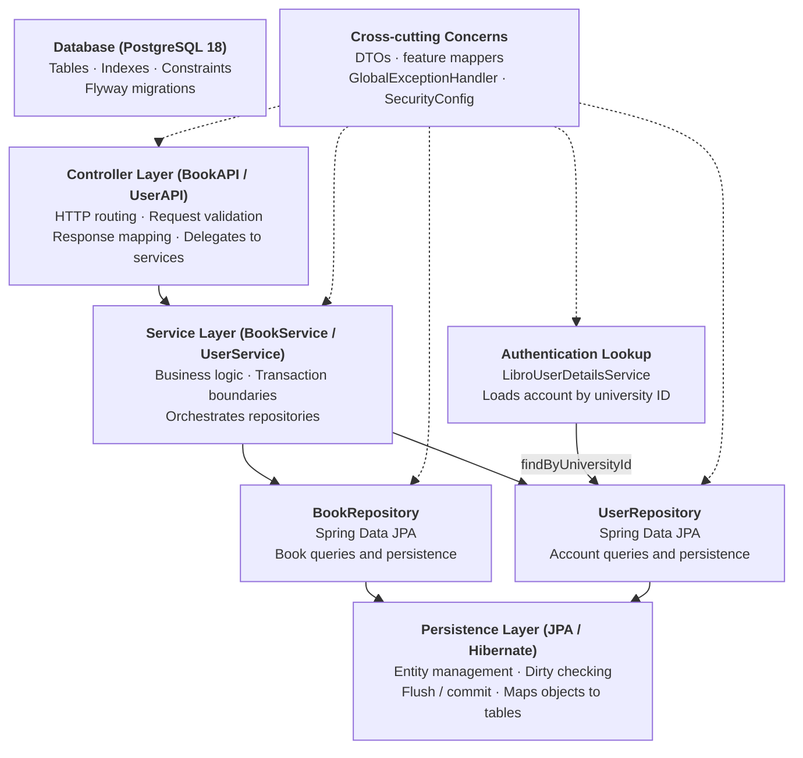

<h1 align="center">Libro - Library Management System</h1>

<p align="center">
  
</p>


Libro is a Spring Boot REST API and Library Management System. It manages books with CRUD operations, search, pagination, sorting, range filtering, genre analytics, and statistics. It also exposes user account and profile routes for creation, listing, lookup, profile updates, password changes, and deletion. Loan HTTP APIs are not implemented. The prototype uses DTO-driven validation, centralized exception handling, and a Docker-first workflow backed by PostgreSQL 18 with Flyway database migrations.

The institutional context behind the user domain is documented in [Institutional Context](docs/institutional-context.md), including its ASU-CCS setting and alignment with existing MIS identity conventions.

The current domain decision is documented in [Domain Decisions](docs/domain-decisions.md): each `Book` represents one physical borrowable copy, so one copy can be assigned to only one active borrower at a time. Separate copies of the same title are separate records.

The API exposes generated OpenAPI documentation through Springdoc. Swagger UI is available at `/swagger-ui.html` and the machine-readable specification is available at `/v3/api-docs` when the application is running; both require HTTP Basic authentication under the current catch-all security rule. `POST /app/users/signup` is the only unauthenticated route. Other routes require a university ID and password. CSRF protection remains enabled, so unsafe requests also need a valid CSRF token. See the [API Documentation Guideline](docs/api-documentation-guideline.md) for the project standard.

Main Developer: **Aldrin Kyle Delfin**

## Tech Stack

| Layer | Technology / Framework |
| --- | --- |
| Language | Java 25 |
| Framework | Spring Boot 4.1.0 (Web, Data JPA, Security, Validation) |
| Database | PostgreSQL 18 |
| Migrations | Flyway 13.3.0 |
| Containerization | Docker & Docker Compose |
| Build Tool | Maven 3.x |
| Code Generation | Lombok 1.18.46 |
| Testing | JUnit 5, Mockito, Testcontainers, JaCoCo |
| Serialization | Jackson (JSON) |
| Validation | Jakarta Bean Validation |
| Logging | SLF4J via Lombok `@Slf4j` |

## Table of Contents

* [Architecture Overview](https://github.com/kyledelfin2006/library-api-system#architecture-overview)
* [Layered Design](https://github.com/kyledelfin2006/library-api-system#layered-design)
* [File Structure](https://github.com/kyledelfin2006/library-api-system#file-structure)
* [Core Design Patterns](https://github.com/kyledelfin2006/library-api-system#core-design-patterns)
* [Key Features](https://github.com/kyledelfin2006/library-api-system#key-features)
* [Request Lifecycle](https://github.com/kyledelfin2006/library-api-system#request-lifecycle)
* [Code Highlights](https://github.com/kyledelfin2006/library-api-system#code-highlights)
* [API Endpoints](https://github.com/kyledelfin2006/library-api-system#api-endpoints)
* [Setup & Installation](https://github.com/kyledelfin2006/library-api-system#setup--installation)
* [Troubleshooting](https://github.com/kyledelfin2006/library-api-system#troubleshooting)
* [Data Management](https://github.com/kyledelfin2006/library-api-system#data-management)
* [Testing](https://github.com/kyledelfin2006/library-api-system#testing)
* [Documentation](#documentation)
* [Development Problems Solved](#development-problems-solved)
* [Upcoming Improvements](https://github.com/kyledelfin2006/library-api-system#upcoming-improvements)
* [License](https://github.com/kyledelfin2006/library-api-system#license)

## Documentation

This README is the project's main portfolio entry point. The development reflection is the featured supporting document; the other references explain the system's context, decisions, API contract, contributor practices, and remaining work.

1. [Development Problems Solved](docs/development-problems-solved.md) is the portfolio reflection: it explains major problems, their impact, the fixes, and how the results were verified.
2. [Institutional Context](docs/institutional-context.md) describes the ASU-CCS academic model and existing MIS assumptions behind the user domain.
3. [Domain Decisions](docs/domain-decisions.md) explains why a `Book` represents one physical copy and what that means for future loan features.
4. [API Documentation Guideline](docs/api-documentation-guideline.md) sets the standard for accurate OpenAPI and Swagger documentation without unnecessary annotation boilerplate.
5. [Implementation Plan: Remaining Quality Improvements](docs/implementation-plan-quality-improvements.md) tracks the remaining OpenAPI maintainability work.
6. [Agent and Contributor Guide](AGENTS.md) records the architecture, layer contracts, coding rules, testing expectations, and definition of done. It stays at the repository root so coding agents can discover it automatically.
7. [Development TODO](internal-docs/TODO.md) tracks completed user-domain work and remaining authorization, loan, testing, and documentation tasks. It is a working roadmap, not part of the public API contract.

## Architecture Overview

The system runs as a Spring Boot API alongside PostgreSQL. Book and user requests pass through the HTTP, business, and persistence layers; Flyway prepares the schema at startup. Shared validation, mapping, security configuration, and error handling support the API. `UserRepository` has two clear consumers: `UserService` for account use cases and `LibroUserDetailsService` for the account lookup Spring Security needs during HTTP Basic authentication.



The authentication branch is separate from user account operations. For a protected request, Spring Security asks `LibroUserDetailsService` to load the account by university ID; that service reads the same `UserRepository` used by `UserService`, then returns Spring Security's user details with the stored password hash and mapped role. Signup is permitted without authentication; the remaining routes require authentication. Controllers do not access the repository directly.

### Layered Design



Both user flows converge on `UserRepository`: `UserService` uses it for signup, profile, and password operations; `LibroUserDetailsService` uses it only to load the account Spring Security authenticates. The authentication lookup does not route through `UserAPI` or `UserService`.

## File Structure

```text
AGENTS.md
README.md
docs/
  api-documentation-guideline.md
  development-problems-solved.md
  domain-decisions.md
  institutional-context.md
  implementation-plan-quality-improvements.md
internal-docs/
  TODO.md

src/main/java/app/
  LibraryApplication.java
  auth/
    SecurityConfig.java
  book/
    controller/
      BookAPI.java
    service/
      BookService.java
    repository/
      BookRepository.java
      projection/
        GenreCount.java
        LibraryAggregate.java
    entity/
      Book.java
    dto/
      BookRequestDTO.java
      BookPatchRequestDTO.java
      BookResponseDTO.java
      LibraryStatisticsDTO.java
    mapper/
      BookMapper.java
    exceptions/
      BookNotFoundException.java
      BookValidationException.java
  global/
    config/
      OpenApiConfig.java
    exceptions/
      GlobalExceptionHandler.java
    responses/
      ApiResponse.java
      ErrorResponse.java
  user/
    config/PasswordConfig.java
    controller/UserAPI.java
    dto/
      ChangePasswordDTO.java
      UserCreateRequestDTO.java
      UserCreateUpdateDTO.java
      UserResponseDTO.java
    entity/
      User.java
      enums/
        UserCourse.java
        UserITMajor.java
        UserRole.java
    mapper/UserMapper.java
    repository/UserRepository.java
    exception/UserNotFoundException.java
    service/UserService.java
    validation/PasswordPolicy.java

src/main/resources/
  application.properties
  db/
    migration/
      V1__create_books_table.sql
      V2__create_users_table.sql

src/test/java/
  unit/
    book/
      BookApiMvcTest.java
      BookMapperTest.java
      BookTest.java
      BookServiceTest.java
    user/
      UserApiMvcTest.java
      UserServiceTest.java
    global/
      GlobalExceptionHandlerTest.java
      OpenApiMvcTest.java
  integration/
    PostgresTestConfig.java
    book/
      BookPersistenceIT.java
    user/
      UserPersistenceIT.java

src/test/resources/
  junit-platform.properties
  logback-test.xml
```

## Core Design Patterns

- **Layered Architecture** keeps HTTP, business, and persistence concerns separate and testable.
- **DTO-based request handling** protects the entity model and keeps validation at the boundary.
- **Transactional service methods** rely on Hibernate dirty checking, so updates are flushed automatically when the managed entity changes.
- **Centralized exception handling** ensures consistent JSON failures across validation, not-found, database, and parsing errors.
- **Repository abstraction** through Spring Data JPA keeps persistence code small and expressive.
- **Typed repository projections** give aggregate queries named fields instead of positional `Object[]` values. `LibraryAggregate` and `GenreCount` are internal immutable projections; public endpoints retain their existing DTO/map response shapes.
- **Mapper pattern** centralizes entity-DTO conversion to avoid duplication across controllers and services.
- **Flyway migrations** version the database schema alongside application code.

## DTO-Wrapped Entity Models

The application never exposes `Book` (or future entity) objects directly to clients. All inbound data is wrapped in request DTOs, and all outbound data is wrapped in response DTOs.

### Rules

- **Never** instantiate an entity directly from client input.
- **Never** return an entity directly in a controller response.
- Controllers accept request DTOs (`BookRequestDTO` for create/PUT and `BookPatchRequestDTO` for PATCH) and return response DTOs.
- `BookMapper` is the sole conversion point between entities and DTOs.

### Why This Matters

1. **Decouples the entity model from the client-facing API**
   The database schema can evolve independently of the API contract. If a column is renamed or removed in the database, only the mapper and entity need to change; the JSON contract stays stable.

2. **Ties the entity model only to the database**
   Entities represent persistence state, not API state. This keeps JPA/Hibernate concerns isolated and prevents accidental leakage of database-only fields (e.g., audit timestamps, soft-delete flags) into API responses.

3. **Prevents accidental data leaks**
   Response DTOs explicitly choose which fields are exposed. Sensitive or internal fields never appear in JSON unless intentionally added to the response DTO.

4. **Enforces request validation at the boundary**
   `BookRequestDTO` carries Jakarta Validation annotations (`@NotBlank`, `@Size`, `@NotNull`, `@Positive`). `@Valid` triggers them for create and PUT. PATCH uses a separate optional `BookPatchRequestDTO`; service logic validates supplied values without marking omitted fields as required in OpenAPI.

5. **Allows response customization**
   Response DTOs can reshape, rename, compute, or omit fields without changing the entity. For example, `LibraryStatisticsDTO` aggregates data from multiple repository calls into a single read-only snapshot.

### Example

```java
// Controller accepts only the request DTO
@PostMapping("/add")
public ResponseEntity<ApiResponse<BookResponseDTO>> addBook(@Valid @RequestBody BookRequestDTO input) {
    Book newBook = service.addBook(input);           // DTO -> Entity inside service/mapper
    return ResponseEntity.status(HttpStatus.CREATED)
            .body(new ApiResponse<>(true, "Book Added Successfully", mapper.toResponseDTO(newBook)));
}
```

## Key Features

- CRUD operations for books.
- Each `Book` represents one physical borrowable copy. Duplicate titles and authors are allowed because separate copies have separate generated IDs; the model does not yet include an ISBN or edition key.
- Pagination and sorting through `GET /app/books/all` and paginated filtering through `GET /app/books/query`.
- Advanced search by title, author, genre, or price.
- Price range filtering through `GET /app/books/price`.
- Budget filtering through `GET /app/books/budget`.
- Statistics endpoints for total books, total library value, average price, and the most expensive book.
- Genre distribution endpoint.
- User-domain API for account creation, profile lookup and updates, password changes, and deletion; the service applies duplicate checks, academic business rules, and BCrypt password hashing.
- OpenAPI 3 documentation through Springdoc Swagger UI and `/v3/api-docs`, with operation-specific behavior, DTO schemas, and expected error responses.
- Validation with `@Valid` on create and replace requests.
- Global handling for `BookNotFoundException`, validation errors, malformed JSON, number format errors, database issues, and unsupported methods.
- Validation errors also include a `fieldErrors` map keyed by request field (or `_global` when no field is available), so clients can render precise messages without parsing the combined `details` string.
- HTTP Basic authentication through Spring Security; signup is public and other routes require authentication.
- Versioned database schema via Flyway.

## Request Lifecycle

### Create flow (`POST /app/books/add`)

1. Client sends a JSON payload to `/app/books/add`.
2. `BookAPI` receives the request and binds it to `BookRequestDTO`.
3. `@Valid` triggers Jakarta Validation on the DTO.
4. On success, `BookService.addBook()` converts the DTO to an entity via `BookMapper`.
5. `BookRepository.save()` persists the entity and returns the generated ID.
6. The controller maps the saved entity to `BookResponseDTO` and returns `201 Created`.

### Update flow (`PATCH /app/books/{id}`)

1. The controller passes `BookPatchRequestDTO` to `BookService.patchBook()`.
2. The service loads the managed `Book` entity via `findBookById()`.
3. Field changes are applied conditionally to the managed entity.
4. Hibernate dirty checking detects the modifications.
5. The transaction commits and flushes the update without an explicit `save()` call.

### Startup flow

1. Compose waits until PostgreSQL passes `pg_isready`.
2. Spring Boot starts `app.LibraryApplication`.
3. The Spring Boot Flyway starter runs pending migrations before JPA initializes.
4. Hibernate validates the migrated schema with `ddl-auto=validate`.
5. `SecurityConfig` permits `POST /app/users/signup`, applies role rules to book and account operations, and retains HTTP Basic authentication and CSRF protection.
6. The API becomes ready at `http://localhost:8080`.

## Code Highlights

### DTO validation on create

```java
@PostMapping("/add")
public ResponseEntity<ApiResponse<BookResponseDTO>> addBook(@Valid @RequestBody BookRequestDTO input) {
    Book newBook = service.addBook(input);
    return ResponseEntity.status(HttpStatus.CREATED)
            .body(new ApiResponse<>(true, "Book Added Successfully", mapper.toResponseDTO(newBook)));
}
```

### Partial Updates: PUT vs PATCH

Separate request types make the OpenAPI schema match each contract:

| PUT (replacement) | PATCH (partial update) |
| --- | --- |
| `BookRequestDTO`; every field is required and validated. | `BookPatchRequestDTO`; every field is optional. Omitted/null fields and blank text values are ignored. |
| Replaces all mutable fields. | Changes only supplied fields; a supplied price must be positive. |

Both service operations update a managed entity inside a transaction; Hibernate dirty checking persists the change.
### Centralized API errors

```java
@ExceptionHandler(BookNotFoundException.class)
public ResponseEntity<ErrorResponse> handleBookNotFound(BookNotFoundException ex) {
    ErrorResponse error = new ErrorResponse("Book not found", ex.getMessage(), 404);
    return ResponseEntity.status(HttpStatus.NOT_FOUND).body(error);
}
```

### Statistics aggregation

```java
public LibraryStatisticsDTO getLibraryStatistics() {
    LibraryAggregate aggregate = repository.getCountAndTotalValue();
    Book mostExpensive = repository.findTopByOrderByPriceDesc();
    BookResponseDTO mostExpensiveDTO = (mostExpensive != null) ? mapper.toResponseDTO(mostExpensive) : null;
    return new LibraryStatisticsDTO(
            aggregate.totalBooks(),
            aggregate.totalValue(),
            mostExpensiveDTO
    );
}
```

`LibraryAggregate` and `GenreCount` are internal immutable repository projections. They keep count, total-value, and genre-distribution queries type-safe while `LibraryStatisticsDTO` and the genre endpoint's `Map<String, Long>` remain the public API response models.

## API Endpoints

| Method | Path | Description | Example Request | Example Response |
| --- | --- | --- | --- | --- |
| `GET` | `/app/books/health` | Health check for the API | `GET /app/books/health` | `{"success":true,"message":"Health check","data":{"api":true,"database":true},"timestamp":172...}` |
| `GET` | `/app/books/all` | Returns a paginated list of books | `GET /app/books/all?page=0&size=12&sort=id,asc` | `{"content":[{"id":1,"title":"1984","author":"George Orwell","genre":"Dystopian","price":19.99}],"pageable":{...}}` |
| `GET` | `/app/books/query` | Paginates books with optional title, author, genre, and inclusive price filters | `GET /app/books/query?author=orwell&minPrice=10&sort=price,desc&page=0&size=12` | `{"content":[{"id":1,"title":"1984","author":"George Orwell","genre":"Dystopian","price":19.99}],"totalElements":1,"totalPages":1,...}` |
| `GET` | `/app/books/{id}` | Fetches a single book by ID | `GET /app/books/1` | `{"id":1,"title":"1984","author":"George Orwell","genre":"Dystopian","price":19.99}` |
| `POST` | `/app/books/add` | Creates a new book using `BookRequestDTO` validation | `POST /app/books/add` with `{"title":"1984","author":"George Orwell","genre":"Dystopian","price":19.99}` | `{"success":true,"message":"Book Added Successfully","data":{"id":1,"title":"1984","author":"George Orwell","genre":"Dystopian","price":19.99},"timestamp":172...}` |
| `PATCH` | `/app/books/{id}` | Partially updates a book | `PATCH /app/books/1` with `{"price":15.99}` | `{"success":true,"message":"Book updated successfully","data":{"id":1,"title":"1984","author":"George Orwell","genre":"Dystopian","price":15.99},"timestamp":172...}` |
| `PUT` | `/app/books/{id}` | Replaces a book completely | `PUT /app/books/1` with full DTO payload | `{"success":true,"message":"Book updated successfully","data":{"id":1,"title":"Animal Farm","author":"George Orwell","genre":"Political Satire","price":12.99},"timestamp":172...}` |
| `DELETE` | `/app/books/{id}` | Deletes a book by ID | `DELETE /app/books/1` | `{"success":true,"message":"Book deleted successfully","timestamp":172...}` |
| `GET` | `/app/books/search?type=title&value=orwell` | Searches by title, author, genre, or price | `GET /app/books/search?type=author&value=orwell` | `[{"id":1,"title":"1984","author":"George Orwell","genre":"Dystopian","price":19.99}]` |
| `GET` | `/app/books/budget?maxPrice=20` | Returns books priced at or below the given value | `GET /app/books/budget?maxPrice=20` | `[{"id":1,"title":"1984","author":"George Orwell","genre":"Dystopian","price":19.99}]` |
| `GET` | `/app/books/sorted?category=title` | Returns books sorted by title, author, genre, price, or id | `GET /app/books/sorted?category=price` | `[{"id":2,"title":"Animal Farm","author":"George Orwell","genre":"Political Satire","price":12.99}]` |
| `GET` | `/app/books/genre` | Returns genre distribution counts | `GET /app/books/genre` | `{"Fiction":3,"Fantasy":2,"Dystopian":1}` |
| `GET` | `/app/books/price?minPrice=10&maxPrice=25` | Returns books within a price range | `GET /app/books/price?minPrice=10&maxPrice=25` | `[{"id":1,"title":"1984","author":"George Orwell","genre":"Dystopian","price":19.99}]` |
| `GET` | `/app/books/stats` | Returns total books, total value, and the most expensive book | `GET /app/books/stats` | `{"totalBooks":6,"totalValue":123.45,"mostExpensiveBook":{"id":4,"title":"...","author":"...","genre":"...","price":49.99}}` |
| `GET` | `/app/books/stats/average-price` | Returns the average price of all books | `GET /app/books/stats/average-price` | `{"success":true,"message":"Average Price of Collection: ","data":20.50,"timestamp":172...}` |
| `GET` | `/app/books/stats/count` | Returns the total number of books | `GET /app/books/stats/count` | `{"success":true,"message":"Book Collection Count","data":6,"timestamp":172...}` |

| `GET` | `/app/users` | Lists users with pagination | `GET /app/users?page=0&size=12` | Spring `Page<UserResponseDTO>` |
| `GET` | `/app/users/{universityId}` | Gets one user by university ID | `GET /app/users/2025-4321` | `UserResponseDTO` |
| `POST` | `/app/users/signup` | Creates a user account | `POST /app/users/signup` with `UserCreateRequestDTO` | `ApiResponse<UserResponseDTO>`, HTTP 201 |
| `POST` | `/app/users/faculty` | Administrator creates a faculty account | `POST /app/users/faculty` with `UserCreateRequestDTO` | `ApiResponse<UserResponseDTO>`, HTTP 201 |
| `PATCH` | `/app/users/{universityId}` | Updates supplied profile fields | `PATCH /app/users/2025-4321` with `UserCreateUpdateDTO` | `ApiResponse<UserResponseDTO>` |
| `PUT` | `/app/users/{universityId}` | Replaces profile fields | `PUT /app/users/2025-4321` with `UserReplaceRequest` | `ApiResponse<UserResponseDTO>` |
| `PUT` | `/app/users/{universityId}/password` | Changes password after current-password verification | `PUT /app/users/2025-4321/password` with `ChangePasswordDTO` | `ApiResponse<Void>` |
| `DELETE` | `/app/users/{universityId}` | Administrator deletes a student or faculty account | `DELETE /app/users/2025-4321` | `ApiResponse<Void>` |

`/app/books/query` combines supplied filters with AND. Text matching is case-insensitive literal substring matching; `minPrice` and `maxPrice` are inclusive and either may be used alone. Without filters, it returns all books as a page. Pages start at 0, default to size 12 and `id` ascending, and are capped at size 100. Sort with `sort=property,direction` using `id`, `title`, `author`, `genre`, or `price`; invalid ranges, decimals, or sort fields return HTTP 400. Existing list routes retain their response shapes.

### User API

User routes are available under `/app/users` for signup, paginated listing, lookup by university ID, profile PATCH/PUT, password changes, and deletion. Signup is public and always creates a student, regardless of a supplied role value. Only administrators can create faculty accounts or delete student/faculty accounts. Students can read and search books; faculty and administrators can also add, update, and delete books. HTTP Basic authentication uses a university ID and password. Flyway V2 seeds one bootstrap administrator as `0000-0000`; set `LIBRO_ADMIN_PASSWORD_HASH` to a BCrypt hash before startup and protect that configuration. The seeded account uses `admin@library.local`. Loan routes are not implemented.

## Setup & Installation

### Recommended: Docker

Docker is the preferred way to run the project because it brings up both PostgreSQL 18 and the Spring Boot application together.

1. Create your environment file from the example:
    ```bash
    copy envFileExample .env
    ```
    Use values like:
    ```env
    POSTGRES_DB=librarydb
    POSTGRES_USER=admin
    POSTGRES_PASSWORD=change_me
    LIBRO_ADMIN_PASSWORD_HASH=<BCrypt hash for a password you choose>
    ```
    Replace the hash placeholder before starting the app. Flyway V2 seeds the administrator as university ID `0000-0000`; only the BCrypt hash is stored in the database. Keep `.env` private.
2. Build the application jar:
    ```bash
    mvn clean package
    ```
3. Start the full stack:
    ```bash
    docker compose up --build
    ```
4. Open [Swagger UI](http://localhost:8080/swagger-ui.html) to explore and try the API endpoints. The raw OpenAPI specification is available at [`http://localhost:8080/v3/api-docs`](http://localhost:8080/v3/api-docs). Both routes require HTTP Basic authentication. Swagger UI is an interactive API reference; it does not deploy the service. Unsafe requests are subject to CSRF protection as well as authentication rules.

### Local development

If you prefer to run the application directly on the host machine, start only PostgreSQL with Docker and then run Spring Boot locally.

1. Start the database:
    ```bash
    docker compose up db
    ```
2. Set the datasource environment variables:
    ```bash
    $env:SPRING_DATASOURCE_URL="jdbc:postgresql://localhost:5432/librarydb"
    $env:SPRING_DATASOURCE_USERNAME="admin"
    $env:SPRING_DATASOURCE_PASSWORD="change_me"
    ```
3. Run the app:
    ```bash
    mvn spring-boot:run
    ```

## Troubleshooting

| Symptom | Likely Cause | Fix |
| --- | --- | --- |
| App fails to start with datasource errors | Missing or incorrect `SPRING_DATASOURCE_*` variables | Check `.env` and Docker Compose values |
| `400 Bad Request` on create or replace | Validation failed in `BookRequestDTO` | Make sure `title`, `author`, `genre`, and `price` are valid |
| `Invalid JSON format in request body` | Malformed request payload | Send valid JSON and set `Content-Type: application/json` |
| `Book not found` | The requested ID does not exist | Verify the ID with `GET /app/books/all` |
| `Invalid Number Format` | Non-numeric values were sent to a numeric endpoint | Use numeric values for `price`, `minPrice`, `maxPrice`, and similar fields |
| `Method not allowed` | Wrong HTTP verb was used | Match the method listed in the endpoint table |
| Docker app container fails to start | The jar was not built before `docker compose up --build` | Run `mvn clean package` first |
| Swagger UI loads but API calls fail, or `library-app` keeps restarting | Inspect `docker compose logs app`; the old empty development volume may have `books.id` as `INTEGER` while Hibernate expects `BIGINT` | Rebuild the jar, remove the disposable pre-release volume with `docker compose down -v`, then run `docker compose up -d --build` |
| No Flyway messages or `flyway_schema_history` table | The Boot 4 Flyway starter is absent, or the container contains an old jar | Keep `spring-boot-starter-flyway`, rebuild the jar, and rebuild the image |

The complete diagnosis, pre-release reset procedure, clean-install behavior, and production-data warning are in [Development Problems Solved](docs/development-problems-solved.md).

## Quick Start

1. Copy `envFileExample` to `.env` and fill in PostgreSQL credentials.
2. Run `mvn clean package`.
3. Run `docker compose up --build`.
4. Open `http://localhost:8080/app/books/health`.

## Data Management

- PostgreSQL 18 stores all book records.
- Flyway manages schema changes via versioned SQL migrations in `src/main/resources/db/migration/`.
  - `V1__create_books_table.sql` creates the `books` table with the `created_at` column and indexes.
  - `V2__create_users_table.sql` creates the users table with role, course, major, identity-format, uniqueness, and relationship constraints.
- Compose no longer mounts SQL into PostgreSQL's init directory; Flyway is the only schema owner.
- V1 uses `BIGSERIAL`, matching the entity's Java `Long`/SQL `BIGINT` mapping from the first migration.
- The app uses JPA and Hibernate for entity persistence with `ddl-auto=validate`.
- `Book.createdAt` maps to `books.created_at` and is set automatically on insert. It is intentionally omitted from `BookResponseDTO`, so clients do not receive it and cannot provide it through create, patch, or replace requests.
- Updates rely on Hibernate dirty checking inside transactional service methods.
- `BookRequestDTO` validates create and replacement requests; `BookPatchRequestDTO` describes optional PATCH fields. `BookResponseDTO` and `LibraryStatisticsDTO` shape book responses.
- `BookMapper` centralizes conversion between entities and DTOs.
- `UserService` normalizes identity values, checks duplicates, enforces academic rules, validates create requests with Jakarta Validator, bounds passwords to 8–72 characters before BCrypt processing, and persists only BCrypt-hashed passwords.
- `UserMapper` keeps password fields out of `UserResponseDTO`.
- `UserAPI` delegates user operations to `UserService` and returns DTOs rather than entities. Its routing and serialization have MVC-slice coverage.

## Testing

The project uses JUnit 5, Mockito, AssertJ, Jakarta Validator, Testcontainers, and JaCoCo. The default Docker-free suite covers book and user MVC contracts, generated OpenAPI security-sensitive schemas, services, DTOs, mappings, and exception handling. The opt-in PostgreSQL profile checks Flyway startup, Hibernate schema validation, repository queries/projections, transaction dirty checking, and database constraints. PostgreSQL integration execution requires Docker.

Tests are grouped by test scope and domain: `src/test/java/unit/auth`, `src/test/java/unit/book`, `src/test/java/unit/user`, and `src/test/java/unit/global`; PostgreSQL integration tests live under `src/test/java/integration/book` and `src/test/java/integration/user`. Keep new tests with the domain they exercise. Shared PostgreSQL test configuration lives directly under `integration` so both integration classes use one Spring context and container.

- `BookTest` verifies book construction and request DTO constraints.
- `BookApiMvcTest` verifies routes, status codes, JSON response shapes, invalid request payloads, pagination/query binding, and global exception responses without starting JPA or PostgreSQL.
- `BookMapperTest` verifies field mapping, null handling, list mapping, empty-list handling, and that `createdAt` is omitted from response JSON.
- `BookServiceTest` verifies service rules, repository interaction, search, sorting, pricing, typed statistics projections, genre-distribution mapping, and dirty-checking expectations.
- `UserApiMvcTest` verifies all user routes, request binding and validation, paging defaults, direct DTO versus envelope response shapes, 404/409 error responses, and that public responses do not expose password fields. It mocks `UserService` and does not start JPA or PostgreSQL.
- `SecurityFlowMvcTest` exercises the real filter chain and `LibroUserDetailsService` with a mocked user repository: public signup, unauthenticated rejection, valid university-ID/password authentication, and incorrect-password rejection.
- `OpenApiMvcTest` generates `/v3/api-docs` in an MVC slice and checks representative routes, response codes, write-only password inputs, and absence of password fields in public responses without Docker.
- `GlobalExceptionHandlerTest` directly invokes the exception handlers and verifies HTTP status, public error fields, validation-message aggregation, and protection against leaking parser, database, constraint, or fallback exception details.
- `UserServiceTest` verifies partial-update normalization, DTO and business validation, password verification and encoding, unchanged-email handling, duplicate-email rejection, and dirty-checking expectations. Academic combinations still need focused coverage; `UserPersistenceIT` covers selected real-database paths.
- `BookPersistenceIT` runs only with the `integration` profile and Docker. It checks migrations/schema validation, PostgreSQL book queries and projections, and committed PATCH/PUT updates.
- `UserPersistenceIT` checks normalized user creation, stored password hashes, committed profile/password changes, and PostgreSQL uniqueness and ID-format constraints. Both integration classes share a PostgreSQL 18 container and serialize access to it; their runtime verification still depends on a working Docker daemon.

### Unit-test performance

The suite is configured for fast, deterministic feedback:

- Test classes run concurrently through `junit-platform.properties`, while methods inside each class remain sequential to protect shared fixtures.
- PostgreSQL integration classes use a shared JUnit resource lock so their shared container state cannot race across classes. Read-only schema checks do no cleanup; repository query fixtures roll back, and write tests clean up their rows.
- `BookServiceTest` creates its repository mock and service once, resets the mock before each scenario, and uses the real stateless `BookMapper`.
- `BookTest` creates one Jakarta `ValidatorFactory` for the class and closes it after all validation tests.
- `GlobalExceptionHandlerTest` uses one stateless handler and real Spring exception objects instead of unnecessary mocks.
- `logback-test.xml` disables application logs during tests so expected exception scenarios do not spend time printing stack traces.

Use `mvn test` for incremental feedback and `mvn clean verify` for the default verification lifecycle. Read test counts and failures from the reports produced by that run under `target/surefire-reports/`; the opt-in integration profile writes its results under `target/failsafe-reports/`. Build times depend on the machine, cache, and dependency downloads.

Run all unit tests:

```powershell
mvn clean test
```

Run PostgreSQL integration tests (requires Docker):

```powershell
mvn -Pintegration verify
```

Run only the global exception-handler tests:

```powershell
mvn -Dtest=GlobalExceptionHandlerTest test
```

Run only the user API MVC contract tests:

```powershell
mvn -Dtest=UserApiMvcTest test
```

Run only book unit/MVC tests:

```powershell
mvn -Dtest=BookApiMvcTest,BookMapperTest,BookServiceTest,BookTest test
```

Generate the JaCoCo report at `target/site/jacoco/index.html`:

```powershell
mvn clean verify
```

The default suite includes plain unit tests and MVC slices. It verifies HTTP Basic authentication and request protection through the real filter chain, while real JPA transactions, Flyway migrations, and PostgreSQL constraints require the Docker-backed integration profile. Role-based permissions are enforced for book and account operations; production identity-provider choices remain open.

Validation failures retain the `error`, `details`, `timestamp`, and `statusCode` fields and additionally return a structured map:

```json
{
  "error": "Validation failed",
  "details": "Title cannot be empty, Price must be greater than 0",
  "timestamp": 1720000000000,
  "statusCode": 400,
  "fieldErrors": {
    "title": "Title cannot be empty",
    "price": "Price must be greater than 0"
  }
}
```

## Development Problems Solved

The detailed, interview-ready account of the development problems I identified and solved is in [Development Problems Solved](docs/development-problems-solved.md). It consolidates the former gap and Docker/Flyway problem documents into one reflective reference.

## Upcoming Improvements

- Inspect the generated OpenAPI document and Swagger UI with the application and database running; verify parameter defaults, request/response schemas, statuses, errors, and examples against the implementation.
- Decide whether local HTTP Basic accounts are sufficient for deployment or whether Libro must integrate with institutional SSO.
- Add focused security tests for student, faculty, and administrator access decisions.
- Revisit CSRF handling and document the HTTP Basic scheme and CSRF requirements in OpenAPI before external use.
- Decide whether HTTP Basic remains appropriate or institutional SSO is required before deployment.
- Implement the loan domain with active-loan constraints and overdue/history queries, using the authenticated identity for borrower operations; document its API when routes are added.
- Run `mvn -Pintegration verify` on a Docker-enabled machine to execute the PostgreSQL integration tests; add them to CI when a CI workflow is introduced.
- Benchmark case-insensitive substring searches as the catalog grows; add database search indexes only if measurements justify them.

## License

No license file is currently included in the repository. Add one if you plan to distribute or reuse this project.
