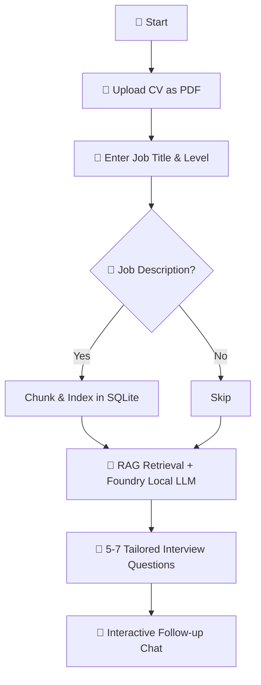

# 🩺 Interview Doctor

[](https://foundrylocal.ai/)
[](#)
[](https://nodejs.org/)
[](https://www.sqlite.org/)
[](LICENSE)
[-purple)](#rag-technique-how-retrieval-works-under-the-hood)

An AI-powered interview preparation assistant that runs **100% offline** on your local machine. Built with [Foundry Local](https://foundrylocal.ai/), SQLite, and JavaScript – no cloud, no API keys, no internet required.

Upload your CV/resume and a job description, and Interview Doctor generates tailored interview questions with coaching tips, all powered by a local LLM using Retrieval-Augmented Generation (RAG).


> **New to RAG?** Retrieval-Augmented Generation is a pattern where an AI model's answers are grounded in your own documents. Instead of relying solely on what the model learnt during training, RAG retrieves relevant chunks from your uploaded CV and job description and feeds them to the model as context. This dramatically reduces hallucination and makes the questions specific to *your* experience.

## How It Works



### Architecture


**How a query flows:**

1. The user uploads a CV (PDF) and enters a job title/level
2. The PDF text is extracted, chunked, and stored with TF-IDF vectors in SQLite
3. When generating questions, the engine retrieves the most relevant CV chunks
4. Those chunks are injected into the prompt as context for the local LLM
5. Foundry Local generates a response using Phi-3.5 Mini, grounded in the retrieved context
6. The response streams back to the user via SSE in the web UI

## Features

- **100% offline** – no internet, no cloud, no API keys, no outbound calls
- **RAG-powered** – answers grounded in your actual CV and job description
- **PDF support** – upload your CV as a PDF; text is extracted automatically
- **Streaming responses** – real-time SSE streaming in the web UI
- **Model loading progress** – visual progress bar whilst the model initialises
- **Document management** – upload additional documents, view indexed docs
- **Edge/compact mode** – toggle for constrained devices with limited resources
- **Interactive follow-up** – ask follow-up questions after initial question generation
- **Privacy-first** – all data stays on your machine; nothing leaves the device

<details>
<summary>📸 Edge Mode Screenshot</summary>


</details>

<details>
<summary>📸 Indexed Documents Panel</summary>


</details>

## Prerequisites

Before you begin, make sure you have:

- **Node.js ≥ 20** – [Download here](https://nodejs.org/)
- **Foundry Local** – Microsoft's on-device AI runtime
  ```bash
  # Windows
  winget install Microsoft.FoundryLocal

  # macOS
  brew install microsoft/foundrylocal/foundrylocal
  ```
- The **phi-3.5-mini** model (auto-downloaded on first run via the SDK, approximately 2 GB)

> **Tip:** Run `foundry model list` to check which models are already cached on your machine.

## Quick Start

```bash
# 1. Clone the repository
git clone https://github.com/leestott/interview-doctor-js.git
cd interview-doctor-js

# 2. Install dependencies
npm install

# 3. Ingest the sample interview guide documents
npm run ingest

# 4. Start the web server
npm start
# Open http://127.0.0.1:3000 in a browser
```

### What Happens at Startup

1. `npm run ingest` reads every `.md` file in `docs/`, splits them into overlapping chunks, computes TF-IDF vectors, and stores everything in `data/rag.db` (SQLite).
2. `npm start` launches Foundry Local, downloads and loads the Phi-3.5 Mini model (with progress shown in the UI), opens the vector store, and starts the Express server on port 3000.

## Using the Web UI

1. Open `http://127.0.0.1:3000` in your browser
2. Wait for the model to finish loading (a progress bar is shown)
3. Upload your CV (PDF, Markdown, or text file)
4. Enter the job title and seniority level
5. Optionally paste a job description for more targeted questions
6. Click **Generate Interview Questions**
7. Use the follow-up chat or quick-action buttons for deeper preparation


### Quick Actions

| Button | What it Does |
|--------|-------------|
| 💡 Coaching Tips | Detailed tips for answering each generated question |
| 💪 My Strengths | Identifies your strongest talking points from your CV |
| 🔍 Gap Analysis | Highlights gaps between your CV and the job requirements |
| 🎭 Mock Interview | Generates a mock interview with sample answers |
| 🧠 Behavioural Qs | Focuses on behavioural/STAR-method questions |

You can also ingest a PDF directly:
```bash
npm run ingest -- path/to/your-cv.pdf
```

## API Endpoints

| Method | Path | Description |
|--------|------|-------------|
| `POST` | `/api/chat` | Non-streaming chat completion |
| `POST` | `/api/chat/stream` | Streaming chat via SSE |
| `POST` | `/api/upload` | Upload a document (PDF/MD/TXT) to the knowledge base |
| `GET` | `/api/docs` | List indexed documents |
| `GET` | `/api/init-status` | Model initialisation status (SSE) |
| `GET` | `/api/health` | Health check |

## Project Structure

```
interview-doctor-js/
├── docs/                        # Interview guide documents (RAG knowledge base)
│   ├── 01-interview-categories.md
│   ├── 02-star-method.md
│   └── 03-technical-prep.md
├── public/
│   └── index.html               # Web UI (single-file, no build step)
├── src/
│   ├── chatEngine.js            # Foundry Local + RAG orchestration
│   ├── chunker.js               # Document chunking + TF-IDF vector computation
│   ├── config.js                # App configuration (model, paths, chunk sizes)
│   ├── ingest.js                # Batch document ingestion script
│   ├── pdfParser.js             # PDF text extraction (offline)
│   ├── prompts.js               # System prompts (full + compact/edge)
│   ├── server.js                # Express server + API endpoints
│   └── vectorStore.js           # SQLite-backed local vector store
├── test/                        # Unit tests (Node.js test runner)
│   ├── chunker.test.js
│   ├── config.test.js
│   ├── prompts.test.js
│   ├── server.test.js
│   └── vectorStore.test.js
├── data/                        # Generated at runtime
│   └── rag.db                   # SQLite vector database
├── uploads/                     # Uploaded CV files
├── package.json
├── AGENTS.md                    # AI agent instructions for this codebase
├── CONTRIBUTING.md              # Contributor guidelines
├── blog_post.md                 # Developer tutorial blog post
└── README.md
```

## How the RAG Pipeline Works

### 1. Document Ingestion (`src/ingest.js`)

Reads `.md` files from `docs/` and PDF files, parses optional YAML front-matter, then splits the content into overlapping chunks (default: approximately 200 tokens with 25-token overlap). Each chunk is stored with its TF-IDF vector in SQLite.

### 2. Vector Store (`src/vectorStore.js`)

A lightweight vector store backed by SQLite (via `sql.js`, pure JavaScript with no native compilation needed). Stores document chunks alongside their TF-IDF vectors. At query time, it cosine-similarity-ranks all chunks against the query vector and returns the top-K results.

### 3. Chat Engine (`src/chatEngine.js`)

Orchestrates the full RAG flow:
- Converts the user's question into a TF-IDF vector
- Retrieves the top-K most relevant chunks from SQLite
- Builds a prompt with system instructions + retrieved context + user question
- Sends it to the local Phi-3.5 Mini model via the native `ChatClient`
- Streams the response back chunk-by-chunk

### 4. PDF Parser (`src/pdfParser.js`)

Extracts plain text from PDF files using `pdf-parse`, working entirely offline with no external API calls.

### 5. System Prompts (`src/prompts.js`)

Two prompt variants:
- **Full mode**: detailed instructions for interview-focused, structured responses
- **Edge mode**: minimal prompt for constrained devices with limited context windows

## Running Tests

```bash
npm test
```

Tests use the built-in Node.js test runner (no extra dependencies). They cover the chunker, vector store, config, prompts, and server API contract.

## Scripts

| Name | Command | Description |
|------|---------|-------------|
| Ingest | `npm run ingest` | Chunk and index all docs into SQLite |
| Ingest PDF | `npm run ingest -- cv.pdf` | Ingest a specific PDF file |
| Start | `npm start` | Start the web server (production) |
| Dev | `npm run dev` | Start with auto-restart on file changes |
| Test | `npm test` | Run unit tests |

## Key Concepts for New Developers

### What is Foundry Local?

[Foundry Local](https://foundrylocal.ai/) is Microsoft's on-device AI runtime. It lets you run small language models (SLMs) like Phi-3.5 Mini directly on your laptop or workstation – no GPU required, no cloud dependency. The JavaScript SDK manages model discovery, download, and loading, then provides a native `ChatClient` for inference.

```javascript
import { FoundryLocalManager } from "foundry-local-sdk";

const manager = FoundryLocalManager.create({ appName: "my-app" });
const model = await manager.catalog.getModel("phi-3.5-mini");
await model.load();
const chatClient = model.createChatClient();

const response = await chatClient.completeChat([
  { role: "user", content: "Hello!" },
]);
```

### What is TF-IDF?

TF-IDF (Term Frequency–Inverse Document Frequency) is a classic information retrieval technique. Each document chunk is converted into a numeric vector based on how important each word is within that chunk relative to all chunks. At query time, the user's question is vectorised the same way and compared against all stored vectors using cosine similarity.

This project uses TF-IDF instead of embedding models to keep everything lightweight and offline – no embedding API or large model needed for retrieval.

### Why SQLite for Vectors?

For small-to-medium document collections (a CV plus job descriptions), SQLite is fast enough for brute-force cosine similarity search and adds zero infrastructure. No need for Pinecone, Qdrant, or Chroma – just a single `.db` file on disc.

## RAG Technique: How Retrieval Works Under the Hood

This project implements a **lightweight, fully offline RAG pipeline** using TF-IDF vectors and cosine similarity – no embedding models, no vector databases, no external services.

### The Pipeline

```
Document → Chunk → TF-IDF Vector → Store in SQLite
                                         │
Query → TF-IDF Vector → Cosine Similarity Search → Top-K Chunks → LLM Prompt
```

### 1. Chunking (`src/chunker.js`)

Documents are split into overlapping chunks of approximately 200 whitespace-delimited tokens with a 25-token overlap between consecutive chunks. The overlap ensures important context is not lost at chunk boundaries. These values are configurable in `src/config.js`:

| Parameter | Default | Effect |
|-----------|---------|--------|
| `chunkSize` | 200 tokens | Larger = more context per chunk, fewer chunks. Smaller = more precise retrieval. |
| `chunkOverlap` | 25 tokens | Higher overlap = better boundary coverage, but more storage. |
| `topK` | 5 | Number of chunks retrieved per query. Higher = more context, but may dilute relevance. |

### 2. TF-IDF Vectorisation

Each chunk is converted into a **term-frequency (TF) map** – a dictionary of `{word: count}` after:
- Lowercasing all text
- Removing punctuation and non-alphanumeric characters
- Filtering out approximately 100 common English stopwords (the, is, at, which, etc.)

This produces a sparse vector that captures which meaningful terms appear in each chunk and how often. No IDF weighting is applied at index time – the cosine similarity comparison inherently accounts for term specificity.

### 3. Cosine Similarity Retrieval

At query time, the user's question is vectorised the same way and compared against every stored chunk using **cosine similarity**:

$$\text{similarity}(A, B) = \frac{A \cdot B}{\|A\| \times \|B\|}$$

This measures the angle between two vectors, returning a score between 0 (no overlap) and 1 (identical term distribution). The top-K highest-scoring chunks are selected as context.

### 4. Context Injection

Retrieved chunks are formatted and injected into the system prompt alongside the user's question. The local LLM (Phi-3.5 Mini) then generates a response grounded in those specific document excerpts, dramatically reducing hallucination.

### Why TF-IDF Instead of Embeddings?

| Factor | TF-IDF (this project) | Embedding Models |
|--------|----------------------|-----------------|
| **Offline** | Yes – pure maths, no model needed | Requires an embedding model |
| **Speed** | Instant vectorisation | Model inference per chunk |
| **Storage** | Sparse vectors (small) | Dense vectors (larger) |
| **Quality** | Good for keyword-heavy docs (CVs, JDs) | Better for semantic similarity |
| **Dependencies** | Zero | Requires embedding model download |

For interview preparation (CVs, job descriptions, interview guides), TF-IDF works well because these documents are keyword-rich and the queries are typically about specific skills, technologies, or job requirements.

## Resetting the Database

To start fresh with a clean database, delete the SQLite file and re-ingest:

```bash
# Remove the existing database
rm data/rag.db          # macOS/Linux
del data\rag.db         # Windows (Command Prompt)
Remove-Item data\rag.db # Windows (PowerShell)

# Re-ingest the interview guide documents
npm run ingest

# Optionally ingest a new CV at the same time
npm run ingest -- path/to/your-cv.pdf
```

To clear only the uploaded documents but keep the interview guides, you can also delete files from `uploads/` and re-ingest:

```bash
# Remove uploaded files
rm -rf uploads/*              # macOS/Linux
Remove-Item uploads\* -Force  # Windows (PowerShell)

# Remove DB and re-ingest base docs only
rm data/rag.db
npm run ingest
```

> **Tip:** The database is a single file at `data/rag.db`. You can back it up by simply copying it, or version different knowledge bases by renaming the file.

## Adapting This for Your Own Use Case

This project is designed to be adapted:

1. **Replace the documents** in `docs/` with your own domain-specific content
2. **Edit the system prompt** in `src/prompts.js` to match your domain and tone
3. **Adjust chunk sizes** in `src/config.js` – smaller chunks for precise retrieval, larger for more context
4. **Swap the model** – change `config.model` to any Foundry Local-supported model (run `foundry model list`)
5. **Customise the UI** – the frontend is a single HTML file with inline CSS, easy to modify

## Comparison with Original Go Version

| Feature | Go (Original) | JavaScript (This Version) |
|---------|--------------|--------------------------|
| AI Backend | GitHub Copilot SDK (cloud) | Foundry Local (offline) |
| Connectivity | Requires internet | 100% offline |
| Document Storage | None (single-use) | SQLite RAG database |
| CV Processing | Copilot SDK attachment | pdf-parse + TF-IDF chunking |
| Follow-up Chat | No | Yes (interactive) |
| Document Upload | No | Yes (PDF, MD, TXT) |

## License

MIT – this is a learning sample. Fork it and make it yours.
