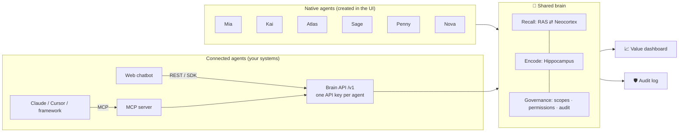

# 🧠 Agent Brain Hub

**English** · [Tiếng Việt](README.vi.md)

[](https://github.com/leluong141996-dev/Agent-Brain-Hub/actions/workflows/ci.yml)
[](https://github.com/leluong141996-dev/Agent-Brain-Hub/releases/latest)
[](LICENSE)


**One shared brain for all of a company's AI agents.** Create agents in the UI, or plug in agents that already run elsewhere through a REST API, an SDK or MCP. They all read and write **one** memory, so what one agent learns, every agent can use. Customers stop repeating themselves, agents hand off to each other without losing context, and the company builds up knowledge from every conversation.

The memory is organized like a human brain: 13 regions and a wake/sleep cycle, following the CoALA framework. The architecture draws on the *Vita Cognitive Memory Architecture* document. The UI lets you **watch each brain region work, live**, in **English · Tiếng Việt · 日本語**.

### Example

1. A customer tells **Kai**, the repair agent: *"My car is a Honda Civic, it broke down and will be in the shop for 3 days."*
2. Later they ask **Atlas**, the travel agent: *"I need a flight to Da Nang next week, window seat please."*
3. Atlas replies: *"I've got the context from Kai. I remember: no car for 3 days, no need to repeat it. I'll look for a suitable flight to Da Nang, window seat preferred. Also: a self-drive rental at the destination, would you like that?"*

Atlas never heard about the car. Kai wrote "car unavailable for 3 days" to **shared** memory, while the repair details stayed **private** to Kai.

## Quick start

With Docker, one command (no Node.js needed):

```bash
docker compose up -d                 # → http://localhost:4317 · data lives in the brain-data volume
docker compose --profile vllm up -d  # also runs Qwen3-4B locally on vLLM (NVIDIA GPU required)
```

Optional configuration: `cp .env.example .env`, then set `PORT`, `BRAIN_ADMIN_TOKEN`, LLM provider keys and so on. With the `vllm` profile, open **Settings → vLLM** and set the base URL to `http://vllm:8000/v1`. An LLM server already running on your machine (Ollama, LM Studio, vLLM) is reachable from the container at `http://host.docker.internal:<port>/v1`, for example `http://host.docker.internal:11434/v1` for Ollama.

Or with Node.js ≥ 22:

```bash
npm install
npm start                      # → http://localhost:4317  (UI)  ·  http://localhost:4317/v1  (Brain API)
npm test                       # unit tests + acceptance QA suite
npm run e2e -- --lang vi|en|ja # end-to-end test against the running server
```

Storage is **SQLite** via `better-sqlite3`. Prebuilt binaries exist for Linux, macOS and Windows; on other platforms `npm install` needs Python, make and a C++ compiler. Docker and an NVIDIA GPU are only needed to run a local model on vLLM.

It runs with zero configuration (offline mode: rules + templates). To use a real LLM, see [LLM providers](#llm-pick-a-provider-in-the-ui).

---

## Concept



| Screen | What it's for |
|---|---|
| 🧠 **Live brain** | Watch the signal travel through the 13 brain regions for every message, including messages from external agents over the API. Chat with native agents, see which store each piece of information came from, and inspect working, semantic, episodic and procedural memory. |
| 🤖 **Agents** | Create native or connected agents, toggle read/write permissions, issue and rotate API keys, and copy ready-made integration code (cURL, JS, Python, MCP). |
| 📈 **Business value** | Questions customers didn't have to answer again, cross-agent knowledge reuse, handoffs, suggestion acceptance rate, learned skills, blocked leaks, and a matrix of knowledge flowing between agents. |
| 🛡️ **Audit log** | Every read, write, block and API call: who read whose memory, for which customer, and when. Filter by operation and search. |
| ⚙️ **Settings** | Pick an LLM provider (Claude, GPT, Gemini, DeepSeek, local models…), fetch the model list, test the connection and apply it immediately. See storage details (SQLite file, size, row counts). |

The left sidebar holds navigation, model status, the **language** picker and the **light / dark / system** theme switch. The Live brain screen has a **customer** picker (the brain keeps a separate memory per customer). The UI uses color tokens for both themes, one consistent SVG icon set, and works down to phone width.

## Three ways to connect an agent

### 1. Native: create it in the UI
Go to **Agents → Create agent → Native**, pick a domain and a persona. The brain answers with the hub's LLM, and you can chat with the agent right away on the Live brain screen.

### 2. Connected via REST API / SDK
Create an agent of type **Connected**. It gets an API key, shown only once and stored as a hash. Your agent keeps using its own LLM, in this loop:

```
recall (get context) → your agent answers with its own LLM using promptBlock → remember (send the turn back so the brain learns)
```

```js
import { BrainClient } from './sdk/brain-client.js';
const brain = new BrainClient({ url: 'http://localhost:4317', apiKey: process.env.BRAIN_API_KEY });

const ctx = await brain.recall({ customerId: 'kh-001', text: userMessage, lang: 'en' });
const reply = await myLLM({ system: ctx.promptBlock, user: ctx.redactedText });
await brain.remember({ traceId: ctx.traceId, reply });
```

A sample agent you can run right away (open the UI next to it to watch the brain light up and the conversation appear in the chat):

```bash
BRAIN_API_KEY=abk_... npm run example
# optional: OWN_LLM_URL=http://localhost:8000/v1 OWN_LLM_MODEL=qwen3-4b BRAIN_LANG=en
```

### 3. MCP: for Claude Desktop/Code, Cursor and agent frameworks
[mcp/server.mjs](mcp/server.mjs) is a dependency-free MCP server over stdio. Each instance acts as one connected agent and exposes 4 tools: `brain_recall`, `brain_remember`, `brain_profile`, `brain_feedback`.

```bash
claude mcp add agent-brain -e BRAIN_URL=http://localhost:4317 -e BRAIN_API_KEY=abk_... -- node /path/to/repo/mcp/server.mjs
```

The Agents screen generates the `mcpServers` config for Claude Desktop and Cursor, with the path and key filled in.

## Brain API (`/v1`, header `Authorization: Bearer <agent key>`)

| Method | Path | Body / query | Returns |
|---|---|---|---|
| GET | `/v1/me` | | agent, domain, kind, permissions |
| POST | `/v1/recall` | `{customerId, text, lang, asOf?}` | `traceId, intent, salience, handoff, playbook, memories[]` (each with `from`, `updatedAt`, `validUntil`), `suggestedActions[], promptBlock, redactedText` |
| POST | `/v1/remember` | `{traceId \| userText, reply, facts?: [{relation, value}], outcome?: {actionId, accepted}, lang}` | `learned[]`, feedback |
| POST | `/v1/chat` | `{customerId, text, lang}` | the brain answers itself (native mode over the API) |
| POST | `/v1/feedback` | `{traceId, actionId, accepted}` | bandit update + skill promotion |
| GET | `/v1/profile` | `?customerId=&lang=` | the facts this agent is allowed to see |

`/v1` has CORS enabled, so agents running in a browser can call it too. The admin API `/api/*` (used by the UI) can be locked with `BRAIN_ADMIN_TOKEN`. `GET /healthz` needs no auth and is meant for Docker and load balancers.

## Governance

- **Memory scopes:**
  - `private`: only the owning domain can read it, for example health, income or a device fault;
  - `shared`: every agent with read permission can see it;
  - `global`: company policy.
- **Per-agent permissions** (toggle them on the agent's row in the Agents screen):
  - `readShared`: whether the agent may read shared memories written by other agents;
  - `write`: whether the agent may write to and learn into the brain. Partner agents can be read-only.
- **Single writer per entity:** each relation has exactly one domain allowed to write it. When another agent tries, the corpus callosum delegates the write to the owner.
- **Audit log:** records every `read`, `write`, `blocked` (a read refused because the memory is private or the agent lacks permission), `recall`, `remember`, `handoff` and `feedback`, together with the agent that originally wrote the memory. It is also the data source for the value dashboard.
- **Brainstem:** redacts PII (Vietnamese and Japanese phone numbers, email, card numbers, Vietnamese ID numbers) before anything is remembered, and has a crisis reflex in all 3 languages.
- **API keys:** stored as SHA-256 and compared in constant time. Keys can be rotated; the old key stops working immediately.

## Value dashboard: how the metrics are measured

| Metric | Definition (computed from the audit log) |
|---|---|
| **Questions customers didn't have to answer again** | Number of distinct facts that agent B read from memories written by agent A. Time saved is estimated at 20 seconds per question; the UI shows this assumption. |
| Cross-agent knowledge reuse | Total reads of memories written by another agent |
| Seamless handoffs | Times a customer switched agents and the context went along |
| Suggestion acceptance rate | 👍 / (👍 + 👎) for the next best action |
| Learned skills | Skills promoted by the cerebellum, with the number of runs done from a playbook |
| Blocked leaks | Private or unauthorized reads blocked by the RAS |
| Knowledge flow | Writer agent × reader agent matrix. Off-diagonal cells are shared knowledge. |

## Built-in agents

| Agent | Domain | Memory kept for | Scope |
|---|---|---|---|
| **Mia** | Personal assistant: profile, family, schedule, preferences | forever | shared |
| **Kai** | Repair & maintenance: cars, laptops, phones, home appliances | 90 days | shared |
| **Atlas** | Travel & transport | 1 year | shared |
| **Sage** | Health | 10 years | 🔒 private |
| **Penny** | Personal finance (the budget is deliberately shared, income is not) | 5 years | 🔒 private |
| **Nova** | Shopping & orders | 180 days | shared |

## Languages

Pick a language at the bottom of the sidebar; the choice is saved in the browser. It applies to:
- the UI and brain region labels;
- the label of every step in the trace;
- agent replies (both LLM and templates; Japanese uses polite keigo), session summaries and insights;
- the sample scenarios.

The memory itself is language-independent:
- Facts are extracted from Vietnamese, English or Japanese sentences (Japanese has its own rules, since it has no spaces).
- Embeddings include the labels in all 3 languages.
- A fact recorded in Vietnamese shows up with its Japanese label when 日本語 is selected.

The API takes a `lang: "vi" | "en" | "ja"` parameter.

## Memory architecture (13 brain regions)

| Region | Service | File |
|---|---|---|
| Thalamus | Context gateway: sessions, agent-switch detection, routing | [thalamus.js](server/brain/thalamus.js) |
| Brainstem | Guardrails: PII, crisis reflex, output compliance | [brainstem.js](server/brain/brainstem.js) |
| Amygdala | Salience: sentiment, urgency, churn risk, VIP → priority | [amygdala.js](server/brain/amygdala.js) |
| Corpus callosum | Handoff between agents, write delegation | [corpusCallosum.js](server/brain/corpusCallosum.js) |
| Prefrontal cortex | Working memory + executive loop, LLM calls | [prefrontal.js](server/brain/prefrontal.js), [respond.js](server/brain/respond.js) |
| Cerebellum | Playbooks, versioned skill promotion | [cerebellum.js](server/brain/cerebellum.js) |
| RAS | Retrieval: permissions → TTL → hybrid scoring → re-rank → token budget | [ras.js](server/brain/ras.js) |
| Neocortex | Episodic + semantic memory, hot/warm/cold tiers, contradictions, scoping | [neocortex.js](server/brain/neocortex.js), [ontology.js](server/brain/ontology.js) |
| Basal ganglia | Next best action (Thompson-sampling bandit), learns from feedback | [basalGanglia.js](server/brain/basalGanglia.js) |
| Hippocampus | Fact extraction (rules + LLM + explicit facts from the API), consolidation | [hippocampus.js](server/brain/hippocampus.js) |
| Synaptic pruning | Forgetting: TTL, replacement, decay | [forgetting.js](server/brain/forgetting.js) |
| Default mode network | Reflection: insights, skill review | [dmn.js](server/brain/dmn.js) |
| Audit | Who read or wrote what | [audit.js](server/brain/audit.js) |

The orchestrator [server/brain/index.js](server/brain/index.js) has three entry points that share the `perceive` phase (Thalamus → … → Basal ganglia):

- `think()`: native agents; the brain generates the reply.
- `recall()`: a connected agent fetches its context package.
- `remember()`: a connected agent sends the turn back so the brain can learn.

The sleep loop (`sleep()`) runs Hippocampus → Forgetting → DMN → Cerebellum.

### When the brain sleeps

Besides the **Run sleep cycle** button, the brain sleeps on its own ([sleepScheduler.js](server/brain/sleepScheduler.js)):

| Trigger | When | Default |
|---|---|---|
| **Idle** | A customer has been quiet long enough for the session to count as over, and turns are waiting | 30 min (the same gap that starts a new session) |
| **Pressure** | This many turns are waiting. Working memory keeps only the last 40, so without this, older turns would be dropped before reaching long-term memory | 24 turns |
| **Nightly** | Once a day, for every customer active since the previous night | 03:00 server time |

Change them in **Settings → Sleep cycle**, which also lists who is waiting to sleep and the recent runs with their trigger. Automatic runs show up live in the brain view like any other trace. Manual and automatic runs share one queue, so they never overlap. Environment variables set the defaults (`BRAIN_SLEEP_AUTO`, `BRAIN_SLEEP_IDLE_MINUTES`, `BRAIN_SLEEP_MAX_PENDING`, `BRAIN_SLEEP_NIGHTLY_AT`, see [.env.example](.env.example)). The Docker image runs in UTC: set `TZ`, for example `TZ=Asia/Ho_Chi_Minh`, so "03:00" means your night.

## Storage: SQLite

The whole brain lives in **one SQLite file**, `data/brain.db` (WAL mode), created automatically on first run.

| Table | Contents |
|---|---|
| `facts` | Semantic memory. Indexed columns `customer_id`, `relation`, `status`, `scope`, `owner_domain`, `source_agent_id`, `valid_until`, plus `embedding` (Float32 BLOB). |
| `episodes` | Episodic memory. Columns `customer_id`, `kind`, `scope`, `agent_id`, `created_at`, `expires_at` and `embedding`. |
| `audit` | Append-only audit log, **never truncated**. The value dashboard is computed in SQL over the full history. |
| `agents`, `customers`, `working`, `skills`, `patterns`, `bandit`, `insights`, `traces` | The rest of the brain, one JSON document per row. |
| `meta` | Schema version, simulated clock, id counters, usage stats. |

**How it works:**
- On startup the state is loaded into memory, which acts as a cache.
- After each change (batched over 300 ms), the server **writes only the rows that changed**, in one transaction.
- On SIGINT/SIGTERM the server flushes pending writes and closes the database cleanly.
- With 20,000 episodes: the first write takes about 0.2 s, each chat turn afterwards writes about 10 rows, and reloading on startup takes about 0.2 s.

You can **query it directly**, for example:
```bash
sqlite3 data/brain.db "SELECT relation, json_extract(data,'$.value'), scope FROM facts WHERE customer_id='kh-001'"
sqlite3 data/brain.db "SELECT source_agent_id, agent_id, COUNT(*) FROM audit WHERE op='read' GROUP BY 1,2"
```

**Backup:** `sqlite3 data/brain.db ".backup backup.db"` (safe while the server is running). Change the path with `BRAIN_DB`.

**Upgrading from older versions:** if `data/brain.json` (schema v3) exists, it is imported into SQLite on first run and the original file is renamed to `brain.imported.bak.json`. Change the legacy JSON path with `BRAIN_DATA`.

**Current limits:**
- Only **one server process** can run, because state is cached in memory.
- Vector search is still a linear scan in memory.

Both go away with the move to PostgreSQL + pgvector (see the [Roadmap](ROADMAP.md)).

## LLM: pick a provider in the UI

Open **Settings → Language model**. There you:
1. choose a provider;
2. enter the API key (it is stored only on the server, in `data/settings.json` with mode 0600, and never sent back to the browser);
3. click **Fetch models** to get model names straight from the provider, then **Test connection** and **Save & apply**.

Changes take effect immediately, with no restart.

| Provider | Protocol | Default base URL | Key environment variable |
|---|---|---|---|
| **Claude** (Anthropic) | Official Anthropic SDK | — | `ANTHROPIC_API_KEY` |
| **GPT** (OpenAI) | OpenAI Chat Completions | `https://api.openai.com/v1` | `OPENAI_API_KEY` |
| **Gemini** (Google) | OpenAI-compatible endpoint | `https://generativelanguage.googleapis.com/v1beta/openai` | `GEMINI_API_KEY` |
| **DeepSeek** | OpenAI-compatible | `https://api.deepseek.com/v1` | `DEEPSEEK_API_KEY` |
| **Mistral** | OpenAI-compatible | `https://api.mistral.ai/v1` | `MISTRAL_API_KEY` |
| **Groq** | OpenAI-compatible | `https://api.groq.com/openai/v1` | `GROQ_API_KEY` |
| **Grok** (xAI) | OpenAI-compatible | `https://api.x.ai/v1` | `XAI_API_KEY` |
| **OpenRouter** (hundreds of models) | OpenAI-compatible | `https://openrouter.ai/api/v1` | `OPENROUTER_API_KEY` |
| **Together** | OpenAI-compatible | `https://api.together.xyz/v1` | `TOGETHER_API_KEY` |
| **Ollama / vLLM / LM Studio** (local) | OpenAI-compatible | `localhost:11434` / `:8000` / `:1234` | not needed |
| **Custom** | Any OpenAI-compatible endpoint | your own | `BRAIN_LLM_API_KEY` |
| **Offline** | Rules + templates | — | — |

- The **main model** answers customers. The optional **utility model** handles fact extraction, session summaries and reflection; pick a cheap, fast one to save cost.
- **Adapts to each provider:** when a parameter is rejected (HTTP 400/422), the client adjusts and retries, and remembers it for next time:
  - `max_tokens` → `max_completion_tokens` (GPT reasoning models);
  - drop `temperature`;
  - drop JSON mode;
  - drop parameters specific to local servers.
- **Never goes down:** if the LLM fails, the brain falls back to rules + templates.
- **Environment variables** are only defaults until something is saved in the UI:
  - `BRAIN_LLM_PROVIDER`, `BRAIN_LLM_MODEL`, `BRAIN_LLM_BASE_URL`, `BRAIN_LLM_API_KEY`;
  - or just set one provider's key, for example `OPENAI_API_KEY`, and that provider is selected automatically;
  - `BRAIN_OFFLINE=1` disables all LLM calls;
  - `BRAIN_SETTINGS` changes the settings file path.

Run a local model on vLLM (Qwen3-4B fits a 12 GB GPU): `scripts/start-vllm.sh` (or `docker compose --profile vllm up -d`), then pick **vLLM** in Settings.

Notes on vLLM:
- The `latest` image needs NVIDIA driver ≥ 575. Override with `VLLM_IMAGE=…`.
- JSON requests use `temperature 0.1` to avoid a CUDA error in vLLM 0.10.2 when requests are batched together.

### Memory over time

Facts are **invalidated, not deleted**. When "I moved to Saigon" replaces "I live in Hanoi", the old fact keeps its dates and a link to the new one; when a fact's TTL passes, retrieval stops using it. Sleep purges these ended facts after a history period: 90 days by default, set in **Settings → Sleep cycle** or with `BRAIN_HISTORY_DAYS` (`0` deletes at once, as before v0.5).

You can ask **what the brain believed at any moment**:

```js
await brain.recall({ customerId, text: 'Book a taxi from my home', asOf: '2026-10-01T09:00:00Z' });
// → the address the brain knew then, not the current one
```


`asOf` works on `POST /v1/recall` and on the Live brain's Semantic and Episodic tabs (*View memory as of*). A look into the past is read-only: it changes no memory, is recorded in the audit log, and respects the same permissions. Each fact's replacement chain is at `GET /api/facts/:id/history`.

### Semantic search (embeddings)

By default, memories are matched with local feature-hashing vectors: no network, no setup, but only shared words count. To also find paraphrases ("Can I drive to the airport?" → "no car for 3 days"), pick an embedding model in **Settings → Semantic search**: OpenAI, Gemini, Ollama, vLLM, LM Studio or any OpenAI-compatible `/embeddings` endpoint. For Vietnamese and Japanese, `bge-m3` on Ollama is a good local choice.

- **Opt-in.** A provider key in the environment does not turn embeddings on; choose a provider in the UI or set `BRAIN_EMBED_PROVIDER` (plus `BRAIN_EMBED_MODEL`, `BRAIN_EMBED_BASE_URL`, `BRAIN_EMBED_API_KEY`).
- **Writes never wait on the network.** Every memory keeps its hashing vector; a background queue adds the model vector and re-indexes everything when you change the model. Settings shows the progress.
- **Retrieval waits up to 1.5 s** for the query embedding, then falls back to hashing. The live trace shows which similarity was used.
- **Privacy.** Only redacted text is embedded, but *all* memory text, including private scopes, is sent to the provider. Use a local model for sensitive data. Permissions are enforced after retrieval as before, so a similar private memory still never reaches the wrong agent.

## Benchmark

`npm run bench` scores the shared memory on 29 multi-agent scenarios: cross-agent recall, stale facts, contradictions, private-data leakage, multi-hop questions, long conversations, exact matches (order numbers, model names) and looking back in time, in English with Vietnamese and Japanese cases. It runs offline in under a second, and CI fails any change that makes a quality metric worse ([bench/README.md](bench/README.md)).

| v0.5.0 | Hashing (default, offline) | Hybrid with `bge-m3` (Ollama, CPU) |
|---|---|---|
| Scenario pass rate | 89.7% | **100%** |
| Recall accuracy | 91.2% | **100%** |
| Leak rate | **0%** | **0%** |
| Stale-use rate | **0%** | **0%** |
| Conflict handling | 100% | 100% |
| recall latency (p50) | 0.4 ms | 100 ms |
| Prompt tokens (mean) | 408 | 492 |

These are our own scenarios, so they compare versions of this project. With hashing, the remaining failures are paraphrases and multi-hop questions that share no words with the memory; the entity graph in v0.6 targets the multi-hop ones.

**On a public dataset.** `npm run bench:longmemeval` scores retrieval on [LongMemEval-S](https://huggingface.co/datasets/xiaowu0162/longmemeval-cleaned) (MIT, 470 questions, ~50 sessions each): is the session that holds the answer near the top? With local hashing it is in the top 4 for **52.8%** of questions and in the top 10 for **71.3%**. Preferences (20% @4) and questions that need every evidence session are the weak spots. Answer accuracy isn't measured yet.

**At scale.** A per-customer index keeps recall at p50 0.6 ms / p95 1.9 ms with 100,000 episodes (`npm run bench:scale`).

## Tests

- `npm test`: 82 unit tests, covering:
  - the acceptance QA suite from the architecture document: amnesia, contradiction, staleness, skill promotion, 20k-episode load;
  - permissions and prompt leakage;
  - English and Japanese;
  - connected agents (recall/remember), governance, key rotation, the value report;
  - the LLM layer: provider catalog, adapting to a strict mock OpenAI-style server, storing and masking keys, fetching model lists;
  - SQLite storage: data survives a reopen (embeddings included), only changed rows are written, the audit log is never truncated and SQL metrics match the in-memory computation, legacy JSON import, reset;
  - the automatic sleep cycle (idle, pressure, nightly), fact provenance in prompts, embedding providers (with a mock server), and the benchmark harness itself.
- `npm run bench`: the memory benchmark. 29 multi-agent scenarios (cross-agent recall, stale facts, contradictions, leakage, multi-hop, long conversations, exact matches, looking back in time) scored offline in under a second. Also `npm run bench:longmemeval` (public dataset, retrieval) and `npm run bench:scale` (latency with a large memory). See [bench/README.md](bench/README.md); adding a scenario is one JSON file.
- `npm run e2e -- --lang vi|en|ja`: 11 steps against a running server, with any LLM configuration (offline, Claude, GPT, local models…). Includes a connected agent through the SDK and the MCP server over stdio. The test uses a new customer so existing data is left alone, but it advances the simulated clock by 7 days.

## Project structure

```
server/
  index.js          HTTP: admin API /api, Brain API /v1 (API keys), SSE, static UI, /healthz
  brain/            13 brain regions, audit, orchestrator (think / recall / remember / sleep)
  agents.js         6 domains, vi/en/ja intents, next-best-action catalog, default permissions
  store.js          SQLite storage (in-memory cache + row-level writes, audit, legacy JSON import)
  embeddings.js     embedding providers (OpenAI-compatible /embeddings), opt-in
  i18n.js llm.js embed.js bus.js clock.js text.js
sdk/brain-client.js JS client for connected agents (no dependencies)
mcp/server.mjs      MCP server (stdio)
examples/           connected-agent.mjs: an external agent with its own LLM + the shared brain
public/             app.js (shell + brain screen), views/ (agents, value, audit, settings), i18n.js, icons.js, brain.js, styles.css (light/dark design tokens)
scripts/            start-vllm.sh, e2e.mjs
bench/              memory benchmark: scenarios/*.json, runner, report, results/ (baselines per version)
Dockerfile, docker-compose.yml, .env.example   one-command setup (data volume, /healthz health check, vllm profile)
.github/            CI (tests on Node 22/24 + Docker build + e2e), issue/PR templates
test/               brain.test.js (brain, acceptance QA), llm.test.js (LLM providers), store.test.js (SQLite)
data/               (created at runtime, gitignored) brain.db = SQLite memory, settings.json = LLM config + API keys
```

## Data & security when deploying

- All memory lives in `data/brain.db` (with Docker: the `brain-data` volume, mounted at `/app/data`); the LLM configuration and API keys live in `data/settings.json` (mode 0600). The whole `data/` folder is gitignored. **Don't commit it.**
- Without `BRAIN_ADMIN_TOKEN`, the admin UI and `/api/*` are **open to anyone who can reach the port**. Outside your own machine, set it (the UI asks for the token once) and put the server behind a reverse proxy with HTTPS.
- External agents can only use `/v1/*` with their own API key, and their reads and writes are limited by that agent's permissions.

## Roadmap

The goal: **the memory layer for multi-agent systems — correct over time, governed, and measured.** Next up:

| Version | Focus |
|---|---|
| ✅ **v0.3** | Memory benchmark with a CI gate; pluggable embedding models |
| ✅ **v0.4** | Hybrid retrieval, a per-customer index, LongMemEval retrieval, benchmarking a running hub |
| ✅ **v0.5** | Memory over time: facts invalidated not deleted, `recall({ asOf })`, fact history |
| **v0.6** | An entity graph: entity resolution, multi-hop retrieval |
| **v0.7** | Open-schema extraction, write-arbitration policies and agent trust scores |
| **v0.8** | Policy-as-code governance, PostgreSQL + pgvector, OpenTelemetry, multi-tenancy |

Details, principles and what's not planned: [ROADMAP.md](ROADMAP.md).

## Contributing

Contributions of all kinds are welcome: docs, translations, code. See [CONTRIBUTING.md](CONTRIBUTING.md) for how to run the project and the PR process. Issues labelled [`good first issue`](https://github.com/leluong141996-dev/Agent-Brain-Hub/labels/good%20first%20issue) are a good place to start; questions and ideas go to [Discussions](https://github.com/leluong141996-dev/Agent-Brain-Hub/discussions). Release history: [CHANGELOG.md](CHANGELOG.md).

License: [MIT](LICENSE).
