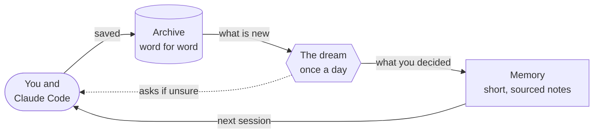
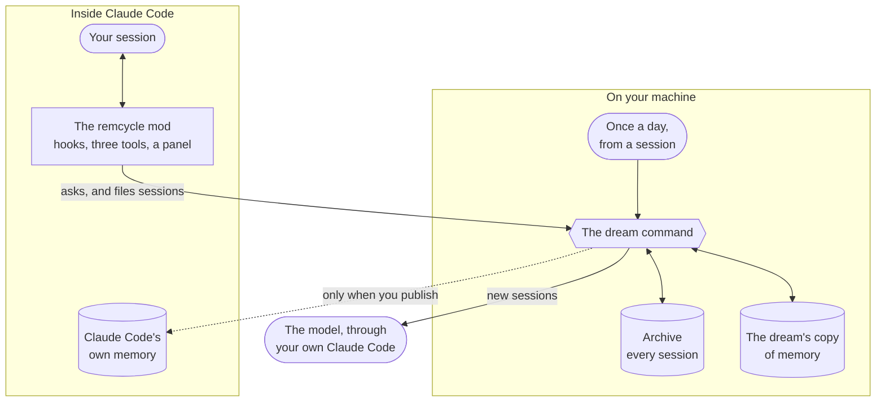

<p align="center">
  
</p>

<p align="center">
  <a href="https://github.com/lianmatsuo/remcycle/actions/workflows/check.yml"></a>
  <a href="LICENSE"></a>
  
</p>

<p align="center">
  
</p>

<p align="center"><sub>The shop project in the pictures is made up.</sub></p>

Claude Code starts every session fresh, and the notes it keeps about your projects pile up until the old ones are wrong. remcycle keeps everything you and Claude said, and once a day it reads the new sessions in the background, keeps what you actually decided, and questions the rest. The sessions after that start knowing it.

- **Sessions that start informed.** Each new session is handed what you have said applies to all your work, what was learned about the project, and what earlier sessions left unfinished.
- **Memory you can trust.** Every memory points at the words it came from. Something only Claude concluded is never loaded as if you had said it, and a note you already had is never replaced without asking you.
- **A list that stays short.** Stale, repeated and contradictory notes are found and put to you, so what loads at the start of a session does not keep growing.
- **Recall.** Claude can search everything that was said in past sessions, get a summary of any the dream has read, and read the exact words back when it needs them.
- **Everything on your machine.** The archive is one local file. The only thing that leaves is what the dream sends to the model, through your own Claude Code.

## Get started

You need [Claude Code](https://claude.com/claude-code) 2.1.287 or later and [uv](https://docs.astral.sh/uv/).

```bash
uv tool install remcycle
claude plugin marketplace add lianmatsuo/remcycle
claude plugin install remcycle@remcycle
```

The first line installs the `dream` command, and the other two install the mod. Then:

1. **Say what it should never read.** A client's or an employer's projects go in [the settings file](docs/reference.md#settings) before anything else, because the dream starts reading by itself.
2. **Build the archive.** `dream ingest` copies what was said in your past sessions into one local file. It sends nothing anywhere.
3. **Open the panel.** Start a new session and type `/remcycle`. It asks once how much of your history the daily dream should read: only new sessions, the week before too, or everything.

From then on the dream runs by itself. Once a day, the first session after 20 hours starts it in the background, and it reads the sessions that are new. This is the part that uses your Claude plan: one long session came to about $0.60 at API prices. `dream daily off`, or the switch in the panel, turns it off, and `dream run` runs it at any time. [The daily dream](docs/schedule.md) has its settings, and how to run it at a fixed time instead.

### Or let Claude set it up

Paste this into Claude Code:

```text
Set up remcycle for me. Clone https://github.com/lianmatsuo/remcycle into ~/remcycle, or run git pull there if it is already cloned. Then read docs/setup-with-claude.md in that folder and follow it step by step.
```

Claude installs the command, asks which projects to leave out, and builds the archive. It asks you before loading the mod in every session, which also starts the daily dream, and asks how much of your history that dream should read. You can say no to either and turn it on later.

The folder is only read for its guide, and can be deleted afterwards. [Removing it](docs/reference.md#removing-it) says how to undo each part.

## The panel

<p align="center">
  
</p>

Type `/remcycle` in any session.

- **Needs you.** Memories a session or a review has put in question, one at a time, with what the memory says and why it is doubted. You take the suggestion, keep the memory, or add it to the chat to talk it through.
- **Memories.** How many there are and where each came from: you said it, you agreed to it, or it was written before remcycle.
- **Index used.** How full the list is that Claude Code loads at the start of a session. This is the number remcycle exists to keep low.
- **Learned lately, Left open, Closed lately.** The newest of each, with the whole list a button away. A thread closes when the work is done, and you can reopen one.

## How it works



[How it works](docs/how-it-works.md) explains each part in plain words, with pictures.

## A mod, not a prompt

A skill or an instructions file is text that Claude reads and may or may not act on. remcycle is a mod: code that runs inside Claude Code and changes what a session does.

- **When a conversation starts**, it hands Claude what you have said and what earlier sessions left unfinished.
- **It gives Claude three tools.** `recall` searches past sessions, `close_thread` marks unfinished work done, and `settle_memory` applies a ruling the two of you reached.
- **It adds a panel.** `/remcycle` shows what it holds, and lets you rule on what it doubts.
- **When a session ends**, it files what was said.

Behind the mod is a program of its own, the `dream` command, with an archive, a daily run, and checks that everything the dream writes to memory has to pass.



## What it does without asking

Once installed, it saves what was said when a session ends, hands each new session what was learned, and once a day starts the dream in the background to read the new sessions. The dream is the part that uses your Claude plan, and `dream daily off`, or the switch in the panel, turns it off.

Four things never happen without you: writing into the memory Claude Code itself loads, retiring or replacing a note you already had, deleting anything from the archive, and reading a project you have excluded.

## Find out more

- [How it works](docs/how-it-works.md): the idea, in plain words and pictures.
- [Reference](docs/reference.md): every command and setting.
- [The daily dream](docs/schedule.md): its settings, and running it at a fixed time instead.
- [Design notes](docs/intent.md): why it is built this way, and what was rejected.
- [Privacy](PRIVACY.md): what it keeps on your machine, and what leaves it.

## Status

This is early software, written for one person's machine and released as it stands. It reads Claude Code's transcripts and, when you ask it to, writes to the memory Claude Code loads, so read what a command will do before you run it.

It runs on macOS and Linux. Windows support is new: the `dream` command's tests pass there, but remcycle has not yet been run on a Windows machine with Claude Code, so the mod and the daily dream are untried on it. The mod needs Claude Code 2.1.287 or later in the terminal, or 2.1.286 in the desktop app.

remcycle is an independent project and is not affiliated with or endorsed by Anthropic.

## Development

```bash
scripts/check
```

That runs everything CI runs: the Python lint and tests, the mod's manifest, types and tests, and the subjects of the branch's commits. [CONTRIBUTING.md](CONTRIBUTING.md) says how to start, and [AGENTS.md](AGENTS.md) is the working guide for people and coding agents alike.

The Python tests sit at these seams: transcript parsing, the archive against a real SQLite file, settings, reconciliation as pure functions, the memory store against folders in Claude Code's format, extraction through a stand-in for the model, the gate, and whole dream runs against temporary folders.

The mod's tests run in Claude Code's own plugin test kit, so that half of the check needs Claude Code installed.

## Licence

Apache-2.0. See [LICENSE](LICENSE). Copyright 2026 Lian Matsuo, as [NOTICE](NOTICE) says.
