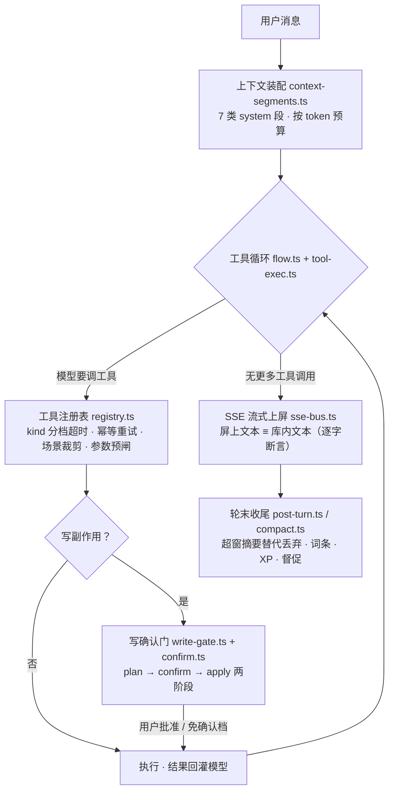

# StudentBuddy

[](https://github.com/llwand1/studentbuddy-v2/actions/workflows/ci.yml)


**Windows 安装包：[下载本地版 0.1.0](https://github.com/llwand1/studentbuddy-v2/releases/tag/desktop-v0.1.0)**。Windows 10/11 x64，双击安装后从开始菜单启动，无需安装 Node 或 npm；浏览器自动打开，首次使用在设置里配置自己的 AI 服务商。关闭浏览器后可从托盘退出，升级和卸载保留学习数据。构建说明见 [Windows 本地安装包](docs/DESKTOP-SPEC.md)。

**像素风的游戏化学习 Agent：对话里学、出题里练、知识大陆上复习——你自己的词条库是主体，数据归你（SQLite 单文件，可自托管，开源）。** 在线：<https://11wand.com>（免注册可直接体验）· 本地：`npm install && npm run dev` · 零 key 全栈演示：`npm run demo:e2e`。

**目录**：[为什么用它](#为什么用它) · [最近上新](#最近上新) · [产品判断](#产品判断为什么砍功能为什么转向游戏化) · [功能与工程实现](#功能与工程实现)（[对话核](#对话核一轮对话的生命周期) / [对话页](#对话页一个回复流里会发生什么) / [顺手的小设计](#顺手的小设计不用学就会用) / [AI 出题](#ai-出题一条管道不是一个按钮) / [情景题](#情景题让不可信的模型页面当考场) / [记忆与学习者建模](#记忆与学习者建模从固定曲线到-fsrs) / [知识大陆](#知识大陆把复习做成一次收复) / [搜索](#搜索五层不是一层) / [AI 网关](#ai-网关与后台底座把调模型收成一个口) / [前端零依赖](#前端零依赖是选择不是省事) / [测评](#测评怎么证明上面每句话)）· [界面预览](#界面预览) · [快速开始](#快速开始) · [架构](#架构) · [安全与隐私](#安全与隐私) · [已知限制](#已知限制) · [文档索引](#文档索引)

**30 秒看懂：你想做什么 → 它怎么接**

| 你想… | 它怎么接 |
|---|---|
| 问个问题 | 流式回答 + 思考链 + 工具步骤实时可见；模型自己决定何时搜网 / 查你的词条库 / 出题 / 画图；AI 一联网，右侧**资料架**同步上架，正文里的 `[n]` 点得回原文 |
| 等回复的空档 | 2 秒没回完就弹一张**词卡**（词→义 / 义→词 / 拼写），到期词条答对＝一次真复习打卡 |
| 让它考我 | 对话里说「考我」即可：六型配比、**真题缺省优先**、每道题标清「真题·必刷 / 模拟题·建议做 / 基础题·可选做」、材料与图必须随题带齐、答案先盲解验算 |
| 把学过的记住 | 聊完的概念自动入库 → 回复里高亮 → 长成卡牌 → 铺进知识大陆；**FSRS-5** 按你的记忆决定何时复习，到期地块长草生怪，打败即收复 |
| 用自己的资料学 | 绑定长文档走 BM25 检索注入、带段号可溯源，70 万字也能对答；粘贴图片提问走独立视觉角色 |
| 不想注册 / 不想联网 | 首页「免注册，直接体验」；或 clone 后 `npm run demo:e2e`（零 API key、零外呼、杀进程重启后逐字仍在） |

## 为什么用它

**StudentBuddy 是一个带工具循环、写操作确认门与长期记忆的学习 Agent；你自己的词条库是主体，而游戏化不是套在系统外面的皮——知识大陆、词条卡牌、对战、魔法吟唱用游戏隐喻表达学习内核（学 → 练 → 析 → 忆 → 反馈），彼此咬合成一个整体。** 对话核（`packages/server/src/chat/`，45 个源文件、6000+ 行源码，不含测试）是代码量最大的一块，在[功能与工程实现](#功能与工程实现)整节展开。

用它图什么，四句话说清：

- **对话本身就能干活**：流式回答 + 思考链可见，模型自己决定何时搜网、何时查你的词条库、何时出题；AI 在查什么你看得见——资料架随搜索上架、回答里的 `[n]` 点得回原文；绑定长资料走 BM25 检索注入、带段号可溯源，70 万字资料也能对答；还支持聊天内生图与粘贴图片提问。
- **词条是主体，学的痕迹自动沉淀**：聊完的概念自动入库，一个词进了库就会驱动出题、决定复习时机（FSRS-5 按你的记忆建模，不再是所有人同一条固定天数曲线）、在回复里被高亮标出、长成卡牌、铺进知识大陆——不用你记笔记。
- **数据归你**：SQLite 单文件、本地可自托管、开源；不想把学习记录交给别人，这是最直接的理由。
- **前端依赖极少**：`@sb/web` 运行时依赖只有 react / react-dom，无 UI 库、无 Markdown 库、无图表库，渲染器全部自绘（见「前端零依赖」一节）。

**适合这些人**：想利用碎片化时间学一点的人、喜欢游戏化学习方式的人、长期啃一块硬知识的人、考前要系统复盘的人、不想把学习记录托付给第三方的人。

- **在线体验**：<https://11wand.com>（**已上线到 v0.2.151**）。首页点「免注册，直接体验」直连公用体验账号，免邮箱（开关在服务端）；⚠️ 公用池**全站共享、访客彼此可见**，别放个人信息或私密内容（应用内同一句警示，两语都写）。要长期留自己的词条再走邮箱注册，一分钟。
- **不想点网页？** clone 后 `npm run demo:e2e` 一条命令跑完**确定性全栈演示**（用户 → API → 假 LLM → SSE → 落库 → 杀进程重启后逐字仍在；零 API key、零真实外呼）。
- v2 是全新重写仓（v1 [`llwand1/studentbuddy`](https://github.com/llwand1/studentbuddy) 已冻结）。

> 🏷️ **两套版本号各管各的**：`v0.2.x` 是**部署构建号**——对外线，GitHub Releases / tag / 线上公开更新页 `/changelog` 都走它，每次发版加一；`2.0.0-alpha.0` 是**内部产品号**（`package.json` 的 `version`），标记「v2 重写线」这个产品大版本，不随每次部署跳。⚠️ `/api/status` 返回的是**内部号** ⇒ 判线上版本请对 **GitHub Release** 或 **`/changelog`** 页。
> 📌 本文所有定量数字**不许手抄**：由 `node tools/metrics.mjs` 产出，`--check` 在漂移时退出码 1——徽章、测试基线、线上版本号三条线都进对账（CI 里跑的就是 `metrics --tests --check`）。

## 最近上新

> 只列**用起来最有感**的几项，新到旧；完整记录见 [`CHANGELOG.md`](CHANGELOG.md) 与线上 `/changelog`。每一项在下文都有一节展开，这里是索引不是复述。

| 版本 | 上新 | 展开在 |
|---|---|---|
| v0.2.151 | **资料溯源**：AI 一联网右侧弹「资料架」，搜到即上架、读到哪条标「在读」、AI 精选 1–3 条说理由；正文 `[n]` 是可点的引用芯片；资料随回答落库，历史可重开 | [对话页](#对话页一个回复流里会发生什么) |
| v0.2.151 | **等待时刷词**：等 AI 回复的 2 秒空档弹一张百词斩式词卡，答完自动切回；到期词答对＝真复习打卡；AI 顺着话题现出库里没有的新词，点「收入词库」才入库 | [对话页](#对话页一个回复流里会发生什么) · [顺手的小设计](#顺手的小设计不用学就会用) |
| v0.2.151 | **出题分级 + 真题优先**：每题标「真题·必刷 / 模拟题·建议做 / 基础题·可选做」（服务端按事实推，模型自报不算）；真题缺省优先进组、顶替同题型 AI 题；搜集辨别层加尾锚点与选项命中率 | [AI 出题](#ai-出题一条管道不是一个按钮) |
| v0.2.151 | **题目自包含**：「阅读材料可知」必须真有材料、「如图所示」必须真有图——补不全的题整题剔除，不交出让人无从作答的题 | [AI 出题](#ai-出题一条管道不是一个按钮) |
| v0.2.149 | **知识大陆开拓与野怪**：边界「+」领新词条、答两题才落地；每天按稳定哈希点名野怪保底；155 个图鉴槽外观确定性派生 | [知识大陆](#知识大陆把复习做成一次收复) |
| v0.2.148 | **FSRS 个人化拟合** / **对战 AI 预生成题池** / **学习伙伴带工具先查再说** | [记忆与学习者建模](#记忆与学习者建模从固定曲线到-fsrs) · [AI 出题](#ai-出题一条管道不是一个按钮) · [知识大陆](#知识大陆把复习做成一次收复) |
| v0.2.147 | **词条关系图**（五种关系）/ **Elo 式难度自适应** / **AI 阅卷评测集** | [记忆与学习者建模](#记忆与学习者建模从固定曲线到-fsrs) |
| v0.2.145–146 | **AI 网关 + 持久化任务队列 + 「AI 运行状况」卡** / **FSRS-5 + AI 阅卷 + 学习者模型** | [AI 网关](#ai-网关与后台底座把调模型收成一个口) · [记忆与学习者建模](#记忆与学习者建模从固定曲线到-fsrs) |
| 评测侧 | **agent-bench**：第三套离线评测，评「这只模型当 Agent 什么水平」（工具该不该调 / 参数对不对 / 多步接不接得上 / 失败会不会编） | [测评](#测评怎么证明上面每句话) |

## 产品判断：为什么砍功能、为什么转向游戏化

这一节讲一个已经落地的取舍。先说判断从哪来，再说砍了什么、转成了什么——每个结论都带可复验的证据。

**① 我们每天盯着线上真账。** 线上库只读审计（2026-09-24）：users 6 / sessions 47 / assistant 消息 139 条，按日活跃个位数。产品跑得通、确实有人打开过——⇒ 面对的不是「没人来」，是「来了不用」。（逐条实测与复验命令见 [`docs/metrics-product.md`](docs/metrics-product.md) §2）

**② 归因：创新点与访客的动线错开了。** 复盘发现两件事同时成立：原版叙事偏**传统学习风格**（题库 / 笔记 / 知识库一路排开），很多访客看一眼没兴趣就走开；而产品投入最多的两处——对话体验与 AI 出题——恰恰藏在访客最少走到的那几页里。**好东西没被走到，等于不存在。**

**③ 判断标准：惰性功能 vs 主动功能。** 任何新功能先答三问：用户必须先想起它存在才起作用吗？它会自己发起交互吗？拿掉它用户会察觉吗？三问都命中「惰性」，就先别写。

**④ 转向是转化，不是抛弃。** 内核不动，变的是「谁发起、什么时候出现」，以及用一套游戏化的隐喻来表达同一个内核：

- **知识图 → 知识大陆**：原来「写侧持续付成本、读侧零访问」的知识图页整族下线（见 ⑤），同一份词条与复习数据换一种表现形式复活——**词条地块、到期怪物、五题型挑战、英雄走位与领地扩散**，学一个词条铺一块砖、只增不减、到期只是褪色长草，复习变成一次「收复」。这不是新起炉灶，是同一个学习内核换上了用户愿意走进来的游戏隐喻。
- **题库 / 笔记 / 今日总结 → 下线**：出题能力保留在对话与对战里（对话出题、AI 主动出题、AI 对战），弱项统计随题库一起退场，留下的是当场判分 + 逐题解析。已下线功能的设计存档仍在文档索引里可查。
- **纪律两条**：游戏化数值一律**由学习行为解释**（XP 来自答题 / 复习 / 毕业词条，不做无行为空转的签到）；**不新增第三套数据**，能少一张表就少一张表。

**⑤ 判决留痕。** 知识图整族（编排画布 + 运行器 + 知识数据图）完整交付过，但实证是：`chat` 每一轮回复都在往 `knowledge_edge` 写边，而知识图页上线以来**无人访问**——写侧持续付成本、读侧零收益，一条典型的惰性功能。处置是本仓**第一条删除型迁移 v44**：DROP 七张表、不备份不归档，判决留痕在契约墓碑里。**删功能跟删代码一样要有证据**——这就是为什么我们持续追踪运营数据：不是为了报表，是为了让「下一步做什么」有依据。

## 功能与工程实现

下面按「一轮对话的生命周期 → 对话页上看得见的东西 → 顺手的小设计 → 出题管道 → 情景题 → 记忆与学习者建模 → 知识大陆 → 搜索 → AI 网关与后台底座 → 前端零依赖 → 测评」展开。

### 对话核：一轮对话的生命周期

这里的对话不是「接个大模型 SDK」就完事，而是一条完整的 Agent 管线：**上下文装配 → 工具循环 → 写确认门 → 流式上屏 → 轮末收尾**，每一环都有独立模块、独立契约与回归锁。



**① 上下文装配**（`context-segments.ts`）：摘要、日期、词条、文档块、回答风格、长期记忆、追问提示 **7 类 system 段**按一份有序清单注入，预算核算与实际组装都从这份清单派生——同一份清单此前手写两遍、漏一处不报错只静默漂，收成单一真相源后才算修掉。截断边界**对齐完整工具轮**（缺前置 tool_calls 的孤儿 tool 消息会被 OpenAI/Anthropic 400 拒绝——v1 崩溃级 bug 的修复原样保留）。

**② 工具循环**（`flow.ts` / `tool-exec.ts` / `tools/registry.ts`）：模型可调用 **13 个注册工具**，注册表每个工具带必填元数据 `kind`（分档超时 / 同参幂等重试 / 确认门缺省三个消费方的共同事实源，漏声明=编译期报错）、可选场景裁剪；下发清单超上限按声明顺序截断且留警告，**截断是事实、不静默**。参数不合法不执行工具，回灌「怎么改对」让模型自纠。

| 工具 | 一句话 | 确认门 |
|---|---|---|
| `search_web` | 联网搜索（五层体系的一层，见下） | 免 |
| `fetch_page` | 抓网页正文（SSRF 护栏 + 白名单，单页不遍历） | 免 |
| `pick_sources` | 从本轮搜到 / 读过的资料里标 1–3 条「AI 精选」带理由，右侧资料架置顶（只能引用本轮网址） | 免 |
| `fetch_image` | 抓取图片资源 | 免 |
| `search_images` | 找网络真实图片：Commons 主 / Bing 兜底，候选图必须过视觉模型看图核验（配图管道见「搜索」一节） | 免 |
| `lookup_terms` | 查用户词条库（正文高亮注入的数据源） | 免 |
| `upsert_term` / `delete_terms` / `tidy_terms` | 词条增改 / 删 / AI 整理 | 按条数阈值弹卡（默认 5）；**delete 恒弹卡** |
| `generate_quiz` | 出题引擎工具化：对话里说「考我」，模型自己发起（见下） | — |
| `generate_image` | 聊天内生图：文生图工具，生图模型在设置页单独绑定 | — |
| `ask_choice` | 方案选择框：挂起等用户选择（唯一豁免超时档的工具） | 免 |
| `offer_pk_battle` | AI 主动约战：邀请**只能**由这个工具发出，没有 REST 创建口 | 免 |

**③ 写操作确认门**（`write-gate.ts` / `confirm.ts`）：写类工具必须实现 `planWrite`（**只算不改**）→ gate 按影响条数决定弹不弹确认卡 → `apply()` 是**唯一落库入口**，只在「批准或免确认档」后被调用，拒绝 / 超时路径下 apply 调用次数恒为 0（回归锁直接钉这一条）。确认卡必带「动作一句话」与 ≤8 行清单——只有条数没有动作描述的卡不许上线；批过的写入**按批可撤销**。

**④ 流式上屏**（`sse-bus.ts`）：token 级 SSE，**屏上文本与库内文本逐字一致**；断线指数退避重连 + 轮内序号回放去重。这两条在 e2e 演示里逐条断言过。

**⑤ 轮末收尾**（`post-turn.ts` / `compact.ts` / `memory.ts`）：上下文超窗口时，被丢的那段先交给 LLM **摘要替代而非直接丢弃**（与 Pi 的 compaction 同型，三处刻意不同：异步 fire-and-forget 下一轮生效——学习场景用户盯着屏幕，多等 2~5 秒是净损失；摘要模板换学习版；`[MEMORY]` 长期记忆块借同一次调用产出省一次 LLM）。

### 对话页：一个回复流里会发生什么

上面管线之外，同一条回复流里还叠着这些（全部自研）：

- **思考链面板**——原生 reasoning 链可见，收起展开自己控制
- **空会话直接开聊**（`docs/CHAT-UX-SPEC.md` §2.9）——第一屏不用先点「新对话」：四张建议卡一点即发，输入框没会话也能直接发，开会话、等 SSE 就绪、发出那一问三步前端自动串起来；开会话期间禁发，连按不会开出两间
- **工具步骤折叠行**——每个工具调用的 running / done / error 实时上屏，可折叠
- **grill-me 模式**（`grill.ts`）：`ask_choice` 的工程链路早就全通，但真机几乎见不到——根因是「要不要追问」的触发权在模型手里，`tool_choice='auto'` 的出厂倾向是把答案直接讲完。结论：**「要不要问」不该是模型的概率判断，该是用户的显式开关**。打开后每一轮必出选择框（开场问方向 + 收尾问下一步），靠 `tool_choice` 强绑由工程保证，不依赖模型自觉
- **写操作确认卡**——两阶段确认（见上），弹卡、批准、撤销全程在对话流里完成
- **AI 主动发 PK 邀请卡**——不用去对战页，AI 觉得该练一手时自己递卡
- **聊天内生图**（`generate_image`）：模型自己决定何时画图，生图模型在设置页单独绑定，平台侧有每日张数闸
- **图表卡 / HTML 卡 / SVG 卡在沙箱里真跑**——不是贴截图，是活的可交互内容（沙箱机制见「安全与隐私」）
- **粘贴图片提问**（`vision.ts` 视觉蒸馏）：主模型**始终纯文本**、不直接收像素；图先发给独立配置的视觉角色模型蒸馏成中文描述再入上下文——主模型选型不被看图绑架、视觉能力可插拔、描述随消息持久化（历史回放不再二次调视觉模型）。提示词套路是踩坑后固化的：关键信息放最前，因为视觉模型撞 max_tokens 是从后往前截
- **「向 AI 追问」另开 fork 会话**（`follow-up.ts`）——追问不污染原对话，也不丢上文
- **任务进度面板**（`task-list.ts`）——AI 领了的多步任务在对话里可见可查
- **出题配图 SVG**——模型自决给几何 / 电路题附图，图坏只删图不删题
- **导出 Markdown**——对话与词条拿得出去，不被锁在库里
- **文档模式**——绑定长资料走 BM25 检索注入、带段号可溯源，70 万字资料下旧直塞覆盖率 0/13 → 新检索 13/13
- **等待时刷词**（`docs/WAIT-DRILL-SPEC.md`）——发出问题后 AI 还在想、2 秒没回完就弹一张百词斩式词卡（词→义 / 义→词 / 拼写，键盘一把梭），回复到了答完这张自动切回；到期词条答对直接算一次复习打卡，AI 顺着话题现出库里没有的新词、点「收入词库」才入库；配乐音效全 Web Audio 现场合成，答对五款特效轮换
- **资料溯源**（`docs/SOURCE-TRACE-SPEC.md`）——AI 一联网，右侧就弹出「资料架」：搜到即上架、读到哪条标「在读」、AI 再精选 1–3 条说一句为什么；回答收口后只留**读过 / 精选 / 正文引用到**的（搜到没读的点开多半打不开，不摆），每条旁有 ✕ 可单独叉掉；网页走服务端零脚本阅读页、PDF 直翻、视频官方播放器；正文里的 `[n]` 是可点的引用芯片；资料随回答落库，历史脚注「资料 n 条」可重开。刷词弹窗同时改成可拖动小窗，与资料架并存

### 顺手的小设计：不用学就会用

单拎一节，是因为这些东西每一条都小到不值一个版本号，但它们决定「用起来顺不顺手」。口径大多在 [`docs/CHAT-UX-SPEC.md`](docs/CHAT-UX-SPEC.md)，纪律只有一条：**快捷键要在它能用的地方写出来**（忙态占位文案就是「生成中…（Esc 停止）」），不靠用户去翻文档。

**键盘一把梭**：

| 在哪 | 按键 | 干什么 |
|---|---|---|
| 对话输入框 | `Esc` | 生成中＝点停止键（输入法组字期间的 Esc 归输入法，不拦） |
| 回复正文 | 选中一段字 → `↩ 引用追问` | 选区逐行加 `> ` 并入输入框、不覆盖已打了一半的问题；只认助手正文，题卡与过程面板里的字不算 |
| 刷词小窗 | `1–4` / `Enter` 或空格 / `N` / `Z` / `X` / `Esc` | 选项 / 下一张·记住了·收入词库 / 不认识 / 斩 / 不要 / 收起（本轮不再弹；这局留着，输入框上方的小签能唤回）；焦点在拼写格里时字母数字不劫持 |
| 资料架 | `[` `]` · `Alt+←/→` · `Alt+1–9` | 上一条 / 下一条 / 直达第 n 条；正文里的 `[n]` 引用芯片点了同样切过去 |

**对话页上的小动作**：

- **错误条只给一个出口**：流式中断（上游错 / 超时 / 已停止）给「↻ 重试」＝对最后一问重新生成；发送失败不给——那条提问压根没进会话，改一改再发即可
- **草稿按会话隔离**：切走时当前输入存到旧会话名下、切回原样带回；只存内存、刷新即清——草稿是「这一坐」的上下文，刻意不做持久化
- **标签页标题会说话**：生成中前缀「● 回复中」，切到别的标签页期间答完了就变「✓ 回答完成」直到你切回来；只改标题，**不发系统通知、不响铃**
- **离底提示分忙闲**：生成中离底是「↓ 新内容」（前面一颗眨的余烬点，`prefers-reduced-motion` 下不眨），不忙时是「↓ 回到最新」
- **发送后焦点回输入框**；「向 AI 追问」另开 fork 会话不污染原对话
- **刷词小窗可拖动、位置记住**，与右侧资料架并存；手机（≤640px）上资料架铺满内容区、刷词退回底部抽屉。刷词配乐与七款音效全部 Web Audio 现场合成、零音频文件，静音记本机
- **刷词关掉不作废**：✕ / Esc / 回复到了自动切回都只是收起，输入框上方留一枚「刷词已收起 · 还有 N 张 · 唤回」小签，点它同一张卡、同一串连击原样回来；下一轮等待自动弹的也是这一局；小签上的 ✕ 才真正结束
- **填空像打字练习**：刷词拼写卡、知识大陆填空题、对话出题的短答案填空都是一格一字——空格与标点是替你填好的固定格（不用打符号，打了也不落格），「提示」一次揭一段灰字仍要自己打；刷词卡逐格即时判对错，正经考题不判（那会把答案试出来）；轮到拼写但词条满是符号（`C++`、`O(n log n)`）就改出选择题

**设置页「改了就存」**：音色 / 回答方式 / 出题配图这类短值改了即落库，不设保存按钮（多一步只会多出「改了没存」的困惑）；**语速滑条拖完才存**（拖动期间逐次 PUT 会把接口打爆），pointerup 与 keyup **两处都挂**——键盘调滑条不触发 pointerup，少挂一个就有一半用户存不上；**试听必须反映还没保存的选择**，否则用户会以为滑条坏了。同页的「免费通道 · 一键默认设置」是新用户第一入口：平台 key 一个字节都不落库、界面上没有任何「显示 / 复制密钥」的入口（不是漏做，是刻意没有）；剩余额度卡上直接看；因为这个按钮会覆盖已有的逐角色绑定，做成两段式确认，代价说明用 `role="alert"` 念出来。「真题优先」「等待时刷词」「AI 运行状况」各一张卡，开关与读数都在同一页。

**不进应用也能用的**：首页「免注册，直接体验」（公用池，警示两语都写）；词条公开页与更新记录页是**构建期 SSG** 出的静态 `.html`（英文侧落在 `terms/en/`），`/atom.xml` 可订阅；链接分享出去带社交卡片（真机截图提交为静态资源，文案三条纪律：不写使用量数字、不许诺效果、不引用真实用户）；侧栏一键**中英切换**——如实说：目前只到壳层框架文案，功能页正文与服务端消息尚未双语。英文词条一键朗读走浏览器自带语音合成，零音频文件。

### AI 出题：一条管道，不是一个按钮

出题在对话里是 **Agent 工具**（`generate_quiz`）：用户说「考我」，模型自己触发、自己定题型配比。这条管道里的每一环都处理过模型不可信的问题：

- **六型配比可调**：单选 / 多选 / 填空 / 解答 / 判断 + 情景题，按题型配比出组
- **出题前先问一次回答方式**（`AskStyleCard`，四维偏好）——同一道题，讲给想先看例子的人和想先推导的人不一样
- **出题联网检索**：出题前先搜网、参考进提示词、**失败不阻断出题**；题卡挂参考来源列表，并如实上报「检索开没开 / 命中几条 / 哪个源失败」
- **真题 + AI 题合流**（`quiz-source-mix.ts`）：按题型分别配「AI 几道 / 真题几道」；真题走检索 → 抓页 → 摘题 → **逐字校验**才入库，摘不够就**报缺不补**——宁少勿假。判断题与情景题的真题配额**恒为 0**（`quiz-source.ts`：判断题网上规范格式稀少、多为交互式小部件，摘不出可判分版本）——配比是算出来的，不是拍出来的
- **每道题先说清「做了有什么用」：三档分级**（[`docs/QUIZ-TIER-SPEC.md`](docs/QUIZ-TIER-SPEC.md)）：档位**由服务端按事实推，模型自报不算**——网页逐字摘录、过校验锁、来源 URL 回填的 ⇒ **真题·必刷**；AI 参考联网检索到的真题出的变式 ⇒ **模拟题·建议做**；其余 ⇒ **基础题·可选做**。题卡逐题徽标（悬停一句「为什么这么标」）、卡头汇总「本组：真题 N · 模拟 N · 基础 N」，`generate_quiz` 回灌模型的摘要带同样的分级并明令**不得把基础题说成真题**。没有联网参考时提示词直接改口「按基础题写：一题一考点、不模仿考卷腔、不杜撰『某年某地真题』」——模型对考点分布的想象不可信，「装真题」比「明说基础题」误导更大；功利效果留给真题档去承担。判分 / 对战 / 复习一律不读这个字段，历史题无键按来源兜底、**不迁移数据**
- **真题优先，缺省开**：设置页一张卡（`GET/PUT /api/settings/quiz-real-first`）。用户没自己配真题配比时，出题**并行**去公开题源搜集真题，摘到几道就顶替几道同题型的 AI 题——「能换成真题的都换」，**不加总题数**，情景题恒不换；自己配过配比就按显式配比走，不越俎代庖。搜集辨别层同批加严：原来只校题干前 20 字，弱模型「首句抄、后半编」「题干抄、选项编」全部放行 ⇒ 加**尾锚点**（题干 ≥40 字时末 16 字也必须在同一页命中）与**选项命中率**（≥50% 选项在页面命中）；标题 / URL / 正文里的考试词 + 年份 + 已登记题源 **≥2 票**才判「考试真题页」；题源登记表**不是白名单**，只影响抓页顺序。保守方向是**少杀**：短题不做尾锚点、无选项不做命中率——误杀真题比漏一道更伤信任
- **题目自包含**（[`docs/QUIZ-COMPLETE-SPEC.md`](docs/QUIZ-COMPLETE-SPEC.md)，#109）：学生会碰到「阅读材料可知，洋务运动的目的是（　）」——**没有材料**。题干、选项、答案齐全，判分链路上完全合法，此前没有任何一道闸会拦它。成因查到了源码：抓页把 `` 连标签一起删、材料常在题干上方另一段而模型只抄题干、联网出题只看 6 条 ≤300 字摘要却被要求出「源于材料」的题。处置是三条纪律——**不静默**（检出几道、补全 / 搬图 / 剔除各几道如实进报告，全剔光 502 说真因）、**宁缺勿给无头题**（补不全整题剔除，与盲解验算「验算失败放行」刻意相反：那边放行的代价是可能错，这边是用户亲眼看到坏题）、**搬运不发明**（材料只能取自联网参考资料或题目自身，图只能是**真实存在**的图——原页配图或 Commons 检索，绝不让模型「描述一张图」当图用；URL 与署名只由服务端填）。落地形状：题目多一个可选 `material` 字段（题卡上作引用块显示在题干上方，题干依赖的图排在题干前），审查是**确定性纯函数**——找「根据材料 / 如图 / 下表」这类外部依赖并排除「如图书馆」「根据牛顿第三定律」，干净的题**零额外 LLM 调用**，有缺陷的合并成**一次**修复调用；搜集侧抓页保留 `[图N]` 占位、材料必须与页面逐字对得上、原图随题搬运；盲解验算 / AI 阅卷 / 对战出题读的都是「材料 + 题干」，不因材料另放而退化。评测集 `complete-v1`（33 题：文段 13 / 图 9 / 表 6 / 无依赖对照 5），读数与方法见 [`docs/eval/complete.md`](docs/eval/complete.md)；如实说没做的：不点名材料却隐式依赖它的题检测不到、不做 OCR
- **五级解析阶梯 + AI 特化 SVG 配图**：模型犯错不塌整组，丢图保题
- **出题后盲解验算**（`quiz-verify.ts`）：选择类题入库前由 solver 角色**只喂题干与选项、不喂答案**盲解一遍，解出的答案与出题标注**明确不一致才丢题**——出题模型标错答案＝教错，比没题更糟（model-bench 真机实测某模型 40 例出题里答案检查 6 例红）。三条保守纪律：solver 没绑定整体跳过零行为变化；solver 超时/异常该题放行只记 unresolved；只拦「明确不一致」——验算是保险丝，不许反过来阻断出题
- **模型输出的无损修复**（`quiz-json-repair.ts`）：真机端到端抓到的第四类失败——模型 finish=stop、标记成对、内容一个字没少，但 `options` 数组**写漏了收尾的 `]`**，整份 JSON 因此非法；「原样 → 剥 svg → 逐题回退」三级阶梯治不了它，于是补一层括号/非法转义的定点修复——四道好题不再因一个字符整组判死成 502
- **难度自适应**：由最近 200 条答题事件在线估学习者能力 θ（Elo 式更新的 Rasch/1PL 模型），反推「答对率落在 70–85%」的难度档写进出题提示词；样本不足不给建议（能力估计的来龙去脉见「记忆与学习者建模」）
- **网络真实配图**（`quiz-photo.ts`）：出题后一次轻量规划挑出「配张真实图片更好」的题（照片 / 标准示意图 / 地图 / 文物）→ 走配图检索管道找图并**看图核验「是不是这个东西 + 图里有没有印着答案」**；题目必须不看图也能答（判分不读图，盲解验算照旧有效），任何一步失败都只是「这题没配图」，绝不让出题失败
- **对战 AI 的预生成题池**（`pk/question-pool.ts`）：PVE 里实时出题＋检索＋验算实测常要二三十秒，玩家只能干等；现在 AI 出题先取池里**已过盲解验算**的现成题，后台按主题补到 3 道、**只补真有人打过的主题**（不替没人用的东西花钱）、同一局不出重复题、用过即作废 30 天过期——体感从「等半分钟」变成「立刻」

### 情景题：让不可信的模型页面当考场

情景题要处理的是一个完整的信任边界问题：**AI 生成一个可交互 HTML demo 当考题，但模型写的页面是不可信侧，怎么让它安全地当考场？**

- demo 内嵌**评分点**（choice / state / order 三种判型）——用户在 demo 里点、拖、操作，demo 上报的不是对错，是「发生了什么」
- **对错由服务端裁判**：因为打分逻辑绝不能交给不可信页面自己——页面说什么不算，服务端比对才算
- demo 跑在 **CSP sandbox（opaque origin）+ iframe 双层沙箱**里，页面源为 `null`——而写接口的 Origin 校验**不放行 `'null'` 源**，所以 demo 调不动任何写接口
- **回传只有一条独木桥**：服务端注入的桥接脚本（`SCENARIO_BRIDGE_JS`，带 demoId 防串台）→ `window.parent.postMessage` → 宿主白名单校验 → REST 上报（契约 [`docs/SCENARIO-SPEC.md`](docs/SCENARIO-SPEC.md)）
- 要点是：**不是「信任 AI 然后祈祷」，而是把「AI 产出不可信」当成前提，再设计出让不可信产物也能参与真实业务的通道**

### 记忆与学习者建模：从固定曲线到 FSRS

复习内核在 2026-09 做了一轮升级（迁移 v46–v49），从「所有人同一条曲线」走到「按你的记忆建模」：

- **调度内核已从固定七档升级为 FSRS-5**（`@sb/shared` `fsrs.ts`，纯函数零 IO，官方默认参数 w0..w18）：旧调度是固定间隔 1/2/4/7/15/30/60 天，难词和易词同一个节奏——记得牢的被反复催、快忘的却要等满间隔。FSRS 给每个词条两个状态量：**稳定性 S**（记忆保持率掉到 90% 要多少天）与**难度 D**（1–10），每次复习按「这次记没记住 + 复习时的实际可提取度 R」更新，下次间隔由目标保持率 0.9 反推、封顶 365 天。旧 stage 仍保留——卡牌、大陆、柱状图以它为轴；FSRS 只接管「下次什么时候复习」与「现在还记得几成」。老词条**不批量回填**：第一次在新版里复习时才按旧阶段折算起点，免得一次迁移让第二天突然冒出一大堆到期
- **按个人复习记录拟合**（`fsrs-fit.ts`）：不拟合官方 19 个参数（官方优化器要几千条复习才稳，一个用户一年也就几百条），只拟合**一个**「稳定性缩放」k——k>1 ⇒ 你比默认模型以为的记得牢，间隔按比例拉长。MAP 估计对 ln k 加 N(0, 0.5²) 先验（样本少时贴近 1）、k 钳在 [0.25, 4]、少于 30 条不拟合，且**只有拟合后的对数损失确实更低才采用**；只作用在读侧，写侧推进仍用原始值，不会越滚越大。每次复习都记下默认模型当时预测的 R，拟合可以从日志直接做、不必回查间隔天数
- **学习者模型**（`learner-model.ts`）：与长期记忆画像（`chat/memory.ts`）分工明确——那边是**他说过什么**（会话压缩时模型总结的偏好与背景），这边是**他会什么**（由学习数据算出）：快忘词条（当前可提取度 < 0.8）、误区账本（AI 阅卷诊断出的误解，同一误区再犯只计数、已解决的会被**重新打开**——又犯了就说明没真解决）、校准报告（「预测还记得 85%」的那批复习实际记住了几成，样本不足不给数——太少的「预测 vs 实际」只是噪音）
- **词条关系图**（`term_edge`）：新词条入库发事件 → 后台任务让 AI 抽**前置 / 组成 / 例子 / 易混淆 / 相关**五种关系；无向关系按 id 字典序存一行、重复抽取天然幂等；**刻意不加外键**——词条删除走软删可撤销，外键级联会让「撤销删除」丢关系，读侧一律 JOIN 回主表让悬空边自然不出现。⚠️ 这与被 v44 删掉的知识图页**不是一回事**：那是没人访问的展示页，这是喂给学习伙伴、词条页与对话检索的**读侧数据**——同一个教训的两面
- **学习事件流**（`learning_event`，只追加不改写）：题型 / 对错 / 耗时 / 词条落在同一条时间线上，能力估计、学习者画像都是它的投影——加一种玩法不再多开一本账

### 知识大陆：把复习做成一次收复

游戏化外壳的主舞台，也是「知识图 → 知识大陆」这场转化的落点：

- **词条即地块**：学过的词条从中心往外铺成地图，越靠中心学得越早；地图**只增不减**，到期只是褪色长草、长出怪物，复习打败它就把地块收复——「我学过什么、哪些该复习」变成一张一眼看得懂、并且想继续铺下去的地图
- **五题型挑战**：收复战斗就是出题引擎题型的实战场，当场判分
- **英雄走位 · 领地扩散 · 每日宝箱 · 图鉴**：走位与领地由学习行为驱动，宝箱由打卡开出——数值全部由学习行为解释
- **魔法吟唱**：把一段聊过的对话当「咒语」对怪施法——复述当初的提问、重做当初的题，命中几节打几点，咒语正文提到这块地的词条则威力加倍；每次吟唱掷骰化作五款像素释放特效之一（无光斩 / 悔罪光柱 / 月下叶舞 / 风灵旋刃 / 炎蛇，canvas 低清逐帧编排，款式只改画面不改数值），口径见 `docs/SPELL-CHANT-SPEC.md`
- **开放世界 + 玩家创建 NPC 学习伙伴**（v0.2.140）：地图比屏幕大、视口相机拖拽与「回到我身上」；学习伙伴由玩家在地图上点格创建、自带起名与人设（`npc` 模型角色，未单独绑定时回退讲解角色）
- **学习伙伴是带工具的智能体**（`npc-agent-tools.ts`）：原来伙伴只会送新词，提示词还得明令「不要编造进度」——因为他根本看不到进度。现在他能**查**：这块地所属领域里你快忘的词条与未纠正的误区（FSRS + 误区账本）、脚下词条在关系图里连着谁（`term_edge`），最多 3 步、每个工具每轮只用一次、说数字之前必须先查——「不要编造」从提示词祈祷变成「先查再说、只说查到的」的工程约束。工具全部**无参数或只读**：模型只决定「要不要查」，查哪个领域由服务端按他脚下那格定——让模型填词条 id，它会编一个库里没有的
- **边界开拓与野怪**（v0.2.149）：大陆边界空格画「+」，点它领一条新词条——有模型时按邻近地块领域现生成，失手退内置词池并**如实标注来源**；先看词条再答两道题，全对新地块才落地，同一份开拓凭证只能落一次、10 分钟过期。刷怪双轨：欠账怪之外每天按「日历日 × 词条 id」稳定哈希点名野怪保底——新用户第一天也有怪打；155 个图鉴槽的怪外观由题型组合**确定性派生**（体型 × 配色 × 饰物，两两不同），不是随机贴图
- **导航 · 话题怪 · 横版战斗 · 地块维护**（未发版）：右侧「导航」清单点「前往」，英雄按最短路（领地是墙会绕）走到怪旁边**自动开打**，「全部讨伐」一只接一只；AI 回复里提到词库里的词条，那些词条当天在大陆上冒**话题怪**，对话页右下角弹「刷新了新的怪物」+「一键讨伐」直达战场（零新存储：只看服务端既有的 `last_used_at`）；点怪进**2D 横版战场**（像素百叶窗转场，勇者对阵图上那只怪，血量与题数同源）；地块耐久随离中心的环数递减，久不复习**原地碎成废墟**（词条不删、可走），复习一次即重建、长期记忆是基石——大陆不靠删格保持在合理大小
- **验证方式如实说**：走位 / 领地 / 宝箱 / 情景题这几项是用**真机 CDP 探针**验的（`tools/probes/continent-cdp.mjs`：跑真页面 + 真接口，五组断言连续两轮 PASS），**不是人工目检**；两条已知待办（地图静止后常驻演出停帧、寻路遇障不绕路）列在本文「已知限制」一节

### 搜索：五层，不是一层

「联网搜索」四个字背后是五套各自独立的检索体系：

1. **对话内 `search_web`**：Exa / Tavily / 智谱按 key 并行聚合 + Bing 免 key 兜底，SSRF 护栏 + 出网白名单
2. **出题联网检索**：上面出题管道里那条，独立超时、失败不阻断、来源可上报
3. **全站全文搜索**：SQLite FTS5 影子表（`search_index`），消息与词条两族索引，全局搜索入口直达
4. **`fetch_page` / `fetch_image`**：网页正文与图片读取工具，单页不遍历
5. **配图检索管道**（`media/`，对话 `search_images` 工具与出题配图共用）：Wikimedia Commons 官方 API 为主（许可证 / 作者 / 来源页随结果落 `media_attribution` 表，SVG 取服务端栅格化 PNG 避开内嵌脚本）、Bing 免 key 兜底（许可未知就如实标「版权归原作者」，不假装可自由使用）；**候选图必须过视觉模型看图核验**——搜索引擎按文件名匹配，「线粒体」能搜出叶绿体甚至主题海报，只按标题挑图错图率高得离谱；出题场景再加一道「图里有没有印着答案」的泄露检查，模型报出图中文字后**服务端自己再比对一次**、不单靠模型自我判断。下载走同一套 SSRF 逐跳复检，图按内容 hash 去重缓存，「检索词 → 已核验图」缓存 30 天——同一个「线粒体」被问一百次，只找一次、只看一次

### AI 网关与后台底座：把「调模型」收成一个口

改前全仓 14 处调用点各自 `routeRole()` → `adapter.chat()` → 自己拼文本：超时各写各的（多数没写——上游挂住就一直挂着）、失败多半被 `catch {}` 吞掉、耗时 / token / 失败率无处可查。收口之后：

- **唯一出入口**（`ai/gateway.ts`）：所有非流式模型调用走网关；流式对话**刻意不进**——把「逐字上屏」与「工具循环」搅在一起得不偿失，只借同一套记账
- **用途登记表**（`ai/purposes.ts`，24 个用途）：每条登记「缺省角色 / 提示词版本 / 上游优先级（用户正等着 ⇒ main，为下一轮备料 ⇒ background）/ 单次超时」——出题一次十题带 SVG 常要一分多钟，超时按用途给而不是一刀切；**改提示词必须把 version +1**（测试锁着），前后两版的成功率能直接对比
- **失败五分类**：`no-model` / `timeout` / `aborted` / `upstream` / `parse`——调用点能对用户说真话（「去设置页绑模型」≠「模型超时了，可重试」）
- **结构化输出自修复**：`aiJson` 拿调用方的解析函数校验，解析失败把原输出和错因回喂给模型**修复一次**
- **每次调用一行账**（`llm_call` 表）：网关只发总线事件、**自己不碰库**（被 mock 掉 router 的单测不会意外开出真库文件），订阅方 `ai/call-log.ts` 落库；设置页「AI 运行状况」按用途看调用数 / 成功率 / 各类失败 / 耗时 p50·p95 / token——**只看自己的调用**，平台通道的用户看不到别人的失败与用量
- **持久化任务队列**（`jobs/queue.ts`，`job` 表）：改前「对话结束后抽词 + 压缩」是 `void promise`——上游抖一下就静默失败，这一轮的词条永远补不回来，进程重启在途的一起蒸发。落库之后：失败按退避重试、重启把卡在 running 的放回 queued、`dedupe_key` 唯一让同一件事重复入队只落一行；单进程 + better-sqlite3 同步执行，一条 `UPDATE … RETURNING` 认领天然无竞态。对话后抽词与记忆压缩、词条关系抽取、FSRS 个人化拟合、对战题预生成、每日维护，全部跑在它上面

### 前端零依赖是选择，不是省事

`@sb/web` 的运行时依赖只有 react / react-dom——无 UI 库、无 Markdown 库、无图表库。**Markdown 渲染器 266 行自绘**（`Markdown.tsx`），SVG 净化、图表、代码高亮同样自绘。为什么：

- **安全**：这个前端要渲染的是**模型产出的不可信内容**，自绘意味着净化逻辑、围栏白名单（```svg / ```chart / ```html 三种之外一律转义）、攻击面全部自己握着，不替第三方库的 CVE 背锅
- **代价如实**：行内公式不渲染（`$…$` 按原文显示）、`mermaid` / `echarts` 围栏降级代码块——刻意的取舍，登记在「已知限制」

### 测评：怎么证明上面每句话

**文档说的任何话都可以不信，下面三条命令的输出可以当场信。**

| 命令 | 你会看到 |
|---|---|
| `npm run check` | tsc×3 ＋ eslint ＋ vitest 全量 ＋ 四项门禁（行数红线 / 禁 `any` / 禁内联样式 / 测试逐文件登记）一次跑绿 |
| `npm run demo:e2e` | **确定性全栈**：注册 → 假 LLM → SSE → 落库 → **杀进程重启后逐字仍在**，34 条断言全过，零 API key、零真实外呼；对已下线路由（`/bank/:id` 等）有**墓碑锁**（断言 404，防止功能悄悄复活没人知道） |
| `node tools/metrics.mjs --tests --check` | 本文与首屏的**每个可核对数字**对代码实测对账，漂移即退出码 1（CI 跑的就是这条） |

当前测试基线 **314 文件 / 3749 例**，全绿；passed/skipped 明细随平台略有差异（skipped 数分平台不同），**不进本文手抄**——实跑明细由 `node tools/metrics.mjs --tests` 当场产出。逐文件不变量见 [`docs/TEST-PLAN.md`](docs/TEST-PLAN.md) §3。

测试之外还有**三套离线评测**（都支持零 key 假模型自检，同 `demo:e2e` 的假 LLM 哲学），三者答的是三个不同的问题：`npm run eval` 评**产品链路**——走生产同款抽取与修复管道，四档解析（strict / repaired / rescued / failed）+ 配图开关两 arm 永不合并，带成本计量，答的是「产品今天交付什么水平」；`npm run eval:models` 评**模型裸输出**——七套件（自建样本 + 冻结的 MMLU / C-Eval 公开集 + 现场真题），出题协议服从性、复刻相似度、联网引用命中、词条抽取 F1、注入对抗，任意 OpenAI 兼容端点自带 key 横向对比，答的是「这只模型本身什么水平」。两边并读：同一份失败，评测台落在 repaired 档而 model-bench 直接红 ⇒ 是修复器救回来的，该改提示词。换模型、换 provider、改提示词前后各跑一遍，分数变化就是决策依据，不再靠手感（详见 [`tools/eval/model-bench/README.md`](tools/eval/model-bench/README.md)）。

第三套 `npm run eval:agent`（[`tools/eval/agent-bench/README.md`](tools/eval/agent-bench/README.md)）评的是前两套都不评的**循环本身**——该不该调工具、参数对不对、多步接不接得上、失败会不会编、会不会空转重试，答的是「这只模型**当 Agent** 什么水平」。做法：生产工具定义的**镜像**（description 逐字取自源码——它是写给模型的提示词，改一个字就是换了道题）+ **确定性假结果回灌**驱动真实多轮 tool_calls 循环；21 个用例四套件对齐主流口径：tool-choice（≈ BFCL simple + relevance：口算、翻译这类直答题**调了工具就算错**）、arg-fidelity（≈ BFCL AST：**每一次**调用的参数都过镜像 schema，`count:"3"` 这种字符串数字直接红）、multi-step（≈ τ-bench：判轨迹 + 最终回答必须落在假结果里那个事实——反编造的锚点；含抓页 403、搜索零结果两个「说真话」用例）、discipline（正文注入不执行、模糊删除必须先查再动、终点信号不重试）；`--trials k` 给 τ-bench 口径的 pass^k。镜像腐烂由 `--selftest` 顶住（工具名集合与生产注册表逐一比对、`required` 列表在源码里逐字找得到、每个用例自带正确轨迹样例能过自己的判分）。首跑存档（`RESULTS-2026-09-29-*.md`）：某 flash 档模型 pass@avg 76.2%、pass^2 57.1%，失败签名高度集中在「同参重复调用」与「零结果螺旋」——这两条在产品里分别由注册表幂等与步数上限兜住，**评测的意义就是让兜底与失败模式一一对应**。

**四项门禁由 CI 强制**：server 单文件 ≤400 行、web 组件 ≤320 行（逼着功能拆文件，`flow.ts` 贴线开新文件就是常态）；全仓禁 `any`；web 禁内联 `style={{`（一律走 tokens.css token）；每个测试文件必须在测试清单登记。`metrics.mjs` 负责另一类腐烂：数字由脚本产出落 `docs/metrics.md` 标记区，README 徽章、正文基线、线上版本号与首屏统计全部进 `--check` 对账——手抄的数字必然腐烂，这一课在本文自己的历史里发生过不止一次。

## 界面预览

> 全部是**真机截图**：无头浏览器直出，按仓库当前源码在本地形态渲染，不是设计稿也不是拼接。跑图用临时隔离库，往里灌一小批示例词条好让卡墙和地图上有东西可看——跑完即删，不碰真实数据，也不调用模型。

**对话**——像素风应用壳：左侧导航、中间对话，右下角是常驻督促胶囊


**词条卡牌**——上面是每日宝箱与任务清单，下面是按星级铺开的卡墙


**知识大陆**——词条从中心往外铺成地块，越靠中心说明学得越早


整套界面是统一的像素风主题：聊天、词条、卡牌、知识大陆、对战与设置共用一套配色和图标；系统打开「减少动态效果」时动画会让位。

## 快速开始

**不想装环境？** 直接打开 **<https://11wand.com>**。**想完全本地、数据只留在自己机器上？** 按下文跑本地单机形态——两种形态**共用同一份代码**，差异只在环境变量。

> ⚠️ **Node 版本必须「装依赖」与「运行时」一致**（`engines: >=22.11.0`，仓库带 `.nvmrc`）：`better-sqlite3` 是原生模块，产物按**安装那一刻**的 Node ABI 编译；换 Node 大版本必须删 `node_modules` 重装，只换运行时无效，症状是涉库代码全线 `ERR_DLOPEN_FAILED`（极易误判成新代码写错）。

```bash
npm install          # workspaces 三包一次装齐（装依赖的 Node = 以后跑的 Node）
npm run check        # lint(tsc×3 + eslint) + test(vitest) + gates —— 全绿基线
npm run demo:e2e     # 确定性全栈演示：34 断言，零 API key、零真实外呼、临时隔离库
npm run dev          # 一条命令并行拉起 api :18791 + web :5173（Ctrl+C 一起停）
```

浏览器打开 **http://localhost:5173**（vite 监听 IPv6 `::1`，用 localhost 而非 127.0.0.1）。首次使用：设置页添加 AI 服务商（OpenAI 兼容协议）；要用联网搜索再配搜索 key。

## 架构

**单页架构图**（20 秒读法：从上往下＝一次请求的旅程；三条虚线＝三道边界——信任、归属、凭据）：


**三包职责**：`@sb/shared` 只放契约与纯函数（前后端共用一份，不允许各写一套）；`@sb/server` 承载全部业务域（Express + better-sqlite3，逐版本迁移 v1..v51）；`@sb/web` 是 React 18 前端，**零第三方运行时依赖**（无 UI 库 / 无 Markdown 库 / 无图表库）。

**一级视图五个**（`App.tsx` 的 `View` 联合）：对话 / 词条 / 卡牌 / 知识大陆 / 设置；对战是 `#/pk` 独立页，督促是常驻胶囊。★ 新功能**默认不新增一级导航项**。

运行时形态：`api(Express :18791，默认仅绑 127.0.0.1) + web(Vite :5173)`，数据存 SQLite 单文件（WAL）；多用户 Web 形态同一份代码 + 邮箱/密码/GitHub OAuth 鉴权 + 按用户数据归属 + Caddy 反代 + systemd 守护。★ `server/auth/form.ts` 是形态的**唯一事实源**（`SB_REQUIRE_AUTH` 开 = cloud / 关 = local），「本地有、线上没有」的功能一律从这里判断，禁止各自读 env。

目录结构、模块地雷图与代码地图见 [`docs/ENGINEERING.md`](docs/ENGINEERING.md) §4。

## 安全与隐私

按 ADR-2「安全做必要最小」：

- **Origin 校验**：写操作校验 Origin，**不放行 `'null'`**（sandbox 预览页的源就是字符串 null，放行等于让模型写的网页能调写接口——情景题与沙箱卡的整条信任边界就建在这条上）
- **口令与会话**：`crypto.scrypt` 派生且**参数随哈希自描述落库**；库里只存 `SHA-256(sessionToken)` + `HttpOnly` cookie；「邮箱不存在」与「密码错」回同一个错误码
- **验证码**：签发即哈希入库、一次性靠**原子认领**（先查后改会让同一个码用两次）；真正的防线是尝试上限 + 发送侧限流
- **模型产出不裸跑**：```html 走 `CSP: sandbox`（无 allow-same-origin）＋ iframe 双层沙箱，页面源为 `null`；```svg 净化剥 `<image>` 外链（防信标泄露 IP）与全部脚本载体
- **密钥不出接口**：搜索 key 与模型 key AES-GCM 密文入库，响应只回布尔；搜索 / 抓取出网走 **SSRF 护栏 + 白名单**，抓页单页不遍历
- **归属过滤按读形状分两把锁**：读「一批行」用 `ownerFilter`，读「一个值/聚合」用 `ownerForWrite`；跨用户访问一律 **404 不回 403**（403 等于承认「这个 id 存在」）
- **资料阅读页不是开放代理**：`GET /api/sources/{view,pdf}` 只服务**本会话资料架上的网址**（授权 = 会话可访问 **且** 网址在该会话的在线注册表或 `message_source` 表里），否则 403；抓取一律走同一套 SSRF 逐跳复检。阅读页零脚本——CSP `default-src 'none'` + 白名单清洗双保险，`sandbox` 不给 `allow-same-origin`，图片 `no-referrer`；PDF 转发校前 5 字节魔数、上限 25 MB

## 已知限制

> 这一节的立场：**先说自己哪里不行。** 判断「哪些是缺陷、哪些是定档边界」的完整清单在 [`docs/metrics-product.md`](docs/metrics-product.md)。

- **可用性目前算不出来**：看门狗每 5 分钟采样，但**只在异常时落笔**、健康时不留记录 ⇒ 没有分母，只能给「发生过几次 DOWN」，给不出百分比。这是量化侧第一件要修的事
- **线上量级是个位数**：注册数含 owner，独立访客数没有可靠口径，按日活跃仍是个位数 ⇒ 产品指标（留存 / 转化 / 功能分布）**此刻算不出来**，本文任何产品行为类声明都不出自它们
- **容器化：本机已跑通，线上确定不切**：2026-09-27 在 Windows Docker Desktop / WSL2 上首次把 compose 全栈真跑起来（`build` 成功、注册登录与 `/me` 全通、`down` 不带 `-v` 重起后会话仍在＝持久卷成立），顺手修掉四处拦路硬伤。2026-09-29 对线上复评：现网 Caddyfile 有五处接线（`/stats` → 宿主 GoatCounter、`/reports` basicauth、第二个站点、站点根、整套安全头与缓存分层）与三件运维件（watchdog / backup / goaccess）绑死宿主路径与宿主回环，照切换手册 §4 直切会丢统计、报告、第二个站点与监控 ⇒ **保留 systemd 形态，容器作为「本机验证通过的备选形态」存档**，清单见 [`tools/docker/部署切换手册.md`](tools/docker/部署切换手册.md)。
- **线上跑编译产物**（2026-09-29 起）：systemd `ExecStart` 改为 `node packages/server/dist/index.js`。此前是 `npx tsx src/index.ts` 跑源码，实测那条包装链**白吃约 130MB**（机器只有 961MB，分四个进程）；切换后单进程 78MB、启动约 1 秒。此前每次发版构建出的 `packages/server/dist` 从不被执行，现已对齐。
- **版本号验证口径已换**：`/api/status` 返回内部产品号，不是部署构建号 ⇒ 判线上版本请对 GitHub Release 或 `https://11wand.com/changelog/index.html`（RSS 在 `/atom.xml`）
- **上游并发闸门是进程内 `Map`**：多实例部署下容量 × 实例数，全站封顶只在单进程内成立；且**全站并发值 N 仍是占位值 8**，沿用上线会收到「当前免费通道繁忙」
- **文档模式是词法检索，不是语义检索**：没有 embedding / 跨会话资料库 / 持久化索引 / pdf-docx 解析；用户**不用资料里的原词**改写提问时，70 万字规模下召回收敛在 **8/13 ≈ 62%**（词法路线的性质，只能靠向量路线突破）
- **渲染层覆盖不完整**：jsdom 交互测试覆盖了最高频的几页，**其余页面仍无 jsdom 测试**；且 jsdom 里没有真 CSS、也没有 `DOMParser` / `getBBox` 这类真实浏览器 API ⇒ 布局与观感类症状只能靠真机探针 + 人工目检
- **行内公式不渲染**（`$…$` 按原文显示）、`mermaid` / `echarts` 围栏降级代码块——刻意不引库以保住 `@sb/web` 零第三方依赖
- **预览页只活内存**：服务重启即失效、无分享链接（内置面板无地址栏、宽度不可拖拽，是定档边界不是缺陷）
- **知识大陆已知待办**：地图静止后常驻演出会停帧；点地走位遇障不绕路（「导航」面板走 BFS 会绕，点地仍是贪心）；横版战场与转场只在 headless Chromium 目检过，真实设备未验
- **中英切换只到壳层**：侧栏切换键管的是框架文案，功能页正文与服务端消息尚未双语
- **题目自包含审查是词法的**：只认「根据材料 / 如图 / 下表」这类点名式依赖，不点名却隐式依赖材料的题检测不到；题图不做 OCR
- **agent-bench 镜像落后生产一个工具**：`pick_sources` 尚未进镜像，`npm run eval:agent -- --selftest` 当前会报「工具镜像漂移」——它不在 CI 门禁内，补一条镜像定义即绿
- **微信 / 短信登录未做**：两者均要求企业主体资质，个人无法申请；留作资质就绪后的增强，且必须映射到同一个 user
- **两个未加归属列的例外**：`evolution_*` 与 `scenario_demo`（契约未点名，触达均经已归主父表的闸门）

★ 工程量化（源码 / 测试 / 路由 / 契约 / 覆盖率）由 `node tools/metrics.mjs` 产出，落地在 [`docs/metrics.md`](docs/metrics.md)；同一份文件的 §线上运行态快照 还记着那台 VPS 的实测。

## 文档索引

`docs/` 是本仓的**权威技术文档面**：`*SPEC*.md` 是行为契约（**改行为先改契约**）。

| 文档 | 内容 |
|------|------|
| [`ENGINEERING.md`](docs/ENGINEERING.md) | **工程文档**：工程约定（规模约束 / 禁 `any` / 禁内联样式 / 测试登记 / 契约先行）/ 四条复验命令 / 三道最难的工程问题 / 仓库结构与代码地图 / 门禁与扩展模式 / 配置说明 |
| [`GAMIFIED-AGENT-SPEC.md`](docs/GAMIFIED-AGENT-SPEC.md) | **游戏化产品口径契约**：一句话叙事 / 轻量化·可玩性·开放性判断标准 / 明确不做 / 分期 |
| [`TOOL-ECOSYSTEM-SPEC.md`](docs/TOOL-ECOSYSTEM-SPEC.md) | 工具生态契约（注册表 / 元数据 / 确认门 / 场景裁剪） |
| [`SCENARIO-SPEC.md`](docs/SCENARIO-SPEC.md) | 情景题契约（评分点判型 / 桥接脚本 / 沙箱边界） |
| [`TERM-CARDS-SPEC.md`](docs/TERM-CARDS-SPEC.md) | 词条卡牌契约（卡墙 / 星级 / 宝箱 / 任务清单） |
| [`MEMORY-SPEC.md`](docs/MEMORY-SPEC.md) · [`MEMORY-TREND-SPEC.md`](docs/MEMORY-TREND-SPEC.md) | 长期记忆契约（压缩 / 画像）/ 记忆联动契约 |
| [`COACH-SPEC.md`](docs/COACH-SPEC.md) | 学习督促契约 |
| [`EBBINGHAUS-SPEC.md`](docs/EBBINGHAUS-SPEC.md) | 复习时钟契约（日历日口径 / 选择式范围 / 目标）；⚠️ 调度内核已升级为 **FSRS-5 + 个人化拟合**（`shared/src/fsrs.ts` · `fsrs-fit.ts` 文件头是现役口径，见「记忆与学习者建模」一节） |
| [`NPC-PARTNER-SPEC.md`](docs/NPC-PARTNER-SPEC.md) | 学习伙伴契约（诞生 / 对话 / 智能体工具 / 主动搭话） |
| [`PK-SPEC.md`](docs/PK-SPEC.md) | 对战契约（计分细则 / power 语义 / 断点口径） |
| [`DOC-RAG-SPEC.md`](docs/DOC-RAG-SPEC.md) · [`FTS-SPEC.md`](docs/FTS-SPEC.md) | 文档模式契约（BM25 检索）/ 全站全文搜索契约 |
| [`AUTH-SPEC.md`](docs/AUTH-SPEC.md) · [`TENANCY-SPEC.md`](docs/TENANCY-SPEC.md) | 账号契约 / 多租户归属契约 |
| [`SSE-CONTRACT.md`](docs/SSE-CONTRACT.md) · [`CHAT-UX-SPEC.md`](docs/CHAT-UX-SPEC.md) | SSE 事件与 HTTP 接口契约（前端对接核心）/ 对话页流式期与常用动作口径（重试 / Esc 停止 / 会话草稿 / 标题态 / 引用追问） |
| [`WAIT-DRILL-SPEC.md`](docs/WAIT-DRILL-SPEC.md) | 等待时刷词契约（2 秒才弹 / 答完切回 / 到期打卡 / AI 新词候选闸门 / 特效与音频口径） |
| [`SOURCE-TRACE-SPEC.md`](docs/SOURCE-TRACE-SPEC.md) | 资料溯源契约（资料架编号即身份 / 阅读页零脚本与授权 / `pick_sources` / `[n]` 引用芯片 / 落库与历史重开 / 与刷词小窗共存） |
| [`QUIZ-TIER-SPEC.md`](docs/QUIZ-TIER-SPEC.md) | 出题分级与真题优先契约（三档由服务端按事实推 / 基础题就说是基础题 / 搜集辨别层：尾锚点·选项命中率·考试信号 / 真题优先配额与生效条件） |
| [`QUIZ-COMPLETE-SPEC.md`](docs/QUIZ-COMPLETE-SPEC.md) · [`eval/complete.md`](docs/eval/complete.md) | 题目自包含契约（`material` 字段 / 确定性依赖审查 / 一次修复调用 / 补不全整题剔除 / 搜集侧图与材料搬运）/ 对应评测读数 |
| [`tools/eval/agent-bench/README.md`](tools/eval/agent-bench/README.md) · [`model-bench/README.md`](tools/eval/model-bench/README.md) | 三套离线评测中的两套说明：agent 循环评测（四套件 / 镜像自检 / pass^k）/ 模型横评（七套件） |
| [`TEST-PLAN.md`](docs/TEST-PLAN.md) | **测试清单**：测试策略 / 运行命令 / 逐文件不变量（每个测试文件锁什么） |
| [`DEPLOY.md`](DEPLOY.md) | **部署手册**：服务器 / systemd / 五条部署 env / TLS / 备份 / 回滚 |
| [`CHANGELOG.md`](CHANGELOG.md) | 已发布版本的对外更新记录 |

★ 完整契约清单（42 份 SPEC）直接看 `docs/` 目录。仓内以 `docs/` 与代码为准；文档与实现冲突时**以代码 + 测试为准**。
