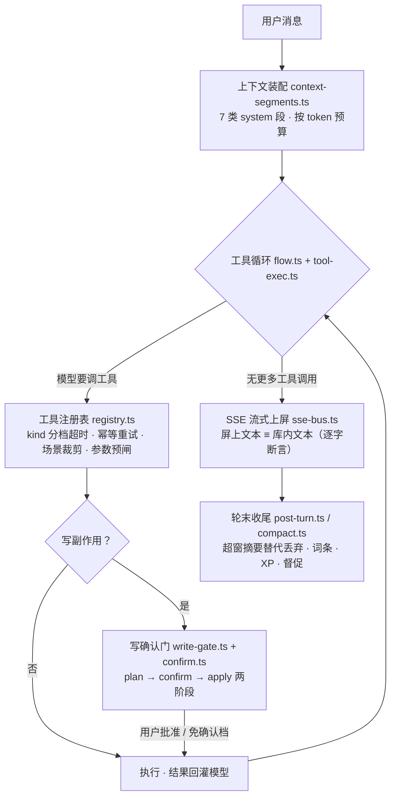

# StudentBuddy

[](https://github.com/llwand1/studentbuddy-v2/actions/workflows/ci.yml)


## 为什么用它

**StudentBuddy 是一个带工具循环、写操作确认门与长期记忆的学习 Agent；你自己的词条库是主体，而游戏化不是套在系统外面的皮——知识大陆、词条卡牌、对战、魔法吟唱用游戏隐喻表达学习内核（学 → 练 → 析 → 忆 → 反馈），彼此咬合成一个整体。** 对话核（`packages/server/src/chat/`，40+ 个源文件、约 8000 行源码，不含测试）是代码量最大的一块，在[功能与工程实现](#功能与工程实现)整节展开。

用它图什么，四句话说清：

- **对话本身就能干活**：流式回答 + 思考链可见，模型自己决定何时搜网、何时查你的词条库、何时出题；绑定长资料走 BM25 检索注入、带段号可溯源，70 万字资料也能对答；还支持聊天内生图与粘贴图片提问。
- **词条是主体，学的痕迹自动沉淀**：聊完的概念自动入库，一个词进了库就会驱动出题、决定复习时机（艾宾浩斯 1/2/4/7/15/30/60 天）、在回复里被高亮标出、长成卡牌、铺进知识大陆——不用你记笔记。
- **数据归你**：SQLite 单文件、本地可自托管、开源；不想把学习记录交给别人，这是最直接的理由。
- **前端依赖极少**：`@sb/web` 运行时依赖只有 react / react-dom，无 UI 库、无 Markdown 库、无图表库，渲染器全部自绘（见「前端零依赖」一节）。

**适合这些人**：想利用碎片化时间学一点的人、喜欢游戏化学习方式的人、长期啃一块硬知识的人、考前要系统复盘的人、不想把学习记录托付给第三方的人。

- **在线体验**：<https://11wand.com>（**已上线到 v0.2.144**）。首页点「免注册，直接体验」直连公用体验账号，免邮箱（开关在服务端）；⚠️ 公用池**全站共享、访客彼此可见**，别放个人信息或私密内容（应用内同一句警示，两语都写）。要长期留自己的词条再走邮箱注册，一分钟。
- **不想点网页？** clone 后 `npm run demo:e2e` 一条命令跑完**确定性全栈演示**（用户 → API → 假 LLM → SSE → 落库 → 杀进程重启后逐字仍在；零 API key、零真实外呼）。
- v2 是全新重写仓（v1 [`llwand1/studentbuddy`](https://github.com/llwand1/studentbuddy) 已冻结）。

> 🏷️ **两套版本号各管各的**：`v0.2.x` 是**部署构建号**——对外线，GitHub Releases / tag / 线上公开更新页 `/changelog` 都走它，每次发版加一；`2.0.0-alpha.0` 是**内部产品号**（`package.json` 的 `version`），标记「v2 重写线」这个产品大版本，不随每次部署跳。⚠️ `/api/status` 返回的是**内部号** ⇒ 判线上版本请对 **GitHub Release** 或 **`/changelog`** 页。
> 📌 本文所有定量数字**不许手抄**：由 `node tools/metrics.mjs` 产出，`--check` 在漂移时退出码 1——徽章、测试基线、线上版本号三条线都进对账（CI 里跑的就是 `metrics --tests --check`）。

## 产品判断：为什么砍功能、为什么转向游戏化

这一节讲一个已经落地的取舍。先说判断从哪来，再说砍了什么、转成了什么——每个结论都带可复验的证据。

**① 我们每天盯着线上真账。** 线上库只读审计（2026-09-24）：users 6 / sessions 47 / assistant 消息 139 条，按日活跃个位数。产品跑得通、确实有人打开过——⇒ 面对的不是「没人来」，是「来了不用」。（逐条实测与复验命令见 [`docs/metrics-product.md`](docs/metrics-product.md) §2）

**② 归因：创新点与访客的动线错开了。** 复盘发现两件事同时成立：原版叙事偏**传统学习风格**（题库 / 笔记 / 知识库一路排开），很多访客看一眼没兴趣就走开；而产品投入最多的两处——对话体验与 AI 出题——恰恰藏在访客最少走到的那几页里。**好东西没被走到，等于不存在。**

**③ 判断标准：惰性功能 vs 主动功能。** 任何新功能先答三问：用户必须先想起它存在才起作用吗？它会自己发起交互吗？拿掉它用户会察觉吗？三问都命中「惰性」，就先别写。

**④ 转向是转化，不是抛弃。** 内核不动，变的是「谁发起、什么时候出现」，以及用一套游戏化的隐喻来表达同一个内核：

- **知识图 → 知识大陆**：原来「写侧持续付成本、读侧零访问」的知识图页整族下线（见 ⑤），同一份词条与复习数据换一种表现形式复活——**词条地块、到期怪物、五题型挑战、英雄走位与领地扩散**，学一个词条铺一块砖、只增不减、到期只是褪色长草，复习变成一次「收复」。这不是新起炉灶，是同一个学习内核换上了用户愿意走进来的游戏隐喻。
- **题库 / 笔记 / 今日总结 → 下线**：出题能力保留在对话与对战里（对话出题、AI 主动出题、AI 对战），弱项统计随题库一起退场，留下的是当场判分 + 逐题解析。已下线功能的设计存档仍在文档索引里可查。
- **纪律两条**：游戏化数值一律**由学习行为解释**（XP 来自答题 / 复习 / 毕业词条，不做无行为空转的签到）；**不新增第三套数据**，能少一张表就少一张表。

**⑤ 判决留痕。** 知识图整族（编排画布 + 运行器 + 知识数据图）完整交付过，但实证是：`chat` 每一轮回复都在往 `knowledge_edge` 写边，而知识图页上线以来**无人访问**——写侧持续付成本、读侧零收益，一条典型的惰性功能。处置是本仓**第一条删除型迁移 v44**：DROP 七张表、不备份不归档，判决留痕在契约墓碑里。**删功能跟删代码一样要有证据**——这就是为什么我们持续追踪运营数据：不是为了报表，是为了让「下一步做什么」有依据。

## 功能与工程实现

下面按「一轮对话的生命周期 → 对话页上看得见的东西 → 出题管道 → 情景题 → 知识大陆 → 搜索 → 前端零依赖 → 测评」展开。

### 对话核：一轮对话的生命周期

这里的对话不是「接个大模型 SDK」就完事，而是一条完整的 Agent 管线：**上下文装配 → 工具循环 → 写确认门 → 流式上屏 → 轮末收尾**，每一环都有独立模块、独立契约与回归锁。



**① 上下文装配**（`context-segments.ts`）：摘要、日期、词条、文档块、回答风格、长期记忆、追问提示 **7 类 system 段**按一份有序清单注入，预算核算与实际组装都从这份清单派生——同一份清单此前手写两遍、漏一处不报错只静默漂，收成单一真相源后才算修掉。截断边界**对齐完整工具轮**（缺前置 tool_calls 的孤儿 tool 消息会被 OpenAI/Anthropic 400 拒绝——v1 崩溃级 bug 的修复原样保留）。

**② 工具循环**（`flow.ts` / `tool-exec.ts` / `tools/registry.ts`）：模型可调用 **11 个注册工具**，注册表每个工具带必填元数据 `kind`（分档超时 / 同参幂等重试 / 确认门缺省三个消费方的共同事实源，漏声明=编译期报错）、可选场景裁剪；下发清单超上限按声明顺序截断且留警告，**截断是事实、不静默**。参数不合法不执行工具，回灌「怎么改对」让模型自纠。

| 工具 | 一句话 | 确认门 |
|---|---|---|
| `search_web` | 联网搜索（四层体系的一层，见下） | 免 |
| `fetch_page` | 抓网页正文（SSRF 护栏 + 白名单，单页不遍历） | 免 |
| `fetch_image` | 抓取图片资源 | 免 |
| `lookup_terms` | 查用户词条库（正文高亮注入的数据源） | 免 |
| `upsert_term` / `delete_terms` / `tidy_terms` | 词条增改 / 删 / AI 整理 | 按条数阈值弹卡（默认 5）；**delete 恒弹卡** |
| `generate_quiz` | 出题引擎工具化：对话里说「考我」，模型自己发起（见下） | — |
| `generate_image` | 聊天内生图：文生图工具，生图模型在设置页单独绑定 | — |
| `ask_choice` | 方案选择框：挂起等用户选择（唯一豁免超时档的工具） | 免 |
| `offer_pk_battle` | AI 主动约战：邀请**只能**由这个工具发出，没有 REST 创建口 | 免 |

**③ 写操作确认门**（`write-gate.ts` / `confirm.ts`）：写类工具必须实现 `planWrite`（**只算不改**）→ gate 按影响条数决定弹不弹确认卡 → `apply()` 是**唯一落库入口**，只在「批准或免确认档」后被调用，拒绝 / 超时路径下 apply 调用次数恒为 0（回归锁直接钉这一条）。确认卡必带「动作一句话」与 ≤8 行清单——只有条数没有动作描述的卡不许上线；批过的写入**按批可撤销**。

**④ 流式上屏**（`sse-bus.ts`）：token 级 SSE，**屏上文本与库内文本逐字一致**；断线指数退避重连 + 轮内序号回放去重。这两条在 e2e 演示里逐条断言过。

**⑤ 轮末收尾**（`post-turn.ts` / `compact.ts` / `memory.ts`）：上下文超窗口时，被丢的那段先交给 LLM **摘要替代而非直接丢弃**（与 Pi 的 compaction 同型，三处刻意不同：异步 fire-and-forget 下一轮生效——学习场景用户盯着屏幕，多等 2~5 秒是净损失；摘要模板换学习版；`[MEMORY]` 长期记忆块借同一次调用产出省一次 LLM）。

### 对话页：一个回复流里会发生什么

上面管线之外，同一条回复流里还叠着这些（全部自研）：

- **思考链面板**——原生 reasoning 链可见，收起展开自己控制
- **工具步骤折叠行**——每个工具调用的 running / done / error 实时上屏，可折叠
- **grill-me 模式**（`grill.ts`）：`ask_choice` 的工程链路早就全通，但真机几乎见不到——根因是「要不要追问」的触发权在模型手里，`tool_choice='auto'` 的出厂倾向是把答案直接讲完。结论：**「要不要问」不该是模型的概率判断，该是用户的显式开关**。打开后每一轮必出选择框（开场问方向 + 收尾问下一步），靠 `tool_choice` 强绑由工程保证，不依赖模型自觉
- **写操作确认卡**——两阶段确认（见上），弹卡、批准、撤销全程在对话流里完成
- **AI 主动发 PK 邀请卡**——不用去对战页，AI 觉得该练一手时自己递卡
- **聊天内生图**（`generate_image`）：模型自己决定何时画图，生图模型在设置页单独绑定，平台侧有每日张数闸
- **图表卡 / HTML 卡 / SVG 卡在沙箱里真跑**——不是贴截图，是活的可交互内容（沙箱机制见「安全与隐私」）
- **粘贴图片提问**（`vision.ts` 视觉蒸馏）：主模型**始终纯文本**、不直接收像素；图先发给独立配置的视觉角色模型蒸馏成中文描述再入上下文——主模型选型不被看图绑架、视觉能力可插拔、描述随消息持久化（历史回放不再二次调视觉模型）。提示词套路是踩坑后固化的：关键信息放最前，因为视觉模型撞 max_tokens 是从后往前截
- **「向 AI 追问」另开 fork 会话**（`follow-up.ts`）——追问不污染原对话，也不丢上文
- **任务进度面板**（`task-list.ts`）——AI 领了的多步任务在对话里可见可查
- **出题配图 SVG**——模型自决给几何 / 电路题附图，图坏只删图不删题
- **导出 Markdown**——对话与词条拿得出去，不被锁在库里
- **文档模式**——绑定长资料走 BM25 检索注入、带段号可溯源，70 万字资料下旧直塞覆盖率 0/13 → 新检索 13/13

### AI 出题：一条管道，不是一个按钮

出题在对话里是 **Agent 工具**（`generate_quiz`）：用户说「考我」，模型自己触发、自己定题型配比。这条管道里的每一环都处理过模型不可信的问题：

- **六型配比可调**：单选 / 多选 / 填空 / 解答 / 判断 + 情景题，按题型配比出组
- **出题前先问一次回答方式**（`AskStyleCard`，四维偏好）——同一道题，讲给想先看例子的人和想先推导的人不一样
- **出题联网检索**：出题前先搜网、参考进提示词、**失败不阻断出题**；题卡挂参考来源列表，并如实上报「检索开没开 / 命中几条 / 哪个源失败」
- **真题 + AI 题合流**（`quiz-source-mix.ts`）：按题型分别配「AI 几道 / 真题几道」；真题走检索 → 抓页 → 摘题 → **逐字校验**才入库，摘不够就**报缺不补**——宁少勿假。判断题与情景题的真题配额**恒为 0**（`quiz-source.ts`：判断题网上规范格式稀少、多为交互式小部件，摘不出可判分版本）——配比是算出来的，不是拍出来的
- **五级解析阶梯 + AI 特化 SVG 配图**：模型犯错不塌整组，丢图保题

### 情景题：让不可信的模型页面当考场

情景题要处理的是一个完整的信任边界问题：**AI 生成一个可交互 HTML demo 当考题，但模型写的页面是不可信侧，怎么让它安全地当考场？**

- demo 内嵌**评分点**（choice / state / order 三种判型）——用户在 demo 里点、拖、操作，demo 上报的不是对错，是「发生了什么」
- **对错由服务端裁判**：因为打分逻辑绝不能交给不可信页面自己——页面说什么不算，服务端比对才算
- demo 跑在 **CSP sandbox（opaque origin）+ iframe 双层沙箱**里，页面源为 `null`——而写接口的 Origin 校验**不放行 `'null'` 源**，所以 demo 调不动任何写接口
- **回传只有一条独木桥**：服务端注入的桥接脚本（`SCENARIO_BRIDGE_JS`，带 demoId 防串台）→ `window.parent.postMessage` → 宿主白名单校验 → REST 上报（契约 [`docs/SCENARIO-SPEC.md`](docs/SCENARIO-SPEC.md)）
- 要点是：**不是「信任 AI 然后祈祷」，而是把「AI 产出不可信」当成前提，再设计出让不可信产物也能参与真实业务的通道**

### 知识大陆：把复习做成一次收复

游戏化外壳的主舞台，也是「知识图 → 知识大陆」这场转化的落点：

- **词条即地块**：学过的词条从中心往外铺成地图，越靠中心学得越早；地图**只增不减**，到期只是褪色长草、长出怪物，复习打败它就把地块收复——「我学过什么、哪些该复习」变成一张一眼看得懂、并且想继续铺下去的地图
- **五题型挑战**：收复战斗就是出题引擎题型的实战场，当场判分
- **英雄走位 · 领地扩散 · 每日宝箱 · 图鉴**：走位与领地由学习行为驱动，宝箱由打卡开出——数值全部由学习行为解释
- **魔法吟唱**：把一段聊过的对话当「咒语」对怪施法——复述当初的提问、重做当初的题，命中几节打几点，咒语正文提到这块地的词条则威力加倍；每次吟唱掷骰化作五款像素释放特效之一（无光斩 / 悔罪光柱 / 月下叶舞 / 风灵旋刃 / 炎蛇，canvas 低清逐帧编排，款式只改画面不改数值），口径见 `docs/SPELL-CHANT-SPEC.md`
- **开放世界 + 玩家创建 NPC 学习伙伴**（v0.2.140）：地图比屏幕大、视口相机拖拽与「回到我身上」；学习伙伴由玩家在地图上点格创建、自带起名与人设（`npc` 模型角色，未单独绑定时回退讲解角色）
- **验证方式如实说**：走位 / 领地 / 宝箱 / 情景题这几项是用**真机 CDP 探针**验的（`tools/probes/continent-cdp.mjs`：跑真页面 + 真接口，五组断言连续两轮 PASS），**不是人工目检**；两条已知待办（地图静止后常驻演出停帧、寻路遇障不绕路）列在本文「已知限制」一节

### 搜索：四层，不是一层

「联网搜索」四个字背后是四套各自独立的检索体系：

1. **对话内 `search_web`**：Exa / Tavily / 智谱按 key 并行聚合 + Bing 免 key 兜底，SSRF 护栏 + 出网白名单
2. **出题联网检索**：上面出题管道里那条，独立超时、失败不阻断、来源可上报
3. **全站全文搜索**：SQLite FTS5 影子表（`search_index`），消息与词条两族索引，全局搜索入口直达
4. **`fetch_page` / `fetch_image`**：网页正文与图片读取工具，单页不遍历

### 前端零依赖是选择，不是省事

`@sb/web` 的运行时依赖只有 react / react-dom——无 UI 库、无 Markdown 库、无图表库。**Markdown 渲染器 266 行自绘**（`Markdown.tsx`），SVG 净化、图表、代码高亮同样自绘。为什么：

- **安全**：这个前端要渲染的是**模型产出的不可信内容**，自绘意味着净化逻辑、围栏白名单（```svg / ```chart / ```html 三种之外一律转义）、攻击面全部自己握着，不替第三方库的 CVE 背锅
- **代价如实**：行内公式不渲染（`$…$` 按原文显示）、`mermaid` / `echarts` 围栏降级代码块——刻意的取舍，登记在「已知限制」

### 测评：怎么证明上面每句话

**文档说的任何话都可以不信，下面三条命令的输出可以当场信。**

| 命令 | 你会看到 |
|---|---|
| `npm run check` | tsc×3 ＋ eslint ＋ vitest 全量 ＋ 四项门禁（行数红线 / 禁 `any` / 禁内联样式 / 测试逐文件登记）一次跑绿 |
| `npm run demo:e2e` | **确定性全栈**：注册 → 假 LLM → SSE → 落库 → **杀进程重启后逐字仍在**，34 条断言全过，零 API key、零真实外呼；对已下线路由（`/bank/:id` 等）有**墓碑锁**（断言 404，防止功能悄悄复活没人知道） |
| `node tools/metrics.mjs --tests --check` | 本文与首屏的**每个可核对数字**对代码实测对账，漂移即退出码 1（CI 跑的就是这条） |

当前测试基线 **259 文件 / 3314 例**，全绿；passed/skipped 明细随平台略有差异（skipped 数分平台不同），**不进本文手抄**——实跑明细由 `node tools/metrics.mjs --tests` 当场产出。逐文件不变量见 [`docs/TEST-PLAN.md`](docs/TEST-PLAN.md) §3。

**四项门禁由 CI 强制**：server 单文件 ≤400 行、web 组件 ≤320 行（逼着功能拆文件，`flow.ts` 贴线开新文件就是常态）；全仓禁 `any`；web 禁内联 `style={{`（一律走 tokens.css token）；每个测试文件必须在测试清单登记。`metrics.mjs` 负责另一类腐烂：数字由脚本产出落 `docs/metrics.md` 标记区，README 徽章、正文基线、线上版本号与首屏统计全部进 `--check` 对账——手抄的数字必然腐烂，这一课在本文自己的历史里发生过不止一次。

## 界面预览

> 全部是**真机截图**：无头浏览器直出，按仓库当前源码在本地形态渲染，不是设计稿也不是拼接。跑图用临时隔离库，往里灌一小批示例词条好让卡墙和地图上有东西可看——跑完即删，不碰真实数据，也不调用模型。

**对话**——像素风应用壳：左侧导航、中间对话，右下角是常驻督促胶囊


**词条卡牌**——上面是每日宝箱与任务清单，下面是按星级铺开的卡墙


**知识大陆**——词条从中心往外铺成地块，越靠中心说明学得越早


整套界面是统一的像素风主题：聊天、词条、卡牌、知识大陆、对战与设置共用一套配色和图标；系统打开「减少动态效果」时动画会让位。

## 快速开始

**不想装环境？** 直接打开 **<https://11wand.com>**。**想完全本地、数据只留在自己机器上？** 按下文跑本地单机形态——两种形态**共用同一份代码**，差异只在环境变量。

> ⚠️ **Node 版本必须「装依赖」与「运行时」一致**（`engines: >=22.11.0`，仓库带 `.nvmrc`）：`better-sqlite3` 是原生模块，产物按**安装那一刻**的 Node ABI 编译；换 Node 大版本必须删 `node_modules` 重装，只换运行时无效，症状是涉库代码全线 `ERR_DLOPEN_FAILED`（极易误判成新代码写错）。

```bash
npm install          # workspaces 三包一次装齐（装依赖的 Node = 以后跑的 Node）
npm run check        # lint(tsc×3 + eslint) + test(vitest) + gates —— 全绿基线
npm run demo:e2e     # 确定性全栈演示：34 断言，零 API key、零真实外呼、临时隔离库
npm run dev          # 一条命令并行拉起 api :18791 + web :5173（Ctrl+C 一起停）
```

浏览器打开 **http://localhost:5173**（vite 监听 IPv6 `::1`，用 localhost 而非 127.0.0.1）。首次使用：设置页添加 AI 服务商（OpenAI 兼容协议）；要用联网搜索再配搜索 key。

## 架构

**单页架构图**（20 秒读法：从上往下＝一次请求的旅程；三条虚线＝三道边界——信任、归属、凭据）：


**三包职责**：`@sb/shared` 只放契约与纯函数（前后端共用一份，不允许各写一套）；`@sb/server` 承载全部业务域（Express + better-sqlite3，逐版本迁移 v1..v45）；`@sb/web` 是 React 18 前端，**零第三方运行时依赖**（无 UI 库 / 无 Markdown 库 / 无图表库）。

**一级视图五个**（`App.tsx` 的 `View` 联合）：对话 / 词条 / 卡牌 / 知识大陆 / 设置；对战是 `#/pk` 独立页，督促是常驻胶囊。★ 新功能**默认不新增一级导航项**。

运行时形态：`api(Express :18791，默认仅绑 127.0.0.1) + web(Vite :5173)`，数据存 SQLite 单文件（WAL）；多用户 Web 形态同一份代码 + 邮箱/密码/GitHub OAuth 鉴权 + 按用户数据归属 + Caddy 反代 + systemd 守护。★ `server/auth/form.ts` 是形态的**唯一事实源**（`SB_REQUIRE_AUTH` 开 = cloud / 关 = local），「本地有、线上没有」的功能一律从这里判断，禁止各自读 env。

目录结构、模块地雷图与代码地图见 [`docs/ENGINEERING.md`](docs/ENGINEERING.md) §4。

## 安全与隐私

按 ADR-2「安全做必要最小」：

- **Origin 校验**：写操作校验 Origin，**不放行 `'null'`**（sandbox 预览页的源就是字符串 null，放行等于让模型写的网页能调写接口——情景题与沙箱卡的整条信任边界就建在这条上）
- **口令与会话**：`crypto.scrypt` 派生且**参数随哈希自描述落库**；库里只存 `SHA-256(sessionToken)` + `HttpOnly` cookie；「邮箱不存在」与「密码错」回同一个错误码
- **验证码**：签发即哈希入库、一次性靠**原子认领**（先查后改会让同一个码用两次）；真正的防线是尝试上限 + 发送侧限流
- **模型产出不裸跑**：```html 走 `CSP: sandbox`（无 allow-same-origin）＋ iframe 双层沙箱，页面源为 `null`；```svg 净化剥 `<image>` 外链（防信标泄露 IP）与全部脚本载体
- **密钥不出接口**：搜索 key 与模型 key AES-GCM 密文入库，响应只回布尔；搜索 / 抓取出网走 **SSRF 护栏 + 白名单**，抓页单页不遍历
- **归属过滤按读形状分两把锁**：读「一批行」用 `ownerFilter`，读「一个值/聚合」用 `ownerForWrite`；跨用户访问一律 **404 不回 403**（403 等于承认「这个 id 存在」）

## 已知限制

> 这一节的立场：**先说自己哪里不行。** 判断「哪些是缺陷、哪些是定档边界」的完整清单在 [`docs/metrics-product.md`](docs/metrics-product.md)。

- **可用性目前算不出来**：看门狗每 5 分钟采样，但**只在异常时落笔**、健康时不留记录 ⇒ 没有分母，只能给「发生过几次 DOWN」，给不出百分比。这是量化侧第一件要修的事
- **线上量级是个位数**：注册数含 owner，独立访客数没有可靠口径，按日活跃仍是个位数 ⇒ 产品指标（留存 / 转化 / 功能分布）**此刻算不出来**，本文任何产品行为类声明都不出自它们
- **容器化：本机已跑通，服务器还没切**：2026-09-27 在 Windows Docker Desktop / WSL2 上首次把 compose 全栈真跑起来（`build` 成功、注册登录与 `/me` 全通、`down` 不带 `-v` 重起后会话仍在＝持久卷成立），顺手修掉四处拦路硬伤。但**服务器侧仍是旧的 systemd 部署**，容器路径也没进自动化测试门禁（只靠人工按单验证）——不拿「本机能跑」冒充「一键部署可用」
- **线上跑的是源码，不是编译产物**：systemd `ExecStart` 为 `npx tsx src/index.ts`，实测这条包装链**白吃约 130MB**（机器只有 961MB）；编译态切换与容器化一并推进
- **版本号验证口径已换**：`/api/status` 返回内部产品号，不是部署构建号 ⇒ 判线上版本请对 GitHub Release 或 `https://11wand.com/changelog/index.html`（RSS 在 `/atom.xml`）
- **上游并发闸门是进程内 `Map`**：多实例部署下容量 × 实例数，全站封顶只在单进程内成立；且**全站并发值 N 仍是占位值 8**，沿用上线会收到「当前免费通道繁忙」
- **文档模式是词法检索，不是语义检索**：没有 embedding / 跨会话资料库 / 持久化索引 / pdf-docx 解析；用户**不用资料里的原词**改写提问时，70 万字规模下召回收敛在 **8/13 ≈ 62%**（词法路线的性质，只能靠向量路线突破）
- **渲染层覆盖不完整**：jsdom 交互测试覆盖了最高频的几页，**其余页面仍无 jsdom 测试**；且 jsdom 里没有真 CSS、也没有 `DOMParser` / `getBBox` 这类真实浏览器 API ⇒ 布局与观感类症状只能靠真机探针 + 人工目检
- **行内公式不渲染**（`$…$` 按原文显示）、`mermaid` / `echarts` 围栏降级代码块——刻意不引库以保住 `@sb/web` 零第三方依赖
- **预览页只活内存**：服务重启即失效、无分享链接（内置面板无地址栏、宽度不可拖拽，是定档边界不是缺陷）
- **知识大陆两条已知待办**：地图静止后常驻演出会停帧；点地寻路遇障不绕路、也不提示
- **微信 / 短信登录未做**：两者均要求企业主体资质，个人无法申请；留作资质就绪后的增强，且必须映射到同一个 user
- **两个未加归属列的例外**：`evolution_*` 与 `scenario_demo`（契约未点名，触达均经已归主父表的闸门）

★ 工程量化（源码 / 测试 / 路由 / 契约 / 覆盖率）由 `node tools/metrics.mjs` 产出，落地在 [`docs/metrics.md`](docs/metrics.md)；同一份文件的 §线上运行态快照 还记着那台 VPS 的实测。

## 文档索引

`docs/` 是本仓的**权威技术文档面**：`*SPEC*.md` 是行为契约（**改行为先改契约**）。

| 文档 | 内容 |
|------|------|
| [`ENGINEERING.md`](docs/ENGINEERING.md) | **工程文档**：工程约定（规模约束 / 禁 `any` / 禁内联样式 / 测试登记 / 契约先行）/ 四条复验命令 / 三道最难的工程问题 / 仓库结构与代码地图 / 门禁与扩展模式 / 配置说明 |
| [`GAMIFIED-AGENT-SPEC.md`](docs/GAMIFIED-AGENT-SPEC.md) | **游戏化产品口径契约**：一句话叙事 / 轻量化·可玩性·开放性判断标准 / 明确不做 / 分期 |
| [`TOOL-ECOSYSTEM-SPEC.md`](docs/TOOL-ECOSYSTEM-SPEC.md) | 工具生态契约（注册表 / 元数据 / 确认门 / 场景裁剪） |
| [`SCENARIO-SPEC.md`](docs/SCENARIO-SPEC.md) | 情景题契约（评分点判型 / 桥接脚本 / 沙箱边界） |
| [`TERM-CARDS-SPEC.md`](docs/TERM-CARDS-SPEC.md) | 词条卡牌契约（卡墙 / 星级 / 宝箱 / 任务清单） |
| [`MEMORY-SPEC.md`](docs/MEMORY-SPEC.md) · [`MEMORY-TREND-SPEC.md`](docs/MEMORY-TREND-SPEC.md) | 长期记忆契约（压缩 / 画像）/ 记忆联动契约 |
| [`COACH-SPEC.md`](docs/COACH-SPEC.md) | 学习督促契约 |
| [`EBBINGHAUS-SPEC.md`](docs/EBBINGHAUS-SPEC.md) | 复习时钟契约（间隔序列 / 日历日口径 / 选择式范围） |
| [`PK-SPEC.md`](docs/PK-SPEC.md) | 对战契约（计分细则 / power 语义 / 断点口径） |
| [`DOC-RAG-SPEC.md`](docs/DOC-RAG-SPEC.md) · [`FTS-SPEC.md`](docs/FTS-SPEC.md) | 文档模式契约（BM25 检索）/ 全站全文搜索契约 |
| [`AUTH-SPEC.md`](docs/AUTH-SPEC.md) · [`TENANCY-SPEC.md`](docs/TENANCY-SPEC.md) | 账号契约 / 多租户归属契约 |
| [`SSE-CONTRACT.md`](docs/SSE-CONTRACT.md) · [`CHAT-UX-SPEC.md`](docs/CHAT-UX-SPEC.md) | SSE 事件与 HTTP 接口契约（前端对接核心）/ 对话页流式期与常用动作口径（重试 / Esc 停止 / 会话草稿 / 标题态 / 引用追问） |
| [`TEST-PLAN.md`](docs/TEST-PLAN.md) | **测试清单**：测试策略 / 运行命令 / 逐文件不变量（每个测试文件锁什么） |
| [`DEPLOY.md`](DEPLOY.md) | **部署手册**：服务器 / systemd / 五条部署 env / TLS / 备份 / 回滚 |
| [`CHANGELOG.md`](CHANGELOG.md) | 已发布版本的对外更新记录 |

★ 完整契约清单（38 份 SPEC）直接看 `docs/` 目录。仓内以 `docs/` 与代码为准；文档与实现冲突时**以代码 + 测试为准**。
