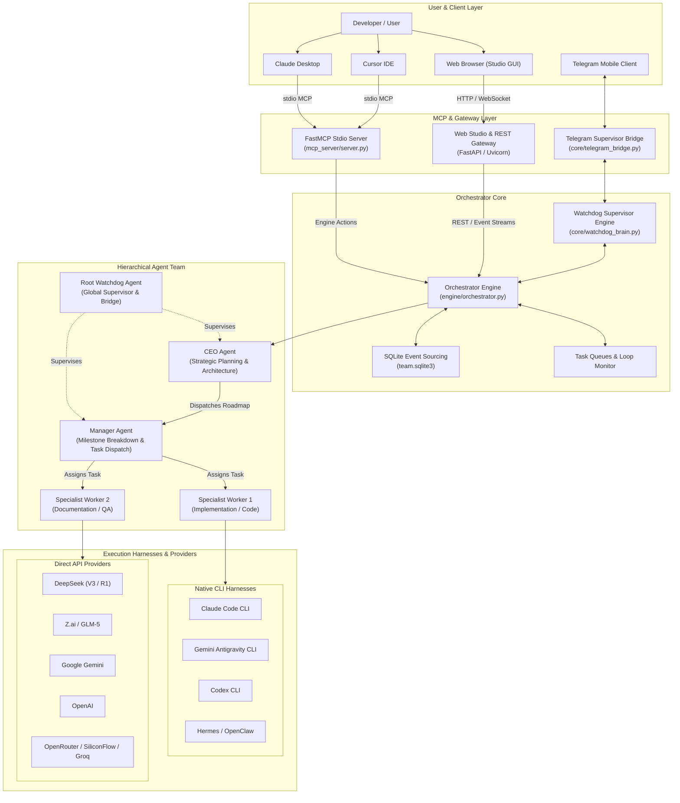

# Agentic Team MCP — Persistent Multi-Agent Orchestration for Model Context Protocol

[](LICENSE)
[](https://www.python.org/)
[](https://modelcontextprotocol.io)
[](#)
[](#)
[](https://t.me/ufljarvisbot)


*Live interactive Web Studio floor visualization showing Root Watchdog supervision, hierarchical reporting trees, and dynamic agent collaboration links. (See animated preview: [`assets/web_studio_preview.gif`](assets/web_studio_preview.gif))*

> **Agentic Team MCP** is an enterprise-grade, local-first multi-agent orchestration platform designed around the [Model Context Protocol (MCP)](https://modelcontextprotocol.io). It establishes a persistent, hierarchical agent workforce (**Root Watchdog Supervisor → CEO Strategy → Manager Execution → Specialist Workers**) that bridges native CLI coding environments (Claude Code, Gemini Antigravity, Codex) with unified direct API providers (DeepSeek, Z.ai/GLM, Google Gemini, OpenAI, and OpenRouter).

---

## Author's Note

> **Abdulaziz Komilov (@menma4ever)**, student researcher in local model fine-tuning and quantization, building persistent, cost-effective multi-agent teams across native CLIs (Claude Code, Gemini Antigravity, Codex) and Model Context Protocol.
> 
> Modern agent frameworks often suffer from three fatal flaws: fragile ephemeral execution contexts, proprietary cloud lock-in, and ballooning API token costs. **Agentic Team MCP** was engineered to solve these problems by coupling **persistent SQLite event sourcing** with **native CLI adapters** (leveraging existing subscription authorizations like Claude Code, Gemini Antigravity, and Codex CLI) alongside high-efficiency open-weights models (DeepSeek-V3/R1 and GLM-5). The result is an autonomous, self-healing team architecture capable of executing complex engineering milestones locally, deterministically, and cost-effectively.

---

## Visual Architecture



---

## Why Agentic Team MCP?

| Feature | Agentic Team MCP | Traditional Multi-Agent Frameworks | Standard MCP Servers |
| :--- | :--- | :--- | :--- |
| **Persistence Model** | **Resilient SQLite Event Sourcing** (resumes after restart/crash) | In-memory or ephemeral sessions | Ephemeral (lifetime of stdio pipe) |
| **Team Hierarchy** | **Strict 5-Tier** (Watchdog → CEO → Manager → Specialists → Owner) | Flat peer-to-peer or unstructured swarm | Single-agent tool provider |
| **Execution Harness** | **Dual Harness** (Native CLI Subprocesses + Direct API) | API-only (HTTP calls) | External tool execution only |
| **Cost Optimization** | **Subscribed CLI Auth Pools** (Claude Code, Antigravity, Codex) | Per-token commercial billing only | Host application pays per call |
| **Local-First Security** | **Air-gapped local storage**, zero telemetry, auto key-redaction | Cloud dashboard telemetry & logs | Depends on client implementation |
| **Real-time Web Studio** | **Full-screen canvas**, live terminal streams, process monitors | Static CLI output or paid SaaS dashboard | None (headless) |
| **Human In The Loop** | **Telegram Mobile Bridge** & Root Watchdog supervision | Webhooks or email alerts | Host client UI only |
| **Tool Protocol** | **Full Model Context Protocol (MCP)** specification support | Custom proprietary tool schemes | MCP Standard |

---

## Key Architectural Capabilities

### 1. Persistent Multi-Agent State & Event Sourcing
Unlike ephemeral agent systems that lose all state on reload, Agentic Team MCP records all state mutations, messages, agent definitions, and task outcomes in an event-sourced SQLite database (`team.sqlite3`). If your system reboots, the engine reconstitutes the full agent graph and automatically resumes pending assignments.

### 2. Multi-Account Google Auth Pool (`core/auth_pool.py`)
- **Directory Isolation**: Per-account directory sandboxes (`auth/google/account_XX/`) with separate credential vaults.
- **Windows Keyring Vault Swap**: Automated backup and capture of active tokens preventing profile contamination on Windows.
- **Sticky KV-Cache Affinity**: Grants agents slot affinity (`forced_auth_slot_id`) to maximize prompt cache hits.
- **Automatic 429 Quota Failover**: Detects rate limits or token saturation and fails over to healthy slots seamlessly.

### 3. Multi-Harness Subsystem (`harness/`)
- **Native CLI Subprocess Runners**: Directly leverages your active terminal subscriptions (`agy`, `codex`, `claude`) in headless mode without per-token charges.
- **High-Throughput Direct API Client**: Async SSE streaming client supporting DeepSeek-V3/R1, Zhipu GLM, OpenAI, Experiential Labs (`xpl`), and Groq.
- **Context Preservation & Handoffs**: Automatically serializes transcripts on model/harness switches (`manager/.handoffs/<hash>.json`) to prevent cognitive amnesia.

### 4. Root Watchdog & Autonomous Telegram Bridge (`core/telegram_*`)
- **Always-on Mobile Supervision**: Connect via Telegram (`@ufljarvisbot`) with strict chat ID whitelisting (`5644286697`).
- **Human-like UX**: 4.5s typing simulation loop, mobile-first formatting, and automated `[DISPATCH]` & `[SEND_FILE]` directives.
- **Multimodal Ingestion (`core/multimodal.py`)**: Audio voice notes are transcribed via speech-to-text; images and PDFs are converted to native vision tokens.

### 5. Real-Time Web Studio GUI (`web/`)
- **Full-Screen Team Floor**: Interactive node-link canvas showing agent states (`idle`, `working`, `resting`, `failed`). Click the fullscreen icon to expand the floor to the entire display.
- **Live SVG Message Vectors**: Real-time traveling pulses along SVG vectors whenever agents exchange messages or report results.
- **Comprehensive Telemetry**: Granular dashboards tracking `input_tokens`, `output_tokens`, `cache_read_tokens`, and provider burn in real time.

### 6. Granular Security Boundary
- **Strict Workspace Sandboxing**: Specialist workers operate strictly within their assigned project directories (`workers/<name>/`).
- **Automatic Key Redaction**: Zero-secret leakage policy regex-redacts sensitive API keys and tokens across console streams and log files.

---

## 2-Minute Quickstart Guide

### Prerequisites
- **Python 3.11+** installed and available on your system `PATH`.
- **Git** installed.
- *(Optional)* Installed CLI tools: `claude` ([Claude Code](https://docs.anthropic.com/en/docs/agents-and-tools/claude-code/overview)), `agy` ([Antigravity CLI](https://github.com/google-gemini)), or `codex` ([OpenAI Codex](https://github.com/openai/codex)).

---

### Step 1: Installation & Setup

#### Windows (One-Click Setup)
Clone the repository and run the automated PowerShell setup script:
```powershell
git clone https://github.com/menma4ever/agentic-team-mcp.git
cd agentic-team-mcp
.\Setup.ps1
```

#### Manual Virtual Environment Setup (Cross-Platform)
```bash
# 1. Clone the repository
git clone https://github.com/menma4ever/agentic-team-mcp.git
cd agentic-team-mcp

# 2. Create and activate a Python virtual environment
python -m venv .venv

# On Windows (PowerShell):
.venv\Scripts\Activate.ps1
# On Linux / macOS:
source .venv/bin/activate

# 3. Install core dependencies
pip install -r requirements.txt
```

---

### Step 2: Configuration

Copy the clean example settings template to `settings.json`:
```bash
cp settings.example.json settings.json
```

Edit `settings.json` with your preferred API keys or enable local CLI harnesses:
```json
{
  "api_keys": {
    "deepseek": "sk-your-deepseek-key",
    "zai": "your-zai-api-key",
    "gemini": "your-gemini-api-key",
    "openai": "",
    "anthropic": ""
  },
  "cli_auth_enabled": {
    "claude": true,
    "agy": true,
    "codex": false
  }
}
```

---

### Step 3: Launching the Platform

#### Launch Web Studio & Orchestrator Engine
On Windows, simply double-click `Launch.cmd` or run:
```cmd
Launch.cmd
```

Alternatively, from an activated virtual environment:
```bash
python main.py
```
This automatically boots the background orchestrator service, launches the Web Studio GUI, and opens your default browser at `http://127.0.0.1:8765/#token=<token>`.

#### Available Command-Line Arguments
```text
python main.py [OPTIONS]

Options:
  --port INTEGER    Port for web studio & engine (default: 8765)
  --no-browser      Start engine and studio without opening browser
  --mcp             Run as stdio Model Context Protocol (MCP) server
  --console TEXT    Open human-in-the-loop interactive console for agent
```

---

### Step 4: Connecting to MCP Clients

Agentic Team MCP operates as a high-performance stdio MCP server that connects directly to your background engine.

#### Claude Desktop Configuration
Add the server definition to your `claude_desktop_config.json`:

- **Windows:** `%APPDATA%\Claude\claude_desktop_config.json`
- **macOS:** `~/Library/Application Support/Claude/claude_desktop_config.json`

```json
{
  "mcpServers": {
    "agentic-team": {
      "command": "C:\\path\\to\\agentic-team-mcp\\.venv\\Scripts\\python.exe",
      "args": [
        "C:\\path\\to\\agentic-team-mcp\\main.py",
        "--mcp"
      ]
    }
  }
}
```

#### Cursor IDE Configuration
Add the configuration to `.cursor/mcp.json` in your workspace or global Cursor settings:

```json
{
  "mcpServers": {
    "agentic-team": {
      "command": "C:\\path\\to\\agentic-team-mcp\\.venv\\Scripts\\python.exe",
      "args": [
        "C:\\path\\to\\agentic-team-mcp\\main.py",
        "--mcp"
      ]
    }
  }
}
```

---

## Available MCP Tools Reference

When connected via MCP, Agentic Team exposes a comprehensive set of orchestration tools:

| Tool Name | Scope | Description |
| :--- | :--- | :--- |
| `list_projects` | Workspace | Enumerate all active and completed multi-agent team projects. |
| `create_project` | Workspace | Initialize a new project and provision the root CEO agent. |
| `get_team_tree` | Inspection | Retrieve the full hierarchical agent tree with live statuses and telemetry. |
| `get_agent_activity` | Owner | Inspect real-time execution event logs and command outputs. |
| `get_agent_conversation` | Owner | Read authenticated conversation messages and handoff records. |
| `create_manager` | Orchestration | Dispatch an operational Manager under the CEO for milestone management. |
| `spawn_worker` | Orchestration | Provision specialized workers with assigned task descriptions and harnesses. |
| `send_team_message` | Messaging | Dispatch targeted, authenticated peer or hierarchy messages. |
| `reconfigure_agent` | Management | Dynamically switch models or harnesses with saved state handoff. |
| `read_worker_status` | Status | Query worker lifecycle stage, current activity, and recent outputs. |
| `terminate_worker` | Cleanup | Safely decommission worker processes and clean up or archive workspaces. |
| `escalate_to_ceo` | Hierarchy | Bubble up blocking architectural or security issues to the CEO. |
| `team_action` | Action Bus | Unified action channel (`read_file`, `write_file`, `update_status`, `report_result`, etc.). |

---

## Directory Structure

```text
agentic-team-mcp/
├── assets/                  # Studio screenshots & preview assets
│   ├── web_studio_team_floor.png
│   ├── web_studio_preview.gif
│   └── web_studio_overview.png
├── Launch.cmd               # Fast Windows launcher
├── Setup.ps1                # Automated PowerShell virtualenv & dependency setup
├── LICENSE                  # MIT License
├── README.md                # Project documentation & guides
├── requirements.txt         # Core dependencies
├── settings.example.json    # Example configuration template
├── main.py                  # Main entry point (Web Studio, Engine & MCP Server)
├── core/                    # Core supervisor, telegram bridge, auth pool & config
│   ├── auth_pool.py         # Multi-account rotation & CLI auth slots
│   ├── catalog.py           # Dynamic model & harness discovery
│   ├── config.py            # Pydantic schema validation & redaction
│   ├── credential_store.py  # Secure local credential storage
│   ├── multimodal.py        # Visual analysis & image processing
│   ├── service.py           # Engine lifecycle & process locking
│   ├── telegram_bridge.py   # Telegram supervisor bridge & alert loop
│   ├── telegram_supervisor.py # Interactive mobile control endpoints
│   ├── watchdog_brain.py    # Root Watchdog intelligence & evaluation
│   └── workspace.py         # Sandboxed workspace directories
├── engine/                  # Orchestration core & persistence
│   ├── actions.py           # Agent action handlers & dispatching
│   ├── loop_monitor.py      # Stuck-loop detection & runaway turn prevention
│   ├── message_router.py    # Priority messaging & event routing
│   ├── models.py            # Pydantic data models for agents & tasks
│   ├── orchestrator.py      # Central event loop & agent scheduler
│   └── store.py             # SQLite event-sourcing database layer
├── harness/                 # Subprocess & provider execution harnesses
│   ├── cli_runner.py        # PTY/pipe adapters for Claude, Antigravity, Codex
│   └── direct_api.py        # Direct async streaming HTTP API client
├── mcp_server/              # Model Context Protocol stdio server
│   └── server.py            # FastMCP tool declarations & engine proxy
├── tests/                   # End-to-end integration & unit test suites
│   ├── test_auth_pool.py
│   ├── test_backend_audit.py
│   ├── test_engine.py
│   ├── test_google_quota_recovery.py
│   ├── test_release.py
│   ├── test_runtime_revision.py
│   ├── test_service.py
│   ├── test_telegram_bridge.py
│   └── test_watchdog_brain.py
└── web/                     # Web Studio dashboard & REST API
    ├── app.py               # FastAPI server & WebSocket endpoints
    └── static/              # Interactive graph, terminal streams, and UI
```

---

## Community & Feedback

We welcome contributions, feedback, and questions from researchers and builders working on autonomous multi-agent systems and MCP tooling.

- **Telegram:** [@zwyci](https://t.me/zwyci) / Bot: [@ufljarvisbot](https://t.me/ufljarvisbot)
- **Discord:** `77terminator77`
- **GitHub Issues:** [menma4ever/agentic-team-mcp/issues](https://github.com/menma4ever/agentic-team-mcp/issues)
- **GitHub Discussions:** [menma4ever/agentic-team-mcp/discussions](https://github.com/menma4ever/agentic-team-mcp/discussions)

---

## License

Distributed under the **MIT License**. See [`LICENSE`](LICENSE) for complete terms.
