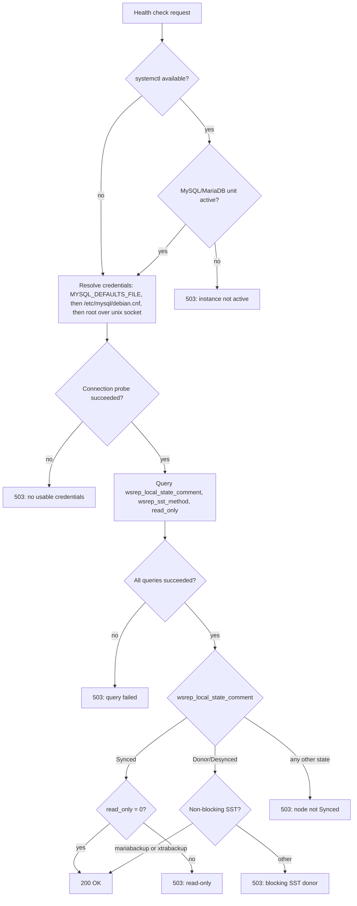

# clusterchk: Galera cluster status check script with HAproxy

This repo contains a shell script which checks the status of a MySQL instance part of a Galera cluster and reports an HTTP message
to HAproxy if the node is in sync with the rest of the cluster or not.

The script implements the following algorithm:

The main idea came from the following article: https://severalnines.com/resources/tutorials/mysql-load-balancing-haproxy-tutorial

## Distributions

The script is distribution agnostic and resolves the credentials to connect to the local
MySQL/MariaDB instance with the following fallback chain:

1. The option file pointed by `MYSQL_DEFAULTS_FILE` (set it in `/etc/clusterchk.conf`, loaded by the SystemD units)
2. `/etc/mysql/debian.cnf`, the Debian/Ubuntu maintenance credentials (*sys-maint* user)
3. *root* over the unix socket, which works passwordless wherever the *unix_socket*
   authentication plugin is in place (Fedora/RHEL MariaDB and recent Debian MariaDB)

Example configuration files are available under the *config* subdirectory. On Fedora-like
distributions no configuration is usually needed thanks to step 3; otherwise create a
dedicated monitoring user and drop an option file like *clusterchk.cnf.example* into
*/etc/clusterchk.cnf*.

## HAproxy

The main point of using HAproxy is to balance TCP connections between application servers and the Galera cluster, not to mention
the possibility of logically separate the database servers from the DMZ network.

(Reference: the MariaDB Galera Cluster load-balancing documentation[^k7p2m], and the original
Codership page describing this HAProxy check-script setup, preserved by the Internet Archive[^z4q8w].)

*HAproxy* is a generic load balancer and proxy server for TCP and HTTP based applications, so it does not concern itself with the
status of the servers on the other side: either they are available or it will select other destinations, based on different routing
policies ( *Round Robin*, *Least Connected*, *Source Tracking*, etc.).

The problem with Galera is that the MySQL server which HAproxy has selected can be up&running but it could be that the internal status
is not *Synced* with the rest of the cluster.

An example on how to configure HAproxy to exploit the HTTP response of the script (`option httpchk` on the check port)
is available under the *docker* subdirectory (`conf/haproxy.cfg`), verified end-to-end by the compose demo; its check
timings are tuned for a quick demonstration, while a production deployment would prefer wider values such as
`inter 12000 rise 3 fall 3`.

## Running clusterchk using SystemD

As a quick test, the script can be executed also directly on the command line but in production the main idea is to use
the *SystemD* units available under the *systemd* subdirectory.

[^k7p2m]: Load Balancing in MariaDB Galera Cluster
<https://mariadb.com/docs/galera-cluster/high-availability/load-balancing/load-balancing-in-mariadb-galera-cluster>

[^z4q8w]: HAProxy, original Galera Cluster documentation (archived)
<https://web.archive.org/web/20190620230223/http://galeracluster.com/documentation-webpages/haproxy.html>
