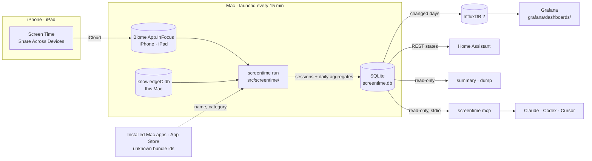

<div align="center">


# Screen Time Exporter

**Apple Screen Time from your iPhone, iPad and Mac — in your own database, Grafana, Home Assistant and AI assistant.**
<br>
One small background agent on your Mac. No cloud service, no account, no ActivityWatch server.

[](https://github.com/nichtlegacy/screentime/actions/workflows/ci.yml)
[](docs/setup.md#requirements)
[](pyproject.toml)
[](grafana/dashboards/screentime.json)
[](docs/home-assistant.md)
[](docs/mcp.md)
[](LICENSE)

[Website](https://screentime.nichtlegacy.com) • [Overview](#overview) • [Features](#features) • [Screenshots](#screenshots) • [Quick start](#quick-start) • [Command line](#command-line) • [AI assistants](#ai-assistants-mcp) • [How it works](#how-it-works) • [Docs](docs/README.md)

<a href="https://screentime.nichtlegacy.com"></a>

</div>

## Overview

Apple shows Screen Time on each device, for a week or two, and nowhere else. You cannot keep it, query it, chart it next to other data or trigger anything from it. Yet every Mac signed in to your Apple Account already receives the app usage of your iPhone and iPad through iCloud.

Screen Time Exporter reads those stores on the Mac — Biome for iPhone and iPad, `knowledgeC.db` for the Mac itself — every 15 minutes. It keeps every session in a local SQLite database, names and categorises the apps, and passes the result on to InfluxDB and Grafana, Home Assistant, the terminal, or an AI assistant over MCP.

The project stays deliberately:

- **local-first** — the database lives on your Mac; nothing is sent anywhere unless you configure a sink.
- **read-only towards Apple** — it only reads Apple's stores (`knowledgeC.db` through a temporary copy) and never writes to them.
- **small** — one Python package, one runtime dependency, one launchd agent.
- **honest about what it knows** — Apple keeps a few weeks of history; anything older only exists if the exporter was running.

> Unofficial hobby project. Not affiliated with Apple — see [Disclaimer](#disclaimer).

## Features

- **Every device on one Mac**: iPhones and iPads via iCloud ([Screen Time → Share Across Devices](docs/setup.md#requirements)), plus the Mac itself, each with its own name.
- **Sessions, not just totals**: every app session with start, duration, app and category, aggregated per day, app, category and hour.
- **Late night and deep night**: use between 00:00–06:00 and 03:00–06:00, plus the night's phone-free window (bedtime and wake-up).
- **Readable app names**: 270+ bundle ids ship with a name and one of 14 categories; unknown ones are named from the installed Mac app or your region's App Store, once, and cached. Your own names go in the config ([docs/apps.md](docs/apps.md)).
- **Grafana dashboard**: provisioned or importable, with device, category and app filters. A Docker Compose file starts InfluxDB and Grafana with everything wired up.
- **Home Assistant sensors**: total, per device, late and deep night per device, week, top app, categories and last sync — v1 entity ids keep working.
- **Terminal reports**: `screentime summary` for a week, day or range, as text, Markdown or JSON; `screentime dump` as CSV or JSON.
- **MCP server**: Claude, Codex, Cursor and other MCP clients answer questions about your screen time from the local database.
- **One-command setup**: `screentime setup` finds devices, tests the connections, writes the config and installs the agent; `screentime doctor` explains what is wrong.

## Screenshots

<table>
  <tr>
    <td width="50%"></td>
    <td width="50%"></td>
  </tr>
  <tr>
    <td align="center"><sub>Apps · top apps, app details and top apps per device</sub></td>
    <td align="center"><sub>Night · late and deep night, bedtime and wake-up</sub></td>
  </tr>
  <tr>
    <td width="50%"></td>
    <td width="50%"></td>
  </tr>
  <tr>
    <td align="center"><sub>Rhythm · typical day and weekday × hour</sub></td>
    <td align="center"><sub><code>screentime summary --week last</code> · real output, demo data</sub></td>
  </tr>
</table>

All screenshots use the synthetic data from [`scripts/demo_data.py`](scripts/demo_data.py).

<details>
<summary><strong>Full dashboard</strong></summary>
<br>

</details>

## Quick start

`uv tool install` plus the setup wizard is the recommended path.

Requirements:

- A Mac signed in to the same Apple Account as your iPhone and iPad, with **Screen Time → Share Across Devices** on for every device.
- [uv](https://docs.astral.sh/uv/) (`curl -LsSf https://astral.sh/uv/install.sh | sh`). It brings its own Python 3.11+.

```bash
uv tool install git+https://github.com/nichtlegacy/screentime
screentime setup             # devices, InfluxDB, Home Assistant, launchd agent
screentime doctor            # every check should say OK
screentime summary --day     # today in the terminal
```

Expected: `screentime setup` lists your iPhone, iPad and Mac, runs a first sync and installs the launchd agent `io.github.nichtlegacy.screentime`, which syncs every 15 minutes.

Apple's stores are protected. Give **Full Disk Access** (*System Settings → Privacy & Security → Full Disk Access*) to your terminal for setup and to the Python interpreter that `screentime setup` prints for the background agent — [why two](docs/setup.md#full-disk-access).

### InfluxDB and Grafana

[`docker/docker-compose.yml`](docker/docker-compose.yml) runs InfluxDB 2.7 and Grafana 12 with the datasource and the dashboard provisioned:

```bash
cp docker/.env.example docker/.env       # set INFLUX_TOKEN and both passwords
docker compose -f docker/docker-compose.yml --env-file docker/.env up -d
```

Grafana listens on port 3000 (`GRAFANA_PORT`), InfluxDB on 8086 (`INFLUX_PORT`). Give `screentime setup` the InfluxDB URL, the token, org `home` and bucket `screentime`. For an existing Grafana, add an InfluxDB datasource with the **Flux** query language and import [`grafana/dashboards/screentime.json`](grafana/dashboards/screentime.json); the dashboard asks for the datasource and bucket.

> The dashboard's "today" and "last 7 days" use the browser's time zone, which should match the exporter's `timezone`.

### Home Assistant

Create a long-lived access token (*Profile → Security*) and give it to `screentime setup` with your Home Assistant URL. The sensors appear after the next sync:

| Sensor | State |
|---|---|
| `sensor.screentime_total` | minutes today, all devices |
| `sensor.screentime_<device>` | minutes today on one device |
| `sensor.screentime_<device>_late_night` / `_deep_night` | minutes today between 00–06 / 03–06 |
| `sensor.screentime_week` | minutes this week, with the daily average |
| `sensor.screentime_top_app`, `_top_apps`, `_by_category` | today's top app, top 10, top category |
| `sensor.screentime_last_sync` | time of the last export |

Attributes, the limits of REST states, example automations and a dashboard card: [docs/home-assistant.md](docs/home-assistant.md).

### Upgrading from v1

v2 replaces the CSV, `.env` and `aw-import-screentime` with one installed tool. The v1 Home Assistant entity ids stay. Steps: [docs/migration.md](docs/migration.md).

## Command line

| Command | What it does |
|---|---|
| `screentime setup` | interactive setup and launchd agent; `--yes` for scripted installs, `--uninstall [--purge]` to remove |
| `screentime run` | sync all sources, then export to the configured sinks (what the agent runs) |
| `screentime sync` / `export [--from DATE]` | only read the sources / only export, optionally re-sending from a date |
| `screentime summary` | report for `--week`, `--day` or `--from`/`--to`, per `--device`, as `text`, `markdown` or `json` |
| `screentime dump` | sessions or `--daily` totals as CSV or JSON |
| `screentime apps unknown` / `apps lookup <id>` | apps that still have a guessed name / look one bundle id up (installed app, then App Store) |
| `screentime remap` | reapply names and categories to all stored sessions |
| `screentime status` | devices, last run and sinks as JSON |
| `screentime doctor [--online]` | check config, Full Disk Access, agent, data freshness and connections |
| `screentime mcp` | MCP server over stdio (`--http` for localhost HTTP) |

Options and the JSON shape: [docs/cli.md](docs/cli.md).

## AI assistants (MCP)

`screentime mcp` is a read-only [Model Context Protocol](https://modelcontextprotocol.io) server over the local database. The MCP SDK is an optional extra:

```bash
uv tool install --force "screentime-exporter[mcp] @ git+https://github.com/nichtlegacy/screentime"
claude mcp add -s user screentime -- screentime mcp      # Claude Code
```

For Claude Desktop, add this to `~/Library/Application Support/Claude/claude_desktop_config.json` (use the path from `which screentime`):

```json
{
  "mcpServers": {
    "screentime": { "command": "/Users/you/.local/bin/screentime", "args": ["mcp"] }
  }
}
```

Codex, Cursor and other clients: [docs/mcp.md](docs/mcp.md).

| Tool | Answers |
|---|---|
| `list_devices` | which devices exist, since when, how much in total |
| `get_summary` | the full report for a period, like `screentime summary --format json` |
| `get_daily_usage` | per-day totals, late and deep night, first and last activity |
| `get_top_apps`, `get_categories` | time per app or category, with share |
| `get_late_night` | use after midnight, the worst night, every night with use |

Try: *"How much screen time did I have last week compared to the week before?"* or *"Was I on my phone after midnight this week?"*

<details>
<summary><strong>Let your AI agent install it</strong></summary>
<br>

A coding agent with terminal access can run the whole setup; you only flip the Full Disk Access switches and enter tokens yourself. The prompt to paste is in [docs/agent-installation.md](docs/agent-installation.md).

</details>

## How it works



- **Sources only read.** `sources/biome.py` parses the SEGB files of the `App.InFocus` stream, `sources/knowledgec.py` reads `/app/usage` from a temporary copy of `knowledgeC.db`. Each keeps its own cursor in SQLite.
- **Sessions are the source of truth.** Sessions are upserted by device, start and bundle id, so overlapping reads are harmless. Touched days are rebuilt into daily, per-app, per-category and hourly aggregates, split at midnight, 03:00 and 06:00.
- **Exports are idempotent.** InfluxDB gets each changed (device, day) deleted and rewritten; Home Assistant gets current-day states. A failed sink never loses data, the next run retries.
- **Names without manual work.** Unknown bundle ids are named from the app installed on the Mac (Spotlight) or, failing that, your region's App Store, once, and cached. A changed `[apps]` section renames stored sessions on the next run.
- **Readers never block the sync.** `summary`, `dump` and the MCP server open the database read-only.

Details: [architecture](docs/architecture.md), [InfluxDB schema](docs/architecture.md#influxdb-schema), [taxonomy](docs/architecture.md#taxonomy).

## Configuration

`screentime setup` writes `~/.config/screentime/config.toml` (mode `0600`). Every key is optional; [`config.example.toml`](config.example.toml) lists them all.

| What | Where | Reference |
|---|---|---|
| Time zone, database path | top level `timezone`, `db_path` | [config.example.toml](config.example.toml) |
| Device names, ignored devices | `[devices]` | [docs/setup.md](docs/setup.md#screentime-setup) |
| App names and categories | `[apps]`, `[lookup]` | [docs/apps.md](docs/apps.md) |
| InfluxDB | `[influx]` or `INFLUX_URL`, `INFLUX_TOKEN`, `INFLUX_ORG`, `INFLUX_BUCKET` | [docs/architecture.md](docs/architecture.md#influxdb-schema) |
| Home Assistant | `[home_assistant]` or `HA_URL`, `HA_TOKEN` | [docs/home-assistant.md](docs/home-assistant.md) |
| Agent label, config path | `SCREENTIME_AGENT_LABEL`, `SCREENTIME_CONFIG` | [docs/setup.md](docs/setup.md#the-launchd-agent) |

Data lives in `~/Library/Application Support/screentime/`, logs in `~/Library/Logs/screentime/`. To remove everything: `screentime setup --uninstall --purge`, then `uv tool uninstall screentime-exporter`.

## Project structure

```text
src/screentime/
├── sources/            # biome.py (iPhone, iPad), knowledgec.py (Mac)
├── _vendor/ccl_segb/   # SEGB reader from ccl-segb, unchanged
├── importer.py         # sessions into SQLite
├── taxonomy.py         # app names: apps.json, your config, installed apps, App Store
├── aggregates.py       # daily, per-app, per-category and night splits
├── influx.py           # InfluxDB export
├── homeassistant.py    # Home Assistant sensors
├── queries.py          # read-only queries for summary, dump and MCP
├── report.py           # summary and dump
├── mcp_server.py       # MCP tools and resource
├── wizard.py           # screentime setup
├── launchd.py          # launchd agent
├── health.py           # screentime doctor
└── data/               # apps.json (names, categories), models.json (device models)
grafana/                # dashboard and provisioning
docker/                 # InfluxDB + Grafana compose file
scripts/                # demo data generator, landing page build
site/                   # landing page, deployed to GitHub Pages
docs/                   # everything beyond this page
```

## Documentation

The landing page is [screentime.nichtlegacy.com](https://screentime.nichtlegacy.com). Everything beyond this page is in [docs/](docs/README.md): [setup](docs/setup.md), [migration from v1](docs/migration.md), [command line](docs/cli.md), [app names](docs/apps.md), [Home Assistant](docs/home-assistant.md), [MCP](docs/mcp.md), [agent installation](docs/agent-installation.md), [architecture](docs/architecture.md). Release notes: [CHANGELOG.md](CHANGELOG.md).

## Privacy

Everything stays on your Mac unless you configure a sink. Unknown apps are first looked for on the Mac itself; only bundle ids it cannot name go to Apple's public iTunes Lookup API, together with the storefront country. Turn that off with `[lookup] enabled = false`. The MCP server reads the local database; what your assistant sends to its model is up to the assistant. Tests and screenshots use synthetic data only.

## Known limitations

- **macOS only.** iPhone and iPad data reaches the exporter only through a Mac with Screen Time sharing on; there is no iOS app. Tested on macOS 27 on Apple silicon.
- **Apple keeps only a few weeks.** The first sync reads what is still there (Biome holds about four weeks); history before that is gone.
- **The agent needs Local Network access** for an InfluxDB or Home Assistant on your LAN (macOS 15+). Allow it when macOS asks; otherwise exports fail with `No route to host` ([details](docs/setup.md#local-network)).
- **Full Disk Access is tied to the Python path.** After uv upgrades Python, the background agent needs the grant again; `screentime doctor` tells you the new path.
- **Home Assistant REST states** have no `unique_id` and vanish on restart until the next sync, at most 15 minutes later ([workaround](docs/home-assistant.md#limitations-of-rest-states)).
- **iPhone and iPad apps outside the App Store** (TestFlight, your own builds) and Mac apps that are no longer installed keep a name guessed from the bundle id until you name them in `[apps]`.
- **Not on PyPI yet.** Install from GitHub with uv, pipx or pip; every dependency comes from PyPI.

## Contributing

Issues and pull requests are welcome, especially app names for [`apps.json`](src/screentime/data/apps.json). Checks and guidelines: [CONTRIBUTING.md](CONTRIBUTING.md).

## Credits

- **[cclgroupltd/ccl-segb](https://github.com/cclgroupltd/ccl-segb)** — reads Apple's SEGB files; vendored unchanged under MIT ([notice](THIRD_PARTY_NOTICES.md)).
- **[ActivityWatch/aw-import-screentime](https://github.com/ActivityWatch/aw-import-screentime)** — v1 read iPhone data through it, and it showed where that data lives.
- **[Boaz Sobrado's post](https://boazsobrado.com/blog/2026/02/03/how-i-built-a-personal-screen-time-tracker-for-mac-and-iphone-using-claude/)** on a personal Screen Time tracker — the idea for v1.

## License

[MIT](LICENSE).

## Disclaimer

**Screen Time Exporter is an unofficial, independent hobby project.** It is not affiliated with, endorsed by, sponsored by, or connected to Apple Inc. in any way.

"Apple", "Screen Time", "iPhone", "iPad", "Mac", "macOS" and "iCloud" are trademarks of Apple Inc., used here only to describe the data the project reads. It reads files that macOS keeps on your own Mac; it does not use private APIs over the network.
