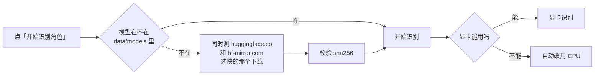

# Emaki 絵巻

给习惯存很多图在自己手机电脑准备的群友准备的，一个在自己电脑上跑的插画整理工具。把存了几万张的二次元图文件夹丢进来，它会认出每张图画的是哪个角色、属于哪部作品，然后按角色 / 作品帮你归好类。漫画、截图、照片、表情包会自动分出去，重复的图也能找出来。

图片不会上传，识别模型在本机跑。

> **English**: Emaki is a local-first anime illustration organizer for Windows. It recognizes characters with a local tagging model (PixAI / WD14, GPU via DirectML), groups your images by character and series, separates comics, screenshots and photos, and finds duplicate or visually similar images. Nothing is uploaded. The UI is in Chinese; a portable build is available on the [Releases](https://github.com/nickname21kmr/emaki/releases/latest) page.


| | |
| --- | --- |
|  首页，导入进度和统计 |  单个角色 |
|  按作品看 |  一部作品下的全部角色 |
|  图库 |  没认出来的图，按数字键归类 |
|  本子、画集按页读 |  识别设置 |

<sub>以上是一个 8.4 万张图的真实图库。想先看看界面、又不想导入自己的图，可以用 `npm run dev:mock` 打开演示数据。</sub>

## 能做什么

- **认角色、归作品**：本机模型识别，能认 8,300 多个角色，鸣潮、绝区零这些新游戏也认得。拿不准的放进「未识别」并给出建议，按数字键就能归类。原创图可以单独归到「原创」。
- **中文名、日文名都能搜**：搜「未花」「ミカ」「mika」都能找到同一个角色；搜作品名会带出这部作品下所有角色的图。
- **认画师**（默认关）：在「设置 → 识别」里打开「识别画师」，识别时会顺便认出画师，已经识别过的图在后台补。只认得 Danbooru 上图多的画师。认出来的在合集页的「画师」里，点进去就是这位画师的图。认错了在看图器右边改，改过的图之后识别不会再动。同一个人的旧名、社团名会自动合到一起，合错了可以拆开，没合上的可以手动合并。
- **自己组筛选**：图库的「画面」里可以拿识别标签自己组一个，标签分三组：必含（每个都要有）、任一（有一个就行）、不含（一个都不能有）。比如必含「白发」、任一「丝袜」「连裤袜」、不含「漫画」。
- **分类和查重**：漫画、截图、照片、表情包自动分出去，不混在插画里。完全相同和画面相似的图都能找出来，一组里留一张，其余移到回收站。
- **本子、画集按页读**：按文件夹自动成册。文件夹名带「Vol.03」「第3卷」的会认成同一套的第几卷，按卷号排。
- **漫画直接导入**：加文件夹时选「漫画 · 跳过识别」，里面每个子文件夹算一本，不跑识别，省下很多时间。已经加过的图库文件夹里，也可以只把某个子文件夹设成漫画。
- **看图**：鼠标移到看图器底边会出现一排缩略图，点一张直接跳过去。
- **按角色分文件夹**：角色页右上角「⋯ → 移动到文件夹…」，或者多选后点「移动」，把图移到图库里的某个文件夹（默认新建一个以角色命名的）。识别和整理结果都保留，可以撤销。
- **改错了能撤销**：归类、排除、移动这些操作都能撤销，Ctrl+Z 也行。
- **不怕移动硬盘**：图放在移动硬盘上，拔掉或者扫描中途断开，整理结果都不会丢，插回来就恢复。
- **文件夹可以随时调整**：比如已经加了 `D:/图片/收藏`，又加 `D:/图片`，会问你要不要合并成一个，原来的整理都保留。
- **联网可选**：同步 Danbooru 能拿到更全的作品和别名。会自动用 Clash、v2rayN 的系统代理；连不上时会说清楚原因，设置里也能「检测网络」。

## 电脑要求

| | 要求 | 说明 |
| --- | --- | --- |
| 系统 | Windows 10 / 11 | 目前只在 Windows 11 上测过 |
| Node.js | 22 或更新，推荐 24 | |
| 显卡 | 推荐有独立显卡 | 实测 RTX 3070 Laptop（8 GB 显存）：默认模型约 **0.5 秒一张**，1 万张大约 1.5 小时。N 卡、A 卡、Intel 显卡都走 DirectML，不用装 CUDA。DirectML 用不了时会自动改用 WebGPU（慢一倍多），再不行才用 CPU，能跑但很慢，大约十几秒一张 |
| 硬盘 | 模型约 2.2 GB，另加缩略图和数据库 | 参考：8.4 万张图的缩略图 4.4 GB、数据库 240 MB。都放在项目目录的 `data/` 里，建议装在非系统盘 |

识别一次跑完之后就不用再跑了，之后新加进来的图只识别新的。图多的话建议晚上挂着跑，设置里可以打开「运行时防止电脑休眠」。

## 安装

### 免安装版（推荐，不用装任何东西）

1. 到 [Releases](https://github.com/nickname21kmr/emaki/releases/latest) 下载 `Emaki-x.x.x-win-x64.zip`（约 100 MB）。
2. 解压到一个空间够的盘，比如 `D:\Emaki`。建议不要放在 C 盘，缩略图和模型会占好几 GB。
3. 双击里面的 **「启动 Emaki.cmd」**，浏览器会自动打开。第一次打开会让你选图片文件夹。

压缩包里自带了 Node.js 和所有依赖，不用自己装。用的时候那个黑色窗口要一直开着，关掉它 Emaki 就退出了。

升级：下载新版解压到新文件夹，把旧版里的 `data` 文件夹整个复制过去。

### 从源码运行（开发者）

需要 Node.js 22 或更新的版本。

```bash
git clone https://github.com/nickname21kmr/emaki.git
cd emaki
npm install
npm run dev
```

然后浏览器打开 <http://localhost:5173>。也可以双击 `start.bat`，它会装依赖、构建前端，然后打开 <http://127.0.0.1:5174>。

想像桌面程序那样用：双击「创建桌面快捷方式.cmd」，桌面上会多一个「Emaki 絵巻」图标。从它打开是一个单独的窗口（没有地址栏），关掉窗口就退出。需要装有 Edge 或 Chrome。

国内 `npm install` 慢的话，先运行 `npm config set registry https://registry.npmmirror.com`。

从装 Node.js 开始的详细步骤（带截图）见 [docs/DEPLOY.md](docs/DEPLOY.md)。

## 识别模型

不用手动装，第一次点「开始识别角色」时会自动下载。流程是这样的：



默认会下两个模型：

| 模型 | 大小 | 用在哪 |
| --- | --- | --- |
| PixAI Tagger v1.0 fp16 | 0.98 GB | 默认。能认 8,300 多个角色，数据到 2026 年 5 月，鸣潮、绝区零、星铁 3.x 这些新角色都认得 |
| WD EVA02-Large v3 | 1.26 GB | 2024 年 3 月以前的旧图用它，对老图更稳 |

「旧图」按文件的修改时间算，早于 2024 年 3 月的算旧图。

这套组合是默认的，一般不用动。想换的话在「设置 → 识别」里：

- **识别模型**：换主模型。除了上面两个，还有几个更小更快的 WD 模型，认得的角色少一些（2,751 个，数据到 2024 年 2 月）。没有能用的显卡、只能 CPU 跑的话，推荐 WD SwinV2 v3。
- **旧图用 WD EVA02 识别**：关掉后所有图都用主模型。
- **WD 没认出的旧图，用主模型再认一遍**：默认关。打开后，WD 认不出的老图会再交给 PixAI 试一次，能多认出一些，但要多花时间。

改乱了点「恢复默认方案」就回到上面的组合。换了模型再运行识别时，之前没认出角色的图会用新模型重新认，已经认出的不动。

**下载不动怎么办**

- Clash、v2rayN 这类软件开着「系统代理」时，Emaki 会自动用它，不用设置。
- 没开系统代理、也没开 TUN 的话，在项目目录新建 `.env`，写一行 `EMAKI_HTTP_PROXY=http://127.0.0.1:7890`（端口换成你自己的），重启。
- 只想走国内镜像：`.env` 里写 `HF_ENDPOINT=https://hf-mirror.com`。
- 也可以自己下载好放进去：把文件放到 `data/models/<仓库名>/`，仓库名里的 `/` 换成 `__`。比如 `A1yCE/pixai-tagger-v1.0-onnx-fp16` 就放到 `data/models/A1yCE__pixai-tagger-v1.0-onnx-fp16/`。放好后会先校验，文件不对会重新下载。

**同步 Danbooru 失败**

国内直连 Danbooru 一般连不上，代理的设置和上面一样。不确定是哪里的问题，可以到「设置 → Danbooru」点「检测网络」：它会分别连 Danbooru、Hugging Face 和国内镜像，告诉你是哪一段不通、有没有用上代理。连不上时会先用本地词库整理，不影响识别。

**笔记本识别时用的是核显、独显闲着**

有核显 + 独显的笔记本，Windows 可能把 Emaki 分到核显上，识别会慢很多（任务管理器里能看到核显占满、独显几乎不动）。

用 Emaki 文件夹里 `tools` 目录下的 **「显卡诊断和修复.cmd」**：双击后它会列出每个程序正在用哪块显卡，确认后把 Emaki 设成用高性能显卡（和 Windows 设置 → 系统 → 屏幕 → 显示卡 里手动改是同一个开关）。改完关掉 Emaki 的黑色窗口，重新启动就生效。想改回去就双击「恢复显卡设置.cmd」。

下载的是 0.1.0 免安装版、里面没有 `tools` 的话，到 [Releases](https://github.com/nickname21kmr/emaki/releases/tag/v0.1.0) 下载 `Emaki-gpu-fix.zip`，解压到 Emaki 文件夹里（解压后是 `Emaki\tools\...`）再双击。

**认不出来的图**

太新、太冷门的角色，还有原创角色，模型认不出来。这些图会进「未识别」，你可以手动归到某个角色，或者新建一个「自建角色」。模型拿不准的图也会放进「未识别」，旁边会给出建议，按数字键就能采纳。

## 数据放在哪

| 内容 | 位置 |
| --- | --- |
| 数据库（你做的所有整理） | `data/emaki.sqlite` |
| 缩略图 | `data/thumbs/` |
| 模型 | `data/models/` |
| 你的图片 | 原来在哪还在哪。只有你自己点「移动到文件夹」时才会移动 |

`data/` 不会被提交到 Git。备份的话复制 `data/emaki.sqlite` 就行，缩略图和模型都能重新生成、重新下载。想换位置可以在 `.env` 里改 `EMAKI_DATA_DIR`，其他配置见 [.env.example](.env.example)。

## 个人喜好分析

仓库里带了一个给 [Claude Code](https://claude.com/claude-code) 用的技能（`.claude/skills/taste-profile/`）。在仓库目录里打开 Claude Code，说「分析我的收图喜好」，它会读你的图库，生成一份报告：喜欢的发色、角色性格、镜头、口味怎么变，以及和 Danbooru 同时期、中文圈画师、同几部作品比起来多了什么少了什么。

- 报告和中间文件都在 `data/profile/`，只在本机打开，不会上传，也不会被提交。
- 要和 Danbooru 对照的话会下载约 400 MB 的样本图来打标签，用完就删。
- 尺度、部位这类私密的部分默认不算，要明确说了才加。

做法和每一步的命令见 [SKILL.md](.claude/skills/taste-profile/SKILL.md)。

## 更新

免安装版：见上面「升级」。源码版：

```bash
git pull
npm install
npm run dev
```

数据库结构变了会自动升级，升级前会在 `data/` 里留一份备份。

## 开发

```bash
npm run dev:mock    # 用演示数据跑，不碰真实数据
npm run typecheck
npm test
node scripts/pack-portable.mjs   # 打免安装版 zip（只能在 Windows x64 上打）
```

前端是 React + Vite + Tailwind，后端是 Node.js + Fastify + SQLite，识别用 onnxruntime-node。架构和各页面的设计说明在 [docs/ARCHITECTURE.md](docs/ARCHITECTURE.md) 和 [docs/FRONTEND.md](docs/FRONTEND.md)，开发任务清单在 [docs/TASKS.md](docs/TASKS.md)。
