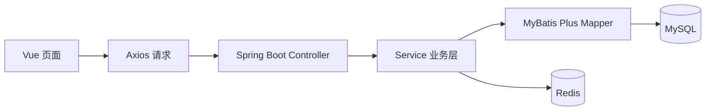

# 超市管理系统 · 前后端代码展示

基于 **Spring Boot + Vue 2** 的商场管理项目，覆盖商品、库存、会员、销售、人员和权限管理。

公开版包含前后端主要源码、接口映射、配置模板和 17 张表的数据库结构。完整资料保存在私有仓库中；公开版不含员工、会员、交易记录、真实账号密码和上传图片。

## 功能与代码入口

| 业务模块 | 代码入口 |
| --- | --- |
| 登录与菜单权限 | [LoginEmpController](backend/src/main/java/com/shanzhu/market/controller/LoginEmpController.java)、[前端路由](frontend/src/router/) |
| 商品与分类管理 | [GoodsController](backend/src/main/java/com/shanzhu/market/controller/GoodsController.java)、[商品页面](frontend/src/views/goods_management/) |
| 仓库、供应商与库存 | [库存页面](frontend/src/views/inventory_management/) |
| 会员与积分 | [会员页面](frontend/src/views/member_management/) |
| 销售与积分兑换记录 | [销售页面](frontend/src/views/sale_management/) |
| 员工与部门 | [EmployeeController](backend/src/main/java/com/shanzhu/market/controller/EmployeeController.java)、[人员页面](frontend/src/views/personnel_management/) |
| 系统管理 | [系统页面](frontend/src/views/system/) |

## 技术栈

| 层次 | 技术 |
| --- | --- |
| 前端 | Vue 2、Vue Router、Vuex、Element UI、Axios、Vue CLI 5 |
| 后端 | Spring Boot 2.3.2、MyBatis Plus、Druid、BCrypt |
| 数据与缓存 | MySQL、Redis |
| 构建 | npm、Maven |

## 阅读顺序

1. 从 `frontend/src/views/` 查看业务页面和交互。
2. 从 `backend/src/main/java/com/shanzhu/market/controller/` 查看接口。
3. 对照 `service/`、`mapper/` 和 [database/schema.sql](database/schema.sql) 阅读业务与数据模型。

## 本地配置参考

- 数据库结构位于 `database/schema.sql`，只包含建表语句，不含初始账号和业务数据。
- 后端模板为 `backend/src/main/resources/application.example.yaml`。复制为 `application.yaml` 后，通过 `DB_URL`、`DB_USERNAME`、`DB_PASSWORD`、`REDIS_HOST`、`REDIS_PORT`、`REDIS_PASSWORD` 配置连接。
- 后端默认端口 `9291`；前端配置记录的开发端口 `9292`。
- 前端依赖可通过 `npm ci` 安装；后端使用 Maven。

本仓库用于代码展示，尚未验证独立部署。运行还需要准备测试账号、业务数据和页面引用的资源。旧的云存储配置已改为从环境变量读取，示例邮箱使用 `demo@example.com`。

演示视频、原始数据库导出和原始设计报告不在公开展示版中。

[返回 GitHub 项目主页](https://github.com/nocTia-O9)
