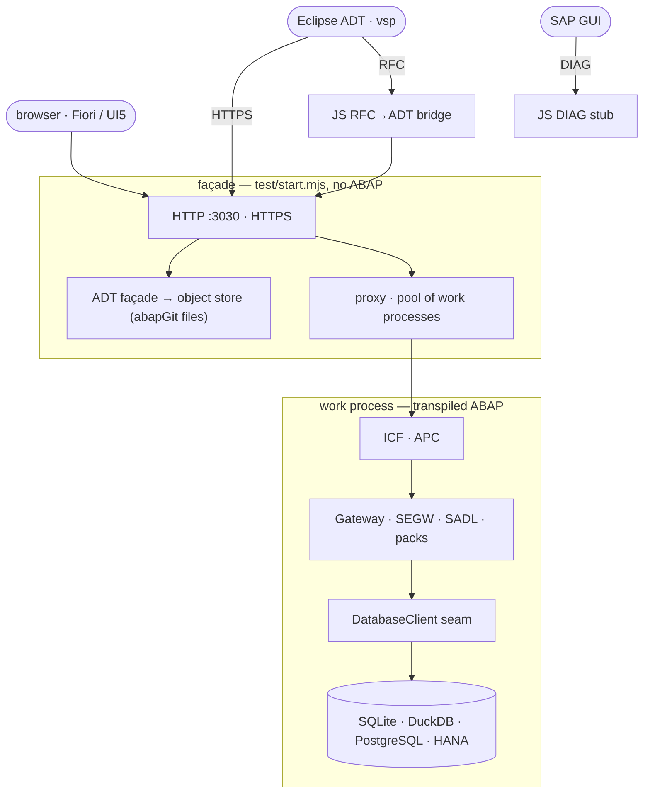

# open-steamgate

**An ABAP application server you can clone.**

## TL;DR — run it

| way | do this | then open |
| --- | --- | --- |
| **Browser, now** | nothing to install | **[oisee.github.io/open-steamgate/main/app/flp.html](https://oisee.github.io/open-steamgate/main/app/flp.html)** |
| **Docker** | `git clone https://github.com/oisee/open-steamgate && cd open-steamgate && docker compose -p osd11 -f docker/compose.sqlite.yml up -d` | `http://localhost:8011/app/flp.html` |
| **Portainer** | Stacks → Add stack → Web editor, paste one YAML block from [`docs/spin.md`](docs/spin.md) (SQLite, DuckDB, PostgreSQL or HANA Express) | `http://<host>:8011/app/flp.html` |
| **One binary (Bun)** | download `osd-linux-x64` / `osd-linux-arm64` / `osd-darwin-arm64` / `osd-darwin-x64` / `osd-windows-x64.exe` / `osd-windows-arm64.exe` from [Releases](https://github.com/oisee/open-steamgate/releases), then `mv osd-linux-x64 osd && chmod +x osd && ./osd up` | `http://localhost:3030/` |
| **VS Code** | install [open-steamgate: local ABAP server](https://marketplace.visualstudio.com/items?itemName=oisee.open-steamgate), or the `.vsix` from [Releases](https://github.com/oisee/open-steamgate/releases) via *Extensions: Install from VSIX…*; then run **osd: Start** | the OSD tree in VS Code |
| **Node, from source** | `npm ci && npm run bootstrap && npm start` (Node 22.14+ or 24) | `http://localhost:3030/` |
| **Your report as a CLI tool** | `node tools/gogen/osabap.mjs zmy_report.prog.abap`, then `tools/gogen/.out/osabap` (needs Go 1.26) | a native binary, no server ([below](#abap-as-a-language-for-command-line-tools)) |

Each release also carries `sqlite.yml`, `duckdb.yml` and `postgres.yml`; start one with `docker compose -f sqlite.yml up -d`. `./osd doctor` checks a downloaded binary.

## What it is

open-steamgate (OSD) cross-compiles real ABAP — `_MPC_EXT` / `_DPC_EXT`
Gateway classes, CDS views, AMDP methods, reports — and runs it against a local
database. It serves OData to Fiori Elements, lets Eclipse edit it over ADT, and
answers SAP GUI on the DIAG port. No SAP system is attached.

It is the layer under an ERP, not an ERP. The language runtime, the
dictionary, Open SQL, the ICF service tree, the OData gateway, CDS, AMDP, LUW,
screens, jobs and daemons are all here. There is no business application: no
finance, no logistics. Everything runs as a subset: of the language, of the
dictionary, and of Gateway (classic code-based SEGW).

Everything is a file. The ABAP is a repository, the tables are abapGit TABU
JSON, a build is an immutable generation addressed by the hash of its inputs,
and the database sits behind an eleven-method seam: sql.js, SQLite, DuckDB,
PostgreSQL or HANA. So a whole system can be copied, branched, compared and
thrown away.

The name: `vsp` (vibing-steampunk) → `steamgate`. **Gate** is the SAP Gateway,
the `/IWBEP/` framework whose runtime this project reimplements.

## The ways to run it, in a sentence each

- **Browser.** The transpiled ABAP, the OData runtime and SQLite run in a
  service worker on your machine; no server answers anything.
- **Docker.** `ghcr.io/oisee/open-steamgate`, tags `showcase-draft` (with the
  demo packs) and `draft` (core), multi-arch amd64 and arm64. The arm64 image
  also runs on a Raspberry Pi 4 ([`docs/spin.md`](docs/spin.md)).
- **Binary.** One self-contained Bun executable per platform. It copies its
  system into your user data directory on first start and layers your own
  folders over it with `osd up --layer <folder>`.
- **VS Code.** The OSD tree, F8 data preview, ABAP Unit in the Test Explorer,
  debugging, and a `.http` CodeLens that finds the DPC method behind a request.

For warm local development (`OSD_WARM=1 STG_DEV=1 npm start`), run
`npm run transpiler:pin` after `npm ci`. It builds the `libs.lock.json` pin in
`$HOME/.cache/osd/transpiler-<ref>` and links transpiler, CLI, runtime and core;
a verified build is reused. Override the persistent location with `TRANSPILER`;
temporary directories and session scratchpads are refused. Startup and
`osd doctor` print a prominent install hint if warm capabilities are missing.
See [warm setup](docs/warm-compile.md#running-it).

The launchpad in the browser build:

| tile | what it is |
| --- | --- |
| Travels, Bookings | Fiori Elements V2 list report and object page over a SEGW-shaped `_MPC_EXT` / `_DPC_EXT` pair |
| Flight analytics | an analytical list page over a CDS cube (`$select` → `GROUP BY`) |
| SEGW | the Service Builder as an app, editing the project tree |
| Vivid Vibes · Zork · SAP LSD | pages an ABAP class writes: WebGL and audio over APC, a Z-machine in ABAP, a light-show replayed as SAP GUI screens |

The first visit installs the worker; after that the app works offline. Private
windows usually refuse service workers.


## What it looks like

Every pixel below is served by transpiled ABAP over SQLite. SAPUI5 1.120 is
loaded from SAP's CDN, unchanged.


`node scripts/capture-docs-shots.mjs` takes these pictures while `npm start` is running.

## Where it stands, 2026-09-30

0.3 beta was released on 2026-09-29 (`vscode-v0.2.1307`); 0.4 is in progress.
[`AGENDA.md`](AGENDA.md) records every decision, [`docs/backlog/`](docs/backlog/README.md)
is the open list, and [`ANORMALIES.md`](ANORMALIES.md) records every place the
runtime differs from SAP, written down before any workaround.

| area | what works | docs |
| --- | --- | --- |
| **Gateway, OData v2** | URL parser, `$filter` → SELECT-OPTIONS with every `io_tech_request_context` facet, `$batch` with changesets, navigation, `$expand`, deep insert, function imports, value helps, MERGE, create below a parent, media entities (`$value`), service-to-service calls. All of it is ABAP behind one `if_http_extension` | [`docs/prior-art.md`](docs/prior-art.md) |
| **SEGW** | IWPR ↔ `_MPC`/`_DPC` generation with RFC/BOR and search-help mappings; one YAML → a whole project (`stg-compile`); the project tree in 53 SEGW-shaped tables with byte-identical export; the generator ported to ABAP; the Service Builder as a Fiori app | [`docs/stg-compile.md`](docs/stg-compile.md), [`docs/segw-editor.md`](docs/segw-editor.md) |
| **SADL and CDS** | CDS projections, `@OData.publish`, writable projections (including through a chain of views), analytical cubes, virtual elements | [`docs/cds-publish.md`](docs/cds-publish.md), [`docs/cds-writes.md`](docs/cds-writes.md) |
| **AMDP and SQLScript** | An AMDP body runs where it belongs, on HANA, or portably on DuckDB. The SQLScript front end lowers to three dialects and refuses a silently wrong translation | [`docs/amdp-in-hana.md`](docs/amdp-in-hana.md), [`docs/portable-amdp-report.html`](docs/portable-amdp-report.html) |
| **ADT façade** | Eclipse ADT and vsp treat OSD as a system: package tree, edit, save, activate, ABAP Unit, F8 preview, create/delete. Every change lands on the git tree as abapGit files. It works over HTTPS (Cloud Project) and over **RFC** (Custom Application Server) through the built-in JavaScript bridge | [`docs/adt-facade.md`](docs/adt-facade.md), [`docs/adt-over-rfc.md`](docs/adt-over-rfc.md) |
| **Classic screens** | SAP Easy Access, SE16, ST05 and an editor, served by ABAP on the paths the originals use | [`docs/webgui.md`](docs/webgui.md) |
| **Jobs and daemons** | `JOB_OPEN`/`SUBMIT`/`CLOSE` with standard signatures, `SUBMIT … VIA JOB … WITH … IN`, multi-step jobs, durable keys, tail events, a doctor. ABAP daemons: dialog-step queue, PCP, timers, AMC | [`docs/abap-daemons.md`](docs/abap-daemons.md) |
| **Files** | `OPEN / READ / TRANSFER / DELETE DATASET` behind a sandbox: deny by default, allowed roots, no escape through `..`, symlinks or a swapped directory. A streaming **zip reader in ABAP** (own inflate, bounded memory, CRC-checked) runs the same on a system | [`docs/dataset.md`](docs/dataset.md), [`docs/zip-stream.md`](docs/zip-stream.md) |
| **OSGo: ABAP → Go** | `gogen` compiles the system to Go: the whole OSD as one Go binary (841 classes at #251, the demo answers), a report as a native command-line tool with its selection screen (`osabap`), ABAP Unit on Go compared method by method with Node, and sXML about 27× faster than on Node on a 10 MiB benchmark (#275) | [`tools/gogen/README.md`](tools/gogen/README.md) |
| **Databases** | sql.js, SQLite file (WAL), DuckDB, PostgreSQL and HANA behind one seam; FOR ALL ENTRIES sent in blocks, similar to the kernel | [`docs/db-backends.md`](docs/db-backends.md) |
| **Instruments** | Comparing two systems (responses, SQL at the seam, a branch of a whole system), `.http` regression cases with a frozen clock, and a frame-by-frame oracle against a real system | [`docs/regression-http-cases.md`](docs/regression-http-cases.md), [`docs/frame-comparison.md`](docs/frame-comparison.md) |
| **Packs and delivery** | A pack is a directory (`osd-pack.json`: ABAP, tables, rows, pages, tiles) layered over the tree. There is one Bun binary (`build/osd`), a relocatable release directory, Docker for amd64 and arm64, the browser preview on GitHub Pages, and a CI that gates every publication on the tag's tests | [`docs/using-osd.md`](docs/using-osd.md), [`docs/preview-deployments.md`](docs/preview-deployments.md) |
| **Tests** | `npm test` = transpile + abaplint + ABAP Unit + mocha over the wire, plus Playwright for the apps. A unit run fails when a test class in the tree did not run | |

## ABAP as a language for command-line tools

`gogen` compiles ABAP to Go (**OSGo**; building needs Go 1.26). Two hosts come out of it.

**A report becomes a native command.** `osabap` takes a classic executable
report and builds one self-contained binary with no server, no database and no
SAP system (`npm run osgb -- <report>` is the same command: osabap is the
compiler, OSGB the binary it makes). The compiler itself runs on Node; the
binary does not. The selection screen is the command-line contract:

```sh
node tools/gogen/osabap.mjs tools/gogen/apps/hello/zhello.prog.abap   # -> tools/gogen/.out/osabap
tools/gogen/.out/osabap Alice                        # parameters in declaration order
tools/gogen/.out/osabap --name Alice --loud --s-tag one --s-tag two  # a repeated select-option = I/EQ rows
tools/gogen/.out/osabap -params @arguments.json     # or all of it as JSON
tools/gogen/.out/osabap                              # no arguments, a terminal: the selection screen as a TUI
tools/gogen/.out/osabap -sapgui                     # the same screen to a real SAP GUI over DIAG, on 127.0.0.1
GOOS=windows GOARCH=arm64 node tools/gogen/osabap.mjs report.prog.abap   # cross-compiles
```

The usual lifecycle runs: `INITIALIZATION`, the selection-screen events,
`START-OF-SELECTION`, `WRITE` to stdout. `CL_GUI_FRONTEND_SERVICES` maps to the
local file system. `OPEN DATASET` works inside the roots you allow
(`-allow-read ./in -allow-write ./out`). Build with `--read-params P_FILE,P_CONFIG`
to grant reads to the files or directories the user supplies, or `--read-lists P_DEPS`
to also grant the paths listed in that file (relative to its directory).
Supplying a list means the user vouches for every path in it, including absolute
and `../` entries; a list the report wrote earlier is still the user's choice to pass.
The host grants these reads before ABAP runs; `-no-default-reads` disables them,
and writes still require explicit permission. A report with tables of its own
(their `.tabl.xml` beside the report) keeps its rows in the SQLite file
`-db notes.db` names, created with those tables when missing; 12 of the 18
Open SQL forms of `tools/gogen/apps/sql-corpus` compile so far. The samples are in
[`tools/gogen/apps/`](tools/gogen/apps), and the details are in
[`docs/osabap-native.md`](docs/osabap-native.md).

**The whole system in Go.** `node tools/gogen/osgo.mjs` builds `tools/gogen/.out/osgo`, the
complete OSD (ICF, Gateway, the apps, SQLite) as one Go binary. The same ABAP
Unit tests run on Node and on Go and are compared method by method; closing
the gap is the work before 0.4.

**Generated classes in CI.** The same folder of `*.clas.abap` and
`*.clas.testclasses.abap` can run on either runtime:

```sh
npm run osgo:unit -- ./generated --json --class ZCL_EXAMPLE
npm run osgjs:unit -- ./generated --json --class ZCL_EXAMPLE
```

Both commands read the immediate directory, stage missing class metadata in a
temporary folder, preserve existing `.clas.xml`, reject source lines longer than
255 characters with `file:line`, and report overrides on stderr and in JSON.
`--class` accepts multiple owner names; omit it to run all owners in the folder.
They work from any cwd when invoked by the checkout's absolute script path.
JSON contains `rows` (`class`, `testclass`, `method`, `status`, `message`),
`totals` (`success`, `failure`, `not_compiled`, `error`, `tests`) and `overrides`.
Exit codes are 0 for at least one test and all SUCCESS, 1 for assertion FAILURE,
2 for NOT_COMPILED/ERROR/SKIPPED, and 3 when there are no tests.

The JS command requires installed Node dependencies and synced libraries. It
copies the configured checkout layers into a disposable checkout, excluding all
content packs (including `OSD_PACKS`), runs the generators and transpiles
the **whole tree** (roughly 20 seconds for transpilation), then runs ABAP Unit
only for the selected owners, including class and instance lifecycle hooks.
This command still builds the whole tree; the local warm path can use the
pinned transpiler's `only` option.
For large generated folders, use Node with a larger heap and a private SQLite
file instead of in-memory sql.js:

```sh
NODE_OPTIONS=--max-old-space-size=12288 npm run osgjs:unit -- ./generated --db file --json
```

`--db sqlite` (the default) uses sql.js; `--db file` creates its database in the
invocation's staging directory and removes it on completion. Inherited
`STG_DB_PATH` cannot select another database. `NODE_OPTIONS` reaches the scanner,
transpiler, generators and Unit child; choose a heap limit that fits the host.
ABAPiti's public [osd-up.sh](https://github.com/oisee/abapiti/blob/8cdf57212c23772baf6293cb3d8784181521c8e4/.github/ci/osd-up.sh)
runs the pinned JS binary with a private
`STG_DB_PATH`, and [osd-m1.sh](https://github.com/oisee/abapiti/blob/8cdf57212c23772baf6293cb3d8784181521c8e4/.github/ci/osd-m1.sh)
deploys generated classes through ADT. Its workflow
uses the binary, not a Node heap flag; this checkout runner mirrors that file
isolation and documents the extra heap needed to build a large folder at once.
The recorded measurements use Node v26.9.0, the checkout's existing local
runtime/transpiler 2.13.93 build and its resolved core 2.120.59.
Each invocation owns its output and database; parallel runs leave the input
folder, `output/` and `build/live` untouched. The Go command additionally accepts
`--jobs N` (default 4) and needs Go 1.26.

[The generated support page](docs/osg-support.md) inventories statements, built-ins,
elementary declarations and conversions, joins per-class results for both runtimes,
and lists kernel compatibility warnings. It is evidence from a corpus, not a specification.
Regenerate from a read-only ABAPiti checkout with the commands below; flatten the
split fixtures as the ABAPiti CI does, and repeat the two runtime commands for
any extra `qjs`, `mono` and `int8` folders under `.local/abapiti`. Retain JSON from partial runs so passing and failing classes keep their results.
Declare full-folder runs using `--runs <manifest.json>`; each array entry has
`folder` (input basename), `runtime` (`osgo` or `osgjs`) and `file` (relative to
that manifest), or `reason` for a crash without class results. Full-folder runs
covering every test owner with all rows SUCCESS credit helper classes as
exercised by their tests; partial
runs with failures leave helpers not measured; missing test owners leave helpers
and omitted owners not measured. Harness crashes, OOM and setup failures before
any class are not measured with a reason; fails applies only to test results.
Manifest entries may include `wallSeconds` and `peakRssKiB` (GNU time maximum
resident set size across the command and its children, including the build).
Both runners snapshot `provenance` into their JSON: backend, heap override,
installed runtime/transpiler and database versions, Node, and Go for osgo.
A manifest's `provenance` can preserve those settings for a crash without JSON
or an older run; it takes precedence over the result's snapshot. Missing metadata
is printed as "not recorded". Regeneration reads the snapshots, so changes to
installed tools or `NODE_OPTIONS` cannot rewrite historical provenance.
The file backend uses `node:sqlite`, not better-sqlite; its SQLite version comes
from the installed Node binary. Harness rows carry `source: "harness"`; assertion
messages never determine provenance.
Plain `--osgo`/`--osgjs` files give per-class
evidence only, which is safe for runs restricted with `--class`.

Editors can import `kernelWarnings` and `KERNEL_FORMS` from
`tools/osd-kernel-compat.mjs`, then call `kernelWarnings([{file, source}])` on
unsaved buffers. Each finding includes file, line, form, message and
`supportAnchor`, a stable link into this page; `KERNEL_FORMS` lists the fixed
anchors and titles. Show findings as Error diagnostics by default while allowing
the code to run. `osg.kernelStrict: "refuse"` opts into refusal, matching the
unit runners' `--kernel-strict` mode.

```sh
mkdir -p .local/support-work/go-cache .local/support-work/go-tmp .local/support-work/go-path
export GOPATH="$PWD/.local/support-work/go-path" GOMODCACHE="$PWD/.local/support-work/go-mod"
export GOTOOLCHAIN=go1.26.0 GOFLAGS=-buildvcs=false
export GOCACHE="$PWD/.local/support-work/go-cache" GOTMPDIR="$PWD/.local/support-work/go-tmp"
export ABAPITI_TEST_OUT="$PWD/.local/support-work/corpus"
OSD_HEAVY_RANGE=50-59 tools/osd-heavy.sh bash -c 'cd .local/abapiti-src && go test ./wasm -run "^TestOSD_EmitUnitClasses$" -count=1'
cp .local/support-work/corpus/TestOSD_EmitUnitClasses/split/*.abap .local/support-work/corpus/TestOSD_EmitUnitClasses/
rm -r .local/support-work/corpus/TestOSD_EmitUnitClasses/split
OSD_HEAVY_RANGE=50-59 tools/osd-heavy.sh bash -c 'timeout 1200 npm run -s osgo:unit -- .local/support-work/corpus/TestOSD_EmitUnitClasses --json > .local/support-work/osgo-corpus.json'
OSD_HEAVY_RANGE=50-59 tools/osd-heavy.sh bash -c '/usr/bin/time -f "wallSeconds=%e peakRssKiB=%M exit=%x" -o .local/support-work/osgjs-corpus.time timeout 1800 env NODE_OPTIONS=--max-old-space-size=12288 node tools/osgjs-unit.mjs .local/support-work/corpus/TestOSD_EmitUnitClasses --db file --json > .local/support-work/osgjs-corpus.json 2> .local/support-work/osgjs-corpus.err'
npm run osg:support -- .local/support-work/corpus/TestOSD_EmitUnitClasses --osgo .local/support-work/osgo-corpus.json --osgjs .local/support-work/osgjs-corpus.json --out docs/osg-support.md --json .local/support-work/support.json
# Append extra input folders and partial or successful --osgo/--osgjs files.
# To credit helpers, create a full-folder manifest (paths relative to this JSON):
# Run each extra folder on both runtimes with the same commands and timeout,
# writing osgo-{int8,mono,qjs}.json and osgjs-{int8,mono,qjs}.json.
# When remeasuring, update wallSeconds/peakRssKiB from each .time file.
# If a run has no JSON or only setup ERROR rows, retain its crash/setup reason.
# The committed page uses the following full-folder result files:
cat > .local/support-work/runs.json <<'JSON'
[
  {
    "folder": "TestOSD_EmitUnitClasses",
    "runtime": "osgo",
    "file": "osgo-corpus.json",
    "provenance": {
      "database": "modernc.org/sqlite",
      "heap": "Node default (no --max-old-space-size override)",
      "versions": {
        "@abaplint/runtime": "2.13.93",
        "@abaplint/transpiler": "2.13.93",
        "Node": "v26.9.0",
        "Go": "go1.26.0"
      }
    }
  },
  {
    "folder": "TestOSD_EmitUnitClasses",
    "runtime": "osgjs",
    "file": "osgjs-corpus.json",
    "wallSeconds": 96.27,
    "peakRssKiB": 2590272,
    "provenance": {
      "database": "--db file (node:sqlite)",
      "heap": "--max-old-space-size=12288 MiB",
      "versions": {
        "@abaplint/runtime": "2.13.93",
        "@abaplint/transpiler": "2.13.93",
        "Node": "v26.9.0",
        "node:sqlite (SQLite)": "3.53.4"
      }
    }
  },
  {
    "folder": "int8",
    "runtime": "osgo",
    "file": "osgo-int8.json",
    "provenance": {
      "database": "modernc.org/sqlite",
      "heap": "Node default (no --max-old-space-size override)",
      "versions": {
        "@abaplint/runtime": "2.13.93",
        "@abaplint/transpiler": "2.13.93",
        "Node": "v26.9.0",
        "Go": "go1.26.0"
      }
    }
  },
  {
    "folder": "int8",
    "runtime": "osgjs",
    "file": "osgjs-int8.json",
    "wallSeconds": 23.06,
    "peakRssKiB": 1371808,
    "provenance": {
      "database": "--db file (node:sqlite)",
      "heap": "--max-old-space-size=12288 MiB",
      "versions": {
        "@abaplint/runtime": "2.13.93",
        "@abaplint/transpiler": "2.13.93",
        "Node": "v26.9.0",
        "node:sqlite (SQLite)": "3.53.4"
      }
    }
  },
  {
    "folder": "mono",
    "runtime": "osgo",
    "file": "osgo-mono.json",
    "provenance": {
      "database": "modernc.org/sqlite",
      "heap": "Node default (no --max-old-space-size override)",
      "versions": {
        "@abaplint/runtime": "2.13.93",
        "@abaplint/transpiler": "2.13.93",
        "Node": "v26.9.0",
        "Go": "go1.26.0"
      }
    }
  },
  {
    "folder": "mono",
    "runtime": "osgjs",
    "file": "osgjs-mono.json",
    "wallSeconds": 511.18,
    "peakRssKiB": 1636204,
    "provenance": {
      "database": "--db file (node:sqlite)",
      "heap": "--max-old-space-size=12288 MiB",
      "versions": {
        "@abaplint/runtime": "2.13.93",
        "@abaplint/transpiler": "2.13.93",
        "Node": "v26.9.0",
        "node:sqlite (SQLite)": "3.53.4"
      }
    }
  },
  {
    "folder": "qjs",
    "runtime": "osgo",
    "file": "osgo-qjs.json",
    "provenance": {
      "database": "modernc.org/sqlite",
      "heap": "Node default (no --max-old-space-size override)",
      "versions": {
        "@abaplint/runtime": "2.13.93",
        "@abaplint/transpiler": "2.13.93",
        "Node": "v26.9.0",
        "Go": "go1.26.0"
      }
    }
  },
  {
    "folder": "qjs",
    "runtime": "osgjs",
    "file": "osgjs-qjs.json",
    "wallSeconds": 1800.45,
    "peakRssKiB": 8879396,
    "reason": "30-minute timeout after a successful build with the larger heap and private file-backed SQLite; no class results; exit 124",
    "provenance": {
      "database": "--db file (node:sqlite)",
      "heap": "--max-old-space-size=12288 MiB",
      "versions": {
        "@abaplint/runtime": "2.13.93",
        "@abaplint/transpiler": "2.13.93",
        "Node": "v26.9.0",
        "node:sqlite (SQLite)": "3.53.4"
      }
    }
  }
]
JSON
# Exact command for the committed page:
npm run osg:support -- .local/support-work/corpus/TestOSD_EmitUnitClasses .local/abapiti/int8 .local/abapiti/mono .local/abapiti/qjs --runs .local/support-work/runs.json --out docs/osg-support.md --json .local/support-work/support.json
# Replace --out with --check docs/osg-support.md to compare without writing.
```

The header identifies generator content by combining the git blob hashes of
`tools/osg-support.mjs` and `tools/osd-kernel-compat.mjs` into a short SHA-256 id,
and lists both files and their blob hashes. The default date comes from the
external ABAPiti commit, which is immutable; rebasing or squash-merging OSG
therefore leaves the page and its exact `--check` comparison unchanged.
To override metadata explicitly, append `--osg-rev <hex-id> --date <yyyy-mm-dd>`.

## Architecture



A *generation* is one transpiled system named by the hash of its inputs (the
layers of `abap_transpile.json`, the packs, and the generated `gen/`). Moving
the live pointer to another generation recycles the work processes, and moving
it back is a rollback. The browser build bundles the same output into a service
worker. More: [`docs/generations.md`](docs/generations.md),
[`docs/architecture-split.md`](docs/architecture-split.md).

## Run it

Node 22.14+ (major 22) or Node 24.

```sh
git clone https://github.com/oisee/open-steamgate && cd open-steamgate
npm ci
npm run bootstrap            # pinned library clones + packs, then gen/
npm start                    # http://localhost:3030/ is the launchpad
npm run dev                  # the same, rebuilding as you edit ABAP
npm test                     # abaplint + ABAP Unit + mocha over the wire
npm run e2e:install && npm run e2e         # Playwright
npm run web:preview && npm run web:serve   # the browser-only build on :3031
npm run start:duckdb         # on DuckDB (STG_DB_PATH=x.duckdb persists)
npm run unit:hana            # on a real HANA
npm run binary && build/osd up             # the workbench as one Bun binary
npm run vsix                 # the VS Code extension
```

HANA Express: running its image accepts SAP's developer licence, see
[`docs/amdp-in-hana.md`](docs/amdp-in-hana.md). `npm run bootstrap` reads `libs.lock.json`: it clones the pinned libraries into
`.local/lars/`, fetches the packs and runs the first transpile.

## Build on it

[`docs/using-osd.md`](docs/using-osd.md) is the working guide. In short:

- **A service** is one YAML file (`npm run stg:compile`): SEGW without the GUI.
  An entity reads from a table, a CDS view, a function module, a search help,
  another service, or a hand-written `GET_ENTITYSET`.
- **OData from CDS** needs one annotation: `@OData.publish: true`.
- **Content comes as a pack**: a directory with `osd-pack.json`, dropped into
  `packs/`, layered after the tree. A collision is reported with both files.
- **A real system is reached with a zip.** `npm run segw:zip` builds an abapGit
  offline repository, and a Fiori app goes as a BSP application with its ICF
  node ([`docs/a4h-deploy.md`](docs/a4h-deploy.md)).

## Thanks

This is grown on **[Lars Hvam](https://github.com/larshp)**'s work and would
not exist without it: [abaplint](https://github.com/abaplint/abaplint) and the
[transpiler](https://github.com/abaplint/transpiler) turn the ABAP into
something that runs, [open-abap](https://github.com/open-abap) is the runtime
library under it, and [abapGit](https://github.com/abapGit/abapGit) is how code
gets in and out. Fixes go back upstream, one small PR each
([`docs/upstream.md`](docs/upstream.md)).

## Family

- **[vsp / vibing-steampunk](https://github.com/oisee/vibing-steampunk)**: MCP server and CLI for ADT, SAP-LZH decode, abapGit deploy-back.
- **[open-rfc-go](https://github.com/oisee/open-rfc-go)**: pure-Go NI / RFC / CPIC transport, used as an external oracle.
- **[sap-lsd](https://github.com/oisee/sap-lsd)**, **[sap-tui](https://github.com/oisee/sap-tui)**: the DIAG light-show and the terminal viewer behind the LSD tile.

Protocol facts from two private siblings are summarised in
[`docs/layers-we-own.md`](docs/layers-we-own.md).

## Prior art

MIT unless noted; the evidence is in [`docs/prior-art.md`](docs/prior-art.md).
[abaplint/transpiler](https://github.com/abaplint/transpiler) ·
[open-abap/open-abap-odata](https://github.com/open-abap/open-abap-odata) (the `/IWBEP/` interfaces; its licence is still unclear, so we use it as interfaces only) ·
[abapGit](https://github.com/abapGit/abapGit) ·
[SAP/open-ux-odata](https://github.com/SAP/open-ux-odata) (Apache-2.0, studied as the conformance reference, not a dependency) ·
[larshp/hithub](https://github.com/larshp/hithub) (the browser preview's recipe).

## License

MIT — see [`LICENSE`](LICENSE). This is a clean-room reimplementation of the
`/IWBEP/` *interfaces*. It bundles no SAP source and no standard DDIC.
