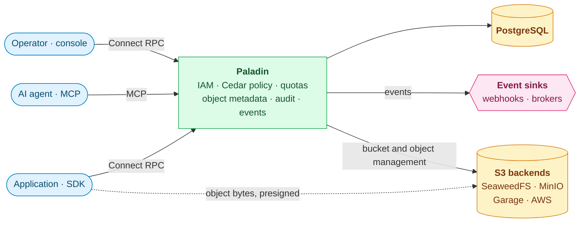

# paladin

[](https://github.com/oleg-tkachuk/paladin/actions/workflows/ci.yaml)
[](https://github.com/oleg-tkachuk/paladin/releases/latest)
[](sdk/go/README.md)
[](LICENSE)

[](backend/go.mod)
[](https://www.postgresql.org)
[](https://connectrpc.com)
[](https://www.cedarpolicy.com)
[](https://modelcontextprotocol.io)
[](https://nextjs.org)

A multi-tenant control plane for S3-compatible object storage. Applications
authenticate with a Paladin credential scoped to a tenant instead of holding
storage credentials; Paladin checks each request against the tenant's Cedar
policies, resolves the backend and bucket the tenant is on, meters usage
against quotas, and writes an audit trail.

**Paladin does not proxy traffic to S3.** Object bytes move between the client
and the storage backend over presigned URLs that Paladin signs; the API
carries metadata only. Paladin itself calls S3 to manage buckets and objects —
create and delete buckets, open and close multipart uploads, verify a
completed upload, copy and delete objects server-side — never to relay a
client's upload or download. [ARCHITECTURE.md](ARCHITECTURE.md#storage) lists
every call.



Access is granted through users, API tokens and capability tokens —
short-lived, budgeted and individually revocable. The capability primitive is
[`capability/`](capability/), a separate Go module with no database driver
and no storage SDK among its dependencies. Besides the Connect API, the
console and the Go and Python SDKs, the same operations are exposed over the
Model Context Protocol, so AI agents can use them as tools.

Paladin is one Go binary. Each role below runs as its own Deployment
(`paladin serve <role>`), next to a web console:

| Role | What it does |
|------|--------------|
| `api` | the data plane (object metadata, presigned upload and download URLs) and IAM (sign-in, users, API tokens) |
| `admin` | tenants, buckets, storage backends, quotas, policies, capabilities, audit |
| `mcp` | the api and admin operations, as tools for AI agents |
| `worker` | background jobs: bucket provisioning, trash purge, lifecycle, migration between backends |
| `dispatcher` | delivers events to webhooks and message brokers |
| `ingest` | turns storage-side notifications into object updates; off by default |
| `console` | the web UI, with a BFF in front of `api` and `admin`; its own chart and Deployment |

It needs PostgreSQL and an S3-compatible store — SeaweedFS, MinIO, Garage or
AWS S3.

## Contents

- [Deploy to Kubernetes](#deploy-to-kubernetes) — the Helm charts, on your cluster
- [Run it with Task](docs/task.md) — from a clone: compose, a local cluster, the gates
- [How changes land](docs/how-changes-land.md) — trunk, CI and releases
- [Documentation](#documentation) — the rest, by document
- [Layout](#layout) — where things live in the tree
- [License](#license)

## Deploy to Kubernetes

Two Helm charts, published to GHCR with every release (`vX.Y.Z`):

| Chart | Runs |
|-------|------|
| `oci://ghcr.io/oleg-tkachuk/charts/paladin-core` | the backend planes, plus the migrate and bootstrap Jobs |
| `oci://ghcr.io/oleg-tkachuk/charts/paladin-console` | the web console and its BFF |

The charts and the images they deploy are signed keyless with Sigstore, and
each image carries a signed SPDX SBOM per platform;
[releasing.md](docs/releasing.md#signatures-and-sboms) shows how to verify them.

The charts run neither PostgreSQL nor the object store: bring PostgreSQL 16+
and an S3-compatible store whose access key may create buckets. Kubernetes
1.25+ and Helm 3.8+.

1. Create the three database roles, once, as a superuser — the SQL is in
   [docs/install.md](docs/install.md#1-database-roles).
2. Put the credentials into Secrets:

   ```bash
   kubectl create namespace paladin
   kubectl -n paladin create secret generic paladin-postgres-app --from-literal=password='<app-password>'
   kubectl -n paladin create secret generic paladin-postgres-migrate --from-literal=password='<migrate-password>'
   kubectl -n paladin create secret generic paladin-s3 \
     --from-literal=access_key='<access-key>' --from-literal=secret_key='<secret-key>'
   ```

3. Give the backend chart what it cannot default:

   ```yaml
   # paladin-core.yaml
   postgres:
     host: postgres.databases.svc.cluster.local
     sslmode: require
     app:
       existingSecret: paladin-postgres-app
     migrate:
       existingSecret: paladin-postgres-migrate
   config:
     storage:
       backends:
         primary:
           endpoint: http://seaweedfs.storage.svc.cluster.local:8333
           public_endpoint: https://s3.example.com   # what clients reach the store by
           region: us-east-1
   storage:
     s3CredentialsSecret:
       create: false
       existingSecret: paladin-s3
   ```

4. Install both charts:

   ```bash
   helm install paladin-core oci://ghcr.io/oleg-tkachuk/charts/paladin-core \
     --version <version> -n paladin -f paladin-core.yaml
   helm install paladin-console oci://ghcr.io/oleg-tkachuk/charts/paladin-console \
     --version <version> -n paladin
   ```

5. Sign in as `admin`, with the password generated on first install:

   ```bash
   kubectl -n paladin get secret paladin-bootstrap-admin -o jsonpath='{.data.password}' | base64 -d
   kubectl -n paladin port-forward svc/paladin-console 3000:3000
   ```

[docs/install.md](docs/install.md) covers the rest: ingress, TLS between the
planes, and what to set when ArgoCD renders the charts.

## Documentation

| Document | Covers |
|----------|--------|
| [ARCHITECTURE.md](ARCHITECTURE.md) | what the pieces are and why the boundaries fall where they do |
| [backend/README.md](backend/README.md) | roles, ports, packages, wire contracts, database |
| [frontend/README.md](frontend/README.md) | the console and its BFF |
| [capability/README.md](capability/README.md) | the standalone authorisation primitive, and why it has no version stream |
| [docs/install.md](docs/install.md) | installing on Kubernetes with the Helm charts |
| [docs/task.md](docs/task.md) | running it with Task — compose, a local cluster, the gates — and the prerequisites of each |
| [docs/configuration.md](docs/configuration.md) | every configuration surface, and the validation run at load |
| [docs/upgrading.md](docs/upgrading.md) | breaking changes between releases |
| [docs/how-changes-land.md](docs/how-changes-land.md) | trunk, CI, and what a green push to `main` releases |
| [docs/releasing.md](docs/releasing.md) | what each tag family publishes and who cuts it |
| [docs/](docs/README.md) | subsystems, [ADRs](docs/adr/) and [runbooks](docs/runbooks/) |
| [CONTRIBUTING.md](.github/CONTRIBUTING.md) | pull requests are not accepted yet; security fixes are |
| [docs/development.md](docs/development.md) | conventions, test tiers, how a pull request is expected to look |
| [SECURITY.md](.github/SECURITY.md) | reporting a vulnerability |
| [docs/security-model.md](docs/security-model.md) | scope, known non-findings, the security model |
| [BACKLOG.md](BACKLOG.md) | deferred work, each item with its reason — read before calling a gap an oversight |

## Layout

| Path | Holds |
|------|-------|
| [backend/](backend) | the Go control plane: binary, migrations, policies, chart, compose stack |
| [frontend/](frontend) | the Next.js console and BFF, its chart and Playwright suite |
| [capability/](capability) | the standalone authorisation module |
| [proto/](proto) | the API contract |
| [sdk/go/](sdk/go) | the Go SDK |
| [sdk/python/](sdk/python) | the Python SDK |
| [deploy/](deploy) | Grafana dashboards and alerts |
| [scripts/](scripts) | the repository's own contract checks, run by `verify-all`, and the release and stack helpers |
| [specs/](specs) | spec-driven-development artifacts, per feature |
| [docs/](docs) | the documents above |

The components share a repository because a wire-contract change is a change
to all of them: the proto in `proto/` is the source of truth, and the backend,
the console and both SDKs generate their stubs from it.

Compatibility is not kept across releases yet, and only `main` is supported —
[docs/upgrading.md](docs/upgrading.md) lists what each release breaks.

## License

Apache-2.0 — see [LICENSE](LICENSE) and [NOTICE](NOTICE).
