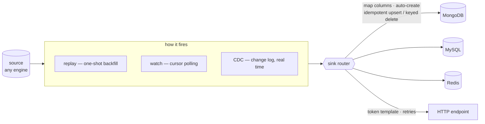
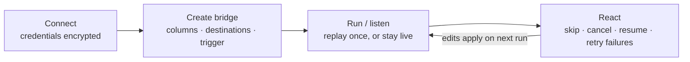

<div align="center">

<picture>
  <source media="(prefers-color-scheme: dark)" srcset="apps/web/public/logo-white.png">
  
</picture>

### Keep your databases in sync, across engines and in real time

Most change-data-capture tools hand you a stream and stop there. Debezium gives
you a Kafka topic: you run the broker, and you still build the thing that reads
it and writes to your database. **Syncle writes to your database.**

Draw a **bridge** from a source to one or more destinations and rows go across
it: the moment one changes in the source, it's written to every destination you
linked. Any engine to any engine — **PostgreSQL · MySQL · SQLite · MongoDB ·
Redis** — plus HTTP endpoints when you need them.

<sub>A bridge is a source, one or more destinations, and a trigger that decides when rows move.</sub>

<br>

[](LICENSE)
[](https://github.com/osmanahmadxai/SYNCLE/discussions)


<br>


</div>

---

## What it does

A **bridge** reads rows from a source database and writes each one to its
**destinations**. A destination is either:

- **another database** — the headline feature. Sync Postgres → MongoDB,
  MySQL → SQLite, MongoDB → Redis… mix engines freely. One bridge can fan out to
  **several databases at once**, bridges can chain (DB&nbsp;A → DB&nbsp;B → DB&nbsp;C),
  and two bridges can feed each other (DB&nbsp;A ⇄ DB&nbsp;B): Syncle knows its
  own writes when they come back, so a change crosses once instead of for ever.
  In Redis a row is a key of its own — `user:{{id}}` as a hash, a JSON document
  or a string, with an expiry if you want one.
- **an HTTP endpoint** — POST/PUT/PATCH each row to a URL with a payload you
  design, for the times you're feeding a service instead of a database.



What the database-to-database sync guarantees:

- **Any engine → any engine.** The same bridge moves a row between relational,
  document, and key-value stores. Values are translated to fit the target.
- **No duplicate rows.** Writes are **idempotent upserts** keyed by the columns
  you choose, so replays, retries, and redeliveries never double-write. Inserts,
  updates, **and deletes** all propagate.
- **Missing tables are created.** If the destination table or collection doesn't
  exist, Syncle creates it from the source's shape. Between two instances of one
  engine the source's own types are reused word for word; across engines each
  type is translated to the closest the target has, and **a narrowing is always
  reported**: the preview lists the exact columns a run would create, and names
  every one the target can't hold faithfully, before anything runs. Or **map and
  rename columns** yourself — "write this column into that column over there."
- **Values keep their types.** Exact decimals and 64-bit integers
  stay exact, bytes stay bytes, microseconds survive, and a wall-clock timestamp
  can't shift by the server's time zone — checked against real engines, by
  replay and by CDC, under more than one time zone.
- **Live, polled, or one-shot** — you pick how it fires (see triggers below).

### How a bridge fires

- **Replay** — a one-shot job. Stream all (or selected) rows once, then finish.
  Perfect for the **initial backfill** or a migration.
- **Watch** — poll the source on a cursor (an auto-increment id, an `updated_at`
  column, or a primary-key diff) and sync new rows as they show up. Works on
  every engine.
- **CDC** — true change-data-capture straight from the database's change log, in
  **real time, no polling**. Postgres logical replication, MySQL binlog, MongoDB
  change streams, Redis keyspace notifications. Inserts, updates, and deletes all
  come through, each tagged with its operation. It can **copy what the table
  already holds first and then follow it, in one bridge** — the place in the
  change log is taken before the copy starts, so nothing that changes meanwhile
  is lost and no stale row lands on top of a fresh one.

The rest is the same whichever destination and trigger you pick:

- **Visual builder.** Browse the source table, toggle the columns to send,
  pick destinations, and watch a live preview of exactly what will be written.
- **Column mapping and payload templates.** For a database target, map source → target columns
  (rename, drop, pick keys). For an HTTP target, use a safe token template —
  `{{column}}`, `{{$row}}`, `{{$table}}`, `{{$op}}`, `{{$now}}`, `{{$index}}`.
  Structured substitution only — no string injection, no code execution.
- **Filters and transforms.** Send only the rows that meet a list of
  conditions. Mask a column (keep the last four, redact, or a salted SHA-256
  that still joins and works as a key), convert its type, trim or re-case it,
  give it a default, or compute a new column from the others. Steps run in the
  order you put them, a value that cannot be converted fails instead of being
  guessed at, and a table Syncle creates is typed for what the columns have
  become. Steps are declarative: no expressions, nothing evaluated.
- **Retries, rate limiting and batching.** Retries with backoff, rate limiting, optional batching, and
  exactly-once delivery so a change is applied once and only once downstream.
- **Failed rows are set aside, not dropped.** A row that has been read is always in one
  of three places: the destination, the bridge's dead-letter queue, or still
  ahead of the cursor. A bridge either stops *at* a failure (`abort`), or sets
  the rows that failed aside — in full — and carries on (`continue`). One bad
  row is isolated from the rest of its batch, and a retry re-reads it from the
  source, so it can never overwrite a newer version that arrived since.
- **Hardened by default.** Requests that change anything must come from the
  app itself (the browser's own `Sec-Fetch-Site` / `Origin`, so a forged
  cross-site request is refused before it reaches a route), every response
  carries a strict Content-Security-Policy and the usual hardening headers, and
  nothing is loaded from a CDN — the query editor included, so Syncle works on a
  network with no internet.
- **Shared replication slots.** On PostgreSQL, bridges can share a
  slot: one connection and one decoding of the WAL for every table of a source,
  confirmed only as far as the slowest bridge has got, each bridge still its own
  — filters, transforms, dead letters, verification. *Bridge many tables* makes
  one per table in a step.
- **Verify and reconcile.** Verify reads both ends and compares them row
  by row — by what kind of value each column holds, so `'1.50'` and `1.5` are the
  same number and `007` and `7` are not the same key — and reports what is
  missing, different, or only in the destination, with both readings of every
  column that differs. On a bridge that is still delivering, a row that looks
  wrong is read a second time before it is reported. Reconcile repairs only the
  rows that are actually wrong.
- **Scheduling.** A replay bridge takes a cron line and a named time
  zone, and replays its source by itself — nightly, hourly, on weekdays. Never
  two runs at once (a tick that finds one still running is skipped, and logged),
  always from the top, once per tick however many API processes share the
  Redis, and correct across daylight saving.
- **Schema changes are caught.** Rename or drop a column a bridge maps and the
  bridge stops *before* it writes `NULL` over what the destination holds, naming
  the column. A harmless change — a column added, a type changed — is shown on
  the bridge and sent to your alert channels; with `evolve`, a new column is
  added to the tables Syncle created, too.
- **Live delivery timeline.** Each delivery gets a cell, coloured green
  (synced) · red (failed) · amber (skipped) · slate (queued). Click one for the
  exact row written, the result, timing, and any error.
- **Job control.** Jobs survive restarts, resume where they stopped, and can
  be cancelled. Skip rows by range or selection, or retry only the failed ones in
  place — failed cells flip green. On a live bridge, retrying works without
  stopping it.

### Screenshots and recordings


<sub><b>A bridge built seconds earlier, delivering.</b> Orders are inserted into Postgres from outside the browser while the page is open, so the counter climbing is the bridge doing the work — no cuts, nothing sped up. The <a href="https://syncle.dev/#demo">full 58-second walkthrough</a> (plays on syncle.dev; <a href="https://raw.githubusercontent.com/osmanahmadxai/SYNCLE/main/website/public/media/syncle-demo.mp4">the file</a> downloads, 3.6&nbsp;MB) builds this bridge from an empty workspace — naming it, picking the source table, choosing event-based CDC, pointing it at MongoDB — with the mouse visible throughout. More stills in <a href="docs/assets/media">docs/assets/media</a>.</sub>


<sub>A CDC bridge mid-flight, and every row that crossed it — what was written, when, and how long it took.</sub>


<sub>A finished backfill. Deliveries can exceed the total because rows kept changing at the source while the replay ran — the upserts are idempotent, so they land once.</sub>

---

## Get started

### Install and run — one command

```bash
curl -fsSL https://syncle.dev/install | sh -s -- up
```

That downloads the newest release, starts Syncle, and opens it at
**http://localhost:3002**. Docker is the only requirement: Node, Postgres and
Redis all run in containers, and the app image is pulled prebuilt, so nothing is
compiled on your machine.

On first run it opens the setup form with a one-time **setup token** already
filled in, so all you do is pick a username and password. `syncle up` reads that
token off the server, so it is never typed, and only someone with access to the
machine can complete setup. If you're setting up from another device,
`syncle logs api` prints the token and the form accepts it by hand.

After that, the `syncle` command manages the stack:

```bash
syncle up        # start (and open the GUI)
syncle down      # stop, keeping your data
syncle logs      # follow the logs
syncle update    # move to the newest release
syncle uninstall # remove everything, including data
```

Run the GUI on a different port with `SYNCLE_PORT=8080 syncle up`. Config and
your encryption key live in `~/.syncle`.

<details>
<summary>Prefer plain Docker Compose?</summary>

```bash
curl -fsSLO https://raw.githubusercontent.com/osmanahmadxai/SYNCLE/main/docker-compose.app.yml
docker compose -f docker-compose.app.yml up -d
```

Set `SYNCLE_MASTER_KEY` first (`openssl rand -base64 32`) — it encrypts stored
database credentials. Without it the API generates one inside the data volume,
where it is lost if the volume is removed.

</details>

---

### Kubernetes

A Helm chart is in [`deploy/helm/syncle`](deploy/helm/syncle): the API, the
GUI, and (unless you bring your own) a PostgreSQL and a Redis for Syncle
itself. The master key is the one value you must set.

```bash
helm install syncle ./deploy/helm/syncle --namespace syncle --create-namespace \
  --set masterKey.value="$(openssl rand -base64 32)"
kubectl -n syncle logs deploy/syncle-api | grep -A2 'setup token'   # first-run token
kubectl -n syncle port-forward svc/syncle 3002:3002                  # or enable the ingress
```

See the [self-hosting guide](https://syncle.dev/docs/self-hosting#kubernetes)
for external databases, ingress/TLS, replicas and tunables.

### Run from source (for development)

You'll need **Node 22+**, **pnpm 10+**, and **Docker**. The repo pins both via
`.nvmrc` and `packageManager`, so the easiest setup is:

```bash
nvm use            # picks up Node 22 from .nvmrc (or just use Node 22+ yourself)
corepack enable    # gives you the exact pnpm version the repo expects
```

Then:

```bash
pnpm install                  # frontend + backend
docker compose up -d          # postgres (metadata) + redis (job queue)
pnpm start                    # initialize and run the whole app
```

`pnpm start` handles the setup steps: it writes the local env files, builds the
workspace, runs the database migrations, then launches both the API and the web
app.

```
  Syncle · ready

    Web  http://localhost:3002   ← open this
    API  http://localhost:4002/api
```

Working on the code? `pnpm dev` is the same thing in watch mode.

> **Install trouble?** `better-sqlite3` is the only dependency that needs a
> native binary. On Node 22+ it installs a prebuilt one — no compiler needed.
> If you see it fall back to `node-gyp` (or a `tsc: command not found` right
> after, which just means the install bailed early), you're usually on a Node
> version without a prebuild or a distro-packaged pnpm with a broken node-gyp.
> Fix: use Node 22+ (`nvm use`), get pnpm via `corepack enable` instead of your
> system package manager, then `pnpm install` again.

> The two services back different things. **Postgres** holds Syncle's own
> metadata (saved connections, bridges, jobs, deliveries) through Prisma.
> **Redis** backs the BullMQ queue that runs bridge jobs durably. Connecting
> databases, browsing data, and building/previewing bridges all work without
> Redis — only _running_ a job needs it. Point `DATABASE_URL` / `REDIS_URL` at
> your own instances if you'd rather not use the bundled containers.

---

## Your first bridge

From zero to a live sync. All of it happens in the web app at
`http://localhost:3002`.

**1 · Connect your databases.** Open **Data sources** and add the source and
destination connections (host, port, credentials — they're encrypted at rest).
The connection form adapts to the engine you pick, and a connectivity check
tells you immediately whether Syncle can reach it.

**2 · Pick the table you want to sync.** Browse the source connection and open
the table. You get the full workbench view — filter, sort, poke around. When it
looks right, hit **Create bridge**: the builder opens pre-seeded with that table
as the source.

**3 · Shape what gets sent.** Toggle the columns to include, then add one or
more destinations:

- **Database destination** — pick a connection and either map columns onto an
  existing table (rename, drop, choose the upsert keys) or let Syncle
  auto-create the target table from the source's shape, types translated for
  the target engine.
- **HTTP destination** — set the URL/method and design the payload with tokens
  like `{{column}}`, `{{$row}}`, `{{$op}}`, `{{$now}}`.

The live preview shows exactly what will be written before anything runs.

**4 · Choose the trigger.**

| You want…                              | Pick       | What happens                                            |
| -------------------------------------- | ---------- | ------------------------------------------------------- |
| A one-time copy / initial backfill     | **Replay** | Streams all (or selected) rows once, then finishes      |
| Ongoing sync, zero source config       | **Watch**  | Polls a cursor (id / `updated_at` / PK diff) for change |
| Real-time sync straight from the log   | **CDC**    | Live change capture — inserts, updates, deletes (and, from PostgreSQL, truncates) |

For CDC, the builder runs a **readiness check** against the source and lists
anything the database still needs (see [CDC prerequisites](#cdc-prerequisites)).

**5 · Run it and watch.** Start the bridge and the timeline lights up cell by
cell — green synced · red failed · amber skipped · slate queued. Click any cell
to see the exact row, the result, and timing. Fix a destination and **retry just
the failures**, skip rows you don't want, or cancel and resume later — jobs
survive restarts.

> **Common first bridges:** Postgres → MongoDB (replay to backfill, then CDC to
> stay live) · MySQL → SQLite (portable local copy) · MongoDB → Redis (hot
> cache) · anything → HTTP (feed a webhook).

---

## The bridge lifecycle



1. **Connect** your databases (credentials encrypted at rest) from the Data
   sources workbench, or inline while building a bridge.
2. **Create a bridge** — pick the source table and columns, then choose where it
   syncs: one or more **target databases** (map columns or let it auto-create the
   table) and/or an **HTTP endpoint**. Pick a trigger (replay / watch / CDC). For
   CDC the builder runs a readiness check and tells you exactly what (if anything)
   the source still needs configured.
3. **Run / listen** — a replay job streams rows once with the timeline updating
   live; a watch or CDC bridge starts listening and syncs changes as they happen.
4. **React** — skip rows you don't want, cancel, resume the remainder, or retry
   the failures after fixing a destination. Edits apply on the next run/resume.

---

## The database workbench

Syncle ships a full database workbench (the "Data sources" surface) — handy
for shaping a source and for inspecting what landed in a destination:

- Browse any table — paginated, sortable, multi-condition filters, inline edit,
  insert/delete, CSV/JSON export.
- A Monaco query editor with tabs, autocomplete, and formatting.
- Schema explorer, structure view, interactive ER diagram, and full DDL
  (create/drop/truncate tables, create/drop databases).
- Backup & restore — portable JSON for any engine, or `.sql` for relational ones.

Every table view has a one-click "Create bridge" that drops you into the builder
pre-seeded with that table as the source.


<sub>Browsing a source table, and the same database as an ER diagram. <a href="docs/assets/media">The query editor and structure views are here too.</a></sub>

---

## How it's built

A pnpm monorepo with a one-way dependency flow (`web → api → core`):

```
syncle/
├─ packages/
│  └─ core/            @syncle/core — framework-agnostic domain (pure TS)
│     ├─ adapters/       DatabaseAdapter interface + one file per engine
│     │                  (raw drivers: pg, mysql2, better-sqlite3, mongodb, ioredis)
│     └─ bridges/        column mapping + cross-engine table translation,
│                        payload transform, shared bridge schemas (Zod)
├─ apps/
│  ├─ api/             @syncle/api — NestJS backend
│  │  ├─ bridges/        bridge store · job processor · CDC providers ·
│  │  │                  sink router → database sink + HTTP delivery
│  │  ├─ connections/    Prisma-backed store · live adapter pool · controllers
│  │  ├─ common/         crypto · Zod validation · exception filter
│  │  └─ prisma/         metadata-store schema + migrations
│  └─ web/             @syncle/web — Next.js 15 frontend (shadcn/ui, TanStack)
└─ docker-compose.yml  Postgres (metadata) + Redis (job queue)
```

**One sink, two destination kinds.** Every trigger (replay, watch, CDC) funnels
rows through a single sink router. It dispatches to the **database sink** (which
maps columns, auto-creates the target if needed, and performs a native upsert or
keyed delete on the target engine) or to **HTTP delivery** (template render +
POST with retries). The runner, monitor, and exactly-once accounting don't care
which — so a new destination is one module.

**Exactly-once, cross-engine.** Database targets write with the engine's own
atomic upsert — Postgres/SQLite `ON CONFLICT`, MySQL `ON DUPLICATE KEY`, Mongo
`updateOne(upsert)` — keyed by the columns you chose. That makes every write
idempotent: replays and at-least-once CDC redeliveries land a row once. Deletes
route to a keyed delete on each target.

**Durable jobs.** A replay job is one BullMQ queue entry (the queue id is the
job's id). It streams
the source a page at a time (keyset pagination for millions of rows), syncs
sequentially (natural backpressure), and checkpoints progress — so a crash
auto-resumes from where it left off.

**CDC behind one interface.** Each engine captures changes its own way, but they
all implement the same small `CdcProvider` contract (readiness, provision,
stream, cursor). The service around them handles the job lifecycle and the
shared dedupe → map → write → record → checkpoint pipeline, so adding a new
engine's CDC is a single file.

**Two data layers, two access strategies.** The databases you connect _to_ have
unknown, runtime-discovered schemas, so the adapters use raw drivers with fully
parameterized queries (an ORM can't introspect arbitrary schemas). Syncle's
_own_ store has a fixed schema we control, so it uses Prisma with migrations.

> Adding an engine = implement `DatabaseAdapter` and register it. The connection
> form, schema browser, and feature gating all derive from that one registration.

---

## Configuration

Env files are created automatically on first run from the committed
`*.env.example` files. The essentials:

| Variable                      | Where | Purpose                                      |
| ----------------------------- | ----- | -------------------------------------------- |
| `PORT`                        | api   | API port (default `4002`)                    |
| `WEB_PORT`                    | web   | Web port (default `3002`)                    |
| `NEXT_PUBLIC_API_URL`         | web   | Base URL of the API                          |
| `DATABASE_URL`                | api   | Postgres datasource for the metadata store   |
| `REDIS_URL`                   | api   | Redis backing the bridge-job queue           |
| `SYNCLE_MASTER_KEY`       | api   | base64 32-byte key for secret encryption     |
| `SYNCLE_MASTER_KEY_PREVIOUS` | api | Changing the key: the old key(s), comma-separated. Still accepted for decrypting; what is under them is re-encrypted at start. Remove once the API says nothing depends on them |
| `SYNCLE_JOB_CONCURRENCY` | api   | How many bridge jobs may execute in parallel |
| `SYNCLE_CDC_BATCH_SIZE`  | api   | Rows per CDC delivery to a database destination (default `100000`) |
| `SYNCLE_CDC_BATCH_BYTES` | api   | Byte ceiling for one batch, so wide rows flush early (default `67108864`) |
| `SYNCLE_CDC_LINGER_MS`   | api   | How long a partial CDC batch waits before it is sent (default `50`) |
| `SYNCLE_CDC_SPOOL`       | api   | `on` to spool changes through Redis before writing (default off) |
| `SYNCLE_CDC_SPOOL_MAX`   | api   | Unwritten changes held in the spool before the reader is throttled (default `50000`) |
| `SYNCLE_DEAD_LETTER_MAX_ROWS` | api | Undelivered rows one bridge may hold in its dead-letter queue before it stops instead (default `10000`) |
| `SYNCLE_MAX_CONSECUTIVE_FAILURES` | api | Batches in a row that may deliver nothing before a `continue` bridge stops (default `5`) |
| `SYNCLE_SLOT_CHECK_SECONDS` | api | How often to measure the WAL each CDC bridge's replication slot pins on its source (default `60`; `0` = off) |
| `SYNCLE_SLOT_WARN_BYTES` | api | WAL pinned by one bridge before it is flagged (default 1 GiB) |
| `SYNCLE_SLOT_MAX_BYTES` | api | WAL pinned by a *stopped* bridge before its slot is dropped to protect the source (default `0` = never) |
| `SYNCLE_SNAPSHOT_HOLD_MAX` | api | Keys whose changes a Redis bridge may hold in memory while it copies the existing keys, before it stops instead (default `100000`) |
| `SYNCLE_LOG_LEVEL` | api | `error` \| `warn` \| `log` \| `debug` \| `verbose` (default `warn`; `log` adds lifecycle lines) |
| `SYNCLE_METRICS_TOKEN` | api | Enables `GET /api/metrics` (Prometheus) for `Authorization: Bearer <token>`; unset = the endpoint does not exist |
| `SYNCLE_ALERT_THROTTLE_SECONDS` | api | One alert per channel, kind of event and bridge per this many seconds (default `300`; `0` = every one) |
| `SYNCLE_VERIFY_RECHECK_MS` | api | Verify, on a bridge that is delivering: how long to wait before looking a second time at a row that looks wrong (default `1500`) |
| `SYNCLE_SHARED_SLOT_JOIN_WAIT_MS` | api | Joining a shared PostgreSQL replication slot: how long to wait for transactions that were open when the table was published (default `60000`) |
| `SYNCLE_AUDIT_RETENTION_DAYS` | api | Days the activity log (who did what) is kept — the default for the in-app setting (default `365`; `0` = for ever) |
| `SYNCLE_LEADER_TTL_SECONDS` | api | More than one API process: how long the leader's lease lasts — the longest a failover takes, and how long a leader cut off from Redis keeps reading live bridges (default `20`) |
| `SYNCLE_ECHO_TTL_SECONDS` | api | Loop prevention (A → B plus B → A): how long a write to a table another bridge reads is remembered, so it is known when it comes back (default `300`; `0` = off) |
| `SYNCLE_DELIVERY_RETENTION_DAYS` | api | Days a delivery's details are kept — default for the in-app setting (default `30`; `0` = for ever). Totals are never affected |
| `SYNCLE_DELIVERY_MAX_PER_JOB` | api | Deliveries a live (watch/CDC) bridge keeps, however recent — default for the in-app setting (default `100000`; `0` = no limit) |
| `SYNCLE_RETENTION_SWEEP_MINUTES` | api | How often delivery history is pruned (default `60`; `0` = only on demand) |
| `WEB_ORIGIN`                  | api   | Origins a browser may use Syncle from besides the app's own, comma-separated: allowed by CORS and to make changes (default `http://localhost:3002`) |

On the Docker install these go in `~/.syncle/.env` (one `NAME=value` per line),
followed by `syncle up` — not `syncle restart`, which keeps the environment the
container was created with. Anything left out keeps its default.

If `SYNCLE_MASTER_KEY` is unset, a random key is generated under
`apps/api/.syncle/` on first run — set it explicitly in production
(generate one with `openssl rand -base64 32`).

### CDC throughput

A change stream is delivered in batches rather than a row at a time — one
delivery, one delivery record, one cursor write and one source ack per batch
instead of per row. Batching is applied only to **database** destinations,
where it cannot be observed: writes are idempotent upserts keyed by column, so
N-at-once and N one-at-a-time leave the same table. HTTP destinations keep
using the bridge's own `batchSize`, because there the batch size is the payload
the receiver sees.

`SYNCLE_CDC_SPOOL=on` additionally puts a durable spool (a Redis Stream)
between the reader and the writer, and acknowledges the source as soon as
changes are spooled. That is what stops a slow or unreachable destination from
holding the **source's** log open — the failure mode where a Postgres slot
stops advancing and WAL fills the production database's disk.

It is off by default on purpose. While a change sits in the spool, Redis is the
only copy of it, so enable it only where Redis has persistence (`appendonly
yes`). Past `SYNCLE_CDC_SPOOL_MAX` the reader is throttled, so a stalled
destination cannot turn into unbounded Redis growth.

### Remote databases (SSH tunnels)

A connection can reach its database through an SSH jump host: toggle **SSH
tunnel** in the connection dialog and give it the SSH host, user, and either a
password or a PEM private key (plus its passphrase, if it has one). Syncle
opens the tunnel server-side and port-forwards to the database, so only the
SSH port needs to be reachable — the database itself stays private. SSH
credentials are encrypted at rest and returned redacted, exactly like
connection passwords. Tunnels apply to the network engines (PostgreSQL, MySQL,
MongoDB, Redis); SQLite is a local file and never tunnels.

The jump host's key is checked the way `ssh` checks it: paste its fingerprint
(`SHA256:…`) and any other key is refused, or leave it empty and the key seen on
the first connection is recorded and enforced from then on. A host that later
presents a different key is refused.

### TLS to the database

Each connection picks how far TLS is trusted, using the names PostgreSQL's
`sslmode` made familiar — and they mean the same thing on every engine, for
**every** connection Syncle opens with it, the CDC change streams included:

| Mode | What it does | Protects against |
| ---- | ------------ | ---------------- |
| Off | no TLS | nothing |
| Encrypt only (`require`) | encrypts, checks nothing | passive eavesdropping only |
| Verify authority (`verify-ca`) | the certificate must chain to your CA | an impostor without a cert from that CA |
| Verify authority and host (`verify-full`) | …and be issued for this host | impersonation. **Use this one.** |

Give a CA certificate for a private CA (leave it empty to trust the system's), an
expected server name if the certificate is for a different name than you dial,
and a client certificate + key for servers that want mutual TLS. Through an SSH
tunnel the certificate is still checked against the *database's* host name, not
the tunnel's `127.0.0.1`.

## Benchmarks

Throughput is measured rather than estimated. The suite runs against real
PostgreSQL, MySQL, SQLite and MongoDB in containers, moving **millions of rows**
per scenario, and records what it observed, including the CPU and memory the run
cost and the resource use of each database container.

**[See the results → syncle.dev/benchmarks](https://syncle.dev/benchmarks)**

The numbers are deliberately not reproduced here, because a figure copied into a
README goes stale the moment the code moves. The page renders
[`benchmarks/results.json`](benchmarks/results.json), which is produced by the
runner in [`apps/api/bench`](apps/api/bench) and committed with every run, so
anything published can be traced to a recorded measurement and reproduced:

```bash
docker compose -f docker-compose.test.yml up -d
pnpm benchmark
```

Read the disclaimer on that page before quoting anything from it. Every database
runs on the same machine as Syncle there, with no network in between, which
flatters the absolute figures. The comparisons between code paths are more useful
than the raw rates.

## CDC prerequisites

Replay and watch bridges work anywhere. CDC needs the **source** database
configured for change capture; the builder's readiness panel checks all of this
for you and lists what's missing.

| Engine     | Mechanism              | What it needs                                                                                               |
| ---------- | ---------------------- | ----------------------------------------------------------------------------------------------------------- |
| PostgreSQL | logical replication    | `wal_level=logical`, a role with REPLICATION (slot/publication auto-made)                                   |
| MySQL      | binary log             | `log_bin=ON`, `binlog_format=ROW`, `binlog_row_image=FULL`, REPLICATION grants, `binlog_transaction_compression=OFF` |
| MongoDB    | change streams         | a replica set (a single-node one is fine for dev); pre-images auto-enabled so deletes propagate by your key |
| Redis      | keyspace notifications | `notify-keyspace-events` (Syncle enables it when it can)                                               |
| SQLite     | —                      | not supported; use a watch bridge instead                                                                     |

> Redis CDC is real-time only and non-durable — events that happen while Syncle
> is offline can't be recovered, so prefer a watch bridge there if you need
> guarantees.

**PostgreSQL specifics.**

- **Updates and deletes need a replica identity** — a primary key, or
  `ALTER TABLE … REPLICA IDENTITY FULL`. Without one PostgreSQL can only report
  inserts, and publishing updates for such a table would make `UPDATE`/`DELETE`
  on it fail in *your* database. Syncle checks first and refuses to start the
  bridge rather than do that; insert-only capture is always fine.
- **A delete carries only the source's key**, so a target that should receive
  deletes has to be keyed on it (or the table set to `REPLICA IDENTITY FULL`).
  A mismatch is refused at start instead of silently deleting nothing.
- **A replication slot pins WAL for as long as it exists**, read or not — so a
  bridge left paused fills the source's disk. Syncle measures it, warns past
  `SYNCLE_SLOT_WARN_BYTES`, releases the slot when a bridge is deleted or edited
  away from CDC (and retries if that fails), and the readiness check tells you
  when the server has no `max_slot_wal_keep_size` — set one; it is the safety
  net that still works while Syncle is off. Each CDC bridge needs one slot and
  one WAL sender (`max_replication_slots`, `max_wal_senders`).
- **A lost position is reported, not skipped past.** If the slot was dropped or
  invalidated (or MySQL purged the binlog, or MongoDB's oplog rolled over), the
  bridge stops and says so; starting it again asks you to confirm continuing
  from now, and a replay fills the gap.
- **`TRUNCATE` is opt-in.** By default the destination keeps its rows and the
  timeline records that the source was truncated. Add `truncate` to the
  bridge's operations to empty the destination tables too.
- **Partitioned tables**: bridge the parent. Needs PostgreSQL 13+.
- Large (TOASTed) columns an `UPDATE` did not touch, primary-key changes, `COPY`
  bulk loads and overlapping transactions are all handled — the
  [CDC docs](https://syncle.dev/docs/cdc#postgres-behaviour) say how.

**MySQL specifics.**

- **`binlog_transaction_compression` is not supported.** MySQL 8.0.20+ can wrap
  a transaction's row events inside a compressed payload event, which the
  binlog reader has no decoder for — the rows inside it are not seen. Leave it
  `OFF` on a source you stream from.
- **MariaDB is untested.** Connections, replay and watch bridges go through
  `mysql2` and work, but CDC reads the binlog with a client that targets MySQL,
  and that path has not been verified against MariaDB. Treat MariaDB CDC as
  unsupported until it has been.
- **Binlog positions are per-server.** A cursor records the server's
  `@@server_uuid`; if a connection later reaches a different server (a
  failover), the bridge refuses to resume rather than reading unrelated
  offsets. Reset it to start from the current position.

## Scripts

| Command                                       | Description                               |
| --------------------------------------------- | ----------------------------------------- |
| `pnpm install`                                | Install all workspaces                    |
| `pnpm start`                                  | Initialize + run everything (production)  |
| `pnpm dev`                                    | Same, with watch-mode for development     |
| `pnpm dev:api` / `pnpm dev:web`               | Run one side only                         |
| `pnpm build`                                  | Production build: core → api → web        |
| `pnpm db:studio`                              | Open Prisma Studio on the metadata store  |
| `pnpm typecheck` · `test` · `lint` · `format` | Quality across all workspaces             |
| `pnpm clean` / `clean:all`                    | Remove build artifacts (and node_modules) |

## Tech stack

NestJS · BullMQ + Redis · Prisma + PostgreSQL · Next.js 15 · React 19 ·
TypeScript · Tailwind CSS · shadcn/ui · TanStack Query & Table · Monaco ·
React Flow · Zod · Vitest.

## Security

- Connection passwords, SSH credentials, TLS client keys and bridge auth secrets
  are encrypted at rest (AES-256-GCM) and only ever returned to the browser
  redacted.
- TLS to a database can verify both the certificate authority and the host name,
  on every engine and for every connection a bridge opens (the change streams
  too). SSH tunnels pin the jump host's key.
- All user values are passed as bound parameters; identifiers are dialect-quoted.
- Bridge payloads are built by structured token substitution — no string injection,
  no code execution.
- Every API route sits behind an account. The first run creates an admin, who
  can add more — admins, operators (the work, not the settings or accounts) and
  viewers (look, not change). Passwords are scrypt-hashed, the session is an
  httpOnly cookie, and changing a password invalidates existing sessions.
- An activity log records who did what: every change made through the API and
  every sign-in, kept for `SYNCLE_AUDIT_RETENTION_DAYS`.
- Syncle is still designed for local / trusted-network use. Before exposing it
  further, complete first-run setup before the port is reachable, put it behind
  TLS, and restrict which destinations (database connections / endpoint URLs)
  a bridge may write to.

## Questions, ideas and contributions

- **Questions and setup help** belong in
  [Discussions](https://github.com/osmanahmadxai/SYNCLE/discussions/categories/q-a),
  not the issue tracker, so the answer stays searchable.
- **Ideas** for where Syncle should go next are welcome in
  [Ideas](https://github.com/osmanahmadxai/SYNCLE/discussions/categories/ideas),
  and what you pointed it at belongs in
  [Show and tell](https://github.com/osmanahmadxai/SYNCLE/discussions/categories/show-and-tell).
- **Bugs** go in the [issue tracker](https://github.com/osmanahmadxai/SYNCLE/issues) —
  including places where the documentation and the software disagree, which
  counts as a bug here.
- **Code** is welcome too: [CONTRIBUTING.md](CONTRIBUTING.md) covers the whole
  setup, which is three commands once you have Node 22, pnpm 10 and Docker.
- **Security problems** go by email rather than into a public issue. The
  [self-hosting page](https://syncle.dev/docs/self-hosting#reporting) explains how.

## License

[MIT](LICENSE) © Osman Ahmadzai
