# MyBatis-Flex 多数据库查询系统

> 基于 MyBatis-Flex 框架的 PostgreSQL + DM 达梦数据库混合查询示范项目

[](https://openjdk.org/projects/jdk/21/)
[](https://spring.io/projects/spring-boot)
[](https://mybatis-flex.com/)

---

## 📋 目录

- [项目概述](#项目概述)
- [核心特性](#核心特性)
- [技术栈](#技术栈)
- [架构设计](#架构设计)
- [代码设计模式](#代码设计模式)
- [数据库设计](#数据库设计)
- [快速开始](#快速开始)
- [使用场景](#使用场景)
- [配置指南](#配置指南)
- [开发指南](#开发指南)
- [维护指南](#维护指南)
- [常见问题](#常见问题)
- [相关文档](#相关文档)

---

## 项目概述

### 项目定位

本项目是一个**多数据源查询系统示范项目**，旨在展示如何使用 MyBatis-Flex 框架实现跨 PostgreSQL 和 DM 达梦数据库的无缝查询。项目通过 **Relations API** 实现自动级联查询，证明了"应用层关联"策略在微服务架构中的可行性。

### 核心价值

✅ **技术示范**
- 展示 MyBatis-Flex Relations API 的强大功能
- 演示多数据源自动切换机制
- 提供从 MyBatis-Plus 迁移到 MyBatis-Flex 的参考

✅ **架构参考**
- 证明应用层关联策略的可行性
- 展示如何避免数据库厂商锁定
- 演示微服务架构的数据隔离方案

✅ **工程实践**
- 完整的分层架构设计
- 6 个核心业务场景实现
- 性能优化的最佳实践

### 应用场景

- **政务系统**：需要同时访问 PostgreSQL（业务数据）和 DM（历史数据）
- **企业应用**：多数据库共存的老旧系统改造
- **数据迁移**：从 Oracle/DM 迁移到 PostgreSQL 的过渡期方案
- **微服务架构**：不同微服务使用不同数据库的跨服务查询

---

## 核心特性

### 🚀 自动数据源切换

MyBatis-Flex 根据实体类的 `@Table(dataSource = "xxx")` 注解自动切换数据源，无需手动干预：

```java
// 自动切换到 DM 数据源
@Table(value = "ORDER", dataSource = "dm")
public class Order { ... }

// 自动切换到 PostgreSQL 数据源
@Table(value = "user", dataSource = "pg")
public class User { ... }
```

### 🔗 自动级联查询

使用 Relations API 实现自动加载关联数据：

```java
// 一键查询订单及明细
Order order = orderMapper.selectOneWithRelationsById(1L);
// order.getItems() 自动填充
```

### 📦 6 大核心场景

| 场景 | 数据源 | 查询类型 | API 端点 |
|------|--------|----------|----------|
| 场景1 | DM | 单表查询 + 自动加载明细 | `GET /api/v1/orders/user/{userId}` |
| 场景2 | PG | 单表查询 + 自动加载资料 | `GET /api/v1/users/{userId}` |
| 场景3 | DM | 同库跨表（订单→明细） | `GET /api/v1/orders/{orderId}/with-detail` |
| 场景4 | PG | 同库跨表（用户→资料） | `GET /api/v1/users/{userId}/with-profile` |
| 场景5 | DM+PG | 跨库跨表（订单→用户） | `GET /api/v1/orders/{orderId}/with-user` |
| 场景6 | DM+PG | 批量跨库查询 | `POST /api/v1/orders/batch-with-users` |

---

## 技术栈

### 后端框架

| 技术 | 版本 | 用途 |
|------|------|------|
| **Java** | 21 | 开发语言 |
| **Spring Boot** | 3.3.6 | 应用框架 |
| **MyBatis-Flex** | 1.10.8 | ORM 框架 |
| **Druid** | 1.2.x | 数据库连接池 |

### 数据库

| 数据库 | 版本 | 用途 | 表名约定 |
|--------|------|------|----------|
| **PostgreSQL** | 12+ | 用户数据 | 小写 (`user`, `user_profile`) |
| **DM 达梦** | 8 | 订单数据 | 大写 (`ORDER`, `ORDER_ITEM`) |

### 开发工具

| 工具 | 版本 | 用途 |
|------|------|------|
| **Maven** | 3.9+ | 项目构建 |
| **Lombok** | 1.18.32 | 代码简化 |

---

## 架构设计

### 4+1 视图模型

#### 1. 逻辑视图 (Logical View)

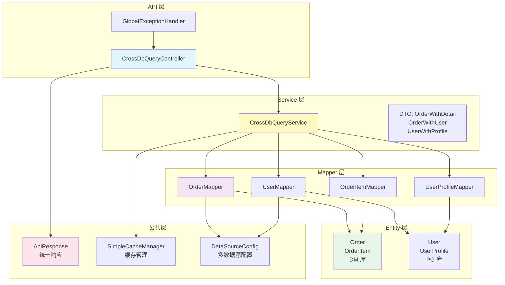

**说明**：
- **API 层**：提供 RESTful 接口，处理 HTTP 请求/响应
- **Service 层**：业务逻辑层，实现跨库查询策略
- **Mapper 层**：数据访问层，直接与数据库交互
- **Entity 层**：实体类，映射数据库表
- **公共层**：提供通用工具和配置

---

#### 2. 实现视图 (Implementation View)

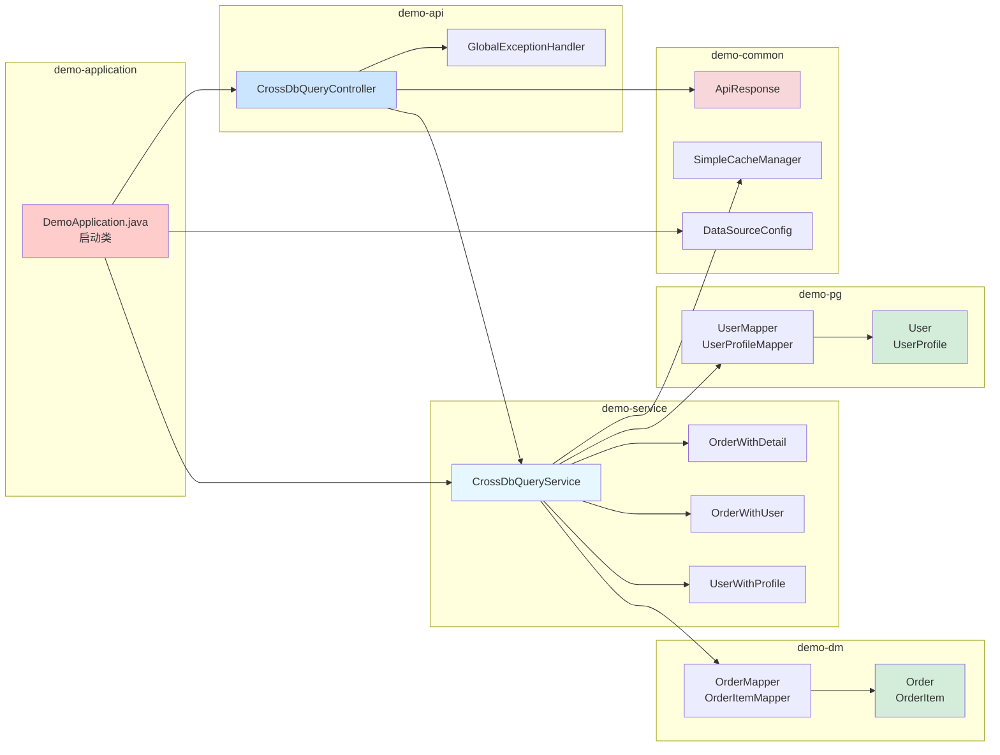

**模块职责**：

| 模块 | 职责 | 依赖 |
|------|------|------|
| **demo-application** | Spring Boot 启动模块 | 所有模块 |
| **demo-api** | RESTful API 控制器层 | demo-service, demo-common |
| **demo-service** | 业务逻辑层 | demo-dm, demo-pg, demo-common |
| **demo-dm** | DM 数据库实体和 Mapper | demo-common |
| **demo-pg** | PostgreSQL 实体和 Mapper | demo-common |
| **demo-common** | 公共配置/工具/响应格式 | 无 |

---

#### 3. 进程视图 (Process View)

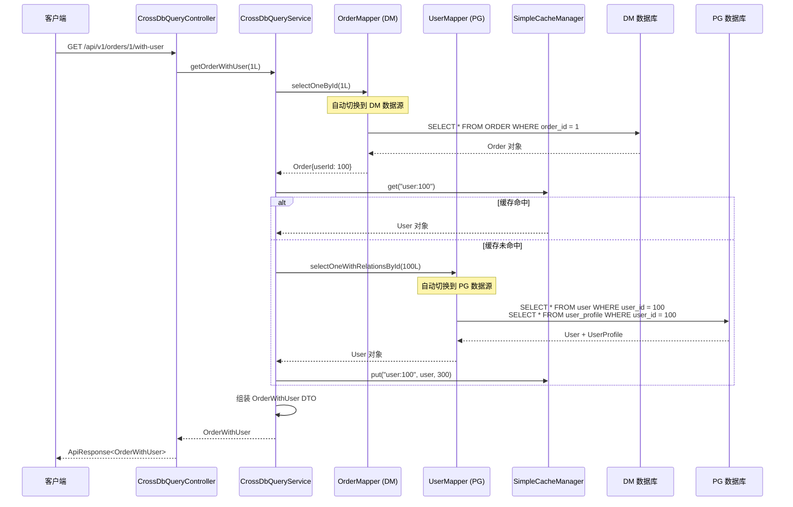

**关键流程**：
1. 客户端发起 HTTP 请求
2. Controller 层接收请求，调用 Service 层
3. Service 层根据实体类的 `@Table` 注解自动切换数据源
4. Mapper 层执行数据库查询
5. Service 层组装 DTO 返回结果
6. Controller 层封装统一响应格式返回

---

#### 4. 部署视图 (Deployment View)

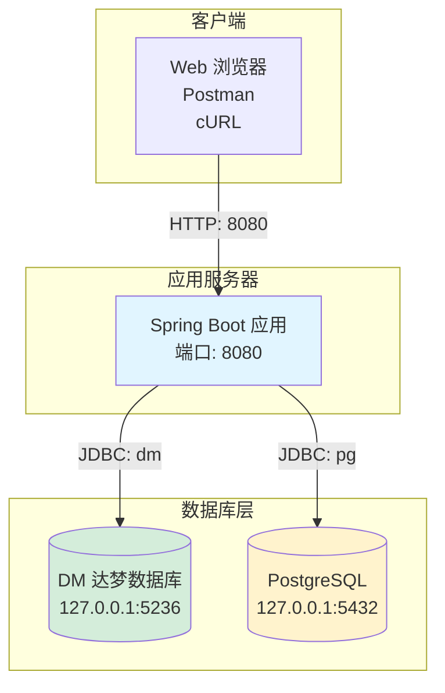

**部署说明**：
- 应用默认运行在 `8080` 端口
- 支持部署为 JAR 包或 War 包
- 数据库连接通过 JDBC 配置

---

#### 5. 数据视图 (Data View)

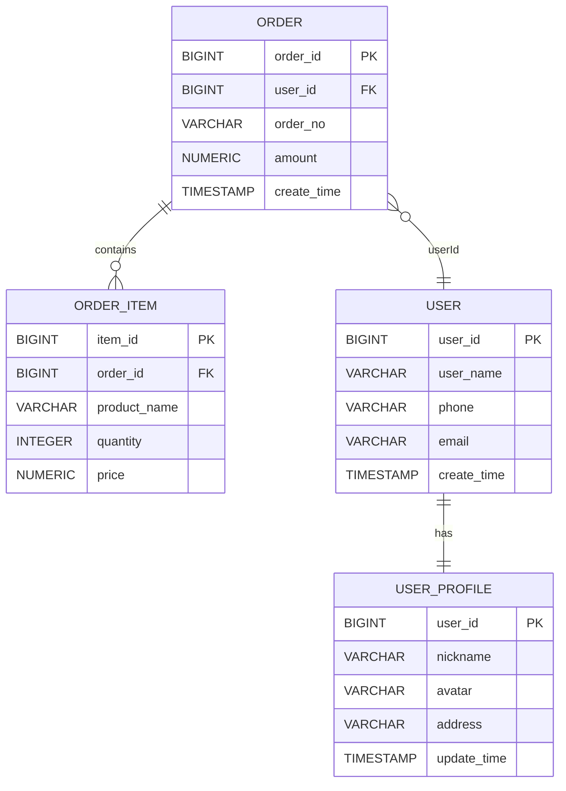

**数据流说明**：
- **DM 数据库**：存储订单相关数据（ORDER, ORDER_ITEM）
- **PostgreSQL**：存储用户相关数据（USER, USER_PROFILE）
- **跨库关联**：通过 `user_id` 字段在应用层实现关联

---

### UML 9 种图详解

#### 1. 用例图 (Use Case Diagram)

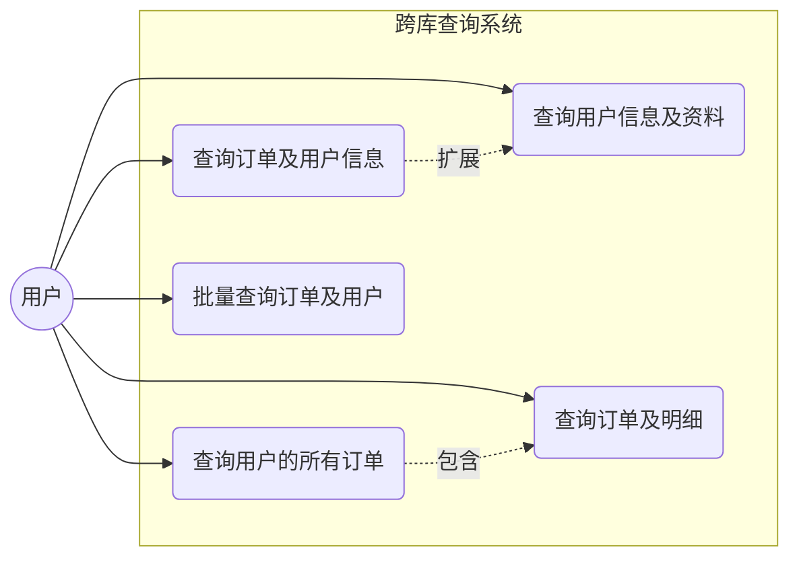

**用例说明**：
- **查询用户的所有订单**：查询指定用户在 DM 库中的所有订单记录
- **查询用户信息及资料**：查询 PG 库中的用户信息和资料
- **查询订单及明细**：查询单个订单及其明细项（一对多）
- **查询订单及用户信息**：跨库查询订单和用户信息（多对一）
- **批量查询订单及用户**：批量查询多个订单及其用户信息

---

#### 2. 类图 (Class Diagram)

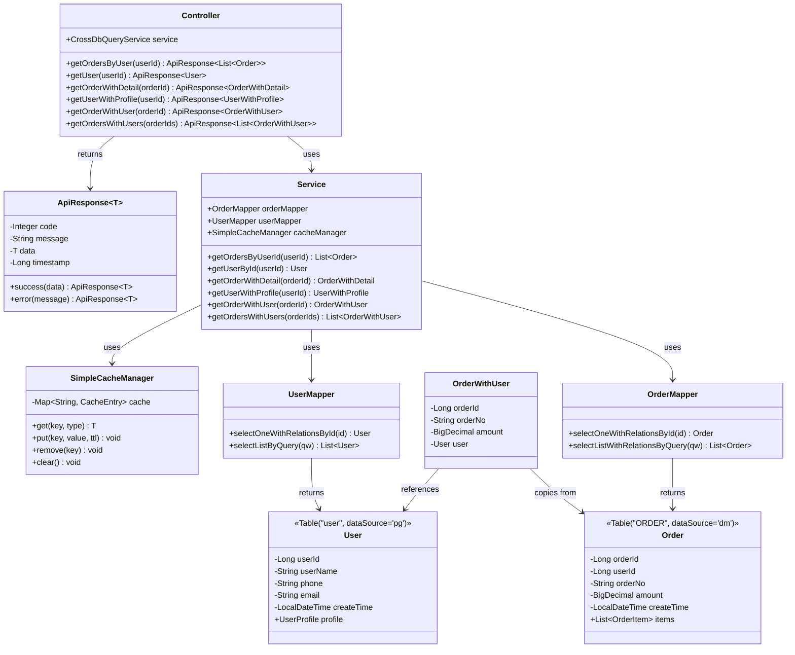

**类关系说明**：
- **依赖关系**：Controller 依赖 Service，Service 依赖 Mapper
- **关联关系**：Order 包含 OrderItem 列表，User 包含 UserProfile
- **泛化关系**：ApiResponse<T> 是泛型类

---

#### 3. 对象图 (Object Diagram)

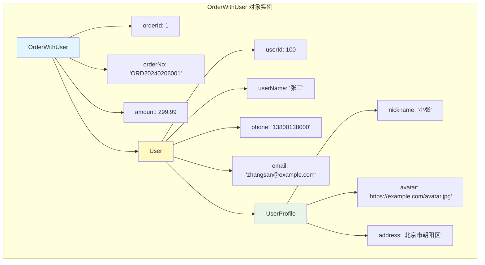

**对象实例说明**：
- 展示了 `OrderWithUser` 对象在运行时的实际数据
- 包含嵌套的 `User` 和 `UserProfile` 对象

---

#### 4. 序列图 (Sequence Diagram)

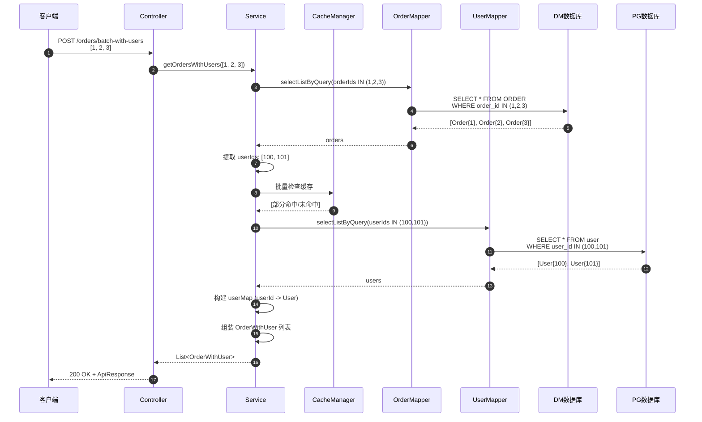

**关键步骤**：
1. 批量查询订单（DM 库）
2. 提取用户 ID
3. 批量查询用户（PG 库）
4. 构建 Map 提高查找效率
5. 组装 DTO 返回

---

#### 5. 协作图 (Communication Diagram)

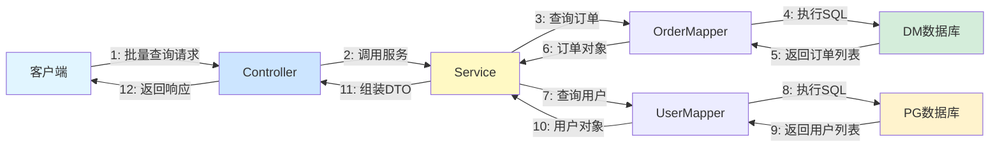

**协作关系**：
- 数字表示消息的执行顺序
- 展示了对象之间的消息传递路径

---

#### 6. 状态图 (State Diagram)

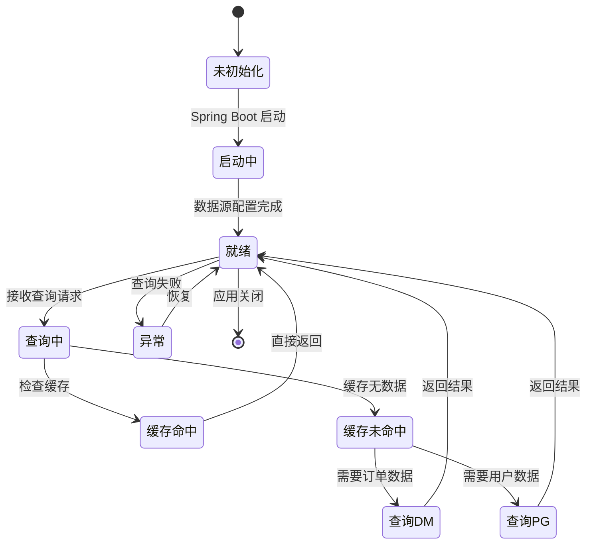

**状态转换说明**：
- 应用在"就绪"状态下处理查询请求
- 缓存命中直接返回，未命中则查询数据库
- 异常状态下自动恢复

---

#### 7. 活动图 (Activity Diagram)

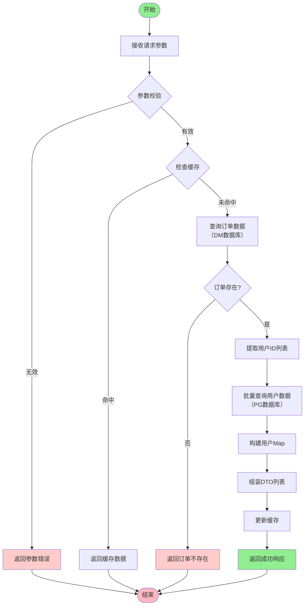

**活动说明**：
- 描述了批量查询的完整流程
- 包含错误处理分支
- 展示了缓存优化策略

---

#### 8. 组件图 (Component Diagram)

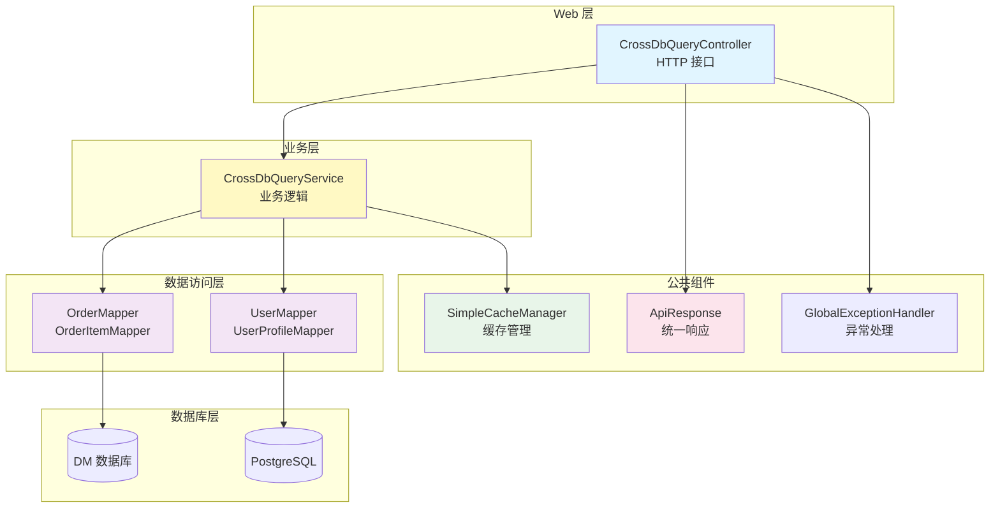

**组件说明**：
- **Web 层**：提供 HTTP 接口
- **业务层**：实现核心业务逻辑
- **数据访问层**：封装数据库操作
- **公共组件**：提供通用功能

---

#### 9. 部署图 (Deployment Diagram)

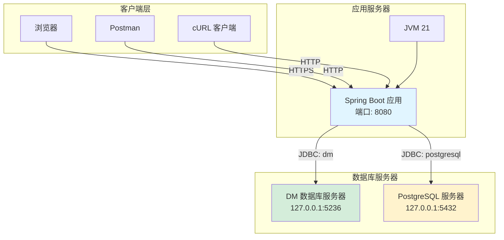

**部署说明**：
- 应用可部署为 JAR 包或容器化部署
- 支持水平扩展（无状态设计）
- 数据库支持读写分离和分库分表

---

## 代码设计模式

### 1. 三层架构模式 (Layered Architecture)

**模式定义**：将应用分为表现层、业务层和数据访问层

**实现示例**：

```java
// 表现层 (Controller)
@RestController
@RequestMapping("/api/v1")
public class CrossDbQueryController {
    @Autowired
    private CrossDbQueryService service;

    @GetMapping("/orders/{orderId}/with-user")
    public ApiResponse<OrderWithUser> getOrderWithUser(@PathVariable Long orderId) {
        OrderWithUser result = service.getOrderWithUser(orderId);
        return ApiResponse.success(result);
    }
}

// 业务层 (Service)
@Service
public class CrossDbQueryService {
    @Autowired
    private OrderMapper orderMapper;

    public OrderWithUser getOrderWithUser(Long orderId) {
        // 业务逻辑
        Order order = orderMapper.selectOneById(orderId);
        // ...
    }
}

// 数据访问层 (Mapper)
public interface OrderMapper extends BaseMapper<Order> {
    // MyBatis-Flex 自动实现 CRUD
}
```

**设计要点**：
- ✅ **职责分离**：每层只关注自己的职责
- ✅ **依赖倒置**：高层不依赖低层，都依赖抽象
- ✅ **易于测试**：每层可独立测试

---

### 2. DTO 模式 (Data Transfer Object)

**模式定义**：用于跨层数据传输的对象，避免直接暴露实体类

**实现示例**：

```java
// DTO 定义
public class OrderWithUser {
    private Long orderId;
    private String orderNo;
    private BigDecimal amount;
    private User user;  // 关联用户对象

    // Getters and Setters
}

// 使用 DTO
public OrderWithUser getOrderWithUser(Long orderId) {
    Order order = orderMapper.selectOneById(orderId);
    User user = userMapper.selectOneById(order.getUserId());

    // 组装 DTO
    OrderWithUser result = new OrderWithUser();
    result.setOrderId(order.getOrderId());
    result.setOrderNo(order.getOrderNo());
    result.setAmount(order.getAmount());
    result.setUser(user);  // 关联用户

    return result;
}
```

**设计要点**：
- ✅ **数据聚合**：将多个实体的数据组合成一个 DTO
- ✅ **隐藏细节**：不直接暴露实体类的所有字段
- ✅ **版本兼容**：API 变更时不影响实体类

---

### 3. 依赖注入模式 (Dependency Injection)

**模式定义**：通过 IoC 容器自动管理对象的依赖关系

**实现示例**：

```java
@Service
public class CrossDbQueryService {
    // 使用 @Autowired 自动注入
    @Autowired
    private OrderMapper orderMapper;

    @Autowired
    private UserMapper userMapper;

    @Autowired
    private SimpleCacheManager cacheManager;

    // 使用注入的对象
    public Order getOrder(Long orderId) {
        return orderMapper.selectOneById(orderId);
    }
}
```

**设计要点**：
- ✅ **松耦合**：对象之间不直接创建依赖
- ✅ **易于测试**：可以方便地 Mock 依赖对象
- ✅ **集中管理**：依赖关系由容器统一管理

---

### 4. 策略模式 (Strategy Pattern)

**模式定义**：定义一系列算法，把它们封装起来，并使它们可互相替换

**实现示例**：缓存策略

```java
// 缓存接口
public interface CacheStrategy {
    void put(String key, Object value, long ttl);
    <T> T get(String key, Class<T> type);
}

// 简单内存缓存实现
public class SimpleCacheManager implements CacheStrategy {
    private final Map<String, CacheEntry> cache = new ConcurrentHashMap<>();

    @Override
    public void put(String key, Object value, long ttl) {
        cache.put(key, new CacheEntry(value, System.currentTimeMillis() + ttl * 1000));
    }

    @Override
    public <T> T get(String key, Class<T> type) {
        CacheEntry entry = cache.get(key);
        if (entry != null && !entry.isExpired()) {
            return type.cast(entry.getValue());
        }
        return null;
    }
}
```

**设计要点**：
- ✅ **算法封装**：不同的缓存策略可以互换
- ✅ **运行时选择**：可以在运行时切换策略
- ✅ **易于扩展**：新增策略无需修改现有代码

---

### 5. 模板方法模式 (Template Method Pattern)

**模式定义**：在父类中定义算法的骨架，将某些步骤延迟到子类实现

**实现示例**：BaseMapper

```java
// MyBatis-Flex 提供的 BaseMapper
public interface BaseMapper<T> {
    // 模板方法：定义 CRUD 的骨架
    T selectOneById(Serializable id);
    List<T> selectListByQuery(QueryWrapper queryWrapper);
    int insert(T entity);
    int update(T entity);
    int deleteById(Serializable id);
}

// 自定义 Mapper 继承 BaseMapper
public interface OrderMapper extends BaseMapper<Order> {
    // 无需编写 CRUD 方法，直接继承使用
}

// 使用模板方法
Order order = orderMapper.selectOneById(1L);  // 使用继承的模板方法
```

**设计要点**：
- ✅ **代码复用**：通用逻辑在父类中实现
- ✅ **扩展性强**：子类可以添加自定义方法
- ✅ **一致性**：所有子类遵循相同的接口规范

---

### 6. 代理模式 (Proxy Pattern)

**模式定义**：为其他对象提供一种代理，以控制对这个对象的访问

**实现示例**：Mapper 代理

```java
// MyBatis-Flex 为 Mapper 接口生成代理对象
public interface OrderMapper extends BaseMapper<Order> {
    // 只定义接口，不实现
}

// MyBatis-Flex 在运行时生成代理对象
// 伪代码示例
OrderMapper proxy = (OrderMapper) Proxy.newProxyInstance(
    OrderMapper.class.getClassLoader(),
    new Class[]{OrderMapper.class},
    new MapperInvocationHandler()
);

// 使用代理对象
Order order = proxy.selectOneById(1L);
// 实际执行的是 MapperInvocationHandler 的逻辑
```

**设计要点**：
- ✅ **远程代理**：Mapper 代理执行 SQL 查询
- ✅ **懒加载**：Relations API 使用代理实现延迟加载
- ✅ **AOP 支持**：可以在代理中添加日志、事务等横切关注点

---

### 7. 建造者模式 (Builder Pattern)

**模式定义**：将复杂对象的构建与表示分离

**实现示例**：QueryWrapper

```java
// 使用 QueryWrapper 构建查询条件
QueryWrapper queryWrapper = QueryWrapper.create()
    .eq(Order::getUserId, 100)              // 等于
    .ge(Order::getCreateTime, "2024-01-01")  // 大于等于
    .orderBy(Order::getCreateTime, false)    // 降序
    .limit(10);                              // 分页

// 执行查询
List<Order> orders = orderMapper.selectListByQuery(queryWrapper);
```

**设计要点**：
- ✅ **链式调用**：提供流畅的 API
- ✅ **类型安全**：使用 Lambda 表达式避免字段名拼写错误
- ✅ **易于扩展**：可以方便地添加新的查询条件

---

### 8. 适配器模式 (Adapter Pattern)

**模式定义**：将一个类的接口转换成客户期望的另一个接口

**实现示例**：数据源适配

```java
// MyBatis-Flex 根据 @Table 注解自动切换数据源
@Table(value = "ORDER", dataSource = "dm")
public class Order { ... }

@Table(value = "user", dataSource = "pg")
public class User { ... }

// 查询时自动适配数据源
Order order = orderMapper.selectOneById(1L);  // 自动使用 dm 数据源
User user = userMapper.selectOneById(1L);     // 自动使用 pg 数据源
```

**设计要点**：
- ✅ **统一接口**：通过 Mapper 接口统一访问不同数据源
- ✅ **自动适配**：根据实体类注解自动选择数据源
- ✅ **透明切换**：业务代码无需关心数据源切换

---

### 9. 门面模式 (Facade Pattern)

**模式定义**：为子系统中的一组接口提供一个统一的高层接口

**实现示例**：Service 层

```java
@Service
public class CrossDbQueryService {
    // 门面方法：封装复杂的跨库查询逻辑
    public OrderWithUser getOrderWithUser(Long orderId) {
        // 1. 查询 DM 库
        Order order = orderMapper.selectOneById(orderId);

        // 2. 查询 PG 库
        User user = getUserById(order.getUserId());

        // 3. 组装结果
        OrderWithUser result = new OrderWithUser();
        result.setOrderId(order.getOrderId());
        result.setOrderNo(order.getOrderNo());
        result.setAmount(order.getAmount());
        result.setUser(user);

        return result;
    }
}
```

**设计要点**：
- ✅ **简化接口**：隐藏复杂的子系统调用
- ✅ **降低耦合**：客户端不需要知道子系统的细节
- ✅ **易于维护**：子系统变化不影响客户端

---

### 10. 观察者模式 (Observer Pattern)

**模式定义**：定义对象间的一对多依赖关系，当一个对象状态改变时，所有依赖者都会收到通知

**实现示例**：缓存失效

```java
@Service
public class CrossDbQueryService {
    @Autowired
    private SimpleCacheManager cacheManager;

    // 更新用户时清除缓存
    public void updateUser(User user) {
        userMapper.update(user);
        // 观察者：清除相关缓存
        cacheManager.remove("user:" + user.getUserId());
    }
}
```

**设计要点**：
- ✅ **事件驱动**：状态变化触发缓存清理
- ✅ **松耦合**：观察者和被观察者互不依赖
- ✅ **可扩展**：可以添加多个观察者

---

## 数据库设计

### ER 图 (实体关系图)


**关系说明**：

| 关系类型 | 表1 | 表2 | 关系字段 | 说明 |
|---------|-----|-----|---------|------|
| **1:N** | ORDER | ORDER_ITEM | order_id | 一个订单包含多个明细 |
| **1:1** | USER | USER_PROFILE | user_id | 一个用户对应一个资料 |
| **N:1 (跨库)** | ORDER | USER | user_id | 多个订单属于一个用户 |

---

### DM 数据库表结构

#### ORDER（订单表）

| 字段名 | 类型 | 约束 | 说明 | 示例 |
|--------|------|------|------|------|
| **order_id** | BIGINT | PK, AUTO | 订单ID（主键） | 1, 2, 3 |
| **user_id** | BIGINT | NOT NULL, FK | 用户ID（跨库外键） | 100, 101 |
| **order_no** | VARCHAR(50) | UK, NOT NULL | 订单号（唯一） | 'ORD20240206001' |
| **amount** | NUMBER(18,2) | NOT NULL | 订单金额 | 299.99 |
| **create_time** | TIMESTAMP | NOT NULL | 创建时间 | '2024-02-06 10:00:00' |

**索引设计**：
- PRIMARY KEY: `order_id`
- UNIQUE INDEX: `order_no`
- INDEX: `user_id`（用于跨库查询）

**数据示例**：

```sql
INSERT INTO "ORDER" (order_id, user_id, order_no, amount, create_time) VALUES
(1, 100, 'ORD20240206001', 299.99, '2024-02-06 10:00:00'),
(2, 101, 'ORD20240206002', 599.99, '2024-02-06 11:00:00'),
(3, 100, 'ORD20240206003', 199.99, '2024-02-06 12:00:00');
```

---

#### ORDER_ITEM（订单明细表）

| 字段名 | 类型 | 约束 | 说明 | 示例 |
|--------|------|------|------|------|
| **item_id** | BIGINT | PK, AUTO | 明细ID（主键） | 1, 2, 3 |
| **order_id** | BIGINT | NOT NULL, FK | 订单ID（外键） | 1, 2 |
| **product_name** | VARCHAR(100) | NOT NULL | 商品名称 | 'MacBook Pro', 'iPhone 15' |
| **quantity** | INTEGER | NOT NULL | 数量 | 1, 2 |
| **price** | NUMBER(18,2) | NOT NULL | 单价 | 12999.00, 5999.00 |

**索引设计**：
- PRIMARY KEY: `item_id`
- INDEX: `order_id`（用于关联查询）

**数据示例**：

```sql
INSERT INTO "ORDER_ITEM" (item_id, order_id, product_name, quantity, price) VALUES
(1, 1, 'MacBook Pro 14寸', 1, 12999.00),
(2, 1, 'iPhone 15 Pro', 2, 5999.00),
(3, 2, 'iPad Pro', 1, 7999.00);
```

---

### PostgreSQL 数据库表结构

#### user（用户表）

| 字段名 | 类型 | 约束 | 说明 | 示例 |
|--------|------|------|------|------|
| **user_id** | BIGINT | PK, SERIAL | 用户ID（主键，自增） | 100, 101 |
| **user_name** | VARCHAR(50) | NOT NULL | 用户名 | '张三', '李四' |
| **phone** | VARCHAR(20) | UNIQUE, NOT NULL | 手机号 | '13800138000' |
| **email** | VARCHAR(100) | - | 邮箱 | 'zhangsan@example.com' |
| **create_time** | TIMESTAMP | NOT NULL | 创建时间 | '2024-02-06 10:00:00' |

**索引设计**：
- PRIMARY KEY: `user_id`
- UNIQUE INDEX: `phone`
- INDEX: `user_name`

**数据示例**：

```sql
INSERT INTO "user" (user_name, phone, email, create_time) VALUES
('张三', '13800138000', 'zhangsan@example.com', '2024-02-06 10:00:00'),
('李四', '13900139000', 'lisi@example.com', '2024-02-06 11:00:00');
```

---

#### user_profile（用户资料表）

| 字段名 | 类型 | 约束 | 说明 | 示例 |
|--------|------|------|------|------|
| **user_id** | BIGINT | PK, FK | 用户ID（主键，外键） | 100, 101 |
| **nickname** | VARCHAR(50) | - | 昵称 | '小张', '小李' |
| **avatar** | VARCHAR(200) | - | 头像URL | 'https://example.com/avatar.jpg' |
| **address** | VARCHAR(500) | - | 地址 | '北京市朝阳区' |
| **update_time** | TIMESTAMP | - | 更新时间 | '2024-02-06 12:00:00' |

**索引设计**：
- PRIMARY KEY: `user_id`

**数据示例**：

```sql
INSERT INTO user_profile (user_id, nickname, avatar, address) VALUES
(100, '小张', 'https://example.com/avatar1.jpg', '北京市朝阳区'),
(101, '小李', 'https://example.com/avatar2.jpg', '上海市浦东新区');
```

---

### 跨库关联设计

#### 关联方式

**不使用数据库外键**，而是在应用层通过 `user_id` 字段实现关联：

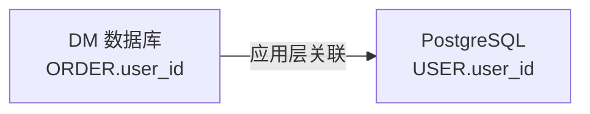

#### 关联规则

| 规则 | 说明 |
|------|------|
| **字段名一致** | 两个库的关联字段都叫 `user_id` |
| **类型一致** | 都使用 `BIGINT` 类型 |
| **应用层组装** | 在 Service 层组装 DTO，不使用 JOIN |
| **批量优化** | 使用批量查询 + Map 避免循环查询 |

---

### 数据写入规则

#### 1. 主键生成规则

| 数据库 | 主键类型 | 生成方式 | 实体类配置 |
|--------|---------|---------|-----------|
| **DM** | BIGINT | IDENTITY | `@Id(keyType = KeyType.Auto)` |
| **PostgreSQL** | BIGINT | SERIAL | `@Id(keyType = KeyType.Auto)` |

#### 2. 外键处理规则

**跨库外键（user_id）**：
- ✅ 在应用层保证一致性
- ❌ 不使用数据库外键约束
- ✅ 使用事务保证数据完整性

**同库外键（order_id）**：
- ✅ 使用数据库外键约束
- ✅ 使用级联删除（可选）

#### 3. 数据一致性规则

| 场景 | 保证方式 |
|------|---------|
| **插入订单** | 先插入 USER，再插入 ORDER |
| **删除用户** | 先检查是否有订单，再删除 |
| **更新用户** | 清除相关缓存 |
| **批量操作** | 使用事务 |

---

## 快速开始

### 环境要求

| 组件 | 版本要求 | 说明 |
|------|---------|------|
| **JDK** | 21+ | 推荐使用 OpenJDK 21 |
| **Maven** | 3.9+ | 用于构建项目 |
| **PostgreSQL** | 12+ | 用户数据存储 |
| **DM 达梦** | 8 | 订单数据存储 |

---

### 1. 克隆项目

```bash
git clone https://github.com/your-username/my-batis-flex-demo.git
cd my-batis-flex-demo
```

---

### 2. 配置数据库

#### 2.1 启动 PostgreSQL

```bash
# macOS (使用 Homebrew)
brew install postgresql@14
brew services start postgresql@14

# 创建数据库
psql -U postgres -c "CREATE DATABASE postgres;"
```

#### 2.2 启动 DM 达梦

```bash
# 下载 DM 达梦数据库
# https://www.dameng.com/list_103.html

# 启动 DM 服务
./bin/dm_service.sh start
```

#### 2.3 修改配置文件

编辑 `demo-application/src/main/resources/application.yml`：

```yaml
mybatis-flex:
  datasource:
    dm:
      url: jdbc:dm://127.0.0.1:5236
      username: ins_bus
      password: Insbus123456!  # 修改为你的密码

    pg:
      url: jdbc:postgresql://127.0.0.1:5432/postgres
      username: postgres
      password: postgres  # 修改为你的密码
```

---

### 3. 初始化数据库

#### 3.1 方式1：使用 SQL 脚本

```bash
# 初始化 PostgreSQL
psql -h localhost -U postgres -d postgres -f docs/sql/pg-schema.sql
psql -h localhost -U postgres -d postgres -f docs/sql/pg-data.sql

# 初始化 DM 达梦
disql SYSDBA/SYSDBA localhost:5236 -f docs/sql/dm-schema.sql
disql SYSDBA/SYSDBA localhost:5236 -f docs/sql/dm-data.sql
```

#### 3.2 方式2：使用 API 初始化（推荐）

```bash
# 启动应用后调用
curl -X POST http://localhost:8080/api/v1/admin/init-db
```

---

### 4. 编译项目

```bash
# 清理并编译（跳过测试）
mvn clean package -DskipTests

# 编译并运行所有测试
mvn clean package
```

---

### 5. 运行应用

#### 5.1 方式1：使用 Maven 插件

```bash
cd demo-application
mvn spring-boot:run
```

#### 5.2 方式2：使用 JAR 包

```bash
java -jar demo-application/target/demo-application-1.0.0.jar
```

#### 5.3 方式3：后台运行

```bash
nohup java -jar demo-application/target/demo-application-1.0.0.jar > /tmp/app.log 2>&1 &
```

---

### 6. 验证安装

```bash
# 查看启动日志
tail -f /tmp/app.log

# 测试 API
curl http://localhost:8080/api/v1/users/100

# 预期响应
{
  "code": 200,
  "message": "success",
  "data": {
    "userId": 100,
    "userName": "张三",
    "phone": "13800138000",
    "email": "zhangsan@example.com"
  },
  "timestamp": 1707200000000
}
```

---

## 使用场景

### 场景1：查询用户的所有订单

**业务场景**：用户在"我的订单"页面查看所有订单列表

**API 端点**：
```
GET /api/v1/orders/user/{userId}
```

**请求示例**：
```bash
curl http://localhost:8080/api/v1/orders/user/100
```

**响应示例**：
```json
{
  "code": 200,
  "message": "success",
  "data": [
    {
      "orderId": 1,
      "userId": 100,
      "orderNo": "ORD20240206001",
      "amount": 299.99,
      "createTime": "2024-02-06T10:00:00",
      "items": [
        {
          "itemId": 1,
          "orderId": 1,
          "productName": "MacBook Pro 14寸",
          "quantity": 1,
          "price": 12999.00
        },
        {
          "itemId": 2,
          "orderId": 1,
          "productName": "iPhone 15 Pro",
          "quantity": 2,
          "price": 5999.00
        }
      ]
    }
  ],
  "timestamp": 1707200000000
}
```

**技术实现**：
- 使用 `selectListWithRelationsByQuery` 自动加载订单明细
- MyBatis-Flex 自动切换到 DM 数据源
- Relations API 自动执行 2 条 SQL：
  1. `SELECT * FROM "ORDER" WHERE user_id = ?`
  2. `SELECT * FROM ORDER_ITEM WHERE order_id IN (?)`

---

### 场景2：查询用户信息（带缓存）

**业务场景**：用户查看个人信息

**API 端点**：
```
GET /api/v1/users/{userId}
```

**请求示例**：
```bash
curl http://localhost:8080/api/v1/users/100
```

**响应示例**：
```json
{
  "code": 200,
  "message": "success",
  "data": {
    "userId": 100,
    "userName": "张三",
    "phone": "13800138000",
    "email": "zhangsan@example.com",
    "createTime": "2024-02-06T10:00:00",
    "profile": {
      "userId": 100,
      "nickname": "小张",
      "avatar": "https://example.com/avatar1.jpg",
      "address": "北京市朝阳区",
      "updateTime": "2024-02-06T12:00:00"
    }
  },
  "timestamp": 1707200000000
}
```

**技术实现**：
- 使用 `selectOneWithRelationsById` 自动加载用户资料
- MyBatis-Flex 自动切换到 PostgreSQL 数据源
- 使用 SimpleCacheManager 缓存用户信息（5分钟）
- Relations API 自动执行 2 条 SQL：
  1. `SELECT * FROM user WHERE user_id = ?`
  2. `SELECT * FROM user_profile WHERE user_id = ?`

---

### 场景3：查询订单及明细

**业务场景**：用户查看订单详情

**API 端点**：
```
GET /api/v1/orders/{orderId}/with-detail
```

**请求示例**：
```bash
curl http://localhost:8080/api/v1/orders/1/with-detail
```

**响应示例**：
```json
{
  "code": 200,
  "message": "success",
  "data": {
    "order": {
      "orderId": 1,
      "userId": 100,
      "orderNo": "ORD20240206001",
      "amount": 299.99,
      "createTime": "2024-02-06T10:00:00"
    },
    "items": [
      {
        "itemId": 1,
        "orderId": 1,
        "productName": "MacBook Pro 14寸",
        "quantity": 1,
        "price": 12999.00
      },
      {
        "itemId": 2,
        "orderId": 1,
        "productName": "iPhone 15 Pro",
        "quantity": 2,
        "price": 5999.00
      }
    ]
  },
  "timestamp": 1707200000000
}
```

**技术实现**：
- 使用 `selectOneWithRelationsById` 自动加载明细
- 同库跨表查询，自动切换到 DM 数据源
- 避免了 N+1 查询问题

---

### 场景4：查询用户及资料

**业务场景**：用户查看完整个人信息

**API 端点**：
```
GET /api/v1/users/{userId}/with-profile
```

**请求示例**：
```bash
curl http://localhost:8080/api/v1/users/100/with-profile
```

**响应示例**：
```json
{
  "code": 200,
  "message": "success",
  "data": {
    "user": {
      "userId": 100,
      "userName": "张三",
      "phone": "13800138000",
      "email": "zhangsan@example.com",
      "createTime": "2024-02-06T10:00:00"
    },
    "profile": {
      "userId": 100,
      "nickname": "小张",
      "avatar": "https://example.com/avatar1.jpg",
      "address": "北京市朝阳区",
      "updateTime": "2024-02-06T12:00:00"
    }
  },
  "timestamp": 1707200000000
}
```

**技术实现**：
- 使用 `selectOneWithRelationsById` 自动加载资料
- 同库跨表查询，自动切换到 PostgreSQL 数据源

---

### 场景5：查询订单及用户信息（跨库）

**业务场景**：运营人员查看订单归属用户

**API 端点**：
```
GET /api/v1/orders/{orderId}/with-user
```

**请求示例**：
```bash
curl http://localhost:8080/api/v1/orders/1/with-user
```

**响应示例**：
```json
{
  "code": 200,
  "message": "success",
  "data": {
    "orderId": 1,
    "orderNo": "ORD20240206001",
    "amount": 299.99,
    "user": {
      "userId": 100,
      "userName": "张三",
      "phone": "13800138000",
      "email": "zhangsan@example.com",
      "createTime": "2024-02-06T10:00:00"
    }
  },
  "timestamp": 1707200000000
}
```

**技术实现**：
- 先查询 DM 库获取订单
- 再查询 PG 库获取用户
- 在应用层组装 DTO
- 执行 2 条 SQL（分别来自不同数据库）

---

### 场景6：批量查询订单及用户信息

**业务场景**：批量导出订单报表

**API 端点**：
```
POST /api/v1/orders/batch-with-users
```

**请求示例**：
```bash
curl -X POST http://localhost:8080/api/v1/orders/batch-with-users \
  -H "Content-Type: application/json" \
  -d '[1, 2, 3]'
```

**响应示例**：
```json
{
  "code": 200,
  "message": "success",
  "data": [
    {
      "orderId": 1,
      "orderNo": "ORD20240206001",
      "amount": 299.99,
      "user": {
        "userId": 100,
        "userName": "张三",
        "phone": "13800138000"
      }
    },
    {
      "orderId": 2,
      "orderNo": "ORD20240206002",
      "amount": 599.99,
      "user": {
        "userId": 101,
        "userName": "李四",
        "phone": "13900139000"
      }
    }
  ],
  "timestamp": 1707200000000
}
```

**技术实现**：
- 批量查询 DM 库获取订单
- 提取所有 `user_id`
- 批量查询 PG 库获取用户
- 构建 `Map<Long, User>` 提高查找效率
- 只执行 2 条 SQL，避免 N+1 查询

---

## 注意事项

### ⚠️ 性能优化

#### 1. 避免 N+1 查询

**❌ 错误方式**：
```java
for (Order order : orders) {
    User user = userMapper.selectById(order.getUserId());  // N 次查询
}
```

**✅ 正确方式**：
```java
Set<Long> userIds = orders.stream()
    .map(Order::getUserId)
    .collect(Collectors.toSet());

List<User> users = userMapper.selectListByQuery(
    QueryWrapper.create().in(User::getUserId, userIds)
);  // 只查询 1 次
```

#### 2. 使用批量查询

```java
// ✅ 批量查询
List<User> users = userMapper.selectListByQuery(
    QueryWrapper.create().in(User::getUserId, Arrays.asList(1, 2, 3))
);
```

#### 3. 使用缓存

```java
// 查询缓存
User user = cacheManager.get("user:100", User.class);
if (user == null) {
    user = userMapper.selectOneById(100);
    cacheManager.put("user:100", user, 300);
}
```

---

### ⚠️ 数据库差异

#### 1. 表名大小写

| 数据库 | 表名规则 | 示例 |
|--------|---------|------|
| **PostgreSQL** | 小写 | `user`, `user_profile` |
| **DM 达梦** | 大写 | `ORDER`, `ORDER_ITEM` |

#### 2. SQL 语法差异

| 特性 | PostgreSQL | DM 达梦 | 兼容性 |
|------|------------|---------|--------|
| **分页** | `LIMIT 10 OFFSET 0` | `LIMIT 10 OFFSET 0` | ✅ 兼容 |
| **字符串拼接** | `'A' \|\| 'B'` | `'A' + 'B'` | ❌ 不兼容 |
| **当前时间** | `NOW()` | `SYSDATE` | ❌ 不兼容 |

**推荐做法**：使用 QueryWrapper，让 MyBatis-Flex 自动处理差异

```java
// ✅ 推荐：使用 QueryWrapper
QueryWrapper.create().eq(User::getUserId, 100)

// ❌ 不推荐：直接写 SQL
"SELECT * FROM user WHERE user_id = " + userId
```

---

### ⚠️ Relations API 使用

#### 必须满足的条件

```java
// ✅ 正确示例
@Table(value = "ORDER_ITEM", dataSource = "dm")
public class OrderItem implements Serializable {  // ← 必须 Serializable

    @Id(keyType = KeyType.Auto)
    private Long itemId;

    // ✅ 必须有无参构造函数
    public OrderItem() {
    }
}

// ❌ 错误示例
@Table(value = "ORDER_ITEM", dataSource = "dm")
public class OrderItem {  // ← 缺少 Serializable
    @Id(keyType = KeyType.Auto)
    private Long itemId;
}
```

#### 必须使用 WithRelations 方法

```java
// ✅ 正确：使用 WithRelations 方法
Order order = orderMapper.selectOneWithRelationsById(1L);
// order.getItems() 自动填充

// ❌ 错误：使用普通查询
Order order = orderMapper.selectOneById(1L);
// order.getItems() 返回 null
```

---

### ⚠️ 数据一致性

#### 跨库事务

```java
// ❌ 跨库事务不支持（分布式事务）
@Transactional
public void createOrderAndUser(Order order, User user) {
    orderMapper.insert(order);   // DM 库
    userMapper.insert(user);     // PG 库
    // 如果 PG 失败，DM 不会回滚
}

// ✅ 使用 Saga 模式或最终一致性
public void createOrderAndUser(Order order, User user) {
    try {
        userMapper.insert(user);
        orderMapper.insert(order);
    } catch (Exception e) {
        // 补偿逻辑
        orderMapper.deleteById(order.getOrderId());
        throw e;
    }
}
```

---

## 配置指南

### application.yml 配置详解

```yaml
# 服务器配置
server:
  port: 8080  # 应用端口

spring:
  application:
    name: mybatis-flex-demo  # 应用名称

# 应用配置
app:
  db:
    init:
      enabled: false  # 禁用自动初始化，使用 API 手动触发

# MyBatis-Flex 多数据源配置
mybatis-flex:
  # 类型别名包
  type-aliases-package: com.demo.dm.entity,com.demo.pg.entity

  # MyBatis 配置
  configuration:
    map-underscore-to-camel-case: true  # 下划线转驼峰
    log-impl: org.apache.ibatis.logging.stdout.StdOutImpl  # SQL 日志

  # 多数据源配置
  datasource:
    # DM 数据源
    dm:
      type: druid  # 连接池类型
      url: jdbc:dm://127.0.0.1:5236  # 数据库 URL
      driver-class-name: dm.jdbc.driver.DmDriver  # 驱动类
      username: ins_bus  # 用户名
      password: Insbus123456!  # 密码

    # PostgreSQL 数据源
    pg:
      type: druid
      url: jdbc:postgresql://127.0.0.1:5432/postgres
      driver-class-name: org.postgresql.Driver
      username: postgres
      password: postgres

# 日志配置
logging:
  level:
    root: INFO  # 全局日志级别
    com.demo: DEBUG  # 应用日志级别
    com.mybatisflex: DEBUG  # MyBatis-Flex 日志级别
  pattern:
    console: "%d{yyyy-MM-dd HH:mm:ss.SSS} [%thread] %-5level %logger{50} - %msg%n"
```

---

### Druid 连接池配置

```yaml
mybatis-flex:
  datasource:
    dm:
      type: druid
      url: jdbc:dm://127.0.0.1:5236
      username: ins_bus
      password: Insbus123456!
      # Druid 配置
      initial-size: 5  # 初始连接数
      min-idle: 5  # 最小空闲连接
      max-active: 20  # 最大活动连接
      max-wait: 60000  # 获取连接等待超时时间
      test-while-idle: true  # 检测空闲连接
      validation-query: SELECT 1  # 验证 SQL
```

---

### 日志配置

#### 日志级别

| 级别 | 用途 | 性能影响 |
|------|------|---------|
| **ERROR** | 错误日志 | 最小 |
| **WARN** | 警告日志 | 小 |
| **INFO** | 信息日志 | 中 |
| **DEBUG** | 调试日志（包含 SQL） | 大 |
| **TRACE** | 跟踪日志 | 最大 |

#### 生产环境配置

```yaml
logging:
  level:
    root: WARN
    com.demo: INFO
    com.mybatisflex: WARN  # 生产环境关闭 SQL 日志
```

#### 开发环境配置

```yaml
logging:
  level:
    root: INFO
    com.demo: DEBUG
    com.mybatisflex: DEBUG  # 开发环境开启 SQL 日志
```

---

### 缓存配置

```java
// SimpleCacheManager 配置
@Bean
public SimpleCacheManager cacheManager() {
    SimpleCacheManager manager = new SimpleCacheManager();
    manager.setDefaultTtl(300);  // 默认过期时间 5 分钟
    manager.setMaxSize(1000);    // 最大缓存 1000 个对象
    return manager;
}
```

---

## 开发指南

### 添加新的实体类

#### 1. 创建实体类

```java
package com.demo.dm.entity;

import com.mybatisflex.annotation.Id;
import com.mybatisflex.annotation.KeyType;
import com.mybatisflex.annotation.Table;
import java.io.Serializable;
import java.time.LocalDateTime;

@Table(value = "PRODUCT", dataSource = "dm")
public class Product implements Serializable {

    @Id(keyType = KeyType.Auto)
    private Long productId;

    private String productName;
    private BigDecimal price;
    private LocalDateTime createTime;

    // ✅ 必须有无参构造函数
    public Product() {
    }

    // Getters and Setters
}
```

#### 2. 创建 Mapper

```java
package com.demo.dm.mapper;

import com.demo.dm.entity.Product;
import com.mybatisflex.core.BaseMapper;
import org.apache.ibatis.annotations.Mapper;

@Mapper
public interface ProductMapper extends BaseMapper<Product> {
    // MyBatis-Flex 自动实现 CRUD
}
```

#### 3. 配置 @MapperScan

```java
@SpringBootApplication
@MapperScan({"com.demo.dm.mapper", "com.demo.pg.mapper"})
public class DemoApplication {
    // ...
}
```

---

### 添加 Relations 关联

#### 一对多关联

```java
@Table(value = "ORDER", dataSource = "dm")
public class Order {
    @Id(keyType = KeyType.Auto)
    private Long orderId;

    private Long userId;
    private String orderNo;

    // 一对多关联
    @RelationOneToMany(
        selfField = "orderId",      // Order 的字段
        targetField = "orderId"     // OrderItem 的字段
    )
    private List<OrderItem> items;

    // Getters and Setters
}

// 目标实体必须实现 Serializable
@Table(value = "ORDER_ITEM", dataSource = "dm")
public class OrderItem implements Serializable {
    // ...
}
```

#### 一对一关联

```java
@Table(value = "user", dataSource = "pg")
public class User {
    @Id(keyType = KeyType.Auto)
    private Long userId;

    private String userName;
    private String phone;

    // 一对一关联
    @RelationOneToOne(
        selfField = "userId",
        targetField = "userId"
    )
    private UserProfile profile;

    // Getters and Setters
}
```

---

### 添加新的 API

#### 1. 创建 DTO

```java
public class ProductWithOrder {
    private Long productId;
    private String productName;
    private BigDecimal price;
    private List<Order> orders;

    // Getters and Setters
}
```

#### 2. 添加 Service 方法

```java
@Service
public class ProductService {
    @Autowired
    private ProductMapper productMapper;

    public ProductWithOrder getProductWithOrders(Long productId) {
        // 使用 Relations API
        Product product = productMapper.selectOneWithRelationsById(productId);

        // 组装 DTO
        ProductWithOrder result = new ProductWithOrder();
        result.setProductId(product.getProductId());
        result.setProductName(product.getProductName());
        result.setPrice(product.getPrice());
        return result;
    }
}
```

#### 3. 添加 Controller 端点

```java
@RestController
@RequestMapping("/api/v1")
public class ProductController {
    @Autowired
    private ProductService productService;

    @GetMapping("/products/{productId}/with-orders")
    public ApiResponse<ProductWithOrder> getProductWithOrders(
        @PathVariable Long productId
    ) {
        ProductWithOrder result = productService.getProductWithOrders(productId);
        return ApiResponse.success(result);
    }
}
```

---

### 编写单元测试

```java
@SpringBootTest
class CrossDbQueryServiceTest {

    @Autowired
    private CrossDbQueryService service;

    @Test
    void testGetOrderWithUser() {
        // Given
        Long orderId = 1L;

        // When
        OrderWithUser result = service.getOrderWithUser(orderId);

        // Then
        assertNotNull(result);
        assertEquals(orderId, result.getOrderId());
        assertNotNull(result.getUser());
        assertEquals(100L, result.getUser().getUserId());
    }

    @Test
    void testGetOrdersWithUsers() {
        // Given
        List<Long> orderIds = Arrays.asList(1L, 2L, 3L);

        // When
        List<OrderWithUser> results = service.getOrdersWithUsers(orderIds);

        // Then
        assertEquals(3, results.size());
        results.forEach(result -> {
            assertNotNull(result.getOrderNo());
            assertNotNull(result.getUser());
        });
    }
}
```

---

## 维护指南

### 日志分析

#### 1. 查看慢查询

```yaml
# 启用 SQL 日志
logging:
  level:
    com.mybatisflex: DEBUG
```

#### 2. 分析日志

```bash
# 查看所有 SQL
grep "==>  Preparing" /tmp/app.log

# 查看执行时间
grep "==> Total" /tmp/app.log
```

---

### 性能监控

#### 1. 启用 Druid 监控

```java
@Configuration
public class DruidConfig {
    @Bean
    public ServletRegistrationBean<StatViewServlet> druidStatViewServlet() {
        ServletRegistrationBean<StatViewServlet> registrationBean =
            new ServletRegistrationBean<>(new StatViewServlet(), "/druid/*");
        registrationBean.addInitParameter("loginUsername", "admin");
        registrationBean.addInitParameter("loginPassword", "admin");
        return registrationBean;
    }
}
```

访问：`http://localhost:8080/druid/index.html`

#### 2. 监控指标

| 指标 | 说明 | 正常范围 |
|------|------|---------|
| **活跃连接数** | 当前活跃的数据库连接 | < max-active |
| **慢查询数** | 执行时间超过阈值的查询 | 越少越好 |
| **缓存命中率** | 缓存命中次数 / 总查询次数 | > 80% |

---

### 数据库维护

#### 1. 定期备份

```bash
# PostgreSQL 备份
pg_dump -U postgres -h localhost -d postgres > pg_backup.sql

# DM 达梦备份
dexp USERID=SYSDBA/SYSDBA@localhost:5236 FILE=dm_backup.dmp FULL=Y
```

#### 2. 索引优化

```sql
-- PostgreSQL
EXPLAIN ANALYZE
SELECT * FROM "user" WHERE user_id = 100;

-- DM 达梦
EXPLAIN
SELECT * FROM "ORDER" WHERE user_id = 100;
```

#### 3. 表空间监控

```sql
-- PostgreSQL
SELECT pg_size_pretty(pg_database_size('postgres'));

-- DM 达梦
SELECT TABLESPACE_NAME, BYTES/1024/1024 AS SIZE_MB
FROM USER_TABLESPACES;
```

---

### 版本升级

#### 1. 升级 MyBatis-Flex

```xml
<properties>
    <mybatis-flex.version>1.10.9</mybatis-flex.version>
</properties>
```

#### 2. 升级 Spring Boot

```xml
<parent>
    <groupId>org.springframework.boot</groupId>
    <artifactId>spring-boot-starter-parent</artifactId>
    <version>3.4.0</version>
</parent>
```

#### 3. 数据库迁移

```sql
-- 使用 Flyway 或 Liquibase
-- 创建迁移脚本
-- V1.0.1__add_column_avatar.sql
```

---

## 常见问题

### Q1: Relations API 不生效？

**症状**：调用了 `selectOneWithRelationsById()` 但关联字段为 null

**原因**：关联实体类配置不正确

**解决方案**：
1. ✅ 关联实体必须实现 `Serializable`
2. ✅ 关联实体必须有无参构造函数
3. ✅ 确保使用了 `***WithRelations***()` 方法

---

### Q2: 如何查看执行的 SQL？

**启用 SQL 日志**：

```yaml
mybatis-flex:
  configuration:
    log-impl: org.apache.ibatis.logging.stdout.StdOutImpl

logging:
  level:
    com.mybatisflex: DEBUG
```

---

### Q3: 如何手动切换数据源？

**工具类**：`DsUtil.useDs()`（特殊场景使用）

```java
// 动态切换数据源
DsUtil.useDs(DataSourceType.PG, () -> {
    return userMapper.selectList(null);
});
```

**大多数情况下不需要手动切换**，`@Table(dataSource = "xxx")` 会自动处理。

---

### Q4: 如何处理跨库事务？

**使用分布式事务框架**：

- **Seata**：阿里开源的分布式事务解决方案
- **Saga 模式**：长事务拆分为多个本地事务
- **最终一致性**：通过消息队列保证数据一致

---

### Q5: 性能优化建议？

1. **批量查询**：避免循环查询单个对象
2. **使用缓存**：热点数据缓存到内存
3. **索引优化**：为常用查询字段添加索引
4. **分页查询**：避免一次性加载大量数据
5. **异步处理**：非关键路径使用异步查询

---

## 相关文档

- [完整研究报告](./docs/MYBATIS-FLEX-RELATIONS-API-RESEARCH.md) - Relations API 深度研究
- [快速参考](./docs/QUICK-REFERENCE.md) - QueryWrapper 和 Relations API 速查
- [改造成本评估](./docs/MIGRATION-COST-ANALYSIS.md) - 从 MyBatis-Plus 迁移成本分析
- [文档索引](./docs/INDEX.md) - 所有文档导航

---

## 许可证

本项目采用 [MIT License](LICENSE) 开源协议。

---

## 联系方式
- **项目地址**: https://github.com/your-username/my-batis-flex-demo
- **问题反馈**: https://github.com/your-username/my-batis-flex-demo/issues

---

**最后更新**: 2026-02-06
