# Easy Query - 中间件的使用Demo

[](https://openjdk.org/projects/jdk/21/)
[](https://spring.io/projects/spring-boot)
[](https://www.easy-query.com/)
[](https://github.com/dromara/easy-query)
[](https://www.postgresql.org/)
[](https://www.dameng.com/)

## 目录

- [项目简介](#项目简介)
- [核心特性](#核心特性)
- [技术栈](#技术栈)
- [项目架构](#项目架构)
  - [架构 4+1 视图](#架构-41-视图)
  - [UML 9 图](#uml-9-图)
- [数据库设计](#数据库设计)
- [快速开始](#快速开始)
- [数据库配置](#数据库配置)
- [API 接口文档](#api-接口文档)
- [开发指南](#开发指南)
- [常见问题](#常见问题)

---

## 项目简介

`easy-query-demo` 是一个基于 Spring Boot 的双库双表多数据源查询项目，演示如何使用 **Easy Query ORM 框架**实现以下功能：

1. **同库联合查询** - 在单个数据库内进行表关联查询
2. **跨库联合查询** - 跨越两个数据库进行数据关联
3. **动态数据源切换** - 使用注解方式动态切换数据源
4. **数据库函数适配** - 自动适配不同数据库的 SQL 方言差异

### 数据库架构

本项目采用**双库双表架构**，每个数据库都包含完整的用户和产品数据：

| 数据库 | 用户表 | 产品表 | 用途 |
|--------|--------|--------|------|
| **PostgreSQL** | `t_user` | `t_product` | 主业务库（小写表名） |
| **达梦数据库** | `T_USER` | `T_PRODUCT` | 国产数据库（大写表名） |

### 核心特性

- 双库双表完整架构（每个数据库都有用户和产品表）
- 三种查询模式：PostgreSQL 同库查询、达梦同库查询、跨库联合查询
- 并行查询优化（使用 CompletableFuture）
- 强类型查询 API（基于 APT 生成的代理类）
- 动态数据源切换（@DataSource 注解 + AOP）
- 数据库函数自动适配
- 完整的 CRUD 操作
- RESTful API 接口

---

## 核心特性

### 1. 三种查询模式

| 模式 | 说明 | API 前缀 |
|------|------|---------|
| **PostgreSQL 同库查询** | 在 PostgreSQL 内关联 `t_user` 和 `t_product` | `/api/query/pg/*` |
| **达梦同库查询** | 在达梦内关联 `T_USER` 和 `T_PRODUCT` | `/api/query/dm/*` |
| **跨库联合查询** | PostgreSQL 与达梦之间的数据关联 | `/api/query/cross/*` |

### 2. 动态数据源切换

```java
// 使用注解方式切换数据源
@DataSource(DataSourceType.POSTGRESQL)
public List<User> queryPostgreSQL() { ... }

@DataSource(DataSourceType.DAMENG)
public List<User> queryDameng() { ... }
```

### 3. 数据库函数适配

自动适配不同数据库的 SQL 方言差异：

| 函数 | PostgreSQL | 达梦数据库 |
|------|-----------|-----------|
| 字符串连接 | `a || b` | `a + b` |
| 当前时间 | `CURRENT_TIMESTAMP` | `CURRENT_TIMESTAMP` |
| 日期格式化 | `TO_CHAR()` | `TO_CHAR()` |

---

## 技术栈

| 类别 | 技术 | 版本 |
|------|------|------|
| **开发语言** | Java | 21 |
| **应用框架** | Spring Boot | 3.2.5 |
| **ORM 框架** | [Easy Query](https://github.com/dromara/easy-query) | [2.8.16](https://www.easy-query.com/) |
| **数据库 1** | PostgreSQL | Latest |
| **数据库 2** | 达梦数据库 | 8.1.2 |
| **连接池** | HikariCP | (Spring Boot 内置) |
| **AOP** | Spring AOP | 3.2.5 |
| **构建工具** | Maven | 3.9+ |
| **注解处理** | Lombok (edge) + Easy Query APT | - |

---

## 项目架构

### 分层架构

```
┌─────────────────────────────────────────────────────────────────┐
│                     Controller Layer                            │
│          UnifiedQueryController / FederatedQueryController      │
│              (REST API Endpoints)                                │
└───────────────────────────────┬─────────────────────────────────┘
                                │
┌───────────────────────────────▼─────────────────────────────────┐
│                      Service Layer                               │
│   SameDatabaseJoinService / FederatedQueryService               │
│    (Business Logic, Parallel Query, Data Combination)            │
└───────────────────────────────┬─────────────────────────────────┘
                                │
┌───────────────────────────────▼─────────────────────────────────┐
│                    Repository Layer                              │
│    UserRepository / ProductRepository / PgProductRepository       │
│         (Data Access with Easy Query)                            │
└───────────────────────────────┬─────────────────────────────────┘
                                │
┌───────────────────────────────▼─────────────────────────────────┐
│                   Entity Layer                                   │
│    User / Product / PgUser / PgProduct / DmUser / DmProduct      │
│            (Domain Models & Proxy Classes)                       │
└───────────────────────────────┬─────────────────────────────────┘
                                │
┌───────────────────────────────▼─────────────────────────────────┐
│              Data Source & Adapter Layer                        │
│   DynamicDataSource / DataSourceAspect / DatabaseFunctionAdapter  │
└───────────────────────────────┬─────────────────────────────────┘
                                │
    ┌───────────────────────────┴──────────────────────────┐
    │                                                        │
    ▼                                                        ▼
┌─────────────────┐                              ┌─────────────────┐
│   PostgreSQL    │                              │   Dameng DB     │
│   :5432         │                              │   :5236         │
│                 │                              │                 │
│ t_user +        │                              │ T_USER +        │
│ t_product       │                              │ T_PRODUCT       │
└─────────────────┘                              └─────────────────┘
```

### 项目目录结构

```
easy-query-demo/
├── pom.xml                                          # Maven 配置
├── src/
│   ├── main/
│   │   ├── java/com/demo/easyquery/
│   │   │   ├── EasyQueryApplication.java             # 启动类
│   │   │   │
│   │   │   ├── config/                               # 配置层
│   │   │   │   ├── datasource/
│   │   │   │   │   ├── DataSourceType.java          # 数据源类型枚举
│   │   │   │   │   ├── DataSourceContextHolder.java # 数据源上下文
│   │   │   │   │   ├── DynamicDataSource.java        # 动态数据源
│   │   │   │   │   ├── @DataSource.java              # 数据源切换注解
│   │   │   │   │   └── DataSourceAspect.java         # AOP 切面
│   │   │   │   ├── adapter/
│   │   │   │   │   ├── DatabaseType.java             # 数据库类型
│   │   │   │   │   ├── DatabaseFunctionAdapter.java  # 函数适配器接口
│   │   │   │   │   ├── PostgreSQLFunctionAdapter.java
│   │   │   │   │   ├── DamengFunctionAdapter.java
│   │   │   │   │   └── DatabaseFunctionAdapterFactory.java
│   │   │   │   ├── DataSourceConfig.java            # 双数据源配置
│   │   │   │   └── EasyQueryConfig.java              # EasyQuery 实例配置
│   │   │   │
│   │   │   ├── entity/                               # 实体层
│   │   │   │   ├── User.java                         # 通用用户实体
│   │   │   │   ├── Product.java                      # 通用产品实体
│   │   │   │   ├── pg/
│   │   │   │   │   ├── PgUser.java                  # PostgreSQL 用户实体
│   │   │   │   │   └── PgProduct.java               # PostgreSQL 产品实体
│   │   │   │   └── dm/
│   │   │   │       ├── DmUser.java                  # 达梦用户实体
│   │   │   │       └── DmProduct.java               # 达梦产品实体
│   │   │   │
│   │   │   ├── repository/                           # 数据访问层
│   │   │   │   ├── pg/
│   │   │   │   │   ├── UserRepository.java          # PG 用户仓储
│   │   │   │   │   └── PgProductRepository.java     # PG 产品仓储
│   │   │   │   └── dm/
│   │   │   │       ├── DmUserRepository.java         # DM 用户仓储
│   │   │   │       └── ProductRepository.java       # DM 产品仓储
│   │   │   │
│   │   │   ├── service/                              # 业务层
│   │   │   │   ├── SameDatabaseJoinService.java      # 同库关联查询
│   │   │   │   ├── FederatedQueryService.java        # 跨库联合查询
│   │   │   │   ├── DynamicDataSourceService.java      # 动态数据源演示
│   │   │   │   └── UserService.java
│   │   │   │
│   │   │   ├── controller/                           # 控制层
│   │   │   │   ├── UnifiedQueryController.java        # 统一查询控制器
│   │   │   │   ├── FederatedQueryController.java     # 联邦查询控制器
│   │   │   │   ├── SameDatabaseJoinController.java   # 同库关联查询控制器
│   │   │   │   └── MultiDataSourceController.java    # 多数据源控制器
│   │   │   │
│   │   │   ├── dto/                                 # 数据传输对象
│   │   │   │   ├── UserProductDTO.java              # PG 用户产品关联 DTO
│   │   │   │   ├── UserProductStatsDTO.java         # PG 用户产品统计 DTO
│   │   │   │   ├── ProductBuyerStatsDTO.java        # PG 产品买家统计 DTO
│   │   │   │   ├── DmUserProductDTO.java            # DM 用户产品关联 DTO
│   │   │   │   └── DmProductBuyerStatsDTO.java      # DM 产品买家统计 DTO
│   │   │   │
│   │   │   └── dto/proxy/                           # DTO 代理类（APT 生成）
│   │   │       ├── UserProductDTOProxy.java
│   │   │       ├── UserProductStatsDTOProxy.java
│   │   │       ├── ProductBuyerStatsDTOProxy.java
│   │   │       ├── DmUserProductDTOProxy.java
│   │   │       └── DmProductBuyerStatsDTOProxy.java
│   │   │
│   │   └── resources/
│   │       ├── application.properties
│   │       └── application-datasource.properties
│   │
│   └── test/                                          # 测试代码
│       └── java/com/demo/easyquery/
│           ├── FederatedQueryServiceTest.java
│           ├── MultiDataSourceTest.java
│           └── DatabaseComparisonTest.java
│
└── target/generated-sources/annotations/             # APT 生成的代理类
    └── com/demo/easyquery/entity/
        └── proxy/
            ├── UserProxy.java
            ├── ProductProxy.java
            ├── pg/
            │   ├── PgUserProxy.java
            │   └── PgProductProxy.java
            └── dm/
                ├── DmUserProxy.java
                └── DmProductProxy.java
```

---

## 架构 4+1 视图

### 1. 逻辑视图 (Logical View)

描述系统的功能组件和它们之间的关系。

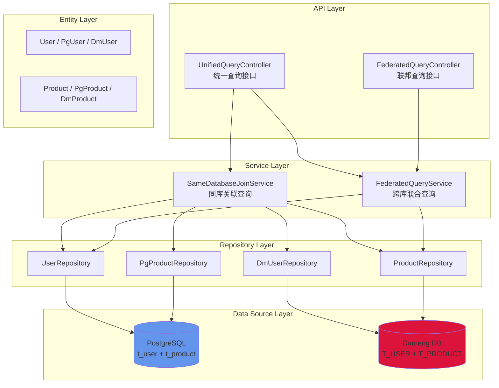

### 2. 实现视图 (Implementation View)

描述系统的代码结构和模块组织。

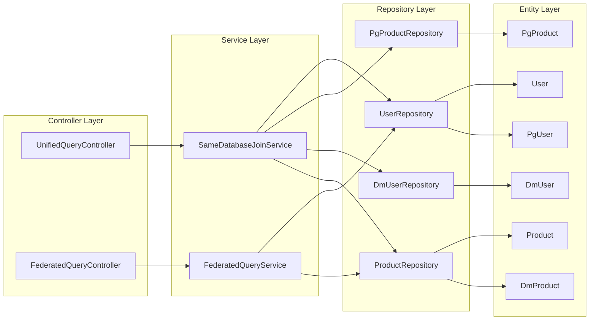

### 3. 进程视图 (Process View)

描述系统的并发和同步机制。

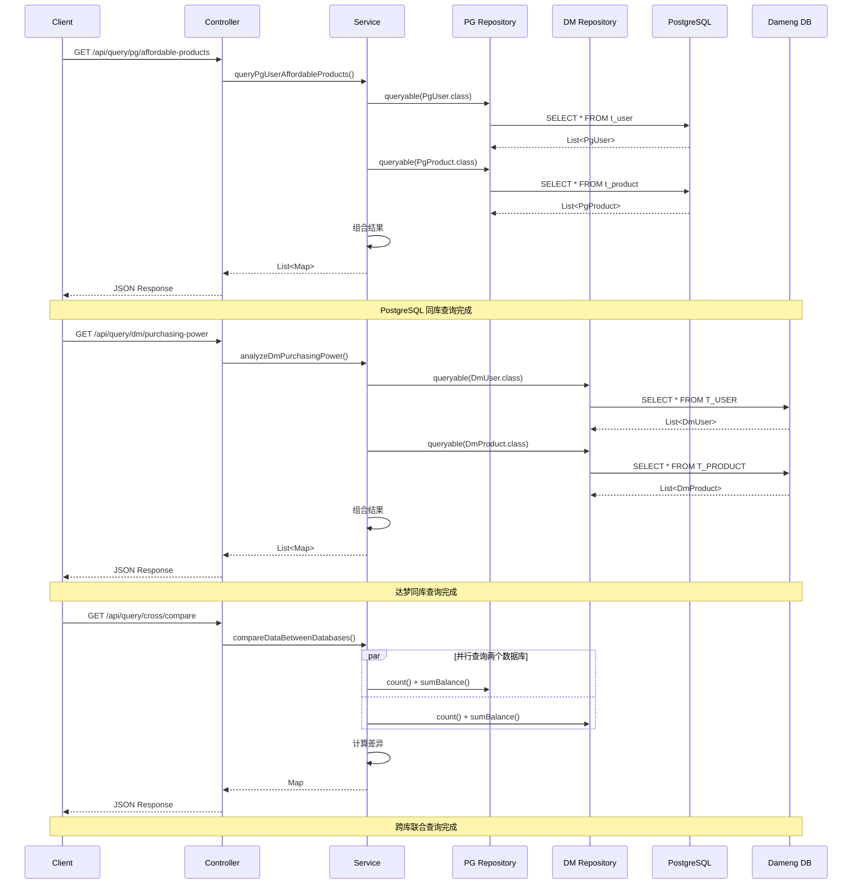

### 4. 部署视图 (Deployment View)

描述系统的物理部署架构。

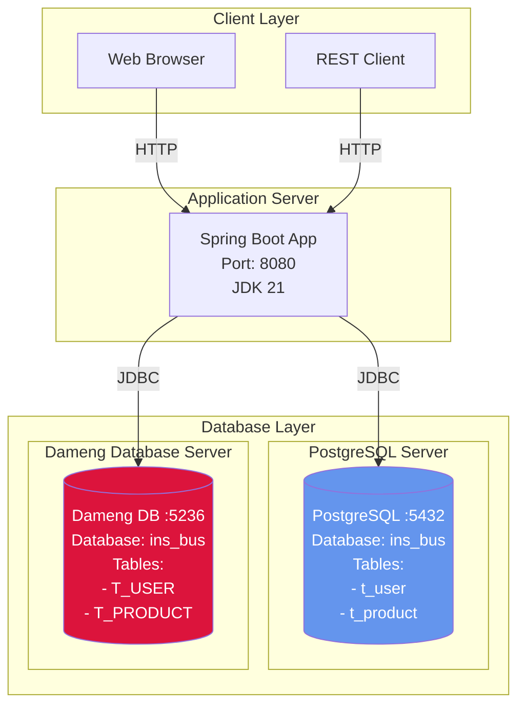

### 5. 用例视图 (Use Case View)

描述系统的功能需求和使用场景。

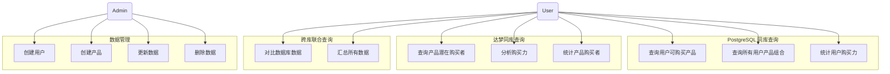

---

## UML 9 图

### 1. 类图 (Class Diagram)

描述系统的静态结构和类之间的关系。

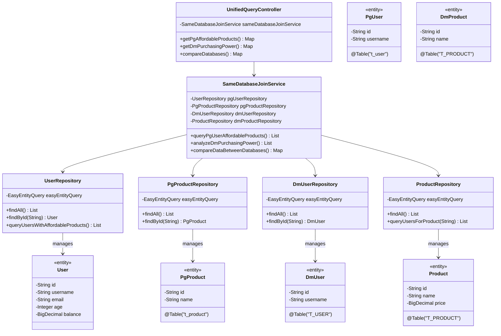

### 2. 对象图 (Object Diagram)

描述系统在特定时刻的对象状态。

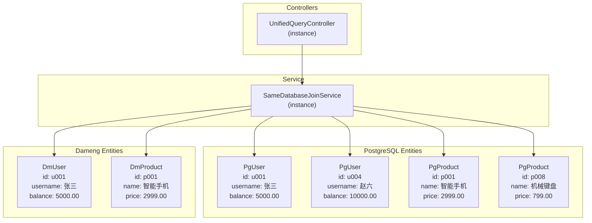

### 3. 用例图 (Use Case Diagram)

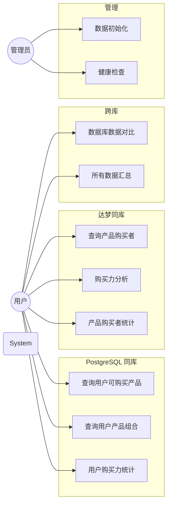

### 4. 序列图 (Sequence Diagram)

描述 PostgreSQL 同库查询的时序交互。

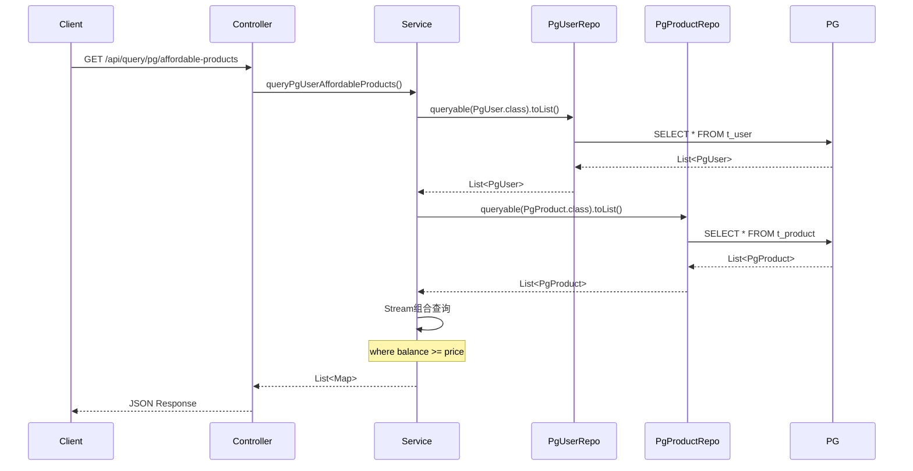

### 5. 活动图 (Activity Diagram)

描述跨库数据对比的业务流程。

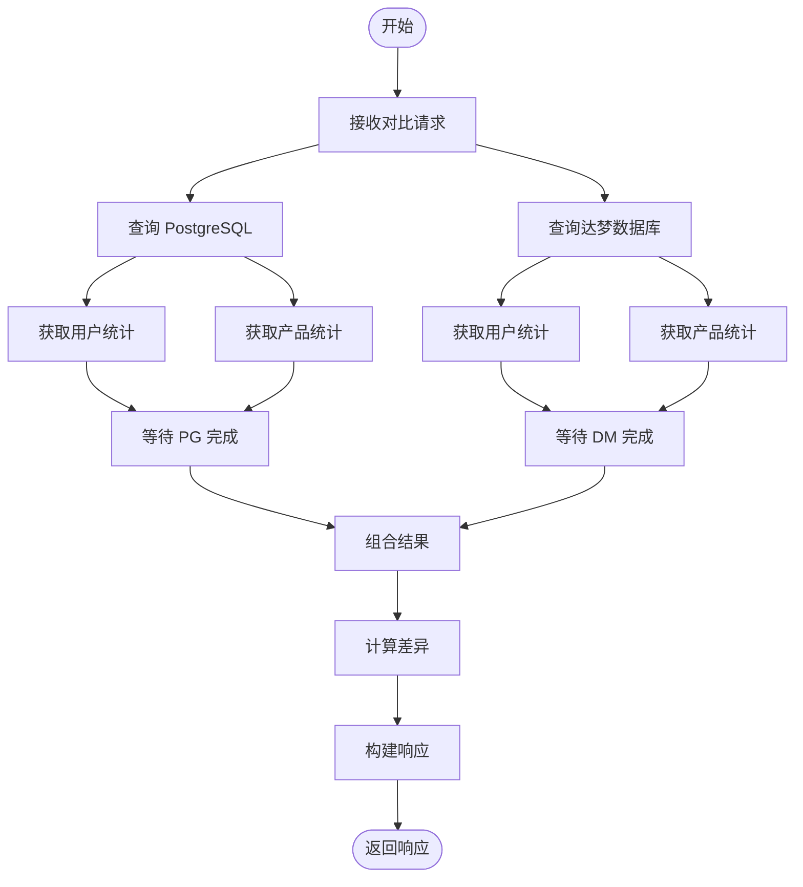

### 6. 协作图 (Communication Diagram)

描述跨库查询的对象间协作。

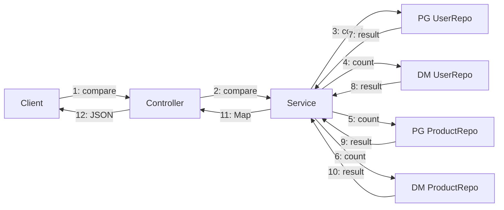

### 7. 状态图 (State Diagram)

描述数据源切换的状态变化。

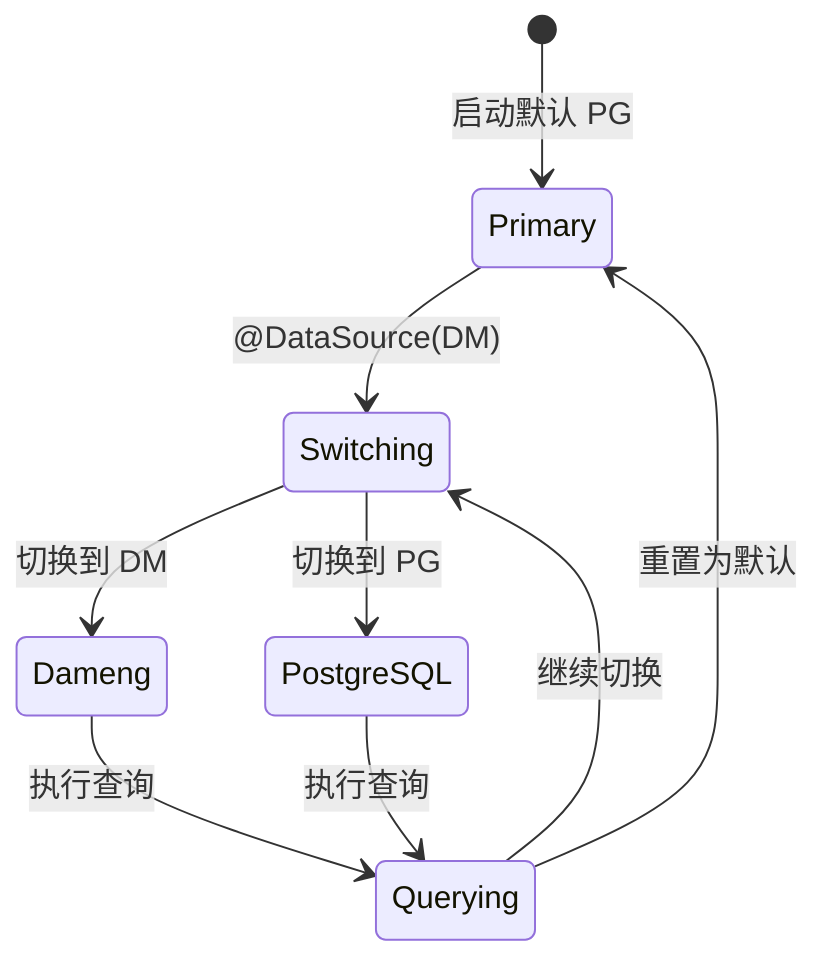

### 8. 组件图 (Component Diagram)

描述系统的物理组件和依赖关系。

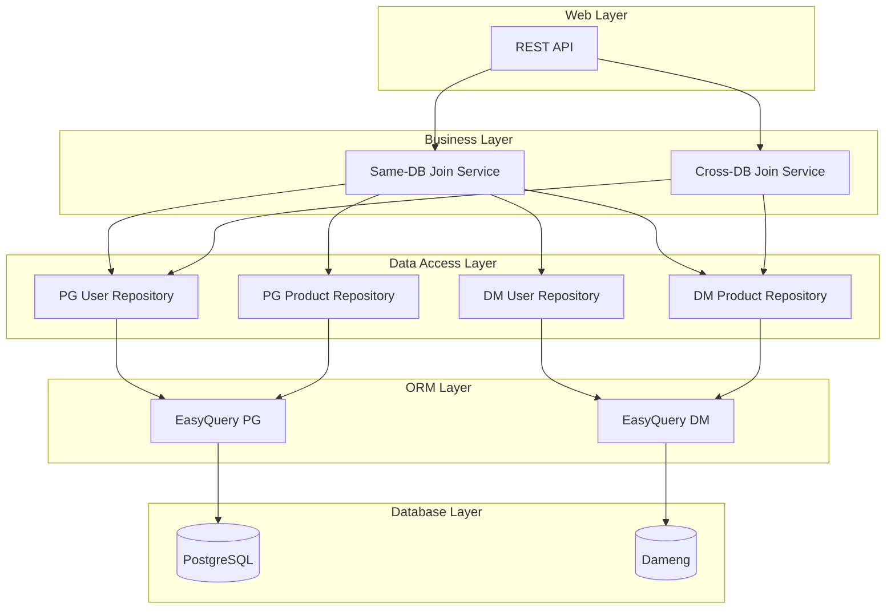

### 9. 部署图 (Deployment Diagram)

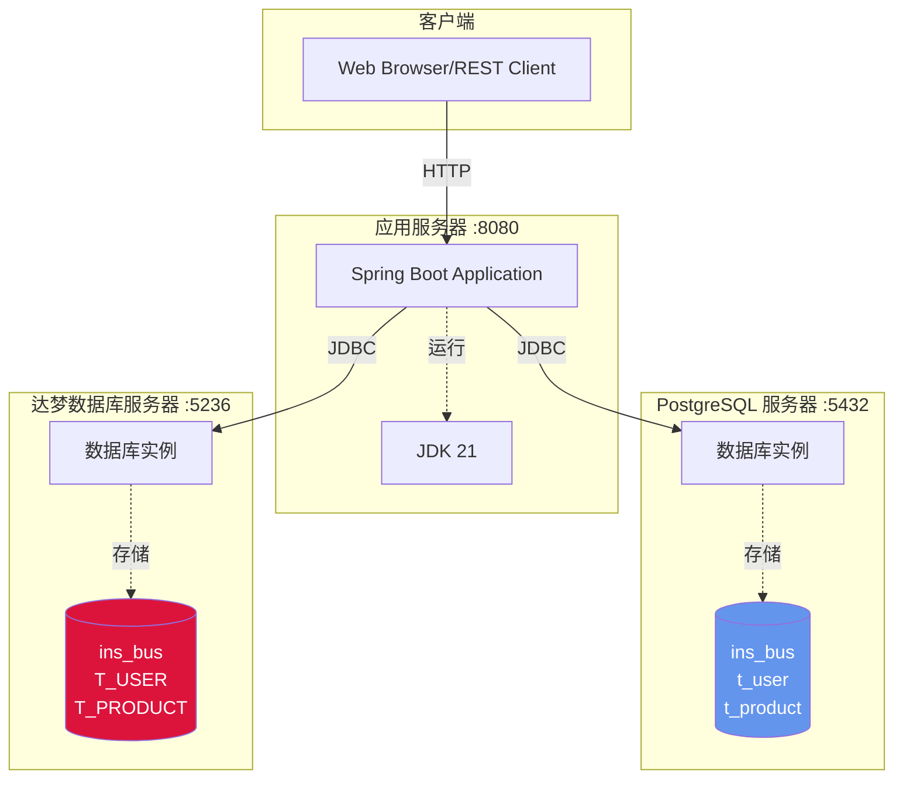

---

## 数据库设计

### 双库双表架构

本项目采用双库双表架构，每个数据库都包含完整的用户和产品表：

| 数据库 | 用户表 | 产品表 | 表名规范 |
|--------|--------|--------|---------|
| **PostgreSQL** | `t_user` | `t_product` | 小写+下划线 |
| **达梦数据库** | `T_USER` | `T_PRODUCT` | 大写+下划线 |

### 表结构设计

#### PostgreSQL 用户表 (t_user)

| 字段名 | 类型 | 约束 | 说明 |
|--------|------|------|------|
| id | VARCHAR(50) | PRIMARY KEY | 用户ID |
| username | VARCHAR(100) | NOT NULL | 用户名 |
| email | VARCHAR(100) | | 邮箱 |
| age | INTEGER | | 年龄 |
| balance | DECIMAL(10,2) | | 余额 |
| create_time | TIMESTAMP | DEFAULT CURRENT_TIMESTAMP | 创建时间 |
| update_time | TIMESTAMP | DEFAULT CURRENT_TIMESTAMP | 更新时间 |

#### PostgreSQL 产品表 (t_product)

| 字段名 | 类型 | 约束 | 说明 |
|--------|------|------|------|
| id | VARCHAR(50) | PRIMARY KEY | 产品ID |
| name | VARCHAR(100) | NOT NULL | 产品名称 |
| description | VARCHAR(500) | | 产品描述 |
| price | DECIMAL(10,2) | NOT NULL | 价格 |
| stock | INTEGER | NOT NULL | 库存 |
| create_time | TIMESTAMP | DEFAULT CURRENT_TIMESTAMP | 创建时间 |
| update_time | TIMESTAMP | DEFAULT CURRENT_TIMESTAMP | 更新时间 |

#### 达梦用户表 (T_USER)

| 字段名 | 类型 | 约束 | 说明 |
|--------|------|------|------|
| ID | VARCHAR(50) | PRIMARY KEY | 用户ID |
| USERNAME | VARCHAR(100) | NOT NULL | 用户名 |
| EMAIL | VARCHAR(100) | | 邮箱 |
| AGE | INTEGER | | 年龄 |
| BALANCE | DECIMAL(10,2) | | 余额 |
| CREATE_TIME | TIMESTAMP | DEFAULT CURRENT_TIMESTAMP | 创建时间 |
| UPDATE_TIME | TIMESTAMP | DEFAULT CURRENT_TIMESTAMP | 更新时间 |

#### 达梦产品表 (T_PRODUCT)

| 字段名 | 类型 | 约束 | 说明 |
|--------|------|------|------|
| ID | VARCHAR(50) | PRIMARY KEY | 产品ID |
| NAME | VARCHAR(100) | NOT NULL | 产品名称 |
| DESCRIPTION | VARCHAR(500) | | 产品描述 |
| PRICE | DECIMAL(10,2) | NOT NULL | 价格 |
| STOCK | INTEGER | NOT NULL | 库存 |
| CREATE_TIME | TIMESTAMP | DEFAULT CURRENT_TIMESTAMP | 创建时间 |
| UPDATE_TIME | TIMESTAMP | DEFAULT CURRENT_TIMESTAMP | 更新时间 |

### 索引设计

#### PostgreSQL 索引

```sql
-- 用户表索引
CREATE INDEX idx_pg_username ON t_user(username);
CREATE INDEX idx_pg_email ON t_user(email);
CREATE INDEX idx_pg_age ON t_user(age);
CREATE INDEX idx_pg_balance ON t_user(balance);

-- 产品表索引
CREATE INDEX idx_pg_product_name ON t_product(name);
CREATE INDEX idx_pg_product_price ON t_product(price);
CREATE INDEX idx_pg_product_stock ON t_product(stock);
```

#### 达梦索引

```sql
-- 用户表索引
CREATE INDEX idx_dm_username ON T_USER(USERNAME);
CREATE INDEX idx_dm_email ON T_USER(EMAIL);
CREATE INDEX idx_dm_age ON T_USER(AGE);
CREATE INDEX idx_dm_balance ON T_USER(BALANCE);

-- 产品表索引
CREATE INDEX idx_dm_product_name ON T_PRODUCT(NAME);
CREATE INDEX idx_dm_product_price ON T_PRODUCT(PRICE);
CREATE INDEX idx_dm_product_stock ON T_PRODUCT(STOCK);
```

---

## 快速开始

### 前置条件

- JDK 21+
- Maven 3.9+
- PostgreSQL 数据库（本地或通过 SSH 隧道）
- 达梦数据库（本地或通过 SSH 隧道）

### 1. 克隆项目

```bash
git clone <repository-url>
cd easy-query-demo
```

### 2. 配置数据源

编辑 `src/main/resources/application-datasource.properties`：

```properties
# PostgreSQL 配置
spring.datasource.pg.jdbc-url=jdbc:postgresql://localhost:5432/ins_bus
spring.datasource.pg.username=postgres
spring.datasource.pg.password=your_password
spring.datasource.pg.driver-class-name=org.postgresql.Driver

# 达梦数据库配置
spring.datasource.dm.jdbc-url=jdbc:dm://localhost:5236/ins_bus
spring.datasource.dm.username=ins_bus
spring.datasource.dm.password=your_password
spring.datasource.dm.driver-class-name=dm.jdbc.driver.DmDriver
```

### 3. 初始化数据库

#### 方式一：使用脚本（推荐）

**仅初始化 PostgreSQL：**
```bash
cd database-init
./init-postgres-only.sh
```

**初始化 PostgreSQL + 达梦：**
```bash
cd database-init
./init-terminus.sh
```

#### 方式二：手动执行 SQL

**PostgreSQL：**
```bash
psql -h localhost -p 5432 -U postgres -d ins_bus -f database-init/sql/01-init-postgresql.sql
```

**达梦数据库：**
```bash
disql SYSDBA/SYSDBA@localhost:5236 \`database-init/sql/02-init-dameng.sql\`
```

### 4. 编译项目

```bash
# 编译项目（使用 Java 21 + Lombok edge release）
mvn clean compile

# 或者完整构建
mvn clean install -DskipTests
```

### 5. 运行应用

```bash
# 使用 Maven
JAVA_HOME=/Library/Java/JavaVirtualMachines/jdk-21.jdk/Contents/Home mvn spring-boot:run

# 或运行打包后的 JAR
java -jar target/easy-query-demo-0.0.1-SNAPSHOT.jar
```

### 6. 验证安装

```bash
# 健康检查
curl http://localhost:8080/api/query/health

# API 信息
curl http://localhost:8080/api/query/info
```

---

## 数据库配置

### PostgreSQL 配置

#### 安装

```bash
# macOS
brew install postgresql@16
brew services start postgresql@16

# Ubuntu
sudo apt-get install postgresql-16
sudo systemctl start postgresql

# Windows
# 下载安装包：https://www.postgresql.org/download/windows/
```

#### 创建数据库和用户

```sql
-- 连接到 PostgreSQL
psql -U postgres

-- 创建数据库
CREATE DATABASE ins_bus;

-- 创建用户（可选）
CREATE USER easy_query WITH PASSWORD 'easy_query';
GRANT ALL PRIVILEGES ON DATABASE ins_bus TO easy_query;

-- 退出
\q
```

#### 配置连接

```properties
# application-datasource.properties
spring.datasource.pg.jdbc-url=jdbc:postgresql://localhost:5432/ins_bus
spring.datasource.pg.username=postgres
spring.datasource.pg.password=postgres
spring.datasource.pg.driver-class-name=org.postgresql.Driver

# 连接池配置（可选）
spring.datasource.pg.hikari.minimum-idle=5
spring.datasource.pg.hikari.maximum-pool-size=20
spring.datasource.pg.hikari.connection-timeout=30000
spring.datasource.pg.hikari.idle-timeout=600000
spring.datasource.pg.hikari.max-lifetime=1800000
```

### 达梦数据库配置

#### 安装

```bash
# 下载达梦数据库安装包
# https://www.dameng.com/list_103.html

# Linux 安装示例
mount -o loop dm8_setup.rpm /mnt
cd /mnt
./DMInstall.bin -i

# 或使用 Docker（如有镜像）
docker run -d --name dm8 \
  -p 5236:5236 \
  -e PAGE_SIZE=16 \
  -e EXTENT_SIZE=32 \
  -e LOG_SIZE=256 \
  dameng/dm8:latest
```

#### 创建数据库和用户

```sql
-- 连接到达梦数据库
disql SYSDBA/SYSDBA

-- 创建表空间
CREATE TABLESPACE ins_bus_ts DATAFILE 'ins_bus_ts.dbf' SIZE 100;

-- 创建用户
CREATE USER ins_bus IDENTIFIED BY "Insbus123456!";
GRANT RESOURCE, PUBLIC, SVI_CONTEXT, SOI TO ins_bus;

-- 创建数据库
CREATE DATABASE ins_bus
    DATAFILE 'ins_bus.dbf' SIZE 100
    TABLESPACE ins_bus_ts;

-- 授权
GRANT ALL ON DATABASE ins_bus TO ins_bus;

-- 退出
exit;
```

#### 配置连接

```properties
# application-datasource.properties
spring.datasource.dm.jdbc-url=jdbc:dm://localhost:5236/ins_bus
spring.datasource.dm.username=ins_bus
spring.datasource.dm.password=Insbus123456!
spring.datasource.dm.driver-class-name=dm.jdbc.driver.DmDriver

# 连接池配置（可选）
spring.datasource.dm.hikari.minimum-idle=5
spring.datasource.dm.hikari.maximum-pool-size=20
spring.datasource.dm.hikari.connection-timeout=30000
spring.datasource.dm.hikari.idle-timeout=600000
spring.datasource.dm.hikari.max-lifetime=1800000
```

### 通过 Terminus SSH 隧道连接

如果数据库在远程服务器上，可以通过 Terminus 建立 SSH 隧道：

```bash
# Terminus 配置
# 本地端口转发到远程数据库
localhost:5432 -> remote:5432  (PostgreSQL)
localhost:5236 -> remote:5236  (达梦数据库)

# 验证端口转发
netstat -an | grep -E "5432|5236" | grep LISTEN
```

---

## API 接口文档

### 基础信息

- **Base URL**: `http://localhost:8080`
- **Content-Type**: `application/json`
- **字符编码**: `UTF-8`

### 一、PostgreSQL 同库联合查询

在 PostgreSQL 数据库内关联 `t_user` 和 `t_product` 表。

#### 1.1 用户可购买的产品

```http
GET /api/query/pg/affordable-products
```

查询条件：用户余额 >= 产品价格

**响应示例：**
```json
{
  "source": "PostgreSQL",
  "queryType": "同库联合查询 (t_user + t_product)",
  "success": true,
  "data": [
    {
      "userId": "5",
      "username": "lisi",
      "userBalance": 8000.00,
      "productId": "6",
      "productName": "Magic Keyboard",
      "productPrice": 899.00,
      "remainingBalance": 7101.00
    }
  ],
  "count": 1
}
```

#### 1.2 所有用户产品组合

```http
GET /api/query/pg/all-combinations
```

#### 1.3 用户购买力统计

```http
GET /api/query/pg/user-purchasing-stats
```

### 二、达梦同库联合查询

在达梦数据库内关联 `T_USER` 和 `T_PRODUCT` 表。

#### 2.1 产品潜在购买者

```http
GET /api/query/dm/product/{productId}/buyers
```

**路径参数：**
- `productId` - 产品ID

**响应示例：**
```json
{
  "source": "Dameng",
  "queryType": "同库联合查询 (T_USER + T_PRODUCT)",
  "productId": "1",
  "success": true,
  "data": [
    {
      "userId": "7",
      "username": "zhaoliu",
      "userBalance": 15001.00,
      "productId": "1",
      "productName": "iPhone 15",
      "productPrice": 5999.00,
      "remainingBalance": 9002.00,
      "canAfford": true,
      "affordabilityRatio": 2.50
    }
  ],
  "buyerCount": 1
}
```

#### 2.2 购买力分析

```http
GET /api/query/dm/purchasing-power
```

#### 2.3 产品购买者统计

```http
GET /api/query/dm/product-buyer-stats
```

### 三、跨库联合查询

PostgreSQL 与达梦数据库之间的数据关联。

#### 3.1 数据库对比

```http
GET /api/query/cross/compare
```

**响应示例：**
```json
{
  "source": "PostgreSQL + Dameng",
  "queryType": "跨库联合查询",
  "success": true,
  "data": {
    "postgresql": {
      "database": "PostgreSQL",
      "userCount": 8,
      "productCount": 10,
      "userSumBalance": 35750.75,
      "productTotalValue": 31781.00
    },
    "dameng": {
      "database": "Dameng",
      "userCount": 8,
      "productCount": 10,
      "userSumBalance": 35762.75,
      "productTotalValue": 31781.00
    },
    "comparison": {
      "userCountDiff": 0,
      "productCountDiff": 0,
      "hasDataInBoth": true,
      "dataSyncStatus": "DIFFERENT"
    },
    "timestamp": 1704727234567
  }
}
```

#### 3.2 所有数据汇总

```http
GET /api/query/cross/all-results
```

### 四、辅助接口

#### 4.1 健康检查

```http
GET /api/query/health
```

#### 4.2 指定数据库健康检查

```http
GET /api/query/health/{databaseType}
```

**路径参数：**
- `databaseType` - `pg` 或 `dm`

#### 4.3 API 说明

```http
GET /api/query/info
```

返回所有可用的 API 类型说明。

---

## 开发指南

### 项目依赖

核心 Maven 依赖：

```xml
<!-- Easy Query 核心 -->
<dependency>
    <groupId>com.easy-query</groupId>
    <artifactId>sql-api-proxy</artifactId>
    <version>2.8.16</version>
</dependency>

<!-- PostgreSQL 方言 -->
<dependency>
    <groupId>com.easy-query</groupId>
    <artifactId>sql-pgsql</artifactId>
    <version>2.8.16</version>
</dependency>

<!-- 达梦数据库方言 -->
<dependency>
    <groupId>com.easy-query</groupId>
    <artifactId>sql-dameng</artifactId>
    <version>2.8.16</version>
</dependency>

<!-- Spring AOP -->
<dependency>
    <groupId>org.springframework.boot</groupId>
    <artifactId>spring-boot-starter-aop</artifactId>
    <version>3.2.0</version>
</dependency>

<!-- Lombok -->
<dependency>
    <groupId>org.projectlombok</groupId>
    <artifactId>lombok</artifactId>
    <version>edge-SNAPSHOT</version>
</dependency>
```

### 实体开发模式

#### 1. 创建数据库特定实体

```java
// PostgreSQL 实体（小写表名）
@Data
@EntityProxy
@Table("t_user")
public class PgUser implements ProxyEntityAvailable<PgUser, PgUserProxy> {
    @Column(primaryKey = true)
    private String id;
    private String username;
    // ... 其他字段
}

// 达梦实体（大写表名）
@Data
@EntityProxy
@Table("T_USER")
public class DmUser implements ProxyEntityAvailable<DmUser, DmUserProxy> {
    @Column(primaryKey = true)
    private String id;
    private String username;
    // ... 其他字段
}
```

#### 2. 编译生成代理类

```bash
mvn clean compile
```

编译后会在 `target/generated-sources/annotations/` 下生成对应的代理类。

### Repository 开发模式

#### 基础 CRUD 操作

```java
@Repository
@RequiredArgsConstructor
public class UserRepository {

    private final EasyEntityQuery easyEntityQuery;

    // 查询所有
    public List<User> findAll() {
        return easyEntityQuery.queryable(User.class).toList();
    }

    // 条件查询
    public List<User> findByAgeBetween(Integer min, Integer max) {
        return easyEntityQuery.queryable(User.class)
                .where(u -> u.age().between(min, max))
                .toList();
    }

    // 聚合查询
    public BigDecimal sumBalance() {
        return easyEntityQuery.queryable(User.class)
                .sumOrNull(u -> u.balance());
    }

    // 分页查询
    public List<User> findByPage(int page, int size) {
        return easyEntityQuery.queryable(User.class)
                .orderBy(u -> u.id().asc())
                .skip((long) (page - 1) * size)
                .limit(size)
                .toList();
    }
}
```

#### 原生 JOIN 查询（数据库级别关联）

使用 Easy Query 的原生 `leftJoin` + `select` 语法，在数据库层面执行 JOIN 操作：

```java
/**
 * 查询用户及其可购买的产品（余额 >= 产品价格）
 * 使用 Easy Query 原生 LEFT JOIN 语法在数据库层面实现关联查询
 */
public List<UserProductDTO> queryUsersWithAffordableProducts() {
    return easyEntityQuery.queryable(PgUser.class)
            .leftJoin(PgProduct.class, (u, p) -> u.balance().ge(p.price()))
            .select((u, p) -> {
                UserProductDTOProxy r = new UserProductDTOProxy();
                r.userId().set(u.id());
                r.username().set(u.username());
                r.userBalance().set(u.balance());
                r.productId().set(p.id());
                r.productName().set(p.name());
                r.productPrice().set(p.price());
                r.remainingBalance().set(u.balance().subtract(p.price()));
                r.canAfford().set(true);
                return r;
            })
            .toList();
}
```

**生成的 SQL：**
```sql
SELECT u.id, u.username, u.balance, p.id, p.name, p.price,
       (u.balance - p.price) AS remaining_balance,
       TRUE AS can_afford
FROM t_user u
LEFT JOIN t_product p ON u.balance >= p.price
```

#### DTO 定义规范

使用 `@EntityProxy` 和 `@FieldNameConstants` 注解：

```java
@Data
@FieldNameConstants
@EntityProxy
public class UserProductDTO implements ProxyEntityAvailable<UserProductDTO, UserProductDTOProxy> {
    private String userId;
    private String username;
    private BigDecimal userBalance;
    private String productId;
    private String productName;
    private BigDecimal productPrice;
    private BigDecimal remainingBalance;
    private Boolean canAfford;
}
```

编译后自动生成 `UserProductDTOProxy` 代理类，用于类型安全的查询构建。

### 动态数据源切换

#### 使用 @DataSource 注解

```java
@Service
public class DynamicDataSourceService {

    @DataSource(DataSourceType.POSTGRESQL)
    public List<User> queryFromPostgreSQL() {
        // 这个方法会自动使用 PostgreSQL 数据源
        return userRepository.findAll();
    }

    @DataSource(DataSourceType.DAMENG)
    public List<User> queryFromDameng() {
        // 这个方法会自动使用达梦数据库
        return dmUserRepository.findAll();
    }
}
```

#### AOP 实现原理

```java
@Aspect
@Component
public class DataSourceAspect {

    @Around("@annotation(DataSource)")
    public Object around(ProceedingJoinPoint joinPoint) throws Throwable {
        DataSource dataSource = joinPoint.getSignature()
                .getMethod()
                .getAnnotation(DataSource.class);

        try {
            // 切换数据源
            DataSourceContextHolder.setDataSourceType(dataSource.value());
            return joinPoint.proceed();
        } finally {
            // 清理数据源
            DataSourceContextHolder.clearDataSourceType();
        }
    }
}
```

### 并行查询最佳实践

```java
@Service
@RequiredArgsConstructor
public class FederatedQueryService {

    private final ExecutorService executorService = Executors.newFixedThreadPool(2);

    public Map<String, Object> queryCrossDatabaseStatistics() {
        // 并行查询 PostgreSQL
        CompletableFuture<Map<String, Object>> pgFuture = CompletableFuture.supplyAsync(() -> {
            Map<String, Object> stats = new HashMap<>();
            stats.put("userCount", pgUserRepository.count());
            stats.put("totalBalance", pgUserRepository.sumBalance());
            return stats;
        }, executorService);

        // 并行查询达梦
        CompletableFuture<Map<String, Object>> dmFuture = CompletableFuture.supplyAsync(() -> {
            Map<String, Object> stats = new HashMap<>();
            stats.put("productCount", dmProductRepository.count());
            stats.put("totalValue", dmProductRepository.sumTotalValue());
            return stats;
        }, executorService);

        // 等待两个查询完成
        CompletableFuture.allOf(pgFuture, dmFuture).join();

        // 组合结果
        Map<String, Object> result = new HashMap<>();
        result.put("postgresql", pgFuture.get());
        result.put("dameng", dmFuture.get());
        return result;
    }
}
```

### 运行测试

```bash
# 运行所有测试
JAVA_HOME=/Library/Java/JavaVirtualMachines/jdk-21.jdk/Contents/Home mvn test

# 运行特定测试类
JAVA_HOME=/Library/Java/JavaVirtualMachines/jdk-21.jdk/Contents/Home mvn test -Dtest=FederatedQueryServiceTest

# 运行特定测试方法
JAVA_HOME=/Library/Java/JavaVirtualMachines/jdk-21.jdk/Contents/Home mvn test -Dtest=FederatedQueryServiceTest#testQueryUserProductCrossJoin
```

---

## 常见问题

### 1. 编译失败：找不到代理类

**问题：** 编译时报错找不到 `PgUserProxy`、`DmProductProxy` 等类

**解决方案：**

1. 确保实体类添加了 `@EntityProxy` 注解
2. 检查 `ProxyEntityAvailable` 接口使用的代理类路径是否正确
3. 执行 `mvn clean compile` 重新生成代理类

```bash
# 清理并重新编译
JAVA_HOME=/Library/Java/JavaVirtualMachines/jdk-21.jdk/Contents/Home mvn clean compile
```

### 2. 数据库连接失败

**问题：** `Connection refused` 或 `password authentication failed`

**解决方案：**

1. 确认数据库服务已启动
2. 检查端口是否正确（PostgreSQL: 5432, 达梦: 5236）
3. 验证用户名和密码
4. 如果使用 SSH 隧道，确认隧道已建立

```bash
# 检查端口
netstat -an | grep -E "5432|5236" | grep LISTEN
```

### 3. 达梦数据库驱动加载失败

**问题：** `Cannot load driver class: dm.jdbc.driver.DmDriver`

**解决方案：**

1. 确保已添加达梦 JDBC 驱动依赖
2. 将达梦驱动 JAR 包添加到 classpath

```xml
<!-- 检查 pom.xml 中是否有达梦驱动 -->
<dependency>
    <groupId>com.easy-query</groupId>
    <artifactId>sql-dameng</artifactId>
</dependency>
```

### 4. 表名或字段名大小写问题

**问题：** 达梦数据库查询时报错表不存在

**解决方案：**

达梦数据库默认使用大写表名，确保实体类的 `@Table` 注解使用大写：

```java
// 正确：达梦使用大写
@Table("T_USER")
public class DmUser { ... }

// 正确：PostgreSQL 使用小写
@Table("t_user")
public class PgUser { ... }
```

### 5. 跨库查询性能慢

**问题：** 并行查询比同步查询更慢

**解决方案：**

1. 调整线程池大小
2. 检查数据库连接池配置
3. 确保数据库有足够的连接数

```java
// 调整线程池大小
private final ExecutorService executorService = Executors.newFixedThreadPool(
    Runtime.getRuntime().availableProcessors()
);
```

### 6. @DataSource 注解不生效

**问题：** 使用 @DataSource 注解后数据源没有切换

**解决方案：**

1. 确保使用了正确的 DataSourceType 枚举值
2. 检查 AOP 配置是否正确
3. 确保方法被 Spring 代理（不是 private 方法）

```java
// 正确用法
@DataSource(DataSourceType.POSTGRESQL)
public List<User> queryUsers() { ... }

// 错误用法：private 方法不会被代理
@DataSource(DataSourceType.POSTGRESQL)
private List<User> queryUsers() { ... }
```

---

## 许可证

MIT License

---

## 更新日志

### v1.2.0 (2025-01-14)

- 重构关联查询为**原生 Easy Query JOIN 语法**
  - 使用 `leftJoin` + `select` 在数据库层面执行 JOIN 操作
  - PostgreSQL 和达梦数据库均使用原生 JOIN 语法
  - 新增数据库专用 DTO 支持：
    - PostgreSQL: UserProductDTO, UserProductStatsDTO, ProductBuyerStatsDTO
    - 达梦: DmUserProductDTO, DmProductBuyerStatsDTO
  - APT 自动生成 DTO 代理类，提供类型安全的查询 API
  - 性能优化：数据库级别的 JOIN 替代内存 Stream 操作
  - 更新 Service 和 Controller 层使用强类型 DTO

### v1.1.0 (2025-01-14)

- 新增双库双表架构
- 新增三种查询模式（PG 同库、DM 同库、跨库）
- 新增动态数据源切换功能
- 新增数据库函数适配器
- 完善 API 接口文档

### v1.0.0 (2024-12-01)

- 初始版本
- 多数据源基础功能
- 并行查询优化

---

**最后更新**: 2025-01-14
